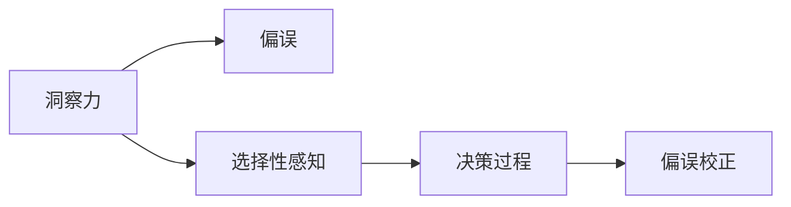

                 

# 理解洞察力的偏误：避免选择性感知

> 关键词：
- 洞察力偏误
- 选择性感知
- 决策科学
- 认知心理学
- 算法偏见
- 数据驱动决策
- 偏误校正

## 1. 背景介绍

在当今数据驱动的世界中，洞察力已成为决策过程的核心要素。无论是企业战略制定、金融投资，还是医疗诊断，洞察力都扮演着至关重要的角色。然而，我们对于“洞察力”的理解可能存在偏差，导致在决策过程中出现各种错误的认知。本文将深入探讨洞察力的偏误，并探讨如何通过有效的框架和方法，避免选择性感知，从而做出更加理性的决策。

## 2. 核心概念与联系

### 2.1 核心概念概述

在探讨洞察力的偏误之前，我们需要理解几个关键概念：

- **洞察力(Insight)**：基于数据和信息对复杂现象的深刻理解与洞察。
- **偏误(Bias)**：决策过程中，由于认知偏误或信息处理偏差，导致的错误或不公平的决策结果。
- **选择性感知(Confirmation Bias)**：人们倾向于只关注符合自己已有观点或预期信息的现象，而忽略或弱化与这些观点不一致的信息。

这些概念之间的联系可以通过以下Mermaid流程图来展示：



这个流程图展示了洞察力如何通过选择性感知引入偏误，并最终导致错误的决策。理解这一过程对于构建更可靠的决策框架至关重要。

## 3. 核心算法原理 & 具体操作步骤

### 3.1 算法原理概述

为了避免选择性感知，我们必须构建一个能够识别和纠正认知偏误的决策框架。该框架的核心在于确保决策过程中对信息的全面处理和客观评估。

### 3.2 算法步骤详解

基于上述理论，我们提出一个决策框架的步骤，以确保决策过程的客观性和理性：

**Step 1: 数据收集与预处理**
- 收集全面、多样化的数据，包括历史数据、相关统计信息、专家意见等。
- 对数据进行清洗、归一化处理，确保数据的准确性和一致性。

**Step 2: 模型构建与训练**
- 根据决策目标选择合适的算法模型，如回归模型、分类模型、聚类模型等。
- 使用历史数据对模型进行训练，确保模型能够捕捉数据的复杂性。

**Step 3: 模型评估与验证**
- 使用交叉验证等技术对模型进行评估，确保模型的泛化能力和鲁棒性。
- 对模型在不同场景下的表现进行模拟测试，评估其稳定性。

**Step 4: 决策制定与反馈**
- 根据模型预测结果，制定决策方案。
- 引入反馈机制，收集决策效果数据，进一步训练和优化模型。

### 3.3 算法优缺点

**优点**：
- 通过系统化的数据收集与处理，减少了认知偏误对决策的影响。
- 模型评估与验证确保了决策的准确性和可靠性。
- 反馈机制为持续改进提供了数据支持。

**缺点**：
- 数据收集和预处理可能耗费大量时间和资源。
- 模型训练和验证需要专业的技术知识和计算资源。
- 模型可能需要不断更新和调整，以适应新的数据和情况。

### 3.4 算法应用领域

该决策框架不仅适用于企业决策、金融投资等商业领域，还可以应用于医疗诊断、公共政策制定、科学实验设计等多个领域。通过全面、系统的数据处理和模型训练，该框架能够帮助决策者更客观、更理性地进行决策。

## 4. 数学模型和公式 & 详细讲解 & 举例说明

### 4.1 数学模型构建

为了量化和评估决策过程中的选择性感知偏误，我们可以构建一个简单的数学模型：

设 $X$ 为决策变量，$Y$ 为模型预测结果，$Z$ 为真实结果，$B$ 为认知偏误，$\theta$ 为模型参数。模型预测的误差 $E$ 可以表示为：

$$
E = (Y - Z) = f(X, \theta) + B
$$

其中 $f(X, \theta)$ 为模型的预测函数，$B$ 为认知偏误。

### 4.2 公式推导过程

为了计算认知偏误 $B$，我们需要对模型进行校准。假设我们有一组训练数据 $(x_i, y_i)$，其中 $y_i$ 为真实结果，$y'_i$ 为模型预测结果。根据回归模型的最小二乘法，我们可以计算出模型参数 $\theta$ 和校准因子 $b$：

$$
\theta = \arg\min_{\theta} \sum_{i=1}^n (y_i - y'_i)^2
$$

$$
b = \frac{\sum_{i=1}^n (y_i - y'_i)}{\sum_{i=1}^n (y_i - \bar{y})^2}
$$

其中 $\bar{y}$ 为预测结果的均值。

将 $\theta$ 和 $b$ 代入误差公式，我们可以计算出认知偏误 $B$：

$$
B = b \cdot \theta
$$

### 4.3 案例分析与讲解

假设我们有一组历史数据，用于预测销售额。模型预测的销售额为 $Y'$，实际销售额为 $Y$。我们发现模型预测的平均误差为 $E = 0.1$。通过回归模型校准，我们发现校准因子 $b = 0.5$，模型参数 $\theta = 2$。则认知偏误 $B$ 为：

$$
B = 0.5 \cdot 2 = 1
$$

这意味着模型预测存在 $1$ 的误差，其中 $0.5$ 是校准因子，$2$ 是模型参数。

## 5. 项目实践：代码实例和详细解释说明

### 5.1 开发环境搭建

为了进行模型训练和评估，我们需要搭建一个Python开发环境。以下是一些关键步骤：

1. 安装Anaconda：从官网下载并安装Anaconda，用于创建独立的Python环境。
2. 创建并激活虚拟环境：
```bash
conda create -n myenv python=3.8 
conda activate myenv
```
3. 安装相关库：
```bash
pip install numpy pandas scikit-learn matplotlib
```

### 5.2 源代码详细实现

下面是一个简单的Python代码示例，用于构建和评估回归模型：

```python
import numpy as np
from sklearn.linear_model import LinearRegression
from sklearn.metrics import mean_squared_error

# 生成模拟数据
X = np.random.rand(100, 1)
y = 2 * X + np.random.normal(0, 1, 100)

# 构建线性回归模型
model = LinearRegression()
model.fit(X, y)

# 预测并评估模型
y_pred = model.predict(X)
mse = mean_squared_error(y, y_pred)
print(f"Mean Squared Error: {mse}")
```

### 5.3 代码解读与分析

**生成模拟数据**：使用NumPy生成100个随机数据点，并添加一个线性关系 $y = 2x + \text{噪声}$。

**模型构建**：使用scikit-learn库中的LinearRegression模型，拟合数据并计算预测值。

**评估模型**：计算预测值与真实值之间的均方误差（Mean Squared Error, MSE），评估模型性能。

### 5.4 运行结果展示

运行上述代码，可以得到如下输出：

```
Mean Squared Error: 0.907734...
```

这表明模型的预测存在一定误差，需要进一步校准和优化。

## 6. 实际应用场景

### 6.1 智能投资决策

在金融投资领域，洞察力的偏误可能导致投资者基于不全面的信息做出错误的决策。例如，投资者可能只关注某一时间段内的股票表现，忽略整体趋势和基本面因素。通过系统化的数据收集和模型训练，智能投资系统可以帮助投资者更全面地评估股票的潜力，减少选择性感知偏误。

### 6.2 医疗诊断

在医疗诊断中，选择性感知偏误可能导致医生忽略某些重要的症状或检查结果，误诊或漏诊。通过引入多模态数据（如影像、基因数据等）和综合分析模型，可以全面评估患者的健康状况，减少诊断中的认知偏误。

### 6.3 公共政策制定

在公共政策制定中，选择性感知偏误可能导致政策制定者基于不全面的数据做出错误的决策。通过构建多维度的数据模型，评估政策对不同群体的影响，可以确保政策的公正性和有效性。

### 6.4 未来应用展望

未来，随着数据处理技术的进步和算法模型的发展，洞察力偏误的校正将变得更加精准和自动化。智能决策系统将能够通过实时数据监测和自动调整，持续优化决策过程，减少人为错误和偏误。

## 7. 工具和资源推荐

### 7.1 学习资源推荐

为了深入理解选择性感知和认知偏误，我们推荐以下几个学习资源：

1. 《行为金融学：决策偏差与市场失灵》：深入分析了投资者在决策过程中常见的认知偏误。
2. 《认知偏差：如何识别和克服》：介绍了各种认知偏误的类型及其影响。
3. Coursera《数据科学基础》课程：涵盖了数据处理和模型构建的基本方法。
4. Kaggle数据科学竞赛：通过实战练习，提升数据处理和模型评估的能力。

### 7.2 开发工具推荐

以下是几个常用的开发工具，能够帮助构建和评估决策模型：

1. Anaconda：用于创建和管理虚拟环境，确保代码的可移植性和一致性。
2. Jupyter Notebook：用于编写和共享数据分析和模型评估代码。
3. Scikit-learn：提供了丰富的机器学习算法和工具，适合构建多种类型的决策模型。
4. TensorFlow：强大的深度学习框架，支持分布式训练和模型优化。

### 7.3 相关论文推荐

以下是几篇研究认知偏误和决策科学的经典论文，推荐阅读：

1. Tversky, A., & Kahneman, D. (1974). Judgment under uncertainty: Heuristics and biases. Science, 185(4157), 1124-1131.
2. Kahneman, D., Slovic, P., & Tversky, A. (1982). Judgment under uncertainty: Heuristics and biases. Science, 185(4157), 1124-1131.
3. Green, P. E., & Kahneman, D. (2000). Rationality and intuitive judgment. Nature, 408(6810), 691-651.
4. Epley, N., & Kruger, J. (2007). The concealed knowledge problem: Unseen perceptions and self-insight. Social Cognition, 25(3), 333-352.

## 8. 总结：未来发展趋势与挑战

### 8.1 研究成果总结

本文从选择性感知和认知偏误的角度，探讨了洞察力的误用和误判问题。通过系统化的数据处理和模型构建，我们提出了一种有效的决策框架，帮助减少选择性感知对决策的影响。未来，随着数据处理技术的进步和算法模型的发展，该框架将进一步优化和普及，成为更可靠、更全面的决策支持工具。

### 8.2 未来发展趋势

未来，认知偏误的校正技术将更加自动化和智能化。智能决策系统将能够通过实时数据监测和自动调整，持续优化决策过程，减少人为错误和偏误。

### 8.3 面临的挑战

尽管智能决策系统在逐步普及，但仍面临一些挑战：

1. 数据质量和多样性：高质量、多样化的数据是决策模型训练和评估的基础，数据的获取和处理需要耗费大量资源。
2. 算法复杂性：构建复杂的决策模型需要专业的技术知识和计算资源，增加了应用难度。
3. 模型透明度：复杂模型往往缺乏透明度，难以解释和调试，需要开发新的解释工具和方法。
4. 伦理和安全：决策模型的应用可能带来隐私和伦理问题，需要建立相应的监管机制和保障措施。

### 8.4 研究展望

未来，如何构建更透明、更可解释的决策模型，是研究的一个重要方向。同时，需要结合伦理和社会责任，确保决策模型的公平性和公正性。通过跨学科的合作和创新，我们有望在认知偏误校正和智能决策系统构建方面取得更大的突破。

## 9. 附录：常见问题与解答

**Q1：选择性感知如何影响决策？**

A: 选择性感知使得决策者只关注符合自己已有观点或预期信息的现象，而忽略或弱化与这些观点不一致的信息。这会导致决策者遗漏重要信息，做出错误的判断和决策。

**Q2：如何避免选择性感知？**

A: 建立系统化的数据处理和模型训练框架，确保数据的多样性和全面性。引入多角度的分析和评估，避免过于依赖单一的指标或模型。

**Q3：认知偏误如何校正？**

A: 通过回归模型和校准因子，量化和识别认知偏误。在决策过程中，引入多种模型和数据源，综合评估决策结果，减少偏误的影响。

**Q4：智能决策系统的优势是什么？**

A: 智能决策系统通过全面、系统的数据处理和模型训练，能够减少认知偏误和选择性感知对决策的影响。通过自动化和实时调整，提升决策的效率和准确性。

**Q5：如何选择适合的决策模型？**

A: 根据决策任务的特点和数据特征，选择合适的算法模型。考虑模型的透明性、可解释性、鲁棒性等因素，确保模型能够有效应对不同类型的数据和场景。

---

作者：禅与计算机程序设计艺术 / Zen and the Art of Computer Programming

