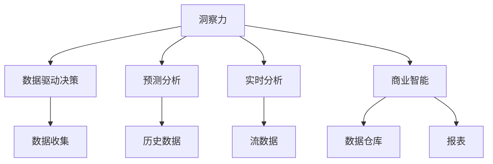

                 

# 理解洞察力的力量：在商业决策中的作用

## 1. 背景介绍

### 1.1 问题由来

在当今这个信息爆炸、快速变化的时代，商业决策面临着前所未有的挑战。传统的数据驱动决策方法，依赖于历史数据和统计模型，难以应对新兴趋势和复杂多变的情况。而洞察力，作为一种更高层次的认知能力，能够帮助企业深入理解市场、客户、竞争环境等关键因素，从而做出更明智、更高效的决策。

### 1.2 问题核心关键点

洞察力在商业决策中的作用主要体现在以下几个方面：

1. **预见性**：洞察力能帮助企业预见市场趋势和客户需求的变化，提前布局，避免被动应对。
2. **精准性**：通过对海量数据的深入分析，洞察力能揭示隐藏在数据背后的深层模式和关联，提高决策的准确性。
3. **创新性**：洞察力能激发新的思路和解决方案，推动企业创新和市场开拓。
4. **应对复杂性**：在面对复杂问题时，洞察力能提供全局视角，帮助企业系统地分析和解决问题。
5. **提升效率**：通过自动化工具和算法，洞察力能显著提升决策的效率和速度。

### 1.3 问题研究意义

研究洞察力在商业决策中的应用，对于提升企业的决策能力和市场竞争力，具有重要意义：

1. **提升决策质量**：洞察力能够提供更全面、更深刻的市场理解，有助于提高决策的科学性和准确性。
2. **降低决策成本**：借助自动化工具和算法，洞察力能够快速生成高质量的洞察报告，减少人工分析的时间和成本。
3. **促进创新**：洞察力揭示的市场和客户需求，能够激发新产品和服务的开发，推动企业的创新发展。
4. **优化资源配置**：洞察力能帮助企业优化资源配置，提升运营效率和利润水平。
5. **增强竞争力**：通过深入理解市场和客户，洞察力有助于企业制定差异化战略，增强市场竞争力。

## 2. 核心概念与联系

### 2.1 核心概念概述

为了更好地理解洞察力在商业决策中的作用，本节将介绍几个关键概念：

- **洞察力(Insight)**：通过深入分析数据，揭示隐藏的模式、关联和趋势的能力。
- **数据驱动决策(Data-Driven Decision Making)**：依赖历史数据和统计模型，进行结构化决策的方法。
- **预测分析(Predictive Analytics)**：利用历史数据和机器学习算法，预测未来趋势和结果的决策方法。
- **实时分析(Real-time Analytics)**：利用流数据和实时计算技术，对实时数据进行分析和决策的方法。
- **商业智能(Business Intelligence, BI)**：通过数据仓库、数据挖掘和报表工具，帮助企业洞察数据并支持决策的方法。

这些概念之间的逻辑关系可以通过以下Mermaid流程图来展示：



这个流程图展示了各个概念之间的联系：

1. 洞察力通过对数据进行深入分析，揭示模式和关联，支持数据驱动决策。
2. 预测分析利用历史数据和算法，预测未来趋势，补充数据驱动决策。
3. 实时分析对实时数据进行快速分析，提供即时的决策支持。
4. 商业智能通过数据仓库、报表工具，实现数据的系统化管理和展示。

## 3. 核心算法原理 & 具体操作步骤

### 3.1 算法原理概述

洞察力在商业决策中的应用，本质上是利用数据挖掘和机器学习算法，从海量数据中提取有价值的信息和洞见。其核心算法包括：

1. **关联规则学习**：通过分析不同特征之间的关联，揭示隐藏的关联模式。
2. **聚类分析**：将相似的数据点分组，发现数据集中的自然结构。
3. **分类算法**：通过分类任务，识别数据的类别和属性。
4. **预测模型**：利用历史数据，预测未来趋势和结果。
5. **自然语言处理(NLP)**：分析文本数据，提取和理解文本中的情感和语义信息。

这些算法通过结合多种技术和工具，对数据进行深入分析，生成洞察报告，供决策者参考。

### 3.2 算法步骤详解

基于洞察力在商业决策中的应用，其操作步骤一般包括：

**Step 1: 数据准备**
- 收集相关的业务数据，包括历史交易数据、客户行为数据、市场环境数据等。
- 清洗和预处理数据，去除噪声和异常值，确保数据的质量和一致性。

**Step 2: 数据探索与分析**
- 使用数据可视化工具，对数据进行初步探索和分析，识别数据的基本特征和分布情况。
- 利用统计分析方法，计算数据的中心趋势、离散程度等指标。
- 应用数据挖掘技术，如关联规则、聚类分析等，发现数据集中的隐藏模式和关联。

**Step 3: 建模与预测**
- 选择合适的模型和算法，建立预测模型，如回归模型、分类模型、时间序列模型等。
- 利用训练数据集训练模型，生成预测结果。
- 验证模型的性能，通过交叉验证、混淆矩阵等方法评估模型的准确性和鲁棒性。

**Step 4: 洞察报告生成**
- 将分析结果和预测结果整合，生成洞察报告。
- 利用自然语言处理技术，自动生成报告文本，提高报告的易读性。
- 使用数据可视化工具，生成图表和仪表盘，帮助决策者直观理解数据和洞察。

**Step 5: 决策支持**
- 将洞察报告反馈给业务决策者，支持决策过程。
- 利用自动化工具和算法，动态调整模型参数，实时更新预测结果。
- 定期复审和迭代洞察模型，确保其持续有效。

### 3.3 算法优缺点

基于洞察力在商业决策中的应用，其算法具有以下优点：

1. **深度挖掘**：通过数据挖掘和机器学习，能够深入挖掘数据的潜在价值，提供更全面的市场和客户洞察。
2. **快速反应**：利用实时分析和预测模型，能够快速生成洞察报告，支持即时决策。
3. **灵活性高**：算法模型可以根据业务需求进行灵活调整，适应不同的商业场景。
4. **自动化程度高**：利用自动化工具和算法，减少了人工分析的时间和成本。

同时，这些算法也存在一定的局限性：

1. **数据质量要求高**：算法的效果很大程度上依赖于数据的质量和完整性，数据噪声和缺失值可能会影响结果的准确性。
2. **模型复杂度较高**：构建和调整复杂的模型需要较高的技术门槛和计算资源。
3. **解释性不足**：某些高级算法如深度学习，其决策过程难以解释，缺乏透明度。
4. **适用性有限**：对于复杂的、非结构化的数据，可能无法直接应用现有的算法。

尽管存在这些局限性，但就目前而言，基于洞察力的数据挖掘和机器学习算法，已成为商业决策中的重要工具，得到了广泛的应用。未来相关研究的重点在于如何进一步提升算法的准确性和可解释性，以及更好地应对复杂数据和业务需求。

### 3.4 算法应用领域

基于洞察力在商业决策中的应用，其算法在多个领域得到了广泛的应用，例如：

- **零售行业**：通过分析客户购买行为和市场趋势，优化库存管理，提升销售业绩。
- **金融行业**：利用交易数据和市场环境，进行风险评估和投资决策。
- **医疗行业**：通过患者历史数据和临床试验结果，优化诊疗方案，提升医疗效果。
- **制造业**：利用生产数据和设备状态，预测设备故障，优化生产流程。
- **物流行业**：通过运输数据和天气信息，优化路线和配送计划，提升物流效率。

除了上述这些经典应用外，洞察力在更多新兴领域如智能制造、智慧城市、智能交通等也得到了广泛的应用，为各行各业带来了新的增长动力。

## 4. 数学模型和公式 & 详细讲解 & 举例说明

### 4.1 数学模型构建

本节将使用数学语言对基于洞察力的商业决策方法进行更加严格的刻画。

假设企业收集了客户历史购买数据 $\{(x_i,y_i)\}_{i=1}^N$，其中 $x_i$ 为购买记录，$y_i$ 为客户标签（如年龄、性别等）。为了构建洞察模型，我们将其作为训练集 $D$。

定义洞察模型为 $M_{\theta}(x)$，其中 $\theta$ 为模型参数。假设模型能够生成客户标签的概率分布 $P(y|x)$，则模型的目标是最小化训练集的负对数似然损失：

$$
\mathcal{L}(\theta) = -\frac{1}{N}\sum_{i=1}^N \log P(y_i|x_i)
$$

通过梯度下降等优化算法，微调过程不断更新模型参数 $\theta$，最小化损失函数 $\mathcal{L}$，使得模型预测概率分布逼近真实标签 $y_i$。

### 4.2 公式推导过程

以下我们以分类任务为例，推导最大似然估计(Maximum Likelihood Estimation, MLE)及其梯度的计算公式。

假设模型 $M_{\theta}(x)$ 在输入 $x$ 上的输出为 $\hat{y}=M_{\theta}(x)$，表示模型预测客户标签的概率分布。假设真实标签 $y \in \{1,0\}$。则负对数似然损失函数定义为：

$$
\ell(M_{\theta}(x),y) = -\log P(y|x) = -y\log \hat{y} - (1-y)\log (1-\hat{y})
$$

将其代入经验风险公式，得：

$$
\mathcal{L}(\theta) = -\frac{1}{N}\sum_{i=1}^N [y_i\log \hat{y_i}+(1-y_i)\log(1-\hat{y_i})]
$$

根据链式法则，损失函数对参数 $\theta_k$ 的梯度为：

$$
\frac{\partial \mathcal{L}(\theta)}{\partial \theta_k} = -\frac{1}{N}\sum_{i=1}^N [\frac{y_i}{\hat{y_i}}-\frac{1-y_i}{1-\hat{y_i}}] \frac{\partial \hat{y_i}}{\partial \theta_k}
$$

其中 $\frac{\partial \hat{y_i}}{\partial \theta_k}$ 可进一步递归展开，利用自动微分技术完成计算。

在得到损失函数的梯度后，即可带入参数更新公式，完成模型的迭代优化。重复上述过程直至收敛，最终得到适应训练集 $D$ 的最优模型参数 $\theta^*$。

### 4.3 案例分析与讲解

以零售行业为例，通过分析客户历史购买数据，我们可以构建一个简单的洞察模型，预测客户未来购买行为。具体步骤如下：

1. **数据准备**：收集客户历史购买数据，包括购买时间、商品类别、购买金额等。清洗和预处理数据，去除噪声和异常值。

2. **数据探索与分析**：使用数据可视化工具，对购买数据进行初步探索和分析，识别客户购买行为的基本特征和分布情况。计算购买金额的中心趋势和离散程度。

3. **建模与预测**：选择适当的模型，如线性回归、逻辑回归等，建立预测模型。利用训练数据集训练模型，生成预测结果。验证模型的性能，通过交叉验证、混淆矩阵等方法评估模型的准确性和鲁棒性。

4. **洞察报告生成**：将分析结果和预测结果整合，生成洞察报告。利用自然语言处理技术，自动生成报告文本，提高报告的易读性。使用数据可视化工具，生成图表和仪表盘，帮助决策者直观理解数据和洞察。

5. **决策支持**：将洞察报告反馈给业务决策者，支持决策过程。利用自动化工具和算法，动态调整模型参数，实时更新预测结果。定期复审和迭代洞察模型，确保其持续有效。

## 5. 项目实践：代码实例和详细解释说明

### 5.1 开发环境搭建

在进行洞察力应用实践前，我们需要准备好开发环境。以下是使用Python进行Scikit-Learn开发的环境配置流程：

1. 安装Anaconda：从官网下载并安装Anaconda，用于创建独立的Python环境。

2. 创建并激活虚拟环境：
```bash
conda create -n insight-env python=3.8 
conda activate insight-env
```

3. 安装Scikit-Learn：
```bash
conda install scikit-learn
```

4. 安装各类工具包：
```bash
pip install numpy pandas matplotlib scikit-learn seaborn matplotlib
```

5. 安装可视化工具：
```bash
pip install matplotlib seaborn
```

完成上述步骤后，即可在`insight-env`环境中开始洞察力应用实践。

### 5.2 源代码详细实现

这里我们以客户购买行为预测为例，给出使用Scikit-Learn进行机器学习建模的Python代码实现。

首先，定义训练数据和测试数据：

```python
from sklearn.datasets import load_boston
from sklearn.model_selection import train_test_split
import pandas as pd

# 加载数据
boston = load_boston()
X = pd.DataFrame(boston.data, columns=boston.feature_names)
y = pd.DataFrame(boston.target, columns=['Price'])

# 划分训练集和测试集
X_train, X_test, y_train, y_test = train_test_split(X, y, test_size=0.2, random_state=42)
```

然后，定义模型和评估器：

```python
from sklearn.linear_model import LogisticRegression
from sklearn.metrics import accuracy_score, classification_report

# 定义模型
model = LogisticRegression(max_iter=1000)

# 训练模型
model.fit(X_train, y_train)

# 评估模型
y_pred = model.predict(X_test)
accuracy = accuracy_score(y_test, y_pred)
print("Accuracy:", accuracy)
```

最后，生成洞察报告：

```python
from sklearn.metrics import confusion_matrix
import matplotlib.pyplot as plt

# 生成混淆矩阵
confusion_mat = confusion_matrix(y_test, y_pred)
plt.figure(figsize=(8, 6))
plt.imshow(confusion_mat, cmap='Blues')
plt.title("Confusion Matrix")
plt.xlabel("Predicted")
plt.ylabel("Actual")
plt.colorbar()
plt.show()
```

以上就是使用Scikit-Learn进行客户购买行为预测的完整代码实现。可以看到，Scikit-Learn提供了丰富的机器学习算法和评估工具，使得模型构建和评估变得非常简单。

### 5.3 代码解读与分析

让我们再详细解读一下关键代码的实现细节：

**load_boston函数**：
- 加载波士顿房价数据集，返回特征和标签。

**train_test_split函数**：
- 将数据集划分为训练集和测试集，设定测试集大小为20%，随机数种子为42，确保结果可重复。

**LogisticRegression模型**：
- 定义逻辑回归模型，最大迭代次数为1000次，确保模型充分拟合训练数据。

**fit函数**：
- 使用训练集数据训练模型，生成预测模型。

**predict函数**：
- 利用训练好的模型对测试集数据进行预测。

**accuracy_score函数**：
- 计算预测结果与真实标签之间的准确率。

**confusion_matrix函数**：
- 生成混淆矩阵，用于评估模型的分类性能。

**matplotlib.pyplot模块**：
- 用于生成可视化图表，展示混淆矩阵。

**model训练和评估**：
- 在训练集上训练模型，评估模型在测试集上的性能，包括准确率和混淆矩阵。

可以看到，Scikit-Learn提供了方便的接口和丰富的工具，使得机器学习建模变得简单高效。通过Scikit-Learn，我们可以快速实现和评估不同类型的机器学习模型，帮助企业构建有效的洞察力模型。

当然，工业级的系统实现还需考虑更多因素，如模型评估指标的选择、超参数的自动搜索、更灵活的任务适配层等。但核心的洞察力建模步骤基本与此类似。

## 6. 实际应用场景

### 6.1 智能客服系统

通过分析客户的历史咨询记录，智能客服系统可以构建洞察模型，预测客户的需求和满意度。具体而言：

1. **数据准备**：收集客户的历史咨询记录，包括问题类型、咨询时间、满意度等。清洗和预处理数据，去除噪声和异常值。

2. **数据探索与分析**：使用数据可视化工具，对咨询数据进行初步探索和分析，识别客户咨询行为的基本特征和分布情况。计算咨询时间的中位数和标准差。

3. **建模与预测**：选择适当的模型，如时间序列模型、关联规则模型等，建立预测模型。利用训练数据集训练模型，生成预测结果。验证模型的性能，通过交叉验证、混淆矩阵等方法评估模型的准确性和鲁棒性。

4. **洞察报告生成**：将分析结果和预测结果整合，生成洞察报告。利用自然语言处理技术，自动生成报告文本，提高报告的易读性。使用数据可视化工具，生成图表和仪表盘，帮助客服人员直观理解客户需求和满意度。

5. **决策支持**：将洞察报告反馈给客服人员，优化客服策略。利用自动化工具和算法，动态调整模型参数，实时更新预测结果。定期复审和迭代洞察模型，确保其持续有效。

通过洞察力应用，智能客服系统能够更准确地预测客户需求，提供个性化服务，提升客户满意度，降低客服成本。

### 6.2 金融舆情监测

金融机构需要实时监测市场舆论动向，以便及时应对负面信息传播，规避金融风险。智能舆情监测系统可以通过分析新闻、报道、评论等文本数据，构建洞察模型，预测市场情绪和舆情变化。

具体而言：

1. **数据准备**：收集金融领域相关的新闻、报道、评论等文本数据。清洗和预处理数据，去除噪声和异常值。

2. **数据探索与分析**：使用数据可视化工具，对文本数据进行初步探索和分析，识别市场舆情的基本特征和分布情况。计算情感得分和主题分布。

3. **建模与预测**：选择适当的模型，如情感分析模型、主题模型等，建立预测模型。利用训练数据集训练模型，生成预测结果。验证模型的性能，通过交叉验证、混淆矩阵等方法评估模型的准确性和鲁棒性。

4. **洞察报告生成**：将分析结果和预测结果整合，生成洞察报告。利用自然语言处理技术，自动生成报告文本，提高报告的易读性。使用数据可视化工具，生成图表和仪表盘，帮助决策者直观理解市场舆情和情感变化。

5. **决策支持**：将洞察报告反馈给决策者，调整投资策略。利用自动化工具和算法，动态调整模型参数，实时更新预测结果。定期复审和迭代洞察模型，确保其持续有效。

通过洞察力应用，金融舆情监测系统能够更及时、准确地预测市场情绪和舆情变化，帮助金融机构规避风险，做出更明智的投资决策。

### 6.3 个性化推荐系统

推荐系统通过分析用户的历史行为数据，构建洞察模型，预测用户的未来需求和偏好，推荐个性化的产品和服务。具体而言：

1. **数据准备**：收集用户的历史浏览、点击、购买等行为数据。清洗和预处理数据，去除噪声和异常值。

2. **数据探索与分析**：使用数据可视化工具，对行为数据进行初步探索和分析，识别用户行为的基本特征和分布情况。计算用户购买频率和偏好度。

3. **建模与预测**：选择适当的模型，如协同过滤模型、深度学习模型等，建立预测模型。利用训练数据集训练模型，生成预测结果。验证模型的性能，通过交叉验证、混淆矩阵等方法评估模型的准确性和鲁棒性。

4. **洞察报告生成**：将分析结果和预测结果整合，生成洞察报告。利用自然语言处理技术，自动生成报告文本，提高报告的易读性。使用数据可视化工具，生成图表和仪表盘，帮助决策者直观理解用户需求和偏好。

5. **决策支持**：将洞察报告反馈给推荐系统，优化推荐算法。利用自动化工具和算法，动态调整模型参数，实时更新预测结果。定期复审和迭代洞察模型，确保其持续有效。

通过洞察力应用，推荐系统能够更准确地预测用户需求，提供个性化的推荐服务，提升用户满意度和留存率，增加销售额。

### 6.4 未来应用展望

随着洞察力应用技术的发展，未来将在更多领域得到应用，为传统行业带来新的增长动力。

在智慧医疗领域，通过分析患者历史诊疗数据，洞察力可以帮助医生预测疾病发展和治疗效果，优化诊疗方案，提升医疗效果。

在智能教育领域，通过分析学生历史学习数据，洞察力能够提供个性化的学习建议和资源，提升学习效果。

在智慧城市治理中，通过分析城市运行数据，洞察力能够识别城市运行中的问题和风险，优化城市管理，提高城市治理效率。

此外，在企业生产、社会治理、文娱传媒等众多领域，洞察力应用也将不断涌现，为各行各业带来新的增长点。相信随着技术的不断进步，洞察力应用必将在构建人机协同的智能时代中扮演越来越重要的角色。

## 7. 工具和资源推荐

### 7.1 学习资源推荐

为了帮助开发者系统掌握洞察力在商业决策中的应用，这里推荐一些优质的学习资源：

1. 《数据驱动决策》系列博文：由数据科学专家撰写，深入浅出地介绍了数据驱动决策的基本概念和方法。

2. 《机器学习实战》书籍：通过丰富的案例和代码实现，帮助读者理解机器学习模型的构建和应用。

3. 《商业智能》课程：由知名大学开设的商业智能课程，涵盖数据仓库、数据挖掘、报表设计等知识，适合入门学习。

4. 《商业洞察力》书籍：介绍了商业洞察力的概念和应用，帮助企业构建有效的洞察模型。

5. Kaggle竞赛：参与数据科学和机器学习的竞赛，通过实战提升洞察力建模能力。

通过对这些资源的学习实践，相信你一定能够快速掌握洞察力在商业决策中的应用，并用于解决实际的商业问题。

### 7.2 开发工具推荐

高效的开发离不开优秀的工具支持。以下是几款用于洞察力应用开发的常用工具：

1. Python编程语言：Python具有丰富的数据处理和机器学习库，适合快速迭代研究。

2. Scikit-Learn：开源机器学习库，提供丰富的算法和评估工具，适合快速构建和评估洞察模型。

3. TensorFlow和PyTorch：深度学习框架，支持构建和训练复杂的洞察模型，适合处理大规模数据。

4. Apache Hadoop和Spark：大数据处理工具，支持分布式计算，适合处理海量数据。

5. Tableau和Power BI：数据可视化工具，支持生成图表和仪表盘，帮助决策者直观理解数据和洞察。

6. Jupyter Notebook和Google Colab：交互式编程环境，适合进行实验和协作开发。

合理利用这些工具，可以显著提升洞察力应用的开发效率，加快创新迭代的步伐。

### 7.3 相关论文推荐

洞察力在商业决策中的应用源于学界的持续研究。以下是几篇奠基性的相关论文，推荐阅读：

1. "Data Mining: Concepts and Techniques"：详细介绍了数据挖掘的基本概念和方法，适合入门学习。

2. "Predictive Analytics: The Evolution of Data Mining and Statistical Learning"：介绍了预测分析的发展历程和应用方法。

3. "The Elements of Statistical Learning"：介绍了统计学习的理论基础和算法，适合深入理解机器学习模型。

4. "Advances in Neural Information Processing Systems"：介绍了深度学习模型的最新进展，适合了解前沿研究。

5. "Big Data: Principles and Best Practices of Scalable Realtime Data Systems"：介绍了大数据处理和实时分析的技术和方法，适合了解大数据技术。

这些论文代表了大数据和机器学习领域的研究方向，对于理解洞察力在商业决策中的应用具有重要的参考价值。

## 8. 总结：未来发展趋势与挑战

### 8.1 总结

本文对基于洞察力的商业决策方法进行了全面系统的介绍。首先阐述了洞察力在商业决策中的作用和重要性，明确了其在预见性、精准性、创新性、复杂性和效率等方面的独特价值。其次，从原理到实践，详细讲解了洞察力应用的步骤和关键技术，给出了洞察力应用任务开发的完整代码实例。同时，本文还广泛探讨了洞察力在智能客服、金融舆情、个性化推荐等多个行业领域的应用前景，展示了洞察力应用技术的广阔前景。

通过本文的系统梳理，可以看到，基于洞察力的数据挖掘和机器学习算法，已经成为商业决策中的重要工具，得到了广泛的应用。未来，随着大数据和机器学习技术的进一步发展，洞察力应用技术将更加深入和广泛，为各行业带来更多的创新和价值。

### 8.2 未来发展趋势

展望未来，洞察力应用技术将呈现以下几个发展趋势：

1. **自动化和智能化**：随着自动化工具和算法的不断优化，洞察力应用将更加智能化和自动化，大幅提升决策效率和准确性。

2. **跨领域融合**：洞察力应用将与其他人工智能技术如知识图谱、因果推理、强化学习等进行深度融合，构建更全面、精准的洞察模型。

3. **实时性和动态性**：利用流数据和实时计算技术，洞察力应用将能够实现实时分析和动态调整，提供即时的决策支持。

4. **模型可解释性**：为了应对决策过程中的透明度需求，洞察力应用将更加注重模型的可解释性，增强决策的信任度。

5. **多模态整合**：结合视觉、语音、文本等多种数据源，洞察力应用将能够更全面地理解市场和客户，提升洞察的深度和广度。

6. **伦理和隐私保护**：洞察力应用将更加重视数据隐私和伦理问题，确保数据的合法合规使用，避免潜在的风险。

以上趋势凸显了洞察力应用技术的广阔前景。这些方向的探索发展，必将进一步提升商业决策的科学性和精准性，为各行业带来更多的增长和发展机遇。

### 8.3 面临的挑战

尽管洞察力应用技术已经取得了显著成果，但在迈向更加智能化、普适化应用的过程中，仍面临诸多挑战：

1. **数据质量问题**：洞察力应用的效果很大程度上依赖于数据的质量和完整性，数据噪声和缺失值可能会影响结果的准确性。如何确保数据的可靠性和一致性，是一个重要挑战。

2. **模型复杂度**：构建和调整复杂的洞察模型需要较高的技术门槛和计算资源。如何提高模型的可解释性和鲁棒性，是一个关键难题。

3. **业务适应性**：洞察力应用需要与业务场景紧密结合，如何根据不同业务需求设计合理的洞察模型，是一个重要挑战。

4. **隐私保护**：洞察力应用涉及到大量的个人数据，如何确保数据隐私和安全，避免数据泄露和滥用，是一个重要问题。

5. **技术集成**：洞察力应用需要与企业的IT系统和业务流程进行深度集成，如何确保系统的稳定性和可扩展性，是一个关键难题。

6. **人才短缺**：洞察力应用需要具备数据科学、机器学习等多学科知识的人才，如何培养和吸引更多优秀人才，是一个重要挑战。

正视洞察力应用面临的这些挑战，积极应对并寻求突破，将使洞察力应用技术迈向更高的台阶，为构建智能决策系统铺平道路。

### 8.4 研究展望

面对洞察力应用所面临的种种挑战，未来的研究需要在以下几个方面寻求新的突破：

1. **自动化和智能化**：开发更高效、更智能的自动化工具和算法，进一步提升洞察力应用的自动化水平。

2. **模型可解释性**：研究提高模型可解释性的方法，增强决策的透明度和信任度。

3. **跨领域融合**：推动跨学科的深度融合，提升洞察力应用的广度和深度。

4. **隐私保护**：研究隐私保护和数据安全技术，确保数据的合法合规使用。

5. **多模态整合**：结合视觉、语音、文本等多种数据源，提升洞察力应用的综合能力。

6. **伦理和责任**：研究伦理导向的决策模型，确保决策过程符合人类价值观和伦理道德。

这些研究方向的探索，必将引领洞察力应用技术迈向更高的台阶，为构建安全、可靠、可解释、可控的智能决策系统铺平道路。面向未来，洞察力应用技术还需要与其他人工智能技术进行更深入的融合，协同发力，共同推动智能决策系统的进步。只有勇于创新、敢于突破，才能不断拓展商业决策的边界，让智能决策更好地造福人类社会。

## 9. 附录：常见问题与解答

**Q1：洞察力是否适用于所有商业决策？**

A: 洞察力在大多数商业决策中都能取得不错的效果，特别是对于数据量较小的任务。但对于一些特定领域的决策，如法律、医疗等，仅仅依靠洞察力可能难以很好地适应。此时需要在特定领域语料上进一步预训练，再进行洞察分析。

**Q2：如何选择适当的洞察模型？**

A: 洞察模型的选择应基于具体的业务需求和数据特点。一般来说，应考虑以下几个因素：
1. 数据的类型和结构：不同类型的数据适合不同的洞察模型。如结构化数据适合统计分析，非结构化数据适合文本挖掘。
2. 业务的复杂度：复杂度高的业务需要更复杂的洞察模型，如时间序列分析和深度学习模型。
3. 数据的规模：大数据需要分布式计算和大规模模型，小数据则适合单机计算和简单模型。
4. 业务需求：洞察模型的选择应与业务需求紧密结合，如预测客户行为适合推荐系统，监测舆情适合情感分析。

**Q3：如何评估洞察模型的性能？**

A: 洞察模型的评估通常涉及多个指标，包括准确率、召回率、F1分数、AUC等。具体的评估方法应根据业务需求和模型类型进行选择：
1. 分类任务：使用准确率、召回率、F1分数等指标评估模型的分类性能。
2. 回归任务：使用均方误差、均方根误差等指标评估模型的回归性能。
3. 时间序列任务：使用MAE、RMSE等指标评估模型的预测性能。
4. 文本分析任务：使用情感得分、主题分布等指标评估模型的分析性能。

**Q4：如何处理数据质量问题？**

A: 数据质量问题需要通过数据清洗和预处理来解决。具体方法包括：
1. 数据清洗：去除噪声和异常值，确保数据的一致性和完整性。
2. 数据转换：对数据进行标准化、归一化等处理，提高数据的可比性和一致性。
3. 数据增强：通过数据扩充和合成，增加数据多样性和丰富度，提高模型的泛化能力。
4. 数据融合：结合多源数据，综合利用不同数据源的信息，提升洞察的深度和广度。

**Q5：如何提高洞察模型的可解释性？**

A: 提高洞察模型的可解释性需要从多个方面进行改进，包括：
1. 选择可解释性强的算法：如逻辑回归、决策树、线性回归等模型，其决策过程更容易解释。
2. 特征重要性分析：通过特征重要性分析，找出对模型预测贡献最大的特征，解释模型的决策依据。
3. 解释工具和方法：利用解释工具和方法，如LIME、SHAP等，生成可视化报告，帮助理解模型的内部机制。
4. 模型简化：通过模型简化和参数解释，减少模型的复杂度，提高其可解释性。

通过以上措施，可以有效提升洞察模型的可解释性，增强决策的透明度和信任度。

---

作者：禅与计算机程序设计艺术 / Zen and the Art of Computer Programming

