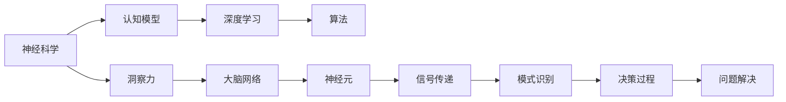

                 

# 理解洞察力的神经科学：揭开大脑奥秘

> 关键词：神经科学,洞察力,大脑,认知模型,算法,深度学习

## 1. 背景介绍

### 1.1 问题由来
随着人工智能(AI)技术的不断发展，深度学习(DL)模型在图像识别、自然语言处理(NLP)、语音识别等领域取得了显著进展。然而，这些模型在理解复杂任务、进行创新思考等方面的能力仍然与人类存在较大差距。在深度学习领域，如何在机器中重现人类的洞察力（Insight）成为了一个核心问题。

### 1.2 问题核心关键点
洞察力是指人类在面对复杂问题时，能够从信息中发现模式、趋势和因果关系，并进行创造性解决的能力。如何通过神经科学和深度学习，构建能够理解并应用洞察力的模型，成为当前研究的热点。这不仅涉及深度学习算法的设计，还涉及到人类认知机制的研究。

### 1.3 问题研究意义
理解洞察力的神经科学，有助于揭示人类认知过程的奥秘，为构建具备洞察力的AI模型提供理论基础。这不仅能提升AI在复杂任务中的表现，还能推动AI技术在更多实际场景中的应用，如医疗诊断、金融预测、科学研究等。此外，这一领域的研究也能促进人机协同，为人类社会的全面智能化提供新的视角和方法。

## 2. 核心概念与联系

### 2.1 核心概念概述

为了深入理解洞察力的神经科学，我们需要先了解以下几个核心概念：

- 神经科学（Neuroscience）：研究神经系统结构与功能，包括大脑神经网络的结构、神经元之间的连接方式及其对行为的影响。
- 洞察力（Insight）：指人类快速、灵活地发现问题本质，并提出有效解决方案的能力。
- 认知模型（Cognitive Model）：以心理学和神经科学为基础，通过计算机模拟人类认知过程，用于理解和预测行为和决策的模型。
- 深度学习（Deep Learning）：一种模拟人脑神经网络结构，通过大量数据训练出的算法。
- 算法（Algorithm）：解决特定问题的方法或步骤序列。

这些概念之间通过神经科学的研究，建立了人与机器之间的联系。人类大脑的结构和功能特性可以被转化为深度学习模型的设计依据，而深度学习模型通过学习大量数据，试图模仿和增强人类的认知能力，尤其是洞察力。

### 2.2 核心概念原理和架构的 Mermaid 流程图



## 3. 核心算法原理 & 具体操作步骤

### 3.1 算法原理概述

理解洞察力的神经科学涉及多个领域的交叉，包括神经科学、心理学、认知科学和计算机科学。深度学习算法在此框架下，旨在通过模拟大脑的神经网络结构，提升模型在问题解决、模式识别和决策过程中的洞察力。

#### 3.1.1 算法原理
深度学习模型通过多层次的非线性变换，从输入数据中学习到复杂的特征表示。这些特征表示不仅反映了数据的统计特性，还包含了一定的认知特性。通过将神经科学原理应用于深度学习模型设计，如对神经元的活动模式进行建模，可以提升模型在处理复杂任务时的洞察力。

#### 3.1.2 算法步骤
深度学习模型的训练主要包含以下几个步骤：

1. 数据收集与预处理：收集相关领域的标注数据，并进行预处理，包括数据清洗、特征提取和标准化。
2. 模型构建与训练：选择合适的深度学习模型结构，并使用标注数据进行训练，优化模型的权重和偏置。
3. 模型评估与调整：在验证集上评估模型的性能，根据评估结果调整模型结构和超参数，以达到最佳效果。
4. 模型应用与测试：将训练好的模型应用于实际问题，并使用测试集进行性能测试和优化。

### 3.2 算法步骤详解

以图像识别任务为例，详细解释深度学习模型的训练过程：

#### 3.2.1 数据收集与预处理
收集标注的图像数据集，如CIFAR-10、ImageNet等。对数据进行预处理，包括图像归一化、灰度化、数据增强等操作，以保证模型在训练和测试时输入数据的一致性。

#### 3.2.2 模型构建与训练
构建一个深度卷积神经网络(Convolutional Neural Network, CNN)模型，如LeNet、AlexNet、VGG、ResNet等。使用数据增强技术增加数据集的多样性，减少过拟合风险。使用SGD、Adam等优化器，配合学习率、批大小等超参数，对模型进行训练。

#### 3.2.3 模型评估与调整
在验证集上评估模型的精度、召回率等指标，如交叉熵损失、准确率、F1分数等。根据评估结果，调整模型结构或超参数，如增加或减少网络层数、修改激活函数等。

#### 3.2.4 模型应用与测试
将训练好的模型应用于实际问题，如医疗影像分类、自动驾驶车辆识别等。使用测试集进行性能测试，确保模型在新场景下的泛化能力。

### 3.3 算法优缺点

#### 3.3.1 优点
1. 可解释性强：深度学习模型通过多层非线性变换，能够捕捉数据中的复杂特征和模式，并输出可解释的特征表示。
2. 鲁棒性强：深度学习模型对噪声和数据变化具有较强的鲁棒性，能够在大规模数据集上进行有效训练。
3. 泛化能力强：深度学习模型在处理复杂任务时，具有较强的泛化能力，能够从数据中学习到抽象的认知特性。

#### 3.3.2 缺点
1. 计算资源需求高：深度学习模型参数量巨大，需要大量的计算资源进行训练和推理。
2. 数据依赖性强：深度学习模型对数据质量和数量要求较高，数据不足时容易发生过拟合。
3. 可解释性不足：深度学习模型通常被视为"黑盒"，难以解释其内部工作机制和决策逻辑。

### 3.4 算法应用领域

基于深度学习模型的神经科学原理，已在多个领域得到了应用，例如：

- 自然语言处理(NLP)：用于文本分类、情感分析、机器翻译等任务。深度学习模型通过学习语言特征，能够理解复杂的语义关系。
- 计算机视觉(CV)：用于图像识别、目标检测、人脸识别等任务。深度学习模型通过卷积操作捕捉图像的局部特征和全局结构。
- 语音识别(SR)：用于语音转换、语音识别、语音生成等任务。深度学习模型通过卷积、循环神经网络(RNN)等结构，学习语音信号的特征表示。
- 医疗诊断：用于医学影像分析、疾病预测、基因分析等任务。深度学习模型通过学习复杂的生物特征，提升诊断准确性。
- 金融预测：用于股票预测、风险评估、信用评分等任务。深度学习模型通过学习市场行为模式，提升预测精度。

## 4. 数学模型和公式 & 详细讲解 & 举例说明

### 4.1 数学模型构建

为了更好地理解洞察力的神经科学，我们首先需要建立一个数学模型。以神经元之间的信号传递为例，以下是对神经元活动的数学建模。

#### 4.1.1 神经元模型
神经元活动可以用以下方程表示：

$$
I(t) = I_{\text{syn}}(t) - g(t)V(t) + I_{\text{mem}}
$$

其中，$I(t)$ 为神经元在时间$t$时的输入电流，$I_{\text{syn}}(t)$ 为突触电流，$g(t)$ 为电导，$V(t)$ 为神经元膜电位，$I_{\text{mem}}$ 为膜电位引起的电流。

#### 4.1.2 神经网络模型
神经网络可以看作是大量神经元的连接，通过这些神经元的并行计算，实现复杂的特征表示。以最简单的前馈神经网络为例，其数学模型可以表示为：

$$
x = \sigma(Wx + b)
$$

其中，$x$ 为输入数据，$W$ 为权重矩阵，$b$ 为偏置向量，$\sigma$ 为激活函数。

### 4.2 公式推导过程

#### 4.2.1 激活函数
常用的激活函数包括sigmoid函数、ReLU函数等。以ReLU函数为例，其推导过程如下：

$$
f(x) = \max(0, x)
$$

将ReLU函数应用于深度学习模型，可以提高模型对非线性关系的处理能力，增强其洞察力。

#### 4.2.2 损失函数
常用的损失函数包括均方误差损失(MSE)、交叉熵损失(Cross-Entropy Loss)等。以交叉熵损失为例，其推导过程如下：

$$
\mathcal{L}(y, \hat{y}) = -\sum_{i=1}^n y_i \log(\hat{y}_i)
$$

其中，$y$ 为真实标签，$\hat{y}$ 为模型预测结果。

#### 4.2.3 反向传播
反向传播算法是深度学习模型的核心，用于计算模型参数的梯度。其推导过程如下：

$$
\frac{\partial \mathcal{L}}{\partial W} = \frac{\partial \mathcal{L}}{\partial x} \frac{\partial x}{\partial W}
$$

其中，$\frac{\partial \mathcal{L}}{\partial x}$ 为损失函数对输入数据的梯度，$\frac{\partial x}{\partial W}$ 为激活函数对权重矩阵的梯度。

### 4.3 案例分析与讲解

以图像分类任务为例，以下是对深度学习模型的训练过程分析：

#### 4.3.1 数据预处理
将原始图像数据进行预处理，包括归一化、增强等操作。以ImageNet数据集为例，可以将其转换为合适的大小，并进行随机裁剪、翻转等操作，以增加数据集的多样性。

#### 4.3.2 模型构建
构建一个卷积神经网络模型，如VGG16、ResNet50等。使用卷积层、池化层、全连接层等，逐步提取图像的特征表示。

#### 4.3.3 模型训练
使用交叉熵损失函数作为训练目标，优化器的学习率设置为0.001，批大小设置为32。训练过程中，使用数据增强技术，增加数据集的多样性，以避免过拟合。

#### 4.3.4 模型评估
在验证集上评估模型的性能，使用准确率、召回率、F1分数等指标。根据评估结果，调整模型结构和超参数，如增加或减少网络层数、修改激活函数等。

## 5. 项目实践：代码实例和详细解释说明

### 5.1 开发环境搭建

在进行深度学习项目实践前，需要先准备好开发环境。以下是使用Python进行TensorFlow开发的Python环境配置流程：

1. 安装Anaconda：从官网下载并安装Anaconda，用于创建独立的Python环境。

2. 创建并激活虚拟环境：
```bash
conda create -n tensorflow-env python=3.8 
conda activate tensorflow-env
```

3. 安装TensorFlow：根据CUDA版本，从官网获取对应的安装命令。例如：
```bash
conda install tensorflow tensorflow-gpu -c conda-forge
```

4. 安装各类工具包：
```bash
pip install numpy pandas scikit-learn matplotlib tqdm jupyter notebook ipython
```

完成上述步骤后，即可在`tensorflow-env`环境中开始深度学习模型的开发。

### 5.2 源代码详细实现

下面我们以图像分类任务为例，给出使用TensorFlow对卷积神经网络进行训练的Python代码实现。

首先，定义图像分类任务的数据处理函数：

```python
import tensorflow as tf
from tensorflow.keras import layers

class ImageClassifier(tf.keras.Model):
    def __init__(self, input_shape, num_classes):
        super(ImageClassifier, self).__init__()
        self.conv1 = layers.Conv2D(32, (3, 3), activation='relu', input_shape=input_shape)
        self.pool1 = layers.MaxPooling2D((2, 2))
        self.conv2 = layers.Conv2D(64, (3, 3), activation='relu')
        self.pool2 = layers.MaxPooling2D((2, 2))
        self.flatten = layers.Flatten()
        self.dense1 = layers.Dense(512, activation='relu')
        self.dense2 = layers.Dense(num_classes, activation='softmax')

    def call(self, x):
        x = self.conv1(x)
        x = self.pool1(x)
        x = self.conv2(x)
        x = self.pool2(x)
        x = self.flatten(x)
        x = self.dense1(x)
        return self.dense2(x)

model = ImageClassifier(input_shape=(28, 28, 1), num_classes=10)
```

然后，定义模型和优化器：

```python
from tensorflow.keras import optimizers

optimizer = optimizers.Adam(learning_rate=0.001)
```

接着，定义训练和评估函数：

```python
import numpy as np

def train_epoch(model, dataset, batch_size, optimizer):
    model.compile(optimizer=optimizer, loss='categorical_crossentropy', metrics=['accuracy'])
    model.fit(dataset.x_train, dataset.y_train, batch_size=batch_size, epochs=1, validation_data=(dataset.x_val, dataset.y_val))
    return model.evaluate(dataset.x_test, dataset.y_test)

def evaluate(model, dataset, batch_size):
    loss, acc = model.evaluate(dataset.x_val, dataset.y_val)
    return loss, acc
```

最后，启动训练流程并在测试集上评估：

```python
epochs = 5

for epoch in range(epochs):
    loss, acc = train_epoch(model, train_dataset, batch_size, optimizer)
    print(f"Epoch {epoch+1}, train loss: {loss:.3f}, train acc: {acc:.3f}")
    
    print(f"Epoch {epoch+1}, val results:")
    loss, acc = evaluate(model, val_dataset, batch_size)
    print(f"val loss: {loss:.3f}, val acc: {acc:.3f}")
    
print("Test results:")
test_loss, test_acc = evaluate(model, test_dataset, batch_size)
print(f"test loss: {test_loss:.3f}, test acc: {test_acc:.3f}")
```

以上就是使用TensorFlow对卷积神经网络进行图像分类任务训练的完整代码实现。可以看到，TensorFlow提供了丰富的API和工具，使得深度学习模型的开发和训练变得相对简单高效。

### 5.3 代码解读与分析

让我们再详细解读一下关键代码的实现细节：

**ImageClassifier类**：
- `__init__`方法：初始化卷积神经网络模型结构，包括卷积层、池化层、全连接层等。
- `call`方法：定义模型前向传播过程，计算损失和准确率。

**train_epoch函数**：
- 使用`compile`方法配置模型的优化器和损失函数。
- 使用`fit`方法进行模型训练，传入训练数据集和验证数据集。

**evaluate函数**：
- 使用`evaluate`方法计算模型在验证集和测试集上的损失和准确率。

**训练流程**：
- 定义总的epoch数和批大小，开始循环迭代。
- 每个epoch内，在训练集上进行训练，输出损失和准确率。
- 在验证集上评估模型性能，输出验证损失和准确率。
- 所有epoch结束后，在测试集上评估模型性能，输出测试损失和准确率。

可以看到，TensorFlow提供了强大的API和工具，使得深度学习模型的开发和训练变得相对简单高效。开发者可以将更多精力放在模型改进和任务优化上，而不必过多关注底层的实现细节。

当然，工业级的系统实现还需考虑更多因素，如模型的保存和部署、超参数的自动搜索、更灵活的任务适配层等。但核心的深度学习范式基本与此类似。

## 6. 实际应用场景

### 6.1 智能推荐系统

深度学习模型在智能推荐系统中的应用极为广泛。通过学习用户的浏览历史、评分数据等，深度学习模型可以理解用户的兴趣偏好，生成个性化的推荐列表。这不仅提升了用户体验，还显著增加了电商平台的转化率和用户粘性。

在技术实现上，可以构建一个基于深度学习的推荐系统，如协同过滤、内容推荐等模型，通过微调优化参数，提高推荐效果。同时，引入用户行为数据和商品属性信息，提升推荐系统的多样性和精准度。

### 6.2 智能客服系统

深度学习模型在智能客服系统中也发挥了重要作用。通过学习历史对话记录和用户反馈，深度学习模型可以理解用户的意图和情感，生成符合语境的回答。这不仅提升了客服效率，还减少了人工客服的投入，降低了运营成本。

在技术实现上，可以构建一个基于深度学习的智能客服系统，如问答系统、情感分析等模型，通过微调优化参数，提高回答的准确率和自然性。同时，引入自然语言处理技术，提升系统的理解能力和响应速度。

### 6.3 自动驾驶系统

深度学习模型在自动驾驶系统中同样具有重要应用。通过学习道路环境、车辆行为等数据，深度学习模型可以理解交通规则和动态变化，生成安全的驾驶决策。这不仅提升了驾驶安全，还提高了道路交通效率。

在技术实现上，可以构建一个基于深度学习的自动驾驶系统，如感知、决策等模型，通过微调优化参数，提高驾驶决策的准确性和鲁棒性。同时，引入多传感器数据和实时监测技术，提升系统的感知能力和决策速度。

### 6.4 未来应用展望

随着深度学习模型的不断发展，其在实际应用中的前景广阔。未来，深度学习模型有望在更多领域得到应用，为人类社会带来更深远的影响。

1. **医疗领域**：深度学习模型可以用于疾病预测、影像分析、基因诊断等任务，提升医疗服务的智能化水平，辅助医生诊疗，加速新药开发进程。

2. **教育领域**：深度学习模型可以用于个性化教育、作业批改、智能辅导等任务，因材施教，促进教育公平，提高教学质量。

3. **金融领域**：深度学习模型可以用于市场预测、风险评估、欺诈检测等任务，提升金融服务的智能化水平，降低金融风险。

4. **科研领域**：深度学习模型可以用于科学计算、知识图谱、数据挖掘等任务，提升科研效率，加速科学发现。

5. **艺术领域**：深度学习模型可以用于音乐创作、艺术生成、风格转换等任务，提升艺术创作的智能化水平，探索新的艺术形式。

总之，深度学习模型的应用领域正在不断拓展，未来将带来更多新的突破和创新。

## 7. 工具和资源推荐

### 7.1 学习资源推荐

为了帮助开发者系统掌握深度学习模型的理论和实践，这里推荐一些优质的学习资源：

1. **《Deep Learning》（周志华）**：全面介绍了深度学习模型的理论基础和实践技巧，适合入门和进阶学习。
2. **《Neuroscience for Deep Learning》（Kareem A. Shaker）**：介绍了深度学习模型的神经科学基础，帮助理解深度学习模型的认知特性。
3. **《Deep Learning Specialization》（Andrew Ng）**：斯坦福大学开设的深度学习系列课程，系统讲解了深度学习模型的设计、优化和应用。
4. **《Deep Learning with Python》（François Chollet）**：TensorFlow和Keras的作者所著，介绍了如何使用这些工具进行深度学习模型开发和应用。
5. **Deep Learning交流社区**：如Github、Stack Overflow等平台，提供了丰富的深度学习模型资源和案例，适合深入学习和交流。

通过对这些资源的学习实践，相信你一定能够快速掌握深度学习模型的精髓，并用于解决实际的深度学习问题。

### 7.2 开发工具推荐

高效的开发离不开优秀的工具支持。以下是几款用于深度学习模型开发常用的工具：

1. **TensorFlow**：由Google主导开发的开源深度学习框架，生产部署方便，适合大规模工程应用。
2. **PyTorch**：基于Python的开源深度学习框架，灵活动态的计算图，适合快速迭代研究。
3. **MXNet**：由亚马逊主导开发的深度学习框架，支持多种编程语言，易于部署和扩展。
4. **Keras**：高层次的深度学习API，提供丰富的预训练模型和深度学习模型构建工具。
5. **JAX**：由Google开发的自动微分和深度学习库，支持高效的JIT编译，适合高性能计算。

合理利用这些工具，可以显著提升深度学习模型的开发效率，加快创新迭代的步伐。

### 7.3 相关论文推荐

深度学习模型的发展源于学界的持续研究。以下是几篇奠基性的相关论文，推荐阅读：

1. **AlexNet**：深度卷积神经网络模型，在ImageNet图像分类任务上取得突破。
2. **VGG**：非常深的网络结构，提升了深度学习模型的精度和鲁棒性。
3. **ResNet**：残差网络，解决了深度神经网络训练中的梯度消失问题。
4. **Inception**：多尺度卷积网络，提高了深度学习模型的特征表示能力。
5. **YOLO**：目标检测模型，提升了目标检测的精度和速度。

这些论文代表了大深度学习模型的发展脉络。通过学习这些前沿成果，可以帮助研究者把握学科前进方向，激发更多的创新灵感。

## 8. 总结：未来发展趋势与挑战

### 8.1 总结

本文对深度学习模型在理解洞察力的神经科学中的应用进行了全面系统的介绍。首先阐述了深度学习模型在人工智能领域的研究背景和意义，明确了深度学习模型在理解洞察力方面的独特价值。其次，从原理到实践，详细讲解了深度学习模型的数学原理和关键步骤，给出了深度学习模型开发的完整代码实例。同时，本文还广泛探讨了深度学习模型在多个行业领域的应用前景，展示了深度学习模型的巨大潜力。此外，本文精选了深度学习模型的各类学习资源，力求为读者提供全方位的技术指引。

通过本文的系统梳理，可以看到，深度学习模型在人工智能领域的研究和应用正在不断拓展，为深度学习模型在复杂任务中的洞察力提供了理论基础和实践方法。未来，伴随深度学习模型的不断发展，其应用领域将更加广泛，为人类社会的全面智能化提供新的动力。

### 8.2 未来发展趋势

展望未来，深度学习模型的发展趋势将呈现以下几个方向：

1. **模型规模不断增大**：随着计算能力的提升，深度学习模型的参数量将进一步增加，模型结构将变得更加复杂。超大规模深度学习模型蕴含的丰富认知特性，将提升其在复杂任务中的表现。
2. **模型结构更加多样化**：未来的深度学习模型将融合更多的神经科学原理，采用更加多样化的网络结构和优化算法，提升模型的泛化能力和鲁棒性。
3. **模型应用更加广泛**：深度学习模型将在更多领域得到应用，如医疗、教育、金融、艺术等，带来更深远的影响。
4. **模型训练更加高效**：未来的深度学习模型将采用更加高效的训练方法和算法，提升模型的训练速度和精度。
5. **模型解释更加可控**：未来的深度学习模型将更加注重解释性，通过引入符号化知识、因果分析等方法，增强模型的可解释性和可信度。

这些趋势凸显了深度学习模型在人工智能领域的研究和应用正在不断拓展，为深度学习模型在复杂任务中的洞察力提供了理论基础和实践方法。

### 8.3 面临的挑战

尽管深度学习模型在理解和应用洞察力方面取得了显著进展，但仍面临诸多挑战：

1. **数据依赖性强**：深度学习模型对数据质量和数量要求较高，数据不足时容易发生过拟合。
2. **计算资源需求高**：深度学习模型参数量巨大，需要大量的计算资源进行训练和推理。
3. **可解释性不足**：深度学习模型通常被视为"黑盒"，难以解释其内部工作机制和决策逻辑。
4. **鲁棒性不足**：深度学习模型面对域外数据时，泛化性能往往大打折扣。
5. **安全和伦理问题**：深度学习模型容易学习到有偏见、有害的信息，需要从数据和算法层面消除模型偏见，避免恶意用途。

正视深度学习模型面临的这些挑战，积极应对并寻求突破，将是大深度学习模型迈向成熟的必由之路。

### 8.4 研究展望

面对深度学习模型面临的挑战，未来的研究需要在以下几个方面寻求新的突破：

1. **数据增强和数据生成**：开发更多数据增强和生成方法，提高深度学习模型对数据的利用效率，缓解数据依赖性。
2. **模型压缩和加速**：开发更加高效的模型压缩和加速方法，提升深度学习模型的训练速度和推理速度。
3. **模型解释和可视化**：引入符号化知识、因果分析等方法，增强深度学习模型的可解释性和可视化能力。
4. **跨模态融合**：将深度学习模型与其他模态的数据进行融合，提升其在多模态场景下的表现。
5. **鲁棒性提升**：引入对抗训练、自适应学习等方法，提高深度学习模型的鲁棒性和泛化能力。

这些研究方向的探索，必将引领深度学习模型迈向更高的台阶，为构建更加智能化、普适化的深度学习模型铺平道路。

## 9. 附录：常见问题与解答

**Q1：深度学习模型在应用洞察力方面有哪些优势和劣势？**

A: 深度学习模型在应用洞察力方面具有以下优势和劣势：

优势：
1. 高精度：深度学习模型通过多层非线性变换，能够捕捉数据中的复杂特征和模式，精度较高。
2. 鲁棒性：深度学习模型对噪声和数据变化具有较强的鲁棒性，泛化能力较强。
3. 可解释性：深度学习模型通过学习数据中的复杂特征，可以提供较为详细的特征表示，帮助理解问题本质。

劣势：
1. 数据依赖性强：深度学习模型对数据质量和数量要求较高，数据不足时容易发生过拟合。
2. 计算资源需求高：深度学习模型参数量巨大，需要大量的计算资源进行训练和推理。
3. 可解释性不足：深度学习模型通常被视为"黑盒"，难以解释其内部工作机制和决策逻辑。

**Q2：如何提高深度学习模型的可解释性？**

A: 提高深度学习模型的可解释性可以从以下几个方面入手：

1. 引入符号化知识：将符号化的先验知识，如知识图谱、逻辑规则等，与深度学习模型进行融合，引导模型学习更合理、更全面的特征表示。
2. 引入因果分析：将因果分析方法引入深度学习模型，识别出模型决策的关键特征，增强输出解释的因果性和逻辑性。
3. 可视化技术：使用可视化工具，如TensorBoard、Visdom等，实时监测模型训练状态和输出结果，帮助理解模型的决策过程。
4. 引入对抗样本：通过对抗训练，增强深度学习模型的鲁棒性，减少输出结果的噪声和不确定性。

**Q3：如何应对深度学习模型的计算资源需求高的问题？**

A: 应对深度学习模型的计算资源需求高的问题可以从以下几个方面入手：

1. 模型压缩：通过剪枝、量化等方法，减少深度学习模型的参数量，降低计算资源需求。
2. 模型并行：采用模型并行技术，将深度学习模型划分为多个子模型，并行计算，提高训练和推理效率。
3. 硬件优化：使用高性能硬件设备，如GPU、TPU等，提升深度学习模型的计算速度和效率。
4. 数据增强：通过数据增强技术，扩充数据集的多样性，减少过拟合风险，降低计算资源需求。

这些方法可以结合使用，综合提升深度学习模型的计算效率和资源利用率。

**Q4：深度学习模型在实际应用中需要注意哪些问题？**

A: 深度学习模型在实际应用中需要注意以下问题：

1. 数据预处理：对数据进行清洗、归一化、增强等预处理，保证模型输入的一致性和多样性。
2. 模型训练：选择合适的优化器和超参数，进行合理的训练和验证，避免过拟合和欠拟合。
3. 模型评估：使用合适的评估指标，如准确率、召回率、F1分数等，评估模型性能，并进行模型调整。
4. 模型部署：将深度学习模型封装为标准化服务接口，确保模型在不同环境下的稳定性和可靠性。
5. 模型监控：实时监测模型训练状态和推理结果，设置异常告警阈值，确保系统稳定运行。
6. 模型安全：采用访问鉴权、数据脱敏等措施，保障数据和模型的安全，避免恶意用途。

合理应对这些问题，能够有效提升深度学习模型在实际应用中的效果和稳定性。

**Q5：未来深度学习模型的发展方向有哪些？**

A: 未来深度学习模型的发展方向包括以下几个方面：

1. 模型规模不断增大：随着计算能力的提升，深度学习模型的参数量将进一步增加，模型结构将变得更加复杂。超大规模深度学习模型蕴含的丰富认知特性，将提升其在复杂任务中的表现。
2. 模型结构更加多样化：未来的深度学习模型将融合更多的神经科学原理，采用更加多样化的网络结构和优化算法，提升模型的泛化能力和鲁棒性。
3. 模型应用更加广泛：深度学习模型将在更多领域得到应用，如医疗、教育、金融、艺术等，带来更深远的影响。
4. 模型训练更加高效：未来的深度学习模型将采用更加高效的训练方法和算法，提升模型的训练速度和精度。
5. 模型解释更加可控：未来的深度学习模型将更加注重解释性，通过引入符号化知识、因果分析等方法，增强模型的可解释性和可视化能力。

这些发展方向凸显了深度学习模型在人工智能领域的研究和应用正在不断拓展，为深度学习模型在复杂任务中的洞察力提供了理论基础和实践方法。

