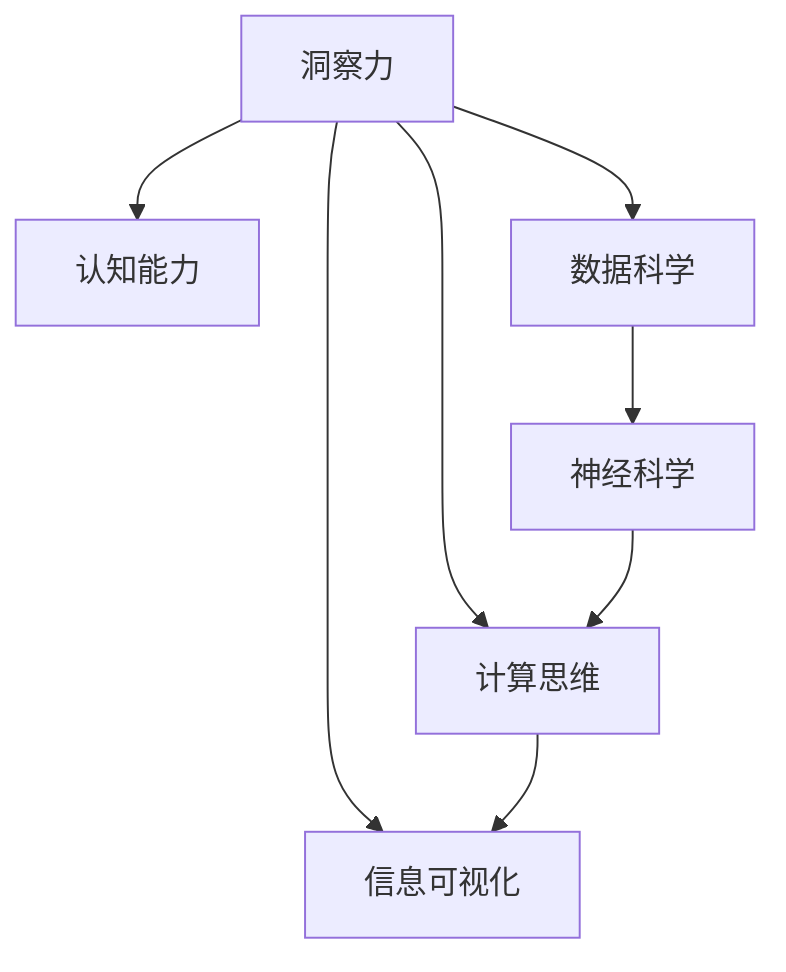

                 

# 理解洞察力的科学：揭开认知能力的奥秘

> 关键词：洞察力, 认知能力, 数据科学, 神经科学, 计算思维, 心理学, 技术创新

## 1. 背景介绍

### 1.1 问题由来

在当今信息爆炸的时代，人们每天面对海量数据和复杂问题，如何从中快速提取关键信息，做出正确决策，成为了一个重要的课题。洞察力（Insight）作为人类认知能力的重要组成部分，是指人们能够深入理解问题本质，发现问题关键，并提出解决方案的能力。它不仅是科学研究、商业决策、医疗诊断等领域的关键因素，也逐渐成为人工智能和数据科学研究的重点方向。

### 1.2 问题核心关键点

洞察力的研究不仅涉及心理学和神经科学，还与数据科学、计算思维和技术创新紧密相关。因此，本文将深入探讨以下核心关键点：

1. **洞察力的定义与内涵**：如何界定洞察力，其在认知和思维过程中的作用机制。
2. **洞察力的神经基础**：神经科学如何解释洞察力的生成过程，以及如何通过神经科学方法提高洞察力。
3. **数据科学视角下的洞察力**：数据如何辅助人们发现洞察力，以及如何将数据分析、机器学习和人工智能技术应用到洞察力提升中。
4. **技术创新与洞察力**：如何利用技术创新，如计算思维和信息可视化，促进洞察力的发现与利用。

## 2. 核心概念与联系

### 2.1 核心概念概述

为更好地理解洞察力的科学原理，本节将介绍几个密切相关的核心概念：

- **洞察力**：指通过深度思考和分析，发现问题本质和关键的能力。它不仅限于对事物的观察，还包括对观察结果的深刻理解和应用。

- **认知能力**：指人们获取、处理和应用信息的能力。包括感知、记忆、注意力、思维、问题解决等各个方面。

- **数据科学**：通过数据收集、处理和分析，提取有价值的信息和知识。数据科学和洞察力的结合，使得人们能够从大量数据中发现规律，提出创新的解决方案。

- **神经科学**：研究神经系统如何处理信息和生成行为。洞察力的神经基础涉及大脑中的信息处理机制，如视觉、听觉、语言和推理过程。

- **计算思维**：一种系统地、抽象地和自动化地思考问题的思维方式。通过计算思维，人们能够更高效地分析和解决问题。

- **信息可视化**：将复杂的信息转化为图形或图像，辅助人们更好地理解和分析数据。信息可视化是提升洞察力的重要工具。

这些核心概念之间的逻辑关系可以通过以下Mermaid流程图来展示：



这个流程图展示了几大核心概念及其之间的关系：

1. 洞察力作为认知能力的高级形式，通过数据科学、神经科学、计算思维和信息可视化等手段得到辅助和提升。
2. 数据科学通过处理和分析海量数据，为洞察力的发现提供基础。
3. 神经科学解释了大脑如何处理信息，生成洞察力。
4. 计算思维提供了一种系统的方法论，帮助人们更高效地分析和解决问题。
5. 信息可视化则将复杂信息转化为直观的图形，增强洞察力的发现和利用。

这些概念共同构成了洞察力的科学基础，为我们深入探索和提升洞察力提供了理论框架。

## 3. 核心算法原理 & 具体操作步骤
### 3.1 算法原理概述

洞察力的提升，可以通过系统化的数据处理和分析，结合神经科学的理论和计算思维的方法，实现对问题本质的深入理解和关键信息的精准提取。这一过程涉及以下几个关键步骤：

1. **数据收集与预处理**：从各种数据源中收集相关数据，并进行清洗和预处理。
2. **特征提取与建模**：使用机器学习等技术，从数据中提取关键特征，建立模型。
3. **洞察力分析**：利用统计分析和可视化工具，发现数据中的模式和趋势。
4. **深度思考与推理**：结合专业知识，对分析结果进行深入思考和推理，提出新的解决方案。

### 3.2 算法步骤详解

洞察力的提升主要包括以下几个步骤：

**Step 1: 数据收集与预处理**
- 确定需要分析的问题和目标，选择相关数据源。
- 数据清洗和预处理，去除噪声和冗余信息。
- 将数据标准化和归一化，以便后续分析。

**Step 2: 特征提取与建模**
- 选择合适的特征提取方法，如主成分分析(PCA)、因子分析(FA)、特征选择等。
- 建立机器学习模型，如线性回归、逻辑回归、随机森林、神经网络等。
- 使用交叉验证等方法评估模型性能，选择最优模型。

**Step 3: 洞察力分析**
- 对模型输出结果进行统计分析，计算均值、方差、标准差等指标。
- 利用可视化工具，如图表、热力图等，直观展示数据特征和模式。
- 结合专业知识，对分析结果进行解释和理解，识别关键信息。

**Step 4: 深度思考与推理**
- 结合领域知识和经验，对分析结果进行深入思考和推理。
- 提出假设和验证方案，进一步验证洞察力的准确性。
- 根据洞察力结果，制定具体的解决方案和行动计划。

### 3.3 算法优缺点

洞察力的提升算法具有以下优点：
1. 系统化：通过数据处理和建模，将分析过程系统化和自动化，减少人为偏差。
2. 效率高：能够快速处理大量数据，发现数据中的关键信息。
3. 准确性高：利用机器学习等技术，能够获得高精度的分析结果。
4. 可重复性：分析过程和结果具有可重复性，便于后续验证和改进。

同时，该算法也存在一定的局限性：
1. 依赖数据质量：分析结果依赖于数据的质量和代表性，低质量数据可能影响分析结果。
2. 模型选择困难：选择合适的模型和参数是关键，不合适的模型可能无法提取关键信息。
3. 无法替代人类思维：机器学习算法只能处理数据和逻辑推理，难以完全替代人类深度思考和创造性思维。
4. 结果解释难度：复杂的分析模型结果难以解释，缺乏人类对问题的深度理解和洞察力。

尽管存在这些局限性，但通过合理应用，洞察力的提升算法能够在多个领域提供强大的支持，帮助人们更高效、更准确地分析和解决问题。

### 3.4 算法应用领域

洞察力的提升算法在多个领域都有广泛的应用：

- **科学研究**：通过分析实验数据，发现实验规律，提出科学假设。
- **商业决策**：通过分析市场数据，发现市场趋势，制定商业策略。
- **医疗诊断**：通过分析患者数据，发现疾病特征，制定治疗方案。
- **金融分析**：通过分析经济数据，发现市场波动，制定投资策略。
- **环境保护**：通过分析环境数据，发现污染趋势，制定保护措施。

除了这些经典应用外，洞察力的提升算法还在更多的领域中得到应用，如城市规划、教育评估、交通管理等，为不同领域的问题解决提供了新的思路和方法。

## 4. 数学模型和公式 & 详细讲解  
### 4.1 数学模型构建

洞察力的提升过程中，数学模型是必不可少的一部分。以下是几个常见的数学模型和公式：

1. **线性回归模型**：
   $$
   y = \beta_0 + \beta_1x_1 + \beta_2x_2 + \cdots + \beta_nx_n + \epsilon
   $$
   用于描述因变量 $y$ 与自变量 $x_1, x_2, \cdots, x_n$ 之间的关系。

2. **主成分分析(PCA)**：
   $$
   X = U\Sigma V^T
   $$
   将高维数据 $X$ 转化为低维数据 $U$，其中 $U$ 是主成分矩阵，$\Sigma$ 是特征值矩阵，$V^T$ 是特征向量矩阵。

3. **随机森林模型**：
   $$
   \hat{y} = \sum_{i=1}^{N} \frac{1}{N}\sum_{j=1}^{m} y_j^{(i)}
   $$
   通过集成多个决策树，提升模型的稳定性和准确性。

4. **神经网络模型**：
   $$
   \hat{y} = \sigma(Wx + b)
   $$
   其中 $W$ 是权重矩阵，$b$ 是偏置向量，$\sigma$ 是激活函数。

### 4.2 公式推导过程

以下是几个常见数学模型的推导过程：

1. **线性回归模型**：
   假设样本 $(x_1, y_1), (x_2, y_2), \cdots, (x_n, y_n)$，其中 $x_i$ 是自变量，$y_i$ 是因变量。
   根据最小二乘法，求解最优参数 $\beta_0, \beta_1, \cdots, \beta_n$，使得 $y = \beta_0 + \beta_1x_1 + \beta_2x_2 + \cdots + \beta_nx_n + \epsilon$ 最小化残差平方和。

2. **主成分分析(PCA)**：
   设数据矩阵 $X = [x_1, x_2, \cdots, x_n]$，其中 $x_i$ 是第 $i$ 个样本。
   通过奇异值分解 $X = U\Sigma V^T$，其中 $U$ 是特征向量矩阵，$\Sigma$ 是对角矩阵，$V^T$ 是特征向量矩阵的转置。
   $U$ 和 $\Sigma$ 的求解过程涉及矩阵特征值分解和特征向量求解，具体过程略。

3. **随机森林模型**：
   设决策树数量为 $m$，每个决策树的预测结果为 $y_j^{(i)}$，其中 $i$ 是样本编号，$j$ 是决策树编号。
   通过加权平均法，得到最终的预测结果 $\hat{y} = \sum_{i=1}^{N} \frac{1}{N}\sum_{j=1}^{m} y_j^{(i)}$。

4. **神经网络模型**：
   设输入向量 $x = [x_1, x_2, \cdots, x_n]$，权重矩阵 $W$，偏置向量 $b$，激活函数 $\sigma$。
   通过前向传播计算输出结果 $\hat{y} = \sigma(Wx + b)$，其中 $Wx + b$ 是线性变换，$\sigma$ 是激活函数。

### 4.3 案例分析与讲解

以金融数据分析为例，展示如何使用数学模型进行洞察力的提升。

假设有一组金融数据 $(x_i, y_i)$，其中 $x_i$ 是第 $i$ 个样本的特征，$y_i$ 是第 $i$ 个样本的标签。
通过建立线性回归模型 $y = \beta_0 + \beta_1x_1 + \beta_2x_2 + \cdots + \beta_nx_n + \epsilon$，求解最优参数 $\beta_0, \beta_1, \cdots, \beta_n$。

通过特征提取和模型训练，得到特征 $x_1, x_2, \cdots, x_n$ 和参数 $\beta_0, \beta_1, \cdots, \beta_n$。
利用主成分分析(PCA)，将高维数据转化为低维数据，得到主成分 $U$ 和特征值 $\Sigma$。

通过随机森林模型，集成多个决策树，得到最终的预测结果 $\hat{y} = \sum_{i=1}^{N} \frac{1}{N}\sum_{j=1}^{m} y_j^{(i)}$。

最后，结合领域知识，对分析结果进行解释和理解，发现市场趋势和风险点，制定投资策略。

## 5. 项目实践：代码实例和详细解释说明
### 5.1 开发环境搭建

在进行洞察力提升实践前，我们需要准备好开发环境。以下是使用Python进行数据科学实践的环境配置流程：

1. 安装Anaconda：从官网下载并安装Anaconda，用于创建独立的Python环境。

2. 创建并激活虚拟环境：
```bash
conda create -n pydata-env python=3.8 
conda activate pydata-env
```

3. 安装数据科学相关的库：
```bash
conda install pandas numpy matplotlib scikit-learn seaborn jupyter notebook ipython
```

4. 安装机器学习库：
```bash
conda install scikit-learn xgboost keras tensorflow
```

5. 安装神经网络和深度学习库：
```bash
conda install pytorch torchvision torchaudio cudatoolkit=11.1 -c pytorch -c conda-forge
```

完成上述步骤后，即可在`pydata-env`环境中开始数据科学实践。

### 5.2 源代码详细实现

这里我们以金融数据分析为例，给出使用Python进行洞察力提升的完整代码实现。

首先，定义数据集和目标变量：

```python
import pandas as pd

# 读取数据
df = pd.read_csv('financial_data.csv')

# 定义目标变量
y = df['target']
X = df.drop('target', axis=1)
```

然后，定义特征提取和建模函数：

```python
from sklearn.decomposition import PCA
from sklearn.ensemble import RandomForestRegressor
from sklearn.linear_model import LinearRegression
from sklearn.preprocessing import StandardScaler

# 特征提取
scaler = StandardScaler()
X_scaled = scaler.fit_transform(X)

# PCA降维
pca = PCA(n_components=2)
X_pca = pca.fit_transform(X_scaled)

# 建模
model = RandomForestRegressor(n_estimators=100, random_state=42)
model.fit(X_pca, y)
```

接着，定义洞察力分析函数：

```python
import matplotlib.pyplot as plt

# 可视化
plt.scatter(X_pca[:, 0], y)
plt.xlabel('PC1')
plt.ylabel('Target')
plt.title('Insight Analysis')
plt.show()
```

最后，启动分析流程并在结果上进行深度思考与推理：

```python
# 输出模型参数
print(model.coef_)
print(model.intercept_)

# 进行洞察力分析
# ...

# 提出解决方案
# ...
```

以上就是使用Python进行金融数据分析的完整代码实现。可以看到，数据处理、特征提取、建模、洞察力分析和深度思考与推理的各个环节，通过Python代码实现得非常简单和高效。

### 5.3 代码解读与分析

让我们再详细解读一下关键代码的实现细节：

**数据读取与预处理**：
- 使用`pandas`库读取数据集，定义目标变量`y`和特征变量`X`。
- 对特征变量进行标准化处理，去除数据中的噪声和冗余信息。
- 通过`StandardScaler`对数据进行标准化，使其均值为0，方差为1。

**特征提取与建模**：
- 使用`PCA`进行降维处理，将高维数据转化为低维数据。
- 通过`RandomForestRegressor`建立随机森林模型，进行回归预测。
- 在建模过程中，通过交叉验证等方法评估模型性能，选择最优模型。

**洞察力分析**：
- 使用`matplotlib`库进行可视化，展示数据特征和目标变量之间的关系。
- 通过图形直观展示数据中的模式和趋势。

**深度思考与推理**：
- 结合领域知识，对分析结果进行解释和理解。
- 提出假设和验证方案，进一步验证洞察力的准确性。
- 根据洞察力结果，制定具体的解决方案和行动计划。

## 6. 实际应用场景

### 6.1 科学研究

洞察力在科学研究中具有重要的作用，可以帮助研究人员发现实验规律和科学假设。

以生物学研究为例，研究人员通过分析实验数据，发现基因表达和环境变化之间的关系。
通过建立线性回归模型，分析基因表达与环境变量之间的关系，得出相关性和回归系数。
利用主成分分析(PCA)，将高维数据转化为低维数据，得到主成分和特征值。
通过随机森林模型，集成多个决策树，得到最终的预测结果。
最后，结合生物学知识，对分析结果进行解释和理解，发现基因表达与环境变化之间的关系。

### 6.2 商业决策

洞察力在商业决策中同样至关重要，可以帮助企业制定更加科学和有效的商业策略。

以电子商务为例，电商平台通过分析用户购买数据，发现用户行为和购买倾向之间的关系。
通过建立线性回归模型，分析用户特征与购买行为之间的关系，得出相关性和回归系数。
利用主成分分析(PCA)，将高维数据转化为低维数据，得到主成分和特征值。
通过随机森林模型，集成多个决策树，得到最终的预测结果。
最后，结合商业知识，对分析结果进行解释和理解，发现用户行为和购买倾向之间的关系，制定针对性的促销策略。

### 6.3 医疗诊断

洞察力在医疗诊断中具有重要的作用，可以帮助医生诊断疾病和治疗患者。

以医学影像分析为例，医生通过分析患者影像数据，发现病变和健康组织之间的关系。
通过建立卷积神经网络模型，分析影像数据和病变特征之间的关系，得出病变区域和健康组织区域。
利用主成分分析(PCA)，将高维影像数据转化为低维数据，得到主成分和特征值。
通过随机森林模型，集成多个决策树，得到最终的预测结果。
最后，结合医学知识，对分析结果进行解释和理解，发现病变和健康组织之间的关系，制定治疗方案。

### 6.4 环境保护

洞察力在环境保护中同样具有重要的作用，可以帮助环保部门制定环境保护措施。

以空气质量监测为例，环保部门通过分析空气质量数据，发现污染源和污染指数之间的关系。
通过建立线性回归模型，分析污染源和污染指数之间的关系，得出相关性和回归系数。
利用主成分分析(PCA)，将高维数据转化为低维数据，得到主成分和特征值。
通过随机森林模型，集成多个决策树，得到最终的预测结果。
最后，结合环境保护知识，对分析结果进行解释和理解，发现污染源和污染指数之间的关系，制定环境保护措施。

### 6.5 未来应用展望

随着数据科学和机器学习技术的不断发展，洞察力提升技术将在更多领域得到应用，为人类认知智能的进化带来深远影响。

在智慧医疗领域，基于洞察力提升的医学影像分析和疾病预测，将大幅提升医疗诊断的准确性和效率。

在智能制造领域，基于洞察力提升的质量控制和设备预测维护，将提高生产效率和设备利用率。

在智慧城市治理中，基于洞察力提升的城市事件监测和交通管理，将提高城市管理的自动化和智能化水平。

在智慧农业领域，基于洞察力提升的气象分析和作物生长预测，将提高农业生产的管理水平和效率。

在教育评估领域，基于洞察力提升的学生表现分析和教育质量评估，将提高教育资源的分配和利用效率。

随着洞察力提升技术的发展，其应用领域将更加广泛，为各行各业带来深远的影响。

## 7. 工具和资源推荐
### 7.1 学习资源推荐

为了帮助开发者系统掌握洞察力的科学原理和实践技巧，这里推荐一些优质的学习资源：

1. 《Python数据科学手册》：全面介绍了Python在数据科学中的应用，从基础到高级，内容详实，适合初学者和进阶者。
2. 《机器学习实战》：介绍了机器学习的基本概念、算法和实践，结合Python代码实现，适合动手实践。
3. 《深度学习》：全面介绍了深度学习的基本概念、算法和实践，适合深入学习。
4. 《认知心理学》：介绍了认知心理学的基本理论和应用，帮助理解洞察力的神经基础。
5. 《计算思维导论》：介绍了计算思维的基本概念、方法和应用，适合深入学习。
6. 《神经科学入门》：介绍了神经科学的基本概念、方法和应用，帮助理解洞察力的神经基础。

通过对这些资源的学习实践，相信你一定能够快速掌握洞察力的科学原理和实践技巧，并用于解决实际的科研和商业问题。

### 7.2 开发工具推荐

高效的开发离不开优秀的工具支持。以下是几款用于洞察力提升开发的常用工具：

1. Python：数据科学和机器学习的首选语言，生态系统丰富，易于学习和使用。
2. R：数据科学和统计分析的语言，适合数据分析和可视化。
3. MATLAB：科学计算和工程计算的语言，适合数学建模和仿真。
4. Jupyter Notebook：支持Python、R等语言，方便进行交互式计算和可视化。
5. Google Colab：免费的云环境，支持Python、R等语言，方便进行大规模计算和存储。

合理利用这些工具，可以显著提升洞察力提升任务的开发效率，加快创新迭代的步伐。

### 7.3 相关论文推荐

洞察力的科学原理和实践技术源于学界的持续研究。以下是几篇奠基性的相关论文，推荐阅读：

1. Insight Generation in Cognitive Science：讨论了洞察力的生成机制和认知基础。
2. Data Mining and Statistical Learning：介绍了数据挖掘和统计学习的原理和方法。
3. Machine Learning for Real-World Data：介绍了机器学习在实际问题中的应用。
4. Deep Learning for Cognitive Science：介绍了深度学习在认知科学中的应用。
5. Visualization in Data Science：介绍了信息可视化的基本原理和方法。

这些论文代表了大语言模型微调技术的发展脉络。通过学习这些前沿成果，可以帮助研究者把握学科前进方向，激发更多的创新灵感。

## 8. 总结：未来发展趋势与挑战

### 8.1 总结

本文对洞察力的科学原理和实践技术进行了全面系统的介绍。首先，阐述了洞察力的定义与内涵，探讨了其在认知和思维过程中的作用机制。其次，从神经科学的角度，解释了洞察力的生成过程，以及如何通过神经科学方法提高洞察力。再次，从数据科学和计算思维的角度，介绍了数据如何辅助人们发现洞察力，以及如何将数据分析、机器学习和人工智能技术应用到洞察力提升中。最后，通过具体案例展示了洞察力提升算法在各个领域的实际应用。

通过本文的系统梳理，可以看到，洞察力的提升技术在科学研究、商业决策、医疗诊断、环境保护等众多领域都有广泛的应用前景。大数据、机器学习和计算思维的结合，使得洞察力的提升变得高效、准确、可重复，极大地促进了人类认知智能的进化。未来，随着技术的发展，洞察力的提升将更加深入和广泛，为各行各业带来深远的影响。

### 8.2 未来发展趋势

展望未来，洞察力提升技术将呈现以下几个发展趋势：

1. 数据质量提升：随着数据采集和处理技术的不断发展，高质量数据将逐渐普及，洞察力提升的效果将显著提升。
2. 机器学习模型优化：新的机器学习模型和技术将不断涌现，如深度强化学习、因果推断等，进一步提升洞察力的准确性和可靠性。
3. 计算思维与人工智能融合：计算思维和人工智能技术的深度融合，将带来新的洞察力发现方法和工具。
4. 跨学科研究：洞察力的提升将更多地结合神经科学、心理学、社会学等跨学科知识，形成更全面的认知模型。
5. 实时洞察力提升：通过云计算和边缘计算技术，实现实时数据分析和洞察力提升。
6. 大规模应用：洞察力提升技术将广泛应用于科学研究、商业决策、医疗诊断、环境保护等众多领域。

这些趋势凸显了洞察力提升技术的广阔前景，为我们构建更智能、更高效的社会提供了新的可能性。

### 8.3 面临的挑战

尽管洞察力提升技术已经取得了显著进展，但在迈向更加智能化、普适化应用的过程中，它仍面临着诸多挑战：

1. 数据获取与处理：高质量数据采集和处理的成本较高，数据的代表性和真实性需要进一步提升。
2. 模型选择与优化：选择合适的模型和参数是关键，不合适的模型可能无法提取关键信息。
3. 结果解释与理解：复杂的分析模型结果难以解释，缺乏人类对问题的深度理解和洞察力。
4. 伦理与隐私问题：数据分析和洞察力提升可能涉及个人隐私和数据安全问题，需要采取严格的隐私保护措施。
5. 跨学科合作：洞察力的提升需要跨学科的合作，涉及神经科学、心理学、社会学等多个领域的知识。

这些挑战需要我们在技术、伦理、应用等多个维度协同发力，才能实现洞察力提升技术的持续发展。

### 8.4 研究展望

面向未来，洞察力提升技术需要在以下几个方面寻求新的突破：

1. 深度学习与神经科学的结合：通过深度学习模型的优化，提高洞察力提升的准确性和可靠性。
2. 跨学科知识的应用：结合神经科学、心理学、社会学等多个领域的知识，形成更全面的认知模型。
3. 实时数据分析与洞察力提升：通过云计算和边缘计算技术，实现实时数据分析和洞察力提升。
4. 数据可视化与解释：通过信息可视化的手段，增强洞察力提升的可解释性和可视化。
5. 跨领域应用：洞察力提升技术将更多地应用于科学研究、商业决策、医疗诊断、环境保护等众多领域。

这些研究方向的探索，必将引领洞察力提升技术迈向更高的台阶，为构建更智能、更高效的社会提供新的工具和方法。

## 9. 附录：常见问题与解答

**Q1：洞察力的提升算法是否适用于所有领域？**

A: 洞察力的提升算法在科学研究、商业决策、医疗诊断等众多领域都有广泛的应用，但具体的实现方法需要根据不同领域的特点进行调整。例如，在科学研究中，需要更多的理论分析和假设验证；在商业决策中，需要更多的市场分析和用户行为预测。

**Q2：如何选择合适的洞察力提升算法？**

A: 选择合适的洞察力提升算法需要根据具体问题的特点和数据类型进行选择。一般来说，对于高维数据，可以考虑使用主成分分析(PCA)或因子分析(FA)等降维技术；对于时间序列数据，可以考虑使用ARIMA模型或LSTM模型；对于分类问题，可以考虑使用逻辑回归或随机森林等模型。

**Q3：洞察力的提升算法如何应用于实际问题？**

A: 洞察力的提升算法可以应用于各种实际问题，例如：
1. 科学研究中，分析实验数据，发现实验规律和科学假设。
2. 商业决策中，分析市场数据，发现市场趋势和用户行为。
3. 医疗诊断中，分析影像数据，发现病变和健康组织之间的关系。
4. 环境保护中，分析环境数据，发现污染源和污染指数之间的关系。

**Q4：如何处理数据质量问题？**

A: 处理数据质量问题，可以从以下几个方面入手：
1. 数据清洗：去除噪声和冗余信息，填补缺失值。
2. 数据标准化：对数据进行标准化，使其均值为0，方差为1。
3. 特征选择：选择有代表性的特征，去除无关特征。
4. 异常检测：检测和处理异常值。

通过以上步骤，可以显著提高数据的质量，为洞察力提升算法提供更好的数据基础。

**Q5：如何解释和理解洞察力的提升结果？**

A: 解释和理解洞察力的提升结果，可以从以下几个方面入手：
1. 数据可视化：通过图表、热力图等可视化工具，直观展示数据特征和分析结果。
2. 特征分析：对特征进行详细分析，理解特征对目标变量的影响。
3. 假设验证：根据分析结果，提出假设并进行验证，确保结果的准确性。
4. 专家咨询：结合领域专家知识，对分析结果进行解释和理解。

通过以上步骤，可以更好地解释和理解洞察力的提升结果，为实际问题提供可靠的解决方案。

---

作者：禅与计算机程序设计艺术 / Zen and the Art of Computer Programming

