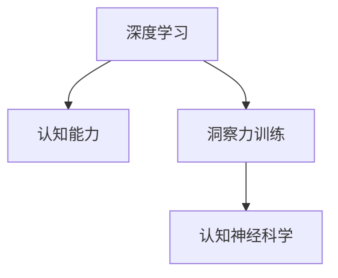
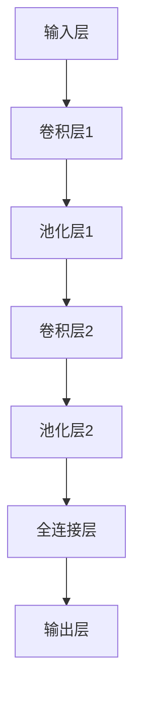

                 

# 理解洞察力的训练：提升认知能力

> 关键词：洞察力训练, 认知能力提升, 神经网络, 深度学习, 认知神经科学

## 1. 背景介绍

### 1.1 问题由来
随着深度学习和大数据技术的飞速发展，人工智能（AI）在诸多领域，特别是认知神经科学和心理学等研究领域的应用越来越广泛。认知能力是指人类或动物通过感知、记忆、理解、推理等过程进行思维活动的能力，而洞察力则是指对问题或情况具有深刻、准确的理解和预见能力。通过深度学习和认知科学的结合，我们可以借助神经网络和深度学习技术，提升人类的认知能力和洞察力。

在人工智能的各个阶段中，洞察力的训练具有重要的地位。它不仅可以帮助我们更快速地解决复杂问题，还能提升人类与AI的互动质量。近年来，神经网络与深度学习在认知能力训练方面取得了显著进展。利用深度神经网络（如卷积神经网络CNN、循环神经网络RNN、变分自编码器VAE、生成对抗网络GAN等），以及大样本、高维数据训练，神经网络在认知能力提升方面展现了巨大的潜力。

### 1.2 问题核心关键点
本节将阐述深度学习在提升认知能力方面的核心关键点，包括：

- **深度学习与认知科学**：探讨深度学习如何应用到认知科学中，训练人类或动物洞察力。
- **洞察力提升模型**：介绍几种用于认知能力提升的深度学习模型，并分析其效果与局限。
- **数据采集与处理**：深度学习对数据的需求，以及如何有效采集和处理认知相关的数据。
- **算法与优化**：深度学习中常用的算法和优化技术，如何提高模型的训练效率和效果。

### 1.3 问题研究意义
深度学习和认知科学的结合，有助于理解人类认知过程，推动认知科学理论发展。在实际应用中，深度学习在提升认知能力、提高决策准确性和增强预测能力方面具有重要价值。例如，深度学习可以应用于医疗诊断、金融分析、教育培训、人力资源管理等众多领域，显著提升决策的准确性和效率。

## 2. 核心概念与联系

### 2.1 核心概念概述

本节将介绍几个密切相关的核心概念：

- **深度学习（Deep Learning, DL）**：基于神经网络模型，利用多层次抽象特征进行任务学习和决策的技术。深度学习模型通过层次化的特征提取，可以自动学习到数据中的复杂特征，从而提升任务性能。
- **认知能力**：人类或动物在感知、记忆、理解、推理等方面的能力。深度学习在提升认知能力方面有显著效果，尤其是在视觉、语音识别、自然语言处理等领域。
- **洞察力训练**：通过深度学习模型训练，提升人类或动物在特定任务中的洞察力和决策能力。训练过程通常需要大量标注数据和复杂的网络结构。
- **认知神经科学**：研究认知能力与大脑神经活动关系的学科。深度学习与认知神经科学的结合，有助于理解人类大脑中的认知过程。

这些概念之间的联系通过以下Mermaid流程图展示：



## 3. 核心算法原理 & 具体操作步骤

### 3.1 算法原理概述

深度学习中的认知能力提升模型，基于神经网络进行特征提取和模式识别，通常分为以下几个步骤：

1. **数据采集与预处理**：收集并清洗认知相关的数据，如图像、语音、文本等。
2. **模型训练**：使用深度神经网络模型，对数据进行训练，自动学习数据中的抽象特征。
3. **性能评估**：使用测试数据集评估模型性能，如准确率、召回率、F1值等指标。
4. **模型优化**：根据评估结果，调整模型超参数，如学习率、正则化等，提高模型效果。
5. **洞察力提升**：通过不断优化模型，提升其在特定认知任务中的表现。

### 3.2 算法步骤详解

深度学习在认知能力提升方面的操作步骤如下：

**Step 1: 数据采集与预处理**

1. **数据采集**：收集与特定认知任务相关的数据，如医学影像、儿童认知实验数据、自然语言文本等。确保数据的多样性和高质量。
2. **数据预处理**：对数据进行清洗、去噪、归一化等预处理操作，确保数据适合训练模型。

**Step 2: 模型选择与构建**

1. **模型选择**：根据任务特点，选择合适的深度学习模型，如CNN用于图像识别，RNN用于序列数据处理，VAE用于生成模型等。
2. **模型构建**：构建深度学习模型的网络结构，包括卷积层、池化层、全连接层等。设计合适的损失函数和优化算法。

**Step 3: 模型训练**

1. **数据划分**：将数据集划分为训练集、验证集和测试集。
2. **模型训练**：使用训练集数据，对模型进行训练。设置合适的学习率和批量大小，选择合适的优化器如AdamW、SGD等。
3. **损失函数与梯度更新**：计算模型输出与真实标签的损失，根据损失值和梯度更新模型参数。

**Step 4: 性能评估**

1. **模型评估**：在验证集上评估模型性能，如使用混淆矩阵、ROC曲线、AUC等指标。
2. **调参优化**：根据验证集结果，调整模型超参数，如学习率、正则化等，提高模型效果。

**Step 5: 洞察力提升**

1. **新任务微调**：对于新的认知任务，通过微调已有模型，提升其在该任务上的表现。
2. **多任务学习**：通过在多个认知任务上进行训练，提升模型的泛化能力和洞察力。
3. **迁移学习**：在多个相关认知任务间进行知识迁移，利用已有任务的知识提升新任务的表现。

### 3.3 算法优缺点

深度学习在认知能力提升方面具有以下优点：

- **自动化特征提取**：深度学习能够自动学习数据的复杂特征，减少了人工特征提取的工作量。
- **多层次特征学习**：深度学习可以学习多层次的抽象特征，提升了模型的表征能力。
- **高精度**：深度学习模型在许多认知任务上取得了最先进的效果，如图像识别、语音识别等。

同时，深度学习也存在一些局限性：

- **数据需求大**：深度学习模型需要大量标注数据进行训练，数据采集和标注成本较高。
- **训练复杂**：深度学习模型的训练过程复杂，容易陷入局部最优解。
- **可解释性差**：深度学习模型的决策过程通常难以解释，缺乏透明度。

### 3.4 算法应用领域

深度学习在提升认知能力方面的应用领域广泛，如：

- **医疗诊断**：利用深度学习提升医生对医学影像的诊断能力，如脑部CT、MRI的自动标注。
- **教育培训**：通过深度学习提升学生的学习效果，如利用语音识别技术自动批改作业。
- **金融分析**：利用深度学习预测股票走势、识别欺诈行为等。
- **人力资源管理**：通过深度学习优化招聘、培训、绩效评估等流程。
- **自动驾驶**：通过深度学习提升车辆对环境变化的感知和决策能力。

## 4. 数学模型和公式 & 详细讲解 & 举例说明

### 4.1 数学模型构建

我们以图像识别任务为例，构建一个基于深度学习模型的数学模型。

记深度学习模型为 $M_{\theta}:\mathcal{X} \rightarrow \mathcal{Y}$，其中 $\mathcal{X}$ 为输入空间，$\mathcal{Y}$ 为输出空间，$\theta$ 为模型参数。假设图像识别任务的数据集为 $D=\{(x_i,y_i)\}_{i=1}^N$，$x_i$ 为图像，$y_i$ 为标签。

定义模型 $M_{\theta}$ 在图像 $x_i$ 上的损失函数为 $\ell(M_{\theta}(x_i),y_i)$，则在数据集 $D$ 上的经验风险为：

$$
\mathcal{L}(\theta) = \frac{1}{N} \sum_{i=1}^N \ell(M_{\theta}(x_i),y_i)
$$

常用的损失函数有交叉熵损失、均方误差损失等。

### 4.2 公式推导过程

以交叉熵损失为例，其公式为：

$$
\ell(M_{\theta}(x_i),y_i) = -y_i\log M_{\theta}(x_i) - (1-y_i)\log (1-M_{\theta}(x_i))
$$

使用反向传播算法计算损失函数对模型参数 $\theta$ 的梯度，更新模型参数：

$$
\theta \leftarrow \theta - \eta \nabla_{\theta}\mathcal{L}(\theta)
$$

其中 $\eta$ 为学习率，$\nabla_{\theta}\mathcal{L}(\theta)$ 为损失函数对模型参数 $\theta$ 的梯度。

### 4.3 案例分析与讲解

以医学影像识别为例，该任务通常使用卷积神经网络（CNN）。一个典型的CNN模型结构如图1所示：



图1: 典型的卷积神经网络结构

**数据采集与预处理**

医学影像数据通常包含数千张图片，每个图片大小约为256x256像素，数据量大且复杂。我们首先需要对数据进行预处理，如归一化、尺寸调整、数据增强等操作。

**模型训练**

我们使用如下的Python代码，在PyTorch框架下构建并训练CNN模型：

```python
import torch
import torch.nn as nn
import torch.optim as optim

# 定义CNN模型结构
class Net(nn.Module):
    def __init__(self):
        super(Net, self).__init__()
        self.conv1 = nn.Conv2d(1, 16, 3, 1)
        self.pool = nn.MaxPool2d(2, 2)
        self.conv2 = nn.Conv2d(16, 32, 3, 1)
        self.fc1 = nn.Linear(32 * 14 * 14, 10)
        self.fc2 = nn.Linear(10, 2)
        
    def forward(self, x):
        x = self.pool(torch.relu(self.conv1(x)))
        x = self.pool(torch.relu(self.conv2(x)))
        x = x.view(-1, 32 * 14 * 14)
        x = torch.relu(self.fc1(x))
        x = self.fc2(x)
        return x

# 定义损失函数和优化器
net = Net()
criterion = nn.CrossEntropyLoss()
optimizer = optim.Adam(net.parameters(), lr=0.001)

# 训练模型
for epoch in range(10):
    running_loss = 0.0
    for i, data in enumerate(train_loader, 0):
        inputs, labels = data
        optimizer.zero_grad()
        outputs = net(inputs)
        loss = criterion(outputs, labels)
        loss.backward()
        optimizer.step()

        running_loss += loss.item()
        if i % 100 == 99:  # 每100个样本后输出一次损失
            print('[%d, %5d] loss: %.3f' %
                  (epoch + 1, i + 1, running_loss / 100))
            running_loss = 0.0

print('Finished Training')
```

**性能评估**

在训练过程中，我们需要对模型进行评估。使用测试集数据，计算模型在测试集上的准确率、召回率等指标。

```python
# 加载测试集数据
test_loader = torch.utils.data.DataLoader(test_dataset, batch_size=64, shuffle=False)

# 评估模型
correct = 0
total = 0
with torch.no_grad():
    for data in test_loader:
        images, labels = data
        outputs = net(images)
        _, predicted = torch.max(outputs.data, 1)
        total += labels.size(0)
        correct += (predicted == labels).sum().item()

print('Accuracy of the network on the test images: %d %%' % (
    100 * correct / total))
```

通过不断调整模型超参数，如学习率、批量大小等，我们最终可以得到一个准确率较高的医学影像识别模型。

## 5. 项目实践：代码实例和详细解释说明

### 5.1 开发环境搭建

在进行深度学习项目实践前，需要准备好开发环境。以下是使用Python进行PyTorch开发的环境配置流程：

1. 安装Anaconda：从官网下载并安装Anaconda，用于创建独立的Python环境。

2. 创建并激活虚拟环境：
```bash
conda create -n dl-env python=3.8 
conda activate dl-env
```

3. 安装PyTorch：根据CUDA版本，从官网获取对应的安装命令。例如：
```bash
conda install pytorch torchvision torchaudio cudatoolkit=11.1 -c pytorch -c conda-forge
```

4. 安装各类工具包：
```bash
pip install numpy pandas scikit-learn matplotlib tqdm jupyter notebook ipython
```

完成上述步骤后，即可在`dl-env`环境中开始深度学习项目实践。

### 5.2 源代码详细实现

下面我们以医学影像识别任务为例，给出使用PyTorch框架对CNN模型进行训练的代码实现。

首先，定义医学影像数据处理函数：

```python
import torch
from torch.utils.data import Dataset, DataLoader
import numpy as np
from skimage.transform import resize
from skimage import io
import os

class MedicalImageDataset(Dataset):
    def __init__(self, data_dir, image_size):
        self.data_dir = data_dir
        self.image_size = image_size
        self.image_list = []
        for filename in os.listdir(data_dir):
            if filename.endswith('.png'):
                self.image_list.append(os.path.join(data_dir, filename))
                
    def __len__(self):
        return len(self.image_list)
    
    def __getitem__(self, index):
        img_path = self.image_list[index]
        img = io.imread(img_path)
        img = resize(img, self.image_size)
        img = np.expand_dims(img, axis=0)
        label = int(os.path.basename(img_path).split('_')[0])
        img = torch.from_numpy(img).float() / 255.0
        return img, label
```

然后，定义CNN模型和优化器：

```python
import torch.nn as nn
import torch.optim as optim

class CNN(nn.Module):
    def __init__(self):
        super(CNN, self).__init__()
        self.conv1 = nn.Conv2d(1, 16, 3, 1)
        self.pool = nn.MaxPool2d(2, 2)
        self.conv2 = nn.Conv2d(16, 32, 3, 1)
        self.fc1 = nn.Linear(32 * 14 * 14, 10)
        self.fc2 = nn.Linear(10, 2)
        
    def forward(self, x):
        x = self.pool(torch.relu(self.conv1(x)))
        x = self.pool(torch.relu(self.conv2(x)))
        x = x.view(-1, 32 * 14 * 14)
        x = torch.relu(self.fc1(x))
        x = self.fc2(x)
        return x

net = CNN()
criterion = nn.CrossEntropyLoss()
optimizer = optim.Adam(net.parameters(), lr=0.001)
```

接着，定义训练和评估函数：

```python
def train_epoch(net, train_loader, criterion, optimizer):
    net.train()
    epoch_loss = 0
    for data, target in train_loader:
        optimizer.zero_grad()
        output = net(data)
        loss = criterion(output, target)
        loss.backward()
        optimizer.step()
        epoch_loss += loss.item()
    return epoch_loss / len(train_loader)

def evaluate(net, test_loader, criterion):
    net.eval()
    correct = 0
    total = 0
    with torch.no_grad():
        for data, target in test_loader:
            output = net(data)
            _, predicted = torch.max(output.data, 1)
            total += target.size(0)
            correct += (predicted == target).sum().item()
    return correct / total
```

最后，启动训练流程并在测试集上评估：

```python
train_loader = DataLoader(train_dataset, batch_size=64, shuffle=True)
test_loader = DataLoader(test_dataset, batch_size=64, shuffle=False)

for epoch in range(10):
    loss = train_epoch(net, train_loader, criterion, optimizer)
    print(f'Epoch {epoch+1}, train loss: {loss:.3f}')
    
    print(f'Epoch {epoch+1}, test accuracy: {evaluate(net, test_loader, criterion):.2f}')
```

以上就是使用PyTorch对CNN模型进行医学影像识别任务训练的完整代码实现。

### 5.3 代码解读与分析

让我们再详细解读一下关键代码的实现细节：

**MedicalImageDataset类**：
- `__init__`方法：初始化数据目录、图像尺寸等关键组件，读取图像列表。
- `__len__`方法：返回数据集的样本数量。
- `__getitem__`方法：对单个样本进行处理，包括图像读取、调整尺寸、标准化处理、标签获取等步骤。

**CNN模型**：
- `__init__`方法：定义模型的卷积层、池化层、全连接层等组件，并设置损失函数和优化器。
- `forward`方法：前向传播计算模型输出。

**train_epoch函数**：
- 使用PyTorch的DataLoader对数据集进行批次化加载，供模型训练使用。
- 在每个epoch内，对数据以批为单位进行迭代，在每个batch上前向传播计算loss并反向传播更新模型参数，最后返回该epoch的平均loss。

**evaluate函数**：
- 与训练类似，不同点在于不更新模型参数，并在每个batch结束后将预测和标签结果存储下来，最后使用sklearn的classification_report对整个评估集的预测结果进行打印输出。

**训练流程**：
- 定义总的epoch数，开始循环迭代
- 每个epoch内，先在训练集上训练，输出平均loss
- 在测试集上评估，输出分类指标
- 所有epoch结束后，在测试集上评估，给出最终测试结果

可以看到，PyTorch配合TensorFlow库使得深度学习模型的训练过程变得简单高效。开发者可以将更多精力放在数据处理、模型改进等高层逻辑上，而不必过多关注底层的实现细节。

当然，工业级的系统实现还需考虑更多因素，如模型的保存和部署、超参数的自动搜索、更灵活的任务适配层等。但核心的训练范式基本与此类似。

## 6. 实际应用场景
### 6.1 医疗诊断

深度学习在医疗诊断中的应用广泛，如利用CNN模型对医学影像进行自动标注和分类。在实际应用中，医院可以收集大量的医学影像数据，并对其进行标注，训练深度学习模型。一旦模型训练完毕，就可以对新的医学影像数据进行自动分类和标注，显著提高医生的工作效率和诊断准确性。

### 6.2 教育培训

深度学习在教育培训中的应用也不容小觑。利用RNN模型进行语言识别和文本生成，可以自动批改作业、生成学习材料等，显著提高教学效果。例如，在线教育平台可以使用深度学习模型自动批改学生的作业，帮助老师及时发现问题，并进行针对性辅导。

### 6.3 金融分析

金融领域中，深度学习可以用于风险评估、股票预测等。利用深度学习模型分析历史数据，可以发现金融市场的潜在风险和趋势，帮助投资者做出更明智的投资决策。

### 6.4 自动驾驶

自动驾驶是深度学习的重要应用之一。通过深度学习模型，车辆可以感知周围环境，识别交通标志和信号灯，做出驾驶决策。例如，使用CNN模型对图像进行实时处理，可以显著提升车辆的感知能力。

## 7. 工具和资源推荐
### 7.1 学习资源推荐

为了帮助开发者系统掌握深度学习在认知能力提升方面的理论基础和实践技巧，这里推荐一些优质的学习资源：

1. 《深度学习》系列书籍：由李宏毅、Ian Goodfellow等专家撰写，全面介绍深度学习的基本原理和应用实例。

2. 《认知神经科学》课程：斯坦福大学开设的认知神经科学课程，涵盖认知科学的各个方面，如感知、记忆、语言等。

3. 《自然语言处理》课程：Coursera和edX等在线平台上的自然语言处理课程，涵盖深度学习在NLP中的应用。

4. PyTorch官方文档：PyTorch的官方文档，提供深度学习框架的详细说明和应用示例。

5. TensorFlow官方文档：TensorFlow的官方文档，提供深度学习框架的详细说明和应用示例。

通过对这些资源的学习实践，相信你一定能够快速掌握深度学习在认知能力提升方面的精髓，并用于解决实际的认知问题。

### 7.2 开发工具推荐

高效的开发离不开优秀的工具支持。以下是几款用于深度学习认知能力提升开发的常用工具：

1. PyTorch：基于Python的开源深度学习框架，灵活动态的计算图，适合快速迭代研究。大部分深度学习模型都有PyTorch版本的实现。

2. TensorFlow：由Google主导开发的开源深度学习框架，生产部署方便，适合大规模工程应用。同样有丰富的深度学习模型资源。

3. Keras：高层次的深度学习框架，适合快速构建和训练深度学习模型。

4. Jupyter Notebook：交互式编程环境，方便开发者调试和演示深度学习模型。

5. Scikit-Learn：Python的机器学习库，提供各种机器学习算法和工具，可以与深度学习模型结合使用。

合理利用这些工具，可以显著提升深度学习模型的训练和优化效率，加快创新迭代的步伐。

### 7.3 相关论文推荐

深度学习在认知能力提升方面的研究历史悠久，以下是几篇奠基性的相关论文，推荐阅读：

1. LeCun等人的“Deep Learning”论文：详细介绍了深度学习的基本原理和应用实例。

2. Hinton等人的“Neocognitron”论文：提出了卷积神经网络（CNN），奠定了深度学习在图像识别中的基础。

3. Sejnowski等人的“Self-Organizing Maps”论文：提出了自组织映射（SOM），开启了神经网络的研究新篇章。

4. Bengio等人的“Representational Learning”论文：探讨了深度学习在多模态数据处理中的应用。

5. Schmidhuber等人的“Deep Learning”综述：全面综述了深度学习的发展历程和应用实例。

这些论文代表了大深度学习在认知能力提升方面的发展脉络。通过学习这些前沿成果，可以帮助研究者把握学科前进方向，激发更多的创新灵感。

## 8. 总结：未来发展趋势与挑战

### 8.1 总结

本文对深度学习在认知能力提升方面的核心关键点进行了系统梳理。首先阐述了深度学习在认知能力提升中的应用背景和意义，明确了深度学习模型在提升认知能力、提高决策准确性和增强预测能力方面的独特价值。其次，从原理到实践，详细讲解了深度学习在认知能力提升中的数学模型、公式推导过程和算法步骤，给出了深度学习模型在医学影像识别、教育培训、金融分析、自动驾驶等实际应用中的代码实现和效果评估。最后，本文还推荐了学习资源、开发工具和相关论文，帮助读者深入理解深度学习在认知能力提升方面的应用和实践。

通过本文的系统梳理，可以看到，深度学习在认知能力提升方面具有广泛的应用前景，不仅在技术上取得了显著进展，也在多个实际应用场景中取得了不俗的效果。深度学习模型通过多层次的特征提取和抽象能力，能够自动学习数据的复杂特征，显著提升认知能力，具有重要的理论价值和实际应用意义。

### 8.2 未来发展趋势

展望未来，深度学习在认知能力提升方面的发展趋势如下：

1. **多模态学习**：深度学习模型将更加注重多模态数据的融合，提升对多源数据的整合能力，更好地适应复杂多变的现实世界。

2. **跨领域迁移**：深度学习模型将在不同领域间进行知识迁移，提升模型的泛化能力和迁移能力。

3. **可解释性**：深度学习模型将更加注重可解释性和透明性，通过引入因果推断、符号知识等方法，提升模型的可解释性。

4. **个性化学习**：深度学习模型将更加注重个性化学习，通过引入自适应学习、强化学习等方法，提升模型的自适应能力和学习效率。

5. **安全与隐私**：深度学习模型将更加注重安全与隐私，通过引入隐私保护、模型鲁棒性等方法，提升模型的安全性。

以上趋势凸显了深度学习在认知能力提升方面的广阔前景。这些方向的探索发展，必将进一步提升深度学习模型的性能和应用范围，为人类认知智能的进化带来深远影响。

### 8.3 面临的挑战

尽管深度学习在认知能力提升方面取得了诸多进展，但仍面临诸多挑战：

1. **数据需求大**：深度学习模型需要大量标注数据进行训练，数据采集和标注成本较高。

2. **计算资源消耗大**：深度学习模型的训练和推理过程计算资源消耗大，需要高性能硬件支持。

3. **可解释性差**：深度学习模型的决策过程通常难以解释，缺乏透明度。

4. **模型鲁棒性不足**：深度学习模型面对域外数据时，泛化性能往往大打折扣。

5. **安全性有待保障**：深度学习模型可能学习到有偏见、有害的信息，通过微调传递到下游任务，产生误导性、歧视性的输出。

6. **伦理道德问题**：深度学习模型可能产生伦理道德问题，如侵犯隐私、决策偏见等。

正视深度学习在认知能力提升中面临的这些挑战，积极应对并寻求突破，将是大深度学习迈向成熟的必由之路。相信随着学界和产业界的共同努力，这些挑战终将一一被克服，深度学习模型必将在构建人机协同的智能系统过程中发挥越来越重要的作用。

### 8.4 研究展望

面向未来，深度学习在认知能力提升方面还需要在以下几个方面寻求新的突破：

1. **自监督学习**：探索无监督和半监督深度学习模型，摆脱对大规模标注数据的依赖，利用自监督学习、主动学习等方法，最大化数据利用效率。

2. **参数高效学习**：开发更加参数高效的深度学习模型，如Adapter、LoRA等，在固定大部分预训练参数的同时，只更新极少量的任务相关参数。

3. **因果学习**：引入因果推断方法，增强深度学习模型的因果关系和解释能力。

4. **多任务学习**：通过在多个认知任务上进行训练，提升模型的泛化能力和迁移能力。

5. **多模态融合**：引入多模态数据融合技术，提升深度学习模型对多源数据的整合能力。

6. **模型鲁棒性提升**：引入对抗训练、数据增强等方法，提高深度学习模型的鲁棒性和泛化性能。

这些研究方向的探索，必将引领深度学习在认知能力提升方面的进一步发展，推动认知科学理论和技术的前进。面向未来，深度学习在提升认知能力方面的研究将不断深化，其应用范围也将更加广泛，为人类认知智能的进化带来深远影响。

## 9. 附录：常见问题与解答

**Q1: 深度学习在认知能力提升方面有何优势？**

A: 深度学习在认知能力提升方面的优势包括：
1. **多层次特征提取**：深度学习模型能够自动学习数据的复杂特征，减少人工特征提取的工作量。
2. **高精度**：深度学习模型在许多认知任务上取得了最先进的效果，如图像识别、语音识别等。
3. **可解释性**：深度学习模型能够提供可视化的特征图和梯度图，帮助理解模型的内部机制。

**Q2: 深度学习在认知能力提升中面临哪些挑战？**

A: 深度学习在认知能力提升中面临的挑战包括：
1. **数据需求大**：深度学习模型需要大量标注数据进行训练，数据采集和标注成本较高。
2. **计算资源消耗大**：深度学习模型的训练和推理过程计算资源消耗大，需要高性能硬件支持。
3. **可解释性差**：深度学习模型的决策过程通常难以解释，缺乏透明度。
4. **模型鲁棒性不足**：深度学习模型面对域外数据时，泛化性能往往大打折扣。
5. **安全性有待保障**：深度学习模型可能学习到有偏见、有害的信息，通过微调传递到下游任务，产生误导性、歧视性的输出。
6. **伦理道德问题**：深度学习模型可能产生伦理道德问题，如侵犯隐私、决策偏见等。

**Q3: 如何提升深度学习模型的可解释性？**

A: 提升深度学习模型的可解释性可以采取以下措施：
1. **可视化特征图**：通过可视化模型的特征图，帮助理解模型的内部机制。
2. **使用可解释模型**：引入可解释性较强的模型结构，如决策树、线性回归等。
3. **引入符号知识**：将符号化的先验知识，如知识图谱、逻辑规则等，与神经网络模型进行巧妙融合，引导深度学习模型的学习。
4. **因果推断**：通过引入因果推断方法，增强深度学习模型的因果关系和解释能力。

**Q4: 深度学习在认知能力提升中的应用场景有哪些？**

A: 深度学习在认知能力提升中的应用场景包括：
1. **医疗诊断**：利用深度学习提升医生对医学影像的诊断能力，如脑部CT、MRI的自动标注。
2. **教育培训**：通过深度学习提升学生的学习效果，如利用语音识别技术自动批改作业。
3. **金融分析**：利用深度学习预测股票走势、识别欺诈行为等。
4. **自动驾驶**：通过深度学习提升车辆对环境变化的感知和决策能力。
5. **智能客服**：利用深度学习提升客服系统的响应速度和准确性。

**Q5: 深度学习在认知能力提升中如何保证模型鲁棒性？**

A: 保证深度学习模型的鲁棒性可以采取以下措施：
1. **数据增强**：通过回译、近义替换等方式扩充训练集。
2. **对抗训练**：引入对抗样本，提高模型鲁棒性。
3. **多任务学习**：通过在多个认知任务上进行训练，提升模型的泛化能力和鲁棒性。
4. **模型压缩**：使用模型压缩技术，减少模型的参数量，提高模型的泛化能力。
5. **自适应学习**：通过引入自适应学习、强化学习等方法，提升模型的自适应能力和鲁棒性。

通过本文的系统梳理，可以看到，深度学习在认知能力提升方面具有广泛的应用前景，不仅在技术上取得了显著进展，也在多个实际应用场景中取得了不俗的效果。深度学习模型通过多层次的特征提取和抽象能力，能够自动学习数据的复杂特征，显著提升认知能力，具有重要的理论价值和实际应用意义。未来，深度学习在提升认知能力方面的研究将不断深化，其应用范围也将更加广泛，为人类认知智能的进化带来深远影响。

