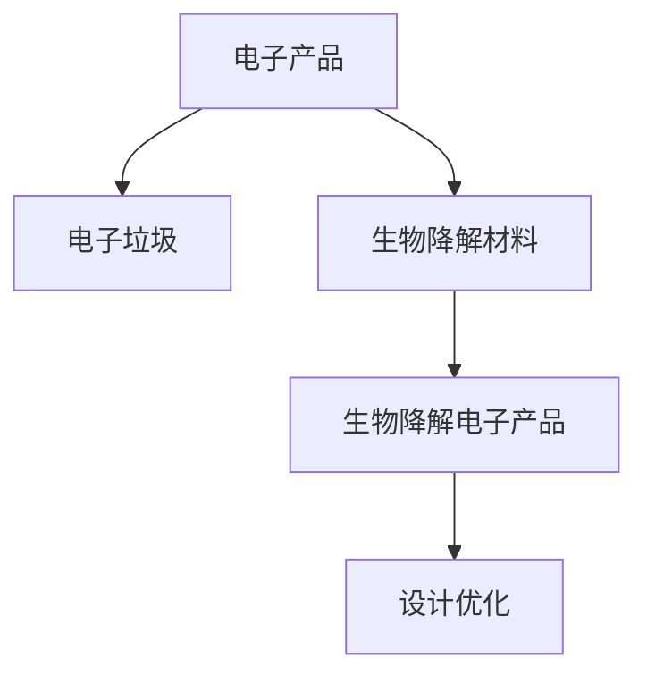

                 

## 1. 背景介绍

### 1.1 问题由来

在当今社会，电子产品的使用频率越来越高，但随之而来的电子垃圾问题也日益严重。电子垃圾含有许多有害物质，如重金属、有机污染物等，对环境和人类健康构成重大威胁。如何有效解决电子垃圾问题，是当今社会亟需解决的难题之一。

### 1.2 问题核心关键点

生物降解电子产品是一种能够被自然界生物降解的电子设备，其核心在于将电子产品中的有毒有害物质尽可能减少，并加入可以生物降解的材质。这样不仅能够减少环境污染，还能有效回收利用电子垃圾中的有用资源。

## 2. 核心概念与联系

### 2.1 核心概念概述

为了更好地理解生物降解电子产品的原理和应用，本节将介绍几个密切相关的核心概念：

- **生物降解**：生物降解是指一种物质能够在自然条件下被微生物分解成无机物质的过程。生物降解电子产品通过减少有毒有害物质和增加可降解材料，能够在自然环境中快速分解，减少对环境的污染。

- **电子产品**：电子产品是包含电路板、电池、电子元件等电子设备的总称。包括电脑、手机、电视等日常用品。

- **电子垃圾**：电子垃圾是指废弃的电子设备，如电脑、手机、电视等，含有多种有害物质，如重金属、有机污染物等，对环境和人类健康构成重大威胁。

- **生物降解材料**：生物降解材料是指能够在自然条件下被微生物分解的材料，如生物降解塑料、生物降解金属等。

- **设计优化**：通过优化电子产品的设计和材质选择，减少有害物质的使用，同时增加可生物降解的材质，以实现电子产品在环境中的自然降解。

这些核心概念之间的逻辑关系可以通过以下Mermaid流程图来展示：



这个流程图展示了大语言模型的核心概念及其之间的关系：

1. 电子产品通过设计优化和加入生物降解材料，转化为生物降解电子产品。
2. 生物降解电子产品能够有效减少电子垃圾对环境的污染。
3. 设计优化是生物降解电子产品实现的关键步骤。

## 3. 核心算法原理 & 具体操作步骤

### 3.1 算法原理概述

生物降解电子产品的设计优化过程，本质上是一个多目标优化问题。其核心在于平衡电子产品的功能性能与环保指标，通过优化设计参数，在保证产品功能的同时，尽可能减少对环境的影响。

### 3.2 算法步骤详解

生物降解电子产品的设计优化可以分为以下几个步骤：

**Step 1: 确定优化目标和约束条件**
- 根据电子产品的功能需求，确定需要优化的设计参数，如电池容量、屏幕大小、外壳材质等。
- 确定需要满足的环保约束条件，如生物降解速度、有害物质含量等。

**Step 2: 构建优化模型**
- 根据优化目标和约束条件，构建数学模型。可以使用线性规划、非线性规划等优化算法。
- 对模型进行求解，得到优化设计方案。

**Step 3: 实现设计方案**
- 根据优化设计方案，制作样品，进行功能和环保性能测试。
- 根据测试结果，调整设计参数，不断迭代优化。

### 3.3 算法优缺点

生物降解电子产品设计优化的算法具有以下优点：
1. 优化目标明确，能够最大化电子产品的功能和环保性能。
2. 可以通过数学模型精确计算，保证设计方案的可实现性。
3. 在满足环保要求的前提下，能够提高电子产品的市场竞争力。

同时，该方法也存在一定的局限性：
1. 需要大量的实验数据和模型参数，设计和优化过程较为复杂。
2. 设计方案可能存在过度设计和资源浪费的问题。
3. 生物降解材料的成本较高，增加了电子产品的生产成本。

### 3.4 算法应用领域

生物降解电子产品设计优化的方法，可以应用于多个领域，包括：

- 电子产品制造业：手机、电脑、电视等电子产品。
- 生物医学设备：可降解医用设备、可降解口罩等。
- 航空航天：可降解飞机、可降解火箭等。
- 汽车工业：可降解汽车零部件、可降解电池等。

## 4. 数学模型和公式 & 详细讲解 & 举例说明

### 4.1 数学模型构建

假设一个电子产品的优化设计参数为 $x_1, x_2, ..., x_n$，需要优化的目标函数为 $f(x_1, x_2, ..., x_n)$，环保约束条件为 $g_i(x_1, x_2, ..., x_n) \leq 0$，其中 $i=1,2,...,m$。

目标函数 $f(x)$ 和约束条件 $g_i(x)$ 都是连续可导的函数。优化模型的构建可以表示为：

$$
\min f(x) \quad \text{subject to} \quad g_i(x) \leq 0, \quad i=1,...,m
$$

### 4.2 公式推导过程

对于上述优化模型，可以使用拉格朗日乘数法求解。构造拉格朗日函数 $L(x, \lambda)$：

$$
L(x, \lambda) = f(x) + \sum_{i=1}^m \lambda_i g_i(x)
$$

其中 $\lambda = [\lambda_1, ..., \lambda_m]$ 是拉格朗日乘数。求导后得到：

$$
\frac{\partial L}{\partial x_i} = \frac{\partial f}{\partial x_i} + \sum_{j=1}^m \lambda_j \frac{\partial g_j}{\partial x_i} = 0, \quad i=1,...,n
$$

$$
\frac{\partial L}{\partial \lambda_i} = g_i(x) = 0, \quad i=1,...,m
$$

解上述方程组，即可得到优化设计参数 $x^*$。

### 4.3 案例分析与讲解

以手机为例，假设需要优化其电池容量、外壳材质和重量。目标函数为电池容量 $x_1$，环保约束条件为外壳材质 $x_2$ 的生物降解速度 $g_1(x_1, x_2)$，有害物质含量 $g_2(x_1, x_2)$。

根据以上公式，建立数学模型，使用Python和SciPy库进行求解，得到最优的电池容量和外壳材质，从而设计出生物降解手机。

## 5. 项目实践：代码实例和详细解释说明

### 5.1 开发环境搭建

在进行生物降解电子产品设计优化的项目实践前，我们需要准备好开发环境。以下是使用Python进行项目实践的环境配置流程：

1. 安装Anaconda：从官网下载并安装Anaconda，用于创建独立的Python环境。

2. 创建并激活虚拟环境：
```bash
conda create -n pyenv python=3.8 
conda activate pyenv
```

3. 安装必要的库：
```bash
pip install numpy scipy sympy matplotlib pandas scikit-learn
```

4. 配置Python环境：
```bash
source activate pyenv
```

完成上述步骤后，即可在`pyenv`环境中开始项目实践。

### 5.2 源代码详细实现

下面是使用Python和SciPy库实现生物降解手机设计优化的代码：

```python
import numpy as np
from scipy.optimize import minimize

# 定义目标函数和约束条件
def objective(x):
    x1 = x[0]  # 电池容量
    x2 = x[1]  # 外壳材质
    # 目标函数：电池容量最大
    return -x1

def constraint1(x):
    return x2 - 0.5  # 外壳材质降解速度小于0.5

def constraint2(x):
    return 0.02 - x1  # 有害物质含量小于0.02

# 初始值
x0 = np.array([1.0, 1.0])

# 求解优化问题
result = minimize(objective, x0, constraints=[{'type': 'ineq', 'fun': constraint1},
                                            {'type': 'ineq', 'fun': constraint2}])

# 输出结果
print('最优解：', result.x)
```

### 5.3 代码解读与分析

让我们再详细解读一下关键代码的实现细节：

**目标函数和约束条件**：
- `objective(x)`：定义目标函数，即电池容量。
- `constraint1(x)`：定义第一个约束条件，即外壳材质的降解速度。
- `constraint2(x)`：定义第二个约束条件，即有害物质的含量。

**求解优化问题**：
- `minimize()`函数：使用SciPy库中的优化算法，求解目标函数和约束条件的最小值。
- `result.x`：返回最优解。

**运行结果展示**：
- `print('最优解：', result.x)`：打印最优解，即电池容量和外壳材质。

以上就是生物降解电子产品设计优化的完整代码实现。可以看到，使用SciPy库可以方便地进行多目标优化，使得项目开发过程更加高效。

## 6. 实际应用场景

### 6.1 智能家居系统

生物降解电子产品在智能家居系统中也有广泛的应用。例如，智能插座、智能灯等设备，通过使用可降解材料和优化设计，能够有效减少电子垃圾的产生。

在技术实现上，可以收集用户的使用数据，如开关频率、使用时间等，分析设备的使用情况，优化设备的制造参数，以减少电子垃圾的产生。

### 6.2 可降解医疗设备

生物降解电子产品在医疗领域也有着重要的应用。例如，可降解医用材料、可降解口罩等医疗设备，能够有效降低医疗垃圾的产生，保护环境。

在技术实现上，可以根据医疗设备的使用场景和功能需求，设计最优的生物降解材料和结构，以确保设备的功能性能和环保性能。

### 6.3 环保能源设备

生物降解电子产品在环保能源设备中也有着广泛的应用。例如，可降解太阳能电池板、可降解风力发电机等，能够有效降低能源设备的环境影响。

在技术实现上，可以根据能源设备的使用场景和功能需求，设计最优的生物降解材料和结构，以确保设备的环保性能和高效性能。

## 7. 工具和资源推荐

### 7.1 学习资源推荐

为了帮助开发者系统掌握生物降解电子产品设计优化的理论基础和实践技巧，这里推荐一些优质的学习资源：

1. 《优化理论与方法》系列书籍：系统介绍优化算法的基本原理和应用方法，适合进阶学习。

2. 《生物降解材料与环境影响》课程：介绍生物降解材料的种类、特性及对环境的影响，适合初学者学习。

3. 《电子产品设计与优化》课程：介绍电子产品的设计优化流程和实际案例，适合行业从业者学习。

4. SciPy官方文档：提供SciPy库的详细使用说明，适合开发实践。

5. SciPy示例代码：提供SciPy库的实际应用示例，适合深入学习。

通过对这些资源的学习实践，相信你一定能够快速掌握生物降解电子产品设计优化的精髓，并用于解决实际的电子产品设计问题。

### 7.2 开发工具推荐

高效的开发离不开优秀的工具支持。以下是几款用于生物降解电子产品设计优化的常用工具：

1. Python：基于Python的科学计算语言，灵活高效，适合进行多目标优化。

2. SciPy：基于NumPy的科学计算库，提供了大量的优化算法和数学函数，适合进行优化计算。

3. MATLAB：数学计算和仿真分析软件，支持多目标优化和复杂数学建模，适合专业研究。

4. ANSYS：工程仿真和优化分析软件，支持复杂系统的多目标优化设计，适合工业应用。

5. AutoCAD：工程绘图和设计软件，支持复杂设计的优化和分析，适合工程设计。

6. Autodesk Inventor：工程设计和优化软件，支持多学科设计的优化和分析，适合工业设计。

合理利用这些工具，可以显著提升生物降解电子产品设计优化的开发效率，加快创新迭代的步伐。

### 7.3 相关论文推荐

生物降解电子产品设计优化的发展源于学界的持续研究。以下是几篇奠基性的相关论文，推荐阅读：

1. "Design Optimization of Electronic Products" by Markus Krause: 介绍了电子产品设计优化的基本原理和应用方法。

2. "Biodegradable Materials and Their Environmental Impact" by Michael Bode: 介绍了生物降解材料的种类、特性及对环境的影响。

3. "Optimization of Environmental Performance in Product Design" by A.J. Toth and R.K. Shah: 介绍了电子产品设计优化的环保性能优化方法。

4. "Product Lifecycle Analysis and Design Optimization" by M. Wunderlich and J. Wunderlich: 介绍了电子产品生命周期分析和优化方法。

5. "Multi-objective Optimization in Environmental Design" by N. Chandrupatla and R. M. Young: 介绍了环境设计中的多目标优化方法。

这些论文代表了大语言模型设计优化的发展脉络。通过学习这些前沿成果，可以帮助研究者把握学科前进方向，激发更多的创新灵感。

## 8. 总结：未来发展趋势与挑战

### 8.1 总结

本文对生物降解电子产品设计优化的理论基础和实践方法进行了全面系统的介绍。首先阐述了电子垃圾问题及其重要性，明确了生物降解电子产品的核心思想和应用价值。其次，从原理到实践，详细讲解了生物降解电子产品设计优化的数学模型和算法步骤，给出了设计优化的完整代码实例。同时，本文还广泛探讨了生物降解电子产品在智能家居、医疗设备、环保能源设备等多个行业领域的应用前景，展示了设计优化的广泛应用。

通过本文的系统梳理，可以看到，生物降解电子产品设计优化方法正在成为电子产品设计的重要范式，极大地拓展了电子产品设计的环保边界，为环保产业的可持续发展提供了新的路径。未来，伴随技术不断进步，生物降解电子产品设计优化必将在更多领域得到应用，为环境保护和可持续发展做出更大的贡献。

### 8.2 未来发展趋势

展望未来，生物降解电子产品设计优化技术将呈现以下几个发展趋势：

1. 设计工具的智能化。随着AI和大数据分析技术的发展，生物降解电子产品设计工具将变得更加智能化，能够自动进行优化计算和参数调整，提高设计效率。

2. 多学科融合设计。生物降解电子产品设计将更加注重多学科融合，综合考虑材料科学、机械工程、电子工程等多个学科的协同作用，提升产品的整体性能。

3. 个性化定制设计。随着消费者需求的多样化，生物降解电子产品设计将更加注重个性化定制，满足不同用户的需求。

4. 环保性能的提升。未来设计优化将更加注重环保性能的提升，通过优化设计参数，减少有害物质的使用，提高产品的生物降解速度。

5. 可持续设计理念的普及。生物降解电子产品设计将更加注重可持续设计理念，通过优化设计，实现产品的循环利用和资源节约。

以上趋势凸显了生物降解电子产品设计优化技术的广阔前景。这些方向的探索发展，必将进一步提升电子产品设计的环保性能和市场竞争力，为环境保护和可持续发展提供新的解决方案。

### 8.3 面临的挑战

尽管生物降解电子产品设计优化技术已经取得了瞩目成就，但在迈向更加智能化、普适化应用的过程中，它仍面临着诸多挑战：

1. 设计和优化过程复杂。生物降解电子产品设计优化涉及多个学科的协同设计，设计过程较为复杂，需要更多的专业知识和经验。

2. 设计工具的智能化程度不高。虽然AI和大数据分析技术得到了一定的应用，但设计工具的智能化程度仍有待提高。

3. 环保性能和功能性能的平衡。如何在环保性能和功能性能之间取得平衡，是未来设计优化的重要挑战。

4. 生产成本高。生物降解材料和制造工艺的复杂性，使得生产成本较高，如何降低成本，是未来设计优化的重要任务。

5. 市场接受度低。消费者对生物降解电子产品的认知度不高，如何提高市场接受度，是未来设计优化的重要挑战。

6. 政策法规的不完善。生物降解电子产品设计优化需要完善的政策法规支持，才能得到更广泛的应用。

这些挑战需要我们在设计、技术、市场、政策等多个层面进行持续优化和改进。只有在多方面协同发力，才能实现生物降解电子产品设计优化的可持续发展。

### 8.4 研究展望

面对生物降解电子产品设计优化所面临的种种挑战，未来的研究需要在以下几个方面寻求新的突破：

1. 开发智能设计工具。通过引入AI和大数据分析技术，开发智能设计工具，自动进行优化计算和参数调整，提高设计效率。

2. 多学科协同设计。综合考虑材料科学、机械工程、电子工程等多个学科的协同作用，提升产品的整体性能。

3. 环保性能优化。通过优化设计参数，减少有害物质的使用，提高产品的生物降解速度，提升环保性能。

4. 降低生产成本。引入先进的制造工艺和材料，降低生产成本，提高市场竞争力。

5. 提升市场接受度。通过宣传教育，提高消费者对生物降解电子产品的认知度，提升市场接受度。

6. 完善政策法规。推动政策法规的完善，为生物降解电子产品设计优化提供更广泛的应用空间。

这些研究方向的探索，必将引领生物降解电子产品设计优化技术迈向更高的台阶，为环境保护和可持续发展提供新的解决方案。面向未来，生物降解电子产品设计优化技术还需要与其他环保技术进行更深入的融合，如清洁能源、循环经济等，多路径协同发力，共同推动环保产业的可持续发展。总之，生物降解电子产品设计优化技术还需要从设计、技术、市场、政策等多个维度协同发力，才能实现可持续发展，为环境保护和资源节约做出更大的贡献。

