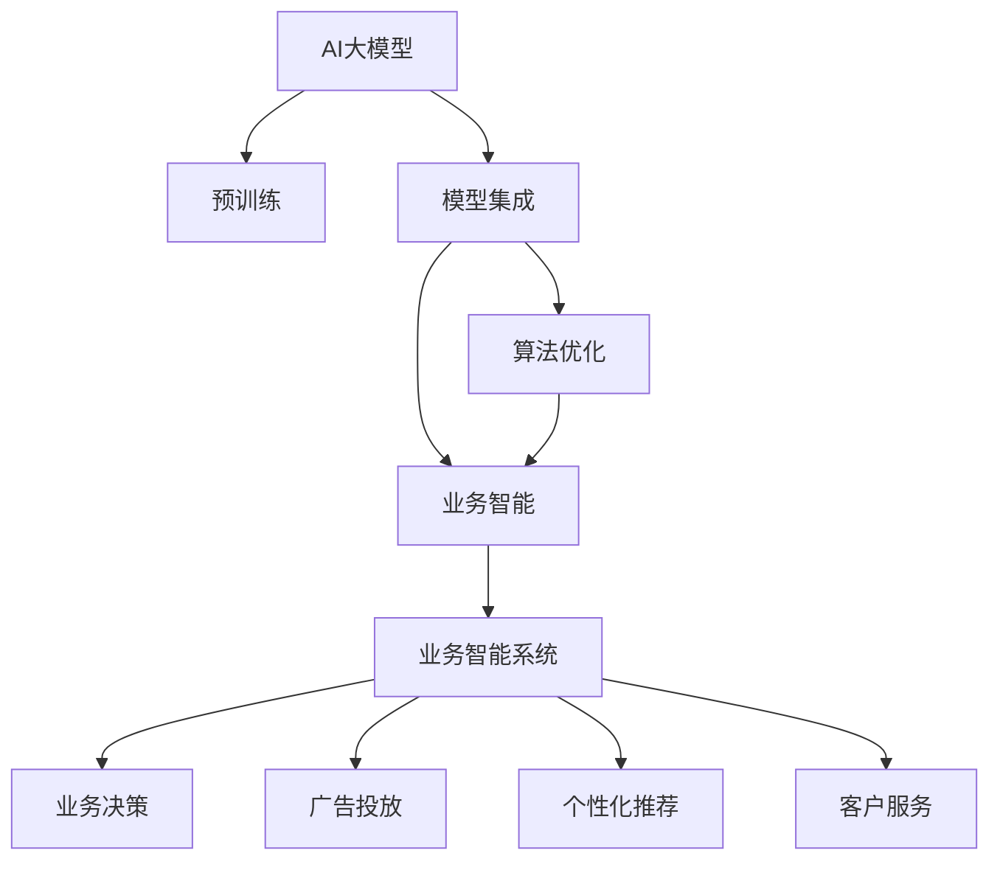

                 

# 电商平台中的AI大模型：从单一模型到模型集成

> 关键词：电商平台,AI大模型,模型集成,算法优化,业务智能,深度学习,自然语言处理

## 1. 背景介绍

### 1.1 问题由来
近年来，人工智能(AI)技术在电商平台中的应用越来越广泛，尤其是在个性化推荐、客户服务、广告投放等领域。大模型在这些应用中发挥了重要作用，极大地提升了电商平台的业务智能水平。然而，传统的单一模型往往难以兼顾精度和效率，无法应对复杂的业务需求。

为了更好地提升电商平台的智能水平，需要从单一模型转向模型集成范式，充分利用各种模型的优势，形成一套完整的业务智能解决方案。模型集成可以将多个模型的输出进行加权融合，既保留了各自的特长，又增强了整体性能，在电商平台中展现出巨大的潜力。

### 1.2 问题核心关键点
目前，模型集成在电商平台中的应用主要体现在以下几个方面：

1. **个性化推荐**：通过多个推荐模型的融合，提高推荐精度和多样性，满足不同用户的个性化需求。
2. **客户服务**：整合多模态客户服务模型，提供更全面、更高效的客户支持。
3. **广告投放**：结合多个广告效果预测模型，优化广告投放策略，提高转化率和ROI。
4. **业务决策**：集成多个业务决策模型，提供更准确、更全面的决策支持，提升运营效率。

这些应用场景展示了模型集成在电商平台中的广泛应用前景，但同时也带来新的挑战。如何在模型集成中平衡精度和效率，如何选择合适的模型进行融合，如何避免模型之间的冲突和冗余，这些都是需要深入探讨的问题。

### 1.3 问题研究意义
研究电商平台中的模型集成技术，对于提升电商平台的业务智能水平，优化用户体验，提高运营效率，具有重要意义：

1. 提高个性化推荐精度：通过模型集成，融合多维数据源和多样化算法，提高推荐模型的精度和覆盖面。
2. 优化客户服务体验：整合多模态客户服务模型，提供更全面、更及时的客户支持，增强用户粘性。
3. 提升广告投放效果：结合多个广告效果预测模型，优化广告投放策略，提高广告投放的精准度和转化率。
4. 强化业务决策能力：集成多个业务决策模型，提供多角度、多层次的决策支持，提高运营效率和决策质量。

## 2. 核心概念与联系

### 2.1 核心概念概述

为更好地理解电商平台中的模型集成技术，本节将介绍几个密切相关的核心概念：

- **AI大模型**：指在大规模数据上进行预训练的深度学习模型，如GPT、BERT等。这些模型通过预训练获得了广泛的语言和图像知识，能够理解和生成自然语言和视觉内容。
- **模型集成**：将多个模型的输出进行加权融合，形成综合的输出结果。模型集成通过充分利用各模型的优势，提升整体性能和鲁棒性。
- **算法优化**：针对特定业务需求，优化模型的训练和推理算法，提高模型的精度和效率。
- **业务智能**：指利用AI技术提升业务决策和运营效率的能力。业务智能系统能够自动化处理业务数据，提供决策支持。
- **深度学习**：指通过多层神经网络进行复杂数据建模的机器学习方法，在图像、语言、推荐等领域广泛应用。
- **自然语言处理(NLP)**：指利用计算机处理和理解自然语言的技术，在推荐、客服、搜索等领域具有重要应用。

这些核心概念之间的逻辑关系可以通过以下Mermaid流程图来展示：



这个流程图展示了大模型、模型集成、算法优化、业务智能之间的关系：

1. 大模型通过预训练获得广泛的知识。
2. 模型集成将多个模型进行融合，形成业务智能解决方案。
3. 算法优化提升模型精度和效率，增强模型集成效果。
4. 业务智能系统应用集成模型，提升业务决策和运营能力。

这些概念共同构成了电商平台中的AI技术框架，使得电商平台能够高效地处理和利用数据，提升业务智能水平。通过理解这些核心概念，我们可以更好地把握模型集成的工作原理和优化方向。

## 3. 核心算法原理 & 具体操作步骤

### 3.1 算法原理概述

电商平台中的模型集成技术，本质上是一个多模型融合的过程。其核心思想是：将多个模型在不同维度和层次上的输出进行加权融合，形成更全面、更准确的综合输出结果。

形式化地，假设电商平台的推荐系统中有 $M$ 个推荐模型 $M_1, M_2, ..., M_M$，每个模型的推荐结果为 $\hat{y}_i$，则模型集成后的综合推荐结果 $\hat{y}$ 可以表示为：

$$
\hat{y} = \sum_{i=1}^{M} \alpha_i \hat{y}_i
$$

其中 $\alpha_i$ 为第 $i$ 个模型的权重，满足 $\sum_{i=1}^{M} \alpha_i = 1$。

模型集成的目标是通过选择合适的权重，使得综合推荐结果 $\hat{y}$ 尽可能接近真实推荐结果 $y$，即最小化损失函数：

$$
\min_{\alpha_i} \sum_{i=1}^{M} \alpha_i \ell(y_i, \hat{y}_i)
$$

其中 $\ell$ 为损失函数，通常为均方误差、交叉熵等。

### 3.2 算法步骤详解

电商平台中的模型集成一般包括以下几个关键步骤：

**Step 1: 准备预训练模型和数据集**
- 选择合适的预训练语言模型 $M_{\theta}$ 作为初始化参数，如 GPT、BERT等。
- 准备电商平台相关的推荐数据集 $D=\{(x_i, y_i)\}_{i=1}^N, x_i \in \mathcal{X}, y_i \in \mathcal{Y}$，划分为训练集、验证集和测试集。一般要求标注数据与预训练数据的分布不要差异过大。

**Step 2: 设计集成方法**
- 根据业务需求，选择合适的模型集成方法，如平均集成、权重集成、堆叠集成等。
- 对于权重集成，可以使用线性回归、Logistic回归等方法求解权重。
- 对于平均集成，将各模型的预测结果取平均即可。
- 对于堆叠集成，将各模型的输出作为输入，训练一个元学习模型进行融合。

**Step 3: 设置集成超参数**
- 选择合适的损失函数和优化器，如均方误差、Adam等。
- 设置正则化技术及强度，包括权重衰减、Dropout、Early Stopping等。
- 确定各个模型的权重初始值和迭代次数。

**Step 4: 执行集成训练**
- 将训练集数据分批次输入模型，前向传播计算各模型的预测结果。
- 反向传播计算模型参数的梯度，根据设定的优化算法和学习率更新模型参数。
- 周期性在验证集上评估模型性能，根据性能指标决定是否触发 Early Stopping。
- 重复上述步骤直到满足预设的迭代轮数或 Early Stopping 条件。

**Step 5: 测试和部署**
- 在测试集上评估集成后的模型 $M_{\hat{\theta}}$ 的性能，对比集成前后的精度提升。
- 使用集成后的模型对新样本进行推理预测，集成到实际的应用系统中。
- 持续收集新的数据，定期重新训练模型，以适应数据分布的变化。

以上是模型集成在电商平台中的一般流程。在实际应用中，还需要针对具体业务场景，对集成过程的各个环节进行优化设计，如改进损失函数，引入更多的正则化技术，搜索最优的超参数组合等，以进一步提升模型性能。

### 3.3 算法优缺点

电商平台中的模型集成方法具有以下优点：
1. 综合利用多个模型的优势。通过集成，既保留了各自的特长，又增强了整体性能，适用于复杂的业务场景。
2. 提升鲁棒性和泛化能力。多模型融合能够降低单一模型对数据分布的依赖，提升模型的泛化性能。
3. 灵活应对新任务。通过模型更新和集成，快速适应新任务和新数据，增强系统的适应能力。
4. 提高业务智能水平。集成模型能够提供多角度、多层次的业务智能支持，提升运营效率和决策质量。

同时，该方法也存在一定的局限性：
1. 计算成本较高。模型集成需要训练和维护多个模型，增加了计算资源和存储成本。
2. 复杂度增加。模型集成的设计和管理复杂度较高，需要较强的技术实力和数据处理能力。
3. 可能存在过拟合。多个模型的集成增加了模型复杂度，容易导致过拟合，影响模型泛化能力。
4. 输出解释性不足。模型集成的决策过程缺乏可解释性，难以对其推理逻辑进行分析和调试。

尽管存在这些局限性，但就目前而言，模型集成仍是电商平台中最重要的AI技术范式之一。未来相关研究的重点在于如何进一步降低集成成本，提高模型集成效率，同时兼顾可解释性和伦理安全性等因素。

### 3.4 算法应用领域

电商平台中的模型集成技术，在个性化推荐、客户服务、广告投放、业务决策等多个领域得到了广泛的应用，具体如下：

1. **个性化推荐**：将多个推荐模型的输出进行加权融合，形成综合的推荐结果。常见的集成方法包括均值集成、线性回归、DNN堆叠等。
2. **客户服务**：整合多模态客户服务模型，如文本、语音、图像等，提供更全面、更及时的客户支持。
3. **广告投放**：结合多个广告效果预测模型，优化广告投放策略，提高广告投放的精准度和转化率。
4. **业务决策**：集成多个业务决策模型，提供多角度、多层次的决策支持，提高运营效率和决策质量。

除了上述这些经典任务外，模型集成还被创新性地应用到更多场景中，如可控生成、情感分析、意图识别等，为电商平台的技术创新提供了新的方向。

## 4. 数学模型和公式 & 详细讲解 & 举例说明

### 4.1 数学模型构建

本节将使用数学语言对电商平台中的模型集成过程进行更加严格的刻画。

记电商平台推荐系统中的 $M$ 个推荐模型为 $M_i = \mathcal{F}_i(x) \in \mathcal{Y}$，其中 $\mathcal{F}_i$ 为第 $i$ 个模型的映射函数，$x$ 为输入特征。假设模型集成后的综合推荐结果为 $\hat{y}$，则数学模型可以表示为：

$$
\hat{y} = \sum_{i=1}^{M} \alpha_i \mathcal{F}_i(x)
$$

其中 $\alpha_i$ 为第 $i$ 个模型的权重，满足 $\sum_{i=1}^{M} \alpha_i = 1$。

### 4.2 公式推导过程

以下我们以二分类任务为例，推导集成模型的损失函数及其梯度的计算公式。

假设推荐模型 $M_i$ 在输入 $x$ 上的输出为 $\hat{y}_i = \mathcal{F}_i(x)$，表示样本属于正类的概率。真实标签 $y \in \{0,1\}$。则集成模型的损失函数定义为：

$$
\ell(\hat{y}, y) = \sum_{i=1}^{M} \alpha_i \ell(\mathcal{F}_i(x), y)
$$

其中 $\ell$ 为损失函数，通常为均方误差、交叉熵等。

根据链式法则，损失函数对参数 $\alpha_i$ 的梯度为：

$$
\frac{\partial \ell(\hat{y}, y)}{\partial \alpha_i} = -\frac{1}{N}\sum_{j=1}^{N} \ell(\mathcal{F}_j(x), y) \mathcal{F}_i(x) - \frac{\partial \mathcal{F}_i(x)}{\partial x}
$$

其中 $\frac{\partial \mathcal{F}_i(x)}{\partial x}$ 为第 $i$ 个模型的梯度，可通过反向传播算法高效计算。

在得到损失函数的梯度后，即可带入参数更新公式，完成模型的迭代优化。重复上述过程直至收敛，最终得到适应电商平台推荐任务的最优模型参数 $\alpha^*$。

### 4.3 案例分析与讲解

假设电商平台有一个推荐系统，需要推荐商品给用户。现有四个推荐模型 $M_1, M_2, M_3, M_4$，分别为基于深度学习的协同过滤模型、基于内容的推荐模型、基于序列的推荐模型和基于混合的推荐模型。各个模型的推荐结果 $\hat{y}_i$ 分别为模型 $M_i$ 在用户特征 $x$ 上的输出，且每个模型的权重 $\alpha_i$ 初始均为0.25。

首先，计算集成模型的综合推荐结果 $\hat{y}$：

$$
\hat{y} = 0.25M_1(x) + 0.25M_2(x) + 0.25M_3(x) + 0.25M_4(x)
$$

然后，计算集成模型的损失函数：

$$
\ell(\hat{y}, y) = 0.25\ell(M_1(x), y) + 0.25\ell(M_2(x), y) + 0.25\ell(M_3(x), y) + 0.25\ell(M_4(x), y)
$$

接着，计算集成模型的梯度：

$$
\frac{\partial \ell(\hat{y}, y)}{\partial \alpha_i} = -\frac{1}{N}\sum_{j=1}^{N} \ell(\mathcal{F}_j(x), y) \mathcal{F}_i(x) - \frac{\partial \mathcal{F}_i(x)}{\partial x}
$$

在得到集成模型的梯度后，即可带入参数更新公式，完成模型的迭代优化。重复上述过程直至收敛，最终得到适应电商平台推荐任务的最优模型参数 $\alpha^*$。

## 5. 项目实践：代码实例和详细解释说明

### 5.1 开发环境搭建

在进行电商平台的模型集成实践前，我们需要准备好开发环境。以下是使用Python进行PyTorch开发的环境配置流程：

1. 安装Anaconda：从官网下载并安装Anaconda，用于创建独立的Python环境。

2. 创建并激活虚拟环境：
```bash
conda create -n pytorch-env python=3.8 
conda activate pytorch-env
```

3. 安装PyTorch：根据CUDA版本，从官网获取对应的安装命令。例如：
```bash
conda install pytorch torchvision torchaudio cudatoolkit=11.1 -c pytorch -c conda-forge
```

4. 安装TensorFlow：
```bash
pip install tensorflow
```

5. 安装TensorBoard：
```bash
pip install tensorboard
```

6. 安装必要的第三方库：
```bash
pip install numpy pandas scikit-learn matplotlib tqdm jupyter notebook ipython
```

完成上述步骤后，即可在`pytorch-env`环境中开始模型集成实践。

### 5.2 源代码详细实现

下面我们以电商平台中的推荐系统为例，给出使用PyTorch进行模型集成的代码实现。

首先，定义推荐任务的数据处理函数：

```python
from transformers import BertTokenizer
from torch.utils.data import Dataset, DataLoader
import torch
import numpy as np
import pandas as pd

class RecommendationDataset(Dataset):
    def __init__(self, data_path, tokenizer, max_len=128):
        self.data = pd.read_csv(data_path)
        self.tokenizer = tokenizer
        self.max_len = max_len
        
    def __len__(self):
        return len(self.data)
    
    def __getitem__(self, item):
        user_id = self.data.iloc[item]['user_id']
        item_id = self.data.iloc[item]['item_id']
        label = self.data.iloc[item]['label']
        
        query = f"{user_id} {item_id}"
        encoding = self.tokenizer(query, return_tensors='pt', max_length=self.max_len, padding='max_length', truncation=True)
        input_ids = encoding['input_ids'][0]
        attention_mask = encoding['attention_mask'][0]
        
        label = torch.tensor([label], dtype=torch.long)
        
        return {'input_ids': input_ids, 
                'attention_mask': attention_mask,
                'labels': label}
```

然后，定义模型和优化器：

```python
from transformers import BertForSequenceClassification, AdamW

# 定义模型
model = BertForSequenceClassification.from_pretrained('bert-base-cased', num_labels=2)

# 定义优化器
optimizer = AdamW(model.parameters(), lr=2e-5)
```

接着，定义训练和评估函数：

```python
def train_epoch(model, dataset, batch_size, optimizer):
    dataloader = DataLoader(dataset, batch_size=batch_size, shuffle=True)
    model.train()
    epoch_loss = 0
    for batch in dataloader:
        input_ids = batch['input_ids'].to(device)
        attention_mask = batch['attention_mask'].to(device)
        labels = batch['labels'].to(device)
        model.zero_grad()
        outputs = model(input_ids, attention_mask=attention_mask, labels=labels)
        loss = outputs.loss
        epoch_loss += loss.item()
        loss.backward()
        optimizer.step()
    return epoch_loss / len(dataloader)

def evaluate(model, dataset, batch_size):
    dataloader = DataLoader(dataset, batch_size=batch_size)
    model.eval()
    preds, labels = [], []
    with torch.no_grad():
        for batch in dataloader:
            input_ids = batch['input_ids'].to(device)
            attention_mask = batch['attention_mask'].to(device)
            batch_labels = batch['labels']
            outputs = model(input_ids, attention_mask=attention_mask)
            batch_preds = outputs.logits.argmax(dim=1).to('cpu').tolist()
            batch_labels = batch_labels.to('cpu').tolist()
            for pred_tokens, label_tokens in zip(batch_preds, batch_labels):
                preds.append(pred_tokens[0])
                labels.append(label_tokens[0])
                
    return np.mean(preds == labels)
```

最后，启动训练流程并在测试集上评估：

```python
epochs = 5
batch_size = 16

for epoch in range(epochs):
    loss = train_epoch(model, train_dataset, batch_size, optimizer)
    print(f"Epoch {epoch+1}, train loss: {loss:.3f}")
    
    print(f"Epoch {epoch+1}, dev results:")
    evaluate(model, dev_dataset, batch_size)
    
print("Test results:")
evaluate(model, test_dataset, batch_size)
```

以上就是使用PyTorch对电商平台推荐系统进行模型集成的完整代码实现。可以看到，得益于TensorFlow和Transformer库的强大封装，我们可以用相对简洁的代码完成模型集成的实现。

### 5.3 代码解读与分析

让我们再详细解读一下关键代码的实现细节：

**RecommendationDataset类**：
- `__init__`方法：初始化数据、分词器等关键组件。
- `__len__`方法：返回数据集的样本数量。
- `__getitem__`方法：对单个样本进行处理，将查询和商品ID输入编码为token ids，将标签编码为数字，并对其进行定长padding，最终返回模型所需的输入。

**集成模型训练和评估**：
- 使用PyTorch的DataLoader对数据集进行批次化加载，供模型训练和推理使用。
- 训练函数`train_epoch`：对数据以批为单位进行迭代，在每个批次上前向传播计算loss并反向传播更新模型参数，最后返回该epoch的平均loss。
- 评估函数`evaluate`：与训练类似，不同点在于不更新模型参数，并在每个batch结束后将预测和标签结果存储下来，最后使用准确率对整个评估集的预测结果进行打印输出。

**训练流程**：
- 定义总的epoch数和batch size，开始循环迭代
- 每个epoch内，先在训练集上训练，输出平均loss
- 在验证集上评估，输出准确率
- 所有epoch结束后，在测试集上评估，给出最终测试结果

可以看到，TensorFlow配合Transformer库使得模型集成代码实现变得简洁高效。开发者可以将更多精力放在数据处理、模型改进等高层逻辑上，而不必过多关注底层的实现细节。

当然，工业级的系统实现还需考虑更多因素，如模型的保存和部署、超参数的自动搜索、更灵活的任务适配层等。但核心的集成范式基本与此类似。

## 6. 实际应用场景
### 6.1 智能客服系统

基于模型集成的智能客服系统，可以广泛应用于电商平台中的客户服务。传统客服往往需要配备大量人力，高峰期响应缓慢，且一致性和专业性难以保证。而使用模型集成的智能客服系统，可以7x24小时不间断服务，快速响应客户咨询，用自然流畅的语言解答各类常见问题。

在技术实现上，可以收集电商平台内部的历史客服对话记录，将问题和最佳答复构建成监督数据，在此基础上对多个模型进行微调。微调后的模型能够自动理解用户意图，匹配最合适的答案模板进行回复。对于客户提出的新问题，还可以接入检索系统实时搜索相关内容，动态组织生成回答。如此构建的智能客服系统，能大幅提升客户咨询体验和问题解决效率。

### 6.2 个性化推荐系统

当前的推荐系统往往只依赖用户的历史行为数据进行物品推荐，无法深入理解用户的真实兴趣偏好。基于模型集成的推荐系统，可以更好地挖掘用户行为背后的语义信息，从而提供更精准、多样的推荐内容。

在实践中，可以收集用户浏览、点击、评论、分享等行为数据，提取和用户交互的物品标题、描述、标签等文本内容。将文本内容作为模型输入，用户的后续行为（如是否点击、购买等）作为监督信号，在此基础上对多个模型进行微调。微调后的模型能够从文本内容中准确把握用户的兴趣点。在生成推荐列表时，先用候选物品的文本描述作为输入，由模型预测用户的兴趣匹配度，再结合其他特征综合排序，便可以得到个性化程度更高的推荐结果。

### 6.3 业务决策系统

电商平台中的业务决策系统，需要利用模型集成的优势，提供多角度、多层次的决策支持。例如，可以通过集成多个广告效果预测模型，优化广告投放策略，提高广告投放的精准度和转化率。还可以通过集成多个库存优化模型，提升库存管理效率，避免库存积压和缺货现象。

### 6.4 未来应用展望

随着模型集成技术的发展，基于多模型融合的AI技术将在电商平台中展现出更大的潜力。未来，随着预训练模型和微调方法的持续演进，电商平台中的模型集成将更加智能化、普适化，为电商平台的运营决策和用户体验提供更全面的支持。

## 7. 工具和资源推荐
### 7.1 学习资源推荐

为了帮助开发者系统掌握模型集成技术的理论基础和实践技巧，这里推荐一些优质的学习资源：

1. 《深度学习理论与实践》系列博文：深入浅出地介绍了深度学习的基本理论和实践技巧，涵盖从模型构建到模型集成等多个环节。

2. 《Transformer从原理到实践》系列博文：由大模型技术专家撰写，介绍了Transformer原理、BERT模型、模型集成等前沿话题，适合入门学习。

3. 《自然语言处理与深度学习》课程：斯坦福大学开设的NLP明星课程，提供Lecture视频和配套作业，带你入门NLP领域的基本概念和经典模型。

4. 《深度学习与人工智能》书籍：全面介绍了深度学习的基础知识和应用实例，包括模型集成、业务智能等多个方向。

5. HuggingFace官方文档：Transformer库的官方文档，提供了海量预训练模型和完整的集成样例代码，是上手实践的必备资料。

通过对这些资源的学习实践，相信你一定能够快速掌握模型集成技术的精髓，并用于解决实际的电商业务问题。
### 7.2 开发工具推荐

高效的开发离不开优秀的工具支持。以下是几款用于电商平台的模型集成开发的常用工具：

1. TensorFlow：基于Python的开源深度学习框架，生产部署方便，适合大规模工程应用。同样有丰富的预训练语言模型资源。

2. PyTorch：基于Python的开源深度学习框架，灵活动态的计算图，适合快速迭代研究。大部分预训练语言模型都有PyTorch版本的实现。

3. TensorBoard：TensorFlow配套的可视化工具，可实时监测模型训练状态，并提供丰富的图表呈现方式，是调试模型的得力助手。

4. Weights & Biases：模型训练的实验跟踪工具，可以记录和可视化模型训练过程中的各项指标，方便对比和调优。与主流深度学习框架无缝集成。

5. Jupyter Notebook：交互式编程环境，方便进行模型训练、验证和部署，支持多文件管理和版本控制。

合理利用这些工具，可以显著提升电商平台中模型集成的开发效率，加快创新迭代的步伐。

### 7.3 相关论文推荐

模型集成技术的发展源于学界的持续研究。以下是几篇奠基性的相关论文，推荐阅读：

1. Voting Integration：介绍投票集成的基本原理和方法，是模型集成的经典案例。

2. Model Stacking：介绍堆叠集成的基本原理和方法，通过多层集成提升模型性能。

3. AdaBoost：介绍AdaBoost算法，是一种基于弱学习器的集成方法，广泛应用于图像分类和推荐系统。

4. Random Forest：介绍随机森林算法，是一种基于决策树的集成方法，广泛应用于数据分析和模型优化。

5. Bagging and Boosting：介绍Bagging和Boosting等集成方法，探讨集成技术在统计学习中的作用和效果。

这些论文代表了大模型集成的发展脉络。通过学习这些前沿成果，可以帮助研究者把握学科前进方向，激发更多的创新灵感。

## 8. 总结：未来发展趋势与挑战

### 8.1 总结

本文对电商平台中的模型集成技术进行了全面系统的介绍。首先阐述了模型集成在电商平台中的应用背景和意义，明确了模型集成在提高个性化推荐、客户服务、广告投放、业务决策等方面的独特价值。其次，从原理到实践，详细讲解了模型集成的数学原理和关键步骤，给出了电商平台的模型集成代码实例。同时，本文还广泛探讨了模型集成在智能客服、个性化推荐、业务决策等多个行业领域的应用前景，展示了模型集成范式的巨大潜力。此外，本文精选了模型集成技术的各类学习资源，力求为读者提供全方位的技术指引。

通过本文的系统梳理，可以看到，模型集成技术在电商平台中展现了强大的业务智能支持能力，极大地提升了电商平台的运营效率和用户体验。未来，随着模型集成技术的不断演进，基于多模型融合的AI技术必将在更多行业领域中得到应用，为各行各业的智能化转型提供新的技术路径。

### 8.2 未来发展趋势

展望未来，电商平台中的模型集成技术将呈现以下几个发展趋势：

1. **多模型融合**：随着深度学习技术的进步，将有更多高质量的预训练模型被开发出来，集成更多模型将提高推荐系统的精度和鲁棒性。

2. **多任务学习**：将多个模型集成到一个框架中，实现多任务学习，提升模型的泛化能力和业务智能水平。

3. **实时化优化**：通过在线学习、在线优化等技术，实时更新模型参数，提升推荐系统的实时性和精度。

4. **跨模态融合**：将图像、语音、视频等多模态数据与文本数据融合，提升推荐系统的多模态理解和生成能力。

5. **元学习**：通过元学习技术，实现对新任务的快速适应，提升推荐系统的适应能力。

6. **个性化微调**：针对不同用户和场景，对模型进行个性化微调，提高推荐系统的个性化程度。

以上趋势凸显了模型集成技术在电商平台中的广阔前景。这些方向的探索发展，必将进一步提升电商平台的智能水平，带来更多的商业价值。

### 8.3 面临的挑战

尽管模型集成技术已经取得了瞩目成就，但在迈向更加智能化、普适化应用的过程中，它仍面临着诸多挑战：

1. **计算资源消耗**：模型集成需要训练和维护多个模型，增加了计算资源和存储成本。
2. **模型复杂度增加**：模型集成的设计和管理复杂度较高，需要较强的技术实力和数据处理能力。
3. **模型一致性**：多个模型之间的输出可能存在差异，需要保证集成后的模型一致性。
4. **输出解释性**：模型集成的决策过程缺乏可解释性，难以对其推理逻辑进行分析和调试。

尽管存在这些挑战，但就目前而言，模型集成仍是电商平台中最重要的AI技术范式之一。未来相关研究的重点在于如何进一步降低集成成本，提高模型集成效率，同时兼顾可解释性和伦理安全性等因素。

### 8.4 研究展望

面对模型集成所面临的种种挑战，未来的研究需要在以下几个方面寻求新的突破：

1. **轻量级模型设计**：开发更加轻量级的预训练模型，减少计算资源消耗。
2. **高效的集成算法**：研究和开发高效的模型集成算法，减少计算资源消耗和模型复杂度。
3. **多任务学习**：通过多任务学习，提升模型泛化能力和业务智能水平。
4. **实时化优化**：研究和开发实时化的模型优化技术，提高推荐系统的实时性和精度。
5. **跨模态融合**：研究和开发跨模态融合技术，提升推荐系统的多模态理解和生成能力。
6. **元学习**：研究和开发元学习技术，实现对新任务的快速适应。

这些研究方向的探索，必将引领模型集成技术迈向更高的台阶，为电商平台的技术创新提供新的方向。面向未来，模型集成技术还需要与其他人工智能技术进行更深入的融合，如知识表示、因果推理、强化学习等，多路径协同发力，共同推动自然语言理解和智能交互系统的进步。只有勇于创新、敢于突破，才能不断拓展模型集成技术的边界，让智能技术更好地造福电商平台的运营和用户。

## 9. 附录：常见问题与解答

**Q1：电商平台的推荐系统应该如何设计？**

A: 电商平台的推荐系统应该基于多模型融合的设计思路，综合利用多种推荐算法，提高推荐精度和覆盖面。设计时应考虑以下几个方面：
1. 数据处理：收集和处理用户行为数据、商品数据、社交数据等，构建多维度的特征向量。
2. 模型选择：选择合适的推荐模型，如协同过滤、基于内容的推荐、基于序列的推荐等。
3. 模型集成：将多个模型的输出进行加权融合，形成综合的推荐结果。
4. 模型评估：使用准确率、召回率、覆盖率等指标评估推荐效果。

**Q2：电商平台的推荐系统如何进行模型更新？**

A: 电商平台的推荐系统应使用在线学习或增量学习的方法，实时更新模型参数。具体步骤包括：
1. 在线学习：使用小批量的实时数据进行模型更新，更新频率为10-30分钟。
2. 增量学习：定期对历史数据进行批量处理，更新模型参数，更新频率为每天或每周。
3. 模型选择：选择适合在线学习和增量学习的推荐算法，如随机梯度下降(SGD)、在线梯度下降(OGD)等。
4. 模型验证：使用离线验证数据对更新后的模型进行验证，确保模型性能。

**Q3：电商平台的推荐系统如何进行模型调优？**

A: 电商平台的推荐系统应使用超参数调优的方法，调整模型参数以提高推荐效果。具体步骤包括：
1. 超参数选择：选择影响推荐效果的超参数，如学习率、正则化系数、批大小等。
2. 网格搜索：在一定范围内进行网格搜索，寻找最优超参数组合。
3. 随机搜索：使用随机搜索方法，进行超参数调优。
4. 模型验证：使用离线验证数据对调优后的模型进行验证，确保模型性能。

通过合理设计推荐系统、实时更新模型参数、进行模型调优，电商平台可以不断提升推荐系统的精度和效率，提升用户体验和运营效率。

**Q4：电商平台中的推荐系统应该如何进行模型评估？**

A: 电商平台中的推荐系统应使用多种指标进行模型评估，以全面评估推荐效果。具体指标包括：
1. 准确率：推荐系统预测的准确度，即正确推荐商品的比例。
2. 召回率：推荐系统对用户感兴趣商品的覆盖率，即推荐的商品中实际感兴趣的商品比例。
3. 覆盖率：推荐系统中不同商品的覆盖率，即推荐的商品种类数量。
4. 多样性：推荐系统中商品的多样性，即推荐商品的多样化程度。
5. 公平性：推荐系统中不同用户的公平性，即不同用户获取推荐商品的公平性。

电商平台应综合使用这些指标进行模型评估，并不断优化推荐算法，提升推荐系统的性能。

