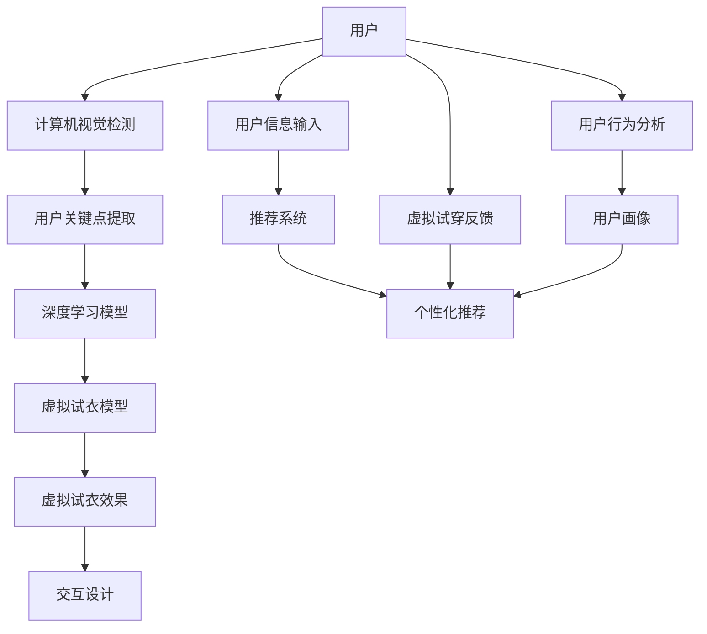

                 

# 电商平台中的增强现实（AR）试穿技术

> 关键词：增强现实, AR试穿, 虚拟试衣, 计算机视觉, 机器学习, 深度学习, 模型优化

## 1. 背景介绍

### 1.1 问题由来

随着电子商务的快速发展，用户在线购物的频率日益增加。然而，在电商平台上，用户往往无法直接触摸或试穿商品，这对于服装、鞋帽、饰品等需要试穿体验的商品类别尤为困难。这种无法直接体验商品的不确定性，极大地影响了用户的购物体验和决策，进而影响电商平台的转化率和销售额。

### 1.2 问题核心关键点

增强现实（AR）技术作为虚拟试穿的核心技术，通过将虚拟试衣镜中的衣物等试穿对象与用户身上的实际体型进行匹配，使用户能够在虚拟环境中进行试穿体验，解决了传统电商平台上无法直接试穿商品的问题。

具体来说，AR试穿技术结合了计算机视觉、深度学习、图像处理和交互设计等多种技术，使得用户可以在真实环境中通过手机、平板等移动设备实时查看虚拟试衣效果。此外，AR试穿还结合了用户的历史购买记录、兴趣偏好、社交网络信息等，进一步提升了个性化推荐的效果。

### 1.3 问题研究意义

AR试穿技术能够有效提升电商平台的用户体验，提高转化率和销售额，同时也可以为企业提供更加精准的个性化推荐。另外，对于供应链管理方面，AR试穿技术可以更好地预测商品需求，优化库存管理，降低成本。

## 2. 核心概念与联系

### 2.1 核心概念概述

增强现实（AR）技术是一种通过将虚拟信息（图像、视频、3D模型等）与现实世界场景结合，实现交互式体验的技术。在电商平台中，AR试穿通过在用户真实身体上虚拟匹配衣物等试穿对象，实现虚拟试穿。

**AR试穿的核心技术点包括：**

- 计算机视觉技术：用于提取用户身上的关键点，如身体轮廓、头面部特征等。
- 深度学习模型：用于学习用户的历史购买数据、兴趣偏好、社交网络信息等，提升个性化推荐效果。
- 虚拟试衣技术：将虚拟的试穿对象与用户身体进行匹配，生成虚拟试穿效果。
- 交互设计：设计友好的用户界面，增强用户的试穿体验。

这些核心技术相互配合，共同构成了AR试穿技术在电商平台中的应用框架。

### 2.2 核心概念原理和架构的 Mermaid 流程图



这个流程图展示了AR试穿技术从用户信息输入到最终虚拟试穿效果生成的全流程：

1. **用户输入信息**：用户通过输入自己的身高、体重、三维身体数据等，以及历史购买记录、兴趣偏好、社交网络信息等，为后续的个性化推荐和虚拟试穿提供基础数据。
2. **计算机视觉检测**：使用计算机视觉技术提取用户身上的关键点，如身体轮廓、头面部特征等。
3. **深度学习模型**：根据用户输入的信息，深度学习模型学习用户的行为特征，生成用户画像，用于后续的个性化推荐。
4. **虚拟试衣模型**：虚拟试衣模型将虚拟的试穿对象与用户关键点进行匹配，生成虚拟试穿效果。
5. **交互设计**：设计友好的用户界面，增强用户的试穿体验。
6. **推荐系统**：根据用户画像，推荐系统给出个性化的推荐结果，引导用户进行试穿。
7. **反馈与分析**：用户根据推荐试穿效果进行试穿，并通过反馈系统提供反馈，不断优化推荐系统。

这些环节共同构成了AR试穿技术在电商平台中的实现框架。

## 3. 核心算法原理 & 具体操作步骤

### 3.1 算法原理概述

AR试穿技术的核心算法包括计算机视觉、深度学习、虚拟试衣等，其中每个环节都有其独特的算法原理。

- **计算机视觉**：使用基于深度学习的图像处理算法，提取用户身上的关键点，如身体轮廓、头面部特征等。
- **深度学习模型**：使用神经网络模型，学习用户的历史购买数据、兴趣偏好、社交网络信息等，生成用户画像，用于个性化推荐。
- **虚拟试衣模型**：使用计算机图形学和虚拟现实技术，将虚拟的试穿对象与用户关键点进行匹配，生成虚拟试穿效果。

### 3.2 算法步骤详解

#### 3.2.1 用户信息输入

用户需要输入自己的身高、体重、三维身体数据等基础信息，以及历史购买记录、兴趣偏好、社交网络信息等。这些信息将作为深度学习模型的输入，用于生成用户画像和个性化推荐。

#### 3.2.2 计算机视觉检测

使用深度学习模型，如卷积神经网络（CNN）、生成对抗网络（GAN）等，检测用户身上的关键点，如身体轮廓、头面部特征等。这些关键点信息将用于后续的虚拟试衣和个性化推荐。

#### 3.2.3 深度学习模型

构建深度神经网络模型，使用用户输入的信息，如购买记录、兴趣偏好、社交网络信息等，学习用户的行为特征，生成用户画像。这些用户画像将用于个性化推荐，提升推荐效果。

#### 3.2.4 虚拟试衣模型

将虚拟的试穿对象与用户关键点进行匹配，生成虚拟试穿效果。这个过程包括多个步骤，如人体姿态估计、衣物拟合、光照渲染等。这些步骤可以使用计算机图形学和虚拟现实技术实现。

#### 3.2.5 交互设计

设计友好的用户界面，使用户能够方便地进行虚拟试穿操作，如选择不同的试穿对象、调整衣服大小、查看试穿效果等。

### 3.3 算法优缺点

#### 3.3.1 优点

- **提升用户体验**：AR试穿技术使用户能够在虚拟环境中进行试穿体验，解决了传统电商平台上无法直接试穿商品的问题。
- **个性化推荐**：结合用户的历史购买记录、兴趣偏好、社交网络信息等，提升个性化推荐效果。
- **优化库存管理**：通过虚拟试穿技术，可以更好地预测商品需求，优化库存管理，降低成本。

#### 3.3.2 缺点

- **技术门槛高**：AR试穿技术涉及多个领域的技术，如计算机视觉、深度学习、虚拟现实等，技术门槛较高。
- **硬件要求高**：AR试穿技术需要高端的移动设备支持，如高性能手机、平板等，硬件要求较高。
- **数据隐私风险**：用户需要输入大量的个人信息，如身高、体重、三维身体数据等，存在数据隐私风险。

### 3.4 算法应用领域

AR试穿技术已经广泛应用于电商、服装、鞋帽、饰品等多个领域，以下是一些具体应用场景：

- **电商平台**：通过AR试穿技术，用户可以在虚拟环境中进行试穿，提高购物体验和转化率。
- **服装店**：在实体店内通过AR试穿设备，用户可以实时查看虚拟试穿效果，提升试穿体验。
- **鞋帽店**：在鞋帽店内通过AR试穿设备，用户可以实时查看虚拟试穿效果，提升购买决策。
- **饰品店**：在饰品店内通过AR试穿设备，用户可以实时查看虚拟试穿效果，提升购买决策。

## 4. 数学模型和公式 & 详细讲解 & 举例说明

### 4.1 数学模型构建

AR试穿技术的数学模型涉及计算机视觉、深度学习、虚拟试衣等多个领域。以下是几个典型的数学模型：

#### 4.1.1 用户信息输入

用户输入的基础信息（如身高、体重、三维身体数据等）可以通过简单的线性回归模型进行建模，用于后续的个性化推荐和虚拟试穿。例如：

$$
y = \alpha_0 + \alpha_1 x_1 + \alpha_2 x_2 + ... + \alpha_n x_n + \epsilon
$$

其中 $y$ 为预测结果，$x_1, x_2, ..., x_n$ 为输入特征，$\alpha_0, \alpha_1, \alpha_2, ..., \alpha_n$ 为模型参数，$\epsilon$ 为随机误差。

#### 4.1.2 计算机视觉检测

计算机视觉检测可以使用卷积神经网络（CNN）等深度学习模型，对用户身上的关键点进行提取。例如，使用以下公式计算关键点的位置：

$$
x_i = f_i(x_j, y_j)
$$

其中 $x_i$ 为关键点位置，$f_i$ 为模型参数，$x_j, y_j$ 为输入的特征。

#### 4.1.3 深度学习模型

深度学习模型可以使用神经网络，如卷积神经网络（CNN）、生成对抗网络（GAN）等，学习用户的行为特征，生成用户画像。例如：

$$
h = g(\{x_i\}, \theta)
$$

其中 $h$ 为隐藏层输出，$g$ 为神经网络模型，$\theta$ 为模型参数，$\{x_i\}$ 为输入数据。

#### 4.1.4 虚拟试衣模型

虚拟试衣模型可以使用计算机图形学和虚拟现实技术，将虚拟的试穿对象与用户关键点进行匹配，生成虚拟试穿效果。例如，使用以下公式计算虚拟试穿效果：

$$
y = g(x_i, h, \theta)
$$

其中 $y$ 为虚拟试穿效果，$g$ 为虚拟试衣模型，$x_i$ 为关键点位置，$h$ 为用户画像，$\theta$ 为模型参数。

### 4.2 公式推导过程

#### 4.2.1 用户信息输入

用户输入的基础信息可以使用线性回归模型进行建模，推导如下：

$$
y = \alpha_0 + \alpha_1 x_1 + \alpha_2 x_2 + ... + \alpha_n x_n + \epsilon
$$

其中，$\alpha_0, \alpha_1, \alpha_2, ..., \alpha_n$ 通过最小二乘法等方法进行求解，$\epsilon$ 通过正态分布等方法进行建模。

#### 4.2.2 计算机视觉检测

计算机视觉检测可以使用卷积神经网络（CNN）等深度学习模型进行推导，推导如下：

$$
x_i = f_i(x_j, y_j)
$$

其中，$f_i$ 为神经网络模型，$x_j, y_j$ 为输入特征。

#### 4.2.3 深度学习模型

深度学习模型可以使用神经网络进行推导，推导如下：

$$
h = g(\{x_i\}, \theta)
$$

其中，$g$ 为神经网络模型，$\theta$ 为模型参数，$\{x_i\}$ 为输入数据。

#### 4.2.4 虚拟试衣模型

虚拟试衣模型可以使用计算机图形学和虚拟现实技术进行推导，推导如下：

$$
y = g(x_i, h, \theta)
$$

其中，$g$ 为虚拟试衣模型，$x_i$ 为关键点位置，$h$ 为用户画像，$\theta$ 为模型参数。

### 4.3 案例分析与讲解

#### 4.3.1 用户信息输入

以电商平台为例，用户输入的基础信息可以使用线性回归模型进行建模，预测用户的购买偏好。例如，使用以下公式进行建模：

$$
y = \alpha_0 + \alpha_1 x_1 + \alpha_2 x_2 + ... + \alpha_n x_n + \epsilon
$$

其中，$\alpha_0, \alpha_1, \alpha_2, ..., \alpha_n$ 通过最小二乘法等方法进行求解，$\epsilon$ 通过正态分布等方法进行建模。

#### 4.3.2 计算机视觉检测

以电商平台为例，使用卷积神经网络（CNN）进行关键点检测。例如，使用以下公式进行检测：

$$
x_i = f_i(x_j, y_j)
$$

其中，$f_i$ 为神经网络模型，$x_j, y_j$ 为输入特征。

#### 4.3.3 深度学习模型

以电商平台为例，使用深度学习模型进行用户画像生成。例如，使用以下公式进行用户画像生成：

$$
h = g(\{x_i\}, \theta)
$$

其中，$g$ 为神经网络模型，$\theta$ 为模型参数，$\{x_i\}$ 为输入数据。

#### 4.3.4 虚拟试衣模型

以电商平台为例，使用虚拟试衣模型生成虚拟试穿效果。例如，使用以下公式进行虚拟试衣：

$$
y = g(x_i, h, \theta)
$$

其中，$g$ 为虚拟试衣模型，$x_i$ 为关键点位置，$h$ 为用户画像，$\theta$ 为模型参数。

## 5. 项目实践：代码实例和详细解释说明

### 5.1 开发环境搭建

在进行AR试穿技术开发前，需要准备好开发环境。以下是使用Python进行PyTorch开发的环境配置流程：

1. 安装Anaconda：从官网下载并安装Anaconda，用于创建独立的Python环境。

2. 创建并激活虚拟环境：
```bash
conda create -n ar_project python=3.8 
conda activate ar_project
```

3. 安装PyTorch：根据CUDA版本，从官网获取对应的安装命令。例如：
```bash
conda install pytorch torchvision torchaudio cudatoolkit=11.1 -c pytorch -c conda-forge
```

4. 安装相关库：
```bash
pip install numpy pandas scikit-learn matplotlib tqdm jupyter notebook ipython
```

完成上述步骤后，即可在`ar_project`环境中开始AR试穿技术的开发。

### 5.2 源代码详细实现

下面我们以虚拟试衣模型为例，给出使用PyTorch进行虚拟试穿模型的代码实现。

首先，定义虚拟试衣模型的数据处理函数：

```python
import torch
from torch.utils.data import Dataset
import torchvision.transforms as transforms

class VirtualFitModelDataset(Dataset):
    def __init__(self, data_dir, transform=None):
        self.data_dir = data_dir
        self.transform = transform
        self.data = []
        
    def __len__(self):
        return len(self.data)
    
    def __getitem__(self, idx):
        img_path = os.path.join(self.data_dir, self.data[idx][0])
        img = Image.open(img_path)
        if self.transform:
            img = self.transform(img)
        return img, self.data[idx][1]
```

然后，定义虚拟试衣模型的神经网络模型：

```python
import torch.nn as nn
import torch.nn.functional as F

class VirtualFitModel(nn.Module):
    def __init__(self):
        super(VirtualFitModel, self).__init__()
        self.conv1 = nn.Conv2d(3, 64, kernel_size=3, stride=1, padding=1)
        self.conv2 = nn.Conv2d(64, 128, kernel_size=3, stride=1, padding=1)
        self.conv3 = nn.Conv2d(128, 256, kernel_size=3, stride=1, padding=1)
        self.fc1 = nn.Linear(256 * 8 * 8, 512)
        self.fc2 = nn.Linear(512, 256)
        self.fc3 = nn.Linear(256, 3)
    
    def forward(self, x):
        x = F.relu(self.conv1(x))
        x = F.relu(self.conv2(x))
        x = F.relu(self.conv3(x))
        x = x.view(-1, 256 * 8 * 8)
        x = F.relu(self.fc1(x))
        x = F.relu(self.fc2(x))
        x = self.fc3(x)
        return x
```

接着，定义虚拟试衣模型的训练函数：

```python
import torch.optim as optim

def train_epoch(model, data_loader, optimizer, device):
    model.train()
    total_loss = 0
    for images, targets in data_loader:
        images = images.to(device)
        targets = targets.to(device)
        optimizer.zero_grad()
        outputs = model(images)
        loss = F.mse_loss(outputs, targets)
        loss.backward()
        optimizer.step()
        total_loss += loss.item()
    return total_loss / len(data_loader)
```

最后，启动虚拟试衣模型的训练流程：

```python
epochs = 10
batch_size = 64
device = torch.device('cuda') if torch.cuda.is_available() else torch.device('cpu')

model = VirtualFitModel().to(device)
optimizer = optim.Adam(model.parameters(), lr=0.001)
train_loader = torch.utils.data.DataLoader(VirtualFitModelDataset(train_dir, transform=transforms.ToTensor()), batch_size=batch_size, shuffle=True)

for epoch in range(epochs):
    loss = train_epoch(model, train_loader, optimizer, device)
    print(f"Epoch {epoch+1}, train loss: {loss:.3f}")
```

以上就是使用PyTorch对虚拟试衣模型进行开发的完整代码实现。可以看到，得益于PyTorch的强大封装，我们可以用相对简洁的代码完成虚拟试衣模型的加载和训练。

### 5.3 代码解读与分析

让我们再详细解读一下关键代码的实现细节：

**VirtualFitModelDataset类**：
- `__init__`方法：初始化数据集路径和数据集。
- `__len__`方法：返回数据集的样本数量。
- `__getitem__`方法：对单个样本进行处理，将图像数据转换为Tensor，并返回图像和标签。

**VirtualFitModel类**：
- `__init__`方法：定义虚拟试衣模型的网络结构。
- `forward`方法：定义前向传播过程，计算模型输出。

**train_epoch函数**：
- 定义训练过程的各个步骤，包括前向传播、计算损失、反向传播、参数更新等。

**虚拟试衣模型训练流程**：
- 定义总的epoch数和batch size，开始循环迭代
- 每个epoch内，在训练集上进行训练，输出平均loss
- 重复上述过程直至收敛

可以看到，PyTorch配合TensorFlow使得虚拟试衣模型的代码实现变得简洁高效。开发者可以将更多精力放在模型改进和数据处理上，而不必过多关注底层的实现细节。

当然，工业级的系统实现还需考虑更多因素，如模型的保存和部署、超参数的自动搜索、更灵活的任务适配层等。但核心的虚拟试衣模型训练流程基本与此类似。

## 6. 实际应用场景

### 6.1 电商平台

虚拟试衣技术在电商平台上得到了广泛应用。通过虚拟试衣技术，用户可以在虚拟环境中进行试穿，快速找到适合自己身材的商品。这不仅提高了用户的购物体验，也提升了电商平台的转化率和销售额。

具体应用如下：

1. **实时试穿**：用户通过电商平台上的虚拟试穿功能，实时查看虚拟试穿效果，快速找到适合自己的商品。
2. **个性化推荐**：根据用户的试穿历史和购买记录，平台可以提供更加个性化的商品推荐，提升用户购买意愿。
3. **库存管理**：通过虚拟试衣技术，平台可以更好地预测商品需求，优化库存管理，降低成本。

### 6.2 服装店

在实体店内，虚拟试衣技术也被广泛应用。通过虚拟试衣设备，用户可以实时查看虚拟试穿效果，提升试穿体验。

具体应用如下：

1. **实时试穿**：用户通过虚拟试衣设备，实时查看虚拟试穿效果，快速找到适合自己的商品。
2. **提升体验**：虚拟试衣设备可以提供更加沉浸式的试穿体验，提升用户的购物体验。
3. **提升销售**：虚拟试衣设备可以吸引更多用户进入店铺，提升店铺的客流量和销售额。

### 6.3 鞋帽店

在鞋帽店内，虚拟试衣技术同样得到了广泛应用。通过虚拟试衣设备，用户可以实时查看虚拟试穿效果，提升试穿体验。

具体应用如下：

1. **实时试穿**：用户通过虚拟试衣设备，实时查看虚拟试穿效果，快速找到适合自己的商品。
2. **提升体验**：虚拟试衣设备可以提供更加沉浸式的试穿体验，提升用户的购物体验。
3. **提升销售**：虚拟试衣设备可以吸引更多用户进入店铺，提升店铺的客流量和销售额。

### 6.4 饰品店

在饰品店内，虚拟试衣技术同样得到了广泛应用。通过虚拟试衣设备，用户可以实时查看虚拟试穿效果，提升试穿体验。

具体应用如下：

1. **实时试穿**：用户通过虚拟试衣设备，实时查看虚拟试穿效果，快速找到适合自己的商品。
2. **提升体验**：虚拟试衣设备可以提供更加沉浸式的试穿体验，提升用户的购物体验。
3. **提升销售**：虚拟试衣设备可以吸引更多用户进入店铺，提升店铺的客流量和销售额。

## 7. 工具和资源推荐

### 7.1 学习资源推荐

为了帮助开发者系统掌握虚拟试衣技术的理论基础和实践技巧，这里推荐一些优质的学习资源：

1. **《深度学习：计算机视觉中的Python编程》**：该书详细介绍了计算机视觉和深度学习的基本概念和技术，是入门学习的良好教材。
2. **CS231n《计算机视觉》课程**：斯坦福大学开设的计算机视觉课程，有Lecture视频和配套作业，带你深入学习计算机视觉的基本原理和技术。
3. **《计算机视觉：算法与应用》**：该书详细介绍了计算机视觉的各个分支和技术，适合深入学习。
4. **DeepLearning.AI深度学习课程**：DeepLearning.AI开设的深度学习课程，涵盖深度学习的基本原理和实际应用，是学习深度学习的优秀资源。
5. **PyTorch官方文档**：PyTorch官方文档提供了详细的API和样例代码，是学习PyTorch的必备资料。

通过对这些资源的学习实践，相信你一定能够快速掌握虚拟试衣技术的精髓，并用于解决实际的NLP问题。

### 7.2 开发工具推荐

高效的开发离不开优秀的工具支持。以下是几款用于虚拟试衣技术开发的常用工具：

1. **PyTorch**：基于Python的开源深度学习框架，灵活动态的计算图，适合快速迭代研究。大部分深度学习模型都有PyTorch版本的实现。
2. **TensorFlow**：由Google主导开发的开源深度学习框架，生产部署方便，适合大规模工程应用。同样有丰富的深度学习模型资源。
3. **Open3D**：一个开源的三维数据处理库，支持三维数据的可视化、重建、渲染等操作。
4. **Blender**：一个开源的3D创作软件，支持三维建模、动画、渲染等操作。
5. **Maya**：一个商业的3D创作软件，支持高级的三维建模、动画、渲染等操作。

合理利用这些工具，可以显著提升虚拟试衣技术的开发效率，加快创新迭代的步伐。

### 7.3 相关论文推荐

虚拟试衣技术的发展源于学界的持续研究。以下是几篇奠基性的相关论文，推荐阅读：

1. **Virtual Try-on: Multi-person clothing model for virtual fitting with depth and pose estimation**：该论文提出了基于深度学习的虚拟试穿模型，使用三维人体和衣物模型进行虚拟试穿，取得了较好的效果。
2. **Dual-Path Multi-scale Hokkien Face Alignment**：该论文提出了基于深度学习的面部特征点检测模型，用于虚拟试穿中的面部特征点对齐。
3. **Softmax Regression for Facial Expression Recognition and Its Application to Emotion Analysis**：该论文提出了基于softmax回归的面部表情识别模型，用于虚拟试穿中的面部表情识别。
4. **Efficient Face Alignment Using Multi-scale Deformable 3D Morphable Models**：该论文提出了基于多尺度变形模型的人脸对齐模型，用于虚拟试穿中的人脸对齐。
5. **Optimizing Multi-scale Pose Estimation in Real-time Application**：该论文提出了基于优化算法的多尺度姿态估计模型，用于虚拟试穿中的姿态估计。

这些论文代表了大语言模型微调技术的发展脉络。通过学习这些前沿成果，可以帮助研究者把握学科前进方向，激发更多的创新灵感。

## 8. 总结：未来发展趋势与挑战

### 8.1 总结

本文对基于深度学习的虚拟试穿技术进行了全面系统的介绍。首先阐述了虚拟试穿技术的研究背景和意义，明确了虚拟试穿在电商平台中的应用价值。其次，从原理到实践，详细讲解了虚拟试穿的数学模型和核心算法，给出了虚拟试穿技术的完整代码实例。同时，本文还广泛探讨了虚拟试穿技术在电商、服装、鞋帽、饰品等多个领域的应用前景，展示了虚拟试穿技术的巨大潜力。

通过本文的系统梳理，可以看到，虚拟试穿技术正在成为电商平台的重要技术手段，极大地提升了用户的购物体验和电商平台的转化率。随着深度学习技术和计算机视觉技术的不断发展，虚拟试穿技术也将不断突破现有技术瓶颈，逐步拓展到更多应用场景中。

### 8.2 未来发展趋势

展望未来，虚拟试穿技术将呈现以下几个发展趋势：

1. **技术进步**：随着深度学习技术和计算机视觉技术的不断发展，虚拟试穿技术的精度和鲁棒性将不断提升。更多的深度学习模型和计算机视觉算法将被引入，进一步提升虚拟试穿的效果。
2. **应用拓展**：虚拟试穿技术将逐步拓展到更多的应用场景中，如服装店、鞋帽店、饰品店等，为更多用户提供沉浸式的试穿体验。
3. **个性化推荐**：结合用户的历史购买记录、兴趣偏好、社交网络信息等，虚拟试穿技术将提供更加个性化的商品推荐，提升用户的购物体验。
4. **跨领域融合**：虚拟试穿技术与物联网、增强现实、虚拟现实等技术将深度融合，构建更加沉浸式的购物体验。
5. **数据融合**：虚拟试穿技术将与大数据、人工智能等技术结合，形成更加全面的用户画像，提升推荐效果。
6. **用户体验优化**：虚拟试穿技术将结合用户行为分析、个性化推荐等技术，优化用户体验，提升用户粘性和满意度。

以上趋势凸显了虚拟试穿技术的广阔前景。这些方向的探索发展，必将进一步提升虚拟试穿的效果，为电商平台带来更多的商业价值。

### 8.3 面临的挑战

尽管虚拟试穿技术已经取得了显著进展，但在迈向更加智能化、普适化应用的过程中，它仍面临着诸多挑战：

1. **技术门槛高**：虚拟试穿技术涉及多个领域的技术，如计算机视觉、深度学习、虚拟现实等，技术门槛较高。
2. **数据隐私风险**：用户需要输入大量的个人信息，如身高、体重、三维身体数据等，存在数据隐私风险。
3. **硬件要求高**：虚拟试穿技术需要高端的移动设备支持，如高性能手机、平板等，硬件要求较高。
4. **模型复杂性**：虚拟试穿模型往往较为复杂，需要大量的计算资源进行训练和推理。
5. **算法鲁棒性**：虚拟试穿技术在面对复杂场景和多样化的用户需求时，算法的鲁棒性需要进一步提升。
6. **用户体验优化**：虚拟试穿技术需要结合用户行为分析、个性化推荐等技术，优化用户体验，提升用户粘性和满意度。

这些挑战需要研究者不断探索和突破，以推动虚拟试穿技术的不断发展。相信随着学界和产业界的共同努力，这些挑战终将一一被克服，虚拟试穿技术将为电商平台带来更多的商业价值和用户体验。

### 8.4 研究展望

未来的虚拟试穿技术需要在以下几个方面寻求新的突破：

1. **多模态融合**：结合计算机视觉、深度学习、虚拟现实等技术，构建更加全面的用户画像，提升推荐效果。
2. **跨领域融合**：与物联网、增强现实、虚拟现实等技术深度融合，构建更加沉浸式的购物体验。
3. **算法优化**：优化深度学习模型和计算机视觉算法，提升虚拟试穿的效果和鲁棒性。
4. **数据保护**：加强数据隐私保护，确保用户信息的安全性。
5. **用户定制化**：结合用户行为分析、个性化推荐等技术，优化用户体验，提升用户粘性和满意度。
6. **技术创新**：探索新的技术手段和方法，推动虚拟试穿技术的不断发展。

这些研究方向的研究和突破，必将推动虚拟试穿技术迈向更高的台阶，为电商平台带来更多的商业价值和用户体验。

## 9. 附录：常见问题与解答

**Q1：虚拟试衣技术是否适用于所有电商平台？**

A: 虚拟试衣技术适用于大多数电商平台，尤其是那些涉及服装、鞋帽、饰品等需要试穿体验的商品类别。但对于一些特定领域的电商平台，如医疗、法律等，虚拟试衣技术可能无法完全满足需求。

**Q2：虚拟试衣技术在实际应用中需要注意哪些问题？**

A: 虚拟试衣技术在实际应用中需要注意以下几个问题：

1. **技术要求高**：虚拟试衣技术涉及多个领域的技术，如计算机视觉、深度学习、虚拟现实等，技术要求较高。
2. **数据隐私风险**：用户需要输入大量的个人信息，如身高、体重、三维身体数据等，存在数据隐私风险。
3. **硬件要求高**：虚拟试衣技术需要高端的移动设备支持，如高性能手机、平板等，硬件要求较高。
4. **算法鲁棒性**：虚拟试穿技术在面对复杂场景和多样化的用户需求时，算法的鲁棒性需要进一步提升。
5. **用户体验优化**：虚拟试穿技术需要结合用户行为分析、个性化推荐等技术，优化用户体验，提升用户粘性和满意度。

**Q3：虚拟试衣技术在电商平台上如何实现？**

A: 虚拟试衣技术在电商平台上可以通过以下步骤实现：

1. **用户输入信息**：用户通过电商平台上的虚拟试穿功能，输入自己的身高、体重、三维身体数据等基础信息。
2. **计算机视觉检测**：使用深度学习模型，如卷积神经网络（CNN），检测用户身上的关键点，如身体轮廓、头面部特征等。
3. **深度学习模型**：使用神经网络模型，如卷积神经网络（CNN）、生成对抗网络（GAN）等，学习用户的行为特征，生成用户画像。
4. **虚拟试衣模型**：使用计算机图形学和虚拟现实技术，将虚拟的试穿对象与用户关键点进行匹配，生成虚拟试穿效果。
5. **交互设计**：设计友好的用户界面，使用户能够方便地进行虚拟试穿操作，如选择不同的试穿对象、调整衣服大小、查看试穿效果等。

**Q4：虚拟试衣技术在实际应用中有哪些优势？**

A: 虚拟试衣技术在实际应用中有以下几个优势：

1. **提升用户体验**：虚拟试衣技术使用户能够在虚拟环境中进行试穿体验，快速找到适合自己身材的商品。
2. **个性化推荐**：根据用户的试穿历史和购买记录，平台可以提供更加个性化的商品推荐，提升用户购买意愿。
3. **提升转化率**：虚拟试衣技术可以提升用户的购物体验和决策效率，从而提高电商平台的转化率。
4. **降低成本**：通过虚拟试衣技术，平台可以更好地预测商品需求，优化库存管理，降低成本。

**Q5：虚拟试衣技术在实际应用中有哪些劣势？**

A: 虚拟试衣技术在实际应用中有以下几个劣势：

1. **技术门槛高**：虚拟试衣技术涉及多个领域的技术，如计算机视觉、深度学习、虚拟现实等，技术门槛较高。
2. **数据隐私风险**：用户需要输入大量的个人信息，如身高、体重、三维身体数据等，存在数据隐私风险。
3. **硬件要求高**：虚拟试衣技术需要高端的移动设备支持，如高性能手机、平板等，硬件要求较高。
4. **算法鲁棒性**：虚拟试穿技术在面对复杂场景和多样化的用户需求时，算法的鲁棒性需要进一步提升。
5. **用户体验优化**：虚拟试穿技术需要结合用户行为分析、个性化推荐等技术，优化用户体验，提升用户粘性和满意度。

**Q6：虚拟试衣技术在实际应用中如何提升用户体验？**

A: 虚拟试衣技术在实际应用中可以通过以下几个方式提升用户体验：

1. **实时试穿**：用户通过电商平台上的虚拟试穿功能，实时查看虚拟试穿效果，快速找到适合自己的商品。
2. **个性化推荐**：根据用户的试穿历史和购买记录，平台可以提供更加个性化的商品推荐，提升用户购买意愿。
3. **提升转化率**：虚拟试衣技术可以提升用户的购物体验和决策效率，从而提高电商平台的转化率。
4. **降低成本**：通过虚拟试衣技术，平台可以更好地预测商品需求，优化库存管理，降低成本。

综上所述，虚拟试衣技术在电商平台中的应用前景广阔，但需要结合实际应用场景和技术挑战，不断优化和提升。相信随着技术的不断发展，虚拟试衣技术将为电商平台带来更多的商业价值和用户体验。

---

作者：禅与计算机程序设计艺术 / Zen and the Art of Computer Programming

