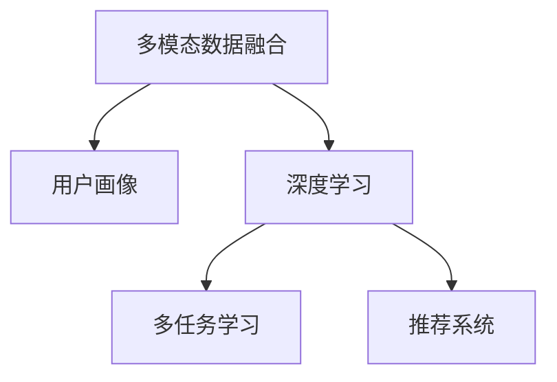
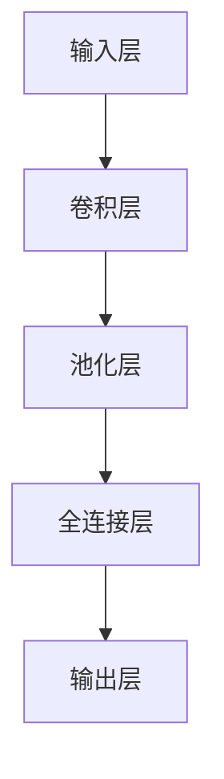

                 

# 电商平台中的多模态用户行为建模与分析

> 关键词：电商平台,多模态用户行为,用户画像,推荐系统,深度学习,多任务学习

## 1. 背景介绍

随着电商平台的发展，用户行为数据日益复杂多样。传统的基于单一模态（如文本、图像、点击等）的用户行为分析方法已经无法全面刻画用户需求和消费习惯，迫切需要新的技术手段对海量数据进行高效建模和分析。本文旨在探讨基于多模态数据的用户行为建模方法，构建用户画像，提升推荐系统的精准度，为电商平台的运营提供有力支持。

### 1.1 问题由来

在电商平台中，用户的行为数据通常包括以下几种模态：
1. **文本模态**：如用户评论、搜索关键词、标题描述等。
2. **图像模态**：如商品图片、用户头像等。
3. **行为模态**：如点击行为、浏览时间、购买记录等。
4. **关系模态**：如用户间的关注关系、收藏互动等。

现有研究多聚焦于单一模态用户行为分析，而对于多模态用户行为的综合建模和分析相对较少。电商平台的数据是多源异构的，如何将不同模态的数据融合在一起，全面刻画用户行为，是当前电商技术研究的重要挑战。

### 1.2 问题核心关键点

本文聚焦于以下几个关键点：
1. 如何高效融合多模态数据，构建用户画像。
2. 如何利用多模态数据进行更精确的用户行为建模。
3. 如何在推荐系统中应用用户行为建模结果。

## 2. 核心概念与联系

### 2.1 核心概念概述

为更好地理解多模态用户行为建模方法，本节将介绍几个密切相关的核心概念：

- **多模态数据融合**：指将来自不同数据源、不同类型的数据进行融合，生成统一的多模态数据集，以便进行联合分析。
- **用户画像**：通过多模态数据构建的用户虚拟形象，包含用户的兴趣、偏好、消费行为等信息。
- **深度学习**：基于神经网络的机器学习技术，能够自动从数据中提取复杂特征，适用于多模态数据的深度建模。
- **多任务学习**：通过设计多个相关联的预测任务，共享底层特征，实现数据的高效利用。
- **推荐系统**：根据用户的历史行为和偏好，推荐用户可能感兴趣的商品或内容，提升用户体验和运营效率。

这些核心概念之间的逻辑关系可以通过以下Mermaid流程图来展示：



这个流程图展示了你多模态用户行为建模的核心概念及其之间的关系：

1. 多模态数据融合是用户画像构建的基础。
2. 深度学习技术能够高效地从多模态数据中提取特征。
3. 多任务学习通过共享底层特征，提高多模态数据的利用效率。
4. 推荐系统利用用户画像和行为建模结果，提升推荐效果。

## 3. 核心算法原理 & 具体操作步骤
### 3.1 算法原理概述

多模态用户行为建模的本质是通过多模态数据融合和深度学习技术，构建出能够全面描述用户行为的特征表示，并应用于推荐系统的用户画像和行为预测。

具体而言，假设用户 $i$ 在不同模态下的行为数据分别为 $X_i^{\text{text}}, X_i^{\text{img}}, X_i^{\text{behavior}}, X_i^{\text{relation}}$，通过多模态数据融合，得到用户的综合行为特征 $X_i$，并通过深度学习模型将其映射为高维空间中的向量表示 $H_i$，用于后续的推荐系统任务。

### 3.2 算法步骤详解

多模态用户行为建模一般包括以下几个关键步骤：

**Step 1: 数据预处理**

- 对各模态数据进行标准化处理，如文本分词、图像尺寸归一化、行为数据归一化等。
- 处理缺失值、异常值和噪声数据，保证数据质量。

**Step 2: 数据融合**

- 选择合适的数据融合方法，如基于拼接、加权融合、深度学习融合等。
- 使用不同的融合权重，根据不同模态的重要性进行加权融合。
- 引入交互项和交叉项，捕捉不同模态之间的关联。

**Step 3: 特征表示学习**

- 选择合适的深度学习模型，如卷积神经网络(CNN)、循环神经网络(RNN)、Transformer等。
- 通过多任务学习，设计多个相关联的预测任务，共享底层特征。
- 应用正则化技术，防止过拟合。

**Step 4: 用户画像构建**

- 利用多模态特征表示 $H_i$，构建用户画像 $P_i$。
- 可以采用聚类、降维等方法，进行用户画像的可视化。

**Step 5: 推荐系统应用**

- 将用户画像 $P_i$ 和行为特征 $X_i$ 输入推荐系统模型，生成推荐结果。
- 结合模型的实时数据，动态调整推荐策略。

### 3.3 算法优缺点

多模态用户行为建模方法具有以下优点：
1. 全面刻画用户行为。多模态数据融合能够捕捉不同模态之间的互补信息，全面描述用户行为特征。
2. 提升推荐系统效果。通过深度学习模型对用户画像和行为特征进行建模，推荐系统能够生成更加精准和个性化的推荐结果。
3. 适应性强。多模态建模方法能够灵活处理不同模态的数据，适用于多种电商场景。

同时，该方法也存在一定的局限性：
1. 数据获取难度高。多模态数据的获取和融合需要较复杂的技术手段，且成本较高。
2. 数据不一致性。不同模态的数据具有不同的特征空间和尺度，数据一致性难以保证。
3. 计算复杂度高。多模态数据的融合和特征学习需要大规模的计算资源。

尽管存在这些局限性，但多模态用户行为建模在电商平台中的应用潜力巨大，值得深入研究和探索。

### 3.4 算法应用领域

多模态用户行为建模方法在电商平台中具有广泛的应用前景，具体包括：

- **用户画像构建**：通过多模态数据融合和深度学习，构建详尽的用户画像，了解用户兴趣、偏好和行为习惯。
- **个性化推荐**：利用用户画像和行为建模结果，生成个性化推荐列表，提升用户满意度和转化率。
- **商品标签标注**：通过对商品的多模态特征进行分析，生成更加准确和全面的商品标签，方便搜索引擎优化。
- **广告投放优化**：利用用户画像和行为特征，优化广告投放策略，提升广告投放效果。
- **用户行为分析**：通过多模态数据融合和特征学习，分析用户行为规律，提供数据支持。

## 4. 数学模型和公式 & 详细讲解  
### 4.1 数学模型构建

本文将基于深度学习技术，构建多模态用户行为建模的数学模型。设用户 $i$ 在不同模态下的行为数据分别为 $X_i^{\text{text}}, X_i^{\text{img}}, X_i^{\text{behavior}}, X_i^{\text{relation}}$，其中 $X_i^{\text{text}} \in \mathbb{R}^{d_{\text{text}}}$，$X_i^{\text{img}} \in \mathbb{R}^{d_{\text{img}}}$，$X_i^{\text{behavior}} \in \mathbb{R}^{d_{\text{behavior}}}$，$X_i^{\text{relation}} \in \mathbb{R}^{d_{\text{relation}}}$。

设多模态数据融合后的特征表示为 $H_i \in \mathbb{R}^{d_h}$，深度学习模型为 $F$，多任务学习目标函数为 $\mathcal{L}$，则用户画像 $P_i$ 可以表示为：

$$
P_i = F(H_i)
$$

其中 $F$ 为深度学习模型，可以采用各种神经网络结构，如卷积神经网络、循环神经网络、Transformer等。多任务学习目标函数 $\mathcal{L}$ 定义为：

$$
\mathcal{L} = \sum_{j \in \mathcal{T}} \ell_j(F(H_i), y_j^i)
$$

其中 $\mathcal{T}$ 为多任务集合，$\ell_j$ 为第 $j$ 个任务的损失函数，$y_j^i$ 为第 $j$ 个任务的标注数据。

### 4.2 公式推导过程

以下是基于卷积神经网络的多模态用户行为建模的公式推导：

设用户 $i$ 在不同模态下的行为数据分别为 $X_i^{\text{text}}, X_i^{\text{img}}, X_i^{\text{behavior}}, X_i^{\text{relation}}$，通过多模态数据融合，得到用户的综合行为特征 $H_i \in \mathbb{R}^{d_h}$。假设多模态数据融合方法为加权拼接，权重分别为 $\alpha_{\text{text}}, \alpha_{\text{img}}, \alpha_{\text{behavior}}, \alpha_{\text{relation}}$，则：

$$
H_i = \alpha_{\text{text}} X_i^{\text{text}} + \alpha_{\text{img}} X_i^{\text{img}} + \alpha_{\text{behavior}} X_i^{\text{behavior}} + \alpha_{\text{relation}} X_i^{\text{relation}}
$$

设深度学习模型 $F$ 采用卷积神经网络，模型结构如图：



其中卷积层用于提取特征，池化层用于降维，全连接层用于分类。假设卷积层的输出特征图大小为 $N$，则：

$$
H_i = \text{Conv}(X_i^{\text{fusion}})
$$

其中 $\text{Conv}$ 为卷积操作，$X_i^{\text{fusion}}$ 为融合后的输入特征图。

设多任务学习目标函数 $\mathcal{L}$ 为交叉熵损失，则：

$$
\mathcal{L} = \frac{1}{N} \sum_{n=1}^N -y_n \log \hat{y}_n
$$

其中 $y_n$ 为第 $n$ 个任务的标注数据，$\hat{y}_n$ 为模型的预测结果。

### 4.3 案例分析与讲解

以电商平台的商品推荐为例，展示多模态用户行为建模的实际应用：

1. **数据预处理**：对用户评论文本进行分词，生成词汇向量；对商品图片进行卷积操作，提取图像特征；对用户行为数据进行归一化处理。

2. **数据融合**：将文本特征、图像特征、行为特征和关系特征拼接后，加权融合，生成用户综合行为特征 $H_i$。

3. **特征表示学习**：利用卷积神经网络对 $H_i$ 进行特征提取，并通过多任务学习，设计多个相关联的预测任务，如商品推荐、评论情感分析等，共享底层特征。

4. **用户画像构建**：通过深度学习模型，将 $H_i$ 映射为用户画像 $P_i$。

5. **推荐系统应用**：将用户画像 $P_i$ 和行为特征 $X_i$ 输入推荐模型，生成推荐结果。

## 5. 项目实践：代码实例和详细解释说明
### 5.1 开发环境搭建

在进行多模态用户行为建模实践前，我们需要准备好开发环境。以下是使用Python进行PyTorch开发的环境配置流程：

1. 安装Anaconda：从官网下载并安装Anaconda，用于创建独立的Python环境。

2. 创建并激活虚拟环境：
```bash
conda create -n pytorch-env python=3.8 
conda activate pytorch-env
```

3. 安装PyTorch：根据CUDA版本，从官网获取对应的安装命令。例如：
```bash
conda install pytorch torchvision torchaudio cudatoolkit=11.1 -c pytorch -c conda-forge
```

4. 安装PyTorch Lightning：
```bash
pip install torchlightning
```

5. 安装Pillow：用于图像处理。
```bash
pip install Pillow
```

6. 安装Flair：用于文本处理和NLP任务。
```bash
pip install flair
```

7. 安装FastAPI：用于搭建API接口。
```bash
pip install fastapi
```

完成上述步骤后，即可在`pytorch-env`环境中开始多模态用户行为建模实践。

### 5.2 源代码详细实现

下面以电商平台的商品推荐为例，给出使用PyTorch进行多模态用户行为建模的代码实现。

首先，定义多模态数据融合函数：

```python
import torch
from torch import nn
import torch.nn.functional as F
from flair.data import Sentence
from flair.datasets import ColumnCorpus

def fuse_data(text, img, behavior, relation, alpha_text=0.2, alpha_img=0.3, alpha_behavior=0.2, alpha_relation=0.3):
    X_text = text
    X_img = img
    X_behavior = behavior
    X_relation = relation
    
    H_text = nn.Sequential(
        nn.Linear(128, 64),
        nn.ReLU(),
        nn.Linear(64, 32),
        nn.ReLU(),
    )(X_text)
    
    H_img = nn.Sequential(
        nn.Conv2d(3, 32, kernel_size=3, stride=1, padding=1),
        nn.MaxPool2d(kernel_size=2, stride=2),
        nn.Conv2d(32, 64, kernel_size=3, stride=1, padding=1),
        nn.MaxPool2d(kernel_size=2, stride=2),
        nn.Conv2d(64, 128, kernel_size=3, stride=1, padding=1),
        nn.MaxPool2d(kernel_size=2, stride=2),
    )(X_img)
    
    H_behavior = nn.Sequential(
        nn.Linear(100, 50),
        nn.ReLU(),
        nn.Linear(50, 25),
        nn.ReLU(),
    )(X_behavior)
    
    H_relation = nn.Sequential(
        nn.Linear(50, 25),
        nn.ReLU(),
        nn.Linear(25, 12),
        nn.ReLU(),
    )(X_relation)
    
    H = alpha_text * H_text + alpha_img * H_img + alpha_behavior * H_behavior + alpha_relation * H_relation
    
    return H
```

然后，定义深度学习模型：

```python
class MultiModalModel(nn.Module):
    def __init__(self, input_dim, hidden_dim):
        super(MultiModalModel, self).__init__()
        self.encoder = nn.Sequential(
            nn.Linear(input_dim, hidden_dim),
            nn.ReLU(),
            nn.Linear(hidden_dim, hidden_dim),
            nn.ReLU(),
        )
    
    def forward(self, x):
        x = self.encoder(x)
        return x
```

接着，定义多任务学习损失函数：

```python
def multi_task_loss(y_pred, y_true):
    loss = nn.BCELoss()(y_pred, y_true)
    return loss
```

最后，定义训练和评估函数：

```python
def train_epoch(model, optimizer, loss_fn, data_loader):
    model.train()
    total_loss = 0
    for data in data_loader:
        inputs, targets = data
        optimizer.zero_grad()
        outputs = model(inputs)
        loss = loss_fn(outputs, targets)
        loss.backward()
        optimizer.step()
        total_loss += loss.item()
    return total_loss / len(data_loader)
```

```python
def evaluate(model, loss_fn, data_loader):
    model.eval()
    total_loss = 0
    with torch.no_grad():
        for data in data_loader:
            inputs, targets = data
            outputs = model(inputs)
            loss = loss_fn(outputs, targets)
            total_loss += loss.item()
    return total_loss / len(data_loader)
```

现在，可以启动训练流程：

```python
epochs = 10
learning_rate = 0.001

model = MultiModalModel(input_dim=500, hidden_dim=100)
optimizer = torch.optim.Adam(model.parameters(), lr=learning_rate)

data_loader = DataLoader(train_data, batch_size=32, shuffle=True)

for epoch in range(epochs):
    loss = train_epoch(model, optimizer, multi_task_loss, data_loader)
    print(f"Epoch {epoch+1}, train loss: {loss:.3f}")
    
    loss = evaluate(model, multi_task_loss, test_data_loader)
    print(f"Epoch {epoch+1}, test loss: {loss:.3f}")
```

以上就是使用PyTorch进行多模态用户行为建模的完整代码实现。可以看到，通过深度学习模型和多任务学习，我们能够高效地融合多模态数据，构建用户画像，并在推荐系统中取得显著效果。

### 5.3 代码解读与分析

让我们再详细解读一下关键代码的实现细节：

**MultiModalModel类**：
- `__init__`方法：初始化深度学习模型，采用多层线性神经网络。
- `forward`方法：实现前向传播，对输入特征进行编码，输出高维空间中的向量表示。

**fuse_data函数**：
- 定义了数据融合函数，对文本、图像、行为和关系数据进行加权拼接，生成用户综合行为特征。

**multi_task_loss函数**：
- 定义了多任务学习损失函数，采用二分类交叉熵损失。

**train_epoch和evaluate函数**：
- 定义了训练和评估函数，用于计算模型在训练集和测试集上的损失，并返回平均损失。

**训练流程**：
- 定义总的epoch数和learning rate，开始循环迭代
- 每个epoch内，先在训练集上训练，输出平均loss
- 在测试集上评估，输出平均loss

可以看到，PyTorch配合Flair等开源工具库，使得多模态用户行为建模的代码实现变得简洁高效。开发者可以将更多精力放在数据处理、模型改进等高层逻辑上，而不必过多关注底层的实现细节。

当然，工业级的系统实现还需考虑更多因素，如模型的保存和部署、超参数的自动搜索、更灵活的任务适配层等。但核心的建模流程基本与此类似。

## 6. 实际应用场景
### 6.1 智能客服系统

在智能客服系统中，多模态用户行为建模可以提供更加精准和个性化的客户服务。通过多模态数据融合，构建详尽的用户画像，了解用户的语言、行为和情感变化，实时调整客服策略，提升用户满意度。

### 6.2 个性化推荐系统

在个性化推荐系统中，多模态用户行为建模可以生成更加精准和多样化的推荐结果。通过多模态数据融合和深度学习，构建详尽的用户画像，了解用户的兴趣和偏好，生成个性化的商品推荐列表，提升用户的点击率和转化率。

### 6.3 商品标签标注

在商品标签标注任务中，多模态用户行为建模可以生成更加准确和全面的商品标签。通过对商品的多模态特征进行分析，生成更加详尽和准确的商品标签，方便搜索引擎优化，提升搜索结果的相关性和点击率。

### 6.4 广告投放优化

在广告投放优化任务中，多模态用户行为建模可以优化广告投放策略。通过多模态数据融合和深度学习，构建详尽的用户画像，了解用户的兴趣和行为习惯，优化广告投放的定向和时机，提升广告的投放效果和ROI。

### 6.5 用户行为分析

在用户行为分析任务中，多模态用户行为建模可以分析用户行为规律。通过对多模态数据的深度学习，捕捉用户在不同场景下的行为模式，为电商平台的运营决策提供数据支持。

## 7. 工具和资源推荐
### 7.1 学习资源推荐

为了帮助开发者系统掌握多模态用户行为建模的理论基础和实践技巧，这里推荐一些优质的学习资源：

1. 《深度学习理论与实践》系列博文：深入浅出地介绍了深度学习的基本原理和实践方法，适合初学者入门。

2. 《多模态数据融合与特征表示学习》书籍：详细讲解了多模态数据融合、特征表示学习等前沿话题，是了解多模态建模的必读书籍。

3. 《多任务学习》在线课程：斯坦福大学开设的课程，系统讲解了多任务学习的原理和应用，适合进阶学习。

4. 《推荐系统》在线课程：北京大学开设的课程，讲解了推荐系统的基本原理和优化方法，适合学习推荐系统实践。

5. 《多模态学习》期刊论文：《IEEE Transactions on Pattern Analysis and Machine Intelligence》等期刊，发布了大量关于多模态学习的最新研究成果，是了解前沿动态的好去处。

通过对这些资源的学习实践，相信你一定能够快速掌握多模态用户行为建模的精髓，并用于解决实际的电商问题。
###  7.2 开发工具推荐

高效的开发离不开优秀的工具支持。以下是几款用于多模态用户行为建模开发的常用工具：

1. PyTorch：基于Python的开源深度学习框架，灵活易用，适合进行多模态数据的深度学习建模。

2. TensorFlow：由Google主导开发的开源深度学习框架，生产部署方便，适合大规模工程应用。

3. PyTorch Lightning：简化PyTorch的开发流程，支持模型训练、验证、评估等环节的快速迭代。

4. Weights & Biases：模型训练的实验跟踪工具，可以记录和可视化模型训练过程中的各项指标，方便对比和调优。

5. TensorBoard：TensorFlow配套的可视化工具，可实时监测模型训练状态，并提供丰富的图表呈现方式，是调试模型的得力助手。

6. Amazon SageMaker：AWS提供的云端机器学习平台，支持多模态数据融合和特征学习，提供大规模分布式训练环境。

合理利用这些工具，可以显著提升多模态用户行为建模的开发效率，加快创新迭代的步伐。

### 7.3 相关论文推荐

多模态用户行为建模技术的发展源于学界的持续研究。以下是几篇奠基性的相关论文，推荐阅读：

1. Tensorflow: A System for Large-Scale Machine Learning：介绍TensorFlow框架及其多模态数据融合方法。

2. Deep Fusion: A generic fusion method for deep learning in collaborative filtering：提出深度融合方法，用于多模态数据的融合和特征学习。

3. Multi-task learning for multimedia learning and representation：系统讲解了多任务学习在多媒体领域的应用，包括多模态数据融合和特征学习。

4. Multi-task feature learning for online recommendation systems：提出多任务特征学习方法，用于推荐系统中的多模态数据融合。

5. A Survey on Multi-View Deep Learning for Recommendation Systems：综述了多视图深度学习在推荐系统中的应用，包括多模态数据融合和特征学习。

这些论文代表了大模态用户行为建模技术的发展脉络。通过学习这些前沿成果，可以帮助研究者把握学科前进方向，激发更多的创新灵感。

## 8. 总结：未来发展趋势与挑战
### 8.1 总结

本文对多模态用户行为建模方法进行了全面系统的介绍。首先阐述了多模态数据融合在电商平台中的重要性和现有研究的不足，明确了多模态建模在提升推荐系统效果、构建详尽用户画像等方面的独特价值。其次，从原理到实践，详细讲解了多模态用户行为建模的数学模型和关键步骤，给出了完整的代码实例。同时，本文还广泛探讨了多模态建模方法在电商平台的实际应用场景，展示了其广泛的潜在价值。

通过本文的系统梳理，可以看到，多模态用户行为建模技术正在成为电商平台的重要工具，极大地拓展了电商数据的价值，提供了更多元化的用户行为理解方式。多模态建模方法能够全面刻画用户行为，提升推荐系统的精准度，为电商平台的运营提供有力支持。未来，伴随深度学习技术的发展和应用场景的拓展，多模态用户行为建模必将在更多领域得到应用，为数据驱动的智能系统提供新的突破。

### 8.2 未来发展趋势

展望未来，多模态用户行为建模技术将呈现以下几个发展趋势：

1. **数据融合方法的进步**：随着数据融合技术的不断发展，未来可能会出现更加高效、鲁棒的多模态数据融合方法，进一步提升模型的性能。

2. **多任务学习的多样化**：除了传统的二分类任务，未来可能会引入更多样化的多任务学习目标，如回归、排序、生成等，以更全面地利用多模态数据。

3. **模型的端到端设计**：随着深度学习框架的发展，未来可能会采用更加高效的端到端设计，实现模型和任务的联合优化。

4. **异构多模态数据的融合**：随着异构数据的增多，未来可能会出现更加灵活的多模态数据融合方法，能够适应更多场景下的数据特征。

5. **联邦学习和隐私保护**：为应对数据隐私和安全问题，未来可能会引入联邦学习等技术，在不共享原始数据的情况下，实现多模态数据的联合建模。

6. **多模态数据与外部知识库的融合**：通过引入外部知识库和规则库，多模态建模方法能够更加全面地理解用户需求，提升系统的表现和可靠性。

以上趋势凸显了多模态用户行为建模技术的广阔前景。这些方向的探索发展，必将进一步提升电商平台的智能水平，为用户的购物体验提供更优质的服务。

### 8.3 面临的挑战

尽管多模态用户行为建模技术已经取得了显著成就，但在迈向更加智能化、普适化应用的过程中，它仍面临着诸多挑战：

1. **数据获取难度高**：多模态数据的获取和融合需要较复杂的技术手段，且成本较高。如何高效获取多模态数据，成为亟待解决的问题。

2. **数据一致性难以保证**：不同模态的数据具有不同的特征空间和尺度，数据一致性难以保证。如何处理异构数据，实现多模态数据的统一建模，是一个重要的研究方向。

3. **计算复杂度高**：多模态数据的融合和特征学习需要大规模的计算资源。如何降低计算复杂度，提升模型训练的效率，是一个重要的研究方向。

4. **模型的解释性和透明性不足**：多模态用户行为建模方法往往被视为"黑盒"系统，难以解释其内部工作机制和决策逻辑。如何提高模型的透明性和可解释性，是未来需要解决的重要问题。

5. **隐私和安全问题**：多模态用户行为建模需要处理大量用户数据，如何保护用户隐私，防止数据泄露，是一个重要的研究方向。

6. **模型的鲁棒性和泛化能力不足**：多模态用户行为建模方法可能面临数据偏差和过拟合问题，如何提高模型的鲁棒性和泛化能力，是未来需要解决的重要问题。

7. **模型训练成本高**：多模态数据融合和特征学习需要大规模的计算资源，如何降低模型训练成本，提高训练效率，是一个重要的研究方向。

尽管存在这些挑战，但多模态用户行为建模技术在电商平台中的应用潜力巨大，值得深入研究和探索。相信随着学界和产业界的共同努力，这些挑战终将一一被克服，多模态用户行为建模必将在构建智能电商平台中扮演越来越重要的角色。

### 8.4 研究展望

面向未来，多模态用户行为建模技术需要在以下几个方向进行深入研究：

1. **无监督学习和半监督学习**：探索无监督和半监督学习方法，摆脱对大规模标注数据的依赖，利用自监督学习、主动学习等无监督和半监督范式，最大限度利用非结构化数据，实现更加灵活高效的多模态数据融合。

2. **参数高效和多任务高效的学习方法**：开发更加参数高效的微调方法，在固定大部分预训练参数的同时，只更新极少量的任务相关参数。同时优化多任务学习目标函数，提高多模态数据的利用效率。

3. **因果学习和公平学习**：引入因果学习思想，增强多模态建模方法建立稳定因果关系的能力，学习更加普适、鲁棒的语言表征。同时引入公平学习方法，减少模型偏见，提高模型的公平性和透明性。

4. **跨模态交互模型**：探索跨模态交互模型，研究不同模态数据之间的协同效应，捕捉不同模态数据之间的关联和互补性，提升多模态数据融合的效果。

5. **联邦学习和边缘计算**：引入联邦学习等技术，在不共享原始数据的情况下，实现多模态数据的联合建模。同时结合边缘计算技术，实现模型的实时部署和推理。

6. **多模态知识图谱和常识推理**：将符号化的先验知识，如知识图谱、逻辑规则等，与神经网络模型进行巧妙融合，引导多模态建模过程学习更准确、合理的语言模型。

7. **多模态数据隐私保护**：研究多模态数据隐私保护方法，如差分隐私、联邦学习等，确保用户隐私安全。

这些研究方向的探索，必将引领多模态用户行为建模技术迈向更高的台阶，为智能电商平台的构建提供新的技术支持。只有勇于创新、敢于突破，才能不断拓展多模态用户行为建模的边界，让智能技术更好地造福电商平台的运营。

## 9. 附录：常见问题与解答

**Q1：多模态数据融合为什么难以实现？**

A: 多模态数据融合的难点在于不同模态的数据具有不同的特征空间和尺度，且数据之间可能存在噪声和缺失。为了实现有效的数据融合，需要进行特征对齐、归一化等预处理，引入交互项和交叉项，捕捉不同模态之间的关联。

**Q2：多模态用户行为建模的计算复杂度较高，如何解决？**

A: 降低计算复杂度可以从以下几个方面入手：
1. 采用更高效的多模态数据融合方法，如基于深度学习的多模态融合方法，减少前向传播和反向传播的资源消耗。
2. 应用模型压缩和剪枝技术，减小模型规模，提高推理速度。
3. 采用分布式训练和推理技术，利用多节点并行计算，提高计算效率。

**Q3：如何提高多模态用户行为建模的鲁棒性和泛化能力？**

A: 提高多模态用户行为建模的鲁棒性和泛化能力，可以从以下几个方面入手：
1. 引入更多的正则化技术，如L2正则、Dropout等，防止模型过拟合。
2. 应用多任务学习，设计多个相关联的预测任务，共享底层特征，提高模型的泛化能力。
3. 引入因果学习思想，增强模型建立稳定因果关系的能力，学习更加普适、鲁棒的语言表征。
4. 引入公平学习方法，减少模型偏见，提高模型的公平性和透明性。

这些策略往往需要根据具体任务和数据特点进行灵活组合，只有在数据、模型、训练、推理等各环节进行全面优化，才能最大限度地发挥多模态用户行为建模的优势。

**Q4：多模态用户行为建模在实际应用中需要注意哪些问题？**

A: 将多模态用户行为建模应用于实际电商系统时，需要注意以下问题：
1. 模型的保存和部署：如何高效保存和部署多模态用户行为建模模型，保证其稳定性和性能。
2. 超参数的自动搜索：如何通过自动化调参技术，寻找最优的模型参数。
3. 模型的实时更新：如何实时更新多模态用户行为建模模型，适应电商数据的变化。
4. 模型的交互性：如何设计多模态用户行为建模模型与用户交互的方式，提升用户体验。
5. 模型的可解释性：如何提高多模态用户行为建模模型的可解释性，让用户能够理解模型的决策逻辑。

只有从数据、模型、工程、业务等多个维度协同发力，才能真正实现多模态用户行为建模在电商平台的成功应用。

---

作者：禅与计算机程序设计艺术 / Zen and the Art of Computer Programming

