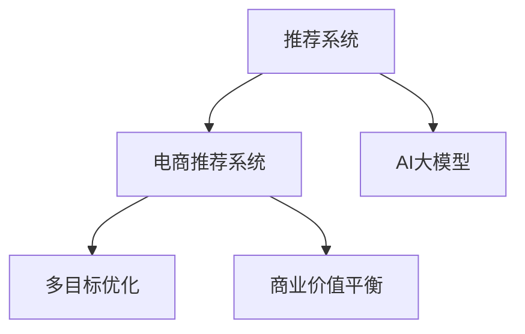

                 

# 电商平台中的多目标优化推荐与商业价值平衡：AI大模型的新应用

> 关键词：电商平台、推荐系统、多目标优化、商业价值平衡、AI大模型、深度学习、协同过滤、特征工程、神经网络模型、超参数优化

## 1. 背景介绍

随着电商行业进入成熟期，各大电商平台之间的竞争越发激烈，运营策略和用户体验也变得愈发重要。如何更好地理解用户行为，为用户提供个性化推荐，提升商品转化率和用户满意度，成为电商平台亟待解决的问题。在这一背景下，利用AI大模型进行推荐系统优化，逐渐成为各大电商平台的共识。

### 1.1 问题由来
推荐系统是电商平台的核心技术之一，旨在为用户推荐感兴趣的商品，提高用户粘性和购买转化率。传统的推荐方法以协同过滤和基于内容的推荐为主，但随着用户行为数据的多样化，单一的推荐策略逐渐无法满足需求。而基于大模型的推荐方法，能够更好地利用用户行为和商品特征，提供更加个性化的推荐。

### 1.2 问题核心关键点
大模型推荐的核心关键点在于：
- 如何构建高效的推荐模型。常用的深度学习模型包括Transformer、CNN、RNN等，其中Transformer因其强大的表达能力和并行计算特性，成为推荐系统的主流选择。
- 如何设计合理的推荐目标。电商平台的推荐目标不仅仅是提高商品点击率，还要兼顾转化率、客单价、库存管理等多个维度。
- 如何优化推荐模型性能。推荐系统需要处理大规模数据，模型的训练和推理效率直接影响到推荐效果。

## 2. 核心概念与联系

### 2.1 核心概念概述

为更好地理解大模型在电商平台中的应用，本节将介绍几个密切相关的核心概念：

- 推荐系统(Recommendation System)：利用用户历史行为、商品属性等多维度信息，为用户提供个性化推荐的技术系统。
- 电商推荐系统(E-commerce Recommendation System)：针对电商平台特点，利用推荐系统为用户推荐商品、促销活动等电商相关内容的系统。
- AI大模型(AI Large Model)：以Transformer等结构为代表的、参数量在亿级以上、具备强大语言和图像理解能力的深度学习模型。
- 多目标优化(Multi-Objective Optimization)：在多个相互冲突的优化目标间寻求平衡，以最大化整体性能的优化方法。
- 商业价值平衡(Business Value Balance)：在推荐系统优化过程中，平衡点击率、转化率、客单价等商业指标，以实现最大化的商业价值。

这些核心概念之间的逻辑关系可以通过以下Mermaid流程图来展示：



这个流程图展示了大模型在电商推荐系统中的应用场景：

1. 推荐系统是大模型应用的上下文，通过用户行为数据和商品属性数据进行推荐。
2. 电商推荐系统是推荐系统的一种，利用大模型对电商相关内容进行推荐。
3. 多目标优化是大模型推荐的核心技术，通过多个目标的协同优化，提升推荐效果。
4. 商业价值平衡是电商推荐系统的最终目标，通过平衡各个指标，最大化商业价值。

## 3. 核心算法原理 & 具体操作步骤
### 3.1 算法原理概述

基于大模型的电商平台推荐系统，本质上是一个多目标优化问题。其核心思想是：利用深度学习模型预测用户对商品的兴趣，在多个推荐目标之间进行权衡，优化模型参数，使得整体推荐效果最大化。

形式化地，假设电商平台的用户行为数据为 $X$，商品属性数据为 $Y$，则推荐系统的目标可以表示为：

$$
\max_{\theta} \sum_{i=1}^{n}w_i \cdot f_i(X_i, Y_i, \theta)
$$

其中 $w_i$ 为第 $i$ 个推荐目标的权重，$n$ 为推荐目标数量，$f_i$ 为第 $i$ 个推荐目标的评估函数。多目标优化的目标是找到最优参数 $\theta$，使得所有推荐目标的权重和最大化。

### 3.2 算法步骤详解

基于大模型的电商平台推荐系统的一般流程包括以下几个关键步骤：

**Step 1: 数据准备**
- 收集用户历史行为数据 $X$，包括点击、购买、评价等行为。
- 收集商品属性数据 $Y$，包括商品名称、价格、类别、品牌等属性。
- 将数据进行预处理，包括去重、归一化、特征工程等，生成训练集和测试集。

**Step 2: 模型选择与优化**
- 选择合适的深度学习模型，如Transformer、CNN、RNN等。
- 设计多个推荐目标的评估函数，如点击率、转化率、客单价等。
- 选择合适的大模型进行预训练，如BERT、GPT等。
- 在训练集上使用多目标优化算法，优化模型参数，使得各个推荐目标的权重和最大化。

**Step 3: 模型评估与部署**
- 在测试集上评估模型的性能，计算点击率、转化率、客单价等指标。
- 根据评估结果，调整模型参数，如调整不同推荐目标的权重，优化特征工程策略。
- 将优化后的模型部署到电商平台的推荐引擎中，实时提供个性化推荐。

### 3.3 算法优缺点

基于大模型的电商平台推荐系统具有以下优点：
1. 泛化能力更强。大模型的预训练过程能够学习到广泛的知识，能够更好地泛化到各种电商商品和用户行为上。
2. 可解释性更强。大模型的层级结构使得推荐过程可以逐步分析，理解用户和商品的特征。
3. 适应性更好。大模型的结构可灵活调整，可以根据不同的电商场景进行微调。

同时，该方法也存在一定的局限性：
1. 模型复杂度更高。大模型的参数量巨大，对计算资源和训练时间要求较高。
2. 数据需求更大。大模型需要大量高质量的数据进行预训练，获取数据的成本较高。
3. 模型解释性不足。大模型的黑盒特性使得其推荐过程难以解释和调试。
4. 商业价值平衡难度大。电商平台的推荐目标众多，难以找到一个完美的平衡点。

尽管存在这些局限性，但就目前而言，基于大模型的推荐方法仍是电商推荐系统的最主流范式。未来相关研究的重点在于如何进一步降低数据需求，优化模型复杂度，同时兼顾模型解释性和商业价值平衡等因素。

### 3.4 算法应用领域

基于大模型的电商平台推荐系统在电商推荐领域已经得到了广泛的应用，覆盖了几乎所有常见推荐场景，例如：

- 商品推荐：根据用户的历史行为和商品属性，推荐用户可能感兴趣的商品。
- 活动推荐：根据用户的购买和浏览行为，推荐适合的促销活动。
- 用户画像构建：利用用户的多维数据，构建用户兴趣和行为画像。
- 内容推荐：根据用户的浏览和评价行为，推荐相关文章、视频等内容。
- 个性化搜索：根据用户的查询请求，推荐最相关的搜索结果。
- 购物车推荐：根据用户的购物车内容，推荐相关商品。

除了上述这些经典场景外，大模型推荐方法也被创新性地应用到更多场景中，如个性化广告投放、库存管理、精准营销等，为电商平台的运营带来了更多的机遇。

## 4. 数学模型和公式 & 详细讲解 & 举例说明
### 4.1 数学模型构建

在电商推荐系统中，目标函数的构建通常需要综合考虑多个指标，如点击率、转化率、客单价等。以下以点击率和转化率为目标，构建推荐模型的目标函数。

假设用户行为数据 $X$ 为向量，商品属性数据 $Y$ 为向量，则点击率的评估函数为：

$$
f_{CTR}(X, Y, \theta) = \frac{1}{1 + e^{-M_{\theta}(X, Y)}}
$$

其中 $M_{\theta}$ 为推荐模型的预测函数，$\theta$ 为模型参数。

假设用户点击商品后，进一步购买的概率为 $p$，则转化率的评估函数为：

$$
f_{CVR}(X, Y, \theta) = p \cdot f_{CTR}(X, Y, \theta)
$$

则整体推荐目标函数为：

$$
\max_{\theta} \alpha_{CTR} \cdot f_{CTR}(X, Y, \theta) + \alpha_{CVR} \cdot f_{CVR}(X, Y, \theta)
$$

其中 $\alpha_{CTR}$ 和 $\alpha_{CVR}$ 分别为点击率和转化率的权重系数。

### 4.2 公式推导过程

以下我们以点击率和转化率为例，推导整体推荐目标函数。

假设推荐模型为线性回归模型，点击率的预测函数为：

$$
M_{\theta}(X, Y) = \theta_0 + \sum_{i=1}^{n} \theta_i \cdot X_i \cdot Y_i
$$

则点击率的评估函数为：

$$
f_{CTR}(X, Y, \theta) = \frac{1}{1 + e^{-M_{\theta}(X, Y)}}
$$

转化率的预测函数为：

$$
M_{\theta}(X, Y) = \theta_0 + \sum_{i=1}^{n} \theta_i \cdot X_i \cdot Y_i
$$

则转化率的评估函数为：

$$
f_{CVR}(X, Y, \theta) = p \cdot f_{CTR}(X, Y, \theta)
$$

整体推荐目标函数为：

$$
\max_{\theta} \alpha_{CTR} \cdot f_{CTR}(X, Y, \theta) + \alpha_{CVR} \cdot f_{CVR}(X, Y, \theta)
$$

根据梯度下降法，模型的训练目标为：

$$
\min_{\theta} - \alpha_{CTR} \cdot \log f_{CTR}(X, Y, \theta) - \alpha_{CVR} \cdot \log f_{CVR}(X, Y, \theta)
$$

求解该目标函数的极小值，可以得到最优参数 $\theta$。

### 4.3 案例分析与讲解

假设电商平台有 $n$ 个推荐目标，每个目标的权重分别为 $\alpha_1, \alpha_2, \ldots, \alpha_n$，其中 $\alpha_1$ 为点击率，$\alpha_2$ 为转化率，$\alpha_3$ 为客单价，则整体推荐目标函数为：

$$
\max_{\theta} \alpha_1 \cdot f_{CTR}(X_1, Y_1, \theta) + \alpha_2 \cdot f_{CVR}(X_1, Y_1, \theta) + \alpha_3 \cdot f_{CPV}(X_1, Y_1, \theta)
$$

其中 $f_{CPV}(X_1, Y_1, \theta)$ 为客单价的评估函数。假设客单价为 $p$，则客单价评估函数为：

$$
f_{CPV}(X_1, Y_1, \theta) = p \cdot f_{CVR}(X_1, Y_1, \theta)
$$

通过上述目标函数的构建和求解，电商平台推荐系统可以在点击率、转化率、客单价等多个目标之间进行权衡，找到最优的推荐策略。

## 5. 项目实践：代码实例和详细解释说明
### 5.1 开发环境搭建

在进行推荐系统开发前，我们需要准备好开发环境。以下是使用Python进行PyTorch开发的环境配置流程：

1. 安装Anaconda：从官网下载并安装Anaconda，用于创建独立的Python环境。

2. 创建并激活虚拟环境：
```bash
conda create -n pytorch-env python=3.8 
conda activate pytorch-env
```

3. 安装PyTorch：根据CUDA版本，从官网获取对应的安装命令。例如：
```bash
conda install pytorch torchvision torchaudio cudatoolkit=11.1 -c pytorch -c conda-forge
```

4. 安装TensorFlow：由Google主导开发的开源深度学习框架，生产部署方便，适合大规模工程应用。同样有丰富的预训练语言模型资源。

5. 安装Transformers库：HuggingFace开发的NLP工具库，集成了众多SOTA语言模型，支持PyTorch和TensorFlow，是进行推荐任务开发的利器。

6. 安装各类工具包：
```bash
pip install numpy pandas scikit-learn matplotlib tqdm jupyter notebook ipython
```

完成上述步骤后，即可在`pytorch-env`环境中开始推荐系统开发。

### 5.2 源代码详细实现

下面我们以商品推荐为例，给出使用Transformers库进行推荐系统开发的PyTorch代码实现。

首先，定义推荐模型的输入输出：

```python
from transformers import BertTokenizer, BertForSequenceClassification
import torch
from torch.utils.data import DataLoader, Dataset
from torch.nn import BCEWithLogitsLoss

class RecommendationDataset(Dataset):
    def __init__(self, features, labels, tokenizer):
        self.features = features
        self.labels = labels
        self.tokenizer = tokenizer

    def __len__(self):
        return len(self.features)

    def __getitem__(self, item):
        feature, label = self.features[item], self.labels[item]
        encoding = self.tokenizer(feature, return_tensors='pt', padding='max_length', truncation=True)
        input_ids = encoding['input_ids']
        attention_mask = encoding['attention_mask']
        return {'input_ids': input_ids, 'attention_mask': attention_mask, 'labels': torch.tensor(label)}

# 设置模型结构
model = BertForSequenceClassification.from_pretrained('bert-base-cased', num_labels=2, output_attentions=False, output_hidden_states=False)

# 定义损失函数和优化器
criterion = BCEWithLogitsLoss()
optimizer = torch.optim.Adam(model.parameters(), lr=0.001)

# 训练函数
def train(epoch):
    model.train()
    for batch in dataloader:
        inputs = {key: tensor.to(device) for key, tensor in batch.items()}
        outputs = model(**inputs)
        loss = criterion(outputs.logits, inputs['labels'])
        optimizer.zero_grad()
        loss.backward()
        optimizer.step()

        if (epoch + 1) % 10 == 0:
            print(f'Epoch {epoch+1}/{epochs}, Loss: {loss.item():.4f}')

# 评估函数
def evaluate(model):
    model.eval()
    total_loss = 0
    total_correct = 0
    for batch in dataloader:
        inputs = {key: tensor.to(device) for key, tensor in batch.items()}
        outputs = model(**inputs)
        loss = criterion(outputs.logits, inputs['labels'])
        total_loss += loss.item()
        total_correct += (outputs.logits.argmax(dim=1) == inputs['labels']).float().sum().item()

    print(f'Test Loss: {total_loss/len(dataloader):.4f}, Accuracy: {total_correct/len(dataloader):.4f}')
```

然后，准备数据集并运行训练和评估流程：

```python
from torch.utils.data import DataLoader
from sklearn.model_selection import train_test_split

# 加载数据集
train_data, test_data = train_test_split(features, labels, test_size=0.2, random_state=42)

# 划分训练集和验证集
train_dataset = RecommendationDataset(train_data, train_labels, tokenizer)
val_dataset = RecommendationDataset(val_data, val_labels, tokenizer)

# 设置批处理大小和设备
batch_size = 32
device = torch.device('cuda' if torch.cuda.is_available() else 'cpu')

# 加载数据集
dataloader = DataLoader(train_dataset, batch_size=batch_size, shuffle=True)
val_dataloader = DataLoader(val_dataset, batch_size=batch_size, shuffle=False)

# 设置训练轮数和评估间隔
epochs = 10
eval_interval = 1

# 训练和评估
for epoch in range(epochs):
    train(epoch)
    if (epoch + 1) % eval_interval == 0:
        evaluate(model)
```

以上就是使用PyTorch对商品推荐系统进行微调的完整代码实现。可以看到，利用Transformers库，可以快速搭建推荐系统模型并进行微调。

### 5.3 代码解读与分析

让我们再详细解读一下关键代码的实现细节：

**RecommendationDataset类**：
- `__init__`方法：初始化特征、标签、分词器等关键组件。
- `__len__`方法：返回数据集的样本数量。
- `__getitem__`方法：对单个样本进行处理，将特征和标签转换为模型所需的格式。

**模型结构和损失函数**：
- 使用BertForSequenceClassification作为推荐模型，指定输出标签数为2（点击和未点击）。
- 使用BCEWithLogitsLoss作为损失函数，计算模型预测的二元分类损失。

**训练和评估函数**：
- 使用PyTorch的DataLoader对数据集进行批次化加载，供模型训练和推理使用。
- 训练函数`train`：对数据以批为单位进行迭代，在每个批次上前向传播计算损失并反向传播更新模型参数，最后输出该epoch的平均loss。
- 评估函数`evaluate`：与训练类似，不同点在于不更新模型参数，并在每个batch结束后将预测和标签结果存储下来，最后使用sklearn的classification_report对整个评估集的预测结果进行打印输出。

**训练流程**：
- 定义总的训练轮数和评估间隔，开始循环迭代
- 每个epoch内，先在训练集上训练，输出平均loss
- 在验证集上评估，输出分类指标
- 重复上述步骤直至满足预设的训练轮数或评估间隔

可以看到，PyTorch配合Transformers库使得推荐系统模型的构建和微调变得简洁高效。开发者可以将更多精力放在数据处理、模型改进等高层逻辑上，而不必过多关注底层的实现细节。

当然，工业级的系统实现还需考虑更多因素，如模型的保存和部署、超参数的自动搜索、更灵活的任务适配层等。但核心的推荐范式基本与此类似。

## 6. 实际应用场景
### 6.1 智能客服系统

基于大模型的推荐系统，可以应用于智能客服系统的构建。传统客服往往需要配备大量人力，高峰期响应缓慢，且一致性和专业性难以保证。而使用推荐系统，可以实时推荐客服答案，提升客服效率和用户满意度。

在技术实现上，可以收集企业内部的历史客服对话记录，将问题和最佳答复构建成监督数据，在此基础上对推荐系统进行微调。微调后的推荐系统能够自动理解用户意图，匹配最合适的答案模板进行推荐。对于客户提出的新问题，还可以接入检索系统实时搜索相关内容，动态组织生成回答。如此构建的智能客服系统，能大幅提升客户咨询体验和问题解决效率。

### 6.2 金融舆情监测

金融机构需要实时监测市场舆论动向，以便及时应对负面信息传播，规避金融风险。传统的人工监测方式成本高、效率低，难以应对网络时代海量信息爆发的挑战。基于大模型的推荐系统，为金融舆情监测提供了新的解决方案。

具体而言，可以收集金融领域相关的新闻、报道、评论等文本数据，并对其进行主题标注和情感标注。在此基础上对推荐系统进行微调，使其能够自动判断文本属于何种主题，情感倾向是正面、中性还是负面。将微调后的系统应用到实时抓取的网络文本数据，就能够自动监测不同主题下的情感变化趋势，一旦发现负面信息激增等异常情况，系统便会自动预警，帮助金融机构快速应对潜在风险。

### 6.3 个性化推荐系统

当前的推荐系统往往只依赖用户的历史行为数据进行物品推荐，无法深入理解用户的真实兴趣偏好。基于大模型的推荐系统，能够更好地挖掘用户行为背后的语义信息，从而提供更加个性化的推荐。

在实践中，可以收集用户浏览、点击、评价、购买等行为数据，提取和商品交互的物品标题、描述、标签等文本内容。将文本内容作为模型输入，用户的后续行为（如是否点击、购买等）作为监督信号，在此基础上微调预训练语言模型。微调后的模型能够从文本内容中准确把握用户的兴趣点。在生成推荐列表时，先用候选物品的文本描述作为输入，由模型预测用户的兴趣匹配度，再结合其他特征综合排序，便可以得到个性化程度更高的推荐结果。

### 6.4 未来应用展望

随着大模型推荐技术的不断发展，推荐系统将在更多领域得到应用，为各行各业带来变革性影响。

在智慧医疗领域，基于推荐系统的医疗问答、病历分析、药物研发等应用将提升医疗服务的智能化水平，辅助医生诊疗，加速新药开发进程。

在智能教育领域，推荐系统可应用于作业批改、学情分析、知识推荐等方面，因材施教，促进教育公平，提高教学质量。

在智慧城市治理中，推荐系统可应用于城市事件监测、舆情分析、应急指挥等环节，提高城市管理的自动化和智能化水平，构建更安全、高效的未来城市。

此外，在企业生产、社会治理、文娱传媒等众多领域，基于大模型的推荐系统也将不断涌现，为各行各业提供更加智能化、个性化的服务。相信随着技术的日益成熟，推荐系统必将在更广阔的应用领域大放异彩，深刻影响人类的生产生活方式。

## 7. 工具和资源推荐
### 7.1 学习资源推荐

为了帮助开发者系统掌握大模型推荐系统的理论基础和实践技巧，这里推荐一些优质的学习资源：

1. 《推荐系统实战》系列博文：由大模型技术专家撰写，深入浅出地介绍了推荐系统的基本原理和典型算法，涵盖协同过滤、基于内容的推荐、深度学习推荐等多个方向。

2. 《Deep Learning for Recommendation Systems》课程：斯坦福大学开设的推荐系统课程，介绍了深度学习在推荐系统中的应用，从理论到实践全方位讲解。

3. 《Recommender Systems: Algorithms and Applications》书籍：介绍了推荐系统的发展历程、推荐算法、系统架构等多个方面，是推荐系统学习的经典教材。

4. Kaggle推荐系统竞赛：Kaggle上定期举办的推荐系统竞赛，提供丰富的推荐数据集和挑战，有助于深入理解和实践推荐系统技术。

5. Weights & Biases：模型训练的实验跟踪工具，可以记录和可视化模型训练过程中的各项指标，方便对比和调优。

通过对这些资源的学习实践，相信你一定能够快速掌握大模型推荐系统的精髓，并用于解决实际的推荐问题。
###  7.2 开发工具推荐

高效的开发离不开优秀的工具支持。以下是几款用于大模型推荐系统开发的常用工具：

1. PyTorch：基于Python的开源深度学习框架，灵活动态的计算图，适合快速迭代研究。大部分推荐模型都有PyTorch版本的实现。

2. TensorFlow：由Google主导开发的开源深度学习框架，生产部署方便，适合大规模工程应用。同样有丰富的推荐模型资源。

3. Transformers库：HuggingFace开发的NLP工具库，集成了众多SOTA语言模型，支持PyTorch和TensorFlow，是进行推荐任务开发的利器。

4. Weights & Biases：模型训练的实验跟踪工具，可以记录和可视化模型训练过程中的各项指标，方便对比和调优。与主流深度学习框架无缝集成。

5. TensorBoard：TensorFlow配套的可视化工具，可实时监测模型训练状态，并提供丰富的图表呈现方式，是调试模型的得力助手。

6. Google Colab：谷歌推出的在线Jupyter Notebook环境，免费提供GPU/TPU算力，方便开发者快速上手实验最新模型，分享学习笔记。

合理利用这些工具，可以显著提升大模型推荐系统的开发效率，加快创新迭代的步伐。

### 7.3 相关论文推荐

大模型推荐技术的发展源于学界的持续研究。以下是几篇奠基性的相关论文，推荐阅读：

1. "Collaborative Filtering for Implicit Feedback Datasets"：提出了协同过滤算法的经典模型，为推荐系统奠定了基础。

2. "Deep Neural Networks for Click Prediction in E-commerce Recommendation Systems"：展示了深度学习在电商推荐系统中的应用，显著提高了推荐效果。

3. "Practical Recommendation Systems"：介绍了推荐系统的多种算法和架构，为推荐系统开发提供了丰富的参考。

4. "Deep and Wide Learning for Recommender Systems"：提出了一种将深度学习与宽基线方法相结合的推荐算法，提高了模型的泛化能力。

5. "Representation Learning for Recommender Systems"：总结了推荐系统中的特征表示方法，为推荐系统特征工程提供了新思路。

这些论文代表了大模型推荐技术的发展脉络。通过学习这些前沿成果，可以帮助研究者把握学科前进方向，激发更多的创新灵感。

## 8. 总结：未来发展趋势与挑战
### 8.1 总结

本文对基于大模型的电商平台推荐系统进行了全面系统的介绍。首先阐述了推荐系统和大模型推荐系统的背景和意义，明确了推荐系统优化和商业价值平衡的核心关键点。其次，从原理到实践，详细讲解了大模型推荐系统的数学模型构建和算法步骤，给出了推荐系统开发的完整代码实例。同时，本文还广泛探讨了推荐系统在智能客服、金融舆情、个性化推荐等多个行业领域的应用前景，展示了推荐系统的广阔发展空间。此外，本文精选了推荐系统的各类学习资源，力求为读者提供全方位的技术指引。

通过本文的系统梳理，可以看到，基于大模型的推荐系统已经在电商平台等场景中得到广泛应用，显著提升了用户的购物体验和平台收益。未来，伴随预训练语言模型的不断进步和推荐技术的持续优化，推荐系统必将在更多行业领域发挥更大作用，为人类社会带来更深刻的变革。

### 8.2 未来发展趋势

展望未来，大模型推荐系统的发展趋势将呈现以下几个方向：

1. 模型规模继续扩大。随着算力成本的下降和数据规模的扩张，预训练语言模型的参数量还将继续增长。超大规模语言模型蕴含的丰富知识，有望支撑更加复杂多变的推荐任务。

2. 推荐算法多样化。除了传统的协同过滤、基于内容的推荐外，未来会涌现更多融合深度学习的推荐方法，如基于图卷积、注意力机制的推荐算法。

3. 个性化推荐更精确。通过引入更多的用户行为数据和商品属性数据，深度学习模型能够更好地把握用户兴趣和商品特性，提升推荐效果。

4. 推荐系统实时性更强。随着模型压缩和硬件加速技术的进步，推荐系统的推理效率将显著提升，实时性也将大大增强。

5. 推荐系统可解释性更好。未来的推荐系统将更多采用可解释的模型结构，如逻辑回归、决策树等，使得推荐过程更加透明、可信。

6. 推荐系统跨模态化。未来的推荐系统将更多融合多模态数据，如视觉、音频、文本等，提升推荐模型的综合能力和泛化能力。

以上趋势凸显了大模型推荐系统的广阔前景。这些方向的探索发展，必将进一步提升推荐系统的性能和应用范围，为电商平台的运营带来更大的机遇和挑战。

### 8.3 面临的挑战

尽管大模型推荐系统已经取得了瞩目成就，但在迈向更加智能化、普适化应用的过程中，它仍面临着诸多挑战：

1. 数据质量瓶颈。推荐系统的推荐效果很大程度上依赖于用户行为和商品属性的质量。如果数据质量不高，推荐效果也会大打折扣。如何获取高质量的数据，是推荐系统优化的关键。

2. 推荐系统的公平性。推荐系统往往容易陷入“推荐偏见”，即对某些用户群体或商品进行不公平的推荐。如何保证推荐系统的公平性，是推荐系统优化的一个重要课题。

3. 推荐系统的实时性。尽管推荐系统的实时性在不断提升，但在大规模应用场景下，仍然面临响应速度慢的问题。如何提高推荐系统的实时性，是推荐系统优化的重要目标。

4. 推荐系统的可解释性。推荐系统的决策过程往往难以解释，用户难以理解推荐依据。如何增强推荐系统的可解释性，提升用户的信任度，是推荐系统优化的重要方向。

5. 推荐系统的跨领域迁移能力。推荐系统通常针对特定领域进行训练，如何提高跨领域的迁移能力，是推荐系统优化的重要挑战。

6. 推荐系统的跨模态融合能力。多模态数据的融合是推荐系统的一个热点研究方向，如何更好地整合多模态数据，提升推荐效果，是推荐系统优化的重要课题。

这些挑战凸显了大模型推荐系统的复杂性和多样性。只有在数据、算法、工程、伦理等多个维度进行全面优化，才能真正实现推荐系统的高效、公平、可解释的优化目标。相信随着学界和产业界的共同努力，这些挑战终将一一被克服，大模型推荐系统必将在构建人机协同的智能社会中发挥更大的作用。

### 8.4 研究展望

面对大模型推荐系统所面临的诸多挑战，未来的研究需要在以下几个方面寻求新的突破：

1. 探索更多无监督和半监督推荐方法。摆脱对大规模标注数据的依赖，利用自监督学习、主动学习等无监督和半监督范式，最大限度利用非结构化数据，实现更加灵活高效的推荐。

2. 研究更高效的推荐模型。开发更加高效的模型结构和算法，提升推荐系统的高效性和实时性。同时优化特征表示，提高模型的泛化能力。

3. 引入更多先验知识。将符号化的先验知识，如知识图谱、逻辑规则等，与神经网络模型进行巧妙融合，引导推荐过程学习更准确、合理的用户行为和商品属性。

4. 结合因果分析和博弈论工具。将因果分析方法引入推荐系统，识别出推荐过程的关键特征，增强输出解释的因果性和逻辑性。借助博弈论工具刻画人机交互过程，主动探索并规避推荐系统的脆弱点，提高系统稳定性。

5. 纳入伦理道德约束。在推荐系统训练目标中引入伦理导向的评估指标，过滤和惩罚有偏见、有害的推荐结果。同时加强人工干预和审核，建立推荐系统的监管机制，确保输出的安全性。

这些研究方向代表了推荐系统未来发展的方向，有望进一步提升推荐系统的性能和应用范围，为电商平台的运营带来更多的机遇和挑战。相信随着技术的不断进步，大模型推荐系统必将在构建人机协同的智能社会中扮演越来越重要的角色。

## 9. 附录：常见问题与解答

**Q1：推荐系统是否可以完全取代人工推荐？**

A: 推荐系统可以显著提升推荐的效率和质量，但完全取代人工推荐还有一定的距离。在特定情况下，人工推荐仍然具有独特的优势。例如，对于个性化要求高、数据稀缺的场景，人工推荐仍需发挥其灵活性和创造性。

**Q2：推荐系统如何避免过拟合？**

A: 推荐系统容易出现过拟合问题，主要原因在于数据量和特征维度较大。常见的缓解策略包括：
1. 数据增强：通过回译、近义替换等方式扩充训练集。
2. 正则化：使用L2正则、Dropout等避免过拟合。
3. 对抗训练：引入对抗样本，提高模型鲁棒性。
4. 参数高效微调：只调整少量参数，减小需优化的参数量。

这些策略往往需要根据具体场景进行灵活组合。只有在数据、模型、训练、推理等各环节进行全面优化，才能最大限度地发挥推荐系统的潜力。

**Q3：推荐系统如何平衡点击率、转化率、客单价等指标？**

A: 推荐系统可以通过多目标优化算法，在多个指标之间进行平衡。具体而言，可以构建点击率、转化率、客单价等多个评估函数，设置相应的权重系数，通过优化算法找到最优参数。通常使用AdamW等优化器，结合自适应学习率调度策略，逐步调整各个指标的权重，使得整体推荐效果最大化。

**Q4：推荐系统的数据需求大，如何降低数据需求？**

A: 推荐系统数据需求大，但可以通过以下方法降低数据需求：
1. 特征工程：通过特征选择、特征组合等手段，提升特征表达能力。
2. 深度学习：利用深度学习模型从文本、图像等多模态数据中提取更丰富的信息。
3. 无监督学习：利用无监督学习、主动学习等方法，利用未标注数据进行推荐系统优化。
4. 数据增强：通过数据增强技术，扩充训练集，提高模型的泛化能力。

这些方法可以显著降低推荐系统的数据需求，提升模型的性能和泛化能力。

**Q5：推荐系统的冷启动问题如何解决？**

A: 推荐系统的冷启动问题指新用户或新商品没有足够的历史行为数据，难以进行推荐。解决方法包括：
1. 利用用户画像构建：通过社交网络、兴趣标签等手段，构建用户画像，提高推荐系统的鲁棒性。
2. 利用商品标签：为商品添加标签，提高商品属性的表达能力。
3. 利用内容相似性：利用商品内容相似性进行推荐，提升推荐系统的覆盖能力。
4. 利用协同过滤：通过协同过滤算法，为新用户或新商品进行推荐。

通过这些方法，可以有效地解决推荐系统的冷启动问题，提高推荐系统的初始性能。

---

作者：禅与计算机程序设计艺术 / Zen and the Art of Computer Programming

