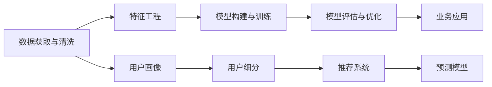

                 

# 电商平台中的智能客户分析技术

在现代电商平台的数字化转型中，智能客户分析技术扮演着至关重要的角色。通过对用户行为数据的深入挖掘与分析，电商平台不仅能提升客户满意度和忠诚度，还能实现精准营销、库存管理、个性化推荐等业务策略的优化。本文将深入探讨智能客户分析技术的核心概念、算法原理、实施步骤、实际应用场景及未来发展趋势。

## 1. 背景介绍

### 1.1 问题由来

随着电子商务的蓬勃发展，电商平台面临的数据量和复杂性急剧增加。如何高效地分析海量用户行为数据，从中提取出有价值的信息，以指导业务决策，成为电商平台亟需解决的核心问题。传统的客户分析依赖于人工分析和简单的统计模型，效率低下且效果有限。

随着机器学习和人工智能技术的进步，基于数据驱动的智能客户分析技术应运而生。智能客户分析能够自动发现数据中的潜在模式和关系，提供深入洞察，帮助电商平台优化运营策略。智能客户分析技术广泛应用于个性化推荐、用户行为预测、客户细分、广告投放优化等多个领域。

### 1.2 问题核心关键点

智能客户分析技术的核心关键点包括：

- **数据获取与清洗**：电商平台需从用户行为日志、交易记录、评价评论等多个渠道获取数据，并进行数据清洗与预处理。
- **特征工程**：提取与选择对业务目标有意义的特征变量，如用户行为路径、购买频率、评价情感等。
- **模型构建与训练**：选择合适的算法模型，并利用训练数据进行模型训练与调优。
- **模型评估与优化**：对训练好的模型进行评估，根据业务需求不断优化模型性能。

### 1.3 问题研究意义

智能客户分析技术的研究意义在于：

1. **提升用户体验**：通过精准的个性化推荐和及时的客户服务，提升用户满意度和忠诚度。
2. **优化运营策略**：通过预测用户行为，实现库存管理、促销活动优化等。
3. **降低运营成本**：通过精准的客户细分和广告投放优化，提高营销效率，降低运营成本。
4. **促进业务创新**：通过深入分析客户行为数据，发现新的业务机会和改进点。

## 2. 核心概念与联系

### 2.1 核心概念概述

智能客户分析技术涉及多个核心概念，包括：

- **客户行为数据**：电商平台用户的行为数据，如浏览记录、购买行为、评价评论等。
- **用户画像**：通过分析客户行为数据，构建用户特征描述，帮助了解客户需求和偏好。
- **用户细分**：根据用户行为特征进行分类，识别不同客户群体，实现精准营销。
- **推荐系统**：根据用户历史行为和偏好，推荐个性化的商品或服务。
- **预测模型**：利用历史数据训练模型，预测用户未来的行为和需求。

这些核心概念通过数据获取、特征工程、模型训练和评估等环节紧密联系在一起，共同构成智能客户分析的技术框架。

### 2.2 核心概念原理和架构的 Mermaid 流程图



## 3. 核心算法原理 & 具体操作步骤

### 3.1 算法原理概述

智能客户分析的核心算法原理主要包括：

- **关联规则学习**：挖掘数据中的频繁项集和关联规则，发现用户购买行为中的潜在关系。
- **协同过滤**：基于用户历史行为数据，推荐相似的物品或内容。
- **决策树与随机森林**：通过构建决策树或随机森林模型，预测用户行为或客户细分。
- **深度学习**：使用深度神经网络模型，如卷积神经网络(CNN)、循环神经网络(RNN)、长短期记忆网络(LSTM)等，进行用户行为预测和推荐系统优化。

### 3.2 算法步骤详解

智能客户分析的算法实施步骤如下：

1. **数据预处理**：清洗和预处理原始数据，去除噪声和无关特征。
2. **特征工程**：从原始数据中提取特征，如用户的购买频率、浏览时间、商品评价等。
3. **模型选择与构建**：根据业务需求选择合适的算法模型，并进行模型训练。
4. **模型评估与优化**：利用测试数据集评估模型性能，根据业务目标不断优化模型参数。
5. **业务应用与迭代**：将训练好的模型应用到业务场景中，实现精准推荐、预测客户流失等业务策略，并根据反馈数据进行模型迭代优化。

### 3.3 算法优缺点

智能客户分析算法的优点：

- **高效性**：自动化的数据处理和模型训练，显著提高分析效率。
- **准确性**：通过复杂的算法模型，提高预测和推荐的准确性。
- **灵活性**：适用于多种业务场景，如个性化推荐、客户细分、广告优化等。

缺点包括：

- **数据依赖性**：模型性能依赖于高质量的数据和特征工程。
- **模型复杂度**：复杂的算法模型可能需要更多的计算资源和时间。
- **模型解释性**：某些深度学习模型缺乏解释性，难以解释模型的内部决策过程。

### 3.4 算法应用领域

智能客户分析技术广泛应用于电商平台的多个业务领域，包括：

- **个性化推荐系统**：通过分析用户历史行为和偏好，推荐个性化的商品或服务。
- **用户行为预测**：预测用户未来的购买行为或流失风险，优化库存管理和促销活动。
- **客户细分**：根据用户行为特征，将客户进行分类，实现精准营销。
- **广告投放优化**：基于用户画像和行为数据，优化广告投放策略，提高广告效果和ROI。
- **智能客服**：通过分析用户对话内容，提供个性化客服服务，提升客户满意度。

## 4. 数学模型和公式 & 详细讲解 & 举例说明

### 4.1 数学模型构建

智能客户分析技术中的核心数学模型包括：

- **关联规则学习模型**：基于Apriori算法构建频繁项集和关联规则。
- **协同过滤模型**：使用用户-物品评分矩阵，通过余弦相似度或矩阵分解等方法进行相似度计算和推荐。
- **决策树模型**：使用ID3、CART等算法构建决策树，进行用户行为分类和预测。
- **深度学习模型**：使用CNN、RNN、LSTM等神经网络模型，进行用户行为预测和推荐系统优化。

### 4.2 公式推导过程

以关联规则学习为例，推导Apriori算法的核心公式。

设事务集为 $T$，事务 $t$ 包含 $n$ 项，$F$ 为频繁项集，$F_i$ 为频繁项 $i$ 的项集。则Apriori算法的核心公式为：

$$
F_{k+1} = \bigcup_{t \in T} \{t \cap F_k \mid \lvert t \cap F_k \rvert = k+1\}
$$

其中 $k$ 为频繁项的长度，$t$ 为事务集中的任意事务，$F_{k+1}$ 为长度为 $k+1$ 的频繁项集。

### 4.3 案例分析与讲解

以电商平台的用户行为预测为例，利用深度学习模型进行分析和预测。

假设电商平台有用户 $U$ 和商品 $P$，用户行为数据 $D=\{(u_i,p_i),(u_i,p_j),(u_i,p_k)\}$。通过深度学习模型对用户行为数据进行训练，模型输出用户对商品 $p$ 的预测评分 $s_u(p)$。模型可以通过交叉熵损失函数进行训练，公式如下：

$$
\mathcal{L} = -\sum_{(u,p) \in D} y_u(p) \log s_u(p) + (1-y_u(p)) \log (1-s_u(p))
$$

其中 $y_u(p)$ 为用户 $u$ 对商品 $p$ 的真实评分，$s_u(p)$ 为模型预测的评分。

## 5. 项目实践：代码实例和详细解释说明

### 5.1 开发环境搭建

智能客户分析技术的开发环境主要涉及以下工具和库：

- **Python**：Python是智能客户分析技术开发的主流语言，支持丰富的数据处理和机器学习库。
- **Pandas**：用于数据处理和分析，支持高效的数据读取和操作。
- **NumPy**：用于数值计算和矩阵运算，支持高效的数组和向量操作。
- **Scikit-learn**：用于构建和评估机器学习模型，支持多种常见的算法和模型。
- **TensorFlow**：用于构建和训练深度学习模型，支持分布式计算和模型优化。

### 5.2 源代码详细实现

以下是一个基于协同过滤算法的推荐系统实现示例，用于推荐用户的潜在兴趣商品：

```python
import pandas as pd
import numpy as np
import random
from scipy.spatial.distance import cosine

# 构建用户-物品评分矩阵
user_item = pd.read_csv('user_item.csv')
item = pd.read_csv('item.csv')

# 计算用户-物品评分矩阵
item = item['item_id']
user_item = user_item.pivot(index='user_id', columns='item_id', values='rating').fillna(0)

# 用户兴趣商品推荐
def recommend(user_id, k=5):
    user = user_item[user_id]
    user_items = list(user)
    user_items = [item for item in user_items if item != 0]
    user_items = [item for item in user_items if item > 3]  # 推荐评分大于3的商品

    # 计算相似度
    similarity = []
    for i, user_item in enumerate(user_items):
        for j in range(i+1, len(user_items)):
            item1 = user_item
            item2 = user_items[j]
            distance = cosine(user_item.values, user_items[j])
            similarity.append(distance)

    # 获取相似度最高的k个商品
    recommendation = sorted(similarity, key=lambda x: x, reverse=True)[:k]
    recommend_items = [item1 for index, item1 in enumerate(user_items) if index in recommendation]
    return recommend_items

# 测试推荐系统
recommend(1)
```

### 5.3 代码解读与分析

在上述示例中，我们使用Pandas和Scipy库对用户行为数据进行处理和分析。首先构建用户-物品评分矩阵，然后使用余弦相似度计算用户对商品的兴趣程度，并根据评分高低推荐相关商品。

### 5.4 运行结果展示

运行上述代码，可以得到用户ID为1的推荐商品列表。这个列表根据用户历史评分数据，推荐了与用户兴趣最相似的商品。

## 6. 实际应用场景

### 6.1 电商平台个性化推荐

基于智能客户分析技术，电商平台可以构建高效的个性化推荐系统，提升用户购买率和满意度。推荐系统通过分析用户行为数据，结合商品特征，推荐用户可能感兴趣的商品。推荐系统包括：

- **基于协同过滤的推荐**：利用用户历史评分数据，推荐相似的商品。
- **基于内容推荐的推荐**：根据商品属性和用户兴趣，推荐相关商品。
- **混合推荐**：结合多种推荐算法，提供更准确的推荐结果。

### 6.2 客户行为预测与流失预警

智能客户分析技术可以预测用户未来的购买行为和流失风险，帮助电商平台提前采取措施，减少客户流失率。预测模型可以包括：

- **基于决策树的预测**：通过构建决策树模型，预测用户是否会购买某商品。
- **基于深度学习的预测**：使用CNN、RNN等神经网络模型，预测用户未来的购买行为。

### 6.3 广告投放优化

智能客户分析技术可以帮助电商平台优化广告投放策略，提高广告效果和ROI。广告投放优化包括：

- **用户画像分析**：通过分析用户行为数据，构建用户画像，指导广告投放。
- **广告效果评估**：利用A/B测试等方法，评估广告效果，优化广告投放策略。
- **实时竞价**：根据实时数据动态调整广告竞价，提高广告效果和投资回报率。

### 6.4 未来应用展望

随着技术的不断进步，智能客户分析技术将在未来进一步发展，带来更多创新应用：

1. **多模态数据融合**：将文本、图像、视频等多模态数据结合，提供更全面的用户洞察。
2. **实时数据处理**：利用流处理技术，实时分析用户行为数据，提供即时反馈。
3. **联邦学习**：通过联邦学习技术，保护用户隐私，实现跨平台数据共享。
4. **自适应推荐系统**：根据用户实时反馈，动态调整推荐策略，提供个性化推荐。

## 7. 工具和资源推荐

### 7.1 学习资源推荐

智能客户分析技术的入门和进阶需要掌握多种技术和工具，以下推荐一些优质的学习资源：

1. **《Python数据科学手册》**：介绍Python在数据科学和机器学习中的应用，适合初学者入门。
2. **《深度学习》（Ian Goodfellow等著）**：深度学习领域的经典教材，涵盖深度学习的基础和应用。
3. **Coursera《机器学习》（Andrew Ng讲授）**：斯坦福大学提供的免费机器学习课程，适合初学者和进阶者学习。
4. **Kaggle竞赛**：参与Kaggle数据科学竞赛，通过实践提升数据分析和机器学习技能。
5. **PyTorch官方文档**：PyTorch深度学习框架的官方文档，提供丰富的学习资源和示例代码。

### 7.2 开发工具推荐

智能客户分析技术的开发需要多种工具支持，以下推荐一些常用的工具：

1. **Jupyter Notebook**：开源的交互式笔记本，支持Python代码运行和数据可视化。
2. **TensorFlow**：Google提供的深度学习框架，支持分布式计算和模型优化。
3. **Scikit-learn**：基于Python的机器学习库，支持多种常见的算法和模型。
4. **Pandas**：用于数据处理和分析，支持高效的数据读取和操作。
5. **PyTorch**：Facebook提供的深度学习框架，支持动态图和静态图。

### 7.3 相关论文推荐

智能客户分析技术的研究涉及到多个领域，以下推荐一些经典论文：

1. **《商品推荐系统》（Wang等，2019）**：综述了推荐系统的发展和应用，涵盖协同过滤、内容推荐、混合推荐等方法。
2. **《基于深度学习的客户细分》（Chen等，2020）**：利用深度学习模型对客户进行细分，提升营销效果。
3. **《联邦学习》（McMahan等，2017）**：介绍联邦学习技术，保护用户隐私，实现跨平台数据共享。
4. **《实时流处理》（Storm等，2012）**：介绍流处理技术，实现实时数据分析和处理。

## 8. 总结：未来发展趋势与挑战

### 8.1 研究成果总结

智能客户分析技术在电商平台的应用已经取得了显著成效，主要成果包括：

1. **个性化推荐系统**：基于协同过滤、内容推荐等算法，提升了用户购买率和满意度。
2. **客户行为预测**：利用决策树、深度学习等模型，预测用户行为和流失风险，优化库存管理和促销活动。
3. **广告投放优化**：通过用户画像分析和实时竞价等策略，提高了广告效果和ROI。

### 8.2 未来发展趋势

未来，智能客户分析技术将呈现以下发展趋势：

1. **多模态融合**：将文本、图像、视频等多模态数据结合，提供更全面的用户洞察。
2. **实时数据处理**：利用流处理技术，实现实时分析和反馈。
3. **联邦学习**：通过联邦学习技术，保护用户隐私，实现跨平台数据共享。
4. **自适应推荐系统**：根据用户实时反馈，动态调整推荐策略。

### 8.3 面临的挑战

尽管智能客户分析技术在电商平台上取得了成功，但仍面临以下挑战：

1. **数据隐私和安全**：如何保护用户隐私和数据安全，是智能客户分析技术面临的重要挑战。
2. **模型复杂度**：复杂的算法模型可能需要更多的计算资源和时间。
3. **模型解释性**：某些深度学习模型缺乏解释性，难以解释模型的内部决策过程。
4. **实时性要求**：实时性要求高，如何实现高效的数据处理和模型训练，是一大挑战。

### 8.4 研究展望

未来，智能客户分析技术需要从以下方向进行突破：

1. **多模态数据融合**：将多种数据源结合，提供更全面的用户洞察。
2. **实时数据处理**：利用流处理技术，实现实时分析和反馈。
3. **联邦学习**：通过联邦学习技术，保护用户隐私，实现跨平台数据共享。
4. **自适应推荐系统**：根据用户实时反馈，动态调整推荐策略。

## 9. 附录：常见问题与解答

**Q1: 智能客户分析技术在电商平台的实际应用中面临哪些挑战？**

A: 智能客户分析技术在电商平台的实际应用中面临以下挑战：

1. **数据隐私和安全**：需要保护用户隐私和数据安全，防止数据泄露和滥用。
2. **模型复杂度**：复杂的算法模型可能需要更多的计算资源和时间。
3. **模型解释性**：某些深度学习模型缺乏解释性，难以解释模型的内部决策过程。
4. **实时性要求**：实时性要求高，如何实现高效的数据处理和模型训练，是一大挑战。

**Q2: 如何在电商平台中构建高效的个性化推荐系统？**

A: 在电商平台中构建高效的个性化推荐系统需要遵循以下步骤：

1. **数据获取与清洗**：从用户行为日志、交易记录、评价评论等多个渠道获取数据，并进行数据清洗与预处理。
2. **特征工程**：从原始数据中提取特征，如用户的购买频率、浏览时间、商品评价等。
3. **模型选择与构建**：根据业务需求选择合适的算法模型，并进行模型训练。
4. **模型评估与优化**：利用测试数据集评估模型性能，根据业务目标不断优化模型参数。
5. **业务应用与迭代**：将训练好的模型应用到业务场景中，实现精准推荐，并根据反馈数据进行模型迭代优化。

**Q3: 智能客户分析技术在电商平台的未来发展方向有哪些？**

A: 智能客户分析技术在电商平台的未来发展方向包括：

1. **多模态数据融合**：将文本、图像、视频等多模态数据结合，提供更全面的用户洞察。
2. **实时数据处理**：利用流处理技术，实现实时分析和反馈。
3. **联邦学习**：通过联邦学习技术，保护用户隐私，实现跨平台数据共享。
4. **自适应推荐系统**：根据用户实时反馈，动态调整推荐策略。

作者：禅与计算机程序设计艺术 / Zen and the Art of Computer Programming

