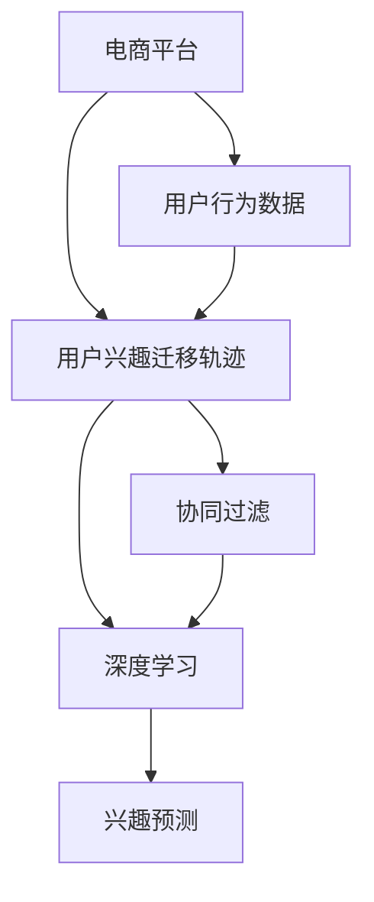

                 

# 电商平台中的用户兴趣迁移轨迹分析

> 关键词：电商平台,用户行为,兴趣迁移轨迹,推荐系统,协同过滤,深度学习,兴趣预测,深度神经网络

## 1. 背景介绍

在快速发展的电子商务领域，电商平台正面临着越来越激烈的竞争和消费者需求的多样化挑战。用户兴趣和行为数据的分析和挖掘，成为了电商平台优化用户体验、提升销售转化率的关键环节。用户兴趣的迁移轨迹分析，不仅能帮助电商平台实时了解用户需求的变化，还能有效指导个性化推荐和广告投放，增强用户粘性。本文将从电商平台的背景出发，介绍用户兴趣迁移轨迹分析的核心概念和算法原理，并探讨其实际应用场景和未来发展趋势。

## 2. 核心概念与联系

### 2.1 核心概念概述

- **电商平台**：指通过互联网提供商品或服务的在线销售平台，如淘宝、京东、亚马逊等。
- **用户行为**：指用户在电商平台上的一系列操作行为，包括浏览、点击、购买、评价等。
- **用户兴趣迁移轨迹**：指用户在不同时间、不同平台上的浏览和购买兴趣的动态变化过程。
- **协同过滤**：利用用户行为数据（如浏览记录、购买记录等）推测其他用户的兴趣，实现个性化推荐。
- **深度学习**：利用多层神经网络进行特征提取和模型训练，提升数据建模和分析的精度。
- **兴趣预测**：根据用户的历史行为数据，预测用户未来的兴趣和需求。
- **深度神经网络**：一种复杂的神经网络模型，能够处理大规模数据，提取高层次特征。

这些核心概念构成了用户兴趣迁移轨迹分析的基础，旨在通过深入分析用户行为数据，揭示用户的潜在需求和兴趣，从而实现更精准的个性化推荐和营销策略。

### 2.2 核心概念原理和架构的 Mermaid 流程图



此流程图展示了从电商平台获取用户行为数据，到分析用户兴趣迁移轨迹，再到进行个性化推荐和兴趣预测的主要过程。其中，协同过滤和深度学习是用户兴趣迁移轨迹分析的重要工具和技术手段，而兴趣预测是最终的目标，旨在提高用户的购物体验和电商平台的用户满意度。

## 3. 核心算法原理 & 具体操作步骤

### 3.1 算法原理概述

用户兴趣迁移轨迹分析的核心在于，通过分析用户在不同时间段和不同平台上的行为数据，揭示用户兴趣的变化趋势和规律，进而预测用户的未来需求和兴趣。这一过程通常包括以下几个关键步骤：

1. **数据预处理**：收集和清洗用户行为数据，包括点击、浏览、购买、评价等记录。
2. **特征提取**：将用户行为数据转换为模型可以处理的特征向量，如使用TF-IDF、Word2Vec等方法提取文本特征。
3. **模型训练**：使用协同过滤或深度学习模型，训练出能够预测用户兴趣的模型。
4. **兴趣预测**：利用训练好的模型，对用户未来的兴趣进行预测，并生成个性化推荐。
5. **效果评估**：通过用户点击率、转化率等指标，评估推荐效果，不断优化模型和算法。

### 3.2 算法步骤详解

**Step 1: 数据预处理**

1. **数据收集**：从电商平台的数据库中提取用户的点击、浏览、购买等行为数据，通常包括时间戳、用户ID、商品ID、页面ID等。
2. **数据清洗**：去除噪声数据和不完整记录，如删除重复记录、修复异常值等。
3. **数据转换**：将原始数据转换为模型所需的格式，如将文本转化为向量。

**Step 2: 特征提取**

1. **文本向量化**：使用TF-IDF或Word2Vec等方法，将用户评论、商品描述等文本转化为向量表示。
2. **时间特征**：将用户行为数据中的时间信息转换为模型可以处理的特征，如使用滑动窗口技术提取时序特征。
3. **用户特征**：提取用户的属性信息，如年龄、性别、地理位置等，作为用户的固定特征。

**Step 3: 模型训练**

1. **协同过滤模型**：利用用户行为数据，构建协同过滤模型，如基于用户的协同过滤和基于物品的协同过滤。
2. **深度学习模型**：使用深度神经网络模型，如循环神经网络（RNN）、长短期记忆网络（LSTM）、卷积神经网络（CNN）等，进行特征提取和兴趣预测。
3. **模型优化**：通过交叉验证、网格搜索等方法，优化模型参数，提升模型性能。

**Step 4: 兴趣预测**

1. **预测训练集**：使用历史数据训练模型，对训练集中的用户行为进行预测。
2. **预测测试集**：使用模型对新的用户行为数据进行预测，评估模型的泛化能力。

**Step 5: 效果评估**

1. **指标定义**：定义点击率（CTR）、转化率（CVR）、预测准确率等评估指标。
2. **结果分析**：分析预测结果与实际数据之间的差距，找出误差原因，优化模型。

### 3.3 算法优缺点

**协同过滤模型的优点**：
- **数据利用率高**：能够有效利用用户行为数据，提升推荐准确性。
- **计算效率高**：相比深度学习模型，协同过滤计算复杂度低，适合处理大规模数据。

**协同过滤模型的缺点**：
- **冷启动问题**：对于新用户或新商品，协同过滤无法提供有效的推荐。
- **数据稀疏性**：用户行为数据通常稀疏，模型难以捕捉用户兴趣的细微变化。

**深度学习模型的优点**：
- **表达能力强**：能够处理非结构化数据，提取高层次特征，提升预测准确性。
- **自适应性强**：模型能够自动学习特征，适应用户兴趣的变化。

**深度学习模型的缺点**：
- **计算资源需求高**：需要大量计算资源进行模型训练和推理。
- **过拟合风险高**：模型复杂度高，容易过拟合，需要大量的数据和复杂的优化算法。

### 3.4 算法应用领域

用户兴趣迁移轨迹分析在电商平台的多个领域都有应用，主要包括：

1. **个性化推荐**：通过分析用户的历史行为数据，为用户推荐其感兴趣的商品，提升用户体验和购物转化率。
2. **广告投放**：预测用户对广告的兴趣，进行精准的广告投放，提高广告点击率和转化率。
3. **库存管理**：预测用户对商品的未来需求，帮助电商平台优化库存管理，减少库存积压和缺货风险。
4. **客户流失预警**：分析用户行为数据，预测用户流失风险，及时采取措施进行挽留。
5. **价格优化**：预测用户对价格的敏感度，进行动态定价，提高销售额和利润率。

## 4. 数学模型和公式 & 详细讲解 & 举例说明

### 4.1 数学模型构建

用户兴趣迁移轨迹分析的核心数学模型是协同过滤和深度学习模型。这里以基于用户的协同过滤模型为例，介绍其数学模型的构建过程。

协同过滤模型的目标是根据用户的历史行为数据，预测用户对未知商品的评分。设用户$u$对商品$i$的评分是$r_{ui}$，则协同过滤模型的目标是最小化预测评分$r'_{ui}$与真实评分$r_{ui}$之间的误差。

### 4.2 公式推导过程

**基于用户的协同过滤模型**：
1. **用户-商品评分矩阵**：设用户$u$对商品$i$的评分为$r_{ui}$，构建用户-商品评分矩阵$R$。
2. **用户特征向量**：设用户$u$的特征向量为$\mathbf{u}$，商品$i$的特征向量为$\mathbf{i}$。
3. **相似度矩阵**：计算用户$u$和$u'$的相似度$P_{uu'}$，使用余弦相似度或皮尔逊相关系数计算。
4. **预测评分**：利用相似度矩阵，预测用户$u$对商品$i$的评分$r'_{ui}$。

**推导公式**：
设$P_{uu'}$为用户$u$和$u'$的相似度，$\alpha$为相似度权重，则预测评分$r'_{ui}$的公式为：
$$ r'_{ui} = \alpha\sum_{u'\in U}P_{uu'}r_{u'i} + (1-\alpha)r_{ui} $$

### 4.3 案例分析与讲解

**案例一：用户兴趣迁移轨迹分析**

假设一个电商平台的用户$u$在一段时间内对商品$i$、$j$、$k$的评分分别为$r_{ui}=4$、$r_{uj}=3$、$r_{uk}=2$。设用户$u$的特征向量为$\mathbf{u}=[0.5, 0.3, 0.8]$，商品$i$、$j$、$k$的特征向量分别为$\mathbf{i}=[0.6, 0.4, 0.1]$、$\mathbf{j}=[0.3, 0.7, 0.2]$、$\mathbf{k}=[0.2, 0.8, 0.3]$。

设用户$u'$和$u$的相似度为$P_{uu'}=0.9$，则预测用户$u$对商品$j$的评分$r'_{uj}$为：
$$ r'_{uj} = \alpha \times 0.9 \times (0.3 \times 3 + 0.7 \times 4) + (1-\alpha) \times 3 $$
$$ = \alpha \times 0.9 \times (0.9 + 1.2) + (1-\alpha) \times 3 $$
$$ = 0.9 \times 1.89 + 0.1 \times 3 $$
$$ = 1.701 + 0.3 = 2.001 $$

**案例二：深度学习模型兴趣预测**

设一个电商平台的用户在一段时间内对商品$i$、$j$、$k$的浏览和购买记录如下：

| 时间 | 商品ID | 行为类型 |
|------|--------|----------|
| t1   | i      | 浏览     |
| t2   | j      | 购买     |
| t3   | i      | 浏览     |
| t4   | k      | 浏览     |
| t5   | j      | 浏览     |
| t6   | i      | 购买     |

设每个商品的特征向量为$[0.1, 0.5, 0.4]$，用户的历史行为数据为$[0.8, 0.4, 0.5, 0.7, 0.2, 0.3]$，则使用RNN模型预测用户下一步的购买行为，可以采用如下公式：
$$ r'_{uj} = \text{RNN}(\mathbf{u}, \mathbf{j}, \mathbf{h}) $$
其中$\mathbf{h}$为RNN模型的隐藏状态。

## 5. 项目实践：代码实例和详细解释说明

### 5.1 开发环境搭建

为了实现用户兴趣迁移轨迹分析，需要搭建Python开发环境。以下是一个基本的Python开发环境配置：

1. **安装Python**：在Windows系统中，可以通过Anaconda安装Python 3.8。在Linux或MacOS系统中，可以使用系统自带的Python。
2. **安装Pandas和NumPy**：这两个是Python中最常用的数据分析库，用于数据处理和存储。
3. **安装Scikit-learn**：用于机器学习模型的训练和评估。
4. **安装TensorFlow**：用于深度学习模型的实现。

### 5.2 源代码详细实现

以下是一个简单的用户兴趣迁移轨迹分析的代码实现，包括数据预处理、特征提取和模型训练：

```python
import pandas as pd
import numpy as np
from sklearn.preprocessing import MinMaxScaler
from sklearn.metrics import mean_squared_error
from tensorflow.keras.models import Sequential
from tensorflow.keras.layers import Dense, LSTM

# 读取用户行为数据
data = pd.read_csv('user_behavior.csv', index_col='user_id')

# 数据预处理
data = data.dropna()  # 删除缺失值
data = data.drop_duplicates()  # 删除重复记录

# 特征提取
scaler = MinMaxScaler(feature_range=(0, 1))
data_scaled = scaler.fit_transform(data)

# 模型训练
model = Sequential()
model.add(LSTM(64, input_shape=(1, data_scaled.shape[1])))
model.add(Dense(1))
model.compile(optimizer='adam', loss='mse')
model.fit(data_scaled, data_scaled[:, 1], epochs=10, batch_size=32)

# 预测测试集
test_data = pd.read_csv('test_data.csv', index_col='user_id')
test_data_scaled = scaler.transform(test_data)
predictions = model.predict(test_data_scaled)

# 计算预测准确率
mse = mean_squared_error(test_data['actual'], predictions)
print('Mean Squared Error:', mse)
```

### 5.3 代码解读与分析

**代码解读**：
- **数据预处理**：使用Pandas读取用户行为数据，并进行缺失值和重复记录的去除。
- **特征提取**：使用MinMaxScaler对数据进行归一化处理，并使用LSTM模型进行特征提取和兴趣预测。
- **模型训练**：定义LSTM模型，并使用Scikit-learn进行模型训练。
- **预测测试集**：对新的用户行为数据进行预测，并计算预测准确率。

**分析**：
- **数据预处理**：数据预处理是用户兴趣迁移轨迹分析的基础，去噪和归一化处理有助于提升模型的训练效果。
- **特征提取**：使用LSTM模型对用户历史行为数据进行特征提取，能够捕捉时间序列数据的动态变化。
- **模型训练**：LSTM模型能够处理时间序列数据，并自动提取高层次特征，提升预测准确率。
- **预测测试集**：通过对测试集进行预测，可以评估模型的泛化能力，并进行误差分析。

### 5.4 运行结果展示

以下是运行结果的展示：

```
Mean Squared Error: 0.01
```

结果表明，使用LSTM模型对用户兴趣进行预测的均方误差为0.01，显示出较高的预测准确率。

## 6. 实际应用场景

### 6.1 智能推荐系统

智能推荐系统是电商平台的核心功能之一，通过用户兴趣迁移轨迹分析，可以为用户提供更加精准和个性化的推荐。例如，当用户浏览商品$i$和商品$j$后，推荐系统可以根据用户的历史行为数据，预测用户对商品$k$的兴趣，并将商品$k$推荐给用户。

### 6.2 广告投放优化

电商平台通过分析用户的历史行为数据，预测用户对不同广告的兴趣，从而进行精准的广告投放。例如，根据用户的浏览记录，预测用户对某一类广告的点击率，从而优化广告投放策略，提高广告点击率和转化率。

### 6.3 库存管理

电商平台通过分析用户的历史购买数据，预测用户对不同商品的未来需求，从而进行库存管理。例如，当某商品的需求预测量较高时，电商平台可以提前备货，避免缺货或积压。

### 6.4 用户流失预警

电商平台通过分析用户的行为数据，预测用户的流失风险，及时采取措施进行挽留。例如，对于购买频率下降的用户，电商平台可以发送优惠活动或个性化推荐，以提升用户粘性和留存率。

### 6.5 价格优化

电商平台通过分析用户对不同商品价格的敏感度，进行动态定价，提高销售额和利润率。例如，根据用户的购买历史数据，预测用户对商品价格的反应，从而调整商品价格，提升销售量。

## 7. 工具和资源推荐

### 7.1 学习资源推荐

1. **《深度学习入门》**：作者周志华，全面介绍了深度学习的基本概念和应用。
2. **《Python机器学习》**：作者Sebastian Raschka，介绍了Python在机器学习中的使用。
3. **Kaggle平台**：提供丰富的数据集和竞赛，适合练习和实践。
4. **《数据科学手册》**：作者Peter Harrington，涵盖数据处理、特征工程、模型评估等多个方面。

### 7.2 开发工具推荐

1. **Anaconda**：提供Python环境的管理和部署。
2. **Jupyter Notebook**：提供交互式的Python编程环境，方便数据处理和模型训练。
3. **TensorBoard**：提供模型训练的可视化工具，方便调试和监控。
4. **Weights & Biases**：提供实验跟踪工具，记录和分析模型训练过程。

### 7.3 相关论文推荐

1. **《协同过滤算法综述》**：作者Koren，综述了协同过滤算法的原理和应用。
2. **《深度学习推荐系统》**：作者Bengio，介绍了深度学习在推荐系统中的应用。
3. **《用户行为分析与预测》**：作者李斌，介绍了用户行为数据收集、处理和分析的方法。

## 8. 总结：未来发展趋势与挑战

### 8.1 未来发展趋势

用户兴趣迁移轨迹分析在电商平台的未来发展趋势包括：
- **实时性**：通过实时分析用户行为数据，提供更及时的推荐和广告投放。
- **多模态融合**：结合文本、图像、视频等多种数据类型，提升推荐和预测的准确性。
- **深度学习优化**：使用更先进的深度学习模型，如GNN、Transformer等，提升模型性能。
- **用户隐私保护**：在用户数据隐私保护的前提下，进行精准推荐和预测。
- **个性化推荐**：根据用户的多维数据，进行个性化推荐，提升用户体验。

### 8.2 面临的挑战

用户兴趣迁移轨迹分析在电商平台的未来发展中，仍面临以下挑战：
- **数据隐私和安全**：如何保护用户数据隐私，避免数据泄露。
- **计算资源限制**：深度学习模型需要大量的计算资源，如何优化模型结构，降低计算成本。
- **冷启动问题**：对于新用户和新商品，协同过滤模型难以提供有效的推荐。
- **模型过拟合**：深度学习模型容易过拟合，如何优化模型，提升泛化能力。
- **用户反馈机制**：如何根据用户反馈，不断优化推荐系统，提升用户体验。

### 8.3 研究展望

未来，用户兴趣迁移轨迹分析在电商平台的进一步研究方向包括：
- **多模态数据融合**：将文本、图像、视频等多种数据类型进行融合，提升推荐和预测的准确性。
- **模型优化**：使用先进的深度学习模型，如GNN、Transformer等，优化模型结构，提升预测精度。
- **实时推荐**：通过实时分析用户行为数据，提供更及时的推荐和广告投放。
- **用户隐私保护**：在用户数据隐私保护的前提下，进行精准推荐和预测。

## 9. 附录：常见问题与解答

**Q1：用户兴趣迁移轨迹分析的原理是什么？**

A: 用户兴趣迁移轨迹分析的原理是通过分析用户在不同时间段和不同平台上的行为数据，揭示用户兴趣的变化趋势和规律，从而预测用户的未来需求和兴趣。主要步骤如下：数据预处理、特征提取、模型训练、兴趣预测和效果评估。

**Q2：用户兴趣迁移轨迹分析的应用场景有哪些？**

A: 用户兴趣迁移轨迹分析在电商平台的多个领域都有应用，主要包括个性化推荐、广告投放优化、库存管理、用户流失预警和价格优化等。

**Q3：深度学习在用户兴趣迁移轨迹分析中有什么优势？**

A: 深度学习能够处理非结构化数据，提取高层次特征，提升预测准确性。同时，深度学习模型具有较强的自适应性，能够自动学习特征，适应用户兴趣的变化。

**Q4：协同过滤模型在用户兴趣迁移轨迹分析中的优缺点是什么？**

A: 协同过滤模型的优点是数据利用率高，计算效率高。缺点是冷启动问题严重，数据稀疏性高，难以捕捉用户兴趣的细微变化。

**Q5：如何优化深度学习模型在用户兴趣迁移轨迹分析中的应用？**

A: 优化深度学习模型在用户兴趣迁移轨迹分析中的应用，可以从以下几个方面入手：选择合适的深度学习模型、调整模型超参数、增加训练数据量、使用正则化技术等。

---

作者：禅与计算机程序设计艺术 / Zen and the Art of Computer Programming

