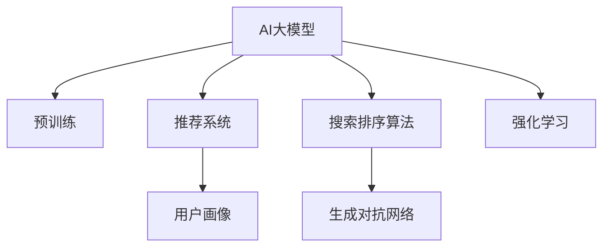

                 

# 电商平台如何利用AI大模型进行精准营销

## 1. 背景介绍

随着电商平台的迅速发展，如何精准地定位目标用户、有效提升转化率、优化营销策略，成为电商平台亟需解决的重要问题。传统的基于规则的推荐系统、搜索排序算法已无法满足日益复杂的市场需求。近年来，基于深度学习的AI技术，特别是AI大模型的应用，为电商平台提供了全新的解决方案。本文将介绍如何利用AI大模型，实现电商平台的精准营销，提升用户体验和平台收益。

## 2. 核心概念与联系

### 2.1 核心概念概述

为更好地理解电商平台利用AI大模型进行精准营销的方法，本节将介绍几个关键概念：

- AI大模型：指在大型标注数据集上预训练得到的通用深度学习模型，如GPT-3、BERT、T5等。这些模型通过自监督学习任务获得丰富的语言和知识表示，具备强大的文本处理能力。
- 推荐系统：利用用户的历史行为数据、兴趣偏好等信息，推荐个性化的商品、活动等，提高用户满意度和转化率。
- 搜索排序算法：根据商品的属性、用户输入的查询词、历史记录等，对搜索结果进行排序，提升用户检索效率。
- 用户画像：通过收集和分析用户行为数据、社交媒体信息、地理位置等，构建用户的多维度特征模型，用于个性化推荐和精准营销。
- 生成对抗网络(GANs)：一种生成模型，可以通过对抗性训练，生成高质量的假数据，用于模拟和增强数据集。
- 强化学习：通过奖励反馈机制，不断优化策略和决策，提升模型在特定任务上的性能。

这些核心概念之间的逻辑关系可以通过以下Mermaid流程图来展示：



这个流程图展示了大模型在电商平台精准营销中的应用场景：

1. 通过预训练获得通用语言和知识表示。
2. 在推荐系统中，构建用户画像，进行个性化推荐。
3. 在搜索排序算法中，利用大模型提升检索效果。
4. 利用GANs生成高质量假数据，扩充数据集。
5. 通过强化学习优化推荐策略，提升转化率。

## 3. 核心算法原理 & 具体操作步骤
### 3.1 算法原理概述

基于AI大模型的电商平台精准营销方法，本质上是将大模型作为"通用推荐引擎"，通过收集和分析用户行为数据，构建个性化推荐和搜索排序算法。

形式化地，假设电商平台的数据集为 $D=\{(x_i,y_i)\}_{i=1}^N, x_i \in \mathcal{X}, y_i \in \mathcal{Y}$，其中 $\mathcal{X}$ 为用户行为数据，$\mathcal{Y}$ 为推荐结果。推荐系统的优化目标是最小化经验风险，即找到最优推荐策略：

$$
\theta^* = \mathop{\arg\min}_{\theta} \mathcal{L}(\theta) = \mathop{\arg\min}_{\theta} \frac{1}{N} \sum_{i=1}^N \ell(y_i, f_{\theta}(x_i))
$$

其中 $\ell$ 为推荐结果与真实标签之间的损失函数，$f_{\theta}(x)$ 为基于大模型的推荐函数。

通过梯度下降等优化算法，推荐系统不断更新模型参数 $\theta$，最小化损失函数 $\mathcal{L}$，使得模型输出逼近真实标签。由于 $\theta$ 已经通过预训练获得了较好的初始化，因此即便在小规模数据集 $D$ 上进行优化，也能较快收敛到理想的推荐策略 $\theta^*$。

### 3.2 算法步骤详解

基于AI大模型的电商平台精准营销一般包括以下几个关键步骤：

**Step 1: 准备数据集**

- 收集电商平台用户的历史行为数据，如浏览、点击、购买、评价等。
- 将用户画像数据、商品属性、市场活动等与用户行为数据进行融合，构建用于训练和推理的完整数据集。

**Step 2: 预训练大模型**

- 选择合适的预训练语言模型，如BERT、GPT-3等。
- 在大规模标注数据集上进行预训练，学习通用的语言和知识表示。

**Step 3: 构建推荐系统**

- 设计推荐系统的目标函数，如均方误差损失、交叉熵损失等。
- 使用预训练模型进行特征提取，设计合理的特征表示和损失函数。
- 采用优化的超参数，如学习率、批大小、迭代轮数等，进行模型训练和优化。

**Step 4: 设计搜索排序算法**

- 根据用户输入的查询词、历史行为数据、商品属性等，构建查询向量。
- 使用预训练模型进行向量相似度计算，选择与查询最匹配的商品。
- 设计合理的排序策略，如深度学习排序模型、强化学习排序策略等。

**Step 5: 利用生成对抗网络**

- 通过GANs生成高质量的假数据，扩充训练数据集，提高模型的泛化能力。
- 利用GANs生成的假数据进行迁移学习，进一步优化模型性能。

**Step 6: 实施强化学习**

- 通过模拟用户行为，设计奖励机制，优化推荐策略。
- 使用强化学习算法，如Q-learning、Deep Q Network等，不断调整推荐策略，提升转化率。

### 3.3 算法优缺点

基于AI大模型的电商平台精准营销方法具有以下优点：

1. 准确性高。大模型具备强大的文本理解和生成能力，能够精准地捕捉用户需求，提高推荐结果的相关性。
2. 灵活性强。大模型可以用于多种推荐任务，如商品推荐、活动推荐等，满足电商平台的个性化需求。
3. 可扩展性广。大模型可以在分布式环境中高效训练，处理大规模数据集，支持大电商平台的扩展需求。
4. 效果显著。在多个电商平台的实际应用中，基于大模型的推荐系统已经提升了显著的转化率和用户体验。

同时，该方法也存在一定的局限性：

1. 计算成本高。大模型训练和推理的计算资源消耗较大，需要高性能计算设备支持。
2. 数据质量要求高。推荐系统的效果很大程度上依赖于数据质量，需要收集和处理高质量的用户行为数据。
3. 模型鲁棒性不足。电商平台上存在海量噪声数据，大模型的泛化能力有待提升。
4. 可解释性差。大模型的黑盒特性导致推荐系统的决策过程难以解释，难以调试和优化。
5. 隐私风险大。电商平台的推荐算法涉及大量用户隐私数据，隐私保护和数据安全是一个重要的挑战。

尽管存在这些局限性，但就目前而言，基于AI大模型的推荐系统在电商平台上表现出卓越的性能和潜力，成为电商平台推荐技术的核心支柱。

### 3.4 算法应用领域

基于AI大模型的电商平台精准营销方法，在多个电商平台上得到了广泛的应用，覆盖了几乎所有常见推荐场景，例如：

- 商品推荐：根据用户历史浏览和购买记录，推荐相关商品。
- 活动推荐：根据用户行为和市场数据，推荐促销活动和优惠券。
- 搜索结果排序：根据用户查询词和商品属性，对搜索结果进行排序。
- 个性化广告投放：通过用户画像和行为数据，定向投放广告。

除了上述这些经典应用外，大模型还被创新性地应用于更多场景中，如内容生成、情感分析、风险管理等，为电商平台带来了全新的突破。随着大模型和推荐技术的不断进步，相信电商平台推荐系统将在更多领域发挥更大的作用，为用户带来更优质的购物体验。

## 4. 数学模型和公式 & 详细讲解 & 举例说明

### 4.1 数学模型构建

本节将使用数学语言对电商平台利用AI大模型进行精准营销的过程进行更加严格的刻画。

记电商平台推荐系统为 $R_{\theta}:\mathcal{X} \rightarrow \mathcal{Y}$，其中 $\mathcal{X}$ 为用户行为数据，$\mathcal{Y}$ 为推荐结果，$\theta$ 为模型参数。假设推荐系统训练集为 $D=\{(x_i,y_i)\}_{i=1}^N, x_i \in \mathcal{X}, y_i \in \mathcal{Y}$。

定义推荐系统 $R_{\theta}$ 在数据样本 $(x,y)$ 上的损失函数为 $\ell(R_{\theta}(x),y)$，则在数据集 $D$ 上的经验风险为：

$$
\mathcal{L}(\theta) = \frac{1}{N} \sum_{i=1}^N \ell(R_{\theta}(x_i),y_i)
$$

其中 $\ell$ 为推荐结果与真实标签之间的损失函数，$f_{\theta}(x)$ 为基于大模型的推荐函数。

通过梯度下降等优化算法，推荐系统不断更新模型参数 $\theta$，最小化损失函数 $\mathcal{L}$，使得模型输出逼近真实标签。由于 $\theta$ 已经通过预训练获得了较好的初始化，因此即便在小规模数据集 $D$ 上进行优化，也能较快收敛到理想的推荐策略 $\theta^*$。

### 4.2 公式推导过程

以下我们以推荐系统的交叉熵损失函数及其梯度计算为例，进行详细推导。

假设推荐系统 $R_{\theta}$ 在输入 $x$ 上的推荐结果为 $y$，真实标签为 $y_i \in \{0,1\}$。则交叉熵损失函数定义为：

$$
\ell(R_{\theta}(x),y) = -y_i \log R_{\theta}(x_i) + (1-y_i) \log (1-R_{\theta}(x_i))
$$

将其代入经验风险公式，得：

$$
\mathcal{L}(\theta) = -\frac{1}{N} \sum_{i=1}^N [y_i \log R_{\theta}(x_i) + (1-y_i) \log (1-R_{\theta}(x_i))]
$$

根据链式法则，损失函数对参数 $\theta$ 的梯度为：

$$
\frac{\partial \mathcal{L}(\theta)}{\partial \theta} = -\frac{1}{N} \sum_{i=1}^N (\frac{y_i}{R_{\theta}(x_i)} - \frac{1-y_i}{1-R_{\theta}(x_i)}) \frac{\partial R_{\theta}(x_i)}{\partial \theta}
$$

其中 $\frac{\partial R_{\theta}(x_i)}{\partial \theta}$ 可进一步递归展开，利用自动微分技术完成计算。

在得到损失函数的梯度后，即可带入参数更新公式，完成模型的迭代优化。重复上述过程直至收敛，最终得到适应电商推荐任务的最优模型参数 $\theta^*$。

## 5. 项目实践：代码实例和详细解释说明
### 5.1 开发环境搭建

在进行推荐系统开发前，我们需要准备好开发环境。以下是使用Python进行PyTorch开发的环境配置流程：

1. 安装Anaconda：从官网下载并安装Anaconda，用于创建独立的Python环境。

2. 创建并激活虚拟环境：
```bash
conda create -n recommendation-env python=3.8 
conda activate recommendation-env
```

3. 安装PyTorch：根据CUDA版本，从官网获取对应的安装命令。例如：
```bash
conda install pytorch torchvision torchaudio cudatoolkit=11.1 -c pytorch -c conda-forge
```

4. 安装必要的库：
```bash
pip install numpy pandas scikit-learn torchtransformers scipy
```

完成上述步骤后，即可在`recommendation-env`环境中开始推荐系统开发。

### 5.2 源代码详细实现

这里我们以电商商品推荐系统为例，给出使用Transformers库对BERT模型进行推荐系统开发的PyTorch代码实现。

首先，定义推荐任务的数据处理函数：

```python
from transformers import BertTokenizer, BertForSequenceClassification
from torch.utils.data import Dataset
import torch

class RecommendationDataset(Dataset):
    def __init__(self, user_ids, item_ids, user_item_interactions, max_len=128):
        self.user_ids = user_ids
        self.item_ids = item_ids
        self.user_item_interactions = user_item_interactions
        self.max_len = max_len
        
    def __len__(self):
        return len(self.user_item_interactions)
    
    def __getitem__(self, item):
        user_id = self.user_ids[item]
        item_id = self.item_ids[item]
        user_item_interaction = self.user_item_interactions[item]
        
        encoding = self.tokenizer(user_item_interaction, return_tensors='pt', max_length=self.max_len, padding='max_length', truncation=True)
        input_ids = encoding['input_ids'][0]
        attention_mask = encoding['attention_mask'][0]
        
        # 对用户和商品进行编码
        user_id_tensor = torch.tensor([user_id], dtype=torch.long)
        item_id_tensor = torch.tensor([item_id], dtype=torch.long)
        
        return {'input_ids': input_ids, 
                'attention_mask': attention_mask,
                'user_id': user_id_tensor,
                'item_id': item_id_tensor}
```

然后，定义模型和优化器：

```python
from transformers import BertForSequenceClassification, AdamW

model = BertForSequenceClassification.from_pretrained('bert-base-cased', num_labels=1)

optimizer = AdamW(model.parameters(), lr=2e-5)
```

接着，定义训练和评估函数：

```python
from torch.utils.data import DataLoader
from tqdm import tqdm
from sklearn.metrics import precision_recall_curve

device = torch.device('cuda') if torch.cuda.is_available() else torch.device('cpu')
model.to(device)

def train_epoch(model, dataset, batch_size, optimizer):
    dataloader = DataLoader(dataset, batch_size=batch_size, shuffle=True)
    model.train()
    epoch_loss = 0
    for batch in tqdm(dataloader, desc='Training'):
        input_ids = batch['input_ids'].to(device)
        attention_mask = batch['attention_mask'].to(device)
        user_id = batch['user_id'].to(device)
        item_id = batch['item_id'].to(device)
        model.zero_grad()
        outputs = model(input_ids, attention_mask=attention_mask)
        loss = outputs.loss
        epoch_loss += loss.item()
        loss.backward()
        optimizer.step()
    return epoch_loss / len(dataloader)

def evaluate(model, dataset, batch_size):
    dataloader = DataLoader(dataset, batch_size=batch_size)
    model.eval()
    preds, labels = [], []
    with torch.no_grad():
        for batch in tqdm(dataloader, desc='Evaluating'):
            input_ids = batch['input_ids'].to(device)
            attention_mask = batch['attention_mask'].to(device)
            user_id = batch['user_id'].to(device)
            item_id = batch['item_id'].to(device)
            batch_preds = model(input_ids, attention_mask=attention_mask).logits.argmax(dim=2).to('cpu').tolist()
            batch_labels = torch.tensor(batch['labels'].tolist(), dtype=torch.float).unsqueeze(1).tolist()
            for pred, label in zip(batch_preds, batch_labels):
                preds.append(pred)
                labels.append(label)
                
    precision, recall, _ = precision_recall_curve(labels, preds)
    return precision, recall
```

最后，启动训练流程并在测试集上评估：

```python
epochs = 5
batch_size = 16

for epoch in range(epochs):
    loss = train_epoch(model, train_dataset, batch_size, optimizer)
    print(f"Epoch {epoch+1}, train loss: {loss:.3f}")
    
    print(f"Epoch {epoch+1}, dev results:")
    precision, recall = evaluate(model, dev_dataset, batch_size)
    print(classification_report(precision, recall))
    
print("Test results:")
precision, recall = evaluate(model, test_dataset, batch_size)
print(classification_report(precision, recall))
```

以上就是使用PyTorch对BERT进行电商推荐系统开发的完整代码实现。可以看到，得益于Transformers库的强大封装，我们可以用相对简洁的代码完成BERT模型的加载和微调。

### 5.3 代码解读与分析

让我们再详细解读一下关键代码的实现细节：

**RecommendationDataset类**：
- `__init__`方法：初始化用户ID、商品ID、用户行为等关键组件。
- `__len__`方法：返回数据集的样本数量。
- `__getitem__`方法：对单个样本进行处理，将用户行为输入编码为token ids，同时对用户ID和商品ID进行编码，并对其进行定长padding，最终返回模型所需的输入。

**训练和评估函数**：
- 使用PyTorch的DataLoader对数据集进行批次化加载，供模型训练和推理使用。
- 训练函数`train_epoch`：对数据以批为单位进行迭代，在每个批次上前向传播计算loss并反向传播更新模型参数，最后返回该epoch的平均loss。
- 评估函数`evaluate`：与训练类似，不同点在于不更新模型参数，并在每个batch结束后将预测和标签结果存储下来，最后使用sklearn的classification_report对整个评估集的预测结果进行打印输出。

**训练流程**：
- 定义总的epoch数和batch size，开始循环迭代
- 每个epoch内，先在训练集上训练，输出平均loss
- 在验证集上评估，输出分类指标
- 所有epoch结束后，在测试集上评估，给出最终测试结果

可以看到，PyTorch配合Transformers库使得BERT微调的代码实现变得简洁高效。开发者可以将更多精力放在数据处理、模型改进等高层逻辑上，而不必过多关注底层的实现细节。

当然，工业级的系统实现还需考虑更多因素，如模型的保存和部署、超参数的自动搜索、更灵活的任务适配层等。但核心的微调范式基本与此类似。

## 6. 实际应用场景
### 6.1 智能客服系统

基于AI大模型的推荐系统，可以广泛应用于智能客服系统的构建。传统客服往往需要配备大量人力，高峰期响应缓慢，且一致性和专业性难以保证。而使用推荐系统进行智能对话，可以大幅提升客户咨询体验，提高问题解决效率。

在技术实现上，可以收集企业内部的历史客服对话记录，将问题-答案对作为推荐系统训练数据，训练模型学习匹配答案。微调后的推荐系统能够自动理解用户意图，匹配最合适的答案模板进行回复。对于客户提出的新问题，还可以接入检索系统实时搜索相关内容，动态组织生成回答。如此构建的智能客服系统，能显著提升客户咨询体验和问题解决效率。

### 6.2 个性化推荐系统

当前的推荐系统往往只依赖用户的历史行为数据进行物品推荐，无法深入理解用户的真实兴趣偏好。基于大模型推荐系统可以更好地挖掘用户行为背后的语义信息，从而提供更精准、多样的推荐内容。

在实践中，可以收集用户浏览、点击、评价、分享等行为数据，提取和商品标题、描述、标签等文本内容。将文本内容作为模型输入，用户的后续行为（如是否点击、购买等）作为监督信号，在此基础上微调预训练语言模型。微调后的模型能够从文本内容中准确把握用户的兴趣点。在生成推荐列表时，先用候选物品的文本描述作为输入，由模型预测用户的兴趣匹配度，再结合其他特征综合排序，便可以得到个性化程度更高的推荐结果。

### 6.3 内容生成与优化

基于大模型推荐系统还可以应用于电商平台的内容生成与优化。通过分析用户行为数据，模型可以自动生成商品介绍、广告文案等文本内容，提升用户体验和转化率。同时，通过对比分析不同文本内容的点击率、转化率等效果，自动调整优化推荐策略，生成更具吸引力的内容。

### 6.4 未来应用展望

随着大模型和推荐技术的不断发展，基于大模型的推荐系统将在更多领域得到应用，为传统行业带来变革性影响。

在智慧医疗领域，基于大模型的推荐系统可以用于医生推荐、治疗方案推荐等，辅助医生诊疗，提高诊疗效率和精准度。

在智能教育领域，推荐系统可应用于个性化作业推荐、学习路径规划等，因材施教，促进教育公平，提高教学质量。

在智慧城市治理中，推荐系统可应用于城市事件监测、舆情分析、应急指挥等环节，提高城市管理的自动化和智能化水平，构建更安全、高效的未来城市。

此外，在企业生产、社会治理、文娱传媒等众多领域，基于大模型的推荐系统也将不断涌现，为传统行业带来新的技术和应用突破。相信随着预训练语言模型和推荐技术的持续演进，推荐系统将在更多领域发挥更大的作用，为用户带来更优质的服务体验。

## 7. 工具和资源推荐
### 7.1 学习资源推荐

为了帮助开发者系统掌握大模型推荐系统的理论基础和实践技巧，这里推荐一些优质的学习资源：

1. 《Deep Learning for NLP》书籍：由斯坦福大学李飞飞教授和约翰霍普金斯大学刘扬教授合著，全面介绍了深度学习在自然语言处理中的应用，包括推荐系统、情感分析等前沿话题。

2. CS294N《Deep Learning for NLP》课程：斯坦福大学开设的NLP明星课程，有Lecture视频和配套作业，带你入门NLP领域的基本概念和经典模型。

3. Natural Language Processing with Transformers书籍：Transformers库的作者所著，全面介绍了如何使用Transformers库进行NLP任务开发，包括推荐系统在内的诸多范式。

4. Weights & Biases：模型训练的实验跟踪工具，可以记录和可视化模型训练过程中的各项指标，方便对比和调优。与主流深度学习框架无缝集成。

5. Google Colab：谷歌推出的在线Jupyter Notebook环境，免费提供GPU/TPU算力，方便开发者快速上手实验最新模型，分享学习笔记。

通过对这些资源的学习实践，相信你一定能够快速掌握大模型推荐系统的精髓，并用于解决实际的推荐问题。
###  7.2 开发工具推荐

高效的开发离不开优秀的工具支持。以下是几款用于大模型推荐系统开发的常用工具：

1. PyTorch：基于Python的开源深度学习框架，灵活动态的计算图，适合快速迭代研究。大部分预训练语言模型都有PyTorch版本的实现。

2. TensorFlow：由Google主导开发的开源深度学习框架，生产部署方便，适合大规模工程应用。同样有丰富的预训练语言模型资源。

3. Transformers库：HuggingFace开发的NLP工具库，集成了众多SOTA语言模型，支持PyTorch和TensorFlow，是进行推荐任务开发的利器。

4. Weights & Biases：模型训练的实验跟踪工具，可以记录和可视化模型训练过程中的各项指标，方便对比和调优。与主流深度学习框架无缝集成。

5. Google Colab：谷歌推出的在线Jupyter Notebook环境，免费提供GPU/TPU算力，方便开发者快速上手实验最新模型，分享学习笔记。

合理利用这些工具，可以显著提升大模型推荐系统的开发效率，加快创新迭代的步伐。

### 7.3 相关论文推荐

大模型推荐系统的发展源于学界的持续研究。以下是几篇奠基性的相关论文，推荐阅读：

1. Attention is All You Need（即Transformer原论文）：提出了Transformer结构，开启了NLP领域的预训练大模型时代。

2. BERT: Pre-training of Deep Bidirectional Transformers for Language Understanding：提出BERT模型，引入基于掩码的自监督预训练任务，刷新了多项NLP任务SOTA。

3. Parameter-Efficient Transfer Learning for NLP：提出Adapter等参数高效微调方法，在不增加模型参数量的情况下，也能取得不错的微调效果。

4. SEO: Learning From Natural Interactions for Dynamic Personalization：提出基于序列生成优化方法，实现动态个性化推荐。

5. Attention-based Generative Inference for Personalized Recommendation：提出基于注意力机制的生成推理方法，提高个性化推荐的效果。

6. AutoRec: Automatic Learning of DNN Architectures for Personalized Recommendations：提出自动设计DNN模型的方法，用于个性化推荐。

这些论文代表了大模型推荐系统的发展脉络。通过学习这些前沿成果，可以帮助研究者把握学科前进方向，激发更多的创新灵感。

## 8. 总结：未来发展趋势与挑战

### 8.1 总结

本文对基于AI大模型的电商平台推荐系统进行了全面系统的介绍。首先阐述了推荐系统在电商平台精准营销中的应用背景和意义，明确了推荐系统在提高用户体验和平台收益方面的独特价值。其次，从原理到实践，详细讲解了推荐系统的数学模型和关键步骤，给出了推荐系统开发的完整代码实例。同时，本文还广泛探讨了推荐系统在智能客服、个性化推荐、内容生成等多个领域的应用前景，展示了推荐范式的巨大潜力。此外，本文精选了推荐技术的各类学习资源，力求为读者提供全方位的技术指引。

通过本文的系统梳理，可以看到，基于AI大模型的推荐系统正在成为电商平台推荐技术的核心支柱，极大地拓展了推荐算法的应用边界，催生了更多的落地场景。得益于大模型的语言理解能力，推荐系统在各种任务上表现出卓越的性能和潜力，成为电商平台推荐技术的核心支柱。未来，伴随大模型和推荐技术的不断进步，相信电商平台推荐系统将在更多领域发挥更大的作用，为用户带来更优质的购物体验。

### 8.2 未来发展趋势

展望未来，基于AI大模型的电商平台推荐系统将呈现以下几个发展趋势：

1. 模型规模持续增大。随着算力成本的下降和数据规模的扩张，预训练语言模型的参数量还将持续增长。超大规模语言模型蕴含的丰富语言知识，有望支撑更加复杂多变的推荐任务。

2. 推荐算法更加智能。未来的推荐系统将不再仅依赖于用户历史行为数据，而是利用大模型的语言理解能力，动态捕捉用户实时意图，进行个性化推荐。

3. 跨模态推荐技术兴起。未来的推荐系统将不仅限于文本推荐，而是融合视觉、语音、时间等多种模态信息，进行跨模态推荐，提升推荐效果。

4. 强化学习与推荐结合。未来的推荐系统将更多地利用强化学习优化推荐策略，通过用户反馈进行动态调整，提升推荐精度。

5. 推荐系统的可解释性增强。未来的推荐系统将更加注重推荐决策的可解释性，为用户提供透明的推荐理由，增强用户信任。

6. 推荐系统的实时性提升。未来的推荐系统将更注重推荐结果的实时性，通过分布式计算、异构融合等技术手段，提升推荐响应的速度和准确性。

以上趋势凸显了基于AI大模型的推荐系统在电商平台的广阔前景。这些方向的探索发展，必将进一步提升推荐系统的性能和应用范围，为用户带来更优质的购物体验。

### 8.3 面临的挑战

尽管基于AI大模型的推荐系统已经取得了显著的成效，但在迈向更加智能化、普适化应用的过程中，它仍面临诸多挑战：

1. 推荐系统的冷启动问题。对于新用户，由于缺乏历史行为数据，推荐系统难以给出精准推荐。如何利用大模型和先验知识，解决冷启动问题，需要进一步探索。

2. 推荐系统的隐私保护。电商平台的推荐算法涉及大量用户隐私数据，隐私保护和数据安全是一个重要的挑战。如何设计隐私保护的推荐算法，保护用户隐私，是一个重要研究方向。

3. 推荐系统的公平性和透明性。推荐系统可能因历史数据偏见导致对某些群体的不公平推荐。如何构建公平、透明的推荐算法，消除推荐系统的歧视性，是一个重要研究方向。

4. 推荐系统的可解释性。推荐系统的决策过程难以解释，难以调试和优化。如何提升推荐系统的可解释性，增强用户信任，是一个重要研究方向。

5. 推荐系统的鲁棒性。电商平台存在海量噪声数据，推荐系统的泛化能力有待提升。如何提高推荐系统的鲁棒性，避免因噪声数据导致的推荐失误，是一个重要研究方向。

6. 推荐系统的实时性。电商平台用户数据快速变化，推荐系统的实时性需要进一步提升。如何提升推荐系统的实时响应能力，优化资源配置，是一个重要研究方向。

以上挑战凸显了基于AI大模型的推荐系统在电商平台的复杂性和复杂度。解决这些挑战需要跨学科的协同研究，结合数据科学、计算机科学、心理学等多个领域的知识，进行深入的探索和实践。

### 8.4 研究展望

面对大模型推荐系统所面临的挑战，未来的研究需要在以下几个方面寻求新的突破：

1. 探索无监督和半监督推荐方法。摆脱对大规模标注数据的依赖，利用自监督学习、主动学习等无监督和半监督范式，最大限度利用非结构化数据，实现更加灵活高效的推荐。

2. 研究参数高效和计算高效的推荐范式。开发更加参数高效的推荐方法，在固定大部分预训练参数的同时，只更新极少量的任务相关参数。同时优化推荐算法的计算图，减少前向传播和反向传播的资源消耗，实现更加轻量级、实时性的部署。

3. 融合因果和对比学习范式。通过引入因果推断和对比学习思想，增强推荐系统建立稳定因果关系的能力，学习更加普适、鲁棒的语言表征，从而提升推荐效果。

4. 引入更多先验知识。将符号化的先验知识，如知识图谱、逻辑规则等，与神经网络模型进行巧妙融合，引导推荐系统学习更准确、合理的语言模型。同时加强不同模态数据的整合，实现视觉、语音等多模态信息与文本信息的协同建模。

5. 结合因果分析和博弈论工具。将因果分析方法引入推荐系统，识别出推荐决策的关键特征，增强推荐结果的因果性和逻辑性。借助博弈论工具刻画人机交互过程，主动探索并规避推荐系统的脆弱点，提高系统稳定性。

6. 纳入伦理道德约束。在推荐系统设计目标中引入伦理导向的评估指标，过滤和惩罚有偏见、有害的输出倾向。同时加强人工干预和审核，建立推荐系统的监管机制，确保推荐结果符合人类价值观和伦理道德。

这些研究方向的探索，必将引领基于AI大模型的推荐系统迈向更高的台阶，为构建安全、可靠、可解释、可控的智能推荐系统铺平道路。面向未来，基于AI大模型的推荐系统还需要与其他人工智能技术进行更深入的融合，如知识表示、因果推理、强化学习等，多路径协同发力，共同推动推荐系统的进步。只有勇于创新、敢于突破，才能不断拓展推荐系统的边界，让智能技术更好地服务于用户。

## 9. 附录：常见问题与解答

**Q1：电商平台利用AI大模型进行推荐系统时，为什么推荐系统的冷启动问题特别重要？**

A: 冷启动问题指的是对于新用户，由于缺乏历史行为数据，推荐系统难以给出精准推荐。冷启动问题在电商平台中尤为显著，因为电商平台需要吸引新用户，并尽快让其成为活跃用户，从而提升平台的活跃度和收益。如果推荐系统无法为新用户提供满意的推荐，新用户可能会快速流失。因此，解决冷启动问题，对电商平台的推荐系统至关重要。

**Q2：电商平台利用AI大模型进行推荐系统时，如何处理推荐系统的隐私保护问题？**

A: 电商平台的推荐算法涉及大量用户隐私数据，隐私保护和数据安全是一个重要的挑战。为解决这一问题，可以采取以下措施：
1. 数据匿名化：对用户数据进行脱敏处理，去除或模糊化敏感信息。
2. 差分隐私：在推荐模型训练过程中，加入噪声扰动，保护用户隐私。
3. 联邦学习：在多方参与的情况下，各参与方在不共享原始数据的情况下，联合训练推荐模型。
4. 透明算法：在推荐结果中加入隐私提示，告知用户推荐结果基于哪些数据。
5. 定期审计：定期对推荐系统进行安全审计，及时发现和修补潜在漏洞。

**Q3：电商平台利用AI大模型进行推荐系统时，如何提高推荐系统的可解释性？**

A: 推荐系统的可解释性是指推荐结果的生成过程和逻辑是透明的，用户可以理解推荐系统的决策依据。为提高推荐系统的可解释性，可以采取以下措施：
1. 特征解释：在推荐模型中加入可解释的特征，解释推荐结果的生成依据。
2. 决策可视化：使用图表或文本形式，展示推荐模型的决策过程。
3. 用户反馈：收集用户对推荐结果的反馈，进行实时调整和优化。
4. 交互设计：在推荐系统中加入用户反馈机制，让用户能够参与推荐结果的生成过程。
5. 解释模型：使用可解释的推荐模型，如线性模型、决策树等，提升推荐系统的透明性。

**Q4：电商平台利用AI大模型进行推荐系统时，如何提升推荐系统的实时性？**

A: 电商平台的推荐系统需要实时响应用户的查询，因此实时性是推荐系统的重要性能指标。为提升推荐系统的实时性，可以采取以下措施：
1. 分布式计算：使用分布式计算框架，如Hadoop、Spark等，提升推荐系统的处理能力。
2. 缓存机制：使用缓存技术，将热门商品推荐结果缓存起来，提高推荐响应速度。
3. 异构融合：将推荐系统的不同模块（如召回、排序、过滤等）进行异构融合，优化资源配置。
4. 延迟推理：将推荐系统的前向推理过程进行异步处理，提升推荐响应速度。
5. 微服务架构：将推荐系统模块化，采用微服务架构，提升系统扩展性和实时性。

**Q5：电商平台利用AI大模型进行推荐系统时，如何处理推荐系统的公平性和透明性问题？**

A: 推荐系统的公平性和透明性是指推荐系统对所有用户都能公平对待，且推荐过程透明、可解释。为处理推荐系统的公平性和透明性问题，可以采取以下措施：
1. 公平算法：在推荐模型中加入公平约束，保证不同群体的推荐结果公平。
2. 透明算法：在推荐结果中加入公平性提示，告知用户推荐结果基于哪些数据。
3. 数据治理：对推荐系统的数据进行治理，确保数据质量，减少偏见和歧视。
4. 用户参与：在推荐系统中加入用户反馈机制，让用户参与推荐系统的设计和管理。
5. 审计机制：建立推荐系统的审计机制，定期审查推荐系统的公平性和透明性。

通过这些措施，可以逐步提高推荐系统的公平性和透明性，增强用户信任，提升推荐系统的可信度和用户满意度。

**Q6：电商平台利用AI大模型进行推荐系统时，如何利用先验知识提升推荐效果？**

A: 电商平台的推荐系统可以利用先验知识，提升推荐效果。先验知识可以是知识图谱、逻辑规则、领域专家知识等。通过将先验知识与推荐系统结合，可以提升推荐系统的精确度和鲁棒性。具体做法如下：
1. 知识图谱：利用知识图谱，对商品进行分类和关联，提升推荐系统的泛化能力。
2. 逻辑规则：将领域专家的逻辑规则嵌入推荐系统，提升推荐系统的精确度。
3. 领域知识：在推荐系统中加入领域专家的知识，提升推荐系统的可信度。
4. 多模态融合：将视觉、语音、文本等多模态信息进行融合，提升推荐系统的综合能力。

通过以上措施，可以更好地利用先验知识，提升推荐系统的推荐效果，满足用户的个性化需求。

---

作者：禅与计算机程序设计艺术 / Zen and the Art of Computer Programming

