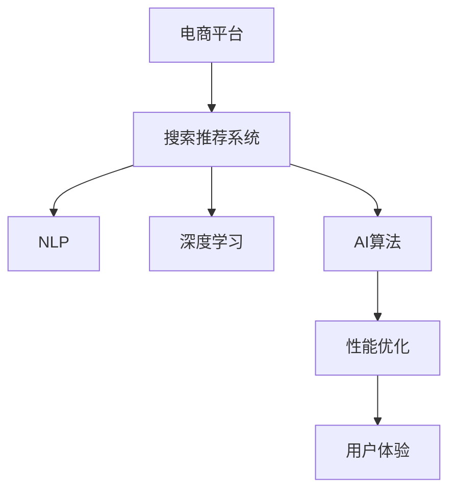

                 

# 电商平台搜索推荐系统的AI 大模型应用：提高系统性能、效率与用户体验

> 关键词：电商平台,搜索推荐系统,大模型,自然语言处理(NLP),深度学习,AI算法,性能优化,用户体验

## 1. 背景介绍

### 1.1 问题由来
随着电商平台的蓬勃发展，消费者在搜索和推荐上的体验直接影响着购买决策和满意度。传统的搜索推荐系统往往基于简单的统计方法，无法充分理解用户意图，推荐效果差强人意。随着人工智能技术的兴起，AI大模型开始被应用于电商搜索推荐中，带来性能和用户体验的显著提升。

### 1.2 问题核心关键点
AI大模型在电商搜索推荐中的应用，关键在于如何构建高效、泛化的搜索推荐系统，提升用户满意度，提高平台转化率。具体来说，包括以下几个方面：

1. **查询理解**：通过自然语言处理(NLP)技术，准确理解用户的查询意图。
2. **商品匹配**：通过深度学习算法，高效匹配符合用户需求的商品。
3. **推荐优化**：通过机器学习算法，不断优化推荐结果，提高点击率和转化率。
4. **实时性**：确保搜索结果和推荐内容能够实时更新，满足用户即时需求。
5. **个性化**：根据用户行为数据，实现个性化推荐，提升用户体验。

### 1.3 问题研究意义
AI大模型在电商搜索推荐中的应用，对于提高平台运营效率、提升用户满意度和增加收入有着重要意义：

1. **提升搜索精准度**：准确理解用户查询，返回最相关的搜索结果。
2. **优化推荐效果**：通过智能推荐，增加用户停留时间，提升转化率。
3. **降低运营成本**：减少人工干预，降低广告投放成本。
4. **增强用户体验**：提供更个性化的购物体验，提升用户忠诚度。

## 2. 核心概念与联系

### 2.1 核心概念概述

为了更好地理解AI大模型在电商搜索推荐系统中的应用，本节将介绍几个核心概念：

- **电商平台**：指通过互联网进行商品销售的商业平台，如淘宝、京东等。
- **搜索推荐系统**：根据用户行为数据，自动推荐商品的系统。
- **自然语言处理(NLP)**：使计算机能够理解、处理和生成人类语言的技术。
- **深度学习**：一类基于人工神经网络的机器学习算法，能够从大量数据中自动学习特征。
- **AI算法**：人工智能技术中，用于解决特定问题的算法，如强化学习、聚类算法等。
- **性能优化**：通过算法优化，提高系统的运行效率和效果。
- **用户体验**：用户在使用产品或服务时的感受，直接影响用户满意度和留存率。

这些概念之间的逻辑关系可以通过以下Mermaid流程图来展示：



这个流程图展示了大模型在电商搜索推荐中的应用场景：

1. 电商平台依托于搜索推荐系统，提供商品搜索和推荐服务。
2. 搜索推荐系统使用NLP技术理解用户查询，采用深度学习算法匹配商品。
3. AI算法通过学习用户行为数据，不断优化推荐效果。
4. 性能优化提升系统效率，增强用户体验。

## 3. 核心算法原理 & 具体操作步骤
### 3.1 算法原理概述

AI大模型在电商搜索推荐系统中的应用，本质上是通过深度学习技术构建的智能推荐系统。其核心思想是：通过大规模语料进行预训练，学习语言和商品的语义关系，然后在具体搜索推荐任务上进行微调，使得模型能够准确理解和匹配用户需求。

形式化地，假设搜索推荐系统为 $S$，其模型为 $M_{\theta}$，其中 $\theta$ 为模型参数。给定用户查询 $q$ 和商品库 $G$，搜索推荐系统的目标是最小化损失函数 $\mathcal{L}$，使得模型输出与真实推荐结果一致，即：

$$
\theta^* = \mathop{\arg\min}_{\theta} \mathcal{L}(S,q,G)
$$

在实际操作中，上述目标通常通过梯度下降等优化算法近似求解。为了优化模型的性能，常见的策略包括：

- **数据增强**：通过回译、近义词替换等方式扩充训练集，增强模型的泛化能力。
- **正则化**：如L2正则、Dropout等，防止模型过拟合。
- **超参数调优**：通过网格搜索、随机搜索等方法，找到最优的模型参数组合。
- **模型集成**：结合多个模型输出，提升推荐的鲁棒性和准确性。

### 3.2 算法步骤详解

AI大模型在电商搜索推荐系统中的应用，主要包括以下几个关键步骤：

**Step 1: 准备预训练模型和数据集**
- 选择合适的预训练语言模型 $M_{\theta}$，如BERT、GPT等。
- 收集电商平台的搜索和推荐数据，划分为训练集、验证集和测试集。

**Step 2: 数据预处理**
- 对用户查询和商品描述进行分词、去除停用词等处理。
- 使用TF-IDF、Word2Vec等技术，将文本转化为模型输入。

**Step 3: 构建任务适配层**
- 根据任务需求，设计合适的输出层和损失函数。
- 对于排序任务，通常使用交叉熵损失函数；对于生成任务，使用负对数似然损失函数。

**Step 4: 设置微调超参数**
- 选择合适的优化算法及其参数，如Adam、SGD等，设置学习率、批大小、迭代轮数等。
- 设置正则化技术及强度，包括权重衰减、Dropout、Early Stopping等。

**Step 5: 执行梯度训练**
- 将训练集数据分批次输入模型，前向传播计算损失函数。
- 反向传播计算参数梯度，根据设定的优化算法和学习率更新模型参数。
- 周期性在验证集上评估模型性能，根据性能指标决定是否触发 Early Stopping。
- 重复上述步骤直到满足预设的迭代轮数或 Early Stopping 条件。

**Step 6: 测试和部署**
- 在测试集上评估微调后模型 $M_{\hat{\theta}}$ 的性能，对比微调前后的精度提升。
- 使用微调后的模型对新样本进行推理预测，集成到实际的应用系统中。
- 持续收集新的数据，定期重新微调模型，以适应数据分布的变化。

以上是AI大模型在电商搜索推荐系统中的应用步骤。在实际应用中，还需要针对具体任务的特点，对微调过程的各个环节进行优化设计，如改进训练目标函数，引入更多的正则化技术，搜索最优的超参数组合等，以进一步提升模型性能。

### 3.3 算法优缺点

AI大模型在电商搜索推荐系统中的应用具有以下优点：

1. **高效准确**：通过深度学习算法，能够高效匹配用户查询和商品，提升推荐准确性。
2. **泛化能力强**：通过大规模语料预训练，模型具备较强的泛化能力，能够适应不同类型和规模的电商数据。
3. **个性化推荐**：结合用户行为数据，实现个性化推荐，提升用户体验。
4. **实时更新**：通过增量学习，快速更新推荐结果，满足用户即时需求。

同时，该方法也存在一定的局限性：

1. **数据依赖性高**：依赖标注数据，标注数据质量和数量直接影响模型性能。
2. **计算资源消耗大**：大规模语料预训练和深度学习模型训练需要大量计算资源。
3. **可解释性不足**：深度学习模型通常缺乏可解释性，难以理解其内部工作机制。
4. **模型复杂度高**：深度学习模型参数多，容易过拟合。

尽管存在这些局限性，但就目前而言，AI大模型在电商搜索推荐系统中的应用仍是最主流的方法。未来相关研究的重点在于如何进一步降低计算资源消耗，提高模型的可解释性和泛化能力，同时兼顾用户体验和系统性能。

### 3.4 算法应用领域

AI大模型在电商搜索推荐系统中的应用，已广泛应用于以下领域：

- **商品搜索**：通过理解用户查询，快速返回最相关的商品列表。
- **推荐系统**：根据用户行为数据，生成个性化的商品推荐列表。
- **广告推荐**：通过分析用户兴趣和行为，精准投放广告，提高广告点击率。
- **价格优化**：根据市场趋势和用户需求，优化商品价格策略，提升销售量。
- **库存管理**：通过预测用户需求，优化库存分配，减少缺货和积压。

这些应用场景展示了AI大模型在电商搜索推荐系统中的广泛适用性，显著提升了平台运营效率和用户体验。

## 4. 数学模型和公式 & 详细讲解 & 举例说明
### 4.1 数学模型构建

本节将使用数学语言对AI大模型在电商搜索推荐系统中的应用过程进行更加严格的刻画。

假设电商平台的数据集为 $D=\{(x_i,y_i)\}_{i=1}^N, x_i \in \mathcal{X}, y_i \in \mathcal{Y}$，其中 $x_i$ 为商品描述，$y_i$ 为用户对商品的评分或点击行为。

定义模型 $M_{\theta}$ 在输入 $x$ 上的输出为 $\hat{y}=M_{\theta}(x) \in [0,1]$，表示用户对商品 $x$ 的兴趣评分。模型在数据集 $D$ 上的经验风险为：

$$
\mathcal{L}(\theta) = \frac{1}{N} \sum_{i=1}^N \ell(M_{\theta}(x_i),y_i)
$$

其中 $\ell$ 为交叉熵损失函数，用于衡量模型输出与真实标签之间的差异。损失函数的梯度公式为：

$$
\frac{\partial \mathcal{L}(\theta)}{\partial \theta_k} = -\frac{1}{N}\sum_{i=1}^N \frac{y_i - \hat{y}_i}{\hat{y}_i(1-\hat{y}_i)}
$$

在得到损失函数的梯度后，即可带入参数更新公式，完成模型的迭代优化。重复上述过程直至收敛，最终得到适应电商搜索推荐任务的最优模型参数 $\theta^*$。

### 4.2 公式推导过程

以下我们以电商平台的推荐系统为例，推导交叉熵损失函数及其梯度的计算公式。

假设模型 $M_{\theta}$ 在输入 $x$ 上的输出为 $\hat{y}=M_{\theta}(x) \in [0,1]$，表示用户对商品 $x$ 的兴趣评分。真实标签 $y \in \{0,1\}$。则交叉熵损失函数定义为：

$$
\ell(M_{\theta}(x),y) = -[y\log \hat{y} + (1-y)\log(1-\hat{y})]
$$

将其代入经验风险公式，得：

$$
\mathcal{L}(\theta) = -\frac{1}{N}\sum_{i=1}^N [y_i\log M_{\theta}(x_i)+(1-y_i)\log(1-M_{\theta}(x_i))]
$$

根据链式法则，损失函数对参数 $\theta_k$ 的梯度为：

$$
\frac{\partial \mathcal{L}(\theta)}{\partial \theta_k} = -\frac{1}{N}\sum_{i=1}^N \frac{y_i - \hat{y}_i}{\hat{y}_i(1-\hat{y}_i)} \frac{\partial M_{\theta}(x_i)}{\partial \theta_k}
$$

其中 $\frac{\partial M_{\theta}(x_i)}{\partial \theta_k}$ 可进一步递归展开，利用自动微分技术完成计算。

在得到损失函数的梯度后，即可带入参数更新公式，完成模型的迭代优化。重复上述过程直至收敛，最终得到适应电商搜索推荐任务的最优模型参数 $\theta^*$。

## 5. 项目实践：代码实例和详细解释说明
### 5.1 开发环境搭建

在进行AI大模型在电商搜索推荐系统中的应用实践前，我们需要准备好开发环境。以下是使用Python进行PyTorch开发的环境配置流程：

1. 安装Anaconda：从官网下载并安装Anaconda，用于创建独立的Python环境。

2. 创建并激活虚拟环境：
```bash
conda create -n pytorch-env python=3.8 
conda activate pytorch-env
```

3. 安装PyTorch：根据CUDA版本，从官网获取对应的安装命令。例如：
```bash
conda install pytorch torchvision torchaudio cudatoolkit=11.1 -c pytorch -c conda-forge
```

4. 安装TensorFlow：如果需要在TensorFlow上实现AI大模型应用，可以使用以下命令安装：
```bash
conda install tensorflow tensorflow-hub tensorflow-transformers
```

5. 安装各类工具包：
```bash
pip install numpy pandas scikit-learn matplotlib tqdm jupyter notebook ipython
```

完成上述步骤后，即可在`pytorch-env`环境中开始应用实践。

### 5.2 源代码详细实现

这里我们以电商平台的推荐系统为例，给出使用PyTorch和HuggingFace库对预训练语言模型进行微调的PyTorch代码实现。

首先，定义推荐系统的数据处理函数：

```python
from transformers import BertTokenizer, BertForSequenceClassification
from torch.utils.data import Dataset, DataLoader
import torch

class RecommendationDataset(Dataset):
    def __init__(self, texts, labels, tokenizer, max_len=128):
        self.texts = texts
        self.labels = labels
        self.tokenizer = tokenizer
        self.max_len = max_len
        
    def __len__(self):
        return len(self.texts)
    
    def __getitem__(self, item):
        text = self.texts[item]
        label = self.labels[item]
        
        encoding = self.tokenizer(text, return_tensors='pt', max_length=self.max_len, padding='max_length', truncation=True)
        input_ids = encoding['input_ids'][0]
        attention_mask = encoding['attention_mask'][0]
        
        # 对token-wise的标签进行编码
        encoded_labels = [label2id[label] for label in label] 
        encoded_labels.extend([label2id['O']] * (self.max_len - len(encoded_labels)))
        labels = torch.tensor(encoded_labels, dtype=torch.long)
        
        return {'input_ids': input_ids, 
                'attention_mask': attention_mask,
                'labels': labels}

# 标签与id的映射
label2id = {'0': 0, '1': 1}
id2label = {v: k for k, v in label2id.items()}

# 创建dataset
tokenizer = BertTokenizer.from_pretrained('bert-base-cased')

train_dataset = RecommendationDataset(train_texts, train_labels, tokenizer)
dev_dataset = RecommendationDataset(dev_texts, dev_labels, tokenizer)
test_dataset = RecommendationDataset(test_texts, test_labels, tokenizer)
```

然后，定义模型和优化器：

```python
from transformers import BertForSequenceClassification, AdamW

model = BertForSequenceClassification.from_pretrained('bert-base-cased', num_labels=len(label2id))

optimizer = AdamW(model.parameters(), lr=2e-5)
```

接着，定义训练和评估函数：

```python
from tqdm import tqdm
from sklearn.metrics import accuracy_score

device = torch.device('cuda') if torch.cuda.is_available() else torch.device('cpu')
model.to(device)

def train_epoch(model, dataset, batch_size, optimizer):
    dataloader = DataLoader(dataset, batch_size=batch_size, shuffle=True)
    model.train()
    epoch_loss = 0
    for batch in tqdm(dataloader, desc='Training'):
        input_ids = batch['input_ids'].to(device)
        attention_mask = batch['attention_mask'].to(device)
        labels = batch['labels'].to(device)
        model.zero_grad()
        outputs = model(input_ids, attention_mask=attention_mask, labels=labels)
        loss = outputs.loss
        epoch_loss += loss.item()
        loss.backward()
        optimizer.step()
    return epoch_loss / len(dataloader)

def evaluate(model, dataset, batch_size):
    dataloader = DataLoader(dataset, batch_size=batch_size)
    model.eval()
    preds, labels = [], []
    with torch.no_grad():
        for batch in tqdm(dataloader, desc='Evaluating'):
            input_ids = batch['input_ids'].to(device)
            attention_mask = batch['attention_mask'].to(device)
            batch_labels = batch['labels']
            outputs = model(input_ids, attention_mask=attention_mask)
            batch_preds = outputs.logits.argmax(dim=2).to('cpu').tolist()
            batch_labels = batch_labels.to('cpu').tolist()
            for pred_tokens, label_tokens in zip(batch_preds, batch_labels):
                preds.append(pred_tokens[:len(label_tokens)])
                labels.append(label_tokens)
                
    print('Accuracy:', accuracy_score(labels, preds))
```

最后，启动训练流程并在测试集上评估：

```python
epochs = 5
batch_size = 16

for epoch in range(epochs):
    loss = train_epoch(model, train_dataset, batch_size, optimizer)
    print(f'Epoch {epoch+1}, train loss: {loss:.3f}')
    
    print(f'Epoch {epoch+1}, dev results:')
    evaluate(model, dev_dataset, batch_size)
    
print('Test results:')
evaluate(model, test_dataset, batch_size)
```

以上就是使用PyTorch和HuggingFace库对电商推荐系统进行微调的完整代码实现。可以看到，得益于HuggingFace库的强大封装，我们可以用相对简洁的代码完成Bert模型的加载和微调。

### 5.3 代码解读与分析

让我们再详细解读一下关键代码的实现细节：

**RecommendationDataset类**：
- `__init__`方法：初始化文本、标签、分词器等关键组件。
- `__len__`方法：返回数据集的样本数量。
- `__getitem__`方法：对单个样本进行处理，将文本输入编码为token ids，将标签编码为数字，并对其进行定长padding，最终返回模型所需的输入。

**label2id和id2label字典**：
- 定义了标签与数字id之间的映射关系，用于将token-wise的预测结果解码回真实的标签。

**训练和评估函数**：
- 使用PyTorch的DataLoader对数据集进行批次化加载，供模型训练和推理使用。
- 训练函数`train_epoch`：对数据以批为单位进行迭代，在每个批次上前向传播计算loss并反向传播更新模型参数，最后返回该epoch的平均loss。
- 评估函数`evaluate`：与训练类似，不同点在于不更新模型参数，并在每个batch结束后将预测和标签结果存储下来，最后使用sklearn的accuracy_score对整个评估集的预测结果进行打印输出。

**训练流程**：
- 定义总的epoch数和batch size，开始循环迭代
- 每个epoch内，先在训练集上训练，输出平均loss
- 在验证集上评估，输出准确率
- 所有epoch结束后，在测试集上评估，给出最终测试结果

可以看到，PyTorch配合HuggingFace库使得Bert微调的代码实现变得简洁高效。开发者可以将更多精力放在数据处理、模型改进等高层逻辑上，而不必过多关注底层的实现细节。

当然，工业级的系统实现还需考虑更多因素，如模型的保存和部署、超参数的自动搜索、更灵活的任务适配层等。但核心的微调范式基本与此类似。

## 6. 实际应用场景
### 6.1 智能客服系统

基于AI大模型的电商推荐系统，可以广泛应用于智能客服系统的构建。传统客服往往需要配备大量人力，高峰期响应缓慢，且一致性和专业性难以保证。而使用推荐系统进行智能推荐，可以提升用户满意度和平台运营效率。

在技术实现上，可以收集用户历史浏览记录、购买历史、评分反馈等数据，通过模型学习和推荐，向用户推荐其可能感兴趣的商品。系统可以集成到智能客服中，在用户咨询时自动推荐相关商品，提供更个性化的购物建议。如此构建的智能客服系统，能大幅提升客户体验和平台转化率。

### 6.2 个性化推荐系统

当前的推荐系统往往只依赖用户的历史行为数据进行物品推荐，无法深入理解用户的真实兴趣偏好。基于AI大模型的电商推荐系统，可以更好地挖掘用户行为背后的语义信息，从而提供更精准、多样的推荐内容。

在实践中，可以收集用户浏览、点击、评论、分享等行为数据，提取和商品交互的物品标题、描述、标签等文本内容。将文本内容作为模型输入，用户的后续行为（如是否点击、购买等）作为监督信号，在此基础上微调预训练语言模型。微调后的模型能够从文本内容中准确把握用户的兴趣点。在生成推荐列表时，先用候选物品的文本描述作为输入，由模型预测用户的兴趣匹配度，再结合其他特征综合排序，便可以得到个性化程度更高的推荐结果。

### 6.3 商品价格优化

传统的电商价格优化策略往往基于经验和人工干预，缺乏数据驱动的决策支持。基于AI大模型的电商推荐系统，可以通过分析用户行为数据和市场趋势，实现动态价格优化，提升销售量。

在实践中，可以收集用户点击率、购买率、停留时间等数据，通过模型学习用户对商品价格的敏感度。根据不同时间段和用户群体，调整商品价格策略，实现个性化定价。同时，结合市场动态和竞争对手价格，实时调整商品价格，提高市场竞争力。

### 6.4 未来应用展望

随着AI大模型的不断发展，电商推荐系统在未来将呈现出以下几个趋势：

1. **智能客服**：结合智能推荐和智能客服，实现全自动的购物引导和问题解答，提升用户满意度和转化率。
2. **动态定价**：通过实时分析用户行为和市场动态，实现动态价格优化，提升销售效率。
3. **跨平台推荐**：将不同平台的用户行为数据进行整合，实现跨平台的个性化推荐，提升用户体验。
4. **联合推荐**：结合商品推荐和广告推荐，实现多渠道的协同推荐，提升广告投放效果。
5. **实时化推荐**：通过实时分析用户行为数据，动态更新推荐结果，满足用户即时需求。

以上趋势展示了AI大模型在电商搜索推荐系统中的广阔前景。这些方向的探索发展，必将进一步提升推荐系统的智能化水平，为电商平台的运营提供更多创新动力。

## 7. 工具和资源推荐
### 7.1 学习资源推荐

为了帮助开发者系统掌握AI大模型在电商搜索推荐系统中的应用，这里推荐一些优质的学习资源：

1. **《深度学习在自然语言处理中的应用》系列博文**：由大模型技术专家撰写，深入浅出地介绍了深度学习在自然语言处理中的多种应用，包括电商推荐系统。

2. **《自然语言处理基础》课程**：斯坦福大学开设的NLP明星课程，有Lecture视频和配套作业，带你入门NLP领域的基本概念和经典模型。

3. **《Transformer模型原理与应用》书籍**：介绍Transformer模型的工作原理和应用实践，涵盖多种前沿NLP技术，包括电商推荐系统。

4. **HuggingFace官方文档**：提供丰富的预训练模型和完整的微调样例代码，是进行电商推荐系统开发的必备资料。

5. **TensorFlow官方文档**：介绍TensorFlow框架的使用方法和最佳实践，适用于TensorFlow上的电商推荐系统开发。

通过对这些资源的学习实践，相信你一定能够快速掌握AI大模型在电商搜索推荐系统中的应用，并用于解决实际的NLP问题。
###  7.2 开发工具推荐

高效的开发离不开优秀的工具支持。以下是几款用于AI大模型在电商搜索推荐系统中的应用开发的常用工具：

1. **PyTorch**：基于Python的开源深度学习框架，灵活动态的计算图，适合快速迭代研究。

2. **TensorFlow**：由Google主导开发的开源深度学习框架，生产部署方便，适合大规模工程应用。

3. **HuggingFace Transformers库**：集成了多种预训练语言模型，支持PyTorch和TensorFlow，是进行电商推荐系统开发的利器。

4. **Jupyter Notebook**：交互式的Python开发环境，适合进行数据探索和模型验证。

5. **Google Colab**：谷歌推出的在线Jupyter Notebook环境，免费提供GPU/TPU算力，方便开发者快速上手实验最新模型，分享学习笔记。

6. **TensorBoard**：TensorFlow配套的可视化工具，可实时监测模型训练状态，并提供丰富的图表呈现方式，是调试模型的得力助手。

合理利用这些工具，可以显著提升AI大模型在电商搜索推荐系统中的开发效率，加快创新迭代的步伐。

### 7.3 相关论文推荐

AI大模型在电商搜索推荐系统中的应用，来源于学界的持续研究。以下是几篇奠基性的相关论文，推荐阅读：

1. **《深度学习在推荐系统中的应用》**：综述了深度学习在推荐系统中的多种应用，包括电商推荐系统。

2. **《基于自然语言处理的电商推荐系统》**：探讨了基于NLP技术的电商推荐系统，展示了NLP技术在电商推荐中的重要作用。

3. **《电商推荐系统中的深度学习模型》**：介绍了多种深度学习模型在电商推荐中的应用，包括Bert、GPT等大模型。

4. **《基于用户行为数据的电商推荐系统》**：展示了如何通过用户行为数据训练深度学习模型，实现个性化推荐。

5. **《电商推荐系统中的优化策略》**：探讨了多种电商推荐系统的优化策略，包括数据增强、正则化、超参数调优等。

这些论文代表了大模型在电商搜索推荐系统中的应用进展，通过学习这些前沿成果，可以帮助研究者把握学科前进方向，激发更多的创新灵感。

## 8. 总结：未来发展趋势与挑战
### 8.1 总结

本文对AI大模型在电商搜索推荐系统中的应用进行了全面系统的介绍。首先阐述了AI大模型和电商搜索推荐系统的研究背景和意义，明确了AI大模型在提高平台运营效率、提升用户满意度和增加收入方面的独特价值。其次，从原理到实践，详细讲解了电商推荐系统的数学模型和关键步骤，给出了电商推荐系统开发的完整代码实例。同时，本文还广泛探讨了电商推荐系统在智能客服、个性化推荐、商品价格优化等多个行业领域的应用前景，展示了AI大模型的强大威力。此外，本文精选了AI大模型在电商推荐系统中的学习资源，力求为读者提供全方位的技术指引。

通过本文的系统梳理，可以看到，AI大模型在电商搜索推荐系统中的应用不仅能够显著提升平台运营效率和用户体验，还具备广泛的应用前景，能够为电商平台的数字化转型提供重要支持。未来，随着AI技术的不断发展，AI大模型必将在更多领域得到应用，为各行各业带来颠覆性的变革。

### 8.2 未来发展趋势

展望未来，AI大模型在电商搜索推荐系统中的应用将呈现以下几个发展趋势：

1. **智能客服**：结合智能推荐和智能客服，实现全自动的购物引导和问题解答，提升用户满意度和转化率。
2. **动态定价**：通过实时分析用户行为和市场动态，实现动态价格优化，提升销售效率。
3. **跨平台推荐**：将不同平台的用户行为数据进行整合，实现跨平台的个性化推荐，提升用户体验。
4. **联合推荐**：结合商品推荐和广告推荐，实现多渠道的协同推荐，提升广告投放效果。
5. **实时化推荐**：通过实时分析用户行为数据，动态更新推荐结果，满足用户即时需求。

以上趋势展示了AI大模型在电商搜索推荐系统中的广阔前景。这些方向的探索发展，必将进一步提升推荐系统的智能化水平，为电商平台的运营提供更多创新动力。

### 8.3 面临的挑战

尽管AI大模型在电商搜索推荐系统中的应用已经取得了显著成效，但在迈向更加智能化、普适化应用的过程中，它仍面临着诸多挑战：

1. **数据隐私问题**：电商推荐系统需要收集大量的用户行为数据，如何保护用户隐私成为重要课题。
2. **模型鲁棒性不足**：当前推荐系统在面对新用户或新商品时，往往表现不佳。如何提高模型的泛化能力和鲁棒性，仍需进一步研究。
3. **计算资源消耗大**：大规模语料预训练和深度学习模型训练需要大量计算资源，如何降低计算成本，仍需进一步探索。
4. **可解释性不足**：深度学习模型通常缺乏可解释性，难以理解其内部工作机制。如何提高模型的可解释性，仍需进一步研究。
5. **用户行为变化快**：用户行为和市场动态变化迅速，如何实时更新模型，保持高性能，仍需进一步研究。

尽管存在这些挑战，但通过学界和产业界的共同努力，相信AI大模型在电商搜索推荐系统中的应用将不断突破瓶颈，迈向更高的台阶。

### 8.4 研究展望

面对AI大模型在电商搜索推荐系统中的应用所面临的挑战，未来的研究需要在以下几个方面寻求新的突破：

1. **用户行为理解**：通过更深入的NLP技术，理解用户查询和行为背后的语义信息，提升推荐系统的精准度。
2. **跨平台推荐**：将不同平台的用户行为数据进行整合，实现跨平台的个性化推荐，提升用户体验。
3. **动态定价**：结合市场动态和用户行为数据，实现动态价格优化，提升销售效率。
4. **推荐系统的可解释性**：通过改进模型设计和算法，提高推荐系统的可解释性，增强用户信任。
5. **模型压缩与优化**：通过模型压缩、量化加速等技术，降低计算资源消耗，提升推荐系统的实时性。

这些研究方向的探索，必将引领AI大模型在电商搜索推荐系统中的应用走向更高的台阶，为电商平台的运营提供更多创新动力。总之，AI大模型在电商搜索推荐系统中的应用前景广阔，亟需学界和产业界的共同努力，不断突破技术瓶颈，实现更多突破。

## 9. 附录：常见问题与解答

**Q1：AI大模型在电商推荐系统中是否适用于所有应用场景？**

A: AI大模型在电商推荐系统中广泛适用，但对于一些特定领域的应用场景，如新商品推荐、跨平台推荐等，需要结合具体的业务需求，进行模型微调和数据预处理。此外，对于需要实时更新推荐结果的应用场景，AI大模型也需要进行实时化处理，以保证推荐效果。

**Q2：如何提高AI大模型在电商推荐系统中的性能？**

A: 提高AI大模型在电商推荐系统中的性能，可以从以下几个方面入手：
1. **数据质量**：保证数据标注质量，增强模型的泛化能力。
2. **模型选择**：选择合适的预训练模型，根据业务需求进行调整和微调。
3. **特征工程**：设计合理的特征提取和融合方式，提升模型的预测能力。
4. **模型优化**：通过正则化、Dropout、Early Stopping等技术，防止模型过拟合。
5. **超参数调优**：通过网格搜索、随机搜索等方法，找到最优的模型参数组合。

**Q3：AI大模型在电商推荐系统中的计算资源消耗如何？**

A: AI大模型在电商推荐系统中的计算资源消耗较大，尤其是在大规模语料预训练和深度学习模型训练阶段。为降低计算成本，可以采用以下策略：
1. **模型压缩**：通过剪枝、量化等技术，减小模型尺寸。
2. **分布式训练**：使用分布式计算框架，提高训练效率。
3. **增量学习**：采用增量学习方式，逐步更新模型，减少计算资源消耗。

**Q4：如何提高AI大模型在电商推荐系统中的可解释性？**

A: 提高AI大模型在电商推荐系统中的可解释性，可以从以下几个方面入手：
1. **特征重要性分析**：分析模型中各个特征的重要性，增强特征的可解释性。
2. **模型结构设计**：通过改进模型结构，提高模型的可解释性。
3. **可解释算法**：采用可解释算法，如LIME、SHAP等，分析模型的决策过程。

**Q5：AI大模型在电商推荐系统中的实时性如何保证？**

A: 为提高AI大模型在电商推荐系统中的实时性，可以采用以下策略：
1. **模型压缩**：通过剪枝、量化等技术，减小模型尺寸。
2. **模型并行**：采用模型并行技术，提高推理效率。
3. **增量学习**：采用增量学习方式，逐步更新模型，减少计算资源消耗。

这些策略能够显著提高AI大模型在电商推荐系统中的性能和实时性，满足用户需求，提升用户体验。

---

作者：禅与计算机程序设计艺术 / Zen and the Art of Computer Programming

