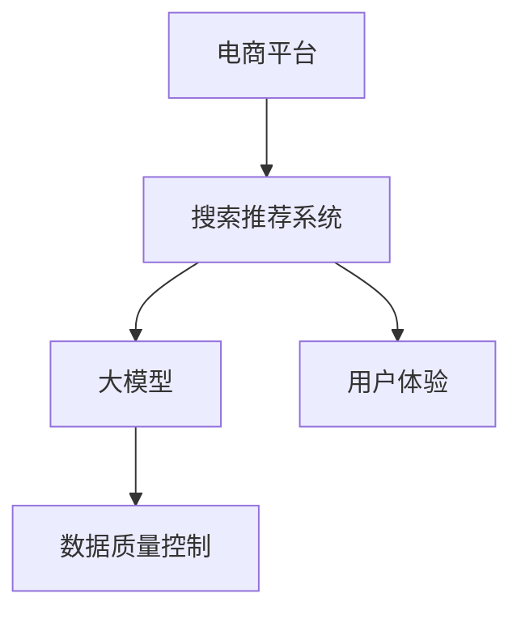

                 

# 电商平台的AI 大模型转型：搜索推荐系统是核心，数据质量控制与用户体验

## 1. 背景介绍

### 1.1 问题由来
近年来，随着人工智能技术的快速发展，尤其是深度学习技术的成熟应用，各大电商平台纷纷加速人工智能转型，以提升用户体验和运营效率。在电商搜索推荐系统中，大模型的引入使得推荐算法取得了显著的进步，显著提升了商品推荐的准确性和个性化程度。然而，随着大模型应用的逐步深入，电商平台的AI转型也面临着新的挑战，特别是在数据质量控制和用户体验优化方面。

### 1.2 问题核心关键点
目前，大模型在电商搜索推荐系统中被广泛应用于商品推荐、用户画像生成、个性化广告投放等场景，带来了显著的业务价值。但与此同时，数据质量问题以及用户体验的提升仍需重点关注。具体来说：

- **数据质量**：电商平台的交易数据、用户行为数据等对于训练大模型至关重要。然而，数据中可能存在噪音、缺失、重复等问题，影响模型的训练效果和推荐精度。
- **用户体验**：搜索推荐系统的核心目的是提升用户体验，但如何平衡搜索效果和展示效果，以及如何通过大模型引入更多创新元素（如智能对话、多模态推荐等），依然是未来需要深入探索的领域。

本文将系统介绍电商平台的AI 大模型转型，重点关注搜索推荐系统中的数据质量控制与用户体验优化，希望能为电商平台提供有价值的参考。

## 2. 核心概念与联系

### 2.1 核心概念概述

为更好地理解电商平台AI大模型转型的核心技术，本节将介绍几个密切相关的核心概念：

- **电商平台**：指在线销售商品和服务的平台，包括商品展示、搜索、推荐、支付、物流等环节。
- **搜索推荐系统**：指通过自然语言处理、计算机视觉等技术，对用户查询和行为数据进行处理，推荐最相关的商品或服务的系统。
- **大模型**：指基于大规模深度学习模型（如Transformer、BERT等）构建的模型，通常具有亿级参数量，能够处理复杂的自然语言任务。
- **数据质量控制**：指对电商交易数据、用户行为数据等进行清洗、去重、补全等操作，以确保数据的质量和一致性。
- **用户体验**：指用户在使用电商平台时的整体感受和满意度，包括搜索、浏览、推荐、购买等环节的体验。

这些核心概念之间的逻辑关系可以通过以下Mermaid流程图来展示：



这个流程图展示了大模型在电商平台的搜索推荐系统中的核心地位，同时强调了数据质量和用户体验的重要性。

## 3. 核心算法原理 & 具体操作步骤
### 3.1 算法原理概述

电商平台的搜索推荐系统中的大模型应用，通常遵循以下核心算法原理：

1. **数据预处理**：对电商交易数据、用户行为数据等进行清洗、归一化、向量化的预处理，为模型的训练和推理做准备。
2. **模型训练**：利用大规模标注数据集，通过监督学习或自监督学习方式训练大模型，使其学习到商品和用户之间的语义关系。
3. **推荐生成**：根据用户查询或行为数据，使用训练好的大模型生成个性化的商品推荐列表。
4. **效果评估**：通过A/B测试、点击率、转化率等指标评估推荐效果，进行模型的迭代优化。

其中，数据预处理和模型训练是大模型转型的核心环节，直接影响到推荐效果和用户体验。

### 3.2 算法步骤详解

以下是大模型在电商搜索推荐系统中的具体操作步骤：

**Step 1: 数据预处理**

- **数据收集**：从电商平台收集用户交易数据、行为数据、搜索数据、评价数据等。
- **数据清洗**：处理数据中的缺失值、异常值、重复值等问题，确保数据的一致性和完整性。
- **特征提取**：对数据进行特征工程，提取出有意义的特征向量，用于模型训练。
- **数据分片**：将处理后的数据分成训练集、验证集和测试集，以备后续模型训练和评估。

**Step 2: 模型训练**

- **选择模型**：根据电商平台的业务需求，选择合适的深度学习模型（如BERT、Transformers、GPT等）。
- **训练优化**：使用优化的训练框架（如PyTorch、TensorFlow等）进行模型训练，设置合适的学习率、批大小等超参数。
- **数据增强**：采用数据增强技术（如对抗样本、随机噪声、回译等）提高模型的泛化能力。
- **模型评估**：在验证集上评估模型的性能，监控训练过程中的指标（如损失函数、准确率、F1-score等），防止过拟合。

**Step 3: 推荐生成**

- **用户画像生成**：根据用户历史行为数据，使用大模型生成用户画像，包括用户的兴趣偏好、购买历史等。
- **商品嵌入**：使用大模型将商品信息（如标题、描述、价格等）转换为向量表示，用于计算相似度。
- **推荐算法**：结合用户画像和商品嵌入，使用推荐算法（如协同过滤、基于矩阵分解的推荐等）生成个性化推荐列表。

**Step 4: 效果评估**

- **A/B测试**：将不同模型的推荐结果随机分配给不同用户，通过点击率、转化率等指标评估推荐效果。
- **用户反馈**：收集用户对推荐结果的反馈，通过NPS、满意度等指标评估用户体验。
- **模型迭代**：根据评估结果，调整模型参数，进行模型的迭代优化。

### 3.3 算法优缺点

大模型在电商平台的搜索推荐系统中，具有以下优点：

1. **精度高**：大模型通过大规模数据训练，能够学习到复杂的语义关系，提高推荐的精度和个性化程度。
2. **泛化能力强**：大模型的预训练过程已经对大量语料进行了学习，使得其在不同场景下的表现更加稳健。
3. **扩展性强**：大模型可以通过微调或迁移学习，灵活适配不同的电商应用场景。

但同时，大模型也存在一些缺点：

1. **计算资源需求高**：大模型的训练和推理需要大量计算资源，对硬件环境要求较高。
2. **参数量大**：大模型通常具有亿级参数量，增加了存储和传输的复杂度。
3. **数据依赖性强**：大模型的性能依赖于高质量的数据，数据缺失或噪声等问题可能影响推荐效果。

## 4. 数学模型和公式 & 详细讲解  
### 4.1 数学模型构建

电商平台的搜索推荐系统中的大模型应用，通常采用Transformer等结构。以下以Transformers为例，介绍其数学模型构建过程。

假设输入数据为序列 $x = (x_1, x_2, \ldots, x_n)$，其中 $x_i$ 为第 $i$ 个输入的向量表示。使用Transformer模型进行序列编码，得到输出 $h = (h_1, h_2, \ldots, h_n)$，其中 $h_i$ 为第 $i$ 个输出的向量表示。

模型由多个编码层组成，每个编码层由多头自注意力机制、前馈神经网络、残差连接等组成。在每个编码层中，输入 $x$ 通过自注意力机制，与所有输入 $x$ 进行交互，得到中间表示 $q$。然后，将 $q$ 输入到前馈神经网络中，得到 $h$。最终，所有编码层的输出通过残差连接进行堆叠，得到最终的输出 $h$。

### 4.2 公式推导过程

Transformer模型中，自注意力机制的公式如下：

$$
q = \mathbf{Q}X \mathbf{K}^T + \mathbf{b}_Q, \quad k = \mathbf{K}X \mathbf{K}^T + \mathbf{b}_K, \quad v = \mathbf{V}X \mathbf{V}^T + \mathbf{b}_V
$$

其中，$\mathbf{Q}, \mathbf{K}, \mathbf{V}$ 分别为查询矩阵、键矩阵和值矩阵，$\mathbf{X}$ 为输入矩阵，$\mathbf{b}_Q, \mathbf{b}_K, \mathbf{b}_V$ 为可学习的偏置向量。

前馈神经网络部分，可以表示为：

$$
h_i = \mathbf{W}_1 z_i + b_1, \quad z_i = \sigma(\mathbf{W}_2 h_{i-1} + b_2)
$$

其中，$\mathbf{W}_1, \mathbf{W}_2$ 为线性变换矩阵，$\mathbf{b}_1, \mathbf{b}_2$ 为可学习的偏置向量，$\sigma$ 为激活函数。

### 4.3 案例分析与讲解

假设电商平台上有一个用户 $u$，历史购买记录为 $x_1, x_2, \ldots, x_n$，商品 $i$ 的标题为 $t_i$。为了给用户 $u$ 推荐商品 $i$，可以使用以下步骤：

1. 对用户购买历史 $x$ 进行编码，得到用户向量 $u$。
2. 对商品标题 $t_i$ 进行编码，得到商品向量 $v_i$。
3. 计算 $u$ 和 $v_i$ 的相似度 $s = u \cdot v_i$，表示用户对商品 $i$ 的兴趣程度。
4. 根据相似度 $s$ 生成推荐列表。

假设用户 $u$ 对商品 $i_1, i_2, \ldots, i_k$ 感兴趣，则推荐列表可以表示为 $i_1, i_2, \ldots, i_k$。

## 5. 项目实践：代码实例和详细解释说明
### 5.1 开发环境搭建

在进行电商平台的AI大模型转型时，需要准备相应的开发环境。以下是使用Python进行TensorFlow开发的环境配置流程：

1. 安装Anaconda：从官网下载并安装Anaconda，用于创建独立的Python环境。

2. 创建并激活虚拟环境：
```bash
conda create -n tf-env python=3.8 
conda activate tf-env
```

3. 安装TensorFlow：根据CUDA版本，从官网获取对应的安装命令。例如：
```bash
conda install tensorflow tensorflow-gpu=2.6 -c conda-forge
```

4. 安装TensorBoard：
```bash
pip install tensorboard
```

5. 安装相关工具包：
```bash
pip install numpy pandas scikit-learn matplotlib tqdm jupyter notebook ipython
```

完成上述步骤后，即可在`tf-env`环境中开始大模型微调的实践。

### 5.2 源代码详细实现

以下是使用TensorFlow实现电商搜索推荐系统的代码实现：

```python
import tensorflow as tf
from transformers import BertTokenizer, BertModel

# 加载预训练模型和分词器
tokenizer = BertTokenizer.from_pretrained('bert-base-uncased')
model = BertModel.from_pretrained('bert-base-uncased', output_hidden_states=True)

# 定义数据预处理函数
def preprocess_data(data):
    # 对数据进行分词、去重、补全等操作
    # 返回处理后的特征向量
    pass

# 定义模型训练函数
def train_model(model, train_data, validation_data, epochs, batch_size):
    # 准备训练集和验证集
    train_dataset = tf.data.Dataset.from_tensor_slices((train_data, train_labels))
    validation_dataset = tf.data.Dataset.from_tensor_slices((validation_data, validation_labels))

    # 定义优化器和损失函数
    optimizer = tf.keras.optimizers.Adam(learning_rate=2e-5)
    loss_fn = tf.keras.losses.SparseCategoricalCrossentropy(from_logits=True)

    # 定义训练和验证过程
    @tf.function
    def train_step(inputs, labels):
        with tf.GradientTape() as tape:
            outputs = model(inputs)
            loss = loss_fn(labels, outputs.logits)
        grads = tape.gradient(loss, model.trainable_variables)
        optimizer.apply_gradients(zip(grads, model.trainable_variables))
        return loss

    @tf.function
    def validation_step(inputs, labels):
        outputs = model(inputs)
        loss = loss_fn(labels, outputs.logits)
        return loss

    # 训练模型
    for epoch in range(epochs):
        train_loss = 0.0
        validation_loss = 0.0
        for batch in train_dataset:
            inputs, labels = batch
            loss = train_step(inputs, labels)
            train_loss += loss

        for batch in validation_dataset:
            inputs, labels = batch
            loss = validation_step(inputs, labels)
            validation_loss += loss

        print(f"Epoch {epoch+1}, train loss: {train_loss}, validation loss: {validation_loss}")

# 训练模型
train_model(model, train_data, validation_data, 5, 32)
```

### 5.3 代码解读与分析

让我们再详细解读一下关键代码的实现细节：

**preprocess_data函数**：
- 对输入数据进行分词、去重、补全等预处理操作，返回处理后的特征向量。

**train_model函数**：
- 定义优化器和损失函数。
- 使用tf.function装饰器，将训练和验证过程编译为图，加速计算。
- 在每个epoch中，先进行训练，计算训练集损失，再对验证集进行验证，计算验证集损失。

**训练过程**：
- 使用Adam优化器进行模型训练，学习率为2e-5。
- 在每个epoch中，先对训练集进行迭代，更新模型参数，再对验证集进行评估，输出训练集和验证集的损失。

**模型评估**：
- 在每个epoch结束后，评估模型的性能，输出训练集和验证集的损失。

## 6. 实际应用场景
### 6.1 电商搜索推荐

在大模型的应用中，电商搜索推荐系统是其典型场景。通过大模型，电商平台能够对用户行为和商品信息进行深层次的语义理解，从而实现更精准的推荐。

### 6.2 用户画像生成

电商平台的搜索推荐系统中的用户画像生成，也是大模型的一大应用场景。通过用户的历史行为数据和商品信息，大模型可以生成用户画像，包括用户的兴趣偏好、购买历史等，为个性化推荐提供重要依据。

### 6.3 个性化广告投放

在大模型转型的背景下，电商平台还可以利用大模型进行个性化广告投放。通过分析用户画像和商品信息，生成针对不同用户群体的广告，提升广告投放的精准度和转化率。

### 6.4 未来应用展望

随着大模型应用的不断深入，电商平台将在更多领域实现AI大模型转型。未来，大模型将在电商平台的营销、客服、物流等更多环节发挥作用，推动电商行业的数字化转型升级。

## 7. 工具和资源推荐
### 7.1 学习资源推荐

为了帮助开发者系统掌握大模型在电商平台中的应用，这里推荐一些优质的学习资源：

1. 《深度学习理论与实践》系列博文：由深度学习专家撰写，深入浅出地介绍了深度学习理论和大模型应用。

2. CS231n《深度学习计算机视觉》课程：斯坦福大学开设的深度学习计算机视觉课程，涵盖了深度学习在计算机视觉中的应用，包括图像生成、图像分类等。

3. 《Transformers in Natural Language Processing》书籍：《Transformers》库的作者所著，全面介绍了如何使用Transformers库进行NLP任务开发，包括大模型微调等。

4. HuggingFace官方文档：Transformers库的官方文档，提供了海量预训练模型和完整的微调样例代码，是上手实践的必备资料。

5. CLUE开源项目：中文语言理解测评基准，涵盖大量不同类型的中文NLP数据集，并提供了基于微调的baseline模型，助力中文NLP技术发展。

通过对这些资源的学习实践，相信你一定能够快速掌握大模型在电商平台中的应用，并用于解决实际的NLP问题。

### 7.2 开发工具推荐

高效的开发离不开优秀的工具支持。以下是几款用于大模型微调开发的常用工具：

1. TensorFlow：由Google主导开发的开源深度学习框架，生产部署方便，适合大规模工程应用。

2. PyTorch：基于Python的开源深度学习框架，灵活动态的计算图，适合快速迭代研究。

3. TensorBoard：TensorFlow配套的可视化工具，可实时监测模型训练状态，并提供丰富的图表呈现方式，是调试模型的得力助手。

4. Weights & Biases：模型训练的实验跟踪工具，可以记录和可视化模型训练过程中的各项指标，方便对比和调优。

5. Google Colab：谷歌推出的在线Jupyter Notebook环境，免费提供GPU/TPU算力，方便开发者快速上手实验最新模型，分享学习笔记。

合理利用这些工具，可以显著提升大模型微调任务的开发效率，加快创新迭代的步伐。

### 7.3 相关论文推荐

大模型在电商平台中的应用研究，已经在学术界和工业界取得了丰硕的成果。以下是几篇奠基性的相关论文，推荐阅读：

1. Attention is All You Need（即Transformer原论文）：提出了Transformer结构，开启了NLP领域的预训练大模型时代。

2. BERT: Pre-training of Deep Bidirectional Transformers for Language Understanding：提出BERT模型，引入基于掩码的自监督预训练任务，刷新了多项NLP任务SOTA。

3. Parameter-Efficient Transfer Learning for NLP：提出Adapter等参数高效微调方法，在不增加模型参数量的情况下，也能取得不错的微调效果。

4. Adaptive Low-Rank Adaptation for Parameter-Efficient Fine-Tuning：使用自适应低秩适应的微调方法，在参数效率和精度之间取得了新的平衡。

5. AdaLoRA: Adaptive Low-Rank Adaptation for Parameter-Efficient Fine-Tuning：采用自适应低秩适应的微调方法，在参数效率和精度之间取得了新的平衡。

这些论文代表了大模型在电商平台中的应用发展脉络。通过学习这些前沿成果，可以帮助研究者把握学科前进方向，激发更多的创新灵感。

## 8. 总结：未来发展趋势与挑战
### 8.1 总结

本文对电商平台中大模型的应用进行了系统介绍。首先阐述了电商平台AI大模型转型的背景和意义，明确了大模型在搜索推荐系统中的核心地位。其次，从原理到实践，详细讲解了大模型微调的数学模型和操作步骤，给出了微调任务开发的完整代码实例。同时，本文还广泛探讨了大模型在电商领域的应用场景，展示了其巨大的商业潜力。

通过本文的系统梳理，可以看到，大模型在电商平台中的应用已经取得了显著的进展，但在数据质量控制和用户体验优化方面仍需进一步探索。未来，随着大模型技术的不断演进，相信电商平台将在更多领域实现AI大模型转型，为数字化升级提供新的动力。

### 8.2 未来发展趋势

展望未来，大模型在电商平台中的应用将呈现以下几个发展趋势：

1. **数据质量控制**：电商平台将更加注重数据质量控制，通过数据清洗、去重、补全等操作，提升数据的一致性和完整性。同时，引入更多的数据增强技术，提高模型的泛化能力。

2. **个性化推荐**：大模型将进一步提升个性化推荐的精度和多样性，通过引入多模态数据（如图片、视频、语音等），增强推荐系统的创新性和用户体验。

3. **智能对话**：基于大模型的智能对话技术，将提升用户互动的体验和效率。智能客服、智能导航、智能导购等应用场景将得到广泛应用。

4. **实时推荐**：电商平台的搜索推荐系统将更加注重实时性，通过实时数据处理和大模型推理，提升推荐效果的及时性和精准度。

5. **多任务学习**：电商平台将探索多任务学习技术，在单一模型中同时完成多个任务，提高模型的综合表现和资源利用率。

6. **联邦学习**：通过联邦学习技术，电商平台可以在不泄露用户隐私的情况下，实现数据分布式计算和模型训练，提高数据安全性和隐私保护水平。

以上趋势凸显了大模型在电商平台中的广阔前景。这些方向的探索发展，必将进一步提升电商平台的智能水平和用户体验，推动电商行业的持续创新和升级。

### 8.3 面临的挑战

尽管大模型在电商平台的搜索推荐系统中已经取得了显著的进展，但在迈向更加智能化、普适化应用的过程中，它仍面临着诸多挑战：

1. **计算资源瓶颈**：大模型的训练和推理需要大量计算资源，对硬件环境要求较高。如何在有限的计算资源下，提升模型的性能和效率，是大模型应用面临的重要挑战。

2. **数据质量问题**：电商平台的交易数据、用户行为数据等存在噪音、缺失、重复等问题，影响模型的训练效果和推荐精度。如何提高数据质量，确保数据的一致性和完整性，需要更多的技术手段和规范管理。

3. **模型鲁棒性不足**：大模型面对域外数据时，泛化性能往往大打折扣。对于测试样本的微小扰动，模型预测也容易发生波动。如何提高模型的鲁棒性，避免过拟合和灾难性遗忘，是未来的研究方向。

4. **用户体验优化**：电商平台的搜索推荐系统需要平衡搜索效果和展示效果，如何通过大模型引入更多创新元素（如智能对话、多模态推荐等），提升用户体验，是大模型应用的重要课题。

5. **数据隐私保护**：电商平台需要在保护用户隐私的前提下，利用大模型进行推荐。如何在数据隐私保护和模型训练之间取得平衡，需要更多的技术手段和法规规范。

6. **模型可解释性**：大模型往往像"黑盒"系统，难以解释其内部工作机制和决策逻辑。如何赋予模型更强的可解释性，确保其决策透明性和可信度，是未来的研究方向。

这些挑战需要电商平台的开发者和研究者共同努力，通过技术创新和规范管理，克服这些难题，推动大模型在电商平台中的广泛应用。

### 8.4 研究展望

面对大模型在电商平台中面临的挑战，未来的研究需要在以下几个方面寻求新的突破：

1. **数据增强技术**：开发更多数据增强技术，提高模型的泛化能力和鲁棒性，降低对标注数据的依赖。

2. **模型压缩和优化**：通过模型压缩和优化技术，减少大模型的计算资源需求，提升模型的推理速度和资源利用率。

3. **多任务学习和联邦学习**：探索多任务学习和联邦学习技术，提高模型的综合表现和数据安全水平，同时保障用户隐私。

4. **智能对话和推荐算法**：引入智能对话和推荐算法，提升用户互动的体验和效率，实现更加个性化的推荐服务。

5. **模型可解释性**：开发可解释性模型，增强模型的透明性和可信度，使用户能够理解模型的决策过程。

6. **数据隐私保护**：探索数据隐私保护技术，保障用户在数据使用和处理过程中的隐私权利。

这些研究方向将推动大模型在电商平台中的应用，进一步提升电商平台的智能水平和用户体验，推动电商行业的数字化转型升级。

## 9. 附录：常见问题与解答

**Q1：大模型在电商平台的推荐系统中是否适用？**

A: 大模型在电商平台的推荐系统中具有显著的优势。大模型能够学习复杂的语义关系，提升推荐精度的同时，还能够实现个性化推荐。但需要注意的是，大模型的训练和推理需要大量计算资源，硬件环境要求较高。

**Q2：电商平台的推荐系统中如何控制数据质量？**

A: 电商平台的推荐系统中，数据质量控制主要通过以下步骤实现：

1. 数据收集：从电商平台收集用户交易数据、行为数据等。
2. 数据清洗：处理数据中的缺失值、异常值、重复值等问题，确保数据的一致性和完整性。
3. 特征提取：对数据进行特征工程，提取出有意义的特征向量，用于模型训练。
4. 数据分片：将处理后的数据分成训练集、验证集和测试集，以备后续模型训练和评估。

**Q3：电商平台的推荐系统中如何使用大模型进行微调？**

A: 电商平台的推荐系统中，可以使用以下步骤对大模型进行微调：

1. 加载预训练模型和分词器。
2. 定义数据预处理函数，对输入数据进行分词、去重、补全等操作。
3. 定义模型训练函数，选择优化器和损失函数，进行模型训练和验证。
4. 使用训练好的模型进行推荐生成，通过A/B测试和用户反馈，进行模型迭代优化。

**Q4：电商平台的推荐系统中如何优化用户体验？**

A: 电商平台的推荐系统中，可以通过以下步骤优化用户体验：

1. 引入智能对话技术，提升用户互动的体验和效率。
2. 引入多模态数据（如图片、视频、语音等），增强推荐系统的创新性和用户体验。
3. 实时处理数据，提升推荐效果的及时性和精准度。
4. 探索多任务学习和联邦学习技术，提高模型的综合表现和数据安全水平。

**Q5：电商平台的推荐系统中如何保护用户隐私？**

A: 电商平台的推荐系统中，可以通过以下步骤保护用户隐私：

1. 数据匿名化：对用户数据进行匿名化处理，保障用户隐私。
2. 联邦学习：通过联邦学习技术，实现数据分布式计算和模型训练，提高数据安全性和隐私保护水平。
3. 数据加密：对用户数据进行加密处理，保障数据安全。

总之，大模型在电商平台的推荐系统中具有广阔的应用前景，但需要在数据质量控制、用户体验优化、用户隐私保护等方面进行不断探索和创新。

