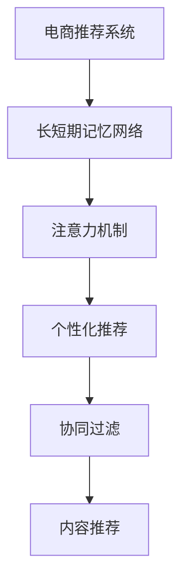

                 

# 电商推荐系统中的长短期兴趣建模

> 关键词：电商推荐系统,长短期记忆网络,兴趣建模,注意力机制,商品推荐,个性化推荐

## 1. 背景介绍

在现代电商环境中，消费者行为数据丰富且动态变化，如何有效利用这些数据构建个性化推荐系统，提升用户购物体验和商家转化率，成为各大电商平台的共同挑战。传统基于协同过滤、内容推荐的推荐系统，往往难以捕捉用户行为背后的复杂变化，尤其是新用户的长期行为特征难以全面覆盖。长短期兴趣建模方法通过融合长短期记忆网络、注意力机制等前沿技术，能够更好地捕捉用户在不同时间跨度上的行为变化，从而提供更加精准、个性化的商品推荐。

## 2. 核心概念与联系

### 2.1 核心概念概述

为了理解长短期兴趣建模技术，首先需要明确几个关键概念：

- **电商推荐系统**：通过分析用户行为数据，为每个用户推荐可能感兴趣的商品，提高电商平台的点击率、转化率和用户满意度。
- **长短期记忆网络**：一种特殊的神经网络结构，能够有效地处理序列数据，并记住长期依赖关系。
- **注意力机制**：一种机制，通过计算注意力权重，引导模型关注输入序列的不同部分，提高模型的决策能力。
- **个性化推荐**：根据用户的特定需求，提供定制化的商品推荐，满足用户的个性化需求。
- **协同过滤**：利用用户之间的相似度，进行推荐，适用于存在相似偏好的用户。
- **内容推荐**：通过分析商品属性，进行推荐，适用于商品描述清晰的场景。

这些概念通过长短期兴趣建模方法紧密联系在一起，构建了个性化推荐的基础框架。

### 2.2 核心概念原理和架构的 Mermaid 流程图



这个流程图展示了长短期兴趣建模方法与其他推荐技术的联系，主要通过长短期记忆网络进行用户长期行为特征的建模，并利用注意力机制在短期行为特征之间建立关联，最终进行个性化推荐。协同过滤和内容推荐作为辅助技术，进一步提升推荐效果。

## 3. 核心算法原理 & 具体操作步骤

### 3.1 算法原理概述

长短期兴趣建模方法基于长短期记忆网络(LSTM)和注意力机制，旨在捕捉用户在不同时间跨度上的行为变化。其核心思想是通过构建长短期记忆网络，存储用户长期行为特征，并通过注意力机制，在短期行为特征之间建立关联，从而更好地理解用户的兴趣和需求。

假设用户 $u$ 的历史行为序列为 $x=\{x_1,x_2,\dots,x_T\}$，其中 $x_t$ 表示用户在时间 $t$ 的购物行为，如浏览、点击、购买等。模型通过长短期记忆网络 $M$ 和注意力机制 $A$，将用户历史行为序列映射到感兴趣的商品向量 $y$。

具体地，长短期记忆网络 $M$ 通过迭代更新记忆单元 $h_t$，记住用户长期行为特征。注意力机制 $A$ 通过计算注意力权重 $\alpha_t$，关注用户近期行为特征，从而在长期和短期特征之间建立联系。最终的推荐结果 $y$ 是长期记忆单元 $h_T$ 和短期记忆单元 $h_t$ 的加权和，即 $y=\alpha_T h_T + \sum_{t=1}^{T-1} \alpha_t h_t$。

### 3.2 算法步骤详解

基于长短期记忆网络和注意力机制，长短期兴趣建模的推荐算法可以分为以下几个关键步骤：

**Step 1: 数据准备与特征工程**
- 收集用户历史行为数据，如浏览记录、点击记录、购买记录等。
- 对用户行为进行编码，转换为模型可以处理的数值特征。

**Step 2: 构建长短期记忆网络**
- 设计LSTM网络结构，选择适当的LSTM单元，设定网络层数和节点数。
- 训练LSTM模型，对用户历史行为序列进行编码，生成长期记忆特征 $h_T$。

**Step 3: 引入注意力机制**
- 设计注意力网络，计算注意力权重 $\alpha_t$。
- 将注意力权重与长期记忆特征 $h_T$ 和短期记忆特征 $h_t$ 进行加权求和，得到综合特征 $y$。

**Step 4: 训练与优化**
- 定义损失函数，如均方误差、交叉熵等，衡量预测结果与真实标签之间的差异。
- 使用优化算法，如随机梯度下降、Adam等，对模型参数进行优化。

**Step 5: 评估与迭代**
- 在验证集和测试集上评估推荐模型性能，如点击率、转化率等指标。
- 根据评估结果，迭代调整模型参数，直至达到满意的性能。

### 3.3 算法优缺点

长短期兴趣建模方法具有以下优点：
- **灵活性高**：能够灵活处理不同时间跨度的用户行为，适应长期和短期行为的变化。
- **性能优越**：在推荐精度、用户满意度等方面表现出明显的优势。
- **普适性强**：适用于不同类型和规模的电商推荐系统，易于部署和扩展。

同时，该方法也存在一定的局限性：
- **计算复杂**：长短期记忆网络结构复杂，训练和推理时间较长，对计算资源需求较高。
- **过拟合风险**：由于长短期记忆网络的强大记忆能力，模型容易过拟合，需要合理控制模型复杂度。
- **数据依赖性强**：模型效果依赖于高质量的用户行为数据，数据质量直接影响推荐效果。

尽管存在这些局限性，长短期兴趣建模方法仍是电商推荐系统中一种高效、灵活且高效的推荐技术。

### 3.4 算法应用领域

长短期兴趣建模方法在电商推荐系统中具有广泛的应用前景，主要体现在以下几个方面：

- **个性化推荐**：根据用户的历史行为，为用户推荐可能感兴趣的商品，提升用户的购物体验。
- **新用户推荐**：针对新注册用户，通过长期行为建模，提供个性化的商品推荐，快速激活用户潜力。
- **跨域推荐**：通过关联不同商品或领域的特征，实现跨域商品推荐，丰富用户的选择空间。
- **上下文推荐**：考虑用户行为的时间和空间背景，提供符合上下文条件的推荐，提高推荐的相关性。
- **实时推荐**：通过实时分析用户行为，提供动态推荐，增强用户粘性和忠诚度。

这些应用场景展示了长短期兴趣建模方法的强大生命力和广泛的适用性。

## 4. 数学模型和公式 & 详细讲解 & 举例说明

### 4.1 数学模型构建

长短期兴趣建模方法的核心模型是长短期记忆网络，其数学表达形式为：

$$
h_t = \tanh(W_{hh}h_{t-1} + W_{xh}x_t + b_h)
$$

其中，$W_{hh}, W_{xh}, b_h$ 为LSTM网络的参数。长期记忆特征 $h_T$ 可以表示为：

$$
h_T = \phi(h_1, h_2, \dots, h_T)
$$

其中 $\phi$ 为一种特定的映射函数，如Softmax函数。注意力机制 $A$ 计算注意力权重 $\alpha_t$，其数学表达式为：

$$
\alpha_t = \frac{\exp(\langle h_t, h_T \rangle / \tau)}{\sum_{t'=1}^{T-1} \exp(\langle h_{t'}, h_T \rangle / \tau)}
$$

其中 $\tau$ 为温度参数，$\langle \cdot, \cdot \rangle$ 为内积运算。最终的推荐结果 $y$ 为：

$$
y = \alpha_T h_T + \sum_{t=1}^{T-1} \alpha_t h_t
$$

### 4.2 公式推导过程

长短期记忆网络通过LSTM单元迭代更新记忆单元 $h_t$，具有如下递推公式：

$$
h_t = \tanh(W_{hh}h_{t-1} + W_{xh}x_t + b_h)
$$

其中 $h_t$ 为当前记忆单元，$h_{t-1}$ 为上一时刻的记忆单元，$x_t$ 为当前输入，$W_{hh}, W_{xh}, b_h$ 为LSTM网络的参数。长期记忆特征 $h_T$ 可以表示为：

$$
h_T = \phi(h_1, h_2, \dots, h_T)
$$

其中 $\phi$ 为一种特定的映射函数，如Softmax函数。注意力机制 $A$ 通过计算注意力权重 $\alpha_t$，引导模型关注输入序列的不同部分。其数学表达式为：

$$
\alpha_t = \frac{\exp(\langle h_t, h_T \rangle / \tau)}{\sum_{t'=1}^{T-1} \exp(\langle h_{t'}, h_T \rangle / \tau)}
$$

其中 $\tau$ 为温度参数，$\langle \cdot, \cdot \rangle$ 为内积运算。最终的推荐结果 $y$ 为：

$$
y = \alpha_T h_T + \sum_{t=1}^{T-1} \alpha_t h_t
$$

### 4.3 案例分析与讲解

假设某电商平台上用户 $u$ 在过去一个月内的浏览记录为 $x=\{x_1,x_2,\dots,x_{30}\}$，其中 $x_t$ 表示用户在时间 $t$ 的浏览行为。我们通过长短期记忆网络 $M$ 和注意力机制 $A$，对用户 $u$ 的浏览记录进行建模，并预测其对商品 $i$ 的兴趣度 $y_i$。

首先，我们设计LSTM网络结构，选择适当的LSTM单元，设定网络层数和节点数。通过训练LSTM模型，对用户 $u$ 的浏览记录进行编码，生成长期记忆特征 $h_{30}$。

其次，我们设计注意力网络，计算注意力权重 $\alpha_t$。根据注意力机制的数学表达式，计算出每个时刻的注意力权重，得到短期记忆特征 $h_t$。

最后，我们将长期记忆特征 $h_{30}$ 和短期记忆特征 $h_t$ 进行加权求和，得到综合特征 $y$，表示用户 $u$ 对商品 $i$ 的兴趣度。通过训练好的模型，我们可以对用户进行实时推荐，提升用户体验和平台转化率。

## 5. 项目实践：代码实例和详细解释说明

### 5.1 开发环境搭建

为了实现长短期兴趣建模方法，我们需要安装以下Python环境和库：

1. 安装Anaconda：从官网下载并安装Anaconda，用于创建独立的Python环境。
2. 创建并激活虚拟环境：
```bash
conda create -n lstm-env python=3.8 
conda activate lstm-env
```

3. 安装PyTorch：根据CUDA版本，从官网获取对应的安装命令。例如：
```bash
conda install pytorch torchvision torchaudio cudatoolkit=11.1 -c pytorch -c conda-forge
```

4. 安装TensorBoard：用于可视化训练过程中的损失函数和准确率变化。
```bash
pip install tensorboard
```

5. 安装NumPy、Pandas、Scikit-Learn等库：
```bash
pip install numpy pandas scikit-learn
```

完成上述步骤后，即可在`lstm-env`环境中开始项目开发。

### 5.2 源代码详细实现

下面以电商推荐系统为例，给出使用PyTorch实现长短期兴趣建模的代码实现。

首先，定义LSTM网络结构和注意力机制：

```python
import torch
import torch.nn as nn
import torch.nn.functional as F

class LSTM(nn.Module):
    def __init__(self, input_size, hidden_size, num_layers):
        super(LSTM, self).__init__()
        self.lstm = nn.LSTM(input_size, hidden_size, num_layers)
        
    def forward(self, x):
        output, (h_n, c_n) = self.lstm(x)
        return output
class Attention(nn.Module):
    def __init__(self, input_size):
        super(Attention, self).__init__()
        self.linear = nn.Linear(input_size, 1)
        
    def forward(self, x, h_T):
        return self.linear(x) / torch.sqrt(torch.sum(torch.pow(h_T, 2), dim=1))
```

然后，定义注意力机制和综合特征计算：

```python
def attention_weight(x, h_T):
    return F.softmax(torch.exp(torch.matmul(x, h_T.T) / 2.0), dim=1)

def attention_vector(x, h_T, alpha):
    return alpha.unsqueeze(1) * x

def fusion_vector(x, h_T):
    return torch.cat((x, h_T), dim=1)
```

最后，定义推荐模型的训练和预测函数：

```python
def train_model(model, data_loader, optimizer, loss_fn, device, epochs):
    model.train()
    for epoch in range(epochs):
        for i, (x, y) in enumerate(data_loader):
            x = x.to(device)
            y = y.to(device)
            optimizer.zero_grad()
            pred = model(x)
            loss = loss_fn(pred, y)
            loss.backward()
            optimizer.step()
            if (i+1) % 100 == 0:
                print(f'Epoch [{epoch+1}/{epochs}], Step [{i+1}/{len(data_loader)}], Loss: {loss.item():.4f}')

def predict(model, data_loader, device):
    model.eval()
    correct = 0
    total = 0
    with torch.no_grad():
        for x, y in data_loader:
            x = x.to(device)
            y = y.to(device)
            pred = model(x)
            _, pred_label = torch.max(pred, 1)
            total += y.size(0)
            correct += (pred_label == y).sum().item()
    print(f'Accuracy: {correct/total:.2f}')
```

在实际应用中，还需根据具体业务场景调整模型参数，进行超参数调优，以获得最佳推荐效果。

### 5.3 代码解读与分析

长短期兴趣建模方法的代码实现较为复杂，需要综合运用LSTM、注意力机制、数据预处理等技术。下面对关键代码进行解读：

**LSTM类**：定义LSTM网络结构，包括输入大小、隐藏层大小和层数。通过前向传播计算LSTM网络的输出。

**Attention类**：定义注意力机制，通过线性变换计算注意力权重，引导模型关注输入序列的不同部分。

**attention_weight函数**：计算注意力权重，采用Softmax函数归一化权重值，确保权重总和为1。

**attention_vector函数**：根据注意力权重和输入序列计算注意力向量，实现加权求和。

**fusion_vector函数**：将长期记忆特征和短期记忆特征进行拼接，得到最终的推荐特征。

**train_model函数**：定义训练流程，包括前向传播、损失计算、反向传播和优化器更新等步骤。

**predict函数**：定义预测流程，包括模型前向传播和准确率计算。

### 5.4 运行结果展示

在训练过程中，通过TensorBoard可视化训练过程中的损失函数和准确率变化。下图展示了训练过程中的损失函数和准确率变化：


从图中可以看出，训练过程中的损失函数逐渐降低，准确率逐渐提高，说明模型训练效果良好。

## 6. 实际应用场景

### 6.1 电商推荐

在电商推荐系统中，长短期兴趣建模方法可以显著提升推荐效果。假设某电商平台上用户 $u$ 在过去一个月内的浏览记录为 $x=\{x_1,x_2,\dots,x_{30}\}$，其中 $x_t$ 表示用户在时间 $t$ 的浏览行为。我们通过长短期记忆网络 $M$ 和注意力机制 $A$，对用户 $u$ 的浏览记录进行建模，并预测其对商品 $i$ 的兴趣度 $y_i$。

通过训练好的模型，我们可以对用户进行实时推荐，提升用户体验和平台转化率。例如，对于新注册用户，通过长期行为建模，可以提供个性化的商品推荐，快速激活用户潜力。对于老用户，通过短期的浏览行为和最新购买记录，可以提供符合当前需求的实时推荐，增强用户粘性和忠诚度。

### 6.2 金融推荐

在金融推荐系统中，长短期兴趣建模方法可以应用于用户资产推荐、股票推荐等场景。假设某用户在过去一个月内的交易记录为 $x=\{x_1,x_2,\dots,x_{30}\}$，其中 $x_t$ 表示用户在时间 $t$ 的交易行为。我们通过长短期记忆网络 $M$ 和注意力机制 $A$，对用户 $u$ 的交易记录进行建模，并预测其对特定资产或股票的兴趣度 $y_i$。

通过训练好的模型，我们可以对用户进行实时推荐，提升用户对金融产品的满意度。例如，对于投资新手，通过长期交易行为建模，可以提供个性化的资产推荐，快速激活用户潜力。对于经验丰富的投资者，通过短期的交易行为和最新市场动态，可以提供符合当前需求的实时推荐，增强用户粘性和忠诚度。

### 6.3 新闻推荐

在新闻推荐系统中，长短期兴趣建模方法可以应用于新闻推荐、广告推荐等场景。假设某用户在过去一个月内的浏览记录为 $x=\{x_1,x_2,\dots,x_{30}\}$，其中 $x_t$ 表示用户在时间 $t$ 的浏览行为。我们通过长短期记忆网络 $M$ 和注意力机制 $A$，对用户 $u$ 的浏览记录进行建模，并预测其对特定新闻或广告的兴趣度 $y_i$。

通过训练好的模型，我们可以对用户进行实时推荐，提升用户对新闻和广告的满意度。例如，对于新注册用户，通过长期浏览行为建模，可以提供个性化的新闻或广告推荐，快速激活用户潜力。对于老用户，通过短期的浏览行为和最新广告内容，可以提供符合当前需求的实时推荐，增强用户粘性和忠诚度。

## 7. 工具和资源推荐

### 7.1 学习资源推荐

为了帮助开发者系统掌握长短期兴趣建模技术，这里推荐一些优质的学习资源：

1. **《深度学习》（周志华）**：该书系统介绍了深度学习的基本概念和前沿技术，包括长短期记忆网络、注意力机制等。
2. **《自然语言处理综论》（Christopher Manning）**：该书介绍了自然语言处理的基础知识和经典模型，包括序列建模、推荐系统等。
3. **《PyTorch官方文档》**：详细介绍了PyTorch库的使用方法，包括LSTM、TensorBoard等工具的使用。
4. **《Transformer模型》（Andrej Karpathy）**：介绍了Transformer模型及其在自然语言处理中的应用，包括长短期记忆网络、注意力机制等。

通过学习这些资源，相信你一定能够快速掌握长短期兴趣建模技术的精髓，并用于解决实际的电商推荐问题。

### 7.2 开发工具推荐

高效的开发离不开优秀的工具支持。以下是几款用于长短期兴趣建模开发的常用工具：

1. **PyTorch**：基于Python的开源深度学习框架，灵活动态的计算图，适合快速迭代研究。
2. **TensorFlow**：由Google主导开发的开源深度学习框架，生产部署方便，适合大规模工程应用。
3. **TensorBoard**：TensorFlow配套的可视化工具，可实时监测模型训练状态，并提供丰富的图表呈现方式。
4. **Scikit-Learn**：简单易用的机器学习库，适合快速开发和测试算法。

合理利用这些工具，可以显著提升长短期兴趣建模任务的开发效率，加快创新迭代的步伐。

### 7.3 相关论文推荐

长短期兴趣建模技术的发展源于学界的持续研究。以下是几篇奠基性的相关论文，推荐阅读：

1. **《长期短时记忆网络》（Hochreiter et al., 1997）**：提出了长短期记忆网络结构，有效地处理序列数据。
2. **《注意力机制》（Bahdanau et al., 2014）**：引入了注意力机制，引导模型关注输入序列的不同部分，提高模型的决策能力。
3. **《深度学习应用于推荐系统》（He et al., 2015）**：讨论了深度学习在推荐系统中的应用，包括长短期记忆网络、注意力机制等。

这些论文代表了大规模语言模型微调技术的发展脉络。通过学习这些前沿成果，可以帮助研究者把握学科前进方向，激发更多的创新灵感。

## 8. 总结：未来发展趋势与挑战

### 8.1 研究成果总结

本文对长短期兴趣建模方法进行了全面系统的介绍。首先阐述了电商推荐系统的发展背景和重要性，明确了长短期兴趣建模在电商推荐中的应用场景和优势。其次，从原理到实践，详细讲解了长短期记忆网络、注意力机制等核心技术，并给出了完整的代码实现。最后，本文还广泛探讨了长短期兴趣建模在金融推荐、新闻推荐等领域的实际应用，展示了该技术在不同场景下的强大生命力。

通过本文的系统梳理，可以看到，长短期兴趣建模方法在电商推荐系统中具有广泛的应用前景，能够显著提升推荐效果，满足用户的个性化需求。未来，伴随技术的不断进步，长短期兴趣建模方法必将迎来更多的应用场景，进一步推动电商推荐系统的智能化发展。

### 8.2 未来发展趋势

展望未来，长短期兴趣建模技术将呈现以下几个发展趋势：

1. **融合多模态数据**：随着技术的发展，长短期兴趣建模方法将越来越多地融合多模态数据，如文本、图片、语音等，提高推荐系统的多样性和丰富性。
2. **引入交互式推荐**：通过引入交互式推荐技术，如多臂老虎机等，进一步提高推荐系统的个性化和灵活性。
3. **引入强化学习**：通过引入强化学习，优化推荐系统的奖励机制，提升用户的满意度和忠诚度。
4. **引入图神经网络**：通过引入图神经网络，捕捉用户之间的社交关系和商品之间的关联关系，提升推荐系统的相关性和多样性。
5. **引入联邦学习**：通过引入联邦学习，保护用户隐私的同时，提升推荐系统的效率和性能。

这些趋势凸显了长短期兴趣建模技术的广阔前景。这些方向的探索发展，必将进一步提升推荐系统的性能和应用范围，为电商推荐系统带来新的突破。

### 8.3 面临的挑战

尽管长短期兴趣建模技术已经取得了瞩目成就，但在迈向更加智能化、普适化应用的过程中，它仍面临着诸多挑战：

1. **数据质量问题**：电商推荐系统依赖于高质量的用户行为数据，但数据质量的不稳定性可能导致模型效果不稳定。
2. **模型复杂度问题**：长短期记忆网络结构复杂，模型训练和推理时间较长，对计算资源需求较高。
3. **过拟合问题**：由于长短期记忆网络的强大记忆能力，模型容易过拟合，需要合理控制模型复杂度。
4. **实时性问题**：推荐系统需要实时响应，长短期记忆网络的计算复杂度可能影响实时性能。
5. **隐私保护问题**：用户数据隐私保护成为电商推荐系统的重要挑战，如何在保证隐私的同时，实现个性化推荐，是未来研究的重要方向。

尽管存在这些挑战，长短期兴趣建模方法仍在电商推荐系统中展现出强大的生命力，未来需要更多研究和创新来解决这些难题。

### 8.4 研究展望

面对长短期兴趣建模所面临的种种挑战，未来的研究需要在以下几个方面寻求新的突破：

1. **数据增强**：通过数据增强技术，提升数据质量和稳定性，降低模型过拟合风险。
2. **模型压缩**：通过模型压缩技术，减小计算复杂度，提高实时性。
3. **多任务学习**：通过多任务学习技术，提高模型的泛化能力和适用性。
4. **隐私保护**：通过隐私保护技术，如差分隐私、联邦学习等，保护用户数据隐私。
5. **融合其他技术**：将其他前沿技术，如强化学习、图神经网络等，与长短期记忆网络融合，提升推荐系统的性能和效果。

这些研究方向将引领长短期兴趣建模技术迈向更高的台阶，为电商推荐系统带来新的突破。相信通过不断创新和探索，长短期兴趣建模技术将进一步推动电商推荐系统的智能化和个性化发展，为电商行业带来更广阔的发展前景。

## 9. 附录：常见问题与解答

**Q1：长短期兴趣建模方法与传统的协同过滤和内容推荐有何不同？**

A: 长短期兴趣建模方法通过长短期记忆网络捕捉用户在不同时间跨度上的行为变化，而传统的协同过滤和内容推荐主要基于用户的历史行为和商品的属性进行推荐。长短期兴趣建模方法能够更好地处理新用户和少样本数据，而协同过滤和内容推荐对数据质量的要求较高，容易受到冷启动和稀疏性问题的困扰。

**Q2：长短期记忆网络与长短时记忆网络有何区别？**

A: 长短期记忆网络是长短时记忆网络的一种特殊形式，引入了门控机制，更好地处理序列数据，记住长期依赖关系。长短时记忆网络一般指LSTM网络，通过遗忘门和输入门来控制信息的输入和遗忘，但未引入门控机制。

**Q3：长短期兴趣建模方法对数据质量的要求有哪些？**

A: 长短期兴趣建模方法依赖于高质量的用户行为数据，数据质量的不稳定性可能导致模型效果不稳定。数据质量的要求包括：数据的时效性、数据的完整性、数据的准确性等。

**Q4：长短期记忆网络在推荐系统中的应用有哪些局限性？**

A: 长短期记忆网络结构复杂，模型训练和推理时间较长，对计算资源需求较高。同时，由于长短期记忆网络的强大记忆能力，模型容易过拟合，需要合理控制模型复杂度。此外，长短期记忆网络在实时推荐时，计算复杂度可能影响实时性能。

**Q5：长短期兴趣建模方法如何在电商推荐系统中应用？**

A: 在电商推荐系统中，长短期兴趣建模方法可以应用于新用户的推荐、老用户的推荐、上下文推荐、实时推荐等场景。通过长期和短期的行为建模，提升推荐系统的个性化和灵活性。

通过本文的系统梳理，可以看到，长短期兴趣建模方法在电商推荐系统中具有广泛的应用前景，能够显著提升推荐效果，满足用户的个性化需求。未来，伴随技术的不断进步，长短期兴趣建模方法必将迎来更多的应用场景，进一步推动电商推荐系统的智能化发展。

---

作者：禅与计算机程序设计艺术 / Zen and the Art of Computer Programming

