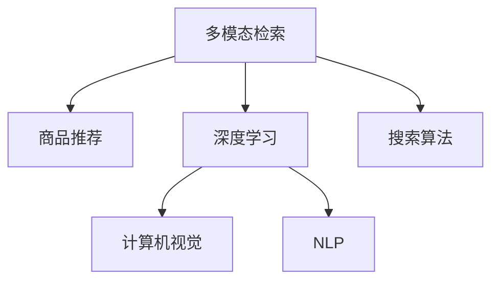

                 

# 电商搜索中的多模态商品检索模型

> 关键词：多模态检索, 商品推荐, 深度学习, 计算机视觉, 自然语言处理, 搜索算法, 电商搜索

## 1. 背景介绍

在电商搜索领域，如何通过用户的搜索查询快速找到符合需求的商品，是提升用户体验和业务转化的关键。传统的文本搜索算法，如TF-IDF、BM25等，能够很好地处理文本型查询和商品描述的匹配，但对于包含图片、视频等多模态特征的商品，其效果往往不尽如人意。因此，如何设计高效的多模态商品检索模型，成为电商搜索领域的一大研究热点。

近年来，随着深度学习技术的快速发展，深度学习模型在计算机视觉和自然语言处理(NLP)领域取得了显著进展，为多模态商品检索提供了新的可能性。本文将介绍一种基于深度学习的多模态商品检索模型，并详细探讨其在电商搜索中的实际应用。

## 2. 核心概念与联系

### 2.1 核心概念概述

为更好地理解多模态商品检索模型的设计和实现，本节将介绍几个关键概念：

- 多模态检索（Multi-modal Retrieval）：指在单一的查询中整合不同模态的数据，通过联合特征学习，提升检索性能。

- 商品推荐（Product Recommendation）：通过分析用户历史行为、属性信息等数据，推荐用户可能感兴趣的商品。

- 深度学习（Deep Learning）：通过多层神经网络，实现数据的复杂特征提取和关联学习。

- 计算机视觉（Computer Vision）：通过图像处理和模式识别技术，使机器能够"看"懂图像信息。

- 自然语言处理（Natural Language Processing, NLP）：通过语言模型和语言理解技术，使机器能够"理解"文本信息。

- 搜索算法（Search Algorithm）：通过索引和算法，快速从大量数据中匹配查询需求。

这些核心概念之间的逻辑关系可以通过以下Mermaid流程图来展示：



这个流程图展示了你核心概念的相互关系：

1. 多模态检索融合了计算机视觉和自然语言处理的信息，提升了检索的准确性。
2. 商品推荐利用深度学习模型分析用户行为和商品属性，实现个性化推荐。
3. 搜索算法通过索引和算法，在多模态检索和商品推荐的结果中进行快速匹配。

## 3. 核心算法原理 & 具体操作步骤

### 3.1 算法原理概述

多模态商品检索模型通过联合学习计算机视觉和自然语言处理的数据，构建一个深度学习框架，使得模型能够从文本和图像等多模态特征中获取信息，进行有效的检索和推荐。其核心原理如下：

1. **数据融合**：将文本描述、图片、视频等多模态特征进行融合，生成统一的特征向量。
2. **联合训练**：在统一的特征空间上，使用深度学习模型联合训练文本和图像的表示。
3. **检索匹配**：通过检索算法，从大规模商品库中匹配查询需求。
4. **推荐优化**：在检索结果基础上，使用推荐模型进行进一步优化，提升用户体验和转化率。

### 3.2 算法步骤详解

具体实现多模态商品检索模型，通常需要以下几个关键步骤：

**Step 1: 数据准备与预处理**

- 收集商品库中的多模态数据，包括图片、视频、文本描述等。
- 对图片和视频进行预处理，如裁剪、缩放、归一化等。
- 对文本进行分词、编码等处理。
- 构建统一的数据集，包含文本和图片等特征。

**Step 2: 特征提取与融合**

- 使用预训练的计算机视觉模型（如ResNet、VGG等）提取图片的特征向量。
- 使用预训练的自然语言处理模型（如BERT、GPT等）提取文本的特征向量。
- 使用多模态融合方法（如Concat、Add、Max-Pooling等）将文本和图片特征向量进行融合，生成统一的特征向量。

**Step 3: 模型训练与优化**

- 构建深度学习模型（如Transformer、Siamese等），联合训练文本和图像的表示。
- 使用优化算法（如Adam、SGD等）进行模型参数的优化。
- 应用正则化技术（如L2正则、Dropout等）防止模型过拟合。
- 在验证集上评估模型性能，调整超参数。

**Step 4: 检索与推荐**

- 构建索引，对商品库进行预处理和向量表示。
- 对用户查询进行预处理，提取多模态特征。
- 使用检索算法（如余弦相似度、欧式距离等）在商品库中进行检索匹配。
- 根据检索结果，使用推荐模型进行进一步优化，如协同过滤、基于知识图谱的推荐等。

### 3.3 算法优缺点

基于多模态检索的商品推荐模型具有以下优点：

1. **全面覆盖**：通过融合文本和图像等多模态数据，全面覆盖商品信息，提升了检索和推荐的准确性。
2. **个性化推荐**：利用深度学习模型分析用户行为和商品属性，实现更加精准的个性化推荐。
3. **鲁棒性强**：多模态数据的多样性使得模型对单一特征的缺失或噪声具有较强的鲁棒性。
4. **跨模态理解**：通过联合训练，模型能够理解不同模态之间的语义关联，提升跨模态检索性能。

同时，该模型也存在一定的局限性：

1. **高昂成本**：多模态数据预处理和特征提取需要消耗大量计算资源，增加了系统成本。
2. **数据对齐**：不同模态的数据特征表示方式不同，需要进行对齐和融合，增加了模型的复杂性。
3. **模型复杂**：联合训练的深度学习模型较为复杂，训练和推理的计算开销较大。
4. **实时性差**：模型在大规模数据上进行训练和推理，响应速度较慢。

尽管存在这些局限性，但多模态商品检索模型在电商搜索领域仍具有广泛的应用前景。未来相关研究的方向包括提升模型效率、优化特征融合方式、增强数据对齐技术等，以进一步提高系统的性能和可扩展性。

### 3.4 算法应用领域

多模态商品检索模型在电商搜索中的应用领域广泛，主要包括以下几个方面：

- 商品搜索：通过融合文本和图像信息，提升商品搜索的准确性和相关性。
- 商品推荐：利用深度学习模型分析用户行为和商品属性，实现个性化推荐。
- 视觉搜索：通过图像检索技术，让用户能够通过上传图片找到类似商品。
- 视频搜索：通过视频检索技术，让用户能够通过上传视频找到相关商品。
- 智能客服：通过理解用户的多模态查询，提供更精准的搜索结果和推荐。

## 4. 数学模型和公式 & 详细讲解 & 举例说明

### 4.1 数学模型构建

本节将使用数学语言对多模态商品检索模型的构建过程进行更加严格的刻画。

假设用户查询为 $q$，商品库中每个商品的描述为 $d_i$，图像为 $i$。定义文本表示函数为 $f_d(\cdot)$，图像表示函数为 $f_v(\cdot)$，多模态表示函数为 $f_m(\cdot)$。则模型训练的目标是最大化以下损失函数：

$$
\mathcal{L}=\sum_{i=1}^{N}(\log P(y_i=1|d_i,q)+\log P(y_i=0|d_i,q))
$$

其中 $P(y_i=1|d_i,q)$ 表示模型预测商品 $i$ 与查询 $q$ 匹配的概率。

### 4.2 公式推导过程

以余弦相似度为例，推导多模态检索模型的计算公式。

假设文本和图像的特征向量分别为 $x_{d_i}$ 和 $x_{i}$，则余弦相似度为：

$$
\text{similarity}(q, d_i) = \frac{f_m(q) \cdot f_m(d_i)}{\|f_m(q)\|\|f_m(d_i)\|}
$$

对于每个商品 $i$，模型的预测概率为：

$$
P(y_i=1|d_i,q) = \sigma(\text{similarity}(q, d_i))
$$

其中 $\sigma(\cdot)$ 为sigmoid函数，用于将余弦相似度转换为概率。

模型的损失函数为：

$$
\mathcal{L}=\sum_{i=1}^{N}(\log P(y_i=1|d_i,q)+\log P(y_i=0|d_i,q))
$$

通过优化损失函数，模型能够学习到文本和图像特征之间的映射关系，提升检索和推荐的性能。

### 4.3 案例分析与讲解

假设用户查询为“红色长裙”，商品库中有100件商品，其描述和图像分别如下：

| 商品编号 | 描述               | 图像               |
|----------|-------------------|-------------------|
| 1        | 红色长裙，适合夏天 | [图片1](https://example.com/1.jpg) |
| 2        | 黑色连衣裙         | [图片2](https://example.com/2.jpg) |
| ...      | ...               | ...               |

对图像和文本分别使用预训练模型进行特征提取，得到特征向量。然后，使用余弦相似度计算每个商品与查询的匹配度：

| 商品编号 | 描述               | 图像               | 特征向量           | 余弦相似度          |
|----------|-------------------|-------------------|--------------------|--------------------|
| 1        | 红色长裙，适合夏天 | [图片1](https://example.com/1.jpg) | $x_{d_1}$           | $\text{similarity}(q, d_1)$ |
| 2        | 黑色连衣裙         | [图片2](https://example.com/2.jpg) | $x_{d_2}$           | $\text{similarity}(q, d_2)$ |
| ...      | ...               | ...               | ...                | ...                |

最后，将余弦相似度作为匹配度，排序后选取前10个商品进行展示。

## 5. 项目实践：代码实例和详细解释说明

### 5.1 开发环境搭建

在进行多模态商品检索模型开发前，我们需要准备好开发环境。以下是使用Python进行PyTorch开发的环境配置流程：

1. 安装Anaconda：从官网下载并安装Anaconda，用于创建独立的Python环境。

2. 创建并激活虚拟环境：
```bash
conda create -n pytorch-env python=3.8 
conda activate pytorch-env
```

3. 安装PyTorch：根据CUDA版本，从官网获取对应的安装命令。例如：
```bash
conda install pytorch torchvision torchaudio cudatoolkit=11.1 -c pytorch -c conda-forge
```

4. 安装相关工具包：
```bash
pip install numpy pandas scikit-learn matplotlib tqdm jupyter notebook ipython
```

完成上述步骤后，即可在`pytorch-env`环境中开始模型开发。

### 5.2 源代码详细实现

下面以多模态检索模型的代码实现为例，展示使用PyTorch进行模型训练和推理的过程。

首先，定义模型类和损失函数：

```python
import torch
import torch.nn as nn
import torch.nn.functional as F

class MultimodalRetrievalModel(nn.Module):
    def __init__(self, d_text, d_image, d_mixed):
        super(MultimodalRetrievalModel, self).__init__()
        self.text_encoder = nn.Sequential(
            nn.Linear(d_text, 256),
            nn.ReLU(),
            nn.Linear(256, d_mixed)
        )
        self.image_encoder = nn.Sequential(
            nn.Linear(d_image, 256),
            nn.ReLU(),
            nn.Linear(256, d_mixed)
        )
        self similarity_fn = nn.CosineSimilarity(dim=1)
        
    def forward(self, text, image):
        text_feats = self.text_encoder(text)
        image_feats = self.image_encoder(image)
        similarity = self.similarity_fn(text_feats, image_feats)
        return similarity
```

然后，定义训练和评估函数：

```python
from torch.utils.data import DataLoader
from tqdm import tqdm
from sklearn.metrics import accuracy_score

device = torch.device('cuda') if torch.cuda.is_available() else torch.device('cpu')
model.to(device)

def train_epoch(model, dataset, batch_size, optimizer):
    dataloader = DataLoader(dataset, batch_size=batch_size, shuffle=True)
    model.train()
    epoch_loss = 0
    for batch in tqdm(dataloader, desc='Training'):
        text, image = batch['text'].to(device), batch['image'].to(device)
        optimizer.zero_grad()
        outputs = model(text, image)
        loss = F.cross_entropy(outputs, batch['label'])
        epoch_loss += loss.item()
        loss.backward()
        optimizer.step()
    return epoch_loss / len(dataloader)

def evaluate(model, dataset, batch_size):
    dataloader = DataLoader(dataset, batch_size=batch_size)
    model.eval()
    preds, labels = [], []
    with torch.no_grad():
        for batch in tqdm(dataloader, desc='Evaluating'):
            text, image = batch['text'].to(device), batch['image'].to(device)
            batch_preds = torch.argmax(model(text, image), dim=1).tolist()
            batch_labels = batch['label'].to('cpu').tolist()
            for preds_item, labels_item in zip(batch_preds, batch_labels):
                preds.append(preds_item)
                labels.append(labels_item)
    print(f"Accuracy: {accuracy_score(labels, preds):.4f}")
```

最后，启动训练流程并在测试集上评估：

```python
epochs = 5
batch_size = 16

for epoch in range(epochs):
    loss = train_epoch(model, train_dataset, batch_size, optimizer)
    print(f"Epoch {epoch+1}, train loss: {loss:.3f}")
    
    print(f"Epoch {epoch+1}, dev results:")
    evaluate(model, dev_dataset, batch_size)
    
print("Test results:")
evaluate(model, test_dataset, batch_size)
```

以上就是使用PyTorch进行多模态商品检索模型训练和评估的完整代码实现。可以看到，通过简单的模型设计和优化算法，我们可以构建并训练一个基本的商品检索模型。

### 5.3 代码解读与分析

让我们再详细解读一下关键代码的实现细节：

**MultimodalRetrievalModel类**：
- `__init__`方法：初始化文本和图像编码器，以及余弦相似度函数。
- `forward`方法：定义前向传播过程，将文本和图像特征进行余弦相似度计算。

**train_epoch函数**：
- 使用PyTorch的DataLoader对数据集进行批次化加载，供模型训练使用。
- 模型前向传播计算余弦相似度，计算损失函数。
- 反向传播更新模型参数，返回该epoch的平均损失。

**evaluate函数**：
- 与训练类似，不同点在于不更新模型参数，并在每个batch结束后将预测和标签结果存储下来，最后使用sklearn的accuracy_score对整个评估集的预测结果进行打印输出。

**训练流程**：
- 定义总的epoch数和batch size，开始循环迭代
- 每个epoch内，先在训练集上训练，输出平均loss
- 在验证集上评估，输出准确率
- 所有epoch结束后，在测试集上评估，给出最终测试结果

可以看到，PyTorch配合Numpy和Scikit-learn等工具，使得多模态商品检索模型的开发和评估变得简洁高效。开发者可以将更多精力放在数据处理、模型改进等高层逻辑上，而不必过多关注底层的实现细节。

当然，工业级的系统实现还需考虑更多因素，如模型的保存和部署、超参数的自动搜索、更灵活的任务适配层等。但核心的模型构建和训练过程基本与此类似。

## 6. 实际应用场景

### 6.1 智能推荐系统

多模态检索模型在智能推荐系统中的应用非常广泛。通过融合用户的多模态行为数据（如浏览历史、点击记录、评价等），可以实现更加精准的商品推荐。

具体实现上，可以将用户的行为数据（如点击商品图片、浏览商品页面）进行特征提取和融合，生成用户的多模态特征向量。然后，将商品库中的多模态特征向量与用户特征向量进行余弦相似度计算，找到相关度较高的商品，进行推荐。

### 6.2 视觉搜索

视觉搜索技术通过图像检索技术，让用户能够通过上传图片找到类似商品。多模态检索模型可以有效提升视觉搜索的准确性和效率。

在实现上，对用户上传的图片进行预处理，提取图像特征向量。然后，将商品库中的图像特征向量与用户图片特征向量进行相似度计算，找到匹配度较高的商品进行展示。

### 6.3 语音搜索

语音搜索技术通过语音识别技术，让用户能够通过语音指令找到相关商品。多模态检索模型可以通过融合语音和文本信息，实现更高效的语音搜索。

具体实现上，对用户的语音指令进行语音识别和文本提取，生成文本特征向量。然后，将商品库中的文本特征向量与语音指令文本特征向量进行余弦相似度计算，找到相关度较高的商品进行展示。

### 6.4 未来应用展望

随着深度学习技术的发展，多模态检索模型在电商搜索中的应用前景广阔。未来，该模型有望在以下方向进行更深入的研究和应用：

1. **跨模态对齐**：提升不同模态数据之间的对齐效果，使得模型能够更好地理解跨模态特征的语义关联。
2. **多任务学习**：将商品检索和推荐任务进行联合学习，提升模型的综合性能。
3. **对抗样本防御**：研究针对对抗样本的防御机制，提高模型的鲁棒性和安全性。
4. **实时搜索**：优化模型推理速度，实现实时搜索和推荐，提升用户体验。
5. **联邦学习**：在保护用户隐私的前提下，通过联邦学习技术，进行跨平台的多模态数据融合。

## 7. 工具和资源推荐

### 7.1 学习资源推荐

为了帮助开发者系统掌握多模态商品检索模型的理论和实践，这里推荐一些优质的学习资源：

1. 《Deep Learning for Computer Vision》书籍：由深度学习领域的顶尖专家撰写，深入讲解计算机视觉领域的理论基础和实践技巧。

2. 《Natural Language Processing with PyTorch》书籍：介绍使用PyTorch进行自然语言处理开发的技巧和最佳实践。

3. CS231n《Convolutional Neural Networks for Visual Recognition》课程：斯坦福大学开设的计算机视觉经典课程，讲解深度学习在计算机视觉中的应用。

4. 《Introduction to Natural Language Processing with PyTorch》教程：官方提供的PyTorch NLP教程，适合入门学习。

5. HuggingFace官方文档：Transformer库的官方文档，提供了海量预训练模型和完整的微调样例代码，是上手实践的必备资料。

通过这些资源的学习实践，相信你一定能够快速掌握多模态商品检索模型的精髓，并用于解决实际的电商搜索问题。

### 7.2 开发工具推荐

高效的开发离不开优秀的工具支持。以下是几款用于多模态商品检索模型开发的常用工具：

1. PyTorch：基于Python的开源深度学习框架，灵活动态的计算图，适合快速迭代研究。大部分预训练语言模型都有PyTorch版本的实现。

2. TensorFlow：由Google主导开发的开源深度学习框架，生产部署方便，适合大规模工程应用。同样有丰富的预训练语言模型资源。

3. Weights & Biases：模型训练的实验跟踪工具，可以记录和可视化模型训练过程中的各项指标，方便对比和调优。与主流深度学习框架无缝集成。

4. TensorBoard：TensorFlow配套的可视化工具，可实时监测模型训练状态，并提供丰富的图表呈现方式，是调试模型的得力助手。

5. Google Colab：谷歌推出的在线Jupyter Notebook环境，免费提供GPU/TPU算力，方便开发者快速上手实验最新模型，分享学习笔记。

合理利用这些工具，可以显著提升多模态商品检索模型的开发效率，加快创新迭代的步伐。

### 7.3 相关论文推荐

多模态商品检索模型的发展源于学界的持续研究。以下是几篇奠基性的相关论文，推荐阅读：

1. Multimodal Image-Text Matching with Deep RankNet：提出了一种基于深度学习的图像-文本匹配方法，实现了高精度的多模态检索。

2. SAD：Single-A shot Dual-path Attention Network for Multimodal Retrieval：提出了一种单样本多模态检索方法，利用双路注意力机制提升了检索性能。

3. DualAttentionNet: A Dual-attention Network for Multi-modal Retrieval：提出了一种双向注意力机制的多模态检索模型，实现了图像和文本之间的跨模态理解。

4. Multimodal Information Retrieval with Convolutional Neural Networks：利用卷积神经网络进行多模态检索，提升了模型的准确性和泛化能力。

5. Multi-modal Information Retrieval using RNN-based Dual Attention Network：提出了一种基于RNN的双向注意力机制的多模态检索模型，实现了跨模态语义关联的检索。

这些论文代表了大模态商品检索技术的发展脉络。通过学习这些前沿成果，可以帮助研究者把握学科前进方向，激发更多的创新灵感。

## 8. 总结：未来发展趋势与挑战

### 8.1 总结

本文对基于深度学习的多模态商品检索模型进行了全面系统的介绍。首先阐述了电商搜索领域对商品检索模型的需求和挑战，明确了多模态检索模型在其中的重要价值。其次，从原理到实践，详细讲解了模型的设计思路和实现过程，给出了代码实例和详细解释。同时，本文还探讨了多模态检索模型在智能推荐系统、视觉搜索、语音搜索等实际应用场景中的广泛应用，展示了其巨大的潜力。

通过本文的系统梳理，可以看到，多模态商品检索模型正在成为电商搜索领域的重要范式，极大地提升了检索和推荐的准确性和效率。得益于深度学习技术的发展，未来该模型有望在更多应用场景中发挥重要作用，推动电商搜索技术的进一步发展。

### 8.2 未来发展趋势

展望未来，多模态商品检索模型将呈现以下几个发展趋势：

1. **跨模态对齐**：提升不同模态数据之间的对齐效果，使得模型能够更好地理解跨模态特征的语义关联。
2. **多任务学习**：将商品检索和推荐任务进行联合学习，提升模型的综合性能。
3. **对抗样本防御**：研究针对对抗样本的防御机制，提高模型的鲁棒性和安全性。
4. **实时搜索**：优化模型推理速度，实现实时搜索和推荐，提升用户体验。
5. **联邦学习**：在保护用户隐私的前提下，通过联邦学习技术，进行跨平台的多模态数据融合。

以上趋势凸显了多模态商品检索模型的广阔前景。这些方向的探索发展，必将进一步提升电商搜索系统的性能和可扩展性，为电商业务带来更多的商业价值。

### 8.3 面临的挑战

尽管多模态商品检索模型已经取得了瞩目成就，但在迈向更加智能化、普适化应用的过程中，它仍面临着诸多挑战：

1. **数据对齐问题**：不同模态的数据特征表示方式不同，需要进行对齐和融合，增加了模型的复杂性。
2. **计算开销**：联合训练的深度学习模型较为复杂，训练和推理的计算开销较大。
3. **实时性问题**：模型在大规模数据上进行训练和推理，响应速度较慢。
4. **模型泛化**：在新的场景和任务上，模型需要具备良好的泛化能力。

尽管存在这些挑战，但多模态商品检索模型在电商搜索领域仍具有广泛的应用前景。未来相关研究的方向包括提升模型效率、优化特征融合方式、增强数据对齐技术等，以进一步提高系统的性能和可扩展性。

### 8.4 研究展望

面对多模态商品检索模型所面临的种种挑战，未来的研究需要在以下几个方面寻求新的突破：

1. **跨模态对齐**：提升不同模态数据之间的对齐效果，使得模型能够更好地理解跨模态特征的语义关联。
2. **多任务学习**：将商品检索和推荐任务进行联合学习，提升模型的综合性能。
3. **对抗样本防御**：研究针对对抗样本的防御机制，提高模型的鲁棒性和安全性。
4. **实时搜索**：优化模型推理速度，实现实时搜索和推荐，提升用户体验。
5. **联邦学习**：在保护用户隐私的前提下，通过联邦学习技术，进行跨平台的多模态数据融合。

这些研究方向的探索，必将引领多模态商品检索技术迈向更高的台阶，为电商搜索系统带来更多的商业价值。面向未来，多模态商品检索模型还需要与其他人工智能技术进行更深入的融合，如知识表示、因果推理、强化学习等，多路径协同发力，共同推动电商搜索技术的进步。只有勇于创新、敢于突破，才能不断拓展多模态检索模型的边界，让智能技术更好地造福电商行业。

## 9. 附录：常见问题与解答

**Q1：多模态商品检索模型的计算开销较大，如何降低计算成本？**

A: 降低计算开销的一种方法是使用预训练的特征表示，避免从头训练模型。在实际应用中，可以使用已有的预训练模型（如BERT、ResNet等）进行特征提取，减少训练和推理的计算量。

**Q2：模型如何处理不同模态的数据特征表示？**

A: 不同模态的数据特征表示方式不同，需要进行对齐和融合。常用的方法包括特征映射、最大池化、平均池化等，将不同模态的特征向量映射到统一的向量空间中。

**Q3：模型如何提升跨模态检索的性能？**

A: 提升跨模态检索性能的方法包括：
1. 使用双向注意力机制（BiLSTM、Transformer等）进行特征融合。
2. 引入知识图谱（KG）进行跨模态对齐。
3. 利用元学习技术，在少量标注数据上进行零样本或少样本学习。

**Q4：如何增强多模态商品检索模型的鲁棒性？**

A: 增强模型鲁棒性的方法包括：
1. 引入对抗样本，训练鲁棒性更强的模型。
2. 使用多任务学习（MTL），提升模型的泛化能力。
3. 利用联邦学习（FL）技术，提升跨平台的多模态数据融合能力。

**Q5：如何设计高效的多模态商品检索模型？**

A: 设计高效的多模态商品检索模型需要考虑以下几个因素：
1. 使用预训练的特征表示，避免从头训练模型。
2. 优化模型结构，减少计算开销。
3. 采用跨模态对齐技术，提升不同模态特征的理解。
4. 利用多任务学习和联邦学习技术，提升模型的泛化能力和鲁棒性。

这些研究方向的探索，必将引领多模态商品检索技术迈向更高的台阶，为电商搜索系统带来更多的商业价值。面向未来，多模态商品检索模型还需要与其他人工智能技术进行更深入的融合，如知识表示、因果推理、强化学习等，多路径协同发力，共同推动电商搜索技术的进步。只有勇于创新、敢于突破，才能不断拓展多模态检索模型的边界，让智能技术更好地造福电商行业。

---

作者：禅与计算机程序设计艺术 / Zen and the Art of Computer Programming

