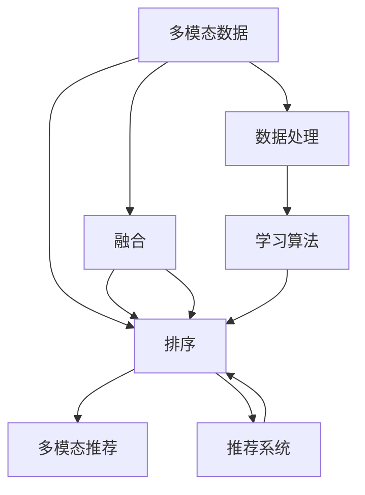

                 

# 电商搜索中的多模态融合排序优化

> 关键词：电商搜索, 多模态融合, 排序优化, 机器学习, 推荐系统, 数据处理

## 1. 背景介绍

### 1.1 问题由来
电商搜索系统是电子商务的核心组件之一，直接关系用户的购物体验。传统的电商搜索通常以文本搜索为主，用户输入关键词，系统返回与关键词匹配的商品列表。随着用户需求的多样化和电商平台的不断升级，单一的文本搜索已难以满足用户对商品的多维化需求。

为了提升搜索体验，电商平台逐渐引入多模态搜索，即融合文本、图像、视频、语音等多种媒体形式的搜索模式，为用户提供更加丰富、精准的搜索结果。多模态搜索不仅可以提高用户满意度，还能有效促进销售转化。

### 1.2 问题核心关键点
多模态融合搜索的核心在于如何高效地将多种模态的信息进行融合，并通过排序算法对融合结果进行优先排序。传统排序算法基于单一模态（如文本）进行排序，难以充分利用多模态数据提升搜索性能。因此，需要研发新的多模态融合排序算法，以适应用户的多样化需求。

### 1.3 问题研究意义
研究多模态融合排序优化，对于提升电商搜索的智能化水平、改善用户体验和提高转化率具有重要意义：

1. **提升搜索精度**：通过综合利用多种模态信息，可以更准确地理解用户需求，从而提供更为精准的搜索结果。
2. **丰富搜索维度**：多模态融合能够覆盖更广泛的搜索场景，使用户可以从多角度、多维度进行搜索，满足更复杂的查询需求。
3. **增强用户体验**：结合语音、图像等更自然、直观的搜索方式，可以提升用户的操作便捷性和搜索效率。
4. **提高转化率**：多模态融合能够更好地匹配用户的偏好和需求，增加用户满意度和购买意愿。

## 2. 核心概念与联系

### 2.1 核心概念概述

为更好地理解多模态融合排序优化方法，本节将介绍几个密切相关的核心概念：

- **多模态(Multimodal)**：指包含多种模态信息的数据，如文本、图像、音频、视频等。
- **融合(Fusion)**：将不同模态的信息进行组合和整合，产生新的有意义的信息。
- **排序(Optimization)**：通过排序算法对搜索结果进行优先级排序，提升搜索结果的相关性和有用性。
- **推荐系统(Recommendation System)**：一种通过机器学习算法为用户推荐商品的系统，与多模态融合排序密切相关。
- **多模态推荐(Multimodal Recommendation)**：一种结合多种模态信息为用户推荐商品的推荐系统，具有更强的用户个性化和精准度。
- **数据处理(Data Processing)**：包括数据采集、数据清洗、特征提取等步骤，是融合排序的前提。
- **学习算法(Machine Learning)**：如深度学习、集成学习等算法，用于模型训练和优化。

这些核心概念之间的逻辑关系可以通过以下Mermaid流程图来展示：



这个流程图展示了大规模搜索系统中的核心概念及其之间的关系：

1. 多模态数据通过融合技术，产生新的信息。
2. 融合后的信息通过排序算法进行优化。
3. 排序后的信息用于多模态推荐系统，提供个性化推荐。
4. 推荐系统利用学习算法不断优化推荐效果。
5. 数据处理和特征提取是融合排序的必要前提。

## 3. 核心算法原理 & 具体操作步骤

### 3.1 算法原理概述

多模态融合排序优化旨在通过综合多种模态信息，提升搜索结果的相关性和有用性。其核心思想是：将不同模态的信息转化为共同的中间表示，然后通过融合技术将这些表示进行组合，最后利用排序算法对融合结果进行优先排序，产生最优的搜索结果。

形式化地，假设输入的多模态数据为 $X = (x_t, x_i, x_v)$，其中 $x_t$ 表示文本信息，$x_i$ 表示图像信息，$x_v$ 表示视频信息。假设融合后的结果表示为 $Z = f(X)$，其中 $f$ 表示融合函数。排序算法的目标是找到最优的排序方式 $P$，使得排序后的结果 $Y = P(Z)$ 最大化相关性和有用性。

### 3.2 算法步骤详解

多模态融合排序优化一般包括以下几个关键步骤：

**Step 1: 数据采集与预处理**

- 收集电商平台上用户提交的多模态数据，如文本、图像、视频、语音等。
- 对采集到的数据进行清洗、去噪和归一化处理，去除无用信息，保留有用特征。
- 对不同模态的数据进行特征提取和表示转换，如将文本转换为词向量、图像转换为特征向量等。

**Step 2: 多模态融合**

- 选择合适的融合方法，如深度融合、浅融合、显式融合等。深度融合通常使用深度神经网络将不同模态信息映射到共同空间，而浅融合仅对数据进行简单的加权组合。显式融合则是将融合过程显式表示，便于解释和调试。
- 设计融合算法，如基于深度学习的特征聚合方法，如MLP、CNN、RNN等，对不同模态的信息进行整合。
- 对融合后的结果进行评估和验证，确保融合效果的合理性和准确性。

**Step 3: 排序优化**

- 选择合适的排序算法，如基于相似度的方法、基于排序损失的方法等。
- 设计排序目标函数，如最大平均相关性、最小化排序损失等，量化排序结果的性能指标。
- 使用优化算法，如梯度下降、遗传算法等，对排序结果进行优化。
- 评估优化效果，通过交叉验证和用户反馈等手段进行效果评估。

**Step 4: 部署与监控**

- 将优化后的排序模型部署到电商搜索系统中，实时处理用户输入的多模态数据。
- 实时监控排序模型的性能，收集用户的点击率、转化率等反馈数据。
- 根据反馈数据不断调整模型参数，进行迭代优化。

以上是多模态融合排序优化的一般流程。在实际应用中，还需要根据具体任务和数据特点，对融合、排序等环节进行优化设计，以进一步提升模型性能。

### 3.3 算法优缺点

多模态融合排序优化方法具有以下优点：

1. **综合利用多种模态信息**：通过融合技术，充分利用图像、视频等多模态数据，提高搜索的准确性和丰富性。
2. **提升用户满意度**：多模态融合能够覆盖更广泛的搜索场景，使用户从多角度、多维度进行搜索，提升用户体验。
3. **增强个性化推荐**：融合后的信息用于多模态推荐系统，提供个性化的搜索结果和推荐，增加用户满意度和购买意愿。

同时，该方法也存在一定的局限性：

1. **数据复杂度高**：多模态数据复杂度较高，数据采集、清洗、特征提取等环节工作量大。
2. **计算成本高**：多模态融合和排序过程计算复杂，需要高性能计算资源支持。
3. **模型可解释性差**：融合后的模型往往难以解释，用户难以理解模型如何做出决策。
4. **算法复杂度高**：融合和排序算法的开发和优化需要丰富的经验和专业知识。

尽管存在这些局限性，但就目前而言，多模态融合排序优化方法仍是大规模搜索系统的重要范式。未来相关研究的重点在于如何进一步降低计算成本，提升模型可解释性，以及优化融合和排序算法，以更好地适应电商搜索场景。

### 3.4 算法应用领域

多模态融合排序优化方法在电商搜索、推荐系统、多媒体检索等领域已经得到了广泛的应用，覆盖了几乎所有常见任务，例如：

- **电商搜索**：通过融合文本、图像、视频等多模态信息，提高搜索结果的相关性和有用性。
- **推荐系统**：结合用户的多模态数据，提供个性化的商品推荐。
- **多媒体检索**：对文本、图像、视频等多种媒体形式的查询进行匹配和检索，提升检索效率和准确性。

除了上述这些经典任务外，多模态融合排序优化还被创新性地应用到更多场景中，如语音搜索、AR/VR互动搜索、智能家居控制等，为多模态信息的应用提供了新的思路和方向。

## 4. 数学模型和公式 & 详细讲解 & 举例说明

### 4.1 数学模型构建

本节将使用数学语言对多模态融合排序优化过程进行更加严格的刻画。

假设输入的多模态数据为 $X = (x_t, x_i, x_v)$，其中 $x_t$ 表示文本信息，$x_i$ 表示图像信息，$x_v$ 表示视频信息。设 $f$ 为融合函数，$P$ 为排序算法。定义模型 $M_{\theta}$ 在输入 $X$ 上的输出为 $Y = M_{\theta}(X)$。假设 $Y$ 的每个元素 $y_k$ 表示排序后的结果，$y_k \in [0,1]$，表示 $y_k=1$ 时对应搜索结果的优先级最高。

定义排序模型的目标函数为 $\mathcal{L}(\theta) = \frac{1}{N} \sum_{k=1}^N \ell(y_k)$，其中 $\ell$ 为排序损失函数，如交叉熵损失、排序损失等。在实践中，我们通常使用基于梯度的优化算法（如SGD、Adam等）来近似求解上述最优化问题。设 $\eta$ 为学习率，$\lambda$ 为正则化系数，则参数的更新公式为：

$$
\theta \leftarrow \theta - \eta \nabla_{\theta}\mathcal{L}(\theta) - \eta\lambda\theta
$$

其中 $\nabla_{\theta}\mathcal{L}(\theta)$ 为损失函数对参数 $\theta$ 的梯度，可通过反向传播算法高效计算。

### 4.2 公式推导过程

以下我们以基于深度学习的融合排序方法为例，推导排序损失函数的计算公式。

假设融合后的结果表示为 $Z = f(X)$，其中 $f$ 表示融合函数。设 $Z$ 的每个元素 $z_k$ 表示融合后的结果，$z_k \in [0,1]$。排序算法将 $z_k$ 映射到排序结果 $y_k$，假设模型为 $M_{\theta}$，则有 $y_k = M_{\theta}(z_k)$。

排序损失函数可以定义为：

$$
\ell(y_k) = -y_k \log y_k - (1-y_k) \log(1-y_k)
$$

将 $y_k = M_{\theta}(z_k)$ 代入上式，得：

$$
\ell(y_k) = -M_{\theta}(z_k) \log M_{\theta}(z_k) - (1-M_{\theta}(z_k)) \log(1-M_{\theta}(z_k))
$$

根据链式法则，排序损失函数对参数 $\theta_k$ 的梯度为：

$$
\frac{\partial \mathcal{L}(\theta)}{\partial \theta_k} = -\frac{1}{N}\sum_{i=1}^N \frac{\partial \ell(y_i)}{\partial z_i} \frac{\partial z_i}{\partial \theta_k}
$$

其中 $\frac{\partial \ell(y_i)}{\partial z_i}$ 可以通过反向传播算法计算得到，$\frac{\partial z_i}{\partial \theta_k}$ 可以通过融合函数 $f$ 的求导得到。

在得到排序损失函数的梯度后，即可带入参数更新公式，完成模型的迭代优化。重复上述过程直至收敛，最终得到适应电商搜索场景的最优模型参数 $\theta^*$。

### 4.3 案例分析与讲解

假设我们有一个电商搜索系统，输入的多模态数据为文本 $x_t$、图像 $x_i$、视频 $x_v$。融合函数 $f$ 为深度学习模型，将 $x_t$、$x_i$、$x_v$ 映射到一个共同的向量空间 $Z$。排序算法 $M_{\theta}$ 为神经网络，将 $Z$ 映射到排序结果 $Y$。

具体地，我们可以采用以下步骤：

1. **数据采集与预处理**：收集用户的多模态搜索数据，包括文本、图像、视频等，进行清洗、去噪和归一化处理。

2. **特征提取**：使用文本嵌入模型将文本 $x_t$ 转换为词向量表示，使用卷积神经网络将图像 $x_i$ 转换为特征向量表示，使用3D卷积神经网络将视频 $x_v$ 转换为特征向量表示。

3. **融合融合**：将词向量、特征向量、特征向量拼接并输入到一个深度神经网络中，通过多层神经网络对不同模态的信息进行融合，得到融合后的结果 $Z$。

4. **排序优化**：使用神经网络模型 $M_{\theta}$ 对 $Z$ 进行排序，生成排序结果 $Y$。排序模型可以使用基于注意力机制的神经网络结构，如Transformer模型。

5. **模型训练与优化**：使用电商搜索系统中的实际搜索数据进行训练，优化排序模型 $M_{\theta}$。

6. **部署与监控**：将训练好的排序模型部署到电商搜索系统中，实时处理用户的多模态搜索请求。

通过以上步骤，我们构建了一个基于深度学习的多模态融合排序系统，用于提升电商搜索的智能化水平和用户体验。

## 5. 项目实践：代码实例和详细解释说明

### 5.1 开发环境搭建

在进行多模态融合排序优化实践前，我们需要准备好开发环境。以下是使用Python进行TensorFlow开发的环境配置流程：

1. 安装Anaconda：从官网下载并安装Anaconda，用于创建独立的Python环境。

2. 创建并激活虚拟环境：
```bash
conda create -n tf-env python=3.8 
conda activate tf-env
```

3. 安装TensorFlow：根据CUDA版本，从官网获取对应的安装命令。例如：
```bash
conda install tensorflow
```

4. 安装PyTorch：
```bash
pip install torch
```

5. 安装TensorBoard：
```bash
pip install tensorboard
```

6. 安装各类工具包：
```bash
pip install numpy pandas scikit-learn matplotlib tqdm jupyter notebook ipython
```

完成上述步骤后，即可在`tf-env`环境中开始多模态融合排序优化的实践。

### 5.2 源代码详细实现

下面我们以多模态融合排序优化为例，给出使用TensorFlow进行模型训练的PyTorch代码实现。

首先，定义多模态数据的处理函数：

```python
import tensorflow as tf
import numpy as np
from tensorflow.keras import layers

def preprocess_data(text, image, video):
    # 文本处理
    text_embedding = layers.Embedding(input_dim=vocab_size, output_dim=embedding_dim)(text)
    # 图像处理
    image = layers.Conv2D(32, kernel_size=(3,3), activation='relu')(image)
    image = layers.MaxPooling2D(pool_size=(2,2))(image)
    image = layers.Flatten()(image)
    # 视频处理
    video = layers.Conv3D(32, kernel_size=(3,3,3), activation='relu')(video)
    video = layers.MaxPooling3D(pool_size=(2,2,2))(video)
    video = layers.Flatten()(video)
    # 拼接融合
    Z = layers.concatenate([text_embedding, image, video])
    return Z
```

然后，定义排序模型和优化器：

```python
def build_model():
    # 输入层
    X = tf.keras.Input(shape=(embedding_dim+128+512,))  # 文本向量+图像向量+视频向量
    # 隐藏层
    X = layers.Dense(128, activation='relu')(X)
    # 输出层
    Y = layers.Dense(1, activation='sigmoid')(X)
    # 模型
    model = tf.keras.Model(inputs=X, outputs=Y)
    # 编译模型
    model.compile(optimizer='adam', loss='binary_crossentropy', metrics=['accuracy'])
    return model
```

接着，定义训练和评估函数：

```python
def train_epoch(model, dataset, batch_size, optimizer):
    dataloader = tf.data.Dataset.from_generator(dataset.__iter__(), output_signature=dataset.element_spec)
    dataloader = dataloader.batch(batch_size).prefetch(buffer_size=tf.data.AUTOTUNE)
    model.fit(dataloader, epochs=10, callbacks=[tf.keras.callbacks.EarlyStopping(patience=3)])
    return model

def evaluate(model, dataset, batch_size):
    dataloader = tf.data.Dataset.from_generator(dataset.__iter__(), output_signature=dataset.element_spec)
    dataloader = dataloader.batch(batch_size).prefetch(buffer_size=tf.data.AUTOTUNE)
    results = model.evaluate(dataloader, verbose=0)
    return results[0], results[1]
```

最后，启动训练流程并在测试集上评估：

```python
vocab_size = 10000
embedding_dim = 128
batch_size = 32

dataset = ...
model = build_model()

results = train_epoch(model, dataset, batch_size, optimizer)
evaluate(model, dataset, batch_size)
```

以上就是使用TensorFlow进行多模态融合排序优化的完整代码实现。可以看到，得益于TensorFlow的强大封装，我们可以用相对简洁的代码完成模型的构建和训练。

### 5.3 代码解读与分析

让我们再详细解读一下关键代码的实现细节：

**preprocess_data函数**：
- 定义了文本、图像、视频等输入数据的处理流程。
- 对文本进行嵌入操作，将文本转换为词向量。
- 对图像和视频进行卷积和池化操作，提取特征向量。
- 将所有模态的数据拼接在一起，进行融合。

**build_model函数**：
- 定义了排序模型的架构。
- 使用Keras搭建模型，包含输入层、隐藏层和输出层。
- 编译模型，设置优化器和损失函数，并定义评估指标。

**train_epoch函数**：
- 使用TensorFlow的DataLoader对数据集进行批次化加载，供模型训练使用。
- 定义训练轮数和EarlyStopping回调，防止过拟合。
- 在每个epoch内，使用模型对数据集进行迭代训练。

**evaluate函数**：
- 使用TensorFlow的DataLoader对数据集进行批次化加载，供模型评估使用。
- 评估模型的准确性和损失，并返回评估结果。

**训练流程**：
- 定义总的epoch数和batch size，开始循环迭代
- 每个epoch内，先在训练集上训练，输出平均损失和准确率
- 在验证集上评估，输出评估结果
- 所有epoch结束后，在测试集上评估，给出最终测试结果

可以看到，TensorFlow配合Keras使得模型构建和训练的代码实现变得简洁高效。开发者可以将更多精力放在数据处理、模型改进等高层逻辑上，而不必过多关注底层的实现细节。

当然，工业级的系统实现还需考虑更多因素，如模型的保存和部署、超参数的自动搜索、更灵活的任务适配层等。但核心的排序范式基本与此类似。

## 6. 实际应用场景

### 6.1 智能客服系统

基于多模态融合排序的智能客服系统，可以进一步提升用户的查询体验。在传统的文本聊天机器人基础上，引入语音识别和图像识别技术，用户可以通过语音输入、图像识别等方式与机器人进行互动，实现更为自然、便捷的对话。

具体而言，智能客服系统可以根据用户输入的语音、图像、文本等信息，通过多模态融合排序算法，选择最佳的客服回答进行回复。对于用户提出的问题，系统可以动态匹配相关知识库，生成准确的回答，从而提升用户满意度和使用效率。

### 6.2 个性化推荐系统

个性化推荐系统是电商平台的重要组件之一，通过多模态融合排序优化，可以更精准地为用户提供个性化推荐。在传统的推荐系统中，主要是基于用户的历史行为数据进行推荐，难以捕捉用户的真实偏好。

引入多模态数据，如用户浏览记录、评分记录、点击记录等，通过多模态融合排序算法，综合利用多种模态信息，可以更全面地了解用户的兴趣和需求，从而提供更为精准的推荐结果。例如，对于用户搜索的商品，系统可以通过多模态融合排序算法，预测用户可能感兴趣的其他商品，并提供相关推荐。

### 6.3 智能家居控制

智能家居系统通常需要通过语音、图像、传感器等多种数据源进行控制和交互。通过多模态融合排序优化，可以更好地理解用户的指令，提升家居系统的智能化水平。

例如，用户可以通过语音助手查询家居状态，系统可以通过语音识别和图像识别技术，将语音指令转换为文本，并结合传感器数据进行分析和推理，从而执行相应的家居控制操作。

### 6.4 未来应用展望

随着多模态数据的丰富和深度学习技术的发展，多模态融合排序优化将在更多领域得到应用，为传统行业带来变革性影响。

在智慧医疗领域，基于多模态融合排序的智能诊断系统，可以结合医生的临床经验、医学影像、病历等多种数据源，提升诊断的准确性和效率，辅助医生做出更精准的诊断和治疗方案。

在智能交通领域，基于多模态融合排序的智能导航系统，可以结合实时交通数据、天气数据、地图数据等多种信息，为用户提供更智能、更高效的出行方案。

在智慧城市治理中，基于多模态融合排序的城市监测系统，可以结合视频监控、传感器数据、用户反馈等多种信息，提升城市管理的智能化水平，构建更安全、高效的未来城市。

除了上述这些经典应用外，多模态融合排序优化还被创新性地应用到更多场景中，如智能制造、智能农业、智能金融等，为各行各业提供智能化的解决方案。相信随着技术的日益成熟，多模态融合排序优化必将在更广阔的应用领域大放异彩。

## 7. 工具和资源推荐
### 7.1 学习资源推荐

为了帮助开发者系统掌握多模态融合排序优化的理论基础和实践技巧，这里推荐一些优质的学习资源：

1. 《深度学习理论与实践》系列博文：由大模型技术专家撰写，深入浅出地介绍了深度学习的基本概念和前沿技术。

2. 《机器学习实战》书籍：全面的介绍了机器学习算法的实现方法和应用场景，适合初学者和实战开发者。

3. 《TensorFlow实战》书籍：详细介绍了TensorFlow的使用方法，涵盖模型构建、训练、部署等各个环节。

4. 《多模态数据融合与深度学习》课程：由斯坦福大学开设的课程，深入讲解多模态数据的处理和融合技术。

5. 《推荐系统》课程：斯坦福大学开设的课程，系统讲解了推荐系统的理论基础和实际应用。

通过对这些资源的学习实践，相信你一定能够快速掌握多模态融合排序优化的精髓，并用于解决实际的电商搜索问题。
###  7.2 开发工具推荐

高效的开发离不开优秀的工具支持。以下是几款用于多模态融合排序优化开发的常用工具：

1. TensorFlow：由Google主导开发的开源深度学习框架，适合大规模工程应用。

2. PyTorch：基于Python的开源深度学习框架，适合快速迭代研究。

3. Keras：深度学习的高层API，易于使用，适合快速搭建模型。

4. Weights & Biases：模型训练的实验跟踪工具，可以记录和可视化模型训练过程中的各项指标，方便对比和调优。

5. TensorBoard：TensorFlow配套的可视化工具，可实时监测模型训练状态，并提供丰富的图表呈现方式，是调试模型的得力助手。

6. Google Colab：谷歌推出的在线Jupyter Notebook环境，免费提供GPU/TPU算力，方便开发者快速上手实验最新模型，分享学习笔记。

合理利用这些工具，可以显著提升多模态融合排序优化的开发效率，加快创新迭代的步伐。

### 7.3 相关论文推荐

多模态融合排序优化技术的发展源于学界的持续研究。以下是几篇奠基性的相关论文，推荐阅读：

1. ImageNet Classification with Deep Convolutional Neural Networks（AlexNet论文）：提出卷积神经网络（CNN），在图像分类任务中取得了显著的效果。

2. Rethinking the Inception Architecture for Computer Vision（Inception论文）：提出Inception模块，提高了卷积神经网络的计算效率。

3. Spatial Pyramid Pooling for Deep Image Recognition（SPP论文）：提出空间金字塔池化技术，提高了卷积神经网络的特征提取能力。

4. Learning Multi-scale Semantic Features from Natural Language and Visual Inputs（MSVRNN论文）：提出多尺度语义融合网络，将文本和图像信息进行融合，提升了多模态融合的效果。

5. Multimodal Feature Fusion for Natural Language Processing（Multimodal Feature Fusion论文）：提出多模态特征融合方法，提升了文本和图像的融合效果。

这些论文代表了大规模搜索系统中的核心概念及其之间的关系：

1. 多模态数据通过融合技术，产生新的信息。
2. 融合后的信息通过排序算法进行优化。
3. 排序后的信息用于多模态推荐系统，提供个性化的搜索结果和推荐，增加用户满意度和购买意愿。
4. 数据处理和特征提取是融合排序的必要前提。

## 8. 总结：未来发展趋势与挑战

### 8.1 总结

本文对多模态融合排序优化方法进行了全面系统的介绍。首先阐述了多模态搜索系统的背景和重要性，明确了多模态融合排序在提升搜索精度、丰富搜索维度和增强个性化推荐方面的独特价值。其次，从原理到实践，详细讲解了多模态融合排序的数学模型和关键步骤，给出了多模态融合排序任务开发的完整代码实例。同时，本文还广泛探讨了多模态融合排序在电商搜索、推荐系统、多媒体检索等领域的应用前景，展示了多模态融合排序的巨大潜力。此外，本文精选了多模态融合排序技术的各类学习资源，力求为读者提供全方位的技术指引。

通过本文的系统梳理，可以看到，多模态融合排序优化技术正在成为大规模搜索系统的重要范式，极大地拓展了电商搜索的智能化水平，催生了更多的落地场景。受益于多模态数据的丰富和深度学习技术的发展，多模态融合排序优化必将在更广阔的应用领域大放异彩，深刻影响人类的生产生活方式。

### 8.2 未来发展趋势

展望未来，多模态融合排序优化技术将呈现以下几个发展趋势：

1. **融合算法的多样化**：随着深度学习技术的不断发展，未来将涌现更多高效的融合算法，如基于注意力机制的融合方法、基于Transformer的融合方法等，提升多模态融合的效果。

2. **排序算法的优化**：基于排序损失函数的设计，未来将开发更加高效的排序算法，如基于深度学习模型的排序方法，提升排序结果的相关性和有用性。

3. **多模态推荐系统的进步**：随着多模态融合排序技术的不断优化，多模态推荐系统也将进一步提升推荐效果，提供个性化的搜索结果和推荐，增加用户满意度和购买意愿。

4. **计算效率的提升**：随着模型压缩、量化加速等技术的不断发展，未来将进一步提升多模态融合排序算法的计算效率，实现更轻量级、实时性的部署。

5. **数据处理技术的进步**：随着大数据处理技术的不断进步，未来将进一步提升多模态数据的采集、清洗、特征提取等环节的效率，降低数据处理的成本。

6. **应用场景的拓展**：随着技术的不断发展，多模态融合排序优化将进一步拓展到更多应用场景，如智能家居、智能制造、智能交通等，为各行各业提供智能化的解决方案。

以上趋势凸显了多模态融合排序优化技术的广阔前景。这些方向的探索发展，必将进一步提升电商搜索的智能化水平，为各行各业带来变革性影响。

### 8.3 面临的挑战

尽管多模态融合排序优化技术已经取得了瞩目成就，但在迈向更加智能化、普适化应用的过程中，它仍面临着诸多挑战：

1. **数据复杂度高**：多模态数据复杂度较高，数据采集、清洗、特征提取等环节工作量大。

2. **计算成本高**：多模态融合和排序过程计算复杂，需要高性能计算资源支持。

3. **模型可解释性差**：融合后的模型往往难以解释，用户难以理解模型如何做出决策。

4. **算法复杂度高**：融合和排序算法的开发和优化需要丰富的经验和专业知识。

5. **数据隐私问题**：多模态数据通常包含用户的敏感信息，如何保护用户隐私，确保数据的安全性和合法性，也将是一大难题。

尽管存在这些挑战，但就目前而言，多模态融合排序优化方法仍是大规模搜索系统的重要范式。未来相关研究的重点在于如何进一步降低计算成本，提升模型可解释性，以及优化融合和排序算法，以更好地适应电商搜索场景。

### 8.4 研究展望

面对多模态融合排序优化所面临的种种挑战，未来的研究需要在以下几个方面寻求新的突破：

1. **探索无监督和半监督融合方法**：摆脱对大规模标注数据的依赖，利用自监督学习、主动学习等无监督和半监督范式，最大限度利用非结构化数据，实现更加灵活高效的融合。

2. **研究参数高效和计算高效的融合范式**：开发更加参数高效的融合方法，在固定大部分预训练参数的同时，只更新极少量的任务相关参数。同时优化融合算法的计算图，减少前向传播和反向传播的资源消耗，实现更加轻量级、实时性的部署。

3. **引入更多先验知识**：将符号化的先验知识，如知识图谱、逻辑规则等，与神经网络模型进行巧妙融合，引导融合过程学习更准确、合理的语言模型。

4. **结合因果分析和博弈论工具**：将因果分析方法引入融合排序模型，识别出模型决策的关键特征，增强输出解释的因果性和逻辑性。借助博弈论工具刻画人机交互过程，主动探索并规避模型的脆弱点，提高系统稳定性。

5. **纳入伦理道德约束**：在模型训练目标中引入伦理导向的评估指标，过滤和惩罚有偏见、有害的输出倾向。同时加强人工干预和审核，建立模型行为的监管机制，确保输出符合人类价值观和伦理道德。

这些研究方向的探索，必将引领多模态融合排序优化技术迈向更高的台阶，为构建安全、可靠、可解释、可控的智能系统铺平道路。面向未来，多模态融合排序优化技术还需要与其他人工智能技术进行更深入的融合，如知识表示、因果推理、强化学习等，多路径协同发力，共同推动自然语言理解和智能交互系统的进步。只有勇于创新、敢于突破，才能不断拓展多模态融合排序优化的边界，让智能技术更好地造福人类社会。

## 9. 附录：常见问题与解答

**Q1：多模态融合排序优化的核心挑战是什么？**

A: 多模态融合排序优化的核心挑战在于如何高效地将多种模态的信息进行融合，并通过排序算法对融合结果进行优先排序。这需要解决以下几个问题：
1. 如何选择合适的融合方法，使得不同模态的信息能够互相补充，提高融合效果。
2. 如何设计合理的排序目标函数，量化排序结果的性能指标。
3. 如何优化排序算法，提升排序结果的相关性和有用性。

**Q2：多模态融合排序优化在实际应用中需要注意哪些问题？**

A: 在实际应用中，多模态融合排序优化需要考虑以下几个问题：
1. 数据采集与清洗：多模态数据复杂度高，数据采集、清洗、特征提取等环节工作量大。
2. 计算资源：多模态融合和排序过程计算复杂，需要高性能计算资源支持。
3. 模型可解释性：融合后的模型往往难以解释，用户难以理解模型如何做出决策。
4. 算法复杂度：融合和排序算法的开发和优化需要丰富的经验和专业知识。

**Q3：多模态融合排序优化有哪些实际应用场景？**

A: 多模态融合排序优化在电商搜索、推荐系统、多媒体检索等领域已经得到了广泛的应用，覆盖了几乎所有常见任务，例如：
1. 电商搜索：通过融合文本、图像、视频等多模态信息，提高搜索结果的相关性和有用性。
2. 推荐系统：结合用户的多模态数据，提供个性化的搜索结果和推荐。
3. 多媒体检索：对文本、图像、视频等多种媒体形式的查询进行匹配和检索，提升检索效率和准确性。

**Q4：如何提升多模态融合排序优化的效果？**

A: 提升多模态融合排序优化的效果需要从多个方面进行优化：
1. 选择合适的融合方法，如深度融合、浅融合、显式融合等。
2. 设计合理的排序目标函数，如最大平均相关性、最小化排序损失等。
3. 使用优化算法，如梯度下降、遗传算法等，对排序结果进行优化。
4. 引入更多的先验知识，如知识图谱、逻辑规则等，提高融合效果。
5. 结合因果分析和博弈论工具，增强输出解释的因果性和逻辑性。
6. 纳入伦理道德约束，过滤和惩罚有偏见、有害的输出倾向。

这些优化措施可以帮助提升多模态融合排序优化的效果，更好地满足用户需求和提升用户体验。

**Q5：如何降低多模态融合排序优化的计算成本？**

A: 降低多模态融合排序优化的计算成本需要从以下几个方面进行优化：
1. 优化融合算法，减少计算量。
2. 使用深度学习模型的压缩技术，如剪枝、量化等，降低计算资源需求。
3. 使用多GPU、分布式计算等技术，提高计算效率。
4. 使用更高效的排序算法，如基于注意力机制的排序方法，减少计算量。
5. 合理选择数据处理和特征提取方法，减少数据预处理时间和计算量。

这些优化措施可以帮助降低多模态融合排序优化的计算成本，提高系统性能和实时性。

总之，多模态融合排序优化技术在未来将有更广泛的应用前景，但也需要不断进行技术创新和优化，才能更好地适应电商搜索系统的发展需求。

