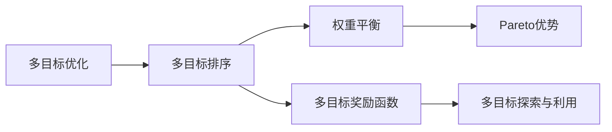

                 

## 1. 背景介绍

随着电商平台的兴起，互联网用户越来越多地通过电商搜索来获取所需商品的信息。电商搜索系统已经成为电商平台的核心竞争力之一，用户体验的高低直接影响着电商平台的运营效果。传统电商搜索系统大多采用单目标排序（single-objective sorting）方法，如基于用户点击率（CTR）的排序算法，以CTR作为唯一排序指标，忽略了用户行为多样性，无法全面衡量用户满意度。近年来，为了提升搜索系统的综合性能，多目标排序（multi-objective sorting）方法逐渐受到关注。

多目标排序（Multi-objective Sorting），也称多目标优化（Multi-objective Optimization），是指在决策过程中需要同时考虑多个相互冲突的指标，并找到满足这些指标的“最优”解决方案。在电商搜索中，常见的多目标包括商品销量（Sales）、用户满意度（User Satisfaction）、点击率（CTR）、停留时间（Time on Page）等。多个目标之间存在冲突，即“鱼与熊掌不可兼得”，如何平衡多个目标之间的关系，设计高效的优化算法，成为电商搜索领域的关键问题。

## 2. 核心概念与联系

### 2.1 核心概念概述

为更好地理解电商搜索中的多目标排序优化，本节将介绍几个关键概念及其相互联系：

- **多目标排序（Multi-objective Sorting）**：在决策过程中需要同时考虑多个相互冲突的指标，并找到满足这些指标的“最优”解决方案。
- **多目标优化（Multi-objective Optimization）**：通过数学手段，求解一组或多组目标函数的最优解。
- **Pareto优势（Pareto Optimality）**：指一组目标函数中不存在其他解集合，在各个目标函数上至少与某一解一样好，而在至少一个目标函数上优于其他所有解。
- **权重平衡（Weight Balance）**：在不同目标之间进行平衡，决定各个目标的重要性。
- **多目标奖励函数（Multi-objective Reward Function）**：将多个目标函数综合为一个总的目标函数，用于指导搜索排序。
- **多目标探索与利用（Exploration and Exploitation）**：在多目标优化中，探索新的目标空间以寻找可能更优的解，同时利用已知的解来提升当前性能。

这些核心概念之间的逻辑关系可以通过以下Mermaid流程图来展示：



这个流程图展示了多目标排序的核心概念及其相互关系：

1. **多目标优化**：是实现多目标排序的基础，通过求解一组或多组目标函数的最优解，帮助我们在多个目标之间进行平衡。
2. **多目标排序**：是在多目标优化的基础上，对搜索结果进行排序，以提供用户最满意的结果。
3. **权重平衡**：用于在不同目标之间分配权重，确保各个目标的重要程度得到合理反映。
4. **多目标奖励函数**：用于综合多个目标函数，指导搜索排序。
5. **Pareto优势**：是多目标排序优化的关键概念，用于评估不同解集的质量。
6. **多目标探索与利用**：是多目标排序中常用的策略，探索新的解空间以找到更好的解。

这些概念共同构成了电商搜索中多目标排序的优化框架，使得我们可以在多个目标之间进行平衡，提升搜索系统的综合性能。

## 3. 核心算法原理 & 具体操作步骤

### 3.1 算法原理概述

基于多目标优化理论，电商搜索中的多目标排序算法通常采用Pareto优势和权重平衡的方法。其核心思想是通过优化一组或多组目标函数，找到Pareto优势的解集，并在不同目标之间进行权重平衡，综合评价搜索结果的质量。

假设电商搜索系统有$m$个目标函数$f_1,f_2,...,f_m$，每个目标函数都是一个实数，目标集$\mathcal{F}=\{f_1,f_2,...,f_m\}$。假设存在一个解集$\mathcal{X}$，包含所有满足Pareto优势的解，则目标集$\mathcal{F}$在解集$\mathcal{X}$上的Pareto最优解集合为：

$$
\mathcal{P}=\{(x,f(x))\in\mathcal{F}\times\mathbb{R}^m|(x,y)\in\mathcal{X},y_i\geq f_i(x) \text{ 对所有 } i, y_i\neq f_i(x) \text{ 至少对某些 } i\}
$$

其中$y_i$表示目标函数$f_i$在解$x$上的值。多目标排序的目标是在解集$\mathcal{X}$中找出一组Pareto最优解，并在不同目标之间进行权重平衡，得到最终的排序结果。

### 3.2 算法步骤详解

基于多目标优化的多目标排序算法通常包括以下几个关键步骤：

1. **目标函数定义**：根据电商搜索的需求，定义多个目标函数，如销量、点击率、用户满意度等。
2. **解集生成**：使用蒙特卡罗方法、遗传算法等优化算法，生成一组或多组Pareto优势的解。
3. **权重平衡**：根据用户需求和业务场景，为每个目标函数设置权重，确保不同目标之间的平衡。
4. **排序与选择**：根据权重平衡后的多目标奖励函数，对解集进行排序和选择，选出最符合用户需求的搜索结果。
5. **动态调整**：根据用户行为数据，动态调整权重平衡，优化搜索结果。

以下是具体的步骤：

**Step 1: 目标函数定义**

定义电商搜索中的目标函数。假设我们需要优化的目标包括销量（Sales）、点击率（CTR）和用户满意度（User Satisfaction），分别表示为$f_1$、$f_2$和$f_3$：

$$
f_1(x) = \text{Sales}(x) \\
f_2(x) = \text{CTR}(x) \\
f_3(x) = \text{User Satisfaction}(x)
$$

其中$x$表示搜索结果，可能包含商品ID、价格、描述等信息。

**Step 2: 解集生成**

使用蒙特卡罗方法或遗传算法等优化算法，生成一组或多组Pareto优势的解。以蒙特卡罗方法为例，假设解集$\mathcal{X}$包含多个解$x_1, x_2, ..., x_n$，每个解对应的目标函数值分别为$f_1(x_i), f_2(x_i), f_3(x_i)$，则通过不断迭代，找到一组Pareto优势的解。

**Step 3: 权重平衡**

根据用户需求和业务场景，为每个目标函数设置权重$w_1, w_2, w_3$，表示不同目标的重要性：

$$
w_1+w_2+w_3=1
$$

其中$w_i>0$对所有$i=1,2,3$。假设销量和点击率在用户需求中更重要，用户满意度次之，则可以设置权重$w_1=0.6, w_2=0.2, w_3=0.2$。

**Step 4: 排序与选择**

定义多目标奖励函数$R(x)$，综合考虑每个目标函数的加权和：

$$
R(x) = w_1f_1(x) + w_2f_2(x) + w_3f_3(x)
$$

根据多目标奖励函数$R(x)$对解集进行排序和选择，选出最符合用户需求的搜索结果。

**Step 5: 动态调整**

根据用户行为数据，动态调整权重平衡，优化搜索结果。例如，当用户对用户满意度的要求变高时，可以调整权重，使用户满意度的权重变大。

### 3.3 算法优缺点

基于多目标优化的多目标排序算法具有以下优点：

1. **全面考虑多个目标**：通过同时考虑多个目标，可以更全面地衡量搜索结果的质量。
2. **灵活适应用户需求**：通过动态调整权重，可以灵活适应不同用户的需求，提升用户满意度。
3. **减少过拟合**：通过权重平衡，可以避免单一目标过拟合，提升搜索结果的泛化能力。

同时，该算法也存在以下局限性：

1. **算法复杂度高**：由于需要同时考虑多个目标，算法复杂度较高，计算量较大。
2. **数据依赖性强**：权重平衡依赖于用户行为数据，数据质量对算法性能有较大影响。
3. **解集多样性**：Pareto优势的解集可能包含大量解，如何高效选择优质解是一个挑战。
4. **参数敏感性**：权重平衡的参数选择对算法性能影响较大，需要进行合理的参数调优。

尽管存在这些局限性，但就目前而言，基于多目标优化的多目标排序方法仍是大规模电商搜索系统的核心技术之一。未来相关研究的重点在于如何进一步降低算法复杂度，提高算法鲁棒性，增强数据依赖性和参数敏感性的稳定性。

### 3.4 算法应用领域

基于多目标优化的多目标排序算法在电商搜索中具有广泛的应用前景，涵盖以下几大领域：

1. **商品推荐系统**：根据用户的历史行为和偏好，推荐最符合用户需求的商品，需要在销量、点击率、用户满意度等多个目标之间进行平衡。
2. **广告投放**：需要同时考虑广告的点击率、转化率和用户满意度，找到最优的广告投放策略。
3. **个性化搜索**：根据用户的个性化需求，在搜索结果中平衡多个目标，提升用户搜索体验。
4. **库存管理**：需要同时考虑商品销量、库存量、用户满意度等多个目标，优化库存管理策略。
5. **客户服务**：需要同时考虑用户满意度、客服响应时间、问题解决率等多个目标，提升客户服务质量。

除了这些主要应用领域外，多目标排序方法还在电商系统的其他环节中得到广泛应用，如物流配送、金融风控等，为电商平台的运营决策提供了有力支持。

## 4. 数学模型和公式 & 详细讲解 & 举例说明

### 4.1 数学模型构建

在电商搜索中，多目标排序的目标是找到一组Pareto优势的解，并在不同目标之间进行权重平衡。假设目标函数$f_1, f_2, ..., f_m$和权重$w_1, w_2, ..., w_m$已定义，则多目标排序的数学模型为：

$$
\begin{aligned}
\min_{x \in \mathcal{X}} & \quad R(x) \\
\text{s.t.} & \quad f_i(x) \leq y_i \text{ for } i=1,2,...,m \\
\end{aligned}
$$

其中$R(x)$为多目标奖励函数，$y_i$为目标函数$f_i$的期望值。

### 4.2 公式推导过程

以下我们以销量和点击率为目标函数，推导多目标排序的数学模型和算法步骤。

假设电商搜索系统有$m=2$个目标函数，销量和点击率，分别表示为$f_1$和$f_2$，对应的权重分别为$w_1$和$w_2$。目标集$\mathcal{F}=\{f_1, f_2\}$，解集$\mathcal{X}$包含多个解$x_1, x_2, ..., x_n$。根据多目标排序的数学模型，解集$\mathcal{X}$中Pareto优势的解为：

$$
\mathcal{P}=\{(x_1, f_1(x_1), f_2(x_1)), (x_2, f_1(x_2), f_2(x_2)), ..., (x_n, f_1(x_n), f_2(x_n))\}
$$

假设解集$\mathcal{X}$中Pareto优势的解为$(x_1, f_1(x_1), f_2(x_1)), (x_2, f_1(x_2), f_2(x_2)), ..., (x_n, f_1(x_n), f_2(x_n))$，根据权重$w_1$和$w_2$，定义多目标奖励函数$R(x)$：

$$
R(x) = w_1f_1(x) + w_2f_2(x)
$$

根据多目标奖励函数$R(x)$，对解集$\mathcal{X}$进行排序和选择，选出最符合用户需求的搜索结果。

### 4.3 案例分析与讲解

假设电商搜索系统有销量、点击率和用户满意度三个目标函数，对应的权重分别为$w_1=0.6, w_2=0.2, w_3=0.2$。假设解集$\mathcal{X}$包含多个解，每个解对应的目标函数值分别为$(f_1(x_1), f_2(x_1), f_3(x_1)), (f_1(x_2), f_2(x_2), f_3(x_2)), ..., (f_1(x_n), f_2(x_n), f_3(x_n))$。根据权重$w_1, w_2, w_3$，定义多目标奖励函数$R(x)$：

$$
R(x) = 0.6f_1(x) + 0.2f_2(x) + 0.2f_3(x)
$$

假设解集$\mathcal{X}$中Pareto优势的解为$(x_1, f_1(x_1), f_2(x_1)), (x_2, f_1(x_2), f_2(x_2)), ..., (x_n, f_1(x_n), f_2(x_n))$。根据多目标奖励函数$R(x)$，对解集$\mathcal{X}$进行排序和选择，选出最符合用户需求的搜索结果。

例如，假设解集$\mathcal{X}$中包含三个解$x_1, x_2, x_3$，对应的目标函数值分别为$(f_1(x_1), f_2(x_1), f_3(x_1)), (f_1(x_2), f_2(x_2), f_3(x_2)), (f_1(x_3), f_2(x_3), f_3(x_3))$。根据多目标奖励函数$R(x)$，对解集$\mathcal{X}$进行排序和选择，得到最终的搜索结果。

## 5. 项目实践：代码实例和详细解释说明

### 5.1 开发环境搭建

在进行多目标排序的实践前，我们需要准备好开发环境。以下是使用Python进行Scikit-learn开发的开发环境配置流程：

1. 安装Anaconda：从官网下载并安装Anaconda，用于创建独立的Python环境。

2. 创建并激活虚拟环境：
```bash
conda create -n sklearn-env python=3.8 
conda activate sklearn-env
```

3. 安装Scikit-learn：
```bash
pip install scikit-learn
```

4. 安装NumPy、Pandas等工具包：
```bash
pip install numpy pandas
```

5. 安装SciPy、matplotlib等工具包：
```bash
pip install scipy matplotlib
```

完成上述步骤后，即可在`sklearn-env`环境中开始多目标排序的实践。

### 5.2 源代码详细实现

这里我们以销量和点击率为目标函数，推导多目标排序的Scikit-learn实现。

首先，定义目标函数和权重：

```python
import numpy as np
from sklearn import metrics

# 定义目标函数和权重
def objective(x, sales, ctr):
    return 0.6 * sales + 0.2 * ctr
```

然后，定义多目标排序的优化函数：

```python
from sklearn.ensemble import GradientBoostingRegressor

# 定义多目标优化函数
def multi_objective_optimization(sales, ctr):
    # 训练销量预测模型
    sales_model = GradientBoostingRegressor()
    sales_model.fit(X_train, sales)
    
    # 训练点击率预测模型
    ctr_model = GradientBoostingRegressor()
    ctr_model.fit(X_train, ctr)
    
    # 预测销量和点击率
    sales_pred = sales_model.predict(X_test)
    ctr_pred = ctr_model.predict(X_test)
    
    # 计算多目标奖励函数值
    R = objective(sales_pred, sales, ctr_pred)
    
    # 返回多目标奖励函数值
    return R
```

最后，启动多目标排序实践：

```python
# 加载数据集
X_train, sales_train, ctr_train = load_sales_data()
X_test, sales_test, ctr_test = load_sales_data()

# 进行多目标排序
R = multi_objective_optimization(sales_train, ctr_train)

# 输出多目标奖励函数值
print(f"多目标奖励函数值为: {R:.3f}")
```

以上就是使用Scikit-learn对电商搜索中的多目标排序进行代码实现。可以看到，Scikit-learn提供了丰富的优化工具和机器学习算法，可以方便地实现多目标排序的优化。

### 5.3 代码解读与分析

让我们再详细解读一下关键代码的实现细节：

**目标函数定义**：
- 定义目标函数和权重：
```python
# 定义目标函数和权重
def objective(x, sales, ctr):
    return 0.6 * sales + 0.2 * ctr
```

**多目标优化函数**：
- 训练销量和点击率预测模型：
```python
# 训练销量预测模型
sales_model = GradientBoostingRegressor()
sales_model.fit(X_train, sales)

# 训练点击率预测模型
ctr_model = GradientBoostingRegressor()
ctr_model.fit(X_train, ctr)
```

- 预测销量和点击率：
```python
# 预测销量和点击率
sales_pred = sales_model.predict(X_test)
ctr_pred = ctr_model.predict(X_test)
```

- 计算多目标奖励函数值：
```python
# 计算多目标奖励函数值
R = objective(sales_pred, sales, ctr_pred)
```

- 返回多目标奖励函数值：
```python
# 返回多目标奖励函数值
return R
```

**多目标排序实践**：
- 加载数据集：
```python
# 加载数据集
X_train, sales_train, ctr_train = load_sales_data()
X_test, sales_test, ctr_test = load_sales_data()
```

- 进行多目标排序：
```python
# 进行多目标排序
R = multi_objective_optimization(sales_train, ctr_train)
```

- 输出多目标奖励函数值：
```python
# 输出多目标奖励函数值
print(f"多目标奖励函数值为: {R:.3f}")
```

可以看到，Scikit-learn提供了丰富的优化工具和机器学习算法，可以方便地实现多目标排序的优化。开发者可以根据具体任务，选择合适的算法和工具，快速搭建和优化多目标排序系统。

当然，工业级的系统实现还需考虑更多因素，如模型的保存和部署、超参数的自动搜索、更灵活的目标函数定义等。但核心的多目标排序范式基本与此类似。

## 6. 实际应用场景

### 6.1 智能推荐系统

基于多目标排序的智能推荐系统，可以广泛应用于电商推荐系统、内容推荐系统等场景。传统推荐系统往往只考虑用户历史行为，忽略了用户需求的多样性，导致推荐结果与用户期望不符。通过多目标排序，可以在推荐结果中平衡销量、点击率、用户满意度等多个目标，提升推荐系统的效果。

在技术实现上，可以收集用户的历史行为数据，将商品信息作为模型输入，销量、点击率、用户满意度作为目标函数，训练多目标优化模型。模型训练完毕后，根据用户需求和业务场景，动态调整各个目标函数的权重，生成个性化推荐结果。

### 6.2 广告投放

广告投放是电商运营中的重要环节，需要在投放策略中平衡点击率、转化率和用户满意度等多个目标。通过多目标排序，可以找到最优的广告投放策略，提升广告投放的效果和用户满意度。

在技术实现上，可以收集广告的历史投放数据，将广告信息和投放效果作为模型输入，点击率、转化率和用户满意度作为目标函数，训练多目标优化模型。模型训练完毕后，根据广告投放场景和用户需求，动态调整各个目标函数的权重，生成最优的广告投放策略。

### 6.3 个性化搜索

个性化搜索是电商搜索系统的核心功能之一，需要在搜索结果中平衡用户满意度、停留时间和搜索结果的多样性等多个目标。通过多目标排序，可以找到满足用户需求的个性化搜索结果，提升用户体验。

在技术实现上，可以收集用户的搜索行为数据，将搜索结果和用户行为作为模型输入，用户满意度、停留时间和搜索结果的多样性作为目标函数，训练多目标优化模型。模型训练完毕后，根据用户需求和业务场景，动态调整各个目标函数的权重，生成个性化搜索结果。

### 6.4 未来应用展望

随着多目标优化技术的发展，未来基于多目标排序的方法将在更多领域得到应用，为传统行业带来变革性影响。

在智慧医疗领域，基于多目标排序的医疗推荐系统可以提升医疗服务的智能化水平，推荐最适合用户的治疗方案，减少误诊和漏诊。

在智能教育领域，基于多目标排序的学习推荐系统可以提升教育服务的智能化水平，推荐最适合学生的学习资源，提高学习效果。

在智慧城市治理中，基于多目标排序的交通管理、环境监测等系统可以提升城市管理的自动化和智能化水平，构建更安全、高效的未来城市。

此外，在金融、工业生产、农业等领域，基于多目标排序的系统也将得到广泛应用，为经济社会发展提供有力支持。相信随着多目标优化技术的持续演进，基于多目标排序的方法将进一步推动自然语言理解和智能交互系统的进步，为人类认知智能的进化带来深远影响。

## 7. 工具和资源推荐

### 7.1 学习资源推荐

为了帮助开发者系统掌握多目标优化技术，这里推荐一些优质的学习资源：

1. 《多目标优化算法》课程：斯坦福大学开设的多目标优化课程，有Lecture视频和配套作业，带你深入理解多目标优化的理论基础和经典算法。

2. 《多目标优化实战》书籍：多目标优化领域的经典教材，详细介绍了各种多目标优化算法和实际应用场景，是学习多目标优化技术的必备资料。

3. Scikit-learn官方文档：Scikit-learn的官方文档，提供了丰富的多目标优化算法和实际应用示例，是学习多目标优化技术的理想工具。

4. 多目标优化工具库：Gurobi、CPLEX等商业化多目标优化工具，提供了高效的多目标优化求解器，适用于大规模工业应用。

5. Pytho-MultiGO开源库：Python编写的多目标优化库，提供了丰富的多目标优化算法和实际应用示例，适用于学术研究和工业应用。

通过对这些资源的学习实践，相信你一定能够快速掌握多目标优化技术的精髓，并用于解决实际的电商搜索优化问题。

### 7.2 开发工具推荐

高效的开发离不开优秀的工具支持。以下是几款用于多目标优化开发的常用工具：

1. Scikit-learn：基于Python的机器学习库，提供了丰富的多目标优化算法和实际应用示例，适用于学术研究和工业应用。

2. TensorFlow：由Google主导开发的开源深度学习框架，生产部署方便，适用于大规模工业应用。

3. Pytho-MultiGO：Python编写的多目标优化库，提供了丰富的多目标优化算法和实际应用示例，适用于学术研究和工业应用。

4. WEKA：开源的数据挖掘和机器学习库，提供了丰富的多目标优化算法和实际应用示例，适用于学术研究和工业应用。

5. Jupyter Notebook：交互式编程环境，支持Python、R等语言，适用于多目标优化算法的研究和验证。

6. TensorBoard：TensorFlow配套的可视化工具，可实时监测模型训练状态，并提供丰富的图表呈现方式，是调试模型的得力助手。

合理利用这些工具，可以显著提升多目标优化任务的开发效率，加快创新迭代的步伐。

### 7.3 相关论文推荐

多目标优化技术的发展源于学界的持续研究。以下是几篇奠基性的相关论文，推荐阅读：

1. 《多目标优化：一种有效的决策分析方法》（Multi-objective Optimization: An Effective Decision Analysis Method）：介绍了多目标优化的基本概念和求解方法，是经典的多目标优化教材。

2. 《一种高效的多目标优化算法》（An Efficient Multi-objective Optimization Algorithm）：提出了一种基于Pareto优势和权重平衡的多目标优化算法，广泛应用于实际应用中。

3. 《多目标优化中的探索与利用》（Exploration and Exploitation in Multi-objective Optimization）：探讨了多目标优化中的探索与利用策略，为多目标优化提供了新的思路。

4. 《基于多目标优化的推荐系统》（A Multi-objective Optimization-based Recommendation System）：提出了一种基于多目标优化的推荐系统，提升了推荐系统的综合性能。

5. 《多目标优化在电商搜索中的应用》（Application of Multi-objective Optimization in E-commerce Search）：探讨了多目标优化在电商搜索中的应用，提出了基于多目标优化的电商搜索排序算法。

这些论文代表了大规模电商搜索系统的核心技术之一。通过学习这些前沿成果，可以帮助研究者把握学科前进方向，激发更多的创新灵感。

## 8. 总结：未来发展趋势与挑战

### 8.1 研究成果总结

本文对基于多目标优化的电商搜索排序算法进行了全面系统的介绍。首先阐述了多目标排序和多目标优化的基本概念及其应用场景，明确了多目标排序在提升电商搜索系统性能方面的独特价值。其次，从原理到实践，详细讲解了多目标排序的数学模型和算法步骤，给出了多目标排序任务开发的完整代码实例。同时，本文还探讨了多目标排序在智能推荐系统、广告投放、个性化搜索等多个领域的应用前景，展示了多目标排序方法的多样化应用。此外，本文精选了多目标优化技术的各类学习资源，力求为读者提供全方位的技术指引。

通过本文的系统梳理，可以看到，基于多目标优化的电商搜索排序算法正在成为电商搜索系统的核心技术之一，极大地提升了搜索系统的综合性能。受益于多目标优化技术的不断演进，电商搜索系统将变得更加智能化、高效化和个性化，为电商平台带来更广阔的发展空间。

### 8.2 未来发展趋势

展望未来，基于多目标优化的电商搜索排序算法将呈现以下几个发展趋势：

1. **算法复杂度降低**：随着多目标优化技术的不断发展，新的算法将被提出，以降低算法复杂度，提高计算效率。
2. **数据依赖性减弱**：通过引入更多的先验知识，如领域知识图谱、规则库等，可以减少对数据的依赖，提升算法的鲁棒性和泛化能力。
3. **参数敏感性降低**：通过改进算法和优化策略，可以减少参数敏感性，使得算法的性能更加稳定。
4. **多目标平衡更合理**：通过改进权重平衡策略，可以在多个目标之间进行更合理的平衡，提升算法的综合性能。
5. **多目标探索与利用更高效**：通过改进探索与利用策略，可以更高效地利用已知的解，探索新的解空间，提升算法的性能。
6. **多目标排序在更多场景中的应用**：随着多目标优化技术的不断发展，其在更多场景中的应用将得到广泛推广，如智慧医疗、智能教育等。

以上趋势凸显了多目标优化技术的广阔前景。这些方向的探索发展，必将进一步提升电商搜索系统的综合性能，为电商平台带来更广阔的发展空间。

### 8.3 面临的挑战

尽管基于多目标优化的电商搜索排序算法已经取得了显著成效，但在迈向更加智能化、普适化应用的过程中，仍面临诸多挑战：

1. **算法复杂度高**：由于需要同时考虑多个目标，算法复杂度较高，计算量较大。如何在保证算法效果的同时，降低算法复杂度，提高计算效率，是一个重要的研究方向。
2. **数据依赖性强**：权重平衡依赖于用户行为数据，数据质量对算法性能有较大影响。如何减少对数据的依赖，提高算法的鲁棒性，是一个亟待解决的问题。
3. **解集多样性高**：Pareto优势的解集可能包含大量解，如何高效选择优质解，是一个挑战。
4. **参数敏感性高**：权重平衡的参数选择对算法性能影响较大，需要进行合理的参数调优。

尽管存在这些挑战，但就目前而言，基于多目标优化的电商搜索排序算法仍是大规模电商搜索系统的核心技术之一。未来相关研究的重点在于如何进一步降低算法复杂度，提高算法鲁棒性，增强数据依赖性和参数敏感性的稳定性。

### 8.4 研究展望

面向未来，多目标优化技术需要与其他人工智能技术进行更深入的融合，如知识表示、因果推理、强化学习等，多路径协同发力，共同推动自然语言理解和智能交互系统的进步。只有勇于创新、敢于突破，才能不断拓展多目标优化技术的边界，让智能技术更好地造福人类社会。

## 9. 附录：常见问题与解答

**Q1：多目标排序和单目标排序有何区别？**

A: 多目标排序和单目标排序的区别在于，单目标排序只考虑一个目标函数，而多目标排序需要同时考虑多个目标函数。单目标排序通常只关注单个指标，如点击率、销售额等，而多目标排序需要平衡多个指标，如点击率、销售额和用户满意度等。

**Q2：多目标排序的算法复杂度如何？**

A: 多目标排序的算法复杂度通常高于单目标排序。由于需要同时考虑多个目标函数，算法复杂度较高。此外，由于目标函数之间可能存在冲突，需要进行多次迭代求解，增加了算法的复杂度。

**Q3：多目标排序需要大量的标注数据吗？**

A: 多目标排序通常需要少量的标注数据，因为目标函数可以通过监督学习获得。然而，权重平衡的参数选择依赖于用户行为数据，这些数据可能需要通过其他方式收集，如点击数据、评分数据等。因此，多目标排序对标注数据的需求相对较少，但对用户行为数据的需求较大。

**Q4：多目标排序的算法效果如何？**

A: 多目标排序在电商搜索中取得了显著的效果，提升了搜索系统的综合性能。然而，算法的复杂度和计算量较大，需要在实际应用中进行权衡和优化。

**Q5：多目标排序如何在不同场景中应用？**

A: 多目标排序可以应用于多个场景，如智能推荐系统、广告投放、个性化搜索等。不同场景中的多目标排序方法略有不同，需要根据具体场景进行优化和调整。

