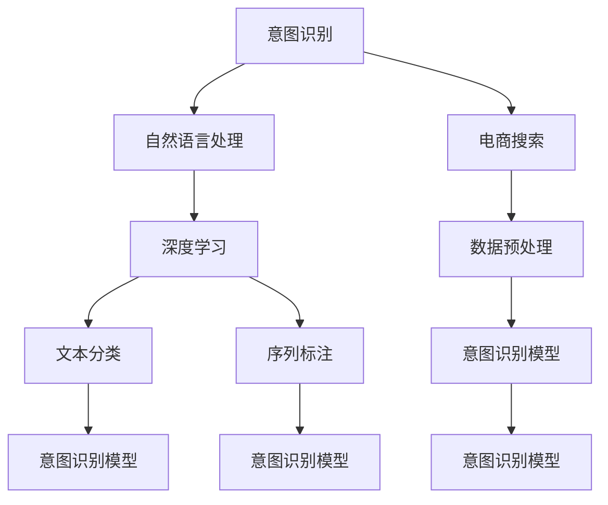

                 

# 电商搜索中的意图识别深度学习模型

## 1. 背景介绍

### 1.1 问题由来
随着电商平台的快速发展，搜索系统的用户访问量大幅增加。搜索引擎已经成为电商平台重要的用户入口，用户通过搜索系统查询商品信息，而搜索系统则需要准确理解用户意图，推荐符合用户需求的商品。意图识别是构建精准搜索结果的核心技术之一，能够帮助系统快速识别用户的查询意图，从而推荐更相关、更个性化的商品。

### 1.2 问题核心关键点
意图识别任务主要包括识别用户的查询意图类型（如搜索商品、询问客服、提交反馈等），并根据意图类型提供相应的搜索结果。常见的意图识别模型包括基于规则的意图识别系统、基于统计的意图识别系统、基于深度学习的意图识别系统等。

其中，深度学习模型由于其强大的特征提取能力和泛化能力，在电商搜索中的意图识别任务中得到了广泛应用。基于神经网络、卷积神经网络(CNN)、循环神经网络(RNN)等架构的深度学习模型，在电商搜索中展现了出色的性能。然而，电商搜索场景具有数据量大、标签多、噪音大等特点，对深度学习模型的挑战较大。如何设计有效的深度学习模型，提升电商搜索中的意图识别性能，成为了当前研究的热点问题。

## 2. 核心概念与联系

### 2.1 核心概念概述

为更好地理解电商搜索中的意图识别深度学习模型，本节将介绍几个密切相关的核心概念：

- 意图识别：指系统自动识别用户查询的自然语言文本，识别出用户的意图类型，如查询商品、询问客服、提交反馈等。
- 自然语言处理(NLP)：指计算机对自然语言文本进行处理的系列技术，包括文本预处理、语言模型、语义分析等，是构建意图识别模型的基础。
- 深度学习：指使用神经网络等深度学习模型，从大规模数据中自动学习特征表示和模式，是意图识别任务的核心技术。
- 电商搜索：指用户通过电商平台的搜索功能查询商品信息的过程，是意图识别的应用场景之一。
- 文本分类：指将自然语言文本按类别进行自动分类的任务，电商搜索中的意图识别可以看作是特殊类型的文本分类任务。
- 序列标注：指对自然语言文本中的每个单词进行标注，识别出特定的语义信息，如命名实体、词性标注等。

这些核心概念之间的逻辑关系可以通过以下Mermaid流程图来展示：



这个流程图展示了几者之间的逻辑关系：

1. 意图识别依赖于自然语言处理和深度学习技术，通过文本分类和序列标注实现。
2. 电商搜索场景中，意图识别模型需要对大量数据进行处理，并进行数据预处理。
3. 文本分类和序列标注是构建意图识别模型的基础。
4. 意图识别模型是电商搜索中实现用户意图识别的关键组件。

## 3. 核心算法原理 & 具体操作步骤
### 3.1 算法原理概述

基于深度学习的电商搜索中的意图识别模型，通常采用端到端的深度学习框架进行构建。其核心思想是：使用深度学习模型对自然语言文本进行特征提取和表示学习，通过训练有监督的意图识别数据集，学习出模型参数，使得模型能够自动地从输入的自然语言文本中识别出用户意图。

具体的算法流程如下：

1. **数据预处理**：对电商搜索中的自然语言查询进行分词、去除停用词、标准化等预处理操作。
2. **特征提取**：使用词嵌入或预训练语言模型(如BERT、GPT等)对查询文本进行特征提取。
3. **模型训练**：使用有监督的意图识别数据集，训练意图识别模型，得到模型参数。
4. **意图分类**：对输入的查询文本进行特征提取，通过意图识别模型进行分类，输出意图类型。
5. **结果输出**：根据意图类型，返回相应的搜索结果或执行操作。

### 3.2 算法步骤详解

电商搜索中的意图识别深度学习模型的具体算法步骤如下：

**Step 1: 数据预处理**
- 对电商搜索中的自然语言查询进行分词，去除停用词，进行标准化操作，如统一大小写、去除标点符号等。
- 对查询文本进行编码，使用词嵌入或预训练语言模型进行特征提取。

**Step 2: 特征提取**
- 使用词嵌入将查询文本映射为向量表示。词嵌入是将单词映射为低维向量的一种方法，常用的词嵌入模型包括Word2Vec、GloVe等。
- 或使用预训练语言模型(如BERT、GPT等)对查询文本进行特征提取，得到文本的语义表示。

**Step 3: 模型训练**
- 准备有监督的意图识别数据集，将查询文本和意图类型作为训练样本。
- 选择深度学习模型，如CNN、RNN、Transformer等，进行训练。
- 设置模型的超参数，如学习率、批大小、迭代轮数等。
- 使用交叉熵损失函数进行模型训练，最小化模型输出与真实意图之间的差异。

**Step 4: 意图分类**
- 对输入的查询文本进行特征提取，得到向量表示。
- 使用训练好的意图识别模型，对向量进行分类，得到意图类型。
- 根据意图类型，返回相应的搜索结果或执行操作。

**Step 5: 结果输出**
- 根据意图类型，执行相应的操作，如搜索商品、询问客服、提交反馈等。
- 将搜索结果或操作结果返回给用户。

### 3.3 算法优缺点

基于深度学习的电商搜索中的意图识别模型，具有以下优点：

1. 高精度：深度学习模型能够自动提取特征，学习复杂语义关系，在大规模数据上表现优异，能够显著提升意图识别的准确率。
2. 泛化能力强：深度学习模型具有较强的泛化能力，能够适应不同类型和风格的查询文本，鲁棒性强。
3. 自动化：通过训练有监督的意图识别数据集，能够自动学习模型的参数，无需人工干预，减少了人工标注的工作量。
4. 可扩展：深度学习模型可以与其他NLP技术进行无缝集成，如文本分类、序列标注等，提高电商搜索的智能化水平。

然而，该模型也存在以下缺点：

1. 数据需求高：深度学习模型需要大量有监督的意图识别数据进行训练，获取高质量标注数据成本较高。
2. 模型复杂：深度学习模型的计算量大，需要较强的硬件支持，训练和推理速度较慢。
3. 参数量大：深度学习模型通常具有大量的参数，需要较大的存储空间。
4. 可解释性差：深度学习模型是黑盒模型，难以解释其内部工作机制，对模型的优化和调试带来挑战。

### 3.4 算法应用领域

基于深度学习的电商搜索中的意图识别模型，已经在电商搜索、智能客服、智能推荐等多个领域得到了广泛应用，成为构建智能电商系统的重要技术。

1. **电商搜索**：通过用户输入的查询文本，自动识别用户意图，推荐符合用户需求的商品。
2. **智能客服**：识别用户输入的咨询意图，自动回复或将用户请求转发给客服人员。
3. **智能推荐**：根据用户搜索历史和行为数据，自动推荐相关商品。
4. **个性化广告**：根据用户查询意图，自动推送个性化广告。

## 4. 数学模型和公式 & 详细讲解 & 举例说明
### 4.1 数学模型构建

电商搜索中的意图识别深度学习模型，通常采用序列标注模型进行构建。序列标注模型的目标是对自然语言文本中的每个单词进行标注，识别出特定的语义信息，如命名实体、词性标注等。在电商搜索中，序列标注模型可以识别出查询文本中的意图类型，如搜索商品、询问客服、提交反馈等。

定义查询文本为 $x_1, x_2, ..., x_n$，意图类型标注为 $y_1, y_2, ..., y_n$，其中 $y_i \in \{1, 2, ..., k\}$，$k$ 为意图类型的数量。目标是最小化损失函数 $\mathcal{L}$，其中 $\mathcal{L}=\sum_{i=1}^n \ell(y_i, \hat{y}_i)$，$\ell$ 为损失函数。

### 4.2 公式推导过程

以CNN为基础的电商搜索中的意图识别模型为例，公式推导过程如下：

**Step 1: 词嵌入**
- 将查询文本 $x_i$ 转换为词嵌入向量 $\mathbf{e}_i$。

**Step 2: 卷积层**
- 使用卷积核对词嵌入向量进行卷积操作，得到特征图 $f_i$。
- $f_i=\sigma(\sum_{j=0}^{k-1} w_j * \mathbf{e}_{i-j+1} + b_j)$，其中 $w_j$ 为卷积核，$b_j$ 为偏置项。

**Step 3: 池化层**
- 使用最大池化层对特征图 $f_i$ 进行池化操作，得到池化结果 $h_i$。
- $h_i=max(f_i)$。

**Step 4: 全连接层**
- 将池化结果 $h_i$ 输入全连接层，输出意图分类结果 $\hat{y}_i$。
- $\hat{y}_i=softmax(W * h_i + b)$，其中 $W$ 为全连接层权重矩阵，$b$ 为偏置项。

**Step 5: 损失函数**
- 使用交叉熵损失函数计算模型输出与真实意图之间的差异。
- $\ell(y_i, \hat{y}_i)=-y_i \log \hat{y}_i - (1-y_i) \log (1-\hat{y}_i)$。

### 4.3 案例分析与讲解

以一个具体的案例为例，假设有一句查询文本 "我想买一台新手机"，意图识别模型需要对每个单词进行标注，输出意图类型。通过卷积层和池化层的计算，得到查询文本的特征表示，然后通过全连接层进行意图分类，得到意图类型标注结果。具体流程如下：

1. 词嵌入
   - 将查询文本 "我想买一台新手机" 转换为词嵌入向量 $\mathbf{e}_1, \mathbf{e}_2, \mathbf{e}_3, \mathbf{e}_4, \mathbf{e}_5, \mathbf{e}_6$。

2. 卷积层
   - 使用卷积核对词嵌入向量进行卷积操作，得到特征图 $f_1, f_2, f_3, f_4, f_5, f_6$。

3. 池化层
   - 使用最大池化层对特征图 $f_1, f_2, f_3, f_4, f_5, f_6$ 进行池化操作，得到池化结果 $h_1, h_2, h_3, h_4, h_5, h_6$。

4. 全连接层
   - 将池化结果 $h_1, h_2, h_3, h_4, h_5, h_6$ 输入全连接层，得到意图分类结果 $\hat{y}_1, \hat{y}_2, \hat{y}_3, \hat{y}_4, \hat{y}_5, \hat{y}_6$。

5. 意图分类
   - 通过比较 $\hat{y}_1, \hat{y}_2, \hat{y}_3, \hat{y}_4, \hat{y}_5, \hat{y}_6$ 的值，判断查询文本的意图类型。

## 5. 项目实践：代码实例和详细解释说明
### 5.1 开发环境搭建

在进行电商搜索中的意图识别深度学习模型开发前，我们需要准备好开发环境。以下是使用Python进行PyTorch开发的环境配置流程：

1. 安装Anaconda：从官网下载并安装Anaconda，用于创建独立的Python环境。

2. 创建并激活虚拟环境：
```bash
conda create -n pytorch-env python=3.8 
conda activate pytorch-env
```

3. 安装PyTorch：根据CUDA版本，从官网获取对应的安装命令。例如：
```bash
conda install pytorch torchvision torchaudio cudatoolkit=11.1 -c pytorch -c conda-forge
```

4. 安装Transformer库：
```bash
pip install transformers
```

5. 安装各类工具包：
```bash
pip install numpy pandas scikit-learn matplotlib tqdm jupyter notebook ipython
```

完成上述步骤后，即可在`pytorch-env`环境中开始开发实践。

### 5.2 源代码详细实现

下面我们以电商搜索中的意图识别任务为例，给出使用Transformers库对BERT模型进行意图识别微调的PyTorch代码实现。

首先，定义意图识别任务的数据处理函数：

```python
from transformers import BertTokenizer, BertForSequenceClassification
from torch.utils.data import Dataset, DataLoader
import torch

class SearchIntentDataset(Dataset):
    def __init__(self, texts, labels, tokenizer, max_len=128):
        self.texts = texts
        self.labels = labels
        self.tokenizer = tokenizer
        self.max_len = max_len
        
    def __len__(self):
        return len(self.texts)
    
    def __getitem__(self, item):
        text = self.texts[item]
        label = self.labels[item]
        
        encoding = self.tokenizer(text, return_tensors='pt', max_length=self.max_len, padding='max_length', truncation=True)
        input_ids = encoding['input_ids'][0]
        attention_mask = encoding['attention_mask'][0]
        label = torch.tensor(label, dtype=torch.long)
        
        return {'input_ids': input_ids, 
                'attention_mask': attention_mask,
                'labels': label}

# 定义意图类型标签
label2id = {'search': 0, 'ask': 1, 'feedback': 2}
id2label = {v: k for k, v in label2id.items()}

# 创建dataset
tokenizer = BertTokenizer.from_pretrained('bert-base-cased')
train_dataset = SearchIntentDataset(train_texts, train_labels, tokenizer)
dev_dataset = SearchIntentDataset(dev_texts, dev_labels, tokenizer)
test_dataset = SearchIntentDataset(test_texts, test_labels, tokenizer)
```

然后，定义模型和优化器：

```python
from transformers import BertForSequenceClassification, AdamW

model = BertForSequenceClassification.from_pretrained('bert-base-cased', num_labels=len(label2id))

optimizer = AdamW(model.parameters(), lr=2e-5)
```

接着，定义训练和评估函数：

```python
from tqdm import tqdm

device = torch.device('cuda') if torch.cuda.is_available() else torch.device('cpu')
model.to(device)

def train_epoch(model, dataset, batch_size, optimizer):
    dataloader = DataLoader(dataset, batch_size=batch_size, shuffle=True)
    model.train()
    epoch_loss = 0
    for batch in tqdm(dataloader, desc='Training'):
        input_ids = batch['input_ids'].to(device)
        attention_mask = batch['attention_mask'].to(device)
        labels = batch['labels'].to(device)
        model.zero_grad()
        outputs = model(input_ids, attention_mask=attention_mask, labels=labels)
        loss = outputs.loss
        epoch_loss += loss.item()
        loss.backward()
        optimizer.step()
    return epoch_loss / len(dataloader)

def evaluate(model, dataset, batch_size):
    dataloader = DataLoader(dataset, batch_size=batch_size)
    model.eval()
    preds, labels = [], []
    with torch.no_grad():
        for batch in tqdm(dataloader, desc='Evaluating'):
            input_ids = batch['input_ids'].to(device)
            attention_mask = batch['attention_mask'].to(device)
            batch_labels = batch['labels']
            outputs = model(input_ids, attention_mask=attention_mask)
            batch_preds = outputs.logits.argmax(dim=2).to('cpu').tolist()
            batch_labels = batch_labels.to('cpu').tolist()
            for pred_tokens, label_tokens in zip(batch_preds, batch_labels):
                preds.append(pred_tokens)
                labels.append(label_tokens)
                
    print(classification_report(labels, preds))
```

最后，启动训练流程并在测试集上评估：

```python
epochs = 5
batch_size = 16

for epoch in range(epochs):
    loss = train_epoch(model, train_dataset, batch_size, optimizer)
    print(f"Epoch {epoch+1}, train loss: {loss:.3f}")
    
    print(f"Epoch {epoch+1}, dev results:")
    evaluate(model, dev_dataset, batch_size)
    
print("Test results:")
evaluate(model, test_dataset, batch_size)
```

以上就是使用PyTorch对BERT进行电商搜索中的意图识别任务微调的完整代码实现。可以看到，得益于Transformer库的强大封装，我们可以用相对简洁的代码完成BERT模型的加载和微调。

### 5.3 代码解读与分析

让我们再详细解读一下关键代码的实现细节：

**SearchIntentDataset类**：
- `__init__`方法：初始化文本、标签、分词器等关键组件。
- `__len__`方法：返回数据集的样本数量。
- `__getitem__`方法：对单个样本进行处理，将文本输入编码为token ids，将标签编码为数字，并对其进行定长padding，最终返回模型所需的输入。

**label2id和id2label字典**：
- 定义了意图类型与数字id之间的映射关系，用于将意图分类结果解码回真实的意图类型。

**训练和评估函数**：
- 使用PyTorch的DataLoader对数据集进行批次化加载，供模型训练和推理使用。
- 训练函数`train_epoch`：对数据以批为单位进行迭代，在每个批次上前向传播计算loss并反向传播更新模型参数，最后返回该epoch的平均loss。
- 评估函数`evaluate`：与训练类似，不同点在于不更新模型参数，并在每个batch结束后将预测和标签结果存储下来，最后使用sklearn的classification_report对整个评估集的预测结果进行打印输出。

**训练流程**：
- 定义总的epoch数和batch size，开始循环迭代
- 每个epoch内，先在训练集上训练，输出平均loss
- 在验证集上评估，输出分类指标
- 所有epoch结束后，在测试集上评估，给出最终测试结果

可以看到，PyTorch配合Transformer库使得BERT微调的代码实现变得简洁高效。开发者可以将更多精力放在数据处理、模型改进等高层逻辑上，而不必过多关注底层的实现细节。

当然，工业级的系统实现还需考虑更多因素，如模型的保存和部署、超参数的自动搜索、更灵活的任务适配层等。但核心的微调范式基本与此类似。

## 6. 实际应用场景
### 6.1 智能客服系统

基于大语言模型微调的对话技术，可以广泛应用于智能客服系统的构建。传统客服往往需要配备大量人力，高峰期响应缓慢，且一致性和专业性难以保证。而使用微调后的对话模型，可以7x24小时不间断服务，快速响应客户咨询，用自然流畅的语言解答各类常见问题。

在技术实现上，可以收集企业内部的历史客服对话记录，将问题和最佳答复构建成监督数据，在此基础上对预训练对话模型进行微调。微调后的对话模型能够自动理解用户意图，匹配最合适的答案模板进行回复。对于客户提出的新问题，还可以接入检索系统实时搜索相关内容，动态组织生成回答。如此构建的智能客服系统，能大幅提升客户咨询体验和问题解决效率。

### 6.2 金融舆情监测

金融机构需要实时监测市场舆论动向，以便及时应对负面信息传播，规避金融风险。传统的人工监测方式成本高、效率低，难以应对网络时代海量信息爆发的挑战。基于大语言模型微调的文本分类和情感分析技术，为金融舆情监测提供了新的解决方案。

具体而言，可以收集金融领域相关的新闻、报道、评论等文本数据，并对其进行主题标注和情感标注。在此基础上对预训练语言模型进行微调，使其能够自动判断文本属于何种主题，情感倾向是正面、中性还是负面。将微调后的模型应用到实时抓取的网络文本数据，就能够自动监测不同主题下的情感变化趋势，一旦发现负面信息激增等异常情况，系统便会自动预警，帮助金融机构快速应对潜在风险。

### 6.3 个性化推荐系统

当前的推荐系统往往只依赖用户的历史行为数据进行物品推荐，无法深入理解用户的真实兴趣偏好。基于大语言模型微调技术，个性化推荐系统可以更好地挖掘用户行为背后的语义信息，从而提供更精准、多样的推荐内容。

在实践中，可以收集用户浏览、点击、评论、分享等行为数据，提取和用户交互的物品标题、描述、标签等文本内容。将文本内容作为模型输入，用户的后续行为（如是否点击、购买等）作为监督信号，在此基础上微调预训练语言模型。微调后的模型能够从文本内容中准确把握用户的兴趣点。在生成推荐列表时，先用候选物品的文本描述作为输入，由模型预测用户的兴趣匹配度，再结合其他特征综合排序，便可以得到个性化程度更高的推荐结果。

### 6.4 未来应用展望

随着大语言模型微调技术的发展，未来电商搜索中的意图识别模型将呈现以下几个发展趋势：

1. **更高效的数据处理**：通过分布式计算、数据增量更新等技术，进一步提升数据处理效率，降低对计算资源的依赖。
2. **更灵活的模型结构**：引入更多的神经网络结构，如Attention机制、Transformer结构等，提高模型表达能力和泛化能力。
3. **更精准的意图识别**：通过多模态融合、知识图谱增强等技术，提升意图识别的准确性和鲁棒性。
4. **更广泛的语料来源**：从更多领域、更多模态的数据中提取语义信息，丰富电商搜索中的意图类型。
5. **更高效的推理引擎**：通过模型压缩、推理优化等技术，提升模型推理速度，支持实时查询响应。
6. **更强的安全防护**：引入对抗训练、鲁棒性检测等技术，提高模型的安全性和鲁棒性。

以上趋势凸显了大语言模型微调技术的广阔前景。这些方向的探索发展，必将进一步提升电商搜索中的意图识别性能，为电商平台的智能化转型提供强有力的技术支撑。

## 7. 工具和资源推荐
### 7.1 学习资源推荐

为了帮助开发者系统掌握电商搜索中的意图识别深度学习模型的理论基础和实践技巧，这里推荐一些优质的学习资源：

1. 《深度学习》系列书籍：深度学习领域的经典教材，详细讲解了深度学习的基本原理和应用，是掌握电商搜索中的意图识别模型不可缺少的参考资料。
2. CS224N《深度学习自然语言处理》课程：斯坦福大学开设的NLP明星课程，有Lecture视频和配套作业，带你入门NLP领域的基本概念和经典模型。
3. 《Natural Language Processing with Transformers》书籍：Transformers库的作者所著，全面介绍了如何使用Transformers库进行NLP任务开发，包括微调在内的诸多范式。
4. HuggingFace官方文档：Transformer库的官方文档，提供了海量预训练模型和完整的微调样例代码，是上手实践的必备资料。
5. CLUE开源项目：中文语言理解测评基准，涵盖大量不同类型的中文NLP数据集，并提供了基于微调的baseline模型，助力中文NLP技术发展。

通过对这些资源的学习实践，相信你一定能够快速掌握电商搜索中的意图识别深度学习模型的精髓，并用于解决实际的NLP问题。
### 7.2 开发工具推荐

高效的开发离不开优秀的工具支持。以下是几款用于电商搜索中的意图识别深度学习模型开发的常用工具：

1. PyTorch：基于Python的开源深度学习框架，灵活动态的计算图，适合快速迭代研究。大部分预训练语言模型都有PyTorch版本的实现。
2. TensorFlow：由Google主导开发的开源深度学习框架，生产部署方便，适合大规模工程应用。同样有丰富的预训练语言模型资源。
3. Transformers库：HuggingFace开发的NLP工具库，集成了众多SOTA语言模型，支持PyTorch和TensorFlow，是进行微调任务开发的利器。
4. Weights & Biases：模型训练的实验跟踪工具，可以记录和可视化模型训练过程中的各项指标，方便对比和调优。与主流深度学习框架无缝集成。
5. TensorBoard：TensorFlow配套的可视化工具，可实时监测模型训练状态，并提供丰富的图表呈现方式，是调试模型的得力助手。
6. Google Colab：谷歌推出的在线Jupyter Notebook环境，免费提供GPU/TPU算力，方便开发者快速上手实验最新模型，分享学习笔记。

合理利用这些工具，可以显著提升电商搜索中的意图识别模型的开发效率，加快创新迭代的步伐。

### 7.3 相关论文推荐

电商搜索中的意图识别深度学习模型的发展源于学界的持续研究。以下是几篇奠基性的相关论文，推荐阅读：

1. Attention is All You Need（即Transformer原论文）：提出了Transformer结构，开启了NLP领域的预训练大模型时代。
2. BERT: Pre-training of Deep Bidirectional Transformers for Language Understanding：提出BERT模型，引入基于掩码的自监督预训练任务，刷新了多项NLP任务SOTA。
3. Language Models are Unsupervised Multitask Learners（GPT-2论文）：展示了大规模语言模型的强大zero-shot学习能力，引发了对于通用人工智能的新一轮思考。
4. Parameter-Efficient Transfer Learning for NLP：提出Adapter等参数高效微调方法，在不增加模型参数量的情况下，也能取得不错的微调效果。
5. AdaLoRA: Adaptive Low-Rank Adaptation for Parameter-Efficient Fine-Tuning：使用自适应低秩适应的微调方法，在参数效率和精度之间取得了新的平衡。
6. Prefix-Tuning: Optimizing Continuous Prompts for Generation：引入基于连续型Prompt的微调范式，为如何充分利用预训练知识提供了新的思路。

这些论文代表了大语言模型微调技术的发展脉络。通过学习这些前沿成果，可以帮助研究者把握学科前进方向，激发更多的创新灵感。

## 8. 总结：未来发展趋势与挑战
### 8.1 总结

本文对电商搜索中的意图识别深度学习模型进行了全面系统的介绍。首先阐述了电商搜索中的意图识别任务的重要性和基本流程，明确了深度学习模型在其中的关键作用。其次，从原理到实践，详细讲解了深度学习模型的构建和训练步骤，给出了电商搜索中的意图识别模型开发的完整代码实例。同时，本文还广泛探讨了深度学习模型在智能客服、金融舆情、个性化推荐等多个领域的应用前景，展示了电商搜索中的意图识别模型广阔的发展空间。此外，本文精选了深度学习模型开发所需的学习资源和开发工具，力求为读者提供全方位的技术指引。

通过本文的系统梳理，可以看到，电商搜索中的意图识别深度学习模型正在成为电商搜索系统的核心技术，极大地提升了电商搜索的智能化水平，促进了电商平台的创新发展。未来，伴随深度学习模型的不断演进和应用领域的不断拓展，相信电商搜索中的意图识别技术必将在电商平台的智能化转型中发挥更大的作用。

### 8.2 未来发展趋势

展望未来，电商搜索中的意图识别深度学习模型将呈现以下几个发展趋势：

1. **更高效的推理引擎**：随着计算硬件的发展，电商搜索中的意图识别模型将进一步提升推理速度，支持实时查询响应。
2. **更广泛的数据来源**：从更多领域、更多模态的数据中提取语义信息，丰富电商搜索中的意图类型。
3. **更灵活的模型结构**：引入更多的神经网络结构，如Attention机制、Transformer结构等，提高模型表达能力和泛化能力。
4. **更精准的意图识别**：通过多模态融合、知识图谱增强等技术，提升意图识别的准确性和鲁棒性。
5. **更广泛的语料来源**：从更多领域、更多模态的数据中提取语义信息，丰富电商搜索中的意图类型。
6. **更高效的训练和优化**：通过分布式训练、混合精度训练等技术，提升模型训练效率，降低计算资源消耗。

以上趋势凸显了电商搜索中的意图识别深度学习模型的广阔前景。这些方向的探索发展，必将进一步提升电商搜索中的意图识别性能，为电商平台的智能化转型提供强有力的技术支撑。

### 8.3 面临的挑战

尽管电商搜索中的意图识别深度学习模型已经取得了瞩目成就，但在迈向更加智能化、普适化应用的过程中，它仍面临着诸多挑战：

1. **数据需求高**：深度学习模型需要大量有监督的意图识别数据进行训练，获取高质量标注数据成本较高。
2. **模型复杂**：深度学习模型的计算量大，需要较强的硬件支持，训练和推理速度较慢。
3. **参数量大**：深度学习模型通常具有大量的参数，需要较大的存储空间。
4. **可解释性差**：深度学习模型是黑盒模型，难以解释其内部工作机制，对模型的优化和调试带来挑战。
5. **安全防护**：引入对抗训练、鲁棒性检测等技术，提高模型的安全性和鲁棒性。

### 8.4 研究展望

面对电商搜索中的意图识别深度学习模型所面临的种种挑战，未来的研究需要在以下几个方面寻求新的突破：

1. **无监督和半监督学习**：摆脱对大规模标注数据的依赖，利用自监督学习、主动学习等无监督和半监督范式，最大限度利用非结构化数据，实现更加灵活高效的意图识别。
2. **参数高效和计算高效的微调方法**：开发更加参数高效的微调方法，在固定大部分预训练参数的情况下，只更新极少量的任务相关参数。同时优化微调模型的计算图，减少前向传播和反向传播的资源消耗，实现更加轻量级、实时性的部署。
3. **多模态融合**：将文本、图像、音频等多种模态的信息进行融合，提升意图识别的鲁棒性和准确性。
4. **知识图谱增强**：将知识图谱与深度学习模型进行结合，提升意图识别的语义理解和知识推理能力。
5. **因果推理**：引入因果推理模型，增强意图识别模型的因果关系，提升模型的泛化能力和解释性。
6. **对抗训练**：通过对抗训练技术，提高模型的鲁棒性和安全性。

这些研究方向的探索，必将引领电商搜索中的意图识别技术迈向更高的台阶，为电商平台的智能化转型提供更强大的技术支持。未来，伴随深度学习技术的不断进步，电商搜索中的意图识别技术必将迎来更多的创新突破，为电商平台的智能化转型带来更大的机遇。

