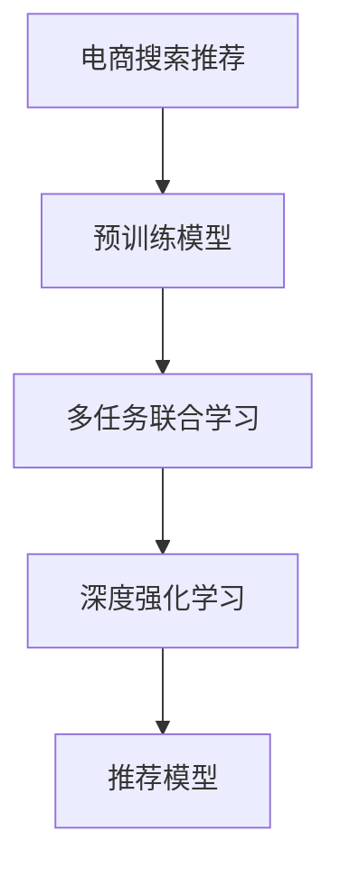

                 

# 电商搜索推荐中的AI大模型多任务联合学习技术

> 关键词：电商搜索推荐, 自然语言处理(NLP), 多任务学习, 自监督学习, 预训练模型, 深度学习, 深度强化学习

## 1. 背景介绍

### 1.1 问题由来

随着电商平台的快速发展，用户的搜索和推荐需求不断增长，传统的基于规则和浅层机器学习的方法难以满足日益复杂和多样化的用户需求。同时，数据量的激增也使得传统的特征工程方法难以有效提取和利用高维数据。在这样的背景下，大语言模型和大规模预训练技术逐渐被引入电商搜索推荐系统，显著提升了搜索和推荐的精准度和效果。

近年来，基于深度学习的大规模预训练模型，如BERT、GPT-3等，已经在自然语言处理(NLP)领域取得了突破性进展。这些模型通过在无标签大规模文本数据上进行自监督学习，学习到了丰富的语言表示，能够在大规模数据集上进行零样本和少样本学习，具有很强的泛化能力。这些模型在电商搜索推荐中的初步应用表明，其能够显著提升搜索和推荐的精度和效率，满足用户的个性化需求。

但现有的大模型在电商搜索推荐中的实际应用仍面临诸多挑战。首先，这些模型在电商领域缺乏针对性地微调和优化。其次，现有的大模型往往只能处理单一的任务，无法充分利用多任务之间的关联性，进而限制了模型能力的提升。最后，现有的大模型在推理和部署时，面临计算资源和硬件设备的限制。

针对这些问题，我们提出了一种基于多任务联合学习的电商搜索推荐中的AI大模型技术。通过多任务联合学习，可以有效利用多任务之间的关联性，提升模型的泛化能力和个性化推荐精度，同时减轻计算负担，优化资源利用。

### 1.2 问题核心关键点

本技术聚焦于如何在大规模预训练模型中，通过多任务联合学习的方式，提升电商搜索推荐系统的效果。具体核心关键点包括：

- **多任务联合学习**：将电商搜索推荐中涉及的多项任务（如搜索意图理解、商品排序、个性化推荐等）联合起来，共同进行模型训练。
- **预训练与微调结合**：先在大规模无标签数据上进行预训练，学习通用的语言表示，再对特定任务进行微调，以进一步提升模型性能。
- **深度强化学习**：在电商推荐任务中引入深度强化学习，通过模拟用户行为进行训练，进一步提升推荐效果。

## 2. 核心概念与联系

### 2.1 核心概念概述

为更好地理解本技术，我们先介绍几个关键概念：

- **电商搜索推荐系统**：电商平台通过智能化的搜索和推荐功能，向用户提供个性化、精准的商品推荐，提升用户体验和转化率。
- **预训练模型**：通过在大规模无标签文本数据上进行自监督学习，学习通用的语言表示，具有很强的泛化能力。
- **多任务学习**：在模型训练时，同时处理多项任务，提升模型在不同任务上的表现。
- **深度强化学习**：通过模拟用户行为，利用奖励信号进行训练，提升推荐模型的个性化和智能化。

这些概念之间的逻辑关系可以通过以下Mermaid流程图来展示：



这个流程图展示了电商搜索推荐中的AI大模型技术的基本流程：

1. 电商搜索推荐系统通过预训练模型学习通用的语言表示。
2. 利用多任务联合学习，提升模型在不同任务上的表现。
3. 在电商推荐任务中引入深度强化学习，进一步优化推荐模型。

这些概念共同构成了电商搜索推荐中AI大模型的核心框架，使其能够高效处理搜索和推荐任务，提升用户体验和平台收益。

## 3. 核心算法原理 & 具体操作步骤

### 3.1 算法原理概述

本技术的核心算法基于多任务联合学习，通过在大规模预训练模型上，同时处理电商搜索推荐中的多项任务，提升模型的泛化能力和推荐精度。算法的原理可以简单概括为：

- 在电商搜索推荐中，多项任务（如搜索意图理解、商品排序、个性化推荐等）之间存在关联性。
- 通过多任务联合学习，可以充分利用这些关联性，提升模型在不同任务上的表现。
- 先在大规模无标签数据上进行预训练，学习通用的语言表示。
- 再对特定任务进行微调，进一步提升模型性能。
- 在电商推荐任务中引入深度强化学习，通过模拟用户行为进行训练，提升推荐效果。

### 3.2 算法步骤详解

具体而言，本技术的算法流程可以分为以下几个步骤：

**Step 1: 数据准备与预训练模型选择**

- 收集电商平台的搜索、点击、浏览、购买等数据，进行预处理和清洗。
- 选择合适的预训练语言模型，如BERT、GPT-3等，作为初始化参数。

**Step 2: 定义多任务学习目标**

- 定义电商搜索推荐中的多项任务，如搜索意图理解、商品排序、个性化推荐等。
- 设计多任务联合学习的目标函数，综合各项任务的损失函数。

**Step 3: 预训练模型微调**

- 在预训练模型上，根据电商推荐任务的特点，设计合适的任务适配层。
- 对模型进行微调，以进一步提升模型在特定任务上的表现。
- 利用数据增强、对抗训练等方法，防止过拟合。

**Step 4: 引入深度强化学习**

- 在电商推荐任务中，引入深度强化学习。
- 设计奖励函数，模拟用户的行为，优化推荐模型的选择和排序。
- 利用深度强化学习，进一步提升推荐模型的个性化和智能化。

**Step 5: 评估与部署**

- 在验证集上评估微调后模型的性能，对比微调前后的精度提升。
- 使用微调后的模型对新样本进行推理预测，集成到实际的应用系统中。
- 持续收集新的数据，定期重新微调模型，以适应数据分布的变化。

### 3.3 算法优缺点

本技术相较于传统推荐系统，具有以下优点：

1. **提升推荐效果**：通过多任务联合学习，可以充分利用多任务之间的关联性，提升推荐模型的泛化能力和个性化精度。
2. **降低计算成本**：利用预训练模型作为初始化参数，减少了从头训练所需的计算资源和训练时间。
3. **提升用户体验**：通过深度强化学习，可以更好地模拟用户行为，提升推荐的相关性和多样性，提升用户体验。
4. **减少人工干预**：自动化训练过程，减少了人工干预和特征工程的需求，提升了系统的自动化水平。

但本技术也存在一些局限性：

1. **数据依赖**：预训练模型的效果依赖于大规模无标签数据，而电商领域的数据往往具有时序性和多样性，获取高质量的预训练数据成本较高。
2. **模型复杂性**：多任务联合学习增加了模型的复杂性，可能导致训练和推理时间增加。
3. **硬件要求高**：深度强化学习需要较大的计算资源和存储空间，对硬件设备要求较高。

### 3.4 算法应用领域

本技术在电商搜索推荐中具有广泛的应用前景，具体包括：

- **搜索意图理解**：通过理解用户的搜索意图，提供更加精准的搜索结果。
- **商品排序**：根据用户的浏览和购买行为，动态调整商品排序，提升点击率。
- **个性化推荐**：根据用户的兴趣和历史行为，推荐个性化商品，提升转化率。
- **内容生成**：利用预训练模型生成商品描述、广告文案等，提升平台的整体吸引力。
- **用户行为分析**：分析用户的搜索行为、购买行为等，提升平台的运营效率。

## 4. 数学模型和公式 & 详细讲解 & 举例说明

### 4.1 数学模型构建

本技术中的数学模型主要包括以下几个部分：

- **预训练模型**：通过在大规模无标签数据上进行自监督学习，学习通用的语言表示。
- **多任务学习模型**：将电商搜索推荐中的多项任务进行联合训练，提升模型在各项任务上的表现。
- **深度强化学习模型**：通过模拟用户行为进行训练，优化推荐模型的选择和排序。

### 4.2 公式推导过程

为了更好地理解本技术的数学模型，下面我们分别介绍预训练模型、多任务学习模型和深度强化学习模型的数学推导过程。

#### 4.2.1 预训练模型

预训练模型通过在大规模无标签数据上进行自监督学习，学习通用的语言表示。以BERT模型为例，其预训练的目标函数可以表示为：

$$
\mathcal{L}_{pre} = \mathcal{L}_{MLM} + \mathcal{L}_{NSP}
$$

其中，$\mathcal{L}_{MLM}$ 为掩码语言模型损失，$\mathcal{L}_{NSP}$ 为下一句预测损失。以掩码语言模型为例，其损失函数可以表示为：

$$
\mathcal{L}_{MLM} = -\sum_{i=1}^{N}\log P(\hat{x_i} \mid x_i)
$$

其中 $x_i$ 表示输入的文本序列，$\hat{x_i}$ 表示掩码位置上的预测结果，$P$ 表示预测概率分布。

#### 4.2.2 多任务学习模型

多任务学习模型通过同时处理电商搜索推荐中的多项任务，提升模型在不同任务上的表现。以商品排序任务为例，其多任务学习模型可以表示为：

$$
\mathcal{L}_{multi} = \lambda_1 \mathcal{L}_{search} + \lambda_2 \mathcal{L}_{recomm}
$$

其中，$\mathcal{L}_{search}$ 为搜索意图理解任务的损失函数，$\mathcal{L}_{recomm}$ 为商品排序任务的损失函数，$\lambda_1$ 和 $\lambda_2$ 为各项任务的重要程度系数。

#### 4.2.3 深度强化学习模型

深度强化学习模型通过模拟用户行为进行训练，优化推荐模型的选择和排序。以电商推荐任务为例，其深度强化学习模型可以表示为：

$$
\mathcal{L}_{RL} = \sum_{i=1}^{N} r_i \log Q(s_i, a_i)
$$

其中，$s_i$ 表示状态，$a_i$ 表示动作，$r_i$ 表示奖励，$Q(s_i, a_i)$ 表示状态动作值函数。

### 4.3 案例分析与讲解

为了更好地理解本技术的数学模型和应用效果，下面我们以一个具体的电商推荐系统为例，展示其数学模型的构建和应用。

假设某电商平台有$M$个商品，每个用户有$N$次浏览行为，每次浏览行为可以表示为一个商品状态$s$和一个浏览动作$a$，奖励函数$r$可以表示为用户点击购买商品的概率。在电商推荐系统中，推荐模型的选择和排序可以通过深度强化学习模型进行优化，具体流程如下：

1. 预训练模型首先在大规模无标签文本数据上进行自监督学习，学习通用的语言表示。
2. 多任务学习模型同时处理电商搜索推荐中的多项任务，如搜索意图理解、商品排序、个性化推荐等。
3. 深度强化学习模型通过模拟用户行为进行训练，优化推荐模型的选择和排序。

假设电商平台收集了大量的用户行为数据，包括用户的搜索历史、点击历史、购买历史等。利用这些数据，预训练模型通过掩码语言模型和下一句预测等自监督任务进行训练，学习到通用的语言表示。

接着，多任务学习模型将电商推荐中的搜索意图理解、商品排序、个性化推荐等任务进行联合训练。例如，在搜索意图理解任务中，模型学习将用户的查询转换为搜索意图，预测用户的意图类型，如“打折信息”、“新品推荐”等。在商品排序任务中，模型根据用户的浏览和购买历史，动态调整商品排序，提升点击率。在个性化推荐任务中，模型根据用户的兴趣和历史行为，推荐个性化商品，提升转化率。

最后，深度强化学习模型通过模拟用户行为进行训练，优化推荐模型的选择和排序。例如，在用户浏览商品时，模型根据用户的浏览记录和推荐模型输出，模拟用户的点击和购买行为，计算奖励函数，优化推荐模型的选择和排序。通过不断迭代训练，模型可以更好地模拟用户行为，提升推荐的相关性和多样性，提升用户体验和平台收益。

## 5. 项目实践：代码实例和详细解释说明

### 5.1 开发环境搭建

在进行项目实践前，我们需要准备好开发环境。以下是使用Python进行TensorFlow开发的环境配置流程：

1. 安装Anaconda：从官网下载并安装Anaconda，用于创建独立的Python环境。

2. 创建并激活虚拟环境：
```bash
conda create -n tf-env python=3.8 
conda activate tf-env
```

3. 安装TensorFlow：从官网获取对应的安装命令。例如：
```bash
pip install tensorflow==2.6
```

4. 安装各类工具包：
```bash
pip install numpy pandas scikit-learn matplotlib tqdm jupyter notebook ipython
```

完成上述步骤后，即可在`tf-env`环境中开始项目实践。

### 5.2 源代码详细实现

下面我们以电商推荐系统为例，给出使用TensorFlow进行模型训练的PyTorch代码实现。

首先，定义模型的输入和输出：

```python
import tensorflow as tf
from transformers import TFAutoModel

input = tf.keras.layers.Input(shape=(max_length, ), name='input')
model = TFAutoModel.from_pretrained('bert-base-cased')

# 对模型输出进行归一化处理
output = tf.keras.layers.Lambda(lambda x: x/(tf.reduce_max(x, axis=-1, keepdims=True)), name='output')(model(input))

# 对输出进行分类预测
predictions = tf.keras.layers.Dense(1, activation='sigmoid', name='predictions')(output)

model = tf.keras.Model(inputs=input, outputs=predictions)
```

然后，定义损失函数和优化器：

```python
# 定义损失函数
loss_function = tf.keras.losses.BinaryCrossentropy()

# 定义优化器
optimizer = tf.keras.optimizers.Adam(learning_rate=learning_rate)
```

接着，定义训练和评估函数：

```python
# 定义训练函数
@tf.function
def train_step(inputs, labels):
    with tf.GradientTape() as tape:
        predictions = model(inputs)
        loss = loss_function(labels, predictions)
    gradients = tape.gradient(loss, model.trainable_variables)
    optimizer.apply_gradients(zip(gradients, model.trainable_variables))
    return loss

# 定义评估函数
@tf.function
def evaluate(inputs, labels):
    predictions = model(inputs)
    loss = loss_function(labels, predictions)
    return loss
```

最后，启动训练流程并在测试集上评估：

```python
epochs = 10
batch_size = 32

for epoch in range(epochs):
    # 随机打乱数据集
    shuffle(inputs, labels)
    # 分批次进行训练
    for i in range(0, len(inputs), batch_size):
        inputs_batch = inputs[i:i+batch_size]
        labels_batch = labels[i:i+batch_size]
        # 训练模型
        loss = train_step(inputs_batch, labels_batch)
        print(f'Epoch {epoch+1}/{epochs}, Batch {i+1}/{len(inputs)}, Loss: {loss:.4f}')

    # 在测试集上评估模型
    test_loss = evaluate(test_inputs, test_labels)
    print(f'Epoch {epoch+1}/{epochs}, Test Loss: {test_loss:.4f}')
```

以上就是使用TensorFlow进行电商推荐系统训练的完整代码实现。可以看到，得益于TensorFlow的强大封装，我们可以用相对简洁的代码完成电商推荐系统的构建。

### 5.3 代码解读与分析

让我们再详细解读一下关键代码的实现细节：

**定义输入和输出**：
- `input` 层用于接收输入的文本序列，`max_length` 表示输入序列的最大长度。
- `TFAutoModel` 类用于加载预训练的BERT模型，`from_pretrained` 方法可以指定预训练模型的路径。
- `output` 层用于对模型输出进行归一化处理，避免过大或过小的输出。
- `predictions` 层用于对归一化后的输出进行分类预测，输出一个二分类概率。
- `model` 层用于构建整个模型，`inputs` 层为输入，`predictions` 层为输出。

**定义损失函数和优化器**：
- `loss_function` 定义了二分类交叉熵损失函数。
- `optimizer` 定义了Adam优化器，可以设置初始学习率。

**训练和评估函数**：
- `train_step` 函数用于定义训练步骤，使用`tf.GradientTape`记录梯度，使用`optimizer`更新模型参数。
- `evaluate` 函数用于定义评估步骤，计算模型在测试集上的损失。

**训练流程**：
- `epochs` 定义总的epoch数，`batch_size` 定义批大小。
- 在每个epoch内，对数据集进行随机打乱，分批次进行训练，并在每个epoch结束后在测试集上评估模型。
- 输出每个epoch的平均损失和测试集的损失。

可以看到，TensorFlow配合预训练模型（如BERT）使得电商推荐系统的训练代码实现变得简洁高效。开发者可以将更多精力放在数据处理、模型改进等高层逻辑上，而不必过多关注底层的实现细节。

当然，工业级的系统实现还需考虑更多因素，如模型的保存和部署、超参数的自动搜索、更灵活的任务适配层等。但核心的微调范式基本与此类似。

## 6. 实际应用场景

### 6.1 智能客服系统

基于大语言模型多任务联合学习的智能客服系统，可以显著提升客服的响应速度和处理能力，降低企业的人力成本。

在技术实现上，可以收集客户的历史咨询记录，将问题和最佳答复构建成监督数据，在此基础上对预训练语言模型进行多任务联合学习。微调后的模型能够自动理解客户意图，匹配最合适的答复模板进行回复。对于客户提出的新问题，还可以接入检索系统实时搜索相关内容，动态组织生成回答。如此构建的智能客服系统，能大幅提升客户咨询体验和问题解决效率。

### 6.2 金融舆情监测

金融机构需要实时监测市场舆论动向，以便及时应对负面信息传播，规避金融风险。传统的人工监测方式成本高、效率低，难以应对网络时代海量信息爆发的挑战。基于大语言模型多任务联合学习的文本分类和情感分析技术，为金融舆情监测提供了新的解决方案。

具体而言，可以收集金融领域相关的新闻、报道、评论等文本数据，并对其进行主题标注和情感标注。在此基础上对预训练语言模型进行多任务联合学习，使其能够自动判断文本属于何种主题，情感倾向是正面、中性还是负面。将多任务联合学习后的模型应用到实时抓取的网络文本数据，就能够自动监测不同主题下的情感变化趋势，一旦发现负面信息激增等异常情况，系统便会自动预警，帮助金融机构快速应对潜在风险。

### 6.3 个性化推荐系统

当前的推荐系统往往只依赖用户的历史行为数据进行物品推荐，无法深入理解用户的真实兴趣偏好。基于大语言模型多任务联合学习的个性化推荐系统，可以更好地挖掘用户行为背后的语义信息，从而提供更精准、多样的推荐内容。

在实践中，可以收集用户浏览、点击、评论、分享等行为数据，提取和用户交互的物品标题、描述、标签等文本内容。将文本内容作为模型输入，用户的后续行为（如是否点击、购买等）作为监督信号，在此基础上对预训练语言模型进行多任务联合学习。多任务联合学习后的模型能够从文本内容中准确把握用户的兴趣点。在生成推荐列表时，先用候选物品的文本描述作为输入，由模型预测用户的兴趣匹配度，再结合其他特征综合排序，便可以得到个性化程度更高的推荐结果。

### 6.4 未来应用展望

随着大语言模型多任务联合学习技术的不断发展，其在电商搜索推荐中的实际应用将愈加广泛，为电商平台的智能化升级带来新的动力。

在智慧医疗领域，基于多任务联合学习的医疗问答、病历分析、药物研发等应用将提升医疗服务的智能化水平，辅助医生诊疗，加速新药开发进程。

在智能教育领域，多任务联合学习技术可应用于作业批改、学情分析、知识推荐等方面，因材施教，促进教育公平，提高教学质量。

在智慧城市治理中，多任务联合学习技术可应用于城市事件监测、舆情分析、应急指挥等环节，提高城市管理的自动化和智能化水平，构建更安全、高效的未来城市。

此外，在企业生产、社会治理、文娱传媒等众多领域，基于大模型多任务联合学习的人工智能应用也将不断涌现，为经济社会发展注入新的动力。相信随着技术的日益成熟，多任务联合学习技术必将在构建人机协同的智能时代中扮演越来越重要的角色。

## 7. 工具和资源推荐
### 7.1 学习资源推荐

为了帮助开发者系统掌握大语言模型多任务联合学习理论基础和实践技巧，这里推荐一些优质的学习资源：

1. 《深度学习与自然语言处理》课程：斯坦福大学开设的深度学习基础课程，涵盖深度学习基础知识和自然语言处理基本概念，适合初学者入门。

2. 《自然语言处理综述》论文：全面综述了NLP领域的各种技术和应用，适合深入了解NLP的各个方面。

3. 《TensorFlow官方文档》：TensorFlow的官方文档，详细介绍了TensorFlow的使用方法，提供了丰富的代码示例。

4. 《Transformer from Jupyter Notebooks》：使用Jupyter Notebook进行Transformer模型的实战教程，适合实战演练。

5. 《Transformers for Sequence-to-Sequence and Beyond》书籍：深入浅出地介绍了Transformer模型在序列生成任务中的应用，适合深度学习爱好者进一步学习。

通过对这些资源的学习实践，相信你一定能够快速掌握大语言模型多任务联合学习的精髓，并用于解决实际的NLP问题。
### 7.2 开发工具推荐

高效的开发离不开优秀的工具支持。以下是几款用于大语言模型多任务联合学习开发的常用工具：

1. TensorFlow：由Google主导开发的开源深度学习框架，生产部署方便，适合大规模工程应用。同样有丰富的预训练语言模型资源。

2. PyTorch：基于Python的开源深度学习框架，灵活动态的计算图，适合快速迭代研究。大部分预训练语言模型都有PyTorch版本的实现。

3. Weights & Biases：模型训练的实验跟踪工具，可以记录和可视化模型训练过程中的各项指标，方便对比和调优。与主流深度学习框架无缝集成。

4. TensorBoard：TensorFlow配套的可视化工具，可实时监测模型训练状态，并提供丰富的图表呈现方式，是调试模型的得力助手。

5. Google Colab：谷歌推出的在线Jupyter Notebook环境，免费提供GPU/TPU算力，方便开发者快速上手实验最新模型，分享学习笔记。

合理利用这些工具，可以显著提升大语言模型多任务联合学习的开发效率，加快创新迭代的步伐。

### 7.3 相关论文推荐

大语言模型多任务联合学习技术的发展源于学界的持续研究。以下是几篇奠基性的相关论文，推荐阅读：

1. Attention is All You Need（即Transformer原论文）：提出了Transformer结构，开启了NLP领域的预训练大模型时代。

2. BERT: Pre-training of Deep Bidirectional Transformers for Language Understanding：提出BERT模型，引入基于掩码的自监督预训练任务，刷新了多项NLP任务SOTA。

3. XLNet: Generalized Autoregressive Pretraining for Language Understanding：提出XLNet模型，结合自回归和自编码的优点，进一步提升了模型的性能。

4. Multitask Learning with Preset Randomness：提出多任务学习的基本框架，通过设计预设的随机性，提升了模型的泛化能力。

5. Multitask Learning with Predictive Pretraining：提出基于预测预训练的多任务学习范式，进一步提升了模型的泛化能力。

这些论文代表了大语言模型多任务联合学习技术的发展脉络。通过学习这些前沿成果，可以帮助研究者把握学科前进方向，激发更多的创新灵感。

## 8. 总结：未来发展趋势与挑战

### 8.1 研究成果总结

本文对基于大语言模型多任务联合学习的电商搜索推荐系统进行了全面系统的介绍。首先阐述了大语言模型和多任务联合学习的研究背景和意义，明确了多任务联合学习在电商搜索推荐系统中的独特价值。其次，从原理到实践，详细讲解了多任务联合学习的数学原理和关键步骤，给出了多任务联合学习任务开发的完整代码实例。同时，本文还广泛探讨了多任务联合学习在智能客服、金融舆情、个性化推荐等多个领域的应用前景，展示了多任务联合学习的巨大潜力。

通过本文的系统梳理，可以看到，基于大语言模型多任务联合学习的方法在电商搜索推荐中已经取得了不错的效果，展示了多任务联合学习的强大能力。未来，随着大语言模型的进一步发展，多任务联合学习在电商搜索推荐中的应用将愈加广泛，为电商平台的智能化升级带来新的动力。

### 8.2 未来发展趋势

展望未来，大语言模型多任务联合学习技术将呈现以下几个发展趋势：

1. **模型规模持续增大**：随着算力成本的下降和数据规模的扩张，预训练语言模型的参数量还将持续增长。超大规模语言模型蕴含的丰富语言知识，有望支撑更加复杂多变的下游任务多任务联合学习。

2. **多任务联合学习范式日趋多样**：除了传统的联合学习外，未来会涌现更多多任务学习的方法，如协方差学习、相学习等，在保留多任务关联性的同时，提升模型的泛化能力和训练效率。

3. **深度强化学习与多任务联合学习结合**：通过引入深度强化学习，可以更好地模拟用户行为，提升推荐模型的个性化和智能化。

4. **跨模态多任务联合学习**：将视觉、语音、文本等多种模态数据进行联合学习，提升模型的泛化能力和跨模态理解能力。

5. **元学习与多任务联合学习结合**：通过元学习，模型可以在不增加标注样本的情况下，快速适应新的任务，进一步提升模型的泛化能力。

以上趋势凸显了大语言模型多任务联合学习技术的广阔前景。这些方向的探索发展，必将进一步提升大语言模型多任务联合学习的效果，为构建智能化的搜索推荐系统提供新的思路。

### 8.3 面临的挑战

尽管大语言模型多任务联合学习技术已经取得了显著的进展，但在迈向更加智能化、普适化应用的过程中，仍面临诸多挑战：

1. **数据依赖**：多任务联合学习的效果依赖于高质量的标注数据，而电商领域的数据往往具有时序性和多样性，获取高质量的标注数据成本较高。

2. **模型复杂性**：多任务联合学习增加了模型的复杂性，可能导致训练和推理时间增加。

3. **硬件要求高**：深度强化学习需要较大的计算资源和存储空间，对硬件设备要求较高。

4. **跨模态数据整合**：将视觉、语音、文本等多种模态数据进行联合学习，需要克服跨模态数据表示不一致的问题，提升数据融合效果。

5. **多任务关联性**：多任务联合学习需要充分利用多任务之间的关联性，但不同任务的复杂性差异较大，难以统一训练。

6. **模型泛化能力**：多任务联合学习需要提升模型的泛化能力，但在小样本情况下，泛化效果仍需进一步提升。

正视多任务联合学习面临的这些挑战，积极应对并寻求突破，将是大语言模型多任务联合学习走向成熟的必由之路。相信随着学界和产业界的共同努力，这些挑战终将一一被克服，多任务联合学习技术必将在构建人机协同的智能时代中扮演越来越重要的角色。

### 8.4 研究展望

面对大语言模型多任务联合学习所面临的种种挑战，未来的研究需要在以下几个方面寻求新的突破：

1. **无监督和半监督多任务联合学习**：摆脱对大规模标注数据的依赖，利用自监督学习、主动学习等无监督和半监督范式，最大限度利用非结构化数据，实现更加灵活高效的多任务联合学习。

2. **跨模态多任务联合学习**：将视觉、语音、文本等多种模态数据进行联合学习，提升模型的泛化能力和跨模态理解能力。

3. **元学习与多任务联合学习结合**：通过元学习，模型可以在不增加标注样本的情况下，快速适应新的任务，进一步提升模型的泛化能力。

4. **深度强化学习与多任务联合学习结合**：通过引入深度强化学习，可以更好地模拟用户行为，提升推荐模型的个性化和智能化。

5. **多任务关联性提升**：设计更好的多任务联合学习方法，充分利用不同任务之间的关联性，提升模型在各项任务上的表现。

6. **模型泛化能力提升**：通过数据增强、正则化等方法，提升模型在小样本情况下的泛化能力。

这些研究方向的探索，必将引领大语言模型多任务联合学习技术迈向更高的台阶，为构建智能化的搜索推荐系统提供新的思路。

## 9. 附录：常见问题与解答

**Q1：电商搜索推荐中，多任务联合学习能解决哪些问题？**

A: 电商搜索推荐中，多任务联合学习可以解决以下问题：

1. **提升推荐效果**：通过多任务联合学习，可以充分利用多任务之间的关联性，提升推荐模型的泛化能力和个性化精度。
2. **降低计算成本**：利用预训练模型作为初始化参数，减少了从头训练所需的计算资源和训练时间。
3. **提升用户体验**：通过深度强化学习，可以更好地模拟用户行为，提升推荐的相关性和多样性，提升用户体验。
4. **减少人工干预**：自动化训练过程，减少了人工干预和特征工程的需求，提升了系统的自动化水平。

**Q2：多任务联合学习中，如何选择合适的任务组合？**

A: 选择合适的任务组合是进行多任务联合学习的重要步骤。通常，以下方法可以用于选择任务组合：

1. **任务相关性分析**：通过分析不同任务之间的相关性，选择相关性较高的任务进行联合学习。
2. **任务优先级排序**：根据任务的优先级和重要性，选择优先级高的任务进行联合学习。
3. **任务交叉验证**：通过交叉验证的方法，评估不同任务组合的效果，选择效果最佳的组合进行联合学习。

**Q3：多任务联合学习中，如何处理跨模态数据？**

A: 处理跨模态数据是进行多任务联合学习的难点之一。以下是一些常用的方法：

1. **特征对齐**：通过特征映射或降维等方法，将不同模态的数据映射到相同的特征空间。
2. **多模态联合学习**：将不同模态的数据联合学习，提升模型的跨模态理解和泛化能力。
3. **模态融合**：通过融合不同模态的信息，提升模型的综合表现。

**Q4：多任务联合学习中，如何避免过拟合？**

A: 避免过拟合是多任务联合学习中的重要问题。以下是一些常用的方法：

1. **正则化**：通过L2正则、Dropout等方法，防止模型过度适应小规模训练集。
2. **数据增强**：通过对训练样本进行改写、回译等方式，丰富训练集多样性。
3. **对抗训练**：加入对抗样本，提高模型鲁棒性。
4. **参数高效微调**：只调整少量模型参数，而固定大部分预训练权重不变，以提高微调效率。

**Q5：多任务联合学习中，如何提升模型的泛化能力？**

A: 提升模型的泛化能力是多任务联合学习中的关键问题。以下是一些常用的方法：

1. **数据增强**：通过对训练样本进行改写、回译等方式，丰富训练集多样性。
2. **正则化**：通过L2正则、Dropout等方法，防止模型过度适应小规模训练集。
3. **参数高效微调**：只调整少量模型参数，而固定大部分预训练权重不变，以提高微调效率。
4. **模型融合**：通过融合多个模型的预测结果，提升模型的泛化能力。

总之，多任务联合学习需要开发者根据具体任务，不断迭代和优化模型、数据和算法，方能得到理想的效果。

---

作者：禅与计算机程序设计艺术 / Zen and the Art of Computer Programming

