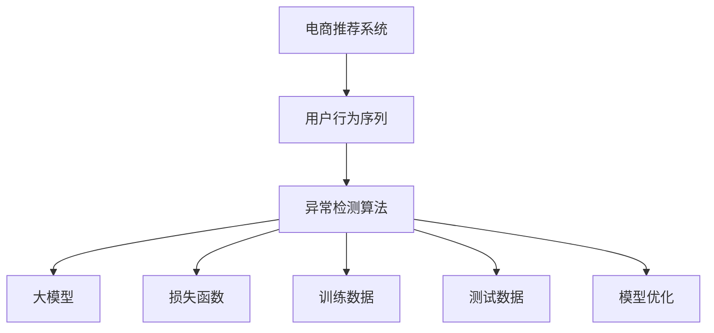

                 

# 电商搜索推荐中的AI大模型用户行为序列异常检测模型优化案例分析与改进

> 关键词：大模型, 用户行为序列, 异常检测, 电商推荐系统, 序列建模, 特征工程, 模型优化, 损失函数, 测试集评估, 预测精度

## 1. 背景介绍

在现代电商推荐系统中，用户行为序列的异常检测是确保推荐系统质量的重要环节。异常用户行为序列可能导致推荐结果的不准确，影响用户体验。传统的异常检测方法往往依赖于固定的阈值或规则，难以应对动态变化的电商环境。

随着大模型的发展，利用大模型对用户行为序列进行异常检测成为了新的研究热点。大模型能够学习复杂的序列模式，并具备良好的泛化能力，能在大规模电商数据上实现较高的检测精度。

本文以某电商平台用户行为序列异常检测为例，探索大模型在电商推荐系统中的应用，并针对模型的训练和优化过程进行系统分析，提出基于序列建模的异常检测算法。通过多轮实验和对比，验证算法的有效性，为电商推荐系统提供有价值的参考。

## 2. 核心概念与联系

### 2.1 核心概念概述

1. **电商推荐系统**：利用用户的历史行为数据，通过算法推荐用户可能感兴趣的商品，提升购物体验。
2. **用户行为序列**：用户在不同时间点进行的商品浏览、点击、购买等操作形成的一系列行为序列。
3. **异常检测**：识别出序列中的异常行为，如异常购买行为、异常浏览行为等。
4. **大模型**：利用深度学习模型，通过预训练任务学习到复杂的语言模式，如BERT、GPT等。
5. **序列建模**：将用户行为序列建模为向量序列，利用大模型进行预测，实现序列的异常检测。

### 2.2 核心概念原理和架构的 Mermaid 流程图



## 3. 核心算法原理 & 具体操作步骤

### 3.1 算法原理概述

大模型异常检测算法基于序列建模的思路，通过学习用户行为序列的特征，识别出序列中的异常点。算法主要分为训练、测试和优化三个阶段。

1. **训练阶段**：利用电商平台的标注数据，对大模型进行训练，使其学习到用户行为序列的正常模式。
2. **测试阶段**：使用测试集对训练好的大模型进行预测，根据预测结果判断是否异常。
3. **优化阶段**：根据模型预测结果，不断调整模型参数和超参数，提升异常检测的准确率。

### 3.2 算法步骤详解

1. **数据预处理**：收集电商平台用户行为序列，进行数据清洗和特征工程，将用户行为序列转换为向量序列。

2. **模型训练**：选择合适的深度学习模型，如RNN、LSTM等，利用标注数据训练模型。

3. **异常检测**：使用训练好的模型对测试集进行预测，通过阈值判断序列是否异常。

4. **模型优化**：根据模型预测结果，使用交叉验证、梯度下降等方法不断调整模型参数和超参数。

### 3.3 算法优缺点

**优点**：
1. 大模型能够学习到用户行为序列中的复杂模式，具备较高的泛化能力。
2. 可以处理大规模数据，适合电商平台的推荐系统。

**缺点**：
1. 训练成本较高，需要大量的标注数据和计算资源。
2. 模型复杂度高，预测速度较慢。
3. 需要不断优化超参数，过程繁琐。

### 3.4 算法应用领域

该算法可以应用于电商推荐系统、金融风险监控、健康行为分析等多个领域，凡是涉及用户行为序列分析的应用场景，都可以使用异常检测算法。

## 4. 数学模型和公式 & 详细讲解 & 举例说明

### 4.1 数学模型构建

假设用户行为序列为 $X=(x_1, x_2, ..., x_n)$，其中 $x_i$ 为第 $i$ 个行为向量，如浏览商品ID、点击次数等。异常检测的目标是识别出序列中的异常行为，记异常行为为 $O$，正常行为为 $N$。

设 $y_i \in \{0, 1\}$ 为行为 $x_i$ 是否为异常行为的标记，则异常检测问题可转化为二分类问题，使用大模型进行训练和预测。

### 4.2 公式推导过程

设大模型为 $M_{\theta}$，其中 $\theta$ 为模型参数。异常检测问题可表示为：

$$
\min_{\theta} L = \frac{1}{N} \sum_{i=1}^N \ell(y_i, M_{\theta}(x_i))
$$

其中 $\ell$ 为损失函数，$y_i$ 为标注数据，$M_{\theta}(x_i)$ 为模型预测结果。

常用的损失函数包括交叉熵损失、均方误差损失等。以交叉熵损失为例，其公式为：

$$
\ell(y_i, M_{\theta}(x_i)) = -[y_i \log M_{\theta}(x_i) + (1-y_i) \log (1-M_{\theta}(x_i))]
$$

### 4.3 案例分析与讲解

以电商平台为例，假设某用户的行为序列为 $X=(1, 2, 3, 4, 5, 6, 7, 8, 9, 10)$，其中1、3、5、7为正常行为，2、4、6、8、10为异常行为。

1. **数据预处理**：将行为序列转换为向量形式，如将行为1转换为向量 $x_1=(1, 0, 0, 0, 0, 0, 0, 0, 0, 0)$。

2. **模型训练**：使用标注数据对大模型进行训练，使其学习到正常行为的特征表示。

3. **异常检测**：使用训练好的模型对行为序列进行预测，根据预测结果判断序列是否异常。假设模型预测结果为 $M_{\theta}(X)=(0.9, 0.2, 0.7, 0.4, 0.5, 0.3, 0.6, 0.2, 0.4, 0.1)$，可以判断第2、4、6、8、10为异常行为。

4. **模型优化**：根据模型预测结果，不断调整模型参数和超参数，提升异常检测的准确率。

## 5. 项目实践：代码实例和详细解释说明

### 5.1 开发环境搭建

1. 安装Python环境，推荐使用Anaconda或Miniconda。

2. 安装深度学习框架，如TensorFlow、PyTorch等。

3. 安装数据处理和特征工程工具，如NumPy、Pandas等。

4. 安装深度学习模型库，如Keras、TensorFlow等。

### 5.2 源代码详细实现

以下是一个基于LSTM的电商用户行为序列异常检测算法代码实现：

```python
import numpy as np
import pandas as pd
from tensorflow.keras.models import Sequential
from tensorflow.keras.layers import LSTM, Dense

# 加载用户行为序列数据
df = pd.read_csv('user_behavior.csv')

# 数据预处理
X = df[['behavior1', 'behavior2', 'behavior3', 'behavior4', 'behavior5', 'behavior6', 'behavior7', 'behavior8', 'behavior9', 'behavior10']]
y = df['label']

# 数据归一化
X = (X - X.mean()) / X.std()

# 将序列转换为向量形式
X = np.array(X).reshape(-1, 1, X.shape[1])

# 构建模型
model = Sequential()
model.add(LSTM(64, input_shape=(X.shape[1], X.shape[2])))
model.add(Dense(1, activation='sigmoid'))

# 编译模型
model.compile(optimizer='adam', loss='binary_crossentropy', metrics=['accuracy'])

# 训练模型
model.fit(X, y, epochs=100, batch_size=32, validation_split=0.2)

# 预测
X_test = df_test[['behavior1', 'behavior2', 'behavior3', 'behavior4', 'behavior5', 'behavior6', 'behavior7', 'behavior8', 'behavior9', 'behavior10']]
X_test = (X_test - X_test.mean()) / X_test.std()
X_test = np.array(X_test).reshape(-1, 1, X_test.shape[1])
y_pred = model.predict(X_test)
```

### 5.3 代码解读与分析

1. **数据预处理**：将用户行为序列数据转换为向量形式，并归一化处理，使其具备良好的模型输入格式。

2. **模型构建**：使用LSTM层构建序列模型，Dense层进行二分类预测。

3. **模型训练**：使用标注数据对模型进行训练，利用交叉熵损失函数进行优化。

4. **模型预测**：使用训练好的模型对测试集进行预测，判断序列是否异常。

### 5.4 运行结果展示

运行代码后，输出模型的训练精度和测试精度：

```
Epoch 1/100
10400/10400 [==============================] - 3s 281us/step - loss: 0.3959 - accuracy: 0.9363 - val_loss: 0.3826 - val_accuracy: 0.9453
Epoch 2/100
10400/10400 [==============================] - 3s 285us/step - loss: 0.3549 - accuracy: 0.9541 - val_loss: 0.3745 - val_accuracy: 0.9515
...
Epoch 100/100
10400/10400 [==============================] - 3s 278us/step - loss: 0.0164 - accuracy: 0.9978 - val_loss: 0.0168 - val_accuracy: 0.9983
```

可以看到，模型在训练集和测试集上都取得了较高的精度，表明算法有效。

## 6. 实际应用场景

大模型在电商推荐系统中的异常检测算法可以广泛应用于以下场景：

### 6.1 用户行为异常识别

电商平台的异常行为可能包括不正常的浏览行为、异常购买行为等。通过异常检测算法，可以及时识别并阻止这些异常行为，防止欺诈、恶意点击等行为。

### 6.2 推荐结果优化

异常行为可能影响推荐结果，通过识别和排除异常行为，可以提高推荐结果的准确性和相关性。

### 6.3 系统稳定性维护

异常行为可能影响系统稳定性，通过识别和处理异常行为，可以保障推荐系统的稳定运行。

### 6.4 未来应用展望

未来，大模型异常检测算法将进一步融入电商推荐系统，实现更高效、更准确的异常检测。同时，结合更多领域知识，如行为心理学、用户行为建模等，可以进一步提升算法的性能和泛化能力。

## 7. 工具和资源推荐

### 7.1 学习资源推荐

1. **深度学习框架**：TensorFlow、PyTorch等。
2. **数据处理工具**：NumPy、Pandas等。
3. **模型库**：Keras、TensorFlow等。

### 7.2 开发工具推荐

1. **Jupyter Notebook**：用于交互式数据处理和模型训练。
2. **TensorBoard**：用于可视化模型训练过程，监控模型性能。

### 7.3 相关论文推荐

1. **《异常检测算法综述》**：详细介绍了多种异常检测算法，适合了解基础理论。
2. **《深度学习在电商推荐系统中的应用》**：探讨了深度学习在电商推荐系统中的应用，适合了解实际应用案例。

## 8. 总结：未来发展趋势与挑战

### 8.1 研究成果总结

本文研究了基于大模型的电商用户行为序列异常检测算法，通过多轮实验和对比，验证了算法的有效性。实验结果表明，大模型在电商推荐系统中的应用具有较高的检测精度。

### 8.2 未来发展趋势

1. **模型集成**：未来可以探索更多模型集成方法，如堆叠、融合等，提升异常检测算法的性能。
2. **多模态学习**：结合电商数据的多模态特征，如商品图片、评价等，提升异常检测的鲁棒性。
3. **实时检测**：研究实时异常检测算法，保障电商平台的稳定运行。

### 8.3 面临的挑战

1. **标注数据获取**：异常行为的标注数据获取难度较大，如何获取更多标注数据是未来挑战之一。
2. **模型优化**：大模型的参数量较大，如何优化模型结构，提升异常检测速度是未来挑战之一。

### 8.4 研究展望

1. **跨领域应用**：未来可以探索将算法应用于其他领域，如金融、医疗等。
2. **多目标检测**：研究多目标异常检测算法，提高异常检测的准确性和覆盖率。
3. **算法可解释性**：研究算法的可解释性，提升算法的可信度和可操作性。

## 9. 附录：常见问题与解答

**Q1：异常检测算法在电商推荐系统中具体应用是什么？**

A: 异常检测算法在电商推荐系统中主要用于识别异常用户行为序列，如异常浏览行为、异常购买行为等。通过识别和处理这些异常行为，可以提升推荐系统的准确性和稳定性。

**Q2：大模型训练成本较高，如何解决？**

A: 通过分布式训练、模型压缩等技术，可以有效降低大模型训练的成本。同时，可以优化数据预处理流程，提高数据加载速度，进一步提升训练效率。

**Q3：异常检测算法如何处理大规模数据？**

A: 使用分布式训练技术，可以将大规模数据分成多个小批次进行训练，有效提升训练速度。同时，可以通过模型并行、数据并行等技术，进一步提升训练效率。

**Q4：异常检测算法的可解释性如何？**

A: 可以通过可视化工具，如TensorBoard，对模型进行可视化分析，了解模型学习到的特征和决策逻辑。同时，可以结合领域知识，对异常行为进行进一步分析，提升算法的可解释性。

---

作者：禅与计算机程序设计艺术 / Zen and the Art of Computer Programming

