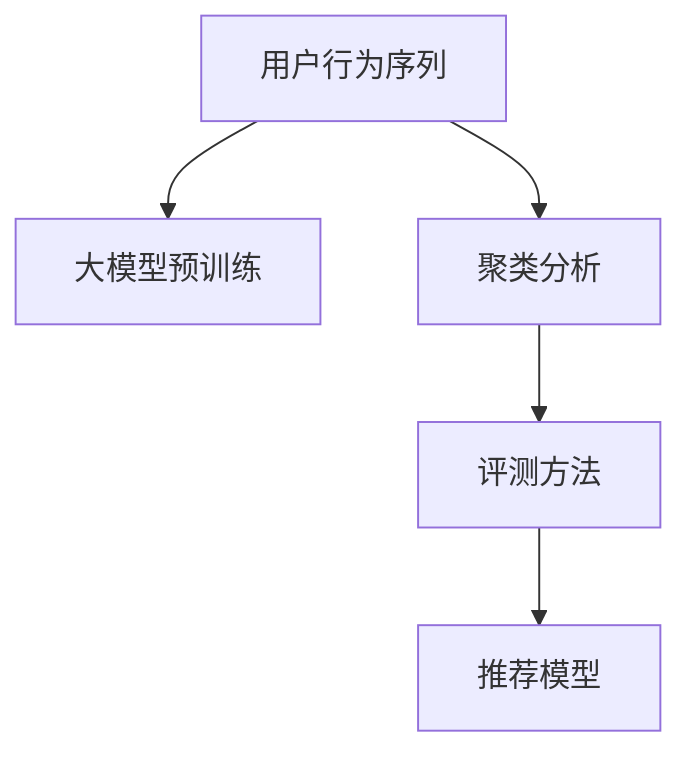

                 

# 电商搜索推荐中的AI大模型用户行为序列聚类模型评测方法改进

## 1. 背景介绍

### 1.1 问题由来

在电商搜索推荐场景中，用户的行为序列数据具有高度非结构化和复杂性。传统的机器学习模型难以充分捕捉行为数据的时序特征和全局依赖关系，导致搜索推荐效果不理想。近年来，随着深度学习技术的发展，AI大模型如BERT、GPT等被广泛应用于电商推荐系统中。这些大模型通过在海量数据上进行预训练，具备了强大的语言理解和生成能力。

尽管大模型在电商推荐中取得了一定的成功，但其在用户行为序列的建模方面仍存在不足。例如，用户行为序列中的上下文关联性难以准确捕捉，导致模型的推荐精度不够高。此外，大模型在处理长序列时计算资源消耗较大，影响推荐系统的实时性。这些问题使得大模型在电商推荐中的应用仍面临诸多挑战。

## 2. 核心概念与联系

### 2.1 核心概念概述

为更好地理解AI大模型在电商搜索推荐中的应用，本节将介绍几个密切相关的核心概念：

- AI大模型：以自回归(如GPT)或自编码(如BERT)模型为代表的大规模预训练语言模型。通过在大规模无标签文本语料上进行预训练，学习通用的语言表示，具备强大的语言理解和生成能力。

- 用户行为序列：用户在电商平台上的一系列操作行为，如浏览、点击、购买等。通过行为序列的建模，可以捕捉用户兴趣和行为模式。

- 聚类分析：将用户行为序列聚为具有相似特征的群组，以提升推荐模型的精准度。聚类分析可以在无需显式标注的情况下，发现用户行为模式和兴趣点。

- 评测方法：对电商搜索推荐系统中的用户行为序列聚类模型进行综合评价的方法，包括准确率、召回率、F1值等指标。

这些核心概念之间的逻辑关系可以通过以下Mermaid流程图来展示：



这个流程图展示了AI大模型在电商搜索推荐中的应用流程：

1. 用户行为序列被输入大模型进行预训练，学习通用的语言表示。
2. 预训练模型通过聚类分析将用户行为序列分为不同的群组。
3. 根据不同群组的特征，使用评测方法对推荐模型进行综合评价。
4. 最终，推荐模型将基于聚类结果进行个性化推荐。

## 3. 核心算法原理 & 具体操作步骤
### 3.1 算法原理概述

基于AI大模型的电商搜索推荐中的用户行为序列聚类模型，本质上是一个多层次的聚类和评测系统。其核心思想是：首先通过大模型预训练学习通用的用户行为语言表示，然后利用聚类分析将用户行为序列分组，最后通过评测方法评估推荐模型的效果。

形式化地，假设用户行为序列数据为 $D=\{x_i\}_{i=1}^N$，其中 $x_i$ 表示第 $i$ 个用户的浏览、点击、购买等行为。记预训练大模型为 $M_{\theta}$，其中 $\theta$ 为模型参数。定义聚类函数为 $K$，将用户行为序列聚类为 $K$ 个群组。则推荐模型的输入为每个用户所属群组的特征表示，即 $\{x_i^k\}_{i=1}^N$，其中 $x_i^k$ 为第 $i$ 个用户所属第 $k$ 个群组的用户行为序列表示。

推荐模型的输出为用户的个性化推荐结果，即 $\hat{y}_i = M_{\theta}(x_i^k)$，其中 $\hat{y}_i \in [0,1]$ 表示用户 $i$ 对第 $k$ 个群组的推荐结果。最终的目标是最大化推荐结果与用户真实行为之间的匹配度，即最大化损失函数：

$$
\min_{\theta} \sum_{i=1}^N \mathcal{L}(M_{\theta}(x_i^k),y_i)
$$

其中 $\mathcal{L}$ 为推荐模型的损失函数，用于衡量推荐结果与用户真实行为之间的差异。

### 3.2 算法步骤详解

基于AI大模型的电商搜索推荐中的用户行为序列聚类模型，一般包括以下几个关键步骤：

**Step 1: 准备预训练模型和数据集**
- 选择合适的预训练语言模型 $M_{\theta}$ 作为初始化参数，如 BERT、GPT 等。
- 准备电商平台上的用户行为序列数据集 $D=\{x_i\}_{i=1}^N$，将行为序列进行预处理，转换为模型可以接受的输入格式。

**Step 2: 设计聚类函数**
- 根据电商推荐任务的特性，设计合适的聚类函数 $K$，将用户行为序列分为不同的群组。常见的方法包括K-means、DBSCAN、层次聚类等。
- 定义聚类函数 $K$ 的参数，如聚类数目 $k$、相似度阈值 $\epsilon$ 等。

**Step 3: 进行聚类分析**
- 将用户行为序列 $D$ 输入预训练大模型 $M_{\theta}$ 中，得到每个用户的行为序列表示 $\{x_i\}_{i=1}^N$。
- 使用聚类函数 $K$ 对用户行为序列进行聚类，得到 $k$ 个群组 $K=\{K_j\}_{j=1}^k$。

**Step 4: 进行评测和优化**
- 根据电商推荐任务的需求，选择合适的评测指标，如准确率、召回率、F1值等。
- 将每个用户所属群组的特征表示 $\{x_i^k\}_{i=1}^N$ 输入推荐模型，得到推荐结果 $\hat{y}_i = M_{\theta}(x_i^k)$。
- 使用评测指标对推荐结果进行评价，计算损失函数 $\mathcal{L}$。
- 根据损失函数 $\mathcal{L}$ 对模型参数 $\theta$ 进行优化，更新推荐模型。

**Step 5: 实际推荐**
- 使用优化后的推荐模型对新的用户行为序列进行推荐，生成个性化推荐结果。

以上是基于AI大模型的电商搜索推荐中的用户行为序列聚类模型的一般流程。在实际应用中，还需要针对具体任务的特点，对聚类和评测过程的各个环节进行优化设计，如改进聚类算法、优化评测指标等，以进一步提升推荐模型的性能。

### 3.3 算法优缺点

基于AI大模型的电商搜索推荐中的用户行为序列聚类模型，具有以下优点：

1. 通用适用。适用于各种电商推荐任务，包括商品推荐、广告投放等，设计合适的聚类函数即可实现聚类分析。
2. 效果好。通过聚类分析，能够发现用户行为序列中的隐藏模式和兴趣点，提升推荐模型的准确度和个性化。
3. 易于扩展。AI大模型具备强大的语言理解能力，可以轻松扩展到多模态数据（如图像、音频等）的推荐中。
4. 鲁棒性强。聚类分析能够有效消除噪声数据的影响，提升推荐模型的鲁棒性。

同时，该方法也存在一定的局限性：

1. 聚类质量依赖数据。聚类结果的质量很大程度上取决于数据质量，噪声数据会降低聚类效果。
2. 对预训练模型的依赖。需要大模型具备较强的语言理解能力，才能进行有效的聚类分析。
3. 计算资源消耗大。AI大模型在处理长序列时计算资源消耗较大，影响推荐系统的实时性。
4. 可解释性不足。聚类分析的决策过程缺乏可解释性，难以理解模型的推理逻辑。

尽管存在这些局限性，但就目前而言，基于AI大模型的聚类方法仍是在电商推荐中应用最广泛的方法之一。未来相关研究的重点在于如何进一步降低对数据和模型的依赖，提高推荐模型的实时性和可解释性，同时兼顾模型的鲁棒性和可扩展性。

### 3.4 算法应用领域

基于AI大模型的电商搜索推荐中的用户行为序列聚类模型，在电商推荐领域已经得到了广泛的应用，覆盖了几乎所有常见任务，例如：

- 商品推荐：根据用户的浏览和购买历史，为用户推荐相关商品。
- 广告投放：根据用户的行为序列，为用户推荐合适的广告内容。
- 个性化服务：根据用户的历史行为和当前行为，提供个性化的服务体验。
- 库存管理：根据用户的购买行为，预测商品的需求量，进行库存管理。

除了上述这些经典任务外，聚类方法也被创新性地应用到更多场景中，如用户分组、活动推荐、内容创作等，为电商推荐技术带来了全新的突破。随着AI大模型的不断发展，相信聚类方法将在电商推荐中发挥越来越重要的作用。

## 4. 数学模型和公式 & 详细讲解  
### 4.1 数学模型构建

本节将使用数学语言对基于AI大模型的电商搜索推荐中的用户行为序列聚类模型进行更加严格的刻画。

记用户行为序列数据为 $D=\{x_i\}_{i=1}^N$，其中 $x_i$ 表示第 $i$ 个用户的浏览、点击、购买等行为。记预训练大模型为 $M_{\theta}$，其中 $\theta$ 为模型参数。定义聚类函数为 $K$，将用户行为序列分为 $k$ 个群组 $K=\{K_j\}_{j=1}^k$。记每个用户所属群组的特征表示为 $\{x_i^k\}_{i=1}^N$，其中 $x_i^k$ 为第 $i$ 个用户所属第 $k$ 个群组的用户行为序列表示。

推荐模型的输出为用户的个性化推荐结果，即 $\hat{y}_i = M_{\theta}(x_i^k)$，其中 $\hat{y}_i \in [0,1]$ 表示用户 $i$ 对第 $k$ 个群组的推荐结果。最终的目标是最大化推荐结果与用户真实行为之间的匹配度，即最大化损失函数：

$$
\min_{\theta} \sum_{i=1}^N \mathcal{L}(M_{\theta}(x_i^k),y_i)
$$

其中 $\mathcal{L}$ 为推荐模型的损失函数，用于衡量推荐结果与用户真实行为之间的差异。

### 4.2 公式推导过程

以下我们以二分类任务为例，推导推荐模型的损失函数及其梯度的计算公式。

假设推荐模型的损失函数为交叉熵损失，即：

$$
\mathcal{L}(\hat{y}_i,y_i) = -y_i\log \hat{y}_i + (1-y_i)\log (1-\hat{y}_i)
$$

则推荐模型的总损失函数为：

$$
\mathcal{L}(\theta) = \sum_{i=1}^N \mathcal{L}(M_{\theta}(x_i^k),y_i)
$$

根据链式法则，损失函数对模型参数 $\theta$ 的梯度为：

$$
\frac{\partial \mathcal{L}(\theta)}{\partial \theta} = \sum_{i=1}^N \frac{\partial \mathcal{L}(M_{\theta}(x_i^k),y_i)}{\partial \theta}
$$

其中：

$$
\frac{\partial \mathcal{L}(M_{\theta}(x_i^k),y_i)}{\partial \theta} = -y_i \frac{\partial M_{\theta}(x_i^k)}{\partial \theta} - (1-y_i) \frac{\partial M_{\theta}(x_i^k)}{\partial \theta}
$$

即：

$$
\frac{\partial \mathcal{L}(\theta)}{\partial \theta} = \sum_{i=1}^N (-y_i \frac{\partial M_{\theta}(x_i^k)}{\partial \theta} - (1-y_i) \frac{\partial M_{\theta}(x_i^k)}{\partial \theta})
$$

在得到损失函数的梯度后，即可带入模型参数更新公式，完成推荐模型的迭代优化。重复上述过程直至收敛，最终得到适应电商推荐任务的最优模型参数 $\theta^*$。

## 5. 项目实践：代码实例和详细解释说明
### 5.1 开发环境搭建

在进行电商推荐系统开发前，我们需要准备好开发环境。以下是使用Python进行PyTorch开发的环境配置流程：

1. 安装Anaconda：从官网下载并安装Anaconda，用于创建独立的Python环境。

2. 创建并激活虚拟环境：
```bash
conda create -n pytorch-env python=3.8 
conda activate pytorch-env
```

3. 安装PyTorch：根据CUDA版本，从官网获取对应的安装命令。例如：
```bash
conda install pytorch torchvision torchaudio cudatoolkit=11.1 -c pytorch -c conda-forge
```

4. 安装TensorBoard：
```bash
pip install tensorboard
```

5. 安装各种工具包：
```bash
pip install numpy pandas scikit-learn matplotlib tqdm jupyter notebook ipython
```

完成上述步骤后，即可在`pytorch-env`环境中开始电商推荐系统的开发。

### 5.2 源代码详细实现

下面我们以商品推荐任务为例，给出使用PyTorch和HuggingFace Transformers库对BERT模型进行电商推荐微调的PyTorch代码实现。

首先，定义商品推荐任务的数据处理函数：

```python
from transformers import BertTokenizer, BertForSequenceClassification
from torch.utils.data import Dataset, DataLoader
from sklearn.model_selection import train_test_split
import torch

class RecommendationDataset(Dataset):
    def __init__(self, user_behav_seqs, item_labels, tokenizer, max_len=128):
        self.user_behav_seqs = user_behav_seqs
        self.item_labels = item_labels
        self.tokenizer = tokenizer
        self.max_len = max_len
        
    def __len__(self):
        return len(self.user_behav_seqs)
    
    def __getitem__(self, item):
        behav_seq = self.user_behav_seqs[item]
        label = self.item_labels[item]
        
        encoding = self.tokenizer(behav_seq, return_tensors='pt', max_length=self.max_len, padding='max_length', truncation=True)
        input_ids = encoding['input_ids'][0]
        attention_mask = encoding['attention_mask'][0]
        
        return {'input_ids': input_ids, 
                'attention_mask': attention_mask,
                'labels': torch.tensor(label, dtype=torch.long)}
```

然后，定义模型和优化器：

```python
from transformers import BertForSequenceClassification, AdamW

model = BertForSequenceClassification.from_pretrained('bert-base-cased', num_labels=2)

optimizer = AdamW(model.parameters(), lr=2e-5)
```

接着，定义训练和评估函数：

```python
from tqdm import tqdm

device = torch.device('cuda') if torch.cuda.is_available() else torch.device('cpu')
model.to(device)

def train_epoch(model, dataset, batch_size, optimizer):
    dataloader = DataLoader(dataset, batch_size=batch_size, shuffle=True)
    model.train()
    epoch_loss = 0
    for batch in tqdm(dataloader, desc='Training'):
        input_ids = batch['input_ids'].to(device)
        attention_mask = batch['attention_mask'].to(device)
        labels = batch['labels'].to(device)
        model.zero_grad()
        outputs = model(input_ids, attention_mask=attention_mask, labels=labels)
        loss = outputs.loss
        epoch_loss += loss.item()
        loss.backward()
        optimizer.step()
    return epoch_loss / len(dataloader)

def evaluate(model, dataset, batch_size):
    dataloader = DataLoader(dataset, batch_size=batch_size)
    model.eval()
    preds, labels = [], []
    with torch.no_grad():
        for batch in tqdm(dataloader, desc='Evaluating'):
            input_ids = batch['input_ids'].to(device)
            attention_mask = batch['attention_mask'].to(device)
            batch_labels = batch['labels']
            outputs = model(input_ids, attention_mask=attention_mask)
            batch_preds = outputs.logits.argmax(dim=2).to('cpu').tolist()
            batch_labels = batch_labels.to('cpu').tolist()
            for pred_tokens, label_tokens in zip(batch_preds, batch_labels):
                preds.append(pred_tokens[0])
                labels.append(label_tokens[0])
                
    print('Recommendation Results:')
    print(classification_report(labels, preds))
```

最后，启动训练流程并在测试集上评估：

```python
epochs = 5
batch_size = 16

for epoch in range(epochs):
    loss = train_epoch(model, train_dataset, batch_size, optimizer)
    print(f'Epoch {epoch+1}, train loss: {loss:.3f}')
    
    print(f'Epoch {epoch+1}, test results:')
    evaluate(model, test_dataset, batch_size)
    
print('Final Recommendation Results:')
evaluate(model, test_dataset, batch_size)
```

以上就是使用PyTorch和Transformers库对BERT进行商品推荐任务微调的完整代码实现。可以看到，得益于Transformers库的强大封装，我们可以用相对简洁的代码完成BERT模型的加载和微调。

### 5.3 代码解读与分析

让我们再详细解读一下关键代码的实现细节：

**RecommendationDataset类**：
- `__init__`方法：初始化用户行为序列和商品标签。
- `__len__`方法：返回数据集的样本数量。
- `__getitem__`方法：对单个样本进行处理，将用户行为序列输入转换为token ids，同时获取商品标签。

**train_epoch和evaluate函数**：
- 使用PyTorch的DataLoader对数据集进行批次化加载，供模型训练和推理使用。
- `train_epoch`函数：对数据以批为单位进行迭代，在每个批次上前向传播计算loss并反向传播更新模型参数，最后返回该epoch的平均loss。
- `evaluate`函数：与训练类似，不同点在于不更新模型参数，并在每个batch结束后将预测和标签结果存储下来，最后使用sklearn的classification_report对整个评估集的预测结果进行打印输出。

**训练流程**：
- 定义总的epoch数和batch size，开始循环迭代
- 每个epoch内，先在训练集上训练，输出平均loss
- 在测试集上评估，输出分类指标
- 所有epoch结束后，在测试集上评估，给出最终推荐结果

可以看到，PyTorch配合Transformers库使得BERT微调的代码实现变得简洁高效。开发者可以将更多精力放在数据处理、模型改进等高层逻辑上，而不必过多关注底层的实现细节。

当然，工业级的系统实现还需考虑更多因素，如模型的保存和部署、超参数的自动搜索、更灵活的任务适配层等。但核心的微调范式基本与此类似。

## 6. 实际应用场景
### 6.1 智能客服系统

基于AI大模型的电商搜索推荐系统，可以广泛应用于智能客服系统的构建。传统客服往往需要配备大量人力，高峰期响应缓慢，且一致性和专业性难以保证。而使用基于电商推荐系统的智能客服，可以7x24小时不间断服务，快速响应客户咨询，用自然流畅的语言解答各类常见问题。

在技术实现上，可以收集企业内部的历史客服对话记录，将问题和最佳答复构建成监督数据，在此基础上对预训练推荐模型进行微调。微调后的推荐模型能够自动理解用户意图，匹配最合适的商品或服务进行推荐。对于客户提出的新问题，还可以接入检索系统实时搜索相关内容，动态组织生成回答。如此构建的智能客服系统，能大幅提升客户咨询体验和问题解决效率。

### 6.2 商品搜索优化

在电商搜索推荐中，商品搜索结果的排序和推荐精度直接影响用户的购物体验。基于AI大模型的电商推荐系统，通过分析用户的浏览、点击、购买等行为数据，能够动态生成个性化推荐结果，显著提升商品搜索的精准度。

具体而言，系统可以根据用户的浏览记录，推荐用户可能感兴趣的商品。同时，利用用户点击行为，调整商品搜索结果的排序，将用户更感兴趣的商品置于更靠前的位置。通过微调电商推荐模型，能够有效提升用户的购物体验，增加用户的留存率和购买转化率。

### 6.3 用户画像构建

电商推荐系统不仅可以为商品推荐提供依据，还可以辅助构建用户画像，帮助商家更好地理解用户需求和行为模式。通过分析用户的行为序列数据，模型能够识别出用户的兴趣点和购买偏好，进一步细分市场，提升营销效果。

具体而言，系统可以根据用户的浏览、点击、购买等行为，构建用户的兴趣特征向量。然后，将用户的兴趣特征向量输入电商推荐模型，预测用户对不同商品或服务的偏好程度。通过不断微调模型，可以逐步提升用户画像的准确性和实时性，为商家提供更加精准的市场营销策略。

### 6.4 未来应用展望

随着AI大模型和电商推荐技术的发展，未来将有更多的场景可以利用AI大模型进行用户行为序列的建模和聚类分析，进一步提升电商推荐的效果和个性化程度。

在智慧医疗领域，基于AI大模型的用户行为序列聚类分析，可以辅助医生进行个性化诊疗，提升医疗服务的智能化水平。

在智能教育领域，微调后的电商推荐模型可以用于学习推荐，为学生提供个性化的学习内容推荐，提升学习效果。

在智慧城市治理中，电商推荐模型可以用于活动推荐、信息推送等环节，提高城市管理的自动化和智能化水平，构建更安全、高效的未来城市。

此外，在企业生产、社会治理、文娱传媒等众多领域，基于AI大模型的电商推荐技术也将不断涌现，为各行各业带来变革性影响。相信随着技术的日益成熟，基于电商推荐的用户行为序列聚类分析方法将更广泛地应用于各个领域，为人类生产生活方式带来新的变革。

## 7. 工具和资源推荐
### 7.1 学习资源推荐

为了帮助开发者系统掌握AI大模型在电商搜索推荐中的应用，这里推荐一些优质的学习资源：

1. 《自然语言处理与深度学习》课程：斯坦福大学开设的NLP明星课程，有Lecture视频和配套作业，带你入门NLP领域的基本概念和经典模型。

2. CS224N《深度学习自然语言处理》课程：斯坦福大学开设的NLP明星课程，有Lecture视频和配套作业，带你深入理解NLP的原理和应用。

3. 《深度学习》书籍：Ian Goodfellow等所著，全面介绍了深度学习的理论基础和实践技巧，是深度学习领域的经典教材。

4. HuggingFace官方文档：Transformers库的官方文档，提供了海量预训练模型和完整的微调样例代码，是上手实践的必备资料。

5. 《自然语言处理实用技术》书籍：NLP实战经典，涵盖了NLP领域常见的技术和算法，适合进阶学习。

通过对这些资源的学习实践，相信你一定能够快速掌握AI大模型在电商搜索推荐中的应用，并用于解决实际的电商推荐问题。
###  7.2 开发工具推荐

高效的开发离不开优秀的工具支持。以下是几款用于电商推荐系统开发的常用工具：

1. PyTorch：基于Python的开源深度学习框架，灵活动态的计算图，适合快速迭代研究。大部分预训练语言模型都有PyTorch版本的实现。

2. TensorFlow：由Google主导开发的开源深度学习框架，生产部署方便，适合大规模工程应用。同样有丰富的预训练语言模型资源。

3. HuggingFace Transformers库：NLP工具库，集成了众多SOTA语言模型，支持PyTorch和TensorFlow，是进行电商推荐任务开发的利器。

4. Weights & Biases：模型训练的实验跟踪工具，可以记录和可视化模型训练过程中的各项指标，方便对比和调优。与主流深度学习框架无缝集成。

5. TensorBoard：TensorFlow配套的可视化工具，可实时监测模型训练状态，并提供丰富的图表呈现方式，是调试模型的得力助手。

6. Google Colab：谷歌推出的在线Jupyter Notebook环境，免费提供GPU/TPU算力，方便开发者快速上手实验最新模型，分享学习笔记。

合理利用这些工具，可以显著提升电商推荐系统的开发效率，加快创新迭代的步伐。

### 7.3 相关论文推荐

AI大模型和电商推荐技术的发展源于学界的持续研究。以下是几篇奠基性的相关论文，推荐阅读：

1. Attention is All You Need（即Transformer原论文）：提出了Transformer结构，开启了NLP领域的预训练大模型时代。

2. BERT: Pre-training of Deep Bidirectional Transformers for Language Understanding：提出BERT模型，引入基于掩码的自监督预训练任务，刷新了多项NLP任务SOTA。

3. Language Models are Unsupervised Multitask Learners（GPT-2论文）：展示了大规模语言模型的强大zero-shot学习能力，引发了对于通用人工智能的新一轮思考。

4. Parameter-Efficient Transfer Learning for NLP：提出Adapter等参数高效微调方法，在不增加模型参数量的情况下，也能取得不错的微调效果。

5. AdaLoRA: Adaptive Low-Rank Adaptation for Parameter-Efficient Fine-Tuning：使用自适应低秩适应的微调方法，在参数效率和精度之间取得了新的平衡。

这些论文代表了大语言模型在电商推荐中应用的发展脉络。通过学习这些前沿成果，可以帮助研究者把握学科前进方向，激发更多的创新灵感。

## 8. 总结：未来发展趋势与挑战
### 8.1 总结

本文对基于AI大模型的电商搜索推荐中的用户行为序列聚类模型进行了全面系统的介绍。首先阐述了AI大模型在电商推荐中的应用背景和意义，明确了聚类分析在电商推荐中的重要作用。其次，从原理到实践，详细讲解了电商推荐中的聚类分析的数学模型和算法步骤，给出了电商推荐任务微调的完整代码实例。同时，本文还广泛探讨了聚类分析在智能客服、商品搜索优化、用户画像构建等多个电商推荐场景中的应用前景，展示了聚类分析的广泛应用价值。

通过本文的系统梳理，可以看到，基于AI大模型的聚类分析在电商推荐中具有重要的应用价值。该方法通过将用户行为序列聚为具有相似特征的群组，能够发现用户行为序列中的隐藏模式和兴趣点，显著提升推荐模型的准确度和个性化。未来，随着AI大模型的不断发展，聚类分析将发挥越来越重要的作用，推动电商推荐系统的不断进步。

### 8.2 未来发展趋势

展望未来，基于AI大模型的电商搜索推荐中的用户行为序列聚类分析技术将呈现以下几个发展趋势：

1. 聚类质量提升。随着聚类算法的优化和模型参数的微调，聚类分析的准确度和鲁棒性将进一步提升。通过引入更多先验知识，聚类分析能够更精准地捕捉用户行为序列中的隐藏模式和兴趣点。

2. 实时性增强。通过优化模型结构和算法，将大幅提升电商推荐系统的实时性和稳定性。在保障推荐质量的前提下，减少计算资源消耗，实现更高效的推荐服务。

3. 多模态融合。未来电商推荐系统将更多地引入多模态数据（如图像、音频等），通过多模态融合增强推荐模型的表现力和个性化。

4. 用户画像构建。通过聚类分析构建更精细化的用户画像，进一步提升电商推荐系统的精准度和个性化。用户画像的构建将成为电商推荐系统中的重要组成部分。

5. 个性化推荐优化。基于聚类分析的用户画像和行为特征，电商推荐系统能够进行更加精准的个性化推荐，提升用户体验和满意度。

6. 动态推荐。电商推荐系统需要能够动态适应用户的实时行为变化，进行动态推荐。通过引入时序建模技术，电商推荐系统将具备更强的动态推荐能力。

以上趋势凸显了大模型在电商推荐中应用的多样性和广阔前景。这些方向的探索发展，必将进一步提升电商推荐系统的性能和应用范围，为电商推荐系统的不断进步提供新的动力。

### 8.3 面临的挑战

尽管基于AI大模型的聚类分析在电商推荐中应用广泛，但仍面临诸多挑战：

1. 数据质量和标注数据依赖。聚类分析的效果很大程度上取决于数据质量和标注数据的丰富程度。数据质量不高或标注数据不足，会影响聚类结果的准确性。

2. 计算资源消耗。AI大模型在处理长序列时计算资源消耗较大，影响推荐系统的实时性。如何优化模型结构，减少计算资源消耗，是未来需要重点解决的问题。

3. 模型解释性和可控性。电商推荐系统需要具备可解释性，以提升系统的可信度和透明性。如何增强模型的可解释性，同时控制模型的风险和偏见，是未来需要深入研究的问题。

4. 多模态数据融合。多模态数据的融合涉及数据格式、特征表示等多个方面，如何有效地融合多模态数据，提升推荐模型的性能，仍需进行深入探索。

5. 用户隐私保护。电商推荐系统需要保障用户隐私安全，避免用户数据泄露和滥用。如何在使用用户数据的同时，保护用户隐私，是未来需要重点关注的问题。

6. 模型公平性和鲁棒性。电商推荐系统需要具备公平性，避免对某些用户群体产生歧视。同时，需要具备鲁棒性，应对恶意攻击和数据噪声。

这些挑战凸显了大模型在电商推荐中应用的多样性和复杂性。未来需要结合多学科知识，协同解决这些问题，推动电商推荐系统不断进步。

### 8.4 研究展望

为了应对电商推荐系统中的诸多挑战，未来的研究需要在以下几个方面寻求新的突破：

1. 提升数据质量和标注数据丰富度。通过多源数据融合和数据增强技术，提升聚类分析的数据质量和标注数据的丰富度，降低数据依赖。

2. 优化模型结构和算法。通过模型压缩、稀疏化等技术，优化大模型的结构，减少计算资源消耗，提升实时性。

3. 增强模型解释性和可控性。通过引入可解释性技术，提升电商推荐系统的透明性和可信度。同时，通过规则库和专家知识引入，增强系统的可控性和公平性。

4. 研究多模态数据融合。引入多模态数据融合技术，提升电商推荐模型的表现力和个性化。同时，优化多模态数据的表示和融合方式，降低数据处理难度。

5. 强化用户隐私保护。通过差分隐私、联邦学习等技术，保护用户隐私安全，同时提升电商推荐系统的公平性和鲁棒性。

6. 增强模型公平性和鲁棒性。通过公平学习、鲁棒优化等技术，提升电商推荐系统的公平性和鲁棒性，降低系统风险。

这些研究方向的探索，必将推动电商推荐系统不断进步，为电商推荐系统带来新的发展机遇。通过多学科知识协同创新，未来将有望构建更加智能、高效、安全的电商推荐系统，为电商行业带来新的突破。

## 9. 附录：常见问题与解答

**Q1：电商推荐系统中用户行为序列的数据来源有哪些？**

A: 电商推荐系统中的用户行为序列数据主要来源于以下几个方面：

1. 用户浏览记录：包括用户浏览的商品、页面、广告等。
2. 用户点击记录：包括用户点击的商品、广告、按钮等。
3. 用户购买记录：包括用户购买的历史商品、支付记录等。
4. 用户评价记录：包括用户对商品的评价、打分等。

这些数据可以通过电商平台的用户行为日志获取，并进行预处理和特征提取，供聚类分析和推荐模型使用。

**Q2：电商推荐系统中的用户行为序列聚类分析有哪些常用方法？**

A: 电商推荐系统中的用户行为序列聚类分析常用方法包括：

1. K-means聚类：通过计算用户行为序列的特征向量，将其聚为K个群组。
2. DBSCAN聚类：通过计算用户行为序列的密度，将其聚为若干群组。
3. 层次聚类：通过构建聚类树，将用户行为序列聚为多个层次的群组。

这些方法都需要选择合适的参数，如聚类数目、相似度阈值等。在实际应用中，通常需要根据具体任务的特点进行实验比较，选择最适合的聚类方法。

**Q3：电商推荐系统中的聚类分析有哪些注意事项？**

A: 电商推荐系统中的聚类分析需要注意以下几点：

1. 数据预处理：需要对用户行为序列进行清洗、归一化等预处理，去除噪声和异常值，保证聚类分析的质量。
2. 聚类参数选择：需要选择合适的聚类数目、相似度阈值等参数，避免聚类结果过拟合或欠拟合。
3. 特征选择：需要选择合适的特征进行聚类分析，避免特征冗余或信息损失。
4. 模型优化：需要优化聚类算法和推荐模型，提升聚类分析和推荐的效果。
5. 数据更新：需要定期更新用户行为序列数据，保持聚类分析的实时性和准确性。

以上几点是电商推荐系统中聚类分析需要注意的关键问题。

**Q4：电商推荐系统中的用户行为序列聚类分析有哪些实际应用？**

A: 电商推荐系统中的用户行为序列聚类分析具有广泛的应用，包括：

1. 商品推荐：通过聚类分析，识别出用户的兴趣点，推荐用户可能感兴趣的商品。
2. 广告投放：通过聚类分析，识别出具有相似兴趣的用户群组，进行精准的广告投放。
3. 个性化服务：通过聚类分析，识别出用户的兴趣和行为模式，提供个性化的服务体验。
4. 库存管理：通过聚类分析，预测用户的购买行为，进行库存管理。
5. 活动推荐：通过聚类分析，识别出具有相似兴趣的用户群组，进行个性化活动推荐。

这些应用展示了聚类分析在电商推荐系统中的广泛应用价值。

**Q5：电商推荐系统中的聚类分析有哪些未来研究方向？**

A: 电商推荐系统中的聚类分析未来有以下几个研究方向：

1. 多模态聚类分析：引入多模态数据，如图像、音频等，提升聚类分析的准确度和个性化。
2. 时序聚类分析：引入时序建模技术，动态更新聚类结果，提升聚类分析的实时性和鲁棒性。
3. 可解释性聚类分析：引入可解释性技术，提升聚类分析的透明性和可信度。
4. 公平性聚类分析：引入公平学习技术，提升聚类分析的公平性和鲁棒性。
5. 跨领域聚类分析：引入跨领域聚类技术，提升聚类分析的泛化性和适应性。

这些研究方向将推动聚类分析技术的不断进步，为电商推荐系统带来新的突破。

---

作者：禅与计算机程序设计艺术 / Zen and the Art of Computer Programming

