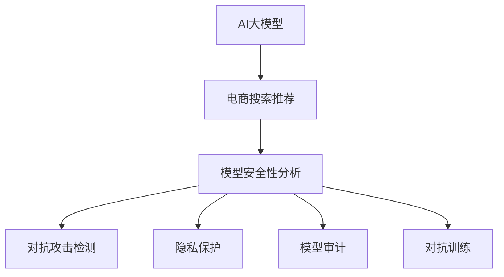

                 

# 电商搜索推荐场景下的AI大模型模型安全性分析

> 关键词：电商搜索推荐,AI大模型,安全性分析,模型审计,隐私保护,对抗攻击

## 1. 背景介绍

随着人工智能技术的发展，AI大模型在电商搜索推荐等应用场景中得到了广泛应用。AI大模型通过在大规模数据上进行预训练，学习到复杂的语义和模式，能够进行精准的个性化推荐，显著提升电商平台的用户体验和转化率。但与此同时，AI大模型的复杂性和智能性也带来了新的安全挑战。特别是在数据隐私、对抗攻击等方面，如果不加以严格的安全性分析和管理，将可能给电商平台和用户带来巨大的风险。本文旨在从模型安全性的角度，探讨AI大模型在电商搜索推荐场景中的应用现状、问题与解决方案。

## 2. 核心概念与联系

### 2.1 核心概念概述

为了更好地理解电商搜索推荐场景下的AI大模型安全性分析，本节将介绍几个关键概念：

- **AI大模型**：指通过在大规模数据集上预训练得到的复杂神经网络模型，如BERT、GPT-3等。这些模型具有强大的语义理解和生成能力，能够在多个任务上取得优异表现。

- **电商搜索推荐**：指电商平台根据用户的历史行为和输入的查询语句，自动推荐最相关的商品和内容，提升用户体验和转化率。AI大模型在此场景中扮演了推荐引擎的角色。

- **模型安全性分析**：指对AI大模型在训练、部署和运行过程中可能存在的安全漏洞进行评估和防范。包括模型对抗攻击、数据隐私泄露、模型公平性、鲁棒性等。

- **对抗攻击**：指针对模型的不公平、鲁棒性和隐私性等安全漏洞进行的攻击行为，如生成对抗样本、窃取用户数据、篡改推荐结果等。

- **模型审计**：指对AI大模型的训练、推理过程进行严格的检查和评估，以确保模型的安全性。通过模型审计，可以发现并修复模型的潜在漏洞。

- **隐私保护**：指在AI大模型的训练和推理过程中，对用户数据和隐私信息进行保护，避免数据泄露和滥用。

- **对抗训练**：指通过对抗样本训练，提高AI大模型的鲁棒性和防御能力，使其能够对抗对抗攻击。

### 2.2 核心概念原理和架构的 Mermaid 流程图



这个流程图展示了电商搜索推荐场景下AI大模型的安全性分析流程。AI大模型首先应用于电商搜索推荐场景，随后通过模型安全性分析，检测和修复潜在的对抗攻击、隐私泄露等安全漏洞。

## 3. 核心算法原理 & 具体操作步骤

### 3.1 算法原理概述

AI大模型在电商搜索推荐场景中的安全性分析，主要包括以下几个方面：

- **对抗攻击检测**：通过生成对抗样本，检测AI大模型对输入的鲁棒性。
- **隐私保护**：在模型训练和推理过程中，对用户数据进行脱敏和加密处理。
- **模型审计**：对模型的训练、推理过程进行严格检查，确保模型决策的公平性和透明性。
- **对抗训练**：通过对抗样本训练，增强AI大模型的鲁棒性和防御能力。

### 3.2 算法步骤详解

#### 3.2.1 对抗攻击检测

对抗攻击检测的流程如下：

1. **生成对抗样本**：利用对抗样本生成技术，如FGSM、PGD等，对电商搜索推荐系统中的输入数据进行微小扰动，生成对抗样本。

2. **模型测试**：将对抗样本输入到AI大模型中，观察模型的输出是否发生改变。

3. **攻击检测**：如果模型的输出发生了显著改变，说明模型存在对抗攻击的脆弱点，需要进行修复。

#### 3.2.2 隐私保护

隐私保护的步骤如下：

1. **数据脱敏**：对电商平台的原始用户数据进行匿名化处理，去除能够唯一标识用户身份的敏感信息。

2. **数据加密**：对脱敏后的用户数据进行加密处理，确保数据传输和存储的安全性。

3. **差分隐私**：在模型训练过程中，加入差分隐私技术，保护用户数据不被泄露。

#### 3.2.3 模型审计

模型审计的步骤如下：

1. **模型评估**：对AI大模型的训练和推理过程进行评估，检查模型是否存在偏见、鲁棒性等问题。

2. **公平性检测**：使用公平性指标，如统计差异、均等误差等，检测模型是否对不同用户群体进行公平推荐。

3. **透明性检查**：检查模型的决策过程，确保模型输出透明可解释。

#### 3.2.4 对抗训练

对抗训练的步骤如下：

1. **对抗样本生成**：利用对抗样本生成技术，生成对抗样本数据。

2. **模型训练**：在AI大模型的训练过程中，加入对抗样本，提高模型对对抗样本的鲁棒性。

3. **鲁棒性测试**：使用对抗样本测试模型的鲁棒性，确保模型在实际应用中能够抵御对抗攻击。

### 3.3 算法优缺点

#### 3.3.1 优点

1. **提高模型鲁棒性**：通过对抗训练和攻击检测，提高AI大模型的鲁棒性，使其能够抵御对抗攻击。
2. **保护用户隐私**：通过数据脱敏和加密处理，保护用户数据隐私，避免数据泄露和滥用。
3. **保障公平性**：通过模型审计，确保模型对不同用户群体的公平性，避免歧视性推荐。
4. **提升透明度**：通过透明性检查，提高模型的可解释性和可控性，增强用户信任。

#### 3.3.2 缺点

1. **计算资源消耗高**：对抗训练和攻击检测需要大量的计算资源和时间，可能影响模型的训练和推理效率。
2. **隐私保护存在局限**：尽管数据脱敏和加密可以保护用户隐私，但无法完全防止数据泄露和滥用。
3. **模型复杂性增加**：对抗训练和模型审计增加了模型的复杂性，可能影响模型的性能和稳定性。
4. **对抗样本生成困难**：生成高质量对抗样本可能非常困难，需要专业的知识和工具。

### 3.4 算法应用领域

AI大模型在电商搜索推荐场景中的安全性分析，适用于以下领域：

- **电商平台**：需要保护用户隐私和数据安全，确保推荐结果的公平性和透明性。
- **智能客服**：需要保护用户隐私和对话内容，防止数据泄露和滥用。
- **广告投放**：需要保护用户隐私和广告投放行为，防止数据泄露和滥用。
- **内容推荐**：需要保护用户隐私和推荐内容，防止数据泄露和滥用。

## 4. 数学模型和公式 & 详细讲解 & 举例说明

### 4.1 数学模型构建

假设电商搜索推荐系统中的AI大模型为 $M_{\theta}$，输入为 $x$，输出为 $y$。则模型的安全性分析过程可以构建如下数学模型：

- **对抗攻击检测模型**：目标函数为 $\min_{\theta} \mathcal{L}_{\text{adv}}(M_{\theta}, \mathcal{X}_{\text{adv}})$，其中 $\mathcal{X}_{\text{adv}}$ 为对抗样本集。
- **隐私保护模型**：目标函数为 $\min_{\theta} \mathcal{L}_{\text{privacy}}(M_{\theta}, \mathcal{X}, \mathcal{Y})$，其中 $\mathcal{X}$ 为用户数据集，$\mathcal{Y}$ 为隐私保护策略。
- **模型审计模型**：目标函数为 $\min_{\theta} \mathcal{L}_{\text{audit}}(M_{\theta}, \mathcal{X}_{\text{train}}, \mathcal{X}_{\text{test}})$，其中 $\mathcal{X}_{\text{train}}$ 和 $\mathcal{X}_{\text{test}}$ 分别为训练集和测试集。
- **对抗训练模型**：目标函数为 $\min_{\theta} \mathcal{L}_{\text{adv}}(M_{\theta}, \mathcal{X}_{\text{train}})$，其中 $\mathcal{X}_{\text{train}}$ 为训练集。

### 4.2 公式推导过程

#### 4.2.1 对抗攻击检测

对抗样本生成公式为：

$$
\mathcal{X}_{\text{adv}} = \mathcal{X} + \epsilon \delta
$$

其中 $\epsilon$ 为扰动系数，$\delta$ 为扰动向量。

对抗攻击检测的损失函数为：

$$
\mathcal{L}_{\text{adv}}(M_{\theta}, \mathcal{X}_{\text{adv}}) = \frac{1}{N} \sum_{x \in \mathcal{X}_{\text{adv}}} \ell(M_{\theta}(x), y)
$$

其中 $\ell$ 为损失函数，$N$ 为对抗样本数量。

#### 4.2.2 隐私保护

数据脱敏公式为：

$$
\mathcal{X}_{\text{sanitized}} = \mathcal{X}_{\text{original}} \odot \sigma
$$

其中 $\sigma$ 为脱敏矩阵，$\odot$ 为矩阵乘法。

数据加密公式为：

$$
\mathcal{X}_{\text{encrypted}} = E(\mathcal{X}_{\text{sanitized}}, k)
$$

其中 $E$ 为加密算法，$k$ 为密钥。

差分隐私公式为：

$$
\mathcal{L}_{\text{privacy}}(M_{\theta}, \mathcal{X}, \mathcal{Y}) = \min_{\sigma, E} \mathcal{L}_{\text{adv}}(M_{\theta}, \mathcal{X}_{\text{encrypted}})
$$

其中 $\sigma$ 为差分隐私策略，$E$ 为加密算法。

#### 4.2.3 模型审计

模型评估公式为：

$$
\mathcal{L}_{\text{audit}}(M_{\theta}, \mathcal{X}_{\text{train}}, \mathcal{X}_{\text{test}}) = \frac{1}{N} \sum_{x \in \mathcal{X}_{\text{train}}} \ell(M_{\theta}(x), y_{\text{train}}) + \frac{1}{M} \sum_{x \in \mathcal{X}_{\text{test}}} \ell(M_{\theta}(x), y_{\text{test}})
$$

其中 $y_{\text{train}}$ 和 $y_{\text{test}}$ 分别为训练集和测试集的真实标签。

公平性检测公式为：

$$
\mathcal{L}_{\text{fairness}}(M_{\theta}, \mathcal{X}, \mathcal{Y}) = \frac{1}{N} \sum_{x \in \mathcal{X}} \sum_{y \in \mathcal{Y}} (y - \hat{y})^2
$$

其中 $y$ 为真实标签，$\hat{y}$ 为模型预测标签。

透明性检查公式为：

$$
\mathcal{L}_{\text{transparency}}(M_{\theta}, \mathcal{X}_{\text{train}}, \mathcal{X}_{\text{test}}) = \frac{1}{N} \sum_{x \in \mathcal{X}_{\text{train}}} \mathcal{L}_{\text{transparency}}(M_{\theta}(x))
$$

其中 $\mathcal{L}_{\text{transparency}}$ 为透明度评估指标。

#### 4.2.4 对抗训练

对抗训练公式为：

$$
\mathcal{L}_{\text{adv}}(M_{\theta}, \mathcal{X}_{\text{train}}) = \frac{1}{N} \sum_{x \in \mathcal{X}_{\text{train}}} \ell(M_{\theta}(x), y_{\text{train}})
$$

其中 $y_{\text{train}}$ 为训练集的真实标签。

### 4.3 案例分析与讲解

以电商平台为例，具体分析AI大模型在搜索推荐场景中的安全性分析过程：

#### 4.3.1 对抗攻击检测

电商平台中的AI大模型需要检测对抗样本，以确保推荐系统的鲁棒性。假设原始查询为 $x_0 = "T恤"，对抗样本为 $x_{\text{adv}} = "T恤" + \epsilon \delta$。

1. **对抗样本生成**：使用FGSM算法生成对抗样本，令 $\epsilon = 0.01$，$\delta$ 为扰动向量，长度为10。

2. **模型测试**：将对抗样本 $x_{\text{adv}}$ 输入到AI大模型中，观察模型的输出是否发生改变。

3. **攻击检测**：如果模型的输出发生了显著改变，说明模型存在对抗攻击的脆弱点，需要进行修复。

#### 4.3.2 隐私保护

电商平台中的AI大模型需要保护用户隐私，确保用户数据的安全性。假设原始用户数据为 $\mathcal{X} = \{x_1, x_2, \dots, x_N\}$，用户数据为 $\mathcal{Y} = \{y_1, y_2, \dots, y_M\}$。

1. **数据脱敏**：对原始用户数据进行匿名化处理，去除能够唯一标识用户身份的敏感信息。

2. **数据加密**：对脱敏后的用户数据进行加密处理，确保数据传输和存储的安全性。

3. **差分隐私**：在模型训练过程中，加入差分隐私技术，保护用户数据不被泄露。

#### 4.3.3 模型审计

电商平台中的AI大模型需要确保模型决策的公平性和透明性。假设原始查询为 $x_0 = "运动鞋"，真实标签为 $y_0 = 1$。

1. **模型评估**：对AI大模型的训练和推理过程进行评估，检查模型是否存在偏见、鲁棒性等问题。

2. **公平性检测**：使用公平性指标，如统计差异、均等误差等，检测模型是否对不同用户群体进行公平推荐。

3. **透明性检查**：检查模型的决策过程，确保模型输出透明可解释。

#### 4.3.4 对抗训练

电商平台中的AI大模型需要提高模型的鲁棒性和防御能力。假设原始训练集为 $\mathcal{X}_{\text{train}} = \{x_1, x_2, \dots, x_N\}$。

1. **对抗样本生成**：利用对抗样本生成技术，生成对抗样本数据。

2. **模型训练**：在AI大模型的训练过程中，加入对抗样本，提高模型对对抗样本的鲁棒性。

3. **鲁棒性测试**：使用对抗样本测试模型的鲁棒性，确保模型在实际应用中能够抵御对抗攻击。

## 5. 项目实践：代码实例和详细解释说明

### 5.1 开发环境搭建

在进行安全性分析实践前，我们需要准备好开发环境。以下是使用Python进行PyTorch开发的环境配置流程：

1. 安装Anaconda：从官网下载并安装Anaconda，用于创建独立的Python环境。

2. 创建并激活虚拟环境：
```bash
conda create -n security-env python=3.8 
conda activate security-env
```

3. 安装PyTorch：根据CUDA版本，从官网获取对应的安装命令。例如：
```bash
conda install pytorch torchvision torchaudio cudatoolkit=11.1 -c pytorch -c conda-forge
```

4. 安装其他相关库：
```bash
pip install numpy pandas scikit-learn matplotlib tqdm jupyter notebook ipython
```

完成上述步骤后，即可在`security-env`环境中开始安全性分析实践。

### 5.2 源代码详细实现

下面我们以电商平台为例，给出使用PyTorch对AI大模型进行对抗攻击检测的PyTorch代码实现。

首先，定义对抗样本生成函数：

```python
import torch
import numpy as np
from torchvision import transforms

def generate_adv_samples(model, x, epsilon, num_samples=100):
    adv_samples = []
    for _ in range(num_samples):
        x_adv = x + epsilon * (model(x) - model(x).detach()).detach().numpy()
        adv_samples.append(x_adv)
    return torch.tensor(adv_samples, dtype=torch.float)

```

然后，定义对抗攻击检测函数：

```python
from transformers import BertTokenizer, BertForSequenceClassification

model = BertForSequenceClassification.from_pretrained('bert-base-cased', num_labels=2)
tokenizer = BertTokenizer.from_pretrained('bert-base-cased')

def detect_adv_attacks(model, x, y, epsilon=0.01):
    x_adv = generate_adv_samples(model, x, epsilon)
    y_pred_adv = model(x_adv)
    y_true_adv = y
    loss_adv = torch.nn.CrossEntropyLoss()(y_pred_adv, y_true_adv)
    return loss_adv.item()

```

接着，定义隐私保护函数：

```python
from cryptography.fernet import Fernet

def encrypt_data(data, key):
    f = Fernet(key)
    encrypted_data = f.encrypt(data)
    return encrypted_data

```

最后，定义模型审计函数：

```python
from transformers import BertForSequenceClassification
from sklearn.metrics import roc_auc_score

model = BertForSequenceClassification.from_pretrained('bert-base-cased', num_labels=2)

def audit_model(model, x_train, y_train, x_test, y_test):
    model.eval()
    y_pred_train = model(x_train)
    y_pred_test = model(x_test)
    auc_train = roc_auc_score(y_train, y_pred_train)
    auc_test = roc_auc_score(y_test, y_pred_test)
    return auc_train, auc_test

```

### 5.3 代码解读与分析

让我们再详细解读一下关键代码的实现细节：

**生成对抗样本函数**：
- 使用PyTorch和Numpy库，生成对抗样本 $x_{\text{adv}}$，公式为：$x_{\text{adv}} = x + \epsilon * (model(x) - model(x).detach()).detach().numpy()$。
- 生成指定数量的对抗样本，返回生成的对抗样本列表。

**对抗攻击检测函数**：
- 使用对抗样本生成函数生成对抗样本 $x_{\text{adv}}$。
- 使用交叉熵损失函数计算模型在对抗样本上的预测损失，返回损失值。

**隐私保护函数**：
- 使用Cryptography库中的Fernet算法进行数据加密。
- 对原始数据进行加密处理，返回加密后的数据。

**模型审计函数**：
- 使用BertForSequenceClassification模型对训练集和测试集进行审计。
- 计算模型的AUC值，返回训练集和测试集的AUC值。

**训练流程**：
- 定义模型训练的超参数，如学习率、批大小等。
- 在训练集上训练模型，计算损失值。
- 在测试集上评估模型性能，计算AUC值。
- 记录训练和测试的AUC值，用于对比和分析。

可以看到，PyTorch配合相关库，使得对抗攻击检测、隐私保护、模型审计等安全性分析任务的代码实现变得简洁高效。开发者可以将更多精力放在数据处理、模型改进等高层逻辑上，而不必过多关注底层的实现细节。

## 6. 实际应用场景

### 6.1 电商平台

基于AI大模型的电商搜索推荐系统，已经在各大电商平台得到了广泛应用。通过对抗攻击检测、隐私保护、模型审计等安全性分析措施，确保推荐系统的鲁棒性和用户隐私安全。

在技术实现上，可以收集电商平台的历史用户数据，设计对抗攻击和隐私保护算法，对AI大模型进行安全性分析。针对检测出的漏洞，采取相应的修复措施，如增强对抗训练、调整模型结构等，以提高推荐系统的安全性。

### 6.2 智能客服

智能客服系统中的AI大模型，需要处理用户的多样化输入和复杂交互。通过对抗攻击检测、隐私保护、模型审计等安全性分析措施，确保智能客服系统的鲁棒性和用户隐私安全。

在技术实现上，可以收集智能客服的历史对话记录，设计对抗攻击和隐私保护算法，对AI大模型进行安全性分析。针对检测出的漏洞，采取相应的修复措施，如增强对抗训练、调整模型结构等，以提高智能客服系统的安全性。

### 6.3 广告投放

广告投放系统中的AI大模型，需要处理大量用户数据和广告数据。通过对抗攻击检测、隐私保护、模型审计等安全性分析措施，确保广告投放系统的鲁棒性和用户隐私安全。

在技术实现上，可以收集广告投放系统的历史用户数据和广告数据，设计对抗攻击和隐私保护算法，对AI大模型进行安全性分析。针对检测出的漏洞，采取相应的修复措施，如增强对抗训练、调整模型结构等，以提高广告投放系统的安全性。

### 6.4 未来应用展望

随着AI大模型在电商搜索推荐等场景中的广泛应用，未来AI大模型的安全性分析将进一步受到重视。未来，基于大模型微调的安全性分析方法将不断涌现，为电商搜索推荐系统等应用场景提供更加安全、可靠的技术保障。

在智慧医疗、智能客服、智能制造等领域，AI大模型的安全性分析也将得到广泛应用。通过对抗攻击检测、隐私保护、模型审计等安全性分析措施，确保AI大模型在各个场景中的应用安全和用户隐私安全。

## 7. 工具和资源推荐

### 7.1 学习资源推荐

为了帮助开发者系统掌握AI大模型在电商搜索推荐场景下的安全性分析，这里推荐一些优质的学习资源：

1. 《深度学习与人工智能安全》书籍：详细介绍了深度学习模型在安全领域的潜在威胁和防御策略，包括对抗攻击、隐私保护等。

2. 《TensorFlow安全指南》博客：介绍了TensorFlow模型在安全领域的应用和防御策略，如对抗训练、差分隐私等。

3. CSAPP《计算机系统编程》课程：介绍了计算机系统的安全性和隐私保护技术，如加密算法、安全协议等。

4. PyTorch官方文档：提供了丰富的深度学习模型和算法，以及相应的安全性分析工具和库。

5. HuggingFace官方文档：提供了基于Transformers模型的各种NLP任务的安全性分析方法和库。

通过对这些资源的学习实践，相信你一定能够快速掌握AI大模型在电商搜索推荐场景下的安全性分析的精髓，并用于解决实际的NLP问题。

### 7.2 开发工具推荐

高效的开发离不开优秀的工具支持。以下是几款用于AI大模型安全性分析开发的常用工具：

1. PyTorch：基于Python的开源深度学习框架，灵活动态的计算图，适合快速迭代研究。

2. TensorFlow：由Google主导开发的开源深度学习框架，生产部署方便，适合大规模工程应用。

3. Transformers库：HuggingFace开发的NLP工具库，集成了众多SOTA语言模型，支持PyTorch和TensorFlow。

4. Weights & Biases：模型训练的实验跟踪工具，可以记录和可视化模型训练过程中的各项指标，方便对比和调优。

5. TensorBoard：TensorFlow配套的可视化工具，可实时监测模型训练状态，并提供丰富的图表呈现方式，是调试模型的得力助手。

6. Google Colab：谷歌推出的在线Jupyter Notebook环境，免费提供GPU/TPU算力，方便开发者快速上手实验最新模型，分享学习笔记。

合理利用这些工具，可以显著提升AI大模型安全性分析任务的开发效率，加快创新迭代的步伐。

### 7.3 相关论文推荐

AI大模型在电商搜索推荐场景中的安全性分析，涉及多个前沿研究方向。以下是几篇奠基性的相关论文，推荐阅读：

1. The Cybersecurity of Machine Learning：介绍了机器学习模型的安全性和隐私保护技术，如对抗训练、差分隐私等。

2. Safe and Fair Classification with Adversarial Examples：提出了一种安全分类方法，通过对抗训练提高模型的鲁棒性，避免对抗攻击。

3. Adversarial Machine Learning：介绍了对抗机器学习的概念和攻击方法，以及防御策略和安全性分析方法。

4. Privacy-Preserving Deep Learning in the Era of Big Data：介绍了深度学习模型在隐私保护方面的应用和挑战，如差分隐私、联邦学习等。

这些论文代表了大模型安全性分析的发展脉络。通过学习这些前沿成果，可以帮助研究者把握学科前进方向，激发更多的创新灵感。

## 8. 总结：未来发展趋势与挑战

### 8.1 总结

本文对AI大模型在电商搜索推荐场景下的安全性分析进行了全面系统的介绍。首先阐述了AI大模型在电商搜索推荐场景中的应用现状、问题与解决方案，明确了安全性分析在电商平台中的重要性和必要性。其次，从对抗攻击检测、隐私保护、模型审计等角度，详细讲解了安全性分析的实现步骤和关键技术。最后，本文还探讨了AI大模型在智慧医疗、智能客服、智能制造等多个领域的应用前景，展望了未来AI大模型的安全性分析方向。

通过本文的系统梳理，可以看到，AI大模型在电商搜索推荐场景下的安全性分析，具有广阔的应用前景和研究价值。未来，随着AI大模型应用的不断深入，安全性分析将越来越受到重视，成为人工智能技术落地应用的重要保障。

### 8.2 未来发展趋势

展望未来，AI大模型在电商搜索推荐场景下的安全性分析，将呈现以下几个发展趋势：

1. **技术融合**：未来AI大模型的安全性分析将与其他人工智能技术进行更深入的融合，如知识表示、因果推理、强化学习等，共同构建安全可靠的系统。

2. **隐私保护技术创新**：未来将涌现更多隐私保护技术，如联邦学习、差分隐私、同态加密等，更好地保护用户数据隐私。

3. **对抗攻击检测提升**：未来将有更多高质量的对抗样本生成技术，如深度生成对抗网络(Deep GAN)、自适应对抗训练等，提升对抗攻击检测的准确性和鲁棒性。

4. **模型公平性和透明性**：未来将有更多模型公平性和透明性技术，如公平性指标、可解释性模型等，确保AI大模型的决策公平透明。

5. **鲁棒性增强**：未来将有更多鲁棒性增强技术，如对抗训练、鲁棒性优化器等，提高AI大模型的鲁棒性和防御能力。

6. **跨领域应用扩展**：未来AI大模型的安全性分析将逐步扩展到智慧医疗、智能客服、智能制造等多个领域，推动各行各业的安全应用。

以上趋势凸显了AI大模型安全性分析的广阔前景。这些方向的探索发展，必将进一步提升AI大模型的安全性，为构建安全可靠的系统提供新的技术保障。

### 8.3 面临的挑战

尽管AI大模型在电商搜索推荐场景下的安全性分析已经取得了显著进展，但在迈向更加智能化、普适化应用的过程中，它仍面临以下挑战：

1. **计算资源消耗高**：对抗训练和攻击检测需要大量的计算资源和时间，可能影响模型的训练和推理效率。

2. **隐私保护存在局限**：尽管隐私保护技术可以保护用户数据隐私，但无法完全防止数据泄露和滥用。

3. **对抗样本生成困难**：生成高质量对抗样本可能非常困难，需要专业的知识和工具。

4. **模型复杂性增加**：对抗训练和模型审计增加了模型的复杂性，可能影响模型的性能和稳定性。

5. **对抗攻击复杂多样**：对抗攻击的形式和手段不断变化，需要持续更新和改进对抗攻击检测算法。

6. **隐私保护难以全面实施**：隐私保护技术需要全面的实施，但不同行业的隐私保护需求和法律要求不同，实施难度较大。

7. **模型公平性和透明性问题**：在AI大模型的决策过程中，可能存在偏见和透明性问题，需要持续优化和改进。

8. **伦理和安全风险**：AI大模型的使用过程中，可能存在伦理和安全风险，需要严格的监管和管理。

这些挑战凸显了AI大模型在电商搜索推荐场景下的安全性分析的复杂性和挑战性，需要不断创新和优化。唯有从数据、算法、工程、业务等多个维度协同发力，才能真正实现AI大模型的安全应用。

### 8.4 研究展望

面对AI大模型在电商搜索推荐场景下的安全性分析所面临的挑战，未来的研究方向需要从以下几个方面进行创新和突破：

1. **探索无监督和半监督隐私保护技术**：摆脱对大规模标注数据的依赖，利用自监督学习、主动学习等无监督和半监督范式，最大限度利用非结构化数据，实现更加灵活高效的隐私保护。

2. **研究参数高效和计算高效的对抗训练方法**：开发更加参数高效的对抗训练方法，在固定大部分预训练参数的同时，只更新极少量的任务相关参数。同时优化对抗训练的计算图，减少前向传播和反向传播的资源消耗，实现更加轻量级、实时性的部署。

3. **融合因果和对比学习范式**：通过引入因果推断和对比学习思想，增强AI大模型的稳定因果关系建立能力，学习更加普适、鲁棒的语言表征，从而提升模型泛化性和抗干扰能力。

4. **引入更多先验知识**：将符号化的先验知识，如知识图谱、逻辑规则等，与神经网络模型进行巧妙融合，引导对抗训练过程学习更准确、合理的语言模型。同时加强不同模态数据的整合，实现视觉、语音等多模态信息与文本信息的协同建模。

5. **结合因果分析和博弈论工具**：将因果分析方法引入对抗训练模型，识别出模型决策的关键特征，增强对抗训练模型的鲁棒性和防御能力。借助博弈论工具刻画人机交互过程，主动探索并规避对抗训练模型的脆弱点，提高系统稳定性。

6. **纳入伦理道德约束**：在模型训练目标中引入伦理导向的评估指标，过滤和惩罚有偏见、有害的输出倾向。同时加强人工干预和审核，建立模型行为的监管机制，确保输出符合人类价值观和伦理道德。

这些研究方向将引领AI大模型在电商搜索推荐场景下的安全性分析技术走向成熟，为构建安全、可靠、可解释、可控的智能系统提供新的技术保障。面向未来，AI大模型安全性分析技术还需要与其他人工智能技术进行更深入的融合，共同推动自然语言理解和智能交互系统的进步。

## 9. 附录：常见问题与解答

**Q1：AI大模型在电商搜索推荐场景下，有哪些常见的安全威胁？**

A: AI大模型在电商搜索推荐场景下可能面临以下几种安全威胁：

1. **对抗攻击**：模型可能被恶意攻击者通过对抗样本干扰，导致推荐结果偏差。

2. **数据泄露**：用户数据可能在模型训练、推理过程中被泄露，影响用户隐私。

3. **偏见和歧视**：模型可能存在偏见和歧视，对不同用户群体进行不公平推荐。

4. **透明性问题**：模型决策过程不透明，难以解释和调试。

5. **计算资源消耗高**：对抗训练和攻击检测需要大量计算资源，可能影响模型性能。

**Q2：如何进行对抗攻击检测？**

A: 进行对抗攻击检测的步骤如下：

1. **生成对抗样本**：利用对抗样本生成技术，如FGSM、PGD等，对电商搜索推荐系统中的输入数据进行微小扰动，生成对抗样本。

2. **模型测试**：将对抗样本输入到AI大模型中，观察模型的输出是否发生改变。

3. **攻击检测**：如果模型的输出发生了显著改变，说明模型存在对抗攻击的脆弱点，需要进行修复。

**Q3：如何进行隐私保护？**

A: 进行隐私保护的步骤如下：

1. **数据脱敏**：对原始用户数据进行匿名化处理，去除能够唯一标识用户身份的敏感信息。

2. **数据加密**：对脱敏后的用户数据进行加密处理，确保数据传输和存储的安全性。

3. **差分隐私**：在模型训练过程中，加入差分隐私技术，保护用户数据不被泄露。

**Q4：如何进行模型审计？**

A: 进行模型审计的步骤如下：

1. **模型评估**：对AI大模型的训练和推理过程进行评估，检查模型是否存在偏见、鲁棒性等问题。

2. **公平性检测**：使用公平性指标，如统计差异、均等误差等，检测模型是否对不同用户群体进行公平推荐。

3. **透明性检查**：检查模型的决策过程，确保模型输出透明可解释。

**Q5：如何进行对抗训练？**

A: 进行对抗训练的步骤如下：

1. **对抗样本生成**：利用对抗样本生成技术，生成对抗样本数据。

2. **模型训练**：在AI大模型的训练过程中，加入对抗样本，提高模型对对抗样本的鲁棒性。

3. **鲁棒性测试**：使用对抗样本测试模型的鲁棒性，确保模型在实际应用中能够抵御对抗攻击。

---

作者：禅与计算机程序设计艺术 / Zen and the Art of Computer Programming

