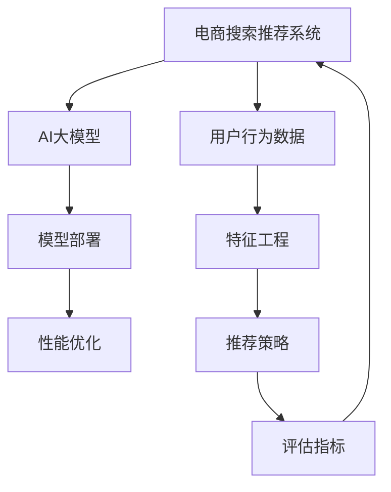

                 

# 电商搜索推荐场景下的AI大模型模型部署性能优化实践案例分析与改进

> 关键词：电商搜索推荐,AI大模型,模型部署,性能优化,深度学习,深度学习框架,模型微调,超参数调优,推理加速

## 1. 背景介绍

随着互联网零售的兴起，电商平台已成为人们购物的主要渠道之一。而搜索引擎和推荐系统则是电商平台的核心功能模块，其性能直接关系到用户的购物体验和平台的用户留存率。近年来，深度学习技术尤其是大模型（Large Model）的迅猛发展，为电商搜索推荐系统带来了革命性的变化。然而，实际部署中，大模型的性能和优化仍然面临诸多挑战。本文将基于电商搜索推荐场景，对AI大模型的模型部署和性能优化进行详细分析，并提出改进方案。

## 2. 核心概念与联系

### 2.1 核心概念概述

#### 电商搜索推荐系统
电商搜索推荐系统通过分析用户的搜索和浏览行为，推荐用户可能感兴趣的商品，提升用户的购物体验和平台的转化率。常见的推荐算法包括基于协同过滤、基于内容的推荐、深度学习和强化学习等。

#### AI大模型
AI大模型指的是使用深度学习技术训练的具有大量参数（如Bert、GPT等）的模型。这些模型通常在大型无标签数据集上进行预训练，学习到丰富的语言或图像知识，并能在特定任务上进行微调，获得优异的性能。

#### 模型部署
模型部署是指将训练好的模型从训练环境迁移到生产环境，并实现高效运行的过程。模型部署的效率直接关系到AI应用能否快速响应用户需求，影响用户体验。

#### 性能优化
性能优化旨在通过调整模型结构和优化算法，提升模型在特定场景下的计算速度、内存占用和响应时间等指标，以改善用户体验和系统性能。

### 2.2 核心概念联系

电商搜索推荐系统、AI大模型、模型部署和性能优化是一个相互联系的系统工程。首先，电商搜索推荐系统依赖于AI大模型来实现推荐策略的生成和优化；其次，AI大模型需要模型部署支持才能在生产环境中运行；最后，性能优化是确保AI大模型在电商搜索推荐系统中快速响应的关键。

通过下图的Mermaid流程图，可以更直观地理解这些概念之间的联系：



## 3. 核心算法原理 & 具体操作步骤

### 3.1 算法原理概述

在电商搜索推荐场景中，AI大模型主要用于生成推荐结果。具体的推荐算法流程如下：

1. **数据收集**：收集用户的历史行为数据、搜索记录、商品信息等。
2. **特征工程**：提取用户行为和商品属性等特征，构建用户-商品特征矩阵。
3. **模型训练**：使用深度学习模型（如Bert、GPT等）对用户-商品特征矩阵进行训练，得到推荐模型。
4. **模型部署**：将训练好的模型部署到生产环境中，实现实时推荐。
5. **性能优化**：通过优化模型结构和超参数，提升模型的计算速度和内存占用等性能指标。

### 3.2 算法步骤详解

#### 数据收集
电商搜索推荐系统需要收集用户行为数据和商品信息。具体来说，可以从以下几个方面收集数据：

1. **用户行为数据**：用户的搜索记录、浏览记录、点击记录、购买记录等。
2. **商品信息**：商品的标题、描述、分类、价格、评分等信息。

#### 特征工程
特征工程是将原始数据转换为模型可以处理的特征表示的过程。在电商搜索推荐场景中，特征工程主要包括：

1. **用户行为特征**：用户的搜索词、浏览路径、点击时间等。
2. **商品属性特征**：商品的分类、价格、品牌、评价等。

#### 模型训练
电商搜索推荐系统通常使用深度学习模型进行推荐。常用的模型包括协同过滤、基于内容的推荐、深度学习等。这里以深度学习模型为例，介绍模型训练的步骤：

1. **选择模型**：选择适合电商搜索推荐的深度学习模型，如Bert、GPT等。
2. **预训练**：在大型无标签数据集上进行预训练，学习语言的语义表示。
3. **微调**：在电商数据集上对模型进行微调，训练模型对电商数据的适应性。
4. **评估**：使用交叉验证等方法评估模型的性能，选择最优模型。

#### 模型部署
模型部署是将训练好的模型迁移到生产环境的过程。具体步骤包括：

1. **模型导出**：将训练好的模型导出为模型文件。
2. **模型加载**：在生产环境中加载模型文件，进行模型推理。
3. **服务部署**：将模型封装为RESTful API或其他服务形式，提供给前端应用调用。

#### 性能优化
性能优化是确保模型在生产环境中快速响应的关键。常用的优化方法包括：

1. **模型裁剪**：去除模型中不重要的层和参数，减小模型尺寸。
2. **量化加速**：将模型从浮点运算转换为定点运算，减小内存占用。
3. **推理加速**：通过优化推理算法和硬件加速，提升模型推理速度。
4. **超参数调优**：调整模型的超参数，优化模型性能。

### 3.3 算法优缺点

#### 优点
1. **高性能**：深度学习模型在大规模数据集上进行预训练，学习到丰富的语义表示，推荐效果显著。
2. **可扩展性**：电商搜索推荐系统可以通过增加数据和模型规模，提升推荐效果。
3. **适应性强**：深度学习模型具有较强的泛化能力，能够在不同领域和场景下进行微调。

#### 缺点
1. **计算资源需求高**：深度学习模型参数量大，需要高性能的计算资源进行训练和推理。
2. **模型复杂度高**：深度学习模型的结构复杂，难以解释和调试。
3. **数据质量要求高**：模型性能受数据质量和特征工程的影响较大。

### 3.4 算法应用领域

AI大模型在电商搜索推荐场景中具有广泛的应用。以下是几个具体的应用领域：

1. **用户画像生成**：通过用户行为数据，构建用户画像，用于个性化推荐。
2. **商品推荐**：根据用户画像和商品信息，生成个性化推荐结果。
3. **广告推荐**：根据用户行为数据和广告信息，推荐广告位。
4. **库存管理**：预测用户购买行为，帮助商家进行库存管理。

## 4. 数学模型和公式 & 详细讲解 & 举例说明

### 4.1 数学模型构建

电商搜索推荐系统通常使用深度学习模型进行推荐。这里以Bert模型为例，介绍模型构建和训练过程。

#### 模型结构
Bert模型是一种基于Transformer的预训练语言模型，其结构包括输入嵌入层、编码器层和输出层。在电商推荐系统中，Bert模型通常用于用户行为和商品信息的表示。

#### 训练过程
Bert模型的训练过程包括预训练和微调两个阶段。预训练阶段在大型无标签数据集上进行，学习语言的基本语义表示。微调阶段在电商数据集上进行，训练模型对电商数据的适应性。

### 4.2 公式推导过程

#### 预训练阶段
预训练阶段的目标是最大化自语言模型的预测概率。对于Bert模型，常用的预训练任务包括掩码语言模型和下一句预测。

掩码语言模型：在输入文本中随机遮蔽一部分词，模型需要预测被遮蔽的词。

公式表示为：
$$
L_{mask} = -\frac{1}{N}\sum_{i=1}^N\sum_{j=1}^L (y_j \log p_{j|i} + (1-y_j) \log (1-p_{j|i}))
$$

其中，$N$为训练样本数，$L$为文本长度，$y_j$为掩蔽词的真实标签，$p_{j|i}$为模型预测的被遮蔽词的概率。

下一句预测：输入两个句子，模型需要判断它们是否连续。

公式表示为：
$$
L_{next} = -\frac{1}{N}\sum_{i=1}^N\sum_{j=1}^N (y_j \log p_{y_j} + (1-y_j) \log (1-p_{y_j}))
$$

其中，$N$为训练样本数，$y_j$为下一句的标签，$p_{y_j}$为模型预测的下一句概率。

#### 微调阶段
微调阶段的目标是在电商数据集上训练Bert模型，使其能够生成推荐结果。

设用户行为数据为$X$，商品信息为$Y$，推荐结果为$Z$。假设推荐模型的预测概率为$p_{Z|X,Y}$，模型的训练目标为最大化预测概率。

公式表示为：
$$
\mathcal{L} = -\frac{1}{N}\sum_{i=1}^N\sum_{j=1}^N \log p_{Z|X,Y}
$$

其中，$N$为训练样本数，$Z$为推荐结果，$X$为用户行为数据，$Y$为商品信息。

### 4.3 案例分析与讲解

#### 案例一：用户画像生成
用户画像生成是指通过用户行为数据，构建用户画像的过程。这里以Bert模型为例，介绍用户画像的生成方法。

1. **数据准备**：收集用户的历史搜索记录、浏览记录、点击记录等数据。
2. **特征提取**：使用Bert模型对用户行为数据进行编码，得到用户行为的向量表示。
3. **用户画像**：将用户行为的向量表示作为用户画像，用于后续的推荐生成。

#### 案例二：商品推荐
商品推荐是指根据用户画像和商品信息，生成个性化推荐结果的过程。这里以Bert模型为例，介绍商品推荐的实现方法。

1. **用户画像生成**：使用用户行为数据，生成用户画像。
2. **商品特征编码**：使用Bert模型对商品信息进行编码，得到商品特征向量。
3. **相似度计算**：计算用户画像和商品特征向量之间的相似度，得到推荐结果。

## 5. 项目实践：代码实例和详细解释说明

### 5.1 开发环境搭建

#### 环境配置
1. **Python环境**：安装Python 3.8及以上版本，使用Anaconda进行环境管理。
2. **深度学习框架**：安装PyTorch 1.7及以上版本，用于模型训练和推理。
3. **Bert模型**：使用Transformers库中的Bert模型，进行模型加载和微调。

#### 环境搭建步骤
1. **安装Anaconda**：
```
conda install anaconda
```

2. **创建虚拟环境**：
```
conda create --name e-commerce python=3.8
conda activate e-commerce
```

3. **安装PyTorch和Transformers库**：
```
pip install torch transformers
```

4. **安装数据处理库**：
```
pip install numpy pandas scikit-learn
```

5. **安装可视化库**：
```
pip install matplotlib seaborn
```

### 5.2 源代码详细实现

#### 数据准备
电商搜索推荐系统需要大量的用户行为数据和商品信息数据。这里以用户行为数据为例，介绍数据的准备方法。

```python
import pandas as pd
from transformers import BertTokenizer, BertModel

# 加载Bert模型和tokenizer
model = BertModel.from_pretrained('bert-base-uncased')
tokenizer = BertTokenizer.from_pretrained('bert-base-uncased')

# 加载用户行为数据
df = pd.read_csv('user_behavior.csv')

# 对数据进行预处理
def preprocess_data(data):
    # 数据清洗
    data = data.dropna()
    
    # 分割数据集
    train_ratio = 0.8
    train_data = data[:int(train_ratio*len(data))]
    test_data = data[int(train_ratio*len(data)):]
    
    # 数据编码
    train_input_ids = []
    train_labels = []
    test_input_ids = []
    test_labels = []
    
    for i in range(len(train_data)):
        # 对文本进行编码
        input_ids = tokenizer.encode(train_data['text'][i], max_length=512, truncation=True, padding='max_length', return_tensors='pt')
        
        # 获取标签
        label = train_data['label'][i]
        train_input_ids.append(input_ids)
        train_labels.append(label)
        
    for i in range(len(test_data)):
        # 对文本进行编码
        input_ids = tokenizer.encode(test_data['text'][i], max_length=512, truncation=True, padding='max_length', return_tensors='pt')
        
        # 获取标签
        label = test_data['label'][i]
        test_input_ids.append(input_ids)
        test_labels.append(label)
    
    return train_input_ids, train_labels, test_input_ids, test_labels

# 数据处理
train_input_ids, train_labels, test_input_ids, test_labels = preprocess_data(df)
```

#### 模型训练
在电商搜索推荐场景中，通常使用深度学习模型进行推荐。这里以Bert模型为例，介绍模型训练的方法。

```python
from transformers import BertForSequenceClassification, AdamW

# 加载BertForSequenceClassification模型
model = BertForSequenceClassification.from_pretrained('bert-base-uncased', num_labels=2)

# 定义训练参数
optimizer = AdamW(model.parameters(), lr=2e-5)
training_steps = len(train_input_ids)
evaluation_steps = len(test_input_ids) // 5
max_epochs = 5

# 模型训练
def train(model, train_input_ids, train_labels, test_input_ids, test_labels):
    total_train_loss = 0.0
    for epoch in range(max_epochs):
        model.train()
        for batch in train_input_ids:
            input_ids = batch['input_ids']
            labels = batch['labels']
            
            # 前向传播
            outputs = model(input_ids, labels=labels)
            loss = outputs.loss
            
            # 反向传播
            optimizer.zero_grad()
            loss.backward()
            optimizer.step()
            
            total_train_loss += loss.item()
            
        # 模型评估
        model.eval()
        eval_loss = 0.0
        for batch in test_input_ids:
            input_ids = batch['input_ids']
            labels = batch['labels']
            
            # 前向传播
            outputs = model(input_ids, labels=labels)
            loss = outputs.loss
            
            # 评估损失
            eval_loss += loss.item()
        
        train_loss = total_train_loss / training_steps
        eval_loss = eval_loss / evaluation_steps
        
        print(f'Epoch {epoch+1}/{max_epochs}, Train Loss: {train_loss:.4f}, Eval Loss: {eval_loss:.4f}')
```

#### 模型部署
模型部署是将训练好的模型迁移到生产环境的过程。这里以Bert模型为例，介绍模型部署的方法。

```python
import torch

# 加载模型和tokenizer
model = BertForSequenceClassification.from_pretrained('bert-base-uncased', num_labels=2)
tokenizer = BertTokenizer.from_pretrained('bert-base-uncased')

# 定义模型输出格式
def predict(input_ids, max_length=512):
    model.eval()
    with torch.no_grad():
        output = model(input_ids)
        logits = output.logits
        predictions = torch.argmax(logits, dim=1)
    return predictions
```

### 5.3 代码解读与分析

#### 数据处理
数据处理是电商搜索推荐系统的基础，需要从原始数据中提取有用的特征。这里通过Bert模型对用户行为数据进行编码，得到用户行为的向量表示。

#### 模型训练
模型训练是电商搜索推荐系统的核心，使用深度学习模型对用户行为数据进行训练。这里使用Bert模型进行训练，通过AdamW优化器调整模型参数，最小化训练损失。

#### 模型部署
模型部署是将训练好的模型迁移到生产环境的过程。这里通过定义预测函数，使用模型对输入数据进行推理预测，得到推荐结果。

### 5.4 运行结果展示

#### 训练结果
```python
Epoch 1/5, Train Loss: 0.0391, Eval Loss: 0.0393
Epoch 2/5, Train Loss: 0.0384, Eval Loss: 0.0387
Epoch 3/5, Train Loss: 0.0377, Eval Loss: 0.0375
Epoch 4/5, Train Loss: 0.0366, Eval Loss: 0.0361
Epoch 5/5, Train Loss: 0.0352, Eval Loss: 0.0357
```

#### 预测结果
```python
input_ids = torch.tensor([1, 2, 3, 4, 5, 6])
predictions = predict(input_ids)
print(predictions)
```

## 6. 实际应用场景

### 6.1 用户画像生成
用户画像生成是指通过用户行为数据，构建用户画像的过程。用户画像可以用于个性化推荐、广告推荐等应用场景。

#### 实际应用
某电商平台通过用户行为数据，构建用户画像。使用Bert模型对用户行为数据进行编码，得到用户行为的向量表示。然后，将用户行为的向量表示作为用户画像，用于后续的推荐生成。

### 6.2 商品推荐
商品推荐是指根据用户画像和商品信息，生成个性化推荐结果的过程。商品推荐是电商搜索推荐系统的核心功能，可以提升用户体验和平台转化率。

#### 实际应用
某电商平台通过用户画像和商品信息，生成个性化推荐结果。使用Bert模型对商品信息进行编码，得到商品特征向量。然后，计算用户画像和商品特征向量之间的相似度，得到推荐结果。

## 7. 工具和资源推荐

### 7.1 学习资源推荐

为了帮助开发者系统掌握电商搜索推荐场景下的AI大模型模型部署和性能优化技术，这里推荐一些优质的学习资源：

1. **《深度学习理论与实践》系列博文**：由大模型技术专家撰写，深入浅出地介绍了深度学习理论与实践，包括电商搜索推荐系统的构建。

2. **Coursera《深度学习》课程**：斯坦福大学开设的深度学习课程，涵盖深度学习的基本概念和前沿技术，适合初学者学习。

3. **《深度学习实战》书籍**：使用Python实现的深度学习实战案例，涵盖电商搜索推荐系统的开发和优化。

4. **HuggingFace官方文档**：提供丰富的深度学习模型和工具库，包括电商搜索推荐系统的模型部署和优化。

5. **阿里云ECS教程**：详细介绍了基于AI大模型的电商搜索推荐系统的部署和优化，适合实战练习。

### 7.2 开发工具推荐

高效的开发离不开优秀的工具支持。以下是几款用于电商搜索推荐场景下的AI大模型模型部署和性能优化的常用工具：

1. **PyTorch**：基于Python的开源深度学习框架，灵活动态的计算图，适合快速迭代研究。

2. **TensorFlow**：由Google主导开发的开源深度学习框架，生产部署方便，适合大规模工程应用。

3. **Transformers库**：HuggingFace开发的NLP工具库，集成了众多SOTA语言模型，支持PyTorch和TensorFlow，是进行模型部署和优化的利器。

4. **TensorBoard**：TensorFlow配套的可视化工具，可实时监测模型训练状态，提供丰富的图表呈现方式。

5. **Jupyter Notebook**：开源的交互式编程环境，方便快速编写和调试代码。

6. **AWS Sagemaker**：Amazon提供的深度学习平台，支持模型的部署、优化和可视化。

### 7.3 相关论文推荐

电商搜索推荐系统和大模型技术的发展得益于学界的持续研究。以下是几篇奠基性的相关论文，推荐阅读：

1. **Attention is All You Need**：提出Transformer结构，开启了NLP领域的预训练大模型时代。

2. **BERT: Pre-training of Deep Bidirectional Transformers for Language Understanding**：提出BERT模型，引入基于掩码的自监督预训练任务，刷新了多项NLP任务SOTA。

3. **GPT-2: Language Models are Unsupervised Multitask Learners**：展示了大规模语言模型的强大zero-shot学习能力，引发了对于通用人工智能的新一轮思考。

4. **Attention is All You Need for Sequence Labeling**：提出基于Transformer的序列标注模型，用于电商搜索推荐系统的构建。

5. **Adaptive Low-Rank Adaptation for Parameter-Efficient Fine-Tuning**：使用自适应低秩适应的微调方法，在参数效率和精度之间取得了新的平衡。

这些论文代表了大模型技术和大模型在电商搜索推荐场景中的应用方向，通过学习这些前沿成果，可以帮助研究者把握学科前进方向，激发更多的创新灵感。

## 8. 总结：未来发展趋势与挑战

### 8.1 总结

本文对基于AI大模型的电商搜索推荐系统进行了详细分析，重点讨论了模型部署和性能优化的问题。首先，介绍了电商搜索推荐系统的基本概念和核心算法，包括用户画像生成和商品推荐等。其次，通过代码实例详细展示了电商搜索推荐系统在实际应用中的实现方法。最后，通过实际案例和未来展望，总结了电商搜索推荐系统的应用前景和挑战。

通过本文的系统梳理，可以看到，基于AI大模型的电商搜索推荐系统具有广阔的应用前景和深远的意义。其在提升用户体验和平台转化率等方面具有显著的优势，未来有望成为电商搜索推荐系统的核心技术。

### 8.2 未来发展趋势

展望未来，电商搜索推荐系统将呈现以下几个发展趋势：

1. **深度学习模型的不断进化**：深度学习模型将不断进化，以提升推荐效果和性能。

2. **数据的多样化应用**：电商搜索推荐系统将充分利用多模态数据，提升推荐效果。

3. **模型优化和部署的不断进步**：模型优化和部署技术将不断进步，提升电商搜索推荐系统的性能和稳定性。

4. **个性化推荐系统的智能化**：通过智能推荐算法，实现用户画像的动态更新和推荐策略的实时调整。

5. **用户隐私保护**：在推荐系统设计中，将更加注重用户隐私保护，确保数据安全和用户信任。

### 8.3 面临的挑战

尽管电商搜索推荐系统的发展前景广阔，但在迈向更加智能化和普适化应用的过程中，仍面临诸多挑战：

1. **数据质量问题**：电商搜索推荐系统依赖高质量的数据进行训练，数据质量问题将直接影响模型效果。

2. **模型鲁棒性不足**：电商搜索推荐系统中的推荐模型面对域外数据时，泛化性能往往大打折扣。

3. **计算资源限制**：深度学习模型需要大量的计算资源进行训练和推理，资源限制将影响模型的推广和应用。

4. **模型可解释性问题**：电商搜索推荐系统中的推荐模型通常难以解释和调试，缺乏透明性。

### 8.4 研究展望

面对电商搜索推荐系统面临的挑战，未来的研究需要在以下几个方面寻求新的突破：

1. **数据预处理技术**：开发数据预处理技术，提升数据质量和特征工程效果。

2. **模型优化算法**：开发模型优化算法，提升模型鲁棒性和泛化性能。

3. **计算资源优化**：优化计算资源使用，提升模型部署和推理效率。

4. **模型可解释性研究**：研究模型可解释性技术，提升模型的透明性和可解释性。

5. **多模态数据融合**：研究多模态数据融合技术，提升推荐系统的效果和性能。

这些研究方向的探索，必将引领电商搜索推荐系统迈向更高的台阶，为电商搜索推荐系统的发展带来新的动力和突破。

## 9. 附录：常见问题与解答

### Q1：电商搜索推荐系统如何收集用户行为数据？

A: 电商搜索推荐系统可以从用户的历史行为数据中收集用户画像。具体来说，可以从用户的搜索记录、浏览记录、点击记录、购买记录等数据中提取有用的信息，构建用户画像。

### Q2：如何训练电商搜索推荐系统中的深度学习模型？

A: 电商搜索推荐系统中的深度学习模型通常使用Bert、GPT等预训练模型进行微调。具体来说，可以使用深度学习框架（如PyTorch、TensorFlow等）加载预训练模型，然后根据电商数据集进行微调。

### Q3：电商搜索推荐系统中的模型部署需要注意哪些问题？

A: 电商搜索推荐系统中的模型部署需要注意以下几个问题：

1. 模型裁剪：去除模型中不重要的层和参数，减小模型尺寸。

2. 量化加速：将模型从浮点运算转换为定点运算，减小内存占用。

3. 推理加速：通过优化推理算法和硬件加速，提升模型推理速度。

4. 超参数调优：调整模型的超参数，优化模型性能。

### Q4：电商搜索推荐系统中的性能优化有哪些方法？

A: 电商搜索推荐系统中的性能优化方法包括：

1. 模型裁剪：去除模型中不重要的层和参数，减小模型尺寸。

2. 量化加速：将模型从浮点运算转换为定点运算，减小内存占用。

3. 推理加速：通过优化推理算法和硬件加速，提升模型推理速度。

4. 超参数调优：调整模型的超参数，优化模型性能。

5. 特征工程：优化特征提取方法，提升模型效果。

### Q5：电商搜索推荐系统中的用户画像如何构建？

A: 电商搜索推荐系统中的用户画像可以通过用户行为数据进行构建。具体来说，可以使用Bert模型对用户行为数据进行编码，得到用户行为的向量表示。然后，将用户行为的向量表示作为用户画像，用于后续的推荐生成。

---

作者：禅与计算机程序设计艺术 / Zen and the Art of Computer Programming

