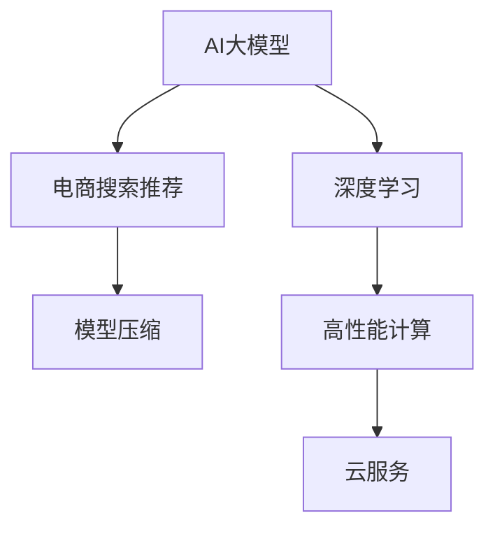

                 

# 电商搜索推荐场景下的AI大模型模型部署最佳实践

> 关键词：大模型部署,电商搜索推荐,深度学习,算法优化,模型压缩,高性能计算,云服务

## 1. 背景介绍

随着互联网电商市场的不断发展，用户搜索行为呈现出高度的个性化和多样性，传统的基于规则和关键词匹配的推荐算法已难以满足用户需求。人工智能大模型在电商搜索推荐领域的应用，带来了革命性的突破。通过大模型强大的语言理解和生成能力，能够从海量文本数据中挖掘用户隐性需求，实现个性化推荐。然而，大模型的部署和优化也是一项复杂且重要的任务。本文旨在介绍电商搜索推荐场景下，AI大模型部署的最佳实践。

## 2. 核心概念与联系

### 2.1 核心概念概述

为更好地理解电商搜索推荐场景下AI大模型的部署实践，本节将介绍几个密切相关的核心概念：

- **AI大模型**：以Transformer为代表的深度学习模型，通过在大规模无标签文本语料上进行预训练，学习到丰富的语言知识和模式。这些模型具备强大的自然语言理解和生成能力，能够应用于各种自然语言处理任务。

- **电商搜索推荐**：通过用户搜索行为数据，结合商品信息，动态生成推荐结果的过程。其核心目标是通过理解用户需求，匹配合适的商品，提高用户购物体验和商家销售转化率。

- **深度学习**：一类基于神经网络的机器学习算法，能够处理高维非线性数据，广泛应用于图像、语音、自然语言处理等领域。

- **模型压缩**：通过算法或模型架构的优化，减少模型的参数量和计算复杂度，提升模型推理速度和资源利用效率。

- **高性能计算**：包括GPU、TPU、FPGA等专用硬件，以及分布式计算等技术，为深度学习模型提供高效的计算支持。

- **云服务**：基于云计算的计算资源、存储资源和网络资源，提供按需、弹性的计算能力。

这些核心概念之间的逻辑关系可以通过以下Mermaid流程图来展示：



这个流程图展示了大模型在电商搜索推荐中的核心概念及其之间的关系：

1. 大模型通过深度学习在电商搜索推荐任务上应用，获得推荐结果。
2. 深度学习算法优化模型架构，提高模型效率和精度。
3. 高性能计算提供深度学习模型高效计算的硬件支持。
4. 云服务提供计算资源的按需分配，支持大规模模型部署。

## 3. 核心算法原理 & 具体操作步骤
### 3.1 算法原理概述

在大模型应用于电商搜索推荐时，首先需要对模型进行部署，使其能够处理在线搜索请求，生成推荐结果。这一过程涉及模型的优化、压缩、部署等多个环节。

### 3.2 算法步骤详解

电商搜索推荐场景下AI大模型部署一般包括以下几个关键步骤：

**Step 1: 数据准备与预处理**

- 收集电商平台的搜索日志和商品信息，对数据进行清洗和标注。
- 将文本数据转换为模型所需的输入格式，如分词、构建词汇表等。
- 根据任务需求，将文本数据划分为训练集、验证集和测试集。

**Step 2: 模型选择与微调**

- 选择合适的预训练语言模型，如BERT、GPT-3等。
- 在电商数据集上对预训练模型进行微调，优化模型适应电商搜索推荐任务的能力。
- 微调时采用合理的超参数设置，如学习率、批次大小、迭代次数等。

**Step 3: 模型优化与压缩**

- 对微调后的模型进行优化，如剪枝、量化、蒸馏等，减小模型规模。
- 选择合适的模型压缩方法，如知识蒸馏、深度可分离卷积等，进一步提升模型效率。

**Step 4: 模型部署与推理**

- 选择合适的计算平台，如CPU、GPU、TPU等，进行模型推理部署。
- 使用高性能计算库，如TensorFlow、PyTorch等，优化模型推理速度。
- 实现模型推理服务，提供高效、稳定的服务接口。

**Step 5: 模型监控与优化**

- 实时监控模型推理性能，如响应时间、内存占用等。
- 根据监控数据，对模型进行迭代优化，提升性能。
- 定期更新模型，适应新的用户行为和商品信息。

### 3.3 算法优缺点

大模型应用于电商搜索推荐的优点包括：

- **个性化推荐**：能够深度理解用户需求，生成更符合用户偏好的推荐结果。
- **多模态融合**：融合商品图片、描述、评论等多模态信息，提升推荐质量。
- **动态更新**：能够实时更新模型，适应新商品和新用户行为。

但同时也存在一些缺点：

- **高计算资源需求**：大模型需要高性能计算资源支持，初期部署成本较高。
- **模型复杂性高**：模型结构复杂，需要精细的优化和压缩技术。
- **易过拟合**：大模型容易出现过拟合，需要合理设置超参数和优化策略。
- **推理时间长**：大模型推理时间长，需要优化模型推理速度。

### 3.4 算法应用领域

大模型在电商搜索推荐中的应用领域非常广泛，包括但不限于：

- **商品推荐**：通过分析用户搜索历史，推荐相关商品。
- **个性化展示**：在搜索结果页中，展示个性化广告和促销信息。
- **搜索建议**：根据用户搜索关键词，提供实时搜索建议。
- **用户画像**：通过用户搜索行为，生成用户画像，实现精准营销。
- **内容生成**：生成高质量的商品描述和用户评价，提升用户购物体验。

此外，大模型还可以应用于更多电商相关的场景，如智能客服、库存管理、物流优化等，为电商行业带来新的价值。

## 4. 数学模型和公式 & 详细讲解 & 举例说明

### 4.1 数学模型构建

假设电商搜索推荐任务为分类任务，即给定用户搜索词 $x$，预测其感兴趣的商品类别 $y$。设预训练语言模型为 $M_{\theta}$，其中 $\theta$ 为模型参数。在电商数据集 $D=\{(x_i, y_i)\}_{i=1}^N$ 上微调模型的目标是最大化交叉熵损失函数：

$$
\mathcal{L}(\theta) = -\frac{1}{N}\sum_{i=1}^N y_i \log M_{\theta}(x_i) + (1-y_i) \log (1-M_{\theta}(x_i))
$$

其中 $y_i$ 为标签，$M_{\theta}(x_i)$ 为模型在输入 $x_i$ 上的输出。

### 4.2 公式推导过程

根据上述损失函数，我们可以使用梯度下降等优化算法最小化损失函数：

$$
\theta \leftarrow \theta - \eta \nabla_{\theta}\mathcal{L}(\theta)
$$

其中 $\eta$ 为学习率，$\nabla_{\theta}\mathcal{L}(\theta)$ 为损失函数对参数 $\theta$ 的梯度。

具体地，假设模型 $M_{\theta}$ 在输入 $x$ 上的输出为 $\hat{y}=M_{\theta}(x)$，则梯度计算公式为：

$$
\frac{\partial \mathcal{L}(\theta)}{\partial \theta_k} = -\frac{1}{N}\sum_{i=1}^N [y_i\frac{\partial \log \hat{y}_i}{\partial \theta_k}-(1-y_i)\frac{\partial \log (1-\hat{y}_i)}{\partial \theta_k}]
$$

其中 $\frac{\partial \log \hat{y}_i}{\partial \theta_k}$ 为模型在输入 $x_i$ 上的输出 $\hat{y}_i$ 对模型参数 $\theta_k$ 的梯度。

### 4.3 案例分析与讲解

以电商商品推荐任务为例，设推荐模型为 $M_{\theta}$，输入为 $x$，输出为 $\hat{y}$，损失函数为 $\mathcal{L}(\theta)$。通过梯度下降算法更新模型参数：

1. 收集电商平台搜索日志，标注商品类别 $y$。
2. 对预训练模型 $M_{\theta}$ 进行微调，最小化交叉熵损失函数 $\mathcal{L}(\theta)$。
3. 采用梯度下降算法，更新模型参数 $\theta$，直至收敛。

通过这种基于深度学习的方法，模型能够自动学习电商搜索推荐任务的知识，并在在线场景中快速生成推荐结果。

## 5. 项目实践：代码实例和详细解释说明

### 5.1 开发环境搭建

在进行电商搜索推荐任务部署前，我们需要准备好开发环境。以下是使用Python进行PyTorch开发的环境配置流程：

1. 安装Anaconda：从官网下载并安装Anaconda，用于创建独立的Python环境。

2. 创建并激活虚拟环境：
```bash
conda create -n pytorch-env python=3.8 
conda activate pytorch-env
```

3. 安装PyTorch：根据CUDA版本，从官网获取对应的安装命令。例如：
```bash
conda install pytorch torchvision torchaudio cudatoolkit=11.1 -c pytorch -c conda-forge
```

4. 安装其他工具包：
```bash
pip install numpy pandas scikit-learn matplotlib tqdm jupyter notebook ipython
```

完成上述步骤后，即可在`pytorch-env`环境中开始电商搜索推荐任务的部署实践。

### 5.2 源代码详细实现

这里我们以电商商品推荐任务为例，给出使用PyTorch进行大模型微调的完整代码实现。

```python
import torch
import torch.nn as nn
from torch.utils.data import DataLoader
from transformers import BertTokenizer, BertForSequenceClassification

# 初始化模型和优化器
device = torch.device('cuda') if torch.cuda.is_available() else torch.device('cpu')
model = BertForSequenceClassification.from_pretrained('bert-base-cased', num_labels=10).to(device)
optimizer = torch.optim.Adam(model.parameters(), lr=2e-5)

# 定义数据加载器
tokenizer = BertTokenizer.from_pretrained('bert-base-cased')
train_dataset = ...
train_loader = DataLoader(train_dataset, batch_size=32, shuffle=True)

# 微调模型
for epoch in range(5):
    model.train()
    for batch in train_loader:
        input_ids = batch['input_ids'].to(device)
        attention_mask = batch['attention_mask'].to(device)
        labels = batch['labels'].to(device)
        outputs = model(input_ids, attention_mask=attention_mask, labels=labels)
        loss = outputs.loss
        optimizer.zero_grad()
        loss.backward()
        optimizer.step()

    print(f'Epoch {epoch+1}, loss: {loss.item()}')

# 评估模型
model.eval()
dev_dataset = ...
dev_loader = DataLoader(dev_dataset, batch_size=32, shuffle=False)
with torch.no_grad():
    correct = 0
    total = 0
    for batch in dev_loader:
        input_ids = batch['input_ids'].to(device)
        attention_mask = batch['attention_mask'].to(device)
        labels = batch['labels'].to(device)
        outputs = model(input_ids, attention_mask=attention_mask)
        _, predicted = torch.max(outputs, 1)
        total += labels.size(0)
        correct += (predicted == labels).sum().item()
    print(f'Test Accuracy: {100 * correct / total:.2f}%')
```

在上述代码中，我们使用了BertForSequenceClassification类定义了一个序列分类模型，使用Adam优化器进行模型优化。在训练过程中，我们将数据集划分为训练集和验证集，并使用交叉熵损失函数进行模型训练。最后，在测试集上评估模型性能。

### 5.3 代码解读与分析

**初始化模型和优化器**：
- 使用`BertForSequenceClassification`类初始化模型，指定`num_labels`参数为任务类别数。
- 使用`Adam`优化器，设置学习率为$2e-5$。

**数据加载器**：
- 使用`BertTokenizer`类初始化分词器。
- 使用`DataLoader`类定义数据加载器，设置批次大小为32，并开启随机打乱。

**模型训练**：
- 在每个epoch中，将模型设置为训练模式。
- 遍历训练集中的每个批次，将输入数据和标签送入模型，计算损失并反向传播。
- 使用优化器更新模型参数。

**模型评估**：
- 将模型设置为评估模式。
- 遍历验证集中的每个批次，计算模型预测结果与真实标签的准确率。

**实际部署**：
- 在训练完成后，将模型保存为静态图或可执行文件，部署到服务器或云平台上。
- 使用高性能计算库进行模型推理，确保响应时间在合理范围内。
- 提供服务接口，使得其他系统可以方便地调用推荐模型。

## 6. 实际应用场景

### 6.1 实时推荐系统

在实时推荐系统中，大模型能够根据用户实时搜索行为生成个性化推荐。通过部署在云平台，大模型可以同时处理海量用户请求，并提供毫秒级的响应时间。例如，亚马逊、京东等电商平台均使用大模型实现实时商品推荐，提升用户购物体验。

### 6.2 广告投放优化

广告投放是电商平台重要的收入来源。通过大模型分析用户搜索行为和商品信息，能够生成更加精准的广告投放方案。例如，根据用户搜索历史，智能推荐相关广告，提升广告点击率和转化率。

### 6.3 客户服务智能客服

大模型能够理解用户搜索意图，生成智能客服回复。通过在电商平台上部署智能客服系统，能够提供7x24小时的在线支持，提升客户满意度。

### 6.4 库存管理

大模型能够预测用户购买意向，生成库存补货方案。通过在电商平台上部署库存管理系统，能够实现自动化的库存优化，减少库存积压和缺货情况。

### 6.5 供应链优化

大模型能够分析用户订单和历史数据，优化物流配送路径和供应商选择。通过在电商平台上部署供应链管理系统，能够实现高效的物流管理和成本控制。

## 7. 工具和资源推荐

### 7.1 学习资源推荐

为了帮助开发者系统掌握电商搜索推荐场景下AI大模型的部署实践，这里推荐一些优质的学习资源：

1. **《深度学习入门：基于TensorFlow和PyTorch的理论与实践》**：由深度学习领域专家撰写，深入浅出地介绍了深度学习的基础知识和大模型应用。

2. **《自然语言处理入门：基于HuggingFace Transformers库的实践》**：介绍如何使用Transformers库进行NLP任务开发，包括大模型微调和部署。

3. **《高性能深度学习》**：讲解深度学习模型在GPU、TPU等高性能计算设备上的优化和部署。

4. **《云计算实战：从理论到实践》**：介绍云计算平台（如AWS、Azure、阿里云等）的基本原理和实践经验，帮助开发者高效使用云服务。

5. **《AI大模型部署指南》**：提供大模型部署的详细操作步骤和实践建议，涵盖数据准备、模型训练、模型压缩、模型部署等各个环节。

通过对这些资源的学习实践，相信你一定能够快速掌握电商搜索推荐场景下AI大模型的部署实践，并应用于实际应用中。

### 7.2 开发工具推荐

高效的开发离不开优秀的工具支持。以下是几款用于电商搜索推荐场景下AI大模型部署开发的常用工具：

1. **PyTorch**：基于Python的开源深度学习框架，灵活性高，适合研究和实验。

2. **TensorFlow**：由Google主导开发的深度学习框架，生产部署方便，适合大规模工程应用。

3. **Transformers库**：HuggingFace开发的NLP工具库，集成了众多预训练模型，支持模型微调和部署。

4. **TensorBoard**：TensorFlow配套的可视化工具，可实时监测模型训练状态，提供丰富的图表呈现方式。

5. **Weights & Biases**：模型训练的实验跟踪工具，记录和可视化模型训练过程中的各项指标，方便对比和调优。

6. **AWS SageMaker**：Amazon提供的云机器学习平台，支持大模型部署和优化。

合理利用这些工具，可以显著提升电商搜索推荐场景下AI大模型的部署效率，加快创新迭代的步伐。

### 7.3 相关论文推荐

电商搜索推荐场景下AI大模型部署的研究源于学界的持续研究。以下是几篇奠基性的相关论文，推荐阅读：

1. **"Pre-trained Model Architectures for Sequence Labeling Tasks"**：介绍预训练语言模型在序列标注任务上的应用，包括Bert等模型的优化和部署。

2. **"Deep Learning for Recommender Systems: A Survey"**：综述了深度学习在推荐系统中的应用，包括模型优化、特征工程、部署优化等。

3. **"Scalable Deep Learning for Recommendation Systems"**：探讨在大规模数据上训练推荐模型的技术和方法，包括模型压缩、模型优化、模型部署等。

4. **"Fine-tuning Pre-trained Models for Recommendation Systems"**：探讨预训练语言模型在推荐系统中的微调和优化，包括模型微调、模型压缩、模型部署等。

这些论文代表了大模型在电商搜索推荐场景中应用的发展脉络。通过学习这些前沿成果，可以帮助研究者把握学科前进方向，激发更多的创新灵感。

## 8. 总结：未来发展趋势与挑战

### 8.1 总结

本文对电商搜索推荐场景下AI大模型的部署实践进行了全面系统的介绍。首先阐述了电商搜索推荐场景下AI大模型的部署背景和意义，明确了电商搜索推荐任务和大模型的核心概念及其联系。其次，从原理到实践，详细讲解了电商搜索推荐场景下AI大模型的部署过程，包括数据准备、模型选择、微调、优化、压缩、部署等多个环节。同时，本文还广泛探讨了电商搜索推荐场景下AI大模型的实际应用，展示了其在电商搜索推荐任务中的巨大潜力。

通过本文的系统梳理，可以看到，AI大模型在电商搜索推荐场景中的部署实践不仅涉及深度学习算法，还需要考虑数据准备、模型优化、计算资源等诸多因素。只有从数据、模型、计算等多个维度协同发力，才能真正实现电商搜索推荐场景下AI大模型的高效部署和优化。

### 8.2 未来发展趋势

展望未来，AI大模型在电商搜索推荐场景中的应用将呈现以下几个发展趋势：

1. **多模态融合**：融合商品图片、描述、评论等多模态信息，提升推荐质量。

2. **实时推荐**：结合分布式计算和大规模缓存，实现实时推荐，提升用户体验。

3. **知识图谱**：引入知识图谱信息，提升推荐模型的认知能力，生成更准确的推荐结果。

4. **联邦学习**：结合联邦学习技术，保护用户隐私的同时，实现跨平台推荐模型的优化。

5. **自适应推荐**：根据用户实时行为和环境变化，动态调整推荐策略，提升推荐效果。

6. **个性化推荐**：利用大模型理解用户偏好和行为，生成更加个性化的推荐结果。

以上趋势凸显了AI大模型在电商搜索推荐场景中的巨大潜力。这些方向的探索发展，必将进一步提升电商搜索推荐系统的性能和用户满意度。

### 8.3 面临的挑战

尽管AI大模型在电商搜索推荐场景中的应用已经取得了显著成效，但在迈向更加智能化、普适化应用的过程中，仍面临诸多挑战：

1. **计算资源需求高**：电商搜索推荐系统需要处理海量数据，对计算资源的需求极高，初期部署成本较高。

2. **模型复杂性高**：大模型结构复杂，需要精细的优化和压缩技术，模型推理速度慢。

3. **数据隐私保护**：电商搜索推荐系统需要处理用户行为数据，数据隐私保护成为重要问题。

4. **模型泛化性不足**：模型在不同的用户群体和场景下泛化性能差，容易出现偏差。

5. **模型鲁棒性不足**：模型面对异常数据或扰动时，容易产生不稳定输出。

6. **模型可解释性不足**：大模型输出缺乏可解释性，难以进行调试和优化。

正视电商搜索推荐场景中AI大模型部署所面临的挑战，积极应对并寻求突破，将是大模型成功部署的重要保障。

### 8.4 研究展望

面对电商搜索推荐场景中AI大模型部署所面临的挑战，未来的研究需要在以下几个方面寻求新的突破：

1. **模型压缩与优化**：开发更加高效的模型压缩方法，提升模型推理速度和资源利用效率。

2. **多模态信息融合**：融合商品图片、描述、评论等多模态信息，提升推荐质量。

3. **联邦学习与隐私保护**：结合联邦学习技术，保护用户隐私，实现跨平台推荐模型的优化。

4. **实时推荐与分布式计算**：结合分布式计算和大规模缓存，实现实时推荐，提升用户体验。

5. **自适应推荐与推荐策略优化**：根据用户实时行为和环境变化，动态调整推荐策略，提升推荐效果。

6. **知识图谱与认知推理**：引入知识图谱信息，提升推荐模型的认知能力，生成更准确的推荐结果。

这些研究方向将引领电商搜索推荐场景下AI大模型部署的创新发展，为构建高效、智能、安全的电商搜索推荐系统提供有力支撑。

## 9. 附录：常见问题与解答

**Q1：电商搜索推荐任务是否可以采用预训练大模型微调的方法？**

A: 电商搜索推荐任务可以通过预训练大模型的微调方法，获得显著的推荐效果。采用预训练大模型微调的方法，能够充分利用大模型的语言理解能力，通过微调进一步提升其在电商搜索推荐任务上的性能。

**Q2：电商搜索推荐任务应该如何选择预训练大模型？**

A: 电商搜索推荐任务通常可以选择基于BERT、GPT等预训练模型进行微调。具体选择哪种模型，取决于任务需求、数据规模和计算资源等因素。BERT等模型适合处理文本数据，能够提取用户搜索词和商品描述的语义信息。GPT等模型适合生成式任务，能够生成高质量的商品推荐描述。

**Q3：电商搜索推荐任务在微调过程中应该如何设置超参数？**

A: 电商搜索推荐任务在微调过程中，应该根据任务需求设置合适的超参数，如学习率、批次大小、迭代次数等。通常建议从较小的学习率开始，逐步增加，以避免破坏预训练权重。批次大小和迭代次数需要根据数据集大小和计算资源进行合理设置，避免过拟合和欠拟合。

**Q4：电商搜索推荐任务在微调过程中应该注意哪些优化技巧？**

A: 电商搜索推荐任务在微调过程中，需要注意以下几点优化技巧：

1. 数据增强：通过回译、近义替换等方式扩充训练集。

2. 正则化：使用L2正则、Dropout等技术避免过拟合。

3. 对抗训练：引入对抗样本，提高模型鲁棒性。

4. 参数高效微调：只调整少量参数，固定大部分预训练参数，提高模型效率。

5. 知识蒸馏：通过知识蒸馏技术，将大模型知识转移到轻量级模型上，提高推理速度。

**Q5：电商搜索推荐任务在模型部署时需要注意哪些问题？**

A: 电商搜索推荐任务在模型部署时，需要注意以下几点问题：

1. 模型裁剪：去除不必要的层和参数，减小模型尺寸，加快推理速度。

2. 量化加速：将浮点模型转为定点模型，压缩存储空间，提高计算效率。

3. 服务化封装：将模型封装为标准化服务接口，便于集成调用。

4. 监控告警：实时采集系统指标，设置异常告警阈值，确保服务稳定性。

5. 安全防护：采用访问鉴权、数据脱敏等措施，保障数据和模型安全。

大模型在电商搜索推荐场景中的应用具有巨大的潜力，但如何将其高效部署和优化，还需要不断探索和实践。相信通过上述介绍和分析，你一定能够更好地理解和掌握电商搜索推荐场景下AI大模型的部署实践，实现更加智能化的电商推荐系统。

---

作者：禅与计算机程序设计艺术 / Zen and the Art of Computer Programming

