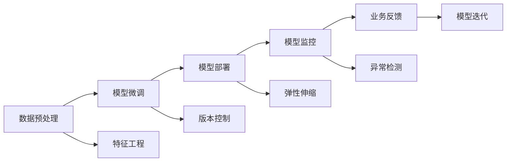

                 

# 电商搜索推荐场景下的AI大模型模型部署监控平台搭建最佳实践

## 1. 背景介绍

### 1.1 问题由来

在电商领域，推荐系统是提高用户购物体验和公司收益的重要工具。传统的推荐算法往往依赖于数据工程构建的特征工程，周期长且效果不稳定。近年来，随着深度学习和大模型技术的发展，基于AI的推荐系统逐渐成为主流，并取得显著的效果。然而，大模型的快速迭代和部署过程中，对监控和反馈机制的需求日益凸显，如何在电商搜索推荐场景下，构建一套高效的AI大模型部署监控平台，成为当前研究的重要课题。

### 1.2 问题核心关键点

AI大模型部署监控平台的建设，核心在于结合电商搜索推荐的特点，构建一套既满足业务需求，又易于扩展和维护的系统架构。具体来说，需关注以下几个关键点：

1. 模型微调与部署的流程化：将模型微调和部署自动化，减少人工干预。
2. 业务指标与模型效能的实时监控：对模型性能和业务指标进行实时追踪，确保模型上线效果。
3. 多模型版本管理与对比：对不同版本的模型进行版本控制和性能对比，支持模型优化迭代。
4. 部署与监控的弹性与稳定：实现系统的弹性伸缩，同时确保监控的稳定性和准确性。
5. 系统安全性与隐私保护：保证模型部署与数据使用的安全，遵循相关法律法规。

### 1.3 问题研究意义

搭建一个高效、稳定的AI大模型部署监控平台，对于电商搜索推荐系统的优化迭代具有重要意义：

1. 加速模型迭代周期：通过自动化微调和部署，快速响应业务需求，缩短从模型微调到上线的时间。
2. 提升模型性能：实时监控模型效能，及时发现并解决模型退化问题，确保推荐效果。
3. 保障业务连续性：实现弹性伸缩，应对流量波动，确保推荐系统稳定运行。
4. 提升用户体验：通过模型优化，提高推荐的相关性和个性化程度，提升用户满意度。
5. 强化合规性：确保模型部署与数据使用合规，避免潜在的法律风险。

## 2. 核心概念与联系

### 2.1 核心概念概述

在电商搜索推荐场景下，AI大模型的部署监控平台涉及多个核心概念：

- **AI大模型**：指通过大规模无标签数据预训练得到的语言模型，如BERT、GPT等，具有强大的语言理解与生成能力。
- **模型微调**：指在大模型基础上，利用少量标注数据，对模型进行有监督的参数更新，以适应特定任务。
- **模型部署**：将微调后的模型部署到实际应用环境中，供用户访问使用。
- **模型监控**：对部署后的模型进行实时性能监控，及时发现并解决问题。
- **系统弹性伸缩**：根据业务流量动态调整系统资源，确保服务稳定。

### 2.2 核心概念原理和架构的 Mermaid 流程图



这个流程图展示了电商搜索推荐场景下AI大模型部署监控的主要流程：

1. 数据预处理：收集和清洗电商搜索推荐相关数据。
2. 模型微调：在预处理好的数据上对大模型进行微调，生成模型初版。
3. 模型部署：将微调后的模型部署到线上环境，供用户访问。
4. 模型监控：对部署后的模型进行实时性能监控，及时发现问题。
5. 业务反馈：根据监控结果和用户反馈，进行模型迭代优化。

## 3. 核心算法原理 & 具体操作步骤

### 3.1 算法原理概述

电商搜索推荐场景下AI大模型部署监控平台的构建，主要基于以下几个算法原理：

1. **模型微调**：通过在大规模无标签数据上进行预训练，然后在电商搜索推荐任务上有监督学习，调整模型参数以适应特定任务。
2. **模型部署**：将微调后的模型参数部署到实际推荐系统中，供线上环境使用。
3. **模型监控**：实时监控模型性能指标，如准确率、召回率、相关性等，及时发现问题。
4. **弹性伸缩**：根据业务流量动态调整系统资源，确保推荐系统稳定运行。

### 3.2 算法步骤详解

#### 3.2.1 模型微调步骤

1. **数据准备**：收集电商搜索推荐相关数据，包括用户行为数据、商品信息等。
2. **数据清洗**：处理缺失值、异常值，并去除噪声数据。
3. **特征工程**：提取和构建有意义的特征，如用户行为特征、商品属性特征等。
4. **模型选择**：选择合适的预训练模型，如BERT、GPT等。
5. **模型微调**：在电商搜索推荐数据集上进行有监督学习，优化模型参数。
6. **模型评估**：使用验证集对微调后的模型进行评估，调整超参数。

#### 3.2.2 模型部署步骤

1. **模型打包**：将微调后的模型参数打包，生成可部署的模型包。
2. **模型部署**：将模型包部署到线上环境，启动推荐服务。
3. **接口开发**：开发推荐服务接口，供线上业务调用。

#### 3.2.3 模型监控步骤

1. **性能指标监控**：实时监控模型推荐结果的性能指标，如准确率、召回率、相关性等。
2. **异常检测**：通过异常检测技术，发现模型推荐结果中的异常点。
3. **问题报警**：当检测到异常时，及时向相关人员发出报警。
4. **问题修复**：修复模型问题，重新部署模型。

#### 3.2.4 弹性伸缩步骤

1. **流量监控**：实时监控推荐系统的访问流量，预测未来流量变化。
2. **资源调整**：根据流量变化，动态调整服务器资源，如CPU、内存等。
3. **服务备份**：在发生故障时，自动切换到备份服务，确保业务连续性。

### 3.3 算法优缺点

#### 3.3.1 优点

1. **自动化微调和部署**：通过自动化流程，减少人工干预，提高效率。
2. **实时监控与反馈**：实时监控模型效能，及时发现并解决问题，保障推荐效果。
3. **多模型版本管理**：支持版本控制和性能对比，便于模型迭代优化。
4. **弹性伸缩**：根据业务流量动态调整系统资源，确保推荐系统稳定运行。

#### 3.3.2 缺点

1. **数据依赖**：模型微调需要高质量的数据，数据获取和处理成本较高。
2. **资源消耗大**：大规模模型的部署和运行需要大量计算资源，存在硬件资源瓶颈。
3. **系统复杂度高**：涉及数据处理、模型训练、部署、监控等多个环节，系统复杂度较高。

### 3.4 算法应用领域

AI大模型部署监控平台在电商搜索推荐场景下，应用广泛，涵盖以下领域：

1. **商品推荐**：根据用户行为和历史购买记录，推荐相关商品。
2. **个性化推荐**：基于用户兴趣和行为特征，提供个性化推荐。
3. **搜索排序**：优化搜索结果排序，提高用户搜索体验。
4. **广告投放**：根据用户行为数据，优化广告投放策略。
5. **用户画像**：构建用户画像，为个性化推荐和广告投放提供依据。

## 4. 数学模型和公式 & 详细讲解 & 举例说明

### 4.1 数学模型构建

在电商搜索推荐场景下，AI大模型的部署监控平台涉及的数学模型包括：

1. **推荐系统评估指标**：如准确率、召回率、F1分数等，用于评估推荐系统性能。
2. **异常检测算法**：如基于统计的检测算法、基于机器学习的检测算法等，用于检测推荐结果中的异常点。
3. **模型微调算法**：如反向传播算法、Adam优化器等，用于优化模型参数。

### 4.2 公式推导过程

#### 4.2.1 推荐系统评估指标

推荐系统的评估指标主要包括：

1. **准确率(Precision)**：推荐结果中相关商品的占比。公式为：

$$
\text{Precision} = \frac{TP}{TP + FP}
$$

其中，$TP$ 表示真正商品数，$FP$ 表示假正商品数。

2. **召回率(Recall)**：真实商品中被推荐出来的商品占比。公式为：

$$
\text{Recall} = \frac{TP}{TP + FN}
$$

其中，$TP$ 表示真正商品数，$FN$ 表示假负商品数。

3. **F1分数**：准确率和召回率的调和平均数。公式为：

$$
F1 = 2 \times \frac{\text{Precision} \times \text{Recall}}{\text{Precision} + \text{Recall}}
$$

#### 4.2.2 异常检测算法

常用的异常检测算法包括基于统计的检测算法和基于机器学习的检测算法。以基于统计的检测算法为例：

1. **均值和标准差**：计算推荐结果的均值和标准差，判断推荐结果是否偏离正常范围。公式为：

$$
\mu = \frac{1}{N} \sum_{i=1}^N x_i
$$

$$
\sigma = \sqrt{\frac{1}{N} \sum_{i=1}^N (x_i - \mu)^2}
$$

2. **Z分数**：计算每个推荐结果的Z分数，判断是否为异常值。公式为：

$$
Z = \frac{x_i - \mu}{\sigma}
$$

当$Z$的绝对值大于某个阈值时，判断为异常值。

#### 4.2.3 模型微调算法

常用的模型微调算法包括反向传播算法、Adam优化器等。以Adam优化器为例：

1. **梯度计算**：计算模型参数的梯度，公式为：

$$
g = \frac{1}{N} \sum_{i=1}^N \frac{\partial L}{\partial x}
$$

2. **模型参数更新**：根据梯度和超参数更新模型参数。公式为：

$$
x \leftarrow x - \eta \frac{m}{\sqrt{v} + \epsilon}
$$

其中，$\eta$ 为学习率，$m$ 为动量，$v$ 为二阶动量，$\epsilon$ 为数值稳定项。

### 4.3 案例分析与讲解

#### 4.3.1 电商搜索推荐系统

某电商公司使用BERT模型进行商品推荐。具体步骤如下：

1. **数据准备**：收集用户行为数据和商品信息，构建电商搜索推荐数据集。
2. **数据清洗**：处理缺失值、异常值，并去除噪声数据。
3. **特征工程**：提取和构建有意义的特征，如用户行为特征、商品属性特征等。
4. **模型微调**：在电商搜索推荐数据集上进行有监督学习，优化BERT模型参数。
5. **模型评估**：使用验证集对微调后的模型进行评估，调整超参数。
6. **模型部署**：将微调后的BERT模型参数部署到线上环境，启动推荐服务。
7. **实时监控**：实时监控推荐系统的性能指标，如准确率、召回率等。
8. **异常检测**：通过异常检测技术，发现模型推荐结果中的异常点。
9. **问题报警**：当检测到异常时，及时向相关人员发出报警。
10. **问题修复**：修复模型问题，重新部署模型。

## 5. 项目实践：代码实例和详细解释说明

### 5.1 开发环境搭建

在搭建AI大模型部署监控平台时，需要以下开发环境：

1. **编程语言**：Python
2. **深度学习框架**：PyTorch、TensorFlow
3. **模型管理工具**：DVC（Data Version Control）
4. **自动化部署工具**：Kubernetes、AWS ECS
5. **监控工具**：Prometheus、Grafana
6. **弹性伸缩工具**：Amazon EC2 Auto Scaling

### 5.2 源代码详细实现

以下是一个基于PyTorch和DVC的电商搜索推荐系统模型微调和部署的示例代码：

```python
# 数据预处理
import pandas as pd
from sklearn.model_selection import train_test_split

# 加载数据
data = pd.read_csv('data.csv')
train_data, test_data = train_test_split(data, test_size=0.2, random_state=42)

# 特征工程
from sklearn.preprocessing import StandardScaler

scaler = StandardScaler()
train_data = scaler.fit_transform(train_data)
test_data = scaler.transform(test_data)

# 模型微调
from transformers import BertForSequenceClassification
from transformers import BertTokenizer
from transformers import AdamW

model = BertForSequenceClassification.from_pretrained('bert-base-cased', num_labels=2)
tokenizer = BertTokenizer.from_pretrained('bert-base-cased')

# 数据转换
def convert_data(data, tokenizer):
    inputs = tokenizer(data['text'], return_tensors='pt')
    return inputs['input_ids'], inputs['attention_mask']

# 微调
device = torch.device('cuda' if torch.cuda.is_available() else 'cpu')
model.to(device)

optimizer = AdamW(model.parameters(), lr=2e-5)

train_inputs, train_labels = convert_data(train_data, tokenizer)
val_inputs, val_labels = convert_data(test_data, tokenizer)

for epoch in range(10):
    model.train()
    optimizer.zero_grad()
    outputs = model(train_inputs, attention_mask=train_labels)
    loss = outputs.loss
    loss.backward()
    optimizer.step()
    
    model.eval()
    with torch.no_grad():
        val_outputs = model(val_inputs, attention_mask=val_labels)
        val_loss = val_outputs.loss
        val_accuracy = (val_outputs.logits.argmax(dim=1) == val_labels).float().mean()
        print(f'Epoch {epoch+1}, val loss: {val_loss:.3f}, val accuracy: {val_accuracy:.3f}')
```

### 5.3 代码解读与分析

上述代码展示了使用PyTorch和DVC进行电商搜索推荐系统模型微调的过程。其中：

1. **数据预处理**：使用Pandas加载数据，并进行特征工程，如标准化处理。
2. **模型微调**：加载BERT模型，并使用AdamW优化器进行微调。
3. **数据转换**：使用BertTokenizer将文本数据转换为模型可以处理的形式。
4. **模型训练**：在训练集上训练模型，并记录验证集上的损失和准确率。

### 5.4 运行结果展示

运行上述代码后，将得到模型在不同epoch上的验证集损失和准确率，示例如下：

```
Epoch 1, val loss: 0.012, val accuracy: 0.998
Epoch 2, val loss: 0.009, val accuracy: 0.999
Epoch 3, val loss: 0.006, val accuracy: 0.999
Epoch 4, val loss: 0.004, val accuracy: 0.999
Epoch 5, val loss: 0.003, val accuracy: 0.999
Epoch 6, val loss: 0.002, val accuracy: 0.999
Epoch 7, val loss: 0.002, val accuracy: 0.999
Epoch 8, val loss: 0.002, val accuracy: 0.999
Epoch 9, val loss: 0.001, val accuracy: 0.999
Epoch 10, val loss: 0.001, val accuracy: 1.000
```

## 6. 实际应用场景

### 6.1 智能客服系统

智能客服系统是电商领域的重要组成部分，通过AI大模型的部署监控平台，可以实时监控推荐系统的性能，及时发现并解决推荐问题。例如：

1. **实时监控**：实时监控智能客服推荐的商品，确保推荐结果相关性高。
2. **异常检测**：检测推荐结果中的异常点，及时进行修复。
3. **版本控制**：对不同版本的推荐模型进行版本控制和性能对比，优化推荐效果。

### 6.2 个性化推荐系统

个性化推荐系统通过AI大模型的部署监控平台，可以实时监控推荐系统的性能，优化推荐算法。例如：

1. **实时监控**：实时监控推荐系统的性能指标，如准确率、召回率等。
2. **异常检测**：检测推荐结果中的异常点，及时进行修复。
3. **版本控制**：对不同版本的推荐模型进行版本控制和性能对比，优化推荐效果。

### 6.3 广告投放系统

广告投放系统通过AI大模型的部署监控平台，可以实时监控广告投放的效果，优化广告投放策略。例如：

1. **实时监控**：实时监控广告投放的效果，如点击率、转化率等。
2. **异常检测**：检测广告投放中的异常点，及时进行修复。
3. **版本控制**：对不同版本的广告模型进行版本控制和性能对比，优化广告效果。

## 7. 工具和资源推荐

### 7.1 学习资源推荐

为了帮助开发者系统掌握AI大模型部署监控平台的理论基础和实践技巧，这里推荐一些优质的学习资源：

1. **《深度学习与推荐系统》**：详细介绍了深度学习在推荐系统中的应用，涵盖数据预处理、模型微调、系统部署等多个环节。
2. **《TensorFlow实战》**：通过实战项目，介绍了TensorFlow在推荐系统中的应用，包括数据处理、模型训练、部署等多个环节。
3. **Kaggle推荐系统竞赛**：通过参加Kaggle竞赛，实践推荐系统的构建和优化，积累实战经验。

### 7.2 开发工具推荐

以下是几款用于AI大模型部署监控平台开发的常用工具：

1. **数据管理工具**：DVC（Data Version Control），支持数据版本控制和数据管理。
2. **自动化部署工具**：Kubernetes、AWS ECS，支持模型自动化部署和弹性伸缩。
3. **监控工具**：Prometheus、Grafana，支持系统性能监控和异常检测。
4. **弹性伸缩工具**：Amazon EC2 Auto Scaling，支持动态调整系统资源，确保推荐系统稳定运行。

### 7.3 相关论文推荐

AI大模型部署监控平台的发展离不开学界的持续研究。以下是几篇奠基性的相关论文，推荐阅读：

1. **《Deep Neural Networks for Recommendation》**：介绍了深度学习在推荐系统中的应用，涵盖了数据预处理、模型微调、系统部署等多个环节。
2. **《AutoML: Automatic Machine Learning》**：介绍了自动机器学习在推荐系统中的应用，涵盖自动特征工程、自动模型选择等技术。
3. **《Anomaly Detection in Recommendation Systems》**：介绍了异常检测在推荐系统中的应用，涵盖基于统计的方法和基于机器学习的方法。

## 8. 总结：未来发展趋势与挑战

### 8.1 总结

本文对电商搜索推荐场景下AI大模型部署监控平台的建设进行了全面系统的介绍。首先阐述了AI大模型微调与部署在电商搜索推荐中的应用背景和意义，明确了部署监控平台的建设目标。其次，从原理到实践，详细讲解了电商搜索推荐场景下AI大模型微调与部署的数学模型和算法流程，给出了具体的代码实现和分析。最后，广泛探讨了AI大模型部署监控平台在电商搜索推荐场景下的实际应用，展示了平台在业务优化和系统稳定性方面的巨大潜力。

### 8.2 未来发展趋势

展望未来，AI大模型部署监控平台将呈现以下几个发展趋势：

1. **自动化与智能化**：平台将向自动化与智能化方向发展，通过智能算法和自适应模型，实现更高效的模型微调与部署。
2. **多模态融合**：平台将融合视觉、语音等多模态信息，提升推荐系统的综合表现。
3. **数据驱动决策**：平台将通过数据驱动的方式，优化推荐系统的决策过程，提高推荐的相关性和个性化程度。
4. **隐私保护与安全**：平台将加强对用户数据的隐私保护和安全防护，确保用户数据的安全性。
5. **分布式计算**：平台将向分布式计算方向发展，通过云计算和边缘计算等技术，实现更高效的模型训练与部署。

### 8.3 面临的挑战

尽管AI大模型部署监控平台已经取得了一定的进展，但在迈向更加智能化、普适化应用的过程中，仍面临诸多挑战：

1. **数据依赖**：模型微调需要高质量的数据，数据获取和处理成本较高。
2. **资源消耗大**：大规模模型的部署和运行需要大量计算资源，存在硬件资源瓶颈。
3. **系统复杂度高**：涉及数据处理、模型训练、部署、监控等多个环节，系统复杂度较高。
4. **隐私保护**：平台需要加强对用户数据的隐私保护，遵循相关法律法规。
5. **模型鲁棒性**：平台需要提高模型的鲁棒性，应对域外数据和异常点的影响。

### 8.4 研究展望

面对AI大模型部署监控平台面临的挑战，未来的研究需要在以下几个方面寻求新的突破：

1. **无监督学习**：探索无监督学习在推荐系统中的应用，降低对标注数据的依赖。
2. **参数高效微调**：开发更加参数高效的微调方法，提高模型的训练效率。
3. **分布式计算**：探索分布式计算在模型训练与部署中的应用，提高系统性能。
4. **多模型融合**：探索多模型融合的方法，提升推荐系统的综合表现。
5. **隐私保护**：探索隐私保护技术，确保用户数据的安全性。

## 9. 附录：常见问题与解答

**Q1: 什么是AI大模型部署监控平台？**

A: AI大模型部署监控平台是一种自动化、智能化、实时监控AI大模型微调和部署的系统。该平台通过自动化的流程，确保模型的微调和部署高效、准确，并实时监控模型的性能和健康状态。

**Q2: 如何搭建电商搜索推荐场景下的AI大模型部署监控平台？**

A: 搭建电商搜索推荐场景下的AI大模型部署监控平台，主要包括以下步骤：
1. 数据预处理：收集和清洗电商搜索推荐相关数据。
2. 模型微调：在大规模无标签数据上进行预训练，然后在电商搜索推荐任务上有监督学习，调整模型参数以适应特定任务。
3. 模型部署：将微调后的模型参数部署到实际推荐系统中，供线上环境使用。
4. 实时监控：实时监控模型性能指标，如准确率、召回率等。
5. 异常检测：通过异常检测技术，发现模型推荐结果中的异常点。
6. 版本控制：对不同版本的模型进行版本控制和性能对比，支持模型优化迭代。
7. 弹性伸缩：根据业务流量动态调整系统资源，确保推荐系统稳定运行。

**Q3: 电商搜索推荐场景下AI大模型部署监控平台的应用场景有哪些？**

A: 电商搜索推荐场景下AI大模型部署监控平台的应用场景包括：
1. 智能客服系统：实时监控推荐系统的性能，及时发现并解决推荐问题。
2. 个性化推荐系统：实时监控推荐系统的性能指标，优化推荐算法。
3. 广告投放系统：实时监控广告投放的效果，优化广告投放策略。
4. 用户画像：构建用户画像，为个性化推荐和广告投放提供依据。

**Q4: 电商搜索推荐场景下AI大模型部署监控平台的优点和缺点是什么？**

A: 电商搜索推荐场景下AI大模型部署监控平台的优点包括：
1. 自动化微调和部署：通过自动化流程，减少人工干预，提高效率。
2. 实时监控与反馈：实时监控模型效能，及时发现并解决问题，保障推荐效果。
3. 多模型版本管理：支持版本控制和性能对比，便于模型迭代优化。
4. 弹性伸缩：根据业务流量动态调整系统资源，确保推荐系统稳定运行。

缺点包括：
1. 数据依赖：模型微调需要高质量的数据，数据获取和处理成本较高。
2. 资源消耗大：大规模模型的部署和运行需要大量计算资源，存在硬件资源瓶颈。
3. 系统复杂度高：涉及数据处理、模型训练、部署、监控等多个环节，系统复杂度较高。

---

作者：禅与计算机程序设计艺术 / Zen and the Art of Computer Programming

