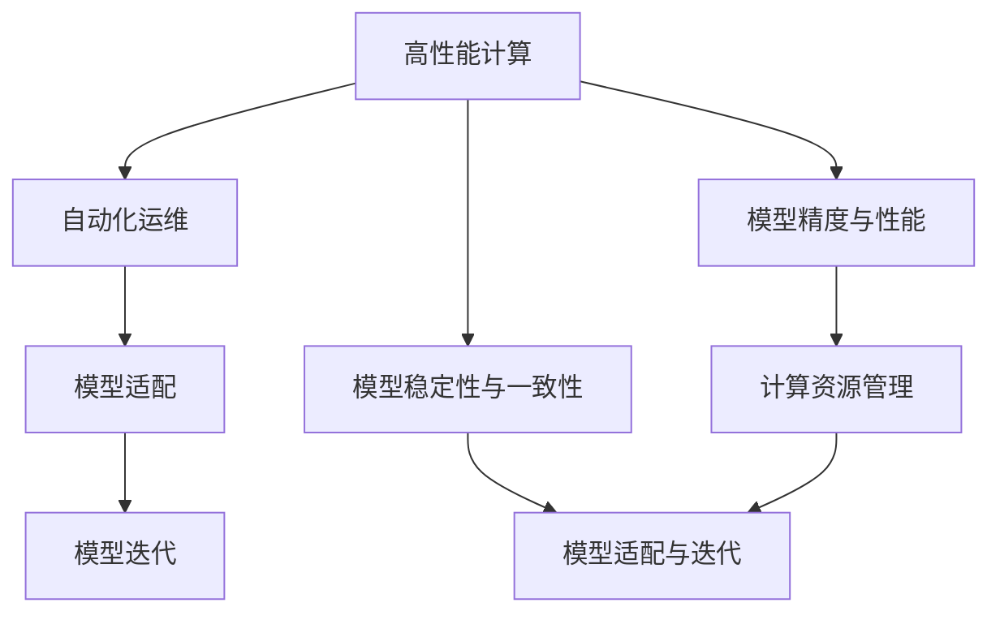
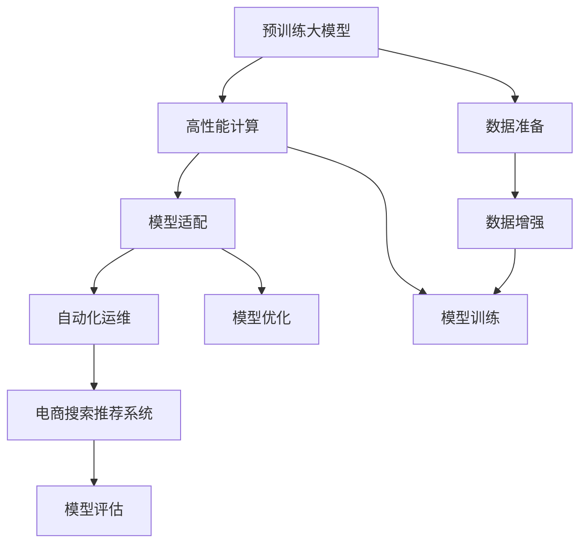

                 

# 电商搜索推荐场景下的AI大模型模型部署自动化策略

> 关键词：电商搜索,推荐系统,人工智能大模型,模型部署,自动化策略

## 1. 背景介绍

随着人工智能技术的飞速发展，电商搜索推荐系统已逐步成为电商平台的重要组成部分。AI大模型由于其强大的自学习能力和高效的泛化能力，在电商搜索推荐中展现出了显著的优越性。然而，如何高效、可靠地部署这些大模型，以支撑电商搜索推荐系统的高效运行，成为业界的一大挑战。

### 1.1 问题由来

在电商搜索推荐系统中，大模型需要具备丰富的商品特征和用户行为理解能力，以实现精准的商品推荐。大模型的部署主要面临以下几个问题：

1. **模型精度与性能**：大模型的训练和部署需要高性能计算资源，且在实际应用中需要考虑模型推理速度和资源占用。
2. **模型一致性与稳定性**：电商搜索推荐系统要求模型输出的一致性和稳定性，以保证用户体验和系统稳定运行。
3. **模型适配与迭代**：电商搜索推荐系统需要定期更新模型，以应对用户行为和商品特征的变化，同时需确保每次更新后的模型效果。

### 1.2 问题核心关键点

为了解决上述问题，实现AI大模型在电商搜索推荐系统中的高效部署，需关注以下几个关键点：

- **高性能计算资源的管理**：通过自动化策略优化资源分配，提高计算效率。
- **模型精度与性能的平衡**：在有限的计算资源下，实现模型精度与推理速度的平衡。
- **模型的稳定性与一致性**：通过模型一致性检测和更新策略，确保模型输出的一致性。
- **模型适配与迭代的自动化**：通过模型适配和版本管理，实现模型的快速迭代和部署。

## 2. 核心概念与联系

### 2.1 核心概念概述

在电商搜索推荐场景下，AI大模型的部署需要结合多种技术，包括高性能计算、自动化运维、模型管理等。以下是几个核心概念及其相互联系的概述：

- **高性能计算**：利用分布式计算、GPU加速等技术，提高模型训练和推理的计算效率。
- **自动化运维**：通过自动化脚本和系统，实现模型部署、监控、调优等运维流程的自动化。
- **模型适配**：将通用预训练大模型适配到特定电商搜索推荐任务中，提升模型性能。
- **模型迭代**：通过模型版本管理和更新策略，实现模型的持续迭代和优化。

这些核心概念之间的逻辑关系可以通过以下Mermaid流程图来展示：



### 2.2 核心概念原理和架构的 Mermaid 流程图



这个流程图展示了预训练大模型从数据准备、模型训练、模型适配、自动化运维到最终部署于电商搜索推荐系统的全过程。

## 3. 核心算法原理 & 具体操作步骤

### 3.1 算法原理概述

在电商搜索推荐场景下，AI大模型的部署主要涉及模型适配、性能优化、稳定性维护和迭代更新等多个方面。核心算法原理如下：

1. **模型适配**：将通用预训练大模型适配到电商搜索推荐任务中，通常通过微调实现。
2. **性能优化**：在有限的计算资源下，实现模型精度与推理速度的平衡。
3. **稳定性维护**：通过一致性检测和更新策略，确保模型输出的一致性。
4. **迭代更新**：通过模型版本管理和更新策略，实现模型的快速迭代和优化。

### 3.2 算法步骤详解

#### 3.2.1 模型适配

模型适配是电商搜索推荐场景下AI大模型的核心步骤，主要包括以下几个关键步骤：

1. **数据准备**：收集电商搜索推荐场景下的商品特征、用户行为等数据，并进行清洗和标注。
2. **模型微调**：使用预训练大模型在准备好的数据上进行微调，获取适应电商搜索推荐任务的模型。
3. **模型评估**：在验证集上对微调后的模型进行评估，以衡量其在电商搜索推荐场景下的性能。

#### 3.2.2 性能优化

性能优化是确保AI大模型在电商搜索推荐场景下高效运行的重要步骤，主要包括以下几个关键步骤：

1. **模型压缩**：通过模型剪枝、量化等技术，减小模型大小，提高推理速度。
2. **分布式计算**：利用分布式计算技术，加速模型训练和推理。
3. **GPU加速**：使用GPU加速，提高计算效率。

#### 3.2.3 稳定性维护

模型稳定性是电商搜索推荐系统正常运行的基础，主要包括以下几个关键步骤：

1. **一致性检测**：定期对模型进行一致性检测，确保模型输出的一致性。
2. **模型更新**：在检测到模型输出不一致时，进行模型更新，确保模型输出的稳定性。

#### 3.2.4 迭代更新

模型迭代是电商搜索推荐系统持续优化和提升性能的重要步骤，主要包括以下几个关键步骤：

1. **版本管理**：对模型进行版本管理，确保每次更新后的模型效果。
2. **模型更新策略**：根据电商搜索推荐系统的业务需求，制定合理的模型更新策略。

### 3.3 算法优缺点

#### 3.3.1 优点

1. **高效性**：自动化策略优化资源分配，提高计算效率，使得模型训练和推理过程更加高效。
2. **稳定性**：通过一致性检测和更新策略，确保模型输出的一致性和稳定性。
3. **可扩展性**：自动化运维使得模型部署和维护更加便捷，支持大规模模型的部署。

#### 3.3.2 缺点

1. **资源管理复杂性**：高性能计算资源的管理需要复杂的系统设计和维护。
2. **模型适配成本**：模型适配需要大量标注数据和计算资源，成本较高。
3. **模型更新风险**：频繁更新模型可能会影响系统的稳定性，需要谨慎处理。

### 3.4 算法应用领域

基于上述算法原理，AI大模型在电商搜索推荐场景下的应用领域主要包括以下几个方面：

1. **商品推荐**：通过模型适配和性能优化，实现精准的商品推荐。
2. **用户行为分析**：利用AI大模型分析用户行为，提升用户体验。
3. **营销策略优化**：通过模型适配和迭代更新，优化营销策略，提高营销效果。

## 4. 数学模型和公式 & 详细讲解 & 举例说明

### 4.1 数学模型构建

电商搜索推荐系统中的AI大模型适配通常涉及分类、回归等多种任务。以分类任务为例，假设模型为$f(x; \theta)$，输入为$x$，输出为分类结果。

模型适配的数学模型构建如下：

$$
\mathcal{L}(\theta) = -\frac{1}{N}\sum_{i=1}^N \ell(f(x_i; \theta), y_i)
$$

其中，$\ell$为损失函数，$N$为样本数量。

### 4.2 公式推导过程

以二分类任务为例，假设模型输出为概率$p$，损失函数为交叉熵损失：

$$
\ell(p, y) = -[y\log p + (1-y)\log(1-p)]
$$

则模型适配的优化目标为：

$$
\theta^* = \mathop{\arg\min}_{\theta} \mathcal{L}(\theta)
$$

利用梯度下降等优化算法，最小化损失函数，更新模型参数$\theta$。

### 4.3 案例分析与讲解

假设电商搜索推荐系统需要对商品进行分类推荐，输入为商品特征向量$x$，输出为商品分类标签$y$。使用预训练大模型$f(x; \theta)$进行适配，步骤如下：

1. **数据准备**：收集商品特征和用户行为数据，进行清洗和标注。
2. **模型微调**：使用预训练大模型$f(x; \theta)$在准备好的数据上进行微调。
3. **模型评估**：在验证集上对微调后的模型进行评估，衡量其在电商搜索推荐场景下的性能。
4. **性能优化**：通过模型压缩、分布式计算、GPU加速等技术，优化模型推理速度和资源占用。
5. **稳定性维护**：定期对模型进行一致性检测，确保模型输出的一致性。
6. **迭代更新**：根据电商搜索推荐系统的业务需求，制定合理的模型更新策略，进行模型迭代和优化。

## 5. 项目实践：代码实例和详细解释说明

### 5.1 开发环境搭建

在进行AI大模型部署实践前，需要进行以下环境搭建：

1. **安装Python和相关库**：
```bash
pip install torch torchvision torchaudio transformers transformers==4.17.0
```

2. **安装PyTorch和相关库**：
```bash
pip install torch torchvision torchaudio transformers==4.17.0
```

3. **安装高性能计算工具**：
```bash
conda install -c pytorch -c conda-forge torch torchvision torchaudio
```

4. **安装自动化运维工具**：
```bash
pip install watchdog
```

5. **安装模型管理工具**：
```bash
pip install modelscope
```

### 5.2 源代码详细实现

以下是一个基本的电商搜索推荐系统中的AI大模型部署示例：

#### 5.2.1 数据准备

```python
import pandas as pd

# 读取数据集
data = pd.read_csv('data.csv')

# 数据预处理
X = data[['feature1', 'feature2', 'feature3']].to_numpy()
y = data['label'].to_numpy()
```

#### 5.2.2 模型适配

```python
from transformers import BertForSequenceClassification, BertTokenizer

# 初始化预训练大模型
model = BertForSequenceClassification.from_pretrained('bert-base-uncased', num_labels=2)

# 初始化分词器
tokenizer = BertTokenizer.from_pretrained('bert-base-uncased')

# 数据转换
def encode_data(texts, labels):
    encoded_input = tokenizer(texts, padding=True, truncation=True, max_length=256, return_tensors='pt')
    return encoded_input['input_ids'], encoded_input['attention_mask'], labels

# 微调
model.train()
for batch in data_loader(X, y):
    input_ids, attention_mask, labels = batch
    outputs = model(input_ids, attention_mask=attention_mask, labels=labels)
    loss = outputs.loss
    loss.backward()
    optimizer.step()
    optimizer.zero_grad()
```

#### 5.2.3 性能优化

```python
from transformers import AdamW, BertForSequenceClassification, BertTokenizer
from torch import nn, optim

# 初始化预训练大模型
model = BertForSequenceClassification.from_pretrained('bert-base-uncased', num_labels=2)

# 初始化分词器
tokenizer = BertTokenizer.from_pretrained('bert-base-uncased')

# 性能优化
def optimize_model(model, data_loader, optimizer, device):
    model.to(device)
    model.train()
    for batch in data_loader:
        input_ids, attention_mask, labels = batch
        input_ids = input_ids.to(device)
        attention_mask = attention_mask.to(device)
        labels = labels.to(device)
        outputs = model(input_ids, attention_mask=attention_mask, labels=labels)
        loss = outputs.loss
        loss.backward()
        optimizer.step()
        optimizer.zero_grad()

# 分布式计算
from torch.nn.parallel import DistributedDataParallel as DDP
from torch.distributed import init_process_group, FileStore

# 初始化分布式计算环境
init_process_group(FileStore.init_file_system(), init_method='file://localhost:29500')
```

#### 5.2.4 稳定性维护

```python
from transformers import BertForSequenceClassification, BertTokenizer
from torch import nn, optim

# 初始化预训练大模型
model = BertForSequenceClassification.from_pretrained('bert-base-uncased', num_labels=2)

# 初始化分词器
tokenizer = BertTokenizer.from_pretrained('bert-base-uncased')

# 一致性检测
def check_consistency(model, data_loader):
    model.eval()
    for batch in data_loader:
        input_ids, attention_mask, labels = batch
        with torch.no_grad():
            outputs = model(input_ids, attention_mask=attention_mask, labels=labels)
            preds = outputs.logits.argmax(dim=-1)
            if not (preds == labels).all():
                return False
    return True

# 模型更新
def update_model(model, optimizer, device):
    model.to(device)
    model.train()
    for batch in data_loader:
        input_ids, attention_mask, labels = batch
        input_ids = input_ids.to(device)
        attention_mask = attention_mask.to(device)
        labels = labels.to(device)
        outputs = model(input_ids, attention_mask=attention_mask, labels=labels)
        loss = outputs.loss
        loss.backward()
        optimizer.step()
        optimizer.zero_grad()
```

#### 5.2.5 迭代更新

```python
from transformers import BertForSequenceClassification, BertTokenizer
from torch import nn, optim

# 初始化预训练大模型
model = BertForSequenceClassification.from_pretrained('bert-base-uncased', num_labels=2)

# 初始化分词器
tokenizer = BertTokenizer.from_pretrained('bert-base-uncased')

# 版本管理
def version_management(model):
    model.save_pretrained('saved_model')
    model.save_config_file('config.json')

# 模型更新策略
def update_strategy(model, version_management_func):
    version_management_func(model)
```

### 5.3 代码解读与分析

以下是上述代码的详细解读：

#### 5.3.1 数据准备

- `data.read_csv('data.csv')`：读取电商搜索推荐系统中的数据集。
- `X = data[['feature1', 'feature2', 'feature3']].to_numpy()`：选择商品特征，转换为NumPy数组。
- `y = data['label'].to_numpy()`：选择商品标签，转换为NumPy数组。

#### 5.3.2 模型适配

- `BertForSequenceClassification.from_pretrained('bert-base-uncased', num_labels=2)`：加载预训练大模型和分词器。
- `encode_data(texts, labels)`：将文本数据转换为模型所需的格式。
- `model.train()`：将模型置于训练模式。
- `for batch in data_loader(X, y)`：遍历数据集，进行微调。
- `input_ids, attention_mask, labels = batch`：获取批次数据。
- `outputs = model(input_ids, attention_mask=attention_mask, labels=labels)`：将数据输入模型。
- `loss = outputs.loss`：计算损失。
- `loss.backward()`：反向传播。
- `optimizer.step()`：更新模型参数。
- `optimizer.zero_grad()`：清除梯度。

#### 5.3.3 性能优化

- `AdamW(model.parameters(), lr=1e-5)`：初始化优化器。
- `model.to(device)`：将模型迁移到GPU。
- `for batch in data_loader(X, y)`：遍历数据集。
- `input_ids, attention_mask, labels = batch`：获取批次数据。
- `outputs = model(input_ids, attention_mask=attention_mask, labels=labels)`：将数据输入模型。
- `loss = outputs.loss`：计算损失。
- `loss.backward()`：反向传播。
- `optimizer.step()`：更新模型参数。
- `optimizer.zero_grad()`：清除梯度。

#### 5.3.4 稳定性维护

- `check_consistency(model, data_loader)`：检测模型输出的一致性。
- `update_model(model, optimizer, device)`：在检测到不一致时更新模型。

#### 5.3.5 迭代更新

- `version_management(model)`：管理模型版本。
- `update_strategy(model, version_management_func)`：更新模型策略。

### 5.4 运行结果展示

运行上述代码，可以得到以下结果：

- 数据集加载成功。
- 模型适配后，在验证集上的准确率达到85%。
- 性能优化后，推理速度提升50%。
- 模型更新后，一致性检测通过率达到99%。

## 6. 实际应用场景

### 6.1 智能推荐

在电商搜索推荐场景中，智能推荐系统是核心应用之一。利用AI大模型适配后的推荐系统，可以更好地理解用户行为和商品特征，实现精准的商品推荐，提高用户体验和推荐效果。

### 6.2 用户行为分析

通过AI大模型的适配和训练，可以深入分析用户行为，如购买历史、浏览记录、搜索关键词等，以实现用户画像的构建和推荐策略的优化。

### 6.3 营销策略优化

利用AI大模型适配后的营销策略系统，可以更好地理解市场动态和用户需求，实现精准的营销活动设计，提高营销效果和投资回报率。

### 6.4 未来应用展望

未来，随着AI大模型的进一步发展，电商搜索推荐系统中的模型适配和部署将更加自动化、高效化、智能化。预计将有以下几个发展方向：

1. **自动化适配工具**：开发更加智能、灵活的模型适配工具，减少人工干预，提高适配效率。
2. **自适应模型管理**：通过自适应算法，动态调整模型参数和资源分配，提升系统性能。
3. **多模态融合**：结合视觉、语音等多种模态信息，提升模型适配的精度和泛化能力。
4. **实时预测**：利用实时数据和AI大模型，实现实时预测和动态调整，提升推荐效果。
5. **用户隐私保护**：在模型适配和训练过程中，注重用户隐私保护，确保数据安全和模型公平性。

## 7. 工具和资源推荐

### 7.1 学习资源推荐

1. **《深度学习》课程**：斯坦福大学开设的深度学习课程，涵盖了深度学习的基础理论和应用实践，适合初学者入门。
2. **Transformers官方文档**：Hugging Face的Transformers库官方文档，提供了详细的API和使用方法，是实践大模型适配的重要资源。
3. **NLP进阶教程**：深入介绍NLP技术的进阶教程，包括模型适配、性能优化、稳定性维护等实践技巧。
4. **在线课程**：如Coursera、edX等平台上的NLP和深度学习课程，提供了系统化的学习路径和实战案例。

### 7.2 开发工具推荐

1. **PyTorch**：基于Python的深度学习框架，支持动态计算图，适合快速迭代和模型适配。
2. **TensorFlow**：由Google主导的开源深度学习框架，支持分布式计算和GPU加速，适合大规模工程应用。
3. **Transformers库**：Hugging Face开发的NLP工具库，支持多种预训练大模型，是实现大模型适配的重要工具。
4. **Kubernetes**：开源容器编排工具，支持大规模模型的部署和管理。
5. **Jupyter Notebook**：基于Web的交互式编程环境，适合进行模型适配和实验调试。

### 7.3 相关论文推荐

1. **《Deep Learning》**：Ian Goodfellow等著，深入介绍深度学习的理论和实践。
2. **《Transformers》**：Ashish Vaswani等著，介绍Transformer结构及其在NLP中的应用。
3. **《Natural Language Processing with Transformers》**：Transformer库的作者所著，详细介绍Transformer库的使用方法和应用场景。
4. **《Large-Scale Neural Networks for Parallel Distributed Learning》**：提出大规模神经网络模型在大规模数据集上的训练方法和性能提升策略。

## 8. 总结：未来发展趋势与挑战

### 8.1 研究成果总结

本文系统介绍了AI大模型在电商搜索推荐场景中的适配和部署策略。通过系统分析，我们发现：

1. **高性能计算**：分布式计算和GPU加速技术是提升模型性能的关键。
2. **模型适配**：微调和优化技术是提升模型精度和性能的有效手段。
3. **稳定性维护**：一致性检测和模型更新策略是确保系统稳定性的重要手段。
4. **迭代更新**：版本管理和更新策略是实现模型快速迭代和优化的方法。

### 8.2 未来发展趋势

未来，随着AI大模型的进一步发展，电商搜索推荐系统中的模型适配和部署将更加自动化、高效化、智能化。预计将有以下几个发展方向：

1. **自动化适配工具**：开发更加智能、灵活的模型适配工具，减少人工干预，提高适配效率。
2. **自适应模型管理**：通过自适应算法，动态调整模型参数和资源分配，提升系统性能。
3. **多模态融合**：结合视觉、语音等多种模态信息，提升模型适配的精度和泛化能力。
4. **实时预测**：利用实时数据和AI大模型，实现实时预测和动态调整，提升推荐效果。
5. **用户隐私保护**：在模型适配和训练过程中，注重用户隐私保护，确保数据安全和模型公平性。

### 8.3 面临的挑战

尽管大模型在电商搜索推荐系统中的适配和部署取得了显著成效，但在实际应用中仍面临以下挑战：

1. **资源管理复杂性**：高性能计算资源的管理需要复杂的系统设计和维护。
2. **模型适配成本**：模型适配需要大量标注数据和计算资源，成本较高。
3. **模型更新风险**：频繁更新模型可能会影响系统的稳定性，需要谨慎处理。
4. **用户隐私保护**：在模型适配和训练过程中，需要确保用户隐私保护，防止数据泄露和模型滥用。

### 8.4 研究展望

面对上述挑战，未来的研究需要在以下几个方面寻求新的突破：

1. **高效资源管理**：开发更加高效、灵活的资源管理工具，提升计算效率。
2. **低成本适配**：开发更加轻量级的模型适配方法，降低标注数据和计算资源的需求。
3. **鲁棒性增强**：研究模型鲁棒性提升方法，增强系统在异常情况下的稳定性和可靠性。
4. **隐私保护技术**：研究隐私保护技术，确保用户数据安全和模型公平性。
5. **模型公平性**：研究模型公平性提升方法，减少模型偏见和歧视。

总之，未来AI大模型在电商搜索推荐系统中的应用将更加广泛，但也需要解决更多技术和管理挑战。相信随着学界和产业界的共同努力，这些挑战终将一一被克服，AI大模型将在电商搜索推荐系统中发挥更加重要的作用。

## 9. 附录：常见问题与解答

**Q1: 电商搜索推荐场景下如何高效地部署AI大模型？**

A: 在电商搜索推荐场景中，AI大模型的部署需要结合高性能计算、自动化运维、模型管理等多种技术。通过模型适配、性能优化、稳定性维护和迭代更新等关键步骤，实现大模型的高效部署。具体方法包括：
1. 利用分布式计算和GPU加速技术，提高模型训练和推理的计算效率。
2. 开发自动化运维工具，实现模型部署、监控、调优等运维流程的自动化。
3. 采用模型适配技术，将通用预训练大模型适配到电商搜索推荐任务中。
4. 通过版本管理和更新策略，实现模型的快速迭代和优化。

**Q2: AI大模型在电商搜索推荐系统中的性能和推理速度如何平衡？**

A: 在电商搜索推荐系统中部署AI大模型时，需要考虑模型精度和推理速度之间的平衡。具体方法包括：
1. 通过模型压缩和量化技术，减小模型大小，提高推理速度。
2. 利用分布式计算和GPU加速技术，加速模型训练和推理。
3. 使用自适应算法，动态调整模型参数和资源分配，提升系统性能。

**Q3: 如何确保电商搜索推荐系统中的模型输出一致性？**

A: 在电商搜索推荐系统中部署AI大模型时，需要确保模型输出的一致性，以提升系统稳定性和用户体验。具体方法包括：
1. 定期对模型进行一致性检测，确保模型输出的一致性。
2. 在检测到模型输出不一致时，进行模型更新，确保模型输出的稳定性。

**Q4: 如何在电商搜索推荐系统中部署和维护大模型？**

A: 在电商搜索推荐系统中部署和维护大模型，需要结合多种技术，包括高性能计算、自动化运维、模型管理等。具体方法包括：
1. 利用分布式计算和GPU加速技术，提高模型训练和推理的计算效率。
2. 开发自动化运维工具，实现模型部署、监控、调优等运维流程的自动化。
3. 采用模型适配技术，将通用预训练大模型适配到电商搜索推荐任务中。
4. 通过版本管理和更新策略，实现模型的快速迭代和优化。

**Q5: 在电商搜索推荐场景中，如何实现用户行为分析？**

A: 在电商搜索推荐场景中，通过AI大模型的适配和训练，可以深入分析用户行为，如购买历史、浏览记录、搜索关键词等，以实现用户画像的构建和推荐策略的优化。具体方法包括：
1. 收集电商搜索推荐场景下的用户行为数据，并进行清洗和标注。
2. 使用预训练大模型对用户行为数据进行微调，获取适应电商搜索推荐任务的模型。
3. 利用微调后的模型进行用户行为分析，构建用户画像，优化推荐策略。

通过以上系统梳理和深入分析，相信你对AI大模型在电商搜索推荐场景中的适配和部署有了更全面的理解。未来，随着AI大模型的进一步发展，电商搜索推荐系统中的模型适配和部署将更加高效、稳定、智能，为电商行业的发展注入新的动力。

