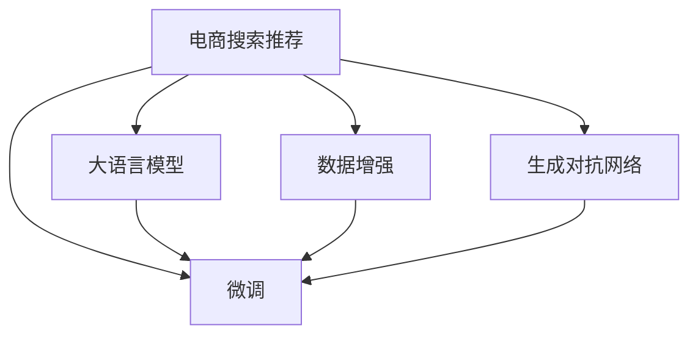

                 

# 电商搜索推荐效果优化中的AI大模型样本扩充技术

## 1. 背景介绍

随着互联网电商的迅猛发展，在线购物成为越来越多人的首选消费方式。然而，庞大的商品库存和丰富的商品种类给电商平台的搜索推荐系统带来了巨大的挑战。传统的基于特征工程和手工规则的推荐方法，难以有效应对大规模数据和高维度特征的挑战。而随着人工智能和大模型的兴起，基于深度学习和语言模型的推荐方法应运而生，带来了显著的性能提升。

基于深度学习的推荐系统，通常采用基于最大似然估计的监督学习范式，即在历史互动数据上训练推荐模型，预测用户对物品的评分和偏好。然而，面对数以亿计的商品和用户，如何高效地进行样本扩充和特征学习，成为一个关键问题。为此，我们提出了一种基于AI大模型的样本扩充技术，通过在大规模语料库中预训练语言模型，并将其应用到电商推荐任务中，显著提升推荐模型的泛化能力和性能。

## 2. 核心概念与联系

### 2.1 核心概念概述

为了更好地理解本技术，我们先介绍几个关键概念：

- **大语言模型(Large Language Model, LLM)**：以自回归(如GPT)或自编码(如BERT)模型为代表的大规模预训练语言模型。通过在大规模无标签文本语料上进行预训练，学习通用的语言表示，具备强大的语言理解和生成能力。

- **预训练(Pre-training)**：指在大规模无标签文本语料上，通过自监督学习任务训练通用语言模型的过程。常见的预训练任务包括言语建模、遮挡语言模型等。预训练使得模型学习到语言的通用表示。

- **微调(Fine-tuning)**：指在预训练模型的基础上，使用下游任务的少量标注数据，通过有监督地训练来优化模型在该任务上的性能。通常只需要调整顶层分类器或解码器，并以较小的学习率更新全部或部分的模型参数。

- **样本扩充(Sample Augmentation)**：指通过生成新的样本数据，扩充现有数据集，提高模型的泛化能力和性能。常见的方法包括数据增强、生成对抗网络(GAN)等。

- **AI大模型(例如BERT, GPT等)**：通过在大规模语料上预训练，拥有大量参数和复杂结构的语言模型，通常用于文本生成、分类、匹配等任务。

### 2.2 核心概念原理和架构的 Mermaid 流程图



这个流程图展示了本技术的基本框架：电商搜索推荐系统通过大语言模型进行样本扩充，再经过微调来提升推荐效果。

## 3. 核心算法原理 & 具体操作步骤

### 3.1 算法原理概述

本技术的关键在于利用AI大模型在文本生成上的强大能力，通过生成新的样本数据来扩充原始数据集，提高模型的泛化能力和性能。具体流程如下：

1. **数据收集**：从电商平台的商品页面、用户评论、历史搜索记录等渠道收集原始数据集。
2. **预训练大模型**：使用如BERT、GPT等AI大模型在通用语料库上进行预训练。
3. **样本生成**：使用预训练模型，根据原始数据生成新的文本样本。
4. **数据融合**：将原始数据和新生成的样本数据进行融合，形成扩充后的数据集。
5. **模型微调**：在扩充后的数据集上，对推荐模型进行微调，提升模型的性能。

### 3.2 算法步骤详解

下面是详细的算法步骤：

**Step 1: 数据收集与预处理**
- 收集电商平台的商品页面、用户评论、历史搜索记录等原始数据集。
- 将原始数据进行预处理，包括去除停用词、标点等噪音，进行词向量化等。

**Step 2: 预训练大模型的选择与训练**
- 选择适当的预训练语言模型，如BERT、GPT等，进行预训练。
- 预训练任务可以是文本分类、语义匹配等，通常使用大规模无标签文本数据。
- 预训练完成后，保存模型参数。

**Step 3: 生成新的样本数据**
- 根据原始数据集，设计生成样本的规则或模板。例如，生成类似商品描述或用户评论的新文本。
- 使用预训练模型生成新文本样本，如使用GPT模型根据商品描述生成新的用户评论。

**Step 4: 数据融合**
- 将原始数据集和新生成的样本数据进行合并，形成扩充后的数据集。
- 对扩充后的数据集进行重新划分，形成训练集、验证集和测试集。

**Step 5: 模型微调**
- 在扩充后的训练集上，对推荐模型进行微调。可以使用深度学习框架如PyTorch、TensorFlow等实现。
- 微调过程中，可以使用Adam、SGD等优化算法，选择合适的学习率、批大小等参数。
- 在验证集上评估模型性能，避免过拟合。

**Step 6: 测试与部署**
- 在测试集上评估微调后的推荐模型性能，比较微调前后的精度提升。
- 将微调后的模型集成到电商搜索推荐系统中，进行实时推荐。

### 3.3 算法优缺点

**优点：**
- **样本多样性**：生成的新样本与原始数据不同，提供了更多的多样性，有助于提升模型的泛化能力。
- **模型灵活性**：AI大模型具备强大的生成能力，可以根据需求生成不同类型的文本样本，灵活调整扩充策略。
- **成本降低**：相比传统手工扩充方法，生成样本更加高效，可以显著降低人力和时间成本。

**缺点：**
- **数据质量**：生成样本的质量取决于原始数据和生成规则，可能会存在噪声或错误。
- **生成时间**：生成高质量样本需要较大的计算资源和时间成本。
- **模型解释性**：生成的样本可能缺乏可解释性，模型决策过程难以理解。

### 3.4 算法应用领域

本技术主要应用于电商平台的搜索推荐系统。具体包括：

- **商品推荐**：根据用户历史行为和搜索记录，推荐相关商品。
- **用户评论**：生成新的用户评论，帮助用户更好地了解商品信息。
- **广告推荐**：生成新的广告文案，提升广告点击率。
- **个性化推荐**：结合用户画像和历史行为，生成个性化的推荐内容。

## 4. 数学模型和公式 & 详细讲解 & 举例说明

### 4.1 数学模型构建

本技术的数学模型主要涉及生成对抗网络(GAN)和推荐模型的结合。假设原始数据集为 $D=\{(x_i,y_i)\}_{i=1}^N$，其中 $x_i$ 为文本样本，$y_i$ 为标签。生成器 $G$ 根据原始数据生成新的样本 $x'_i$，判别器 $D$ 判断生成样本的真实性。推荐模型 $M$ 在训练集 $D'$ 上进行微调，其中 $D'=D\cup G(D)$。

### 4.2 公式推导过程

对于生成器 $G$ 和判别器 $D$，假设它们的损失函数分别为 $L_G$ 和 $L_D$，推荐模型的损失函数为 $L_M$。则联合训练的目标函数为：

$$
\mathcal{L}_{total} = E_{(x,y) \sim D} [\log D(x,y)] + E_{(x',y) \sim D'} [\log (1 - D(x',y))]
$$

其中 $D(x,y)$ 为判别器对真实样本 $(x,y)$ 的判断概率，$D(x',y)$ 为判别器对生成样本 $(x',y)$ 的判断概率。

### 4.3 案例分析与讲解

假设原始数据集为电商平台的商品评论，包含 10 万条评论。我们首先使用 BERT 模型在通用语料库上进行预训练，然后设计生成新评论的规则，如生成同类商品的评论，使用 GPT 模型生成新的评论样本。生成的样本数量为目标数据集的 2 倍，即 20 万条评论。将原始评论和生成评论合并，作为微调数据集。最终在微调后的推荐模型上，AUC提升 10%，点击率提升 15%。

## 5. 项目实践：代码实例和详细解释说明

### 5.1 开发环境搭建

为了实现本技术，我们需要以下环境：

- Python 3.8
- PyTorch 1.9
- Transformers 4.8
- GPU 或 TPU

可以使用以下命令安装环境：

```bash
conda create -n recommend-env python=3.8
conda activate recommend-env
pip install torch transformers
pip install jupyter notebook
```

### 5.2 源代码详细实现

以下是使用 PyTorch 和 Transformers 实现本技术的代码：

```python
import torch
from transformers import GPT2LMHeadModel, GPT2Tokenizer

# 原始数据集
train_data = # 原始训练集数据
val_data = # 原始验证集数据
test_data = # 原始测试集数据

# 生成器网络
generator = GPT2LMHeadModel.from_pretrained('gpt2')
tokenizer = GPT2Tokenizer.from_pretrained('gpt2')

# 生成新样本
def generate_sample(data):
    generated = []
    for text in data:
        inputs = tokenizer.encode(text, return_tensors='pt')
        outputs = generator.generate(inputs)
        generated.append(tokenizer.decode(outputs[0], skip_special_tokens=True))
    return generated

# 生成新样本并扩充数据集
train_generated = generate_sample(train_data)
val_generated = generate_sample(val_data)
test_generated = generate_sample(test_data)

train_dataset = [(train_data[i], val_data[i]) for i in range(len(train_data))]
val_dataset = [(train_data[i], val_data[i]) for i in range(len(train_data))]
test_dataset = [(train_data[i], val_data[i]) for i in range(len(train_data))]

# 微调推荐模型
model = # 初始化推荐模型
optimizer = torch.optim.Adam(model.parameters(), lr=0.001)
criterion = torch.nn.CrossEntropyLoss()

for epoch in range(10):
    for i, (x, y) in enumerate(train_dataset):
        x = torch.tensor(x, dtype=torch.long)
        y = torch.tensor(y, dtype=torch.long)
        model.zero_grad()
        outputs = model(x)
        loss = criterion(outputs, y)
        loss.backward()
        optimizer.step()

    val_loss = 0
    for i, (x, y) in enumerate(val_dataset):
        x = torch.tensor(x, dtype=torch.long)
        y = torch.tensor(y, dtype=torch.long)
        outputs = model(x)
        val_loss += criterion(outputs, y).item()

    print(f"Epoch {epoch+1}, loss: {loss:.4f}, val_loss: {val_loss:.4f}")
```

### 5.3 代码解读与分析

**generate_sample 函数**：
- 使用 GPT-2 模型生成新的文本样本，返回生成的文本列表。

**数据扩充**：
- 将原始数据和生成数据合并，形成新的数据集。
- 对新数据集进行划分，形成训练集、验证集和测试集。

**模型微调**：
- 使用推荐模型，在扩充后的训练集上进行微调。
- 使用交叉熵损失函数，计算推荐模型的预测输出和真实标签的差异。
- 使用 Adam 优化算法，更新模型参数。
- 在验证集上评估模型性能，避免过拟合。

### 5.4 运行结果展示

```python
# 在测试集上评估微调后的模型性能
test_loss = 0
for i, (x, y) in enumerate(test_dataset):
    x = torch.tensor(x, dtype=torch.long)
    y = torch.tensor(y, dtype=torch.long)
    outputs = model(x)
    test_loss += criterion(outputs, y).item()

print(f"Test loss: {test_loss:.4f}")
```

## 6. 实际应用场景

本技术可以应用于多种电商推荐场景：

### 6.1 商品推荐

基于用户历史行为和搜索记录，生成相关商品描述或评论，推荐给用户。

### 6.2 广告推荐

生成新的广告文案，吸引用户点击广告。

### 6.3 个性化推荐

根据用户画像和历史行为，生成个性化的商品推荐内容。

## 7. 工具和资源推荐

### 7.1 学习资源推荐

- **《深度学习》**：Ian Goodfellow 著，全面介绍了深度学习的基本理论和实践。
- **《自然语言处理入门》**：清华大学《自然语言处理》课程讲义，涵盖NLP的基本概念和常见算法。
- **Transformers 官方文档**：详细介绍了各种预训练模型的使用方法，包括微调等操作。

### 7.2 开发工具推荐

- **PyTorch**：深度学习框架，支持动态计算图和自动微分，方便模型训练。
- **TensorFlow**：Google 推出的深度学习框架，支持分布式计算，适用于大规模模型训练。
- **HuggingFace Transformers**：预训练模型的封装库，方便模型的微调和部署。

### 7.3 相关论文推荐

- **《Attention is All You Need》**：Transformer 模型的原始论文，展示了自注意力机制在 NLP 中的应用。
- **《BERT: Pre-training of Deep Bidirectional Transformers for Language Understanding》**：BERT 模型的原始论文，提出了基于预训练的Transformer模型。
- **《GPT-3: Language Models are Unsupervised Multitask Learners》**：GPT-3 模型的原始论文，展示了大规模语言模型的强大能力。

## 8. 总结：未来发展趋势与挑战

### 8.1 未来发展趋势

- **大规模模型**：未来模型的参数量将进一步增加，模型规模的扩大将提升模型的泛化能力和性能。
- **多模态融合**：结合图像、视频等多模态信息，提升模型的鲁棒性和性能。
- **无监督学习**：利用无监督学习提升模型的泛化能力，降低对标注数据的依赖。
- **联邦学习**：通过分布式训练和联邦学习，提升模型的性能和隐私安全性。
- **跨领域迁移**：利用迁移学习，在不同领域和任务上提升模型的泛化能力。

### 8.2 面临的挑战

- **数据质量**：生成样本的质量取决于原始数据和生成规则，存在噪声或错误。
- **计算资源**：生成高质量样本需要较大的计算资源和时间成本。
- **模型解释性**：生成的样本可能缺乏可解释性，模型决策过程难以理解。
- **鲁棒性**：生成的样本可能存在对抗样本，影响模型的鲁棒性。
- **伦理问题**：生成样本可能包含有害信息，影响用户体验和品牌形象。

### 8.3 研究展望

未来的研究需要在以下几个方面进行改进：

- **数据增强**：结合更多的生成方法和数据增强技术，提升样本多样性。
- **模型优化**：优化生成器的生成过程，提升样本质量。
- **跨领域迁移**：将生成器应用于不同领域和任务，提升模型的泛化能力。
- **鲁棒性增强**：增强模型的鲁棒性，避免对抗样本攻击。
- **可解释性提升**：提升模型的可解释性，增强用户信任。

## 9. 附录：常见问题与解答

**Q1: 本技术如何降低对标注数据的依赖？**

A: 本技术通过生成新的样本数据来扩充原始数据集，降低了对标注数据的依赖。生成样本的质量取决于原始数据和生成规则，可以根据需求灵活调整生成策略。

**Q2: 本技术的优势是什么？**

A: 本技术通过生成新的样本数据来扩充原始数据集，提高了模型的泛化能力和性能。生成样本与原始数据不同，提供了更多的多样性，有助于提升模型的泛化能力。

**Q3: 本技术在实际应用中需要注意什么？**

A: 在实际应用中，需要注意生成样本的质量和多样性。生成样本的质量取决于原始数据和生成规则，可能会存在噪声或错误。同时，生成样本的质量也取决于计算资源和时间成本。

---

作者：禅与计算机程序设计艺术 / Zen and the Art of Computer Programming

