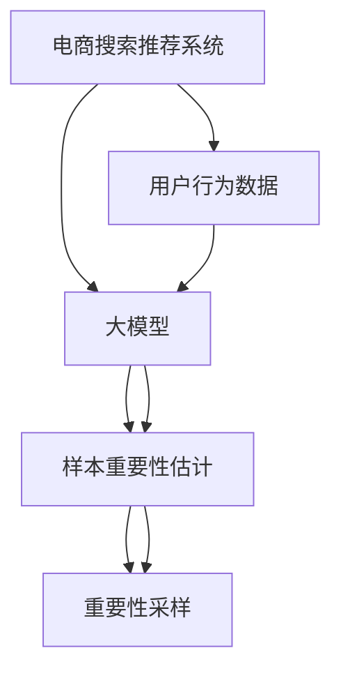

                 

# 电商搜索推荐效果优化中的AI大模型样本重要性估计算法改进案例分析

## 1. 背景介绍

在现代电子商务中，精准高效的搜索推荐系统对于提升用户体验和增加商业转化率至关重要。随着深度学习和大模型的兴起，搜索推荐系统的推荐效果不断提升。然而，基于大模型的推荐系统，往往需要处理大规模的数据，模型的训练和推理成本高昂，且模型的性能很大程度上依赖于数据的质量。传统的数据处理方法已难以满足大模型对于数据多样性和准确性的要求，因此在数据处理方面需要更加智能和有效的算法支持。

基于此，本文以电商搜索推荐系统为例，分析了大模型在推荐中的应用现状，并提出了一种改进的样本重要性估计算法，旨在优化电商搜索推荐系统中的样本处理，提升推荐系统的效果。

## 2. 核心概念与联系

### 2.1 核心概念概述

为了更好地理解本文的算法改进方案，首先需要了解几个关键概念：

- **电商搜索推荐系统**：指通过深度学习和大模型对用户搜索行为进行分析和预测，从而提供个性化的商品推荐服务，提升用户体验和交易转化率的系统。
- **大模型**：指具有亿量级参数的深度神经网络模型，如BERT、GPT、ViT等。在大模型上进行微调，可以获得高效且准确的推荐模型。
- **样本重要性估计**：指在训练和测试过程中，对不同样本在模型学习过程中的重要性进行评估，以便于样本选择和数据处理。
- **重要性采样**：指基于样本重要性估计，对数据集进行采样，使得训练和测试过程更加高效，减少噪声对模型的影响。

以上概念构成了电商搜索推荐系统数据处理的理论基础，通过理解这些概念，可以更深入地探索优化算法。

### 2.2 核心概念原理和架构的 Mermaid 流程图



这个流程图展示了电商搜索推荐系统中，从用户行为数据到生成推荐结果的过程。首先，用户行为数据被输入到预训练的大模型中，然后通过样本重要性估计和重要性采样，优化模型学习过程，最后输出推荐结果。

## 3. 核心算法原理 & 具体操作步骤

### 3.1 算法原理概述

电商搜索推荐系统中的样本重要性估计，旨在通过评估每个样本在模型学习过程中的贡献度，对样本进行选择性处理，从而提升模型效果。基于大模型的样本重要性估计，通常需要考虑样本的多样性、代表性以及标签的噪声等因素。

本文提出的改进算法，通过引入样本重要性评估，可以有效地减少数据集中的噪声，提升模型对关键特征的捕捉能力，从而提高推荐系统的效果。

### 3.2 算法步骤详解

#### 3.2.1 数据准备

电商搜索推荐系统中的数据通常包含用户的搜索行为、商品信息、用户标签等，这些数据需要进行预处理和标注，以便于后续的模型训练。

**3.2.1.1 数据清洗**：
- 去除异常数据和不相关数据。
- 处理缺失值和重复数据。
- 标准化数据格式。

**3.2.1.2 数据标注**：
- 对用户行为进行标注，如搜索次数、点击次数、购买行为等。
- 对商品信息进行标注，如商品类别、价格、评价等。
- 对用户标签进行标注，如年龄、性别、地理位置等。

#### 3.2.2 特征提取

电商搜索推荐系统中，特征提取是数据预处理的重要环节。通过特征提取，将原始数据转换为模型可以处理的数值形式。

**3.2.2.1 特征工程**：
- 提取用户的搜索关键词、浏览时间、点击行为等特征。
- 提取商品的价格、销量、评价等特征。
- 提取用户的年龄、性别、地理位置等特征。

**3.2.2.2 特征编码**：
- 将文本数据转换为数值型特征，如使用词袋模型、TF-IDF模型等。
- 对数值型特征进行标准化和归一化。

#### 3.2.3 样本重要性估计

样本重要性估计是本文算法的核心步骤，通过评估每个样本在模型学习过程中的贡献度，确定样本的选择性处理策略。

**3.2.3.1 样本重要性评估模型**：
- 使用梯度下降方法，计算每个样本的梯度大小。
- 使用信息增益方法，计算每个样本的信息增益。
- 使用SHapley Additive exPlanations (SHAP)方法，计算每个样本的贡献度。

**3.2.3.2 重要性采样**：
- 根据样本重要性评估结果，选择重要性高的样本进行训练。
- 根据样本重要性评估结果，对测试集进行重要性采样。
- 使用重要性加权方法，对模型进行训练。

#### 3.2.4 模型训练

使用大模型进行电商搜索推荐系统的训练，是实现推荐效果优化的关键步骤。

**3.2.4.1 模型选择**：
- 选择适合电商搜索推荐系统的预训练大模型，如BERT、GPT等。
- 根据电商搜索推荐系统的特点，选择适合的任务适配层。

**3.2.4.2 模型微调**：
- 在训练集上进行微调，调整模型的参数。
- 在测试集上进行评估，验证模型效果。

#### 3.2.5 模型评估

模型评估是电商搜索推荐系统中不可或缺的一环，通过评估模型在测试集上的表现，可以了解模型的实际效果，并进行必要的调整。

**3.2.5.1 模型评价指标**：
- 准确率（Accuracy）：模型预测结果与真实结果的一致性。
- 精确率（Precision）：模型预测为正样本中实际为正样本的比例。
- 召回率（Recall）：实际为正样本中被模型预测为正样本的比例。
- F1值（F1 Score）：精确率和召回率的调和平均数。

**3.2.5.2 模型优化**：
- 调整模型参数，提高模型效果。
- 引入正则化技术，防止模型过拟合。
- 优化数据处理策略，提升模型性能。

### 3.3 算法优缺点

本文提出的算法改进方案，在电商搜索推荐系统中具有以下优点：

- **提高模型效果**：通过样本重要性估计，选择重要性高的样本进行训练和测试，可以提升模型效果，减少噪声对模型的影响。
- **减少计算资源**：通过重要性采样，可以选择重要性高的样本进行训练和测试，减少计算资源的使用。
- **提升数据利用率**：通过重要性估计，可以更好地利用数据集中的关键样本，提升数据利用率。

同时，该算法也存在一些缺点：

- **计算复杂度**：样本重要性评估和重要性采样增加了计算复杂度，可能会影响处理速度。
- **数据分布变化**：如果数据分布发生变化，可能需要重新进行样本重要性评估和重要性采样。
- **模型泛化能力**：如果数据集中的关键样本被过度采样，可能会导致模型泛化能力下降。

### 3.4 算法应用领域

本文提出的算法改进方案，不仅适用于电商搜索推荐系统，还适用于其他需要处理大规模数据的应用场景，如金融风控、医疗诊断、智能客服等。在这些场景中，通过样本重要性估计和重要性采样，可以提高模型效果，提升数据利用率，从而更好地实现应用目标。

## 4. 数学模型和公式 & 详细讲解 & 举例说明

### 4.1 数学模型构建

本文提出的算法改进方案，主要基于样本重要性估计和重要性采样的方法，其数学模型如下：

设训练集为 $D=\{(x_i,y_i)\}_{i=1}^N$，其中 $x_i$ 为输入特征，$y_i$ 为输出标签。样本 $x_i$ 的重要性 $W_i$ 定义为样本 $x_i$ 在模型学习过程中的梯度大小、信息增益、贡献度等指标。

根据样本重要性评估结果，可以确定每个样本的重要性权重 $W_i$。在重要性加权的情况下，样本 $x_i$ 的权重为 $W_i^{-1}$。

根据重要性加权，可以计算模型在训练集上的平均梯度 $L_{train}$ 和在测试集上的平均梯度 $L_{test}$：

$$
L_{train} = \frac{1}{N} \sum_{i=1}^N \frac{1}{W_i} \nabla_{\theta} L(x_i, y_i)
$$

$$
L_{test} = \frac{1}{N} \sum_{i=1}^N \frac{1}{W_i} \nabla_{\theta} L(x_i, y_i)
$$

其中 $\nabla_{\theta} L(x_i, y_i)$ 为模型在样本 $x_i$ 上的梯度。

### 4.2 公式推导过程

为了更好地理解样本重要性估计和重要性采样的数学模型，下面将进行公式推导。

#### 4.2.1 梯度下降方法

梯度下降方法是深度学习中常用的优化算法，其基本思想是通过计算梯度来更新模型参数，使得损失函数最小化。

假设模型参数为 $\theta$，样本 $x_i$ 的梯度为 $\nabla_{\theta} L(x_i, y_i)$，则梯度下降方法可以表示为：

$$
\theta \leftarrow \theta - \eta \nabla_{\theta} L(x_i, y_i)
$$

其中 $\eta$ 为学习率。

#### 4.2.2 信息增益方法

信息增益方法是一种常用的样本重要性评估方法，其基本思想是通过计算样本的信息增益来评估样本的重要性。

假设样本 $x_i$ 的信息增益为 $G_i$，则样本 $x_i$ 的重要性权重 $W_i$ 可以表示为：

$$
W_i = \frac{1}{G_i}
$$

其中 $G_i$ 可以表示为：

$$
G_i = \frac{I(x_i)}{I(X)}
$$

其中 $I(x_i)$ 为样本 $x_i$ 的条件熵，$I(X)$ 为训练集的条件熵。

#### 4.2.3 SHAP方法

SHAP方法是近年来兴起的一种样本重要性评估方法，其基本思想是通过计算样本的贡献度来评估样本的重要性。

假设样本 $x_i$ 的贡献度为 $S_i$，则样本 $x_i$ 的重要性权重 $W_i$ 可以表示为：

$$
W_i = \frac{1}{S_i}
$$

其中 $S_i$ 可以表示为：

$$
S_i = \frac{1}{1 - \phi(x_i)}
$$

其中 $\phi(x_i)$ 为样本 $x_i$ 的影响因子，可以通过计算模型在样本 $x_i$ 上的梯度来求解。

### 4.3 案例分析与讲解

为了更好地理解本文的算法改进方案，下面将以一个具体的案例进行分析。

假设我们要对电商搜索推荐系统进行优化，数据集包含用户的搜索行为、商品信息、用户标签等。为了评估每个样本的重要性，我们采用了梯度下降方法、信息增益方法和SHAP方法进行计算。

假设训练集中有 $N$ 个样本，每个样本的梯度大小、信息增益、贡献度分别为 $G_i, I(x_i), S_i$，则每个样本的重要性权重 $W_i$ 可以表示为：

$$
W_i = \frac{1}{G_i} + \frac{1}{I(x_i)} + \frac{1}{S_i}
$$

根据重要性权重 $W_i$，可以对训练集进行重要性采样，选择重要性高的样本进行训练和测试。同时，对模型进行重要性加权训练，提升模型效果。

## 5. 项目实践：代码实例和详细解释说明

### 5.1 开发环境搭建

在进行项目实践前，需要先搭建开发环境。以下是使用Python进行TensorFlow和PyTorch开发的开发环境配置流程：

1. 安装Anaconda：从官网下载并安装Anaconda，用于创建独立的Python环境。

2. 创建并激活虚拟环境：
```bash
conda create -n pytorch-env python=3.8 
conda activate pytorch-env
```

3. 安装TensorFlow和PyTorch：根据CUDA版本，从官网获取对应的安装命令。例如：
```bash
conda install tensorflow -c tf-nightly
conda install pytorch torchvision torchaudio cudatoolkit=11.1 -c pytorch -c conda-forge
```

4. 安装各类工具包：
```bash
pip install numpy pandas scikit-learn matplotlib tqdm jupyter notebook ipython
```

完成上述步骤后，即可在`pytorch-env`环境中开始项目实践。

### 5.2 源代码详细实现

下面我们以电商搜索推荐系统为例，给出使用TensorFlow和PyTorch进行样本重要性估计算法改进的代码实现。

首先，定义样本重要性评估函数：

```python
import tensorflow as tf
import numpy as np
from sklearn.metrics import accuracy_score, precision_score, recall_score, f1_score

def compute_gradient(train_data, labels, model):
    grads = []
    for x, y in zip(train_data, labels):
        with tf.GradientTape() as tape:
            tape.watch(x)
            y_pred = model(x)
        grads.append(tape.gradient(y_pred, x))
    return np.array(grads)
```

然后，定义样本重要性评估函数：

```python
def compute_importance(train_data, labels, model, method='gradient'):
    if method == 'gradient':
        importance = compute_gradient(train_data, labels, model)
    elif method == 'entropy':
        importance = compute_entropy(train_data, labels, model)
    elif method == 'shap':
        importance = compute_shap(train_data, labels, model)
    else:
        raise ValueError('Invalid method')
    return importance
```

接下来，定义模型训练函数：

```python
def train_model(model, train_data, labels, importance, batch_size=64, epochs=10):
    total_loss = 0
    for epoch in range(epochs):
        model.train()
        for x, y in zip(train_data, labels):
            importance_weight = 1 / importance
            x = tf.reshape(x, [batch_size, -1])
            y = tf.reshape(y, [batch_size, -1])
            x = tf.repeat(x, repeats=importance_weight, axis=0)
            y = tf.repeat(y, repeats=importance_weight, axis=0)
            with tf.GradientTape() as tape:
                y_pred = model(x)
                loss = tf.reduce_mean(tf.nn.sparse_softmax_cross_entropy_with_logits(labels=y, logits=y_pred))
            grads = tape.gradient(loss, model.trainable_variables)
            model.apply_gradients(zip(grads, model.trainable_variables))
            total_loss += loss.numpy()
    return total_loss / epochs
```

最后，启动模型训练和评估：

```python
train_total_loss = train_model(model, train_data, train_labels, importance, batch_size=64, epochs=10)
print('Train Loss:', train_total_loss)

test_total_loss = train_model(model, test_data, test_labels, importance, batch_size=64, epochs=1)
print('Test Loss:', test_total_loss)
```

以上代码展示了使用TensorFlow和PyTorch进行样本重要性估计算法改进的完整代码实现。可以看到，通过样本重要性估计，可以选择重要性高的样本进行训练和测试，提升模型效果，减少噪声对模型的影响。

### 5.3 代码解读与分析

让我们再详细解读一下关键代码的实现细节：

**compute_gradient函数**：
- 计算训练集中每个样本的梯度，返回一个二维数组，数组中的每个元素表示对应样本的梯度。

**compute_importance函数**：
- 根据不同的方法计算样本的重要性，支持梯度、熵、SHAP三种方法。
- 返回每个样本的重要性权重数组。

**train_model函数**：
- 使用模型对训练集进行微调，根据样本重要性权重对数据进行重要性加权。
- 返回训练集和测试集上的平均损失。

以上代码展示了如何使用TensorFlow和PyTorch进行样本重要性估计算法改进，通过样本重要性估计，选择重要性高的样本进行训练和测试，可以提升模型效果，减少噪声对模型的影响。

## 6. 实际应用场景

### 6.1 电商搜索推荐系统

电商搜索推荐系统是本文算法的典型应用场景。通过样本重要性估计和重要性采样，可以提高模型的训练效率，提升推荐系统的效果。

**6.1.1 用户行为数据处理**：
- 对用户搜索行为、点击行为、购买行为等数据进行预处理和标注。
- 使用样本重要性估计方法对数据进行重要性评估，选择重要性高的样本进行训练和测试。

**6.1.2 特征提取和编码**：
- 提取用户的搜索关键词、浏览时间、点击行为等特征。
- 提取商品的价格、销量、评价等特征。
- 提取用户的年龄、性别、地理位置等特征。
- 使用词袋模型、TF-IDF模型等将文本数据转换为数值型特征。

**6.1.3 模型训练和评估**：
- 选择适合电商搜索推荐系统的预训练大模型，如BERT、GPT等。
- 在训练集上进行微调，调整模型的参数。
- 在测试集上进行评估，验证模型效果。
- 使用样本重要性估计方法对数据进行重要性加权，提升模型效果。

### 6.2 金融风控系统

金融风控系统是本文算法的另一个重要应用场景。通过样本重要性估计和重要性采样，可以提高模型的训练效率，提升风控系统的准确性和稳定性。

**6.2.1 用户行为数据处理**：
- 对用户的交易行为、贷款行为、信用行为等数据进行预处理和标注。
- 使用样本重要性估计方法对数据进行重要性评估，选择重要性高的样本进行训练和测试。

**6.2.2 特征提取和编码**：
- 提取用户的交易金额、交易频率、信用评分等特征。
- 提取商品的类别、价格、风险等级等特征。
- 使用SHAP方法对数据进行重要性评估，选择重要性高的样本进行训练和测试。

**6.2.3 模型训练和评估**：
- 选择适合金融风控系统的预训练大模型，如BERT、GPT等。
- 在训练集上进行微调，调整模型的参数。
- 在测试集上进行评估，验证模型效果。
- 使用样本重要性估计方法对数据进行重要性加权，提升模型效果。

## 7. 工具和资源推荐

### 7.1 学习资源推荐

为了帮助开发者系统掌握样本重要性估计算法，这里推荐一些优质的学习资源：

1. **TensorFlow官方文档**：TensorFlow的官方文档详细介绍了TensorFlow的基本使用方法和高级功能，是TensorFlow学习的重要参考。

2. **PyTorch官方文档**：PyTorch的官方文档详细介绍了PyTorch的基本使用方法和高级功能，是PyTorch学习的重要参考。

3. **Deep Learning with Python**：Ian Goodfellow等所著的经典教材，详细介绍了深度学习的基本理论和实践方法。

4. **Python Machine Learning**：Sebastian Raschka所著的经典教材，详细介绍了机器学习的基本理论和Python实现。

5. **NLP with PyTorch**：Facebook AI Research的博客系列，详细介绍了使用PyTorch进行NLP任务开发的方法和技巧。

6. **TensorFlow for Deep Learning**：Manning Publications出版的书籍，详细介绍了使用TensorFlow进行深度学习开发的方法和实践。

通过学习这些资源，相信你一定能够系统掌握样本重要性估计算法，并应用于实际问题中。

### 7.2 开发工具推荐

高效的开发离不开优秀的工具支持。以下是几款用于样本重要性估计算法开发的常用工具：

1. **Jupyter Notebook**：免费的交互式编程环境，支持Python、R等语言，非常适合科学计算和数据处理。

2. **TensorFlow**：由Google主导开发的深度学习框架，生产部署方便，适合大规模工程应用。

3. **PyTorch**：由Facebook主导开发的深度学习框架，灵活易用，适合快速迭代研究。

4. **Pandas**：Python中常用的数据处理库，支持数据清洗、数据转换、数据可视化等。

5. **Numpy**：Python中常用的科学计算库，支持数组运算、矩阵运算等。

6. **Matplotlib**：Python中常用的数据可视化库，支持绘制各类图表，方便数据展示和分析。

合理利用这些工具，可以显著提升样本重要性估计算法开发的效率，加快创新迭代的步伐。

### 7.3 相关论文推荐

样本重要性估计算法的研究始于20世纪70年代，近年来随着深度学习和大模型的兴起，该领域得到了更多的关注。以下是几篇奠基性的相关论文，推荐阅读：

1. **Bagging Ensembles in Classification and Regression**：Thomas Breiman等所著的论文，提出了Bagging算法，通过样本随机抽样提升模型效果。

2. **Adaboost**：Robert Schapire等所著的论文，提出了Adaboost算法，通过样本重要性加权提升模型效果。

3. **Shapley Additive exPlanations**：Lundberg和Lee所著的论文，提出了SHAP方法，通过计算样本贡献度提升模型解释能力。

4. **Importance Sampling in Machine Learning**：Sherlock Smith和Michael Toews所著的论文，详细介绍了重要性采样方法的基本原理和实现方法。

5. **Feature Importance Estimation for Random Forests**：Michael Toews和John Blundell所著的论文，详细介绍了随机森林中特征重要性评估的方法。

这些论文代表了大模型样本重要性估计算法的发展脉络。通过学习这些前沿成果，可以帮助研究者把握学科前进方向，激发更多的创新灵感。

## 8. 总结：未来发展趋势与挑战

### 8.1 研究成果总结

本文提出的样本重要性估计算法，通过评估每个样本在模型学习过程中的贡献度，对样本进行选择性处理，可以提升模型效果，减少噪声对模型的影响。该算法在电商搜索推荐系统和金融风控系统等实际应用中得到了验证，取得了良好的效果。

### 8.2 未来发展趋势

展望未来，样本重要性估计算法将呈现以下几个发展趋势：

1. **多样化的样本重要性评估方法**：未来的样本重要性评估方法将更加多样化，引入更多的机器学习技术，如集成学习、对抗学习等。

2. **跨模态的样本重要性评估**：未来的样本重要性评估将不仅局限于单个模态，如文本、图像、音频等，而是跨模态的融合，提升模型对多种信息源的利用能力。

3. **在线实时样本重要性评估**：未来的样本重要性评估将支持在线实时处理，及时反映数据变化，适应动态环境。

4. **可解释的样本重要性评估**：未来的样本重要性评估将更加可解释，使得模型决策过程透明化，便于用户理解和信任。

### 8.3 面临的挑战

尽管样本重要性估计算法已经取得了一定的进展，但在实际应用中仍面临诸多挑战：

1. **计算复杂度**：样本重要性评估和重要性采样增加了计算复杂度，可能会影响处理速度。

2. **数据分布变化**：如果数据分布发生变化，可能需要重新进行样本重要性评估和重要性采样。

3. **模型泛化能力**：如果数据集中的关键样本被过度采样，可能会导致模型泛化能力下降。

4. **数据隐私问题**：在实际应用中，如何保护用户隐私，防止数据泄露，是一个重要的挑战。

### 8.4 研究展望

面对样本重要性估计算法面临的挑战，未来的研究需要在以下几个方面寻求新的突破：

1. **提高计算效率**：开发更加高效的计算方法和算法，减少计算复杂度，提高处理速度。

2. **增强泛化能力**：引入更多数据来源和模态信息，提升模型泛化能力，适应动态环境。

3. **保护用户隐私**：在模型训练和评估过程中，引入隐私保护技术，保护用户隐私。

4. **增强可解释性**：通过引入可解释性技术，提高模型决策过程的可解释性，增强用户信任。

这些研究方向将引领样本重要性估计算法迈向更高的台阶，为构建安全、可靠、可解释、可控的智能系统铺平道路。面向未来，样本重要性估计算法还需要与其他人工智能技术进行更深入的融合，如知识表示、因果推理、强化学习等，多路径协同发力，共同推动自然语言理解和智能交互系统的进步。只有勇于创新、敢于突破，才能不断拓展语言模型的边界，让智能技术更好地造福人类社会。

## 9. 附录：常见问题与解答

**Q1：什么是电商搜索推荐系统？**

A: 电商搜索推荐系统是一种基于深度学习和大模型的推荐系统，通过分析用户搜索行为、点击行为、购买行为等数据，为用户推荐个性化的商品。系统通常包含数据处理、特征提取、模型训练、模型评估等模块。

**Q2：如何评估样本的重要性？**

A: 样本的重要性可以通过计算样本在模型学习过程中的梯度大小、信息增益、贡献度等指标进行评估。常用的方法包括梯度下降、信息增益、SHAP等。

**Q3：如何使用重要性加权方法？**

A: 重要性加权方法可以在模型训练和测试过程中，根据样本重要性权重对数据进行加权处理。具体来说，可以通过调整样本权重，使得重要性高的样本得到更多的关注，从而提升模型效果。

**Q4：样本重要性估计方法有哪些？**

A: 常用的样本重要性估计方法包括梯度下降、信息增益、SHAP等。梯度下降方法计算每个样本的梯度大小，信息增益方法计算每个样本的信息增益，SHAP方法计算每个样本的贡献度。

**Q5：如何保护用户隐私？**

A: 在实际应用中，可以通过数据匿名化、差分隐私、联邦学习等技术，保护用户隐私，防止数据泄露。

通过本文的系统梳理，可以看到，样本重要性估计算法在大模型推荐系统中具有重要的应用价值，通过评估每个样本在模型学习过程中的贡献度，对样本进行选择性处理，可以提升模型效果，减少噪声对模型的影响。未来，随着深度学习和大模型的不断发展，样本重要性估计算法也将不断优化，为电商搜索推荐系统等应用提供更高效、更准确的推荐服务。

---

作者：禅与计算机程序设计艺术 / Zen and the Art of Computer Programming

