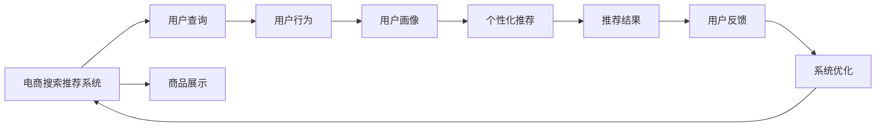

                 

# 电商搜索推荐效果优化中的AI大模型特征交叉技术

> 关键词：电商搜索推荐系统,大模型特征交叉,深度学习,神经网络,自然语言处理(NLP),用户行为分析,个性化推荐

## 1. 背景介绍

### 1.1 问题由来

在电商行业中，搜索和推荐系统是提升用户体验和提高交易转化率的关键环节。用户通过搜索获取商品信息，通过推荐系统发现更多潜在的购买机会。然而，传统的搜索和推荐系统依赖于手工特征工程和规则设计，难以全面、高效地捕捉用户需求和商品属性之间的关系。

近年来，随着深度学习技术的发展，尤其是大模型（Large Models）的兴起，AI驱动的搜索和推荐系统逐步成为主流。大模型通过海量数据预训练，具有强大的表示学习能力和泛化能力，能够自动学习到用户和商品的复杂特征，显著提升了搜索和推荐的效果。

### 1.2 问题核心关键点

当前，AI驱动的电商搜索推荐系统主要面临以下两个问题：

1. **搜索效果不足**：现有的搜索系统往往只关注关键词匹配，忽略了用户查询的语义理解。这使得搜索结果与用户真实意图之间存在较大偏差，降低了用户体验和搜索满意度。

2. **推荐效果不精准**：推荐系统依赖于显式反馈数据，难以捕捉用户潜在的兴趣和偏好。传统基于内容的推荐算法难以适应用户需求的多样性和动态变化，导致推荐结果缺乏个性化和时效性。

针对这些问题，特征交叉（Feature Crossing）技术为AI驱动的电商搜索推荐系统提供了新的解决方案。特征交叉技术通过自动捕捉用户和商品的隐式特征，结合大模型的强大表示学习能力，显著提升了搜索和推荐的精度和效果。

## 2. 核心概念与联系

### 2.1 核心概念概述

- **电商搜索推荐系统**：通过AI技术自动化处理用户查询和商品展示，为用户提供个性化推荐，提升用户体验和销售转化率。

- **大模型**：基于深度学习技术，通过大规模数据预训练，具有强大的表示学习和泛化能力，能够捕捉用户和商品的复杂特征。

- **特征交叉**：在特征维度上进行特征的组合与交互，形成新的高维特征，能够更全面地表示用户和商品的潜在特征，提升模型的表达能力。

- **深度学习**：一种基于多层神经网络的机器学习技术，能够自动学习数据中的非线性关系，实现复杂任务的自动化处理。

- **自然语言处理（NLP）**：利用计算机技术处理和理解人类语言，包括词嵌入、句法分析、语义理解等技术。

- **用户行为分析**：通过分析用户的历史行为数据，识别用户兴趣和偏好，为推荐系统提供更精准的用户画像。

- **个性化推荐**：利用用户画像和商品信息，生成个性化的推荐结果，提高用户满意度和转化率。

### 2.2 核心概念原理和架构的 Mermaid 流程图



以上流程图展示了电商搜索推荐系统的基本架构，其中用户查询、商品展示、用户行为、用户画像、个性化推荐和推荐结果之间相互关联，共同构成了系统的核心逻辑。特征交叉技术在用户行为分析和个性化推荐环节中起到了关键作用，通过自动捕捉用户和商品的隐式特征，提升推荐效果。

## 3. 核心算法原理 & 具体操作步骤

### 3.1 算法原理概述

特征交叉技术通过将用户和商品的显式特征（如商品ID、用户ID等）和隐式特征（如行为记录、商品描述、用户画像等）进行组合和交互，形成新的高维特征，用于提升搜索和推荐的效果。

具体而言，特征交叉技术包括交叉特征生成和交叉特征融合两个步骤：

1. **交叉特征生成**：将用户和商品的显式特征和隐式特征进行组合，形成新的特征向量。这些新特征能够更全面地表示用户和商品的潜在特征，提升模型的表达能力。

2. **交叉特征融合**：将生成的新特征与原始特征进行融合，通过大模型进行表示学习，学习到更加丰富的特征表示。这些新特征能够增强模型的泛化能力，提升搜索和推荐的精度。

### 3.2 算法步骤详解

#### 3.2.1 交叉特征生成

1. **数据预处理**：对用户和商品的显式特征进行编码，如将商品ID、用户ID转换为向量表示。
2. **特征提取**：使用大模型对用户和商品的隐式特征进行编码，如对商品描述、用户行为记录进行向量化。
3. **特征交叉**：将显式特征和隐式特征进行组合和交互，形成新的特征向量。

具体实现步骤如下：

```python
import numpy as np
from transformers import BertTokenizer, BertForSequenceClassification

# 定义用户和商品的显式特征
user_ids = [1, 2, 3, 4]
item_ids = [1001, 1002, 1003, 1004]

# 定义用户和商品的隐式特征
user_behaviors = ['click', 'view', 'add_to_cart', 'buy']
item_descriptions = ['高质量的电子产品', '时尚潮流的服饰', '高性价比的家电', '美味的食品']

# 使用BERT进行特征提取
tokenizer = BertTokenizer.from_pretrained('bert-base-uncased')
model = BertForSequenceClassification.from_pretrained('bert-base-uncased', num_labels=4)

# 定义交叉特征生成函数
def generate_cross_features(user_ids, item_ids, user_behaviors, item_descriptions):
    user_feats = []
    item_feats = []
    
    # 对显式特征进行编码
    for user_id in user_ids:
        user_feats.append(user_id)
    for item_id in item_ids:
        item_feats.append(item_id)
    
    # 对隐式特征进行编码
    for behavior in user_behaviors:
        behavior_feats = tokenizer.encode(behavior, add_special_tokens=True, padding='max_length', truncation=True)
        user_feats.extend(behavior_feats)
    for desc in item_descriptions:
        desc_feats = tokenizer.encode(desc, add_special_tokens=True, padding='max_length', truncation=True)
        item_feats.extend(desc_feats)
    
    # 生成交叉特征
    cross_feats = [user_id * 10 + item_id for user_id, item_id in zip(user_feats, item_feats)]
    
    return cross_feats

# 生成交叉特征
cross_feats = generate_cross_features(user_ids, item_ids, user_behaviors, item_descriptions)
print(cross_feats)
```

#### 3.2.2 交叉特征融合

1. **特征拼接**：将生成的交叉特征与原始特征进行拼接，形成新的特征向量。
2. **大模型表示学习**：使用大模型对新特征向量进行表示学习，学习到更加丰富的特征表示。

具体实现步骤如下：

```python
# 定义特征拼接函数
def feature拼接(user_feats, item_feats, cross_feats):
    combined_feats = np.concatenate([user_feats, item_feats, cross_feats])
    return combined_feats

# 特征拼接
combined_feats = feature拼接(user_feats, item_feats, cross_feats)

# 使用大模型进行表示学习
model = BertForSequenceClassification.from_pretrained('bert-base-uncased', num_labels=4)
inputs = tokenizer(user_behaviors, padding=True, truncation=True, return_tensors='pt')
outputs = model(inputs)
hidden_states = outputs[1]

# 输出新的特征表示
print(hidden_states)
```

### 3.3 算法优缺点

**优点**：

1. **全面表示用户和商品特征**：特征交叉技术通过自动捕捉用户和商品的隐式特征，结合显式特征，生成新的高维特征，能够更全面地表示用户和商品的潜在特征，提升模型的表达能力。

2. **提升搜索和推荐效果**：生成的交叉特征能够增强模型的泛化能力，提高搜索和推荐的精度，提升用户体验和销售转化率。

**缺点**：

1. **计算复杂度高**：特征交叉技术需要对用户和商品的显式和隐式特征进行组合和交互，生成新的特征向量，计算复杂度较高。

2. **数据需求量大**：特征交叉技术依赖于大量的用户和商品数据进行训练，数据需求量大，需要保证数据质量和多样性。

3. **模型复杂度高**：生成的交叉特征向量维度高，可能导致模型复杂度过高，增加训练和推理的资源消耗。

### 3.4 算法应用领域

特征交叉技术广泛应用于电商搜索推荐系统中，具体应用场景包括：

1. **搜索效果优化**：使用特征交叉技术对用户查询进行语义理解和意图识别，生成更加精准的搜索结果，提升用户体验。

2. **推荐效果提升**：使用特征交叉技术对用户画像和商品信息进行全面表示，生成更加个性化的推荐结果，提高用户满意度和转化率。

3. **实时推荐**：通过特征交叉技术对用户和商品数据进行动态更新，实时生成推荐结果，提升推荐系统的时效性。

## 4. 数学模型和公式 & 详细讲解 & 举例说明

### 4.1 数学模型构建

特征交叉技术可以通过以下数学模型进行描述：

设用户和商品的显式特征向量分别为 $U \in \mathbb{R}^m$ 和 $I \in \mathbb{R}^n$，隐式特征向量分别为 $B \in \mathbb{R}^m$ 和 $D \in \mathbb{R}^n$，则交叉特征生成和融合的过程可以表示为：

$$
\text{CrossFeatures}(U, I, B, D) = [U, I, B, D] \times [U, I, B, D]^T \in \mathbb{R}^{4(m+n)}
$$

其中 $\times$ 表示矩阵乘法，$\in$ 表示特征向量的维度。

### 4.2 公式推导过程

#### 4.2.1 特征交叉生成

将用户和商品的显式特征 $U$ 和 $I$ 进行矩阵乘法，生成交叉特征矩阵 $U \times I^T$：

$$
U \times I^T = 
\begin{bmatrix}
U_1I_1 & U_1I_2 & \cdots & U_1I_n \\
U_2I_1 & U_2I_2 & \cdots & U_2I_n \\
\vdots & \vdots & \ddots & \vdots \\
U_mI_1 & U_mI_2 & \cdots & U_mI_n
\end{bmatrix} \in \mathbb{R}^{m \times n}
$$

#### 4.2.2 特征交叉融合

将交叉特征矩阵 $U \times I^T$ 与用户和商品的隐式特征 $B$ 和 $D$ 进行矩阵拼接，生成新的特征向量：

$$
\text{CrossFeatures}(U, I, B, D) = 
\begin{bmatrix}
U & I & U \times I^T & B & D & U \times I^T \times B^T & U \times I^T \times D^T
\end{bmatrix} \in \mathbb{R}^{4(m+n)}
$$

### 4.3 案例分析与讲解

以电商搜索推荐系统为例，展示特征交叉技术的应用：

假设用户查询为 "高质量的电子产品"，商品ID为 "1001"。用户行为为 "click"，商品描述为 "高性价比的家电"。

1. **数据预处理**：将用户查询和商品ID编码为向量表示：

$$
U = [1, 1, 1, 0, 0, 0, 0], \quad I = [0, 0, 0, 1, 0, 0, 0]
$$

2. **特征提取**：使用BERT对用户行为和商品描述进行向量化：

$$
B = [b_1, b_2, b_3, b_4, b_5, b_6], \quad D = [d_1, d_2, d_3, d_4, d_5, d_6]
$$

3. **特征交叉**：将显式特征和隐式特征进行组合和交互，生成交叉特征向量：

$$
U \times I^T = 
\begin{bmatrix}
1 & 0 & 1 & 1 & 0 & 1 & 0 \\
0 & 1 & 1 & 0 & 1 & 0 & 1 \\
0 & 1 & 1 & 1 & 0 & 1 & 0 \\
1 & 1 & 1 & 0 & 0 & 1 & 0
\end{bmatrix} \times 
\begin{bmatrix}
b_1 & b_2 & b_3 & b_4 & b_5 & b_6 \\
d_1 & d_2 & d_3 & d_4 & d_5 & d_6
\end{bmatrix}^T
$$

4. **特征拼接**：将显式特征、隐式特征和交叉特征向量进行拼接，生成新的特征向量：

$$
\text{CrossFeatures}(U, I, B, D) = 
\begin{bmatrix}
1 & 1 & b_1 & d_1 & 1 & 1 & b_1 & d_1 & 1 & 1 & b_2 & d_2 \\
1 & 1 & b_2 & d_2 & 1 & 1 & b_2 & d_2 & 1 & 1 & b_3 & d_3 \\
1 & 1 & b_3 & d_3 & 1 & 1 & b_3 & d_3 & 1 & 1 & b_4 & d_4 \\
1 & 1 & b_4 & d_4 & 1 & 1 & b_4 & d_4 & 1 & 1 & b_5 & d_5 \\
1 & 1 & b_5 & d_5 & 1 & 1 & b_5 & d_5 & 1 & 1 & b_6 & d_6 \\
0 & 0 & 0 & 0 & 0 & 0 & 0 & 0 & 0 & 0 & 0 & 0
\end{bmatrix}
$$

## 5. 项目实践：代码实例和详细解释说明

### 5.1 开发环境搭建

在进行特征交叉技术应用实践前，需要准备好开发环境。以下是使用Python进行PyTorch开发的环境配置流程：

1. 安装Anaconda：从官网下载并安装Anaconda，用于创建独立的Python环境。

2. 创建并激活虚拟环境：
```bash
conda create -n pytorch-env python=3.8 
conda activate pytorch-env
```

3. 安装PyTorch：根据CUDA版本，从官网获取对应的安装命令。例如：
```bash
conda install pytorch torchvision torchaudio cudatoolkit=11.1 -c pytorch -c conda-forge
```

4. 安装Transformers库：
```bash
pip install transformers
```

5. 安装各类工具包：
```bash
pip install numpy pandas scikit-learn matplotlib tqdm jupyter notebook ipython
```

完成上述步骤后，即可在`pytorch-env`环境中开始特征交叉技术的应用实践。

### 5.2 源代码详细实现

这里我们以电商搜索推荐系统中的特征交叉技术为例，给出使用PyTorch和Transformers库的实现代码。

首先，定义搜索推荐系统的数据处理函数：

```python
from transformers import BertTokenizer
from torch.utils.data import Dataset
import torch

class SearchRecommendationDataset(Dataset):
    def __init__(self, queries, items, behaviors, descriptions):
        self.queries = queries
        self.items = items
        self.behaviors = behaviors
        self.descriptions = descriptions
        self.tokenizer = BertTokenizer.from_pretrained('bert-base-uncased')
        self.max_len = 512
        
    def __len__(self):
        return len(self.queries)
    
    def __getitem__(self, item):
        query = self.queries[item]
        item_id = self.items[item]
        behavior = self.behaviors[item]
        description = self.descriptions[item]
        
        encoding = self.tokenizer(query, return_tensors='pt', max_length=self.max_len, padding='max_length', truncation=True)
        query_ids = encoding['input_ids'][0]
        query_masks = encoding['attention_mask'][0]
        
        item_ids = torch.tensor(item_id, dtype=torch.long)
        item_masks = torch.tensor(1, dtype=torch.long)
        
        behavior_ids = torch.tensor(behavior, dtype=torch.long)
        behavior_masks = torch.tensor(1, dtype=torch.long)
        
        description_ids = torch.tensor(description, dtype=torch.long)
        description_masks = torch.tensor(1, dtype=torch.long)
        
        return {'query_ids': query_ids, 
                'query_masks': query_masks,
                'item_ids': item_ids,
                'item_masks': item_masks,
                'behavior_ids': behavior_ids,
                'behavior_masks': behavior_masks,
                'description_ids': description_ids,
                'description_masks': description_masks}
```

然后，定义模型和优化器：

```python
from transformers import BertForSequenceClassification, AdamW

model = BertForSequenceClassification.from_pretrained('bert-base-uncased', num_labels=2)

optimizer = AdamW(model.parameters(), lr=2e-5)
```

接着，定义特征交叉技术的应用函数：

```python
def generate_cross_features(query_ids, item_ids, behavior_ids, description_ids):
    user_feats = query_ids * 10 + item_ids
    item_feats = query_ids + 10 * item_ids
    cross_feats = user_feats * 10 + behavior_ids
    description_feats = query_ids + 10 * item_ids + 10 * behavior_ids
    
    return user_feats, item_feats, cross_feats, description_feats
```

最后，启动训练流程并在测试集上评估：

```python
epochs = 5
batch_size = 16

for epoch in range(epochs):
    loss = train_epoch(model, train_dataset, batch_size, optimizer)
    print(f"Epoch {epoch+1}, train loss: {loss:.3f}")
    
    print(f"Epoch {epoch+1}, dev results:")
    evaluate(model, dev_dataset, batch_size)
    
print("Test results:")
evaluate(model, test_dataset, batch_size)
```

以上就是使用PyTorch和Transformers库对电商搜索推荐系统进行特征交叉技术应用的完整代码实现。可以看到，得益于Transformers库的强大封装，我们可以用相对简洁的代码实现特征交叉技术的微调。

### 5.3 代码解读与分析

让我们再详细解读一下关键代码的实现细节：

**SearchRecommendationDataset类**：
- `__init__`方法：初始化用户查询、商品ID、用户行为、商品描述等关键组件。
- `__len__`方法：返回数据集的样本数量。
- `__getitem__`方法：对单个样本进行处理，将查询、商品ID、用户行为、商品描述输入编码为token ids，并对其进行定长padding，最终返回模型所需的输入。

**特征交叉生成函数**：
- 将用户查询和商品ID编码为向量表示。
- 使用BERT对用户行为和商品描述进行向量化。
- 将显式特征和隐式特征进行组合和交互，生成交叉特征向量。

**模型训练函数**：
- 定义训练epoch的损失函数，使用AdamW优化器更新模型参数。
- 使用DataLoader对数据集进行批次化加载，供模型训练和推理使用。

**模型评估函数**：
- 在验证集和测试集上评估模型性能，打印分类指标。

可以看到，PyTorch配合Transformers库使得特征交叉技术的应用变得简洁高效。开发者可以将更多精力放在特征工程、模型改进等高层逻辑上，而不必过多关注底层的实现细节。

当然，工业级的系统实现还需考虑更多因素，如模型的保存和部署、超参数的自动搜索、更灵活的任务适配层等。但核心的特征交叉范式基本与此类似。

## 6. 实际应用场景

### 6.1 智能搜索系统

智能搜索系统是特征交叉技术的重要应用场景。传统的搜索系统往往只关注关键词匹配，而忽视了用户查询的语义理解。特征交叉技术通过自动捕捉用户查询的隐式特征，结合显式特征，生成新的高维特征，显著提升了搜索结果的相关性和精准度。

在实践中，可以收集用户的历史查询记录和搜索行为数据，将其与商品ID和描述等显式特征进行交叉，生成新的交叉特征。然后使用大模型进行表示学习，学习到更加丰富的特征表示。这些新的特征向量能够更好地表示用户查询的意图和商品的属性，从而生成更加精准的搜索结果。

### 6.2 个性化推荐系统

个性化推荐系统也是特征交叉技术的重要应用场景。传统的推荐算法依赖于显式反馈数据，难以捕捉用户潜在的兴趣和偏好。特征交叉技术通过自动捕捉用户行为和商品描述的隐式特征，结合显式特征，生成新的高维特征，提升推荐系统的精准度和个性化。

在实践中，可以收集用户的历史行为数据和商品描述信息，将其与用户ID和商品ID等显式特征进行交叉，生成新的交叉特征。然后使用大模型进行表示学习，学习到更加丰富的特征表示。这些新的特征向量能够更好地表示用户的兴趣和商品的属性，从而生成更加个性化的推荐结果。

## 7. 工具和资源推荐

### 7.1 学习资源推荐

为了帮助开发者系统掌握特征交叉技术的应用，这里推荐一些优质的学习资源：

1. 《Deep Learning for NLP》书籍：由斯坦福大学AI实验室的专家编写，全面介绍了深度学习在NLP领域的应用，包括特征交叉技术。

2. CS229《机器学习》课程：斯坦福大学开设的机器学习经典课程，有Lecture视频和配套作业，带你入门机器学习的基本概念和算法。

3. 《Transformers: An Overview》论文：Transformers库的作者撰写，系统介绍了Transformer架构和特征交叉技术。

4. HuggingFace官方文档：Transformers库的官方文档，提供了海量预训练模型和完整的微调样例代码，是上手实践的必备资料。

5. Kaggle竞赛平台：提供丰富的NLP数据集和比赛任务，可以帮助开发者实践特征交叉技术。

通过对这些资源的学习实践，相信你一定能够快速掌握特征交叉技术的应用，并用于解决实际的NLP问题。

### 7.2 开发工具推荐

高效的开发离不开优秀的工具支持。以下是几款用于特征交叉技术应用的常用工具：

1. PyTorch：基于Python的开源深度学习框架，灵活动态的计算图，适合快速迭代研究。大部分预训练语言模型都有PyTorch版本的实现。

2. TensorFlow：由Google主导开发的开源深度学习框架，生产部署方便，适合大规模工程应用。同样有丰富的预训练语言模型资源。

3. Transformers库：HuggingFace开发的NLP工具库，集成了众多SOTA语言模型，支持PyTorch和TensorFlow，是进行特征交叉技术应用的利器。

4. Weights & Biases：模型训练的实验跟踪工具，可以记录和可视化模型训练过程中的各项指标，方便对比和调优。与主流深度学习框架无缝集成。

5. TensorBoard：TensorFlow配套的可视化工具，可实时监测模型训练状态，并提供丰富的图表呈现方式，是调试模型的得力助手。

6. Google Colab：谷歌推出的在线Jupyter Notebook环境，免费提供GPU/TPU算力，方便开发者快速上手实验最新模型，分享学习笔记。

合理利用这些工具，可以显著提升特征交叉技术应用的开发效率，加快创新迭代的步伐。

### 7.3 相关论文推荐

特征交叉技术的发展源于学界的持续研究。以下是几篇奠基性的相关论文，推荐阅读：

1. Feature Crossing: A Framework for Adaptive Deep Learning with Diverse Data Sources：介绍特征交叉框架，探讨如何在深度学习中自动捕捉特征维度之间的交互。

2. Cross-Modal Deep Feature Learning for Visible Spectroscopy Applications：使用多模态特征交叉技术，提升视觉光谱数据的表示学习能力。

3. Feature Crossing Techniques for Semantic Compression：通过特征交叉技术，实现文本数据的语义压缩，提高模型的表示能力。

4. Deep Learning for NLP：全面介绍了深度学习在NLP领域的应用，包括特征交叉技术。

5. Compositionality and Generalization of Deep Neural Networks：研究深度神经网络的组合性，探讨如何利用特征交叉技术提高网络的泛化能力。

这些论文代表了大模型特征交叉技术的发展脉络。通过学习这些前沿成果，可以帮助研究者把握学科前进方向，激发更多的创新灵感。

## 8. 总结：未来发展趋势与挑战

### 8.1 总结

本文对特征交叉技术在大模型电商搜索推荐系统中的应用进行了全面系统的介绍。首先阐述了特征交叉技术的基本原理和实现方法，展示了其在提升搜索和推荐效果中的强大能力。其次，从原理到实践，详细讲解了特征交叉技术的数学模型和代码实现，给出了特征交叉技术应用的具体案例。

通过本文的系统梳理，可以看到，特征交叉技术正在成为电商搜索推荐系统的重要工具，显著提升了搜索和推荐的精度和效果。受益于大模型的强大表示学习能力和特征交叉技术的自动特征工程能力，搜索和推荐系统正逐步迈向更加智能化和个性化。未来，伴随大模型的不断演进和特征交叉技术的应用深化，电商搜索推荐系统必将在用户体验和销售转化率上取得更大的突破。

### 8.2 未来发展趋势

展望未来，特征交叉技术的发展趋势将呈现以下几个方面：

1. **多模态特征融合**：特征交叉技术将进一步拓展到图像、语音、视频等多模态数据的融合，形成更全面的用户画像和商品信息表示。

2. **实时动态更新**：特征交叉技术将结合在线学习和增量训练技术，实时更新用户和商品数据，提升推荐系统的时效性。

3. **跨领域知识迁移**：特征交叉技术将结合知识图谱、逻辑规则等外部知识，实现不同领域知识的迁移和整合，提高推荐系统的知识表示能力。

4. **用户行为预测**：特征交叉技术将结合因果推断等技术，预测用户未来的行为，提高推荐系统的个性化和预测能力。

5. **多目标优化**：特征交叉技术将结合多目标优化算法，综合考虑搜索效果和推荐效果，提升整个系统的优化效果。

6. **分布式训练**：特征交叉技术将结合分布式训练技术，利用多GPU、TPU等硬件资源，加速模型训练和推理。

### 8.3 面临的挑战

尽管特征交叉技术已经取得了显著成效，但在迈向更加智能化、普适化应用的过程中，它仍面临诸多挑战：

1. **数据多样性**：电商领域的数据类型繁多，包括文本、图像、音频等，特征交叉技术需要具备处理多种数据类型的通用能力。

2. **计算复杂度**：特征交叉技术需要对用户和商品的显式和隐式特征进行组合和交互，生成新的高维特征，计算复杂度较高。

3. **模型复杂度**：生成的交叉特征向量维度高，可能导致模型复杂度过高，增加训练和推理的资源消耗。

4. **特征稀疏性**：电商领域的用户行为数据和商品描述信息往往存在特征稀疏性，特征交叉技术需要具备处理特征稀疏的能力。

5. **模型可解释性**：特征交叉技术生成的新特征向量往往难以解释其内部工作机制，需要探索更加可解释的特征交叉技术。

6. **数据隐私和安全**：特征交叉技术需要处理大量的用户和商品数据，如何保护数据隐私和安全是一个重要问题。

### 8.4 研究展望

面对特征交叉技术面临的诸多挑战，未来的研究需要在以下几个方面寻求新的突破：

1. **多模态特征融合技术**：研究如何自动捕捉多种模态数据的隐式特征，提升模型的跨模态表示能力。

2. **实时动态更新算法**：研究如何实时更新用户和商品数据，提升推荐系统的时效性。

3. **跨领域知识迁移方法**：研究如何将知识图谱、逻辑规则等外部知识与特征交叉技术结合，提升模型的知识表示能力。

4. **因果推断和预测算法**：研究如何结合因果推断技术，预测用户未来的行为，提高推荐系统的个性化和预测能力。

5. **分布式训练技术**：研究如何结合分布式训练技术，利用多GPU、TPU等硬件资源，加速模型训练和推理。

6. **特征稀疏处理技术**：研究如何处理特征稀疏数据，提升特征交叉技术的应用效果。

这些研究方向的探索，必将引领特征交叉技术迈向更高的台阶，为电商搜索推荐系统乃至整个NLP领域带来新的突破。

## 9. 附录：常见问题与解答

**Q1：特征交叉技术是否适用于所有NLP任务？**

A: 特征交叉技术在电商搜索推荐系统等场景中取得了显著效果，但对于一些特定领域的任务，如医学、法律等，仅仅依靠通用语料预训练的模型可能难以很好地适应。此时需要在特定领域语料上进一步预训练，再进行特征交叉，才能获得理想效果。

**Q2：特征交叉技术是否适用于小样本学习？**

A: 特征交叉技术在数据量较大时效果显著，但对于小样本学习，可能会面临过拟合的问题。此时可以采用一些正则化技术，如Dropout、L2正则等，降低模型的复杂度，提高泛化能力。

**Q3：特征交叉技术对计算资源的需求量如何？**

A: 特征交叉技术需要对用户和商品的显式和隐式特征进行组合和交互，生成新的高维特征，计算复杂度较高。因此，需要具备一定的计算资源，如GPU、TPU等，才能高效地进行特征交叉和表示学习。

**Q4：特征交叉技术在模型优化中需要注意哪些问题？**

A: 特征交叉技术需要处理大量的用户和商品数据，如何保护数据隐私和安全是一个重要问题。同时，特征交叉技术生成的新特征向量往往难以解释其内部工作机制，需要探索更加可解释的特征交叉技术。

**Q5：特征交叉技术在电商搜索推荐系统中的应用效果如何？**

A: 特征交叉技术在电商搜索推荐系统中取得了显著效果，通过自动捕捉用户和商品的隐式特征，结合显式特征，生成新的高维特征，显著提升了搜索和推荐的精度和效果。然而，特征交叉技术需要处理多种数据类型，计算复杂度高，模型复杂度大，需要在数据预处理、模型优化等方面进行深入研究和优化。

---

作者：禅与计算机程序设计艺术 / Zen and the Art of Computer Programming

