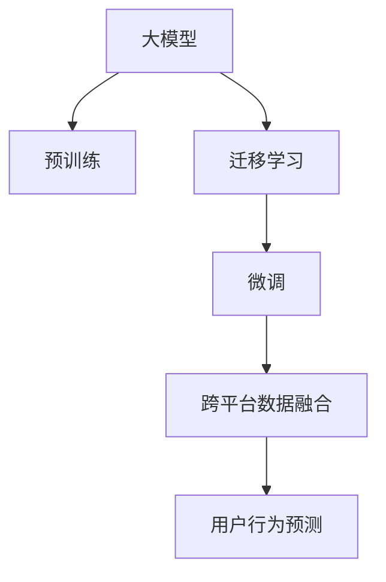

                 

# 电商行业中的迁移学习：大模型在跨平台用户行为预测与应用中的创新

> 关键词：电商行为预测, 迁移学习, 大模型, 用户个性化, 跨平台

## 1. 背景介绍

### 1.1 问题由来
随着电子商务的蓬勃发展，用户行为分析已成为电商平台优化用户体验、提升转化率的重要手段。然而，电商行业具有高度的领域特性，不同平台的商品、服务、用户群体等差异较大，导致同一用户在不同平台的电商行为存在显著差异。如何构建一个统一的电商行为预测模型，以有效整合用户跨平台数据，挖掘用户潜在的购买行为，成为行业的热点话题。

### 1.2 问题核心关键点
在电商行业中，用户行为预测模型需要具备以下特点：
1. **跨平台能力**：能够整合多个电商平台的客户数据，为用户提供统一的预测结果。
2. **用户个性化**：能够准确预测用户的个性化行为，如购买兴趣、偏好等。
3. **实时性**：能够实时处理用户行为数据，提供即时的预测结果。
4. **高效性**：在处理海量数据的同时，确保模型的预测效率。

当前，基于小样本学习的数据驱动模型难以满足电商行业对用户行为预测的这些需求。大模型迁移学习提供了一种新的范式，利用预训练模型在通用数据上的知识，通过有监督微调的方式，提升模型在特定领域的应用性能。

### 1.3 问题研究意义
通过大模型迁移学习，电商行业可以实现以下几方面的创新：
1. **提升预测精度**：大模型迁移学习能够在通用的基础上进行有监督微调，通过大规模预训练数据的泛化能力，提升模型在不同电商平台上的预测精度。
2. **优化个性化推荐**：大模型能够利用跨平台数据进行联合建模，从而更全面地了解用户偏好，提供个性化的推荐服务。
3. **增强用户体验**：实时预测用户行为，帮助电商平台在用户浏览时提供个性化的促销信息和产品推荐，提升用户体验和转化率。
4. **减少成本投入**：相比于从头构建模型，利用大模型的迁移学习可以显著减少数据和计算资源的投入，降低开发和维护成本。

## 2. 核心概念与联系

### 2.1 核心概念概述

为更好地理解大模型在电商行为预测中的应用，本节将介绍几个密切相关的核心概念：

- **大模型(Large Models)**：指采用大规模深度学习模型，如BERT、GPT等，通过预训练学习丰富的语言和知识表示。
- **迁移学习(Transfer Learning)**：指利用已在大规模通用数据上预训练的模型，通过小样本有监督微调，提升模型在特定领域的表现。
- **预训练(Pre-training)**：指在无标签的通用数据上进行的深度学习模型训练，学习通用的语言表示。
- **微调(Fine-tuning)**：指在有标签的特定领域数据上，进一步训练预训练模型，使其适应该领域的数据分布和任务需求。
- **跨平台数据融合**：指整合不同电商平台的用户数据，进行统一分析和建模。
- **用户行为预测**：指通过模型预测用户的电商行为，如购买、浏览、退货等。

这些概念之间的逻辑关系可以通过以下Mermaid流程图来展示：



这个流程图展示了大模型在电商行为预测中的核心概念及其之间的关系：

1. 大模型通过预训练获得基础能力。
2. 迁移学习通过有监督微调，在大模型基础上提升其在特定领域的预测能力。
3. 跨平台数据融合整合多个电商平台的数据，提供统一的预测输入。
4. 用户行为预测利用融合后的数据进行建模和预测。

## 3. 核心算法原理 & 具体操作步骤
### 3.1 算法原理概述

大模型迁移学习用于电商行为预测，本质上是将大模型视作通用的特征提取器，通过在不同电商平台的标注数据上进行有监督微调，提升模型对特定用户行为的理解和预测能力。

形式化地，假设预训练大模型为 $M_{\theta}$，其中 $\theta$ 为预训练得到的模型参数。给定电商平台 $P$ 的标注数据集 $D=\{(x_i, y_i)\}_{i=1}^N, x_i \in \mathcal{X}, y_i \in \mathcal{Y}$，其中 $\mathcal{X}$ 为输入空间，$\mathcal{Y}$ 为输出空间，$y_i$ 表示用户行为（如购买、浏览、退货等）。微调的目标是找到新的模型参数 $\hat{\theta}$，使得：

$$
\hat{\theta}=\mathop{\arg\min}_{\theta} \mathcal{L}(M_{\theta},D)
$$

其中 $\mathcal{L}$ 为针对特定任务设计的损失函数，用于衡量模型预测输出与真实标签之间的差异。常见的损失函数包括交叉熵损失、均方误差损失等。

### 3.2 算法步骤详解

基于大模型迁移学习用于电商行为预测，一般包括以下几个关键步骤：

**Step 1: 准备预训练模型和数据集**
- 选择合适的预训练语言模型 $M_{\theta}$ 作为初始化参数，如 BERT、GPT等。
- 准备电商平台 $P$ 的标注数据集 $D$，划分为训练集、验证集和测试集。标注数据需要包括用户行为（如购买、浏览、退货等）的标签信息。

**Step 2: 设计任务适配层**
- 根据电商平台的任务特点，在预训练模型顶层设计合适的输出层和损失函数。例如，对于电商行为预测，可以设计一个包含softmax输出层的二分类损失函数。
- 在输出层之后，可能需要添加额外的神经网络层，如全连接层、卷积层等，进一步提取和融合特征。

**Step 3: 设置微调超参数**
- 选择合适的优化算法及其参数，如 AdamW、SGD 等，设置学习率、批大小、迭代轮数等。
- 设置正则化技术及强度，包括权重衰减、Dropout、Early Stopping 等。
- 确定冻结预训练参数的策略，如仅微调顶层，或全部参数都参与微调。

**Step 4: 执行梯度训练**
- 将训练集数据分批次输入模型，前向传播计算损失函数。
- 反向传播计算参数梯度，根据设定的优化算法和学习率更新模型参数。
- 周期性在验证集上评估模型性能，根据性能指标决定是否触发 Early Stopping。
- 重复上述步骤直到满足预设的迭代轮数或 Early Stopping 条件。

**Step 5: 测试和部署**
- 在测试集上评估微调后模型 $M_{\hat{\theta}}$ 的性能，对比微调前后的精度提升。
- 使用微调后的模型对新样本进行推理预测，集成到实际的应用系统中。
- 持续收集新的数据，定期重新微调模型，以适应数据分布的变化。

以上是基于大模型迁移学习用于电商行为预测的一般流程。在实际应用中，还需要针对具体电商平台的特点，对微调过程的各个环节进行优化设计，如改进训练目标函数，引入更多的正则化技术，搜索最优的超参数组合等，以进一步提升模型性能。

### 3.3 算法优缺点

大模型迁移学习用于电商行为预测，具有以下优点：
1. 简单高效。只需准备少量标注数据，即可对预训练模型进行快速适配，获得较大的性能提升。
2. 泛化能力强。大模型通过大规模预训练数据的泛化能力，能够在不同电商平台上的数据分布上取得不错的预测效果。
3. 参数高效。利用参数高效微调技术，在固定大部分预训练参数的情况下，仍可取得不错的提升。
4. 应用广泛。适用于电商行业的各种任务，包括用户行为预测、推荐系统、个性化营销等。

同时，该方法也存在一定的局限性：
1. 依赖标注数据。微调的效果很大程度上取决于标注数据的质量和数量，获取高质量标注数据的成本较高。
2. 迁移能力有限。当目标电商平台与预训练数据的分布差异较大时，微调的性能提升有限。
3. 可解释性不足。微调模型的决策过程通常缺乏可解释性，难以对其推理逻辑进行分析和调试。

尽管存在这些局限性，但就目前而言，大模型迁移学习仍然是大模型应用的最主流范式。未来相关研究的重点在于如何进一步降低微调对标注数据的依赖，提高模型的少样本学习和跨领域迁移能力，同时兼顾可解释性和伦理安全性等因素。

### 3.4 算法应用领域

大模型迁移学习在电商行为预测中的应用广泛，以下是几个典型领域：

- **用户行为预测**：通过整合不同电商平台的用户数据，构建统一的行为预测模型，预测用户的购买行为、浏览行为、退货行为等。
- **推荐系统**：利用用户的浏览和购买历史，进行跨平台推荐，提供个性化的产品推荐。
- **个性化营销**：通过行为预测结果，实时推送个性化的广告和优惠信息，提升用户转化率和满意度。
- **客户服务**：预测用户可能遇到的问题，提前提供解决方案，提升客户服务效率和满意度。

除了这些主要应用外，大模型迁移学习还可以在用户分析、风险控制、库存管理等多个电商环节中发挥作用，推动电商行业的数字化转型。

## 4. 数学模型和公式 & 详细讲解  
### 4.1 数学模型构建

本节将使用数学语言对基于大模型的迁移学习用于电商行为预测的过程进行更加严格的刻画。

记预训练大模型为 $M_{\theta}$，其中 $\theta$ 为预训练得到的模型参数。假设电商平台的标注数据集为 $D=\{(x_i, y_i)\}_{i=1}^N, x_i \in \mathcal{X}, y_i \in \mathcal{Y}$。

定义模型 $M_{\theta}$ 在输入 $x$ 上的损失函数为 $\ell(M_{\theta}(x),y)$，则在数据集 $D$ 上的经验风险为：

$$
\mathcal{L}(\theta) = \frac{1}{N} \sum_{i=1}^N \ell(M_{\theta}(x_i),y_i)
$$

微调的优化目标是最小化经验风险，即找到最优参数：

$$
\theta^* = \mathop{\arg\min}_{\theta} \mathcal{L}(\theta)
$$

在实践中，我们通常使用基于梯度的优化算法（如SGD、Adam等）来近似求解上述最优化问题。设 $\eta$ 为学习率，$\lambda$ 为正则化系数，则参数的更新公式为：

$$
\theta \leftarrow \theta - \eta \nabla_{\theta}\mathcal{L}(\theta) - \eta\lambda\theta
$$

其中 $\nabla_{\theta}\mathcal{L}(\theta)$ 为损失函数对参数 $\theta$ 的梯度，可通过反向传播算法高效计算。

### 4.2 公式推导过程

以下我们以电商行为预测任务为例，推导交叉熵损失函数及其梯度的计算公式。

假设模型 $M_{\theta}$ 在输入 $x$ 上的输出为 $\hat{y}=M_{\theta}(x) \in [0,1]$，表示用户行为发生的概率。真实标签 $y \in \{0,1\}$。则二分类交叉熵损失函数定义为：

$$
\ell(M_{\theta}(x),y) = -[y\log \hat{y} + (1-y)\log (1-\hat{y})]
$$

将其代入经验风险公式，得：

$$
\mathcal{L}(\theta) = -\frac{1}{N}\sum_{i=1}^N [y_i\log M_{\theta}(x_i)+(1-y_i)\log(1-M_{\theta}(x_i))]
$$

根据链式法则，损失函数对参数 $\theta_k$ 的梯度为：

$$
\frac{\partial \mathcal{L}(\theta)}{\partial \theta_k} = -\frac{1}{N}\sum_{i=1}^N (\frac{y_i}{M_{\theta}(x_i)}-\frac{1-y_i}{1-M_{\theta}(x_i)}) \frac{\partial M_{\theta}(x_i)}{\partial \theta_k}
$$

其中 $\frac{\partial M_{\theta}(x_i)}{\partial \theta_k}$ 可进一步递归展开，利用自动微分技术完成计算。

在得到损失函数的梯度后，即可带入参数更新公式，完成模型的迭代优化。重复上述过程直至收敛，最终得到适应电商行为预测任务的最优模型参数 $\theta^*$。

## 5. 项目实践：代码实例和详细解释说明
### 5.1 开发环境搭建

在进行电商行为预测的迁移学习实践前，我们需要准备好开发环境。以下是使用Python进行PyTorch开发的环境配置流程：

1. 安装Anaconda：从官网下载并安装Anaconda，用于创建独立的Python环境。

2. 创建并激活虚拟环境：
```bash
conda create -n pytorch-env python=3.8 
conda activate pytorch-env
```

3. 安装PyTorch：根据CUDA版本，从官网获取对应的安装命令。例如：
```bash
conda install pytorch torchvision torchaudio cudatoolkit=11.1 -c pytorch -c conda-forge
```

4. 安装Transformers库：
```bash
pip install transformers
```

5. 安装各类工具包：
```bash
pip install numpy pandas scikit-learn matplotlib tqdm jupyter notebook ipython
```

完成上述步骤后，即可在`pytorch-env`环境中开始迁移学习实践。

### 5.2 源代码详细实现

下面我们以电商平台行为预测为例，给出使用Transformers库对BERT模型进行迁移学习的PyTorch代码实现。

首先，定义电商行为预测任务的数据处理函数：

```python
from transformers import BertTokenizer
from torch.utils.data import Dataset
import torch

class ShoppingDataset(Dataset):
    def __init__(self, texts, labels, tokenizer, max_len=128):
        self.texts = texts
        self.labels = labels
        self.tokenizer = tokenizer
        self.max_len = max_len
        
    def __len__(self):
        return len(self.texts)
    
    def __getitem__(self, item):
        text = self.texts[item]
        label = self.labels[item]
        
        encoding = self.tokenizer(text, return_tensors='pt', max_length=self.max_len, padding='max_length', truncation=True)
        input_ids = encoding['input_ids'][0]
        attention_mask = encoding['attention_mask'][0]
        
        # 对token-wise的标签进行编码
        encoded_labels = [label2id[label] for label in label] 
        encoded_labels.extend([label2id['O']] * (self.max_len - len(encoded_labels)))
        labels = torch.tensor(encoded_labels, dtype=torch.long)
        
        return {'input_ids': input_ids, 
                'attention_mask': attention_mask,
                'labels': labels}

# 标签与id的映射
label2id = {'buy': 0, 'view': 1, 'return': 2}
id2label = {v: k for k, v in label2id.items()}

# 创建dataset
tokenizer = BertTokenizer.from_pretrained('bert-base-cased')

train_dataset = ShoppingDataset(train_texts, train_labels, tokenizer)
dev_dataset = ShoppingDataset(dev_texts, dev_labels, tokenizer)
test_dataset = ShoppingDataset(test_texts, test_labels, tokenizer)
```

然后，定义模型和优化器：

```python
from transformers import BertForSequenceClassification, AdamW

model = BertForSequenceClassification.from_pretrained('bert-base-cased', num_labels=len(label2id))

optimizer = AdamW(model.parameters(), lr=2e-5)
```

接着，定义训练和评估函数：

```python
from torch.utils.data import DataLoader
from tqdm import tqdm
from sklearn.metrics import classification_report

device = torch.device('cuda') if torch.cuda.is_available() else torch.device('cpu')
model.to(device)

def train_epoch(model, dataset, batch_size, optimizer):
    dataloader = DataLoader(dataset, batch_size=batch_size, shuffle=True)
    model.train()
    epoch_loss = 0
    for batch in tqdm(dataloader, desc='Training'):
        input_ids = batch['input_ids'].to(device)
        attention_mask = batch['attention_mask'].to(device)
        labels = batch['labels'].to(device)
        model.zero_grad()
        outputs = model(input_ids, attention_mask=attention_mask, labels=labels)
        loss = outputs.loss
        epoch_loss += loss.item()
        loss.backward()
        optimizer.step()
    return epoch_loss / len(dataloader)

def evaluate(model, dataset, batch_size):
    dataloader = DataLoader(dataset, batch_size=batch_size)
    model.eval()
    preds, labels = [], []
    with torch.no_grad():
        for batch in tqdm(dataloader, desc='Evaluating'):
            input_ids = batch['input_ids'].to(device)
            attention_mask = batch['attention_mask'].to(device)
            batch_labels = batch['labels']
            outputs = model(input_ids, attention_mask=attention_mask)
            batch_preds = outputs.logits.argmax(dim=2).to('cpu').tolist()
            batch_labels = batch_labels.to('cpu').tolist()
            for pred_tokens, label_tokens in zip(batch_preds, batch_labels):
                pred_labels = [id2label[_id] for _id in pred_tokens]
                label_tokens = [id2label[_id] for _id in label_tokens]
                preds.append(pred_labels[:len(label_tokens)])
                labels.append(label_tokens)
                
    print(classification_report(labels, preds))
```

最后，启动训练流程并在测试集上评估：

```python
epochs = 5
batch_size = 16

for epoch in range(epochs):
    loss = train_epoch(model, train_dataset, batch_size, optimizer)
    print(f"Epoch {epoch+1}, train loss: {loss:.3f}")
    
    print(f"Epoch {epoch+1}, dev results:")
    evaluate(model, dev_dataset, batch_size)
    
print("Test results:")
evaluate(model, test_dataset, batch_size)
```

以上就是使用PyTorch对BERT进行电商平台行为预测迁移学习的完整代码实现。可以看到，得益于Transformers库的强大封装，我们可以用相对简洁的代码完成BERT模型的加载和迁移学习。

### 5.3 代码解读与分析

让我们再详细解读一下关键代码的实现细节：

**ShoppingDataset类**：
- `__init__`方法：初始化文本、标签、分词器等关键组件。
- `__len__`方法：返回数据集的样本数量。
- `__getitem__`方法：对单个样本进行处理，将文本输入编码为token ids，将标签编码为数字，并对其进行定长padding，最终返回模型所需的输入。

**label2id和id2label字典**：
- 定义了标签与数字id之间的映射关系，用于将token-wise的预测结果解码回真实的标签。

**训练和评估函数**：
- 使用PyTorch的DataLoader对数据集进行批次化加载，供模型训练和推理使用。
- 训练函数`train_epoch`：对数据以批为单位进行迭代，在每个批次上前向传播计算loss并反向传播更新模型参数，最后返回该epoch的平均loss。
- 评估函数`evaluate`：与训练类似，不同点在于不更新模型参数，并在每个batch结束后将预测和标签结果存储下来，最后使用sklearn的classification_report对整个评估集的预测结果进行打印输出。

**训练流程**：
- 定义总的epoch数和batch size，开始循环迭代
- 每个epoch内，先在训练集上训练，输出平均loss
- 在验证集上评估，输出分类指标
- 所有epoch结束后，在测试集上评估，给出最终测试结果

可以看到，PyTorch配合Transformers库使得BERT迁移学习的代码实现变得简洁高效。开发者可以将更多精力放在数据处理、模型改进等高层逻辑上，而不必过多关注底层的实现细节。

当然，工业级的系统实现还需考虑更多因素，如模型的保存和部署、超参数的自动搜索、更灵活的任务适配层等。但核心的迁移学习范式基本与此类似。

## 6. 实际应用场景
### 6.1 电商平台用户行为预测

电商平台利用用户行为预测模型，可以实现以下几方面的创新：
1. **个性化推荐**：通过预测用户的购买行为，提供个性化的产品推荐，提升用户满意度。
2. **库存管理**：预测用户的购买行为，优化库存管理，减少缺货和过剩库存。
3. **风险控制**：预测用户的退货行为，及时发现和处理订单风险，减少损失。

例如，通过整合用户在多个电商平台上的浏览、购买和退货记录，可以构建一个统一的电商行为预测模型。模型通过有监督微调，学习用户在不同电商平台上的购买偏好和行为规律，从而实现跨平台的预测和推荐。

### 6.2 实时个性化推荐

电商平台在用户浏览页面时，利用实时预测模型，可以提供个性化的广告和推荐内容，提升用户的购物体验和转化率。例如，当用户浏览某个商品页面时，实时预测模型可以根据用户的浏览历史和行为数据，预测用户可能感兴趣的其他商品，动态生成推荐列表，展示在用户屏幕的一侧。

这种实时个性化的推荐系统，能够根据用户的实时行为数据，提供即时的推荐结果，满足用户的即时需求，提升用户体验和销售转化率。

### 6.3 用户行为分析

电商平台可以利用用户行为预测模型，分析用户在不同时间段、不同平台上的行为规律和趋势，从而优化用户营销策略和业务流程。例如，通过分析用户的购买时间分布，可以优化库存管理和物流配送，提高客户满意度。

### 6.4 未来应用展望

随着电商行业的不断发展和技术的进步，基于大模型的迁移学习将在电商领域实现更广泛的应用，带来以下几方面的创新：
1. **跨平台数据融合**：利用大数据和云计算技术，整合不同电商平台的数据，构建统一的电商行为预测模型。
2. **实时动态调整**：通过在线学习算法，实时更新模型参数，确保模型能够适应不断变化的市场环境。
3. **个性化推荐优化**：利用用户的多模态数据，如浏览、点击、评论等，提供更加个性化和精准的推荐服务。
4. **智能客服**：利用预测模型，构建智能客服系统，实现用户问题的即时回答和解决方案推送，提升客户服务效率和满意度。

## 7. 工具和资源推荐
### 7.1 学习资源推荐

为了帮助开发者系统掌握大模型迁移学习用于电商行为预测的理论基础和实践技巧，这里推荐一些优质的学习资源：

1. 《Transformer从原理到实践》系列博文：由大模型技术专家撰写，深入浅出地介绍了Transformer原理、BERT模型、迁移学习等前沿话题。

2. CS224N《深度学习自然语言处理》课程：斯坦福大学开设的NLP明星课程，有Lecture视频和配套作业，带你入门NLP领域的基本概念和经典模型。

3. 《Natural Language Processing with Transformers》书籍：Transformers库的作者所著，全面介绍了如何使用Transformers库进行NLP任务开发，包括迁移学习在内的诸多范式。

4. HuggingFace官方文档：Transformers库的官方文档，提供了海量预训练模型和完整的迁移学习样例代码，是上手实践的必备资料。

5. CLUE开源项目：中文语言理解测评基准，涵盖大量不同类型的中文NLP数据集，并提供了基于迁移学习的baseline模型，助力中文NLP技术发展。

通过对这些资源的学习实践，相信你一定能够快速掌握大模型迁移学习用于电商行为预测的精髓，并用于解决实际的电商问题。
###  7.2 开发工具推荐

高效的开发离不开优秀的工具支持。以下是几款用于大模型迁移学习开发的常用工具：

1. PyTorch：基于Python的开源深度学习框架，灵活动态的计算图，适合快速迭代研究。大部分预训练语言模型都有PyTorch版本的实现。

2. TensorFlow：由Google主导开发的开源深度学习框架，生产部署方便，适合大规模工程应用。同样有丰富的预训练语言模型资源。

3. Transformers库：HuggingFace开发的NLP工具库，集成了众多SOTA语言模型，支持PyTorch和TensorFlow，是进行迁移学习任务开发的利器。

4. Weights & Biases：模型训练的实验跟踪工具，可以记录和可视化模型训练过程中的各项指标，方便对比和调优。与主流深度学习框架无缝集成。

5. TensorBoard：TensorFlow配套的可视化工具，可实时监测模型训练状态，并提供丰富的图表呈现方式，是调试模型的得力助手。

6. Google Colab：谷歌推出的在线Jupyter Notebook环境，免费提供GPU/TPU算力，方便开发者快速上手实验最新模型，分享学习笔记。

合理利用这些工具，可以显著提升大模型迁移学习任务的开发效率，加快创新迭代的步伐。

### 7.3 相关论文推荐

大模型迁移学习的发展源于学界的持续研究。以下是几篇奠基性的相关论文，推荐阅读：

1. Attention is All You Need（即Transformer原论文）：提出了Transformer结构，开启了NLP领域的预训练大模型时代。

2. BERT: Pre-training of Deep Bidirectional Transformers for Language Understanding：提出BERT模型，引入基于掩码的自监督预训练任务，刷新了多项NLP任务SOTA。

3. Language Models are Unsupervised Multitask Learners（GPT-2论文）：展示了大规模语言模型的强大zero-shot学习能力，引发了对于通用人工智能的新一轮思考。

4. Parameter-Efficient Transfer Learning for NLP：提出Adapter等参数高效微调方法，在不增加模型参数量的情况下，也能取得不错的迁移学习效果。

5. AdaLoRA: Adaptive Low-Rank Adaptation for Parameter-Efficient Fine-Tuning：使用自适应低秩适应的迁移学习方法，在参数效率和精度之间取得了新的平衡。

6. Prefix-Tuning: Optimizing Continuous Prompts for Generation：引入基于连续型Prompt的迁移学习范式，为如何充分利用预训练知识提供了新的思路。

这些论文代表了大模型迁移学习的发展脉络。通过学习这些前沿成果，可以帮助研究者把握学科前进方向，激发更多的创新灵感。

## 8. 总结：未来发展趋势与挑战

### 8.1 总结

本文对大模型迁移学习用于电商行为预测的方法进行了全面系统的介绍。首先阐述了电商行业对大模型迁移学习的需求和意义，明确了迁移学习在电商平台应用中的优势。其次，从原理到实践，详细讲解了迁移学习的数学原理和关键步骤，给出了迁移学习任务开发的完整代码实例。同时，本文还广泛探讨了迁移学习方法在电商行业的应用前景，展示了迁移学习范式的巨大潜力。

通过本文的系统梳理，可以看到，大模型迁移学习在电商行业的应用前景广阔，利用预训练模型的泛化能力，结合电商数据的多样性和复杂性，能够显著提升电商行为预测的准确性和个性化水平。未来，随着预训练语言模型的不断演进，迁移学习将进一步发挥其优势，推动电商行业的智能化转型。

### 8.2 未来发展趋势

展望未来，大模型迁移学习用于电商行为预测的发展趋势如下：

1. **跨平台数据融合**：随着电商行业的融合与整合，跨平台数据融合将变得更加普遍，通过整合多平台数据，提升预测模型的泛化能力。

2. **实时动态调整**：利用在线学习算法，模型能够实时更新，确保预测结果能够动态适应市场变化。

3. **多模态数据融合**：结合用户的文本数据、图片数据、行为数据等多模态信息，进行联合建模，提升预测模型的准确性和鲁棒性。

4. **个性化推荐优化**：利用用户的浏览、点击、评论等多维数据，提供更加个性化和精准的推荐服务，提升用户体验和转化率。

5. **智能客服**：利用预测模型，构建智能客服系统，实现用户问题的即时回答和解决方案推送，提升客户服务效率和满意度。

以上趋势凸显了大模型迁移学习用于电商行为预测的广阔前景。这些方向的探索发展，必将进一步提升电商行为预测的准确性和个性化水平，为电商平台带来更高的运营效率和用户满意度。

### 8.3 面临的挑战

尽管大模型迁移学习用于电商行为预测已经取得了瞩目成就，但在迈向更加智能化、普适化应用的过程中，它仍面临着诸多挑战：

1. **标注成本瓶颈**：电商行业的用户行为数据复杂多样，标注数据的获取和维护成本较高，如何降低标注成本，提高标注数据的利用率，仍然是一个重要的研究方向。

2. **模型鲁棒性不足**：电商行为预测模型在处理噪声数据、异常数据时，容易产生过拟合现象，如何提高模型的鲁棒性和泛化能力，减少过拟合风险，是一个亟待解决的问题。

3. **用户隐私保护**：电商平台在获取和处理用户数据时，需要严格遵守数据隐私保护法规，如何在保护用户隐私的前提下，实现高质量的电商行为预测，也是一个重要挑战。

4. **系统扩展性**：随着电商数据的不断增长，预测模型的规模和复杂度也会随之增加，如何在保证预测准确性的同时，提升系统的扩展性和稳定性，是一个重要的技术问题。

5. **模型解释性不足**：电商行为预测模型通常较为复杂，难以解释其内部工作机制和决策逻辑，如何提高模型的可解释性，确保预测结果的可信度和透明性，是一个重要的研究方向。

6. **跨平台数据质量不一致**：不同电商平台的数据格式和质量可能存在差异，如何确保跨平台数据的一致性和准确性，是一个重要的技术挑战。

这些挑战凸显了大模型迁移学习在电商行业的应用前景和潜力。随着相关技术的不断进步，相信这些挑战终将一一被克服，大模型迁移学习必将在电商行业中发挥更大的作用。

### 8.4 研究展望

面对大模型迁移学习在电商行业面临的挑战，未来的研究需要在以下几个方面寻求新的突破：

1. **跨平台数据融合技术**：探索高效的数据融合方法，确保跨平台数据的一致性和准确性，提升预测模型的泛化能力。

2. **模型鲁棒性增强**：利用对抗训练、正则化等技术，增强模型对噪声数据和异常数据的鲁棒性，提升模型的泛化能力。

3. **用户隐私保护**：采用差分隐私、联邦学习等技术，确保用户数据的安全性和隐私性，在保护用户隐私的前提下，实现高质量的电商行为预测。

4. **模型解释性增强**：利用可解释AI技术，提高模型的可解释性和透明性，确保预测结果的可信度和透明性。

5. **系统扩展性优化**：利用模型压缩、分布式训练等技术，优化模型的存储和计算效率，提升系统的扩展性和稳定性。

6. **跨平台数据质量提升**：通过数据清洗、标准化等技术，提升跨平台数据的质量和一致性，确保模型的预测准确性。

这些研究方向的探索，必将引领大模型迁移学习在电商行业的应用进入新的阶段，推动电商行业的数字化转型和智能化升级。

## 9. 附录：常见问题与解答

**Q1：大模型迁移学习是否适用于所有电商行为预测任务？**

A: 大模型迁移学习在大多数电商行为预测任务上都能取得不错的效果，特别是对于数据量较小的任务。但对于一些特定领域的任务，如医疗、法律等，仅仅依靠通用语料预训练的模型可能难以很好地适应。此时需要在特定领域语料上进一步预训练，再进行迁移学习，才能获得理想效果。此外，对于一些需要时效性、个性化很强的任务，如对话、推荐等，迁移学习方法也需要针对性的改进优化。

**Q2：如何选择合适的学习率？**

A: 迁移学习的学习率一般要比预训练时小1-2个数量级，如果使用过大的学习率，容易破坏预训练权重，导致过拟合。一般建议从1e-5开始调参，逐步减小学习率，直至收敛。也可以使用warmup策略，在开始阶段使用较小的学习率，再逐渐过渡到预设值。需要注意的是，不同的优化器(如AdamW、Adafactor等)以及不同的学习率调度策略，可能需要设置不同的学习率阈值。

**Q3：采用大模型迁移学习时会面临哪些资源瓶颈？**

A: 目前主流的预训练大模型动辄以亿计的参数规模，对算力、内存、存储都提出了很高的要求。GPU/TPU等高性能设备是必不可少的，但即便如此，超大批次的训练和推理也可能遇到显存不足的问题。因此需要采用一些资源优化技术，如梯度积累、混合精度训练、模型并行等，来突破硬件瓶颈。同时，模型的存储和读取也可能占用大量时间和空间，需要采用模型压缩、稀疏化存储等方法进行优化。

**Q4：如何缓解迁移学习过程中的过拟合问题？**

A: 过拟合是迁移学习面临的主要挑战，尤其是在标注数据不足的情况下。常见的缓解策略包括：
1. 数据增强：通过回译、近义替换等方式扩充训练集
2. 正则化：使用L2正则、Dropout、Early Stopping等避免过拟合
3. 对抗训练：引入对抗样本，提高模型鲁棒性
4. 参数高效迁移学习：只调整少量参数(如Adapter、Prefix等)，减小过拟合风险
5. 多模型集成：训练多个迁移学习模型，取平均输出，抑制过拟合

这些策略往往需要根据具体任务和数据特点进行灵活组合。只有在数据、模型、训练、推理等各环节进行全面优化，才能最大限度地发挥大模型迁移学习的威力。

**Q5：迁移学习模型在落地部署时需要注意哪些问题？**

A: 将迁移学习模型转化为实际应用，还需要考虑以下因素：
1. 模型裁剪：去除不必要的层和参数，减小模型尺寸，加快推理速度
2. 量化加速：将浮点模型转为定点模型，压缩存储空间，提高计算效率
3. 服务化封装：将模型封装为标准化服务接口，便于集成调用
4. 弹性伸缩：根据请求流量动态调整资源配置，平衡服务质量和成本
5. 监控告警：实时采集系统指标，设置异常告警阈值，确保服务稳定性
6. 安全防护：采用访问鉴权、数据脱敏等措施，保障数据和模型安全

大模型迁移学习为电商平台带来了更强的预测能力和个性化推荐服务，但如何将强大的性能转化为稳定、高效、安全的业务价值，还需要工程实践的不断打磨。唯有从数据、算法、工程、业务等多个维度协同发力，才能真正实现人工智能技术在垂直行业的规模化落地。总之，迁移学习需要开发者根据具体任务，不断迭代和优化模型、数据和算法，方能得到理想的效果。

---

作者：禅与计算机程序设计艺术 / Zen and the Art of Computer Programming

