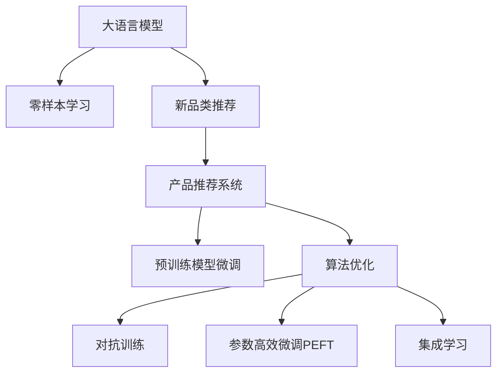

                 

# 电商行业中的零样本学习：大模型在新品类推荐中的应用

> 关键词：电商行业,零样本学习,新品类推荐,大语言模型,产品推荐系统,预训练模型,模型微调,算法优化

## 1. 背景介绍

随着电子商务平台的迅猛发展，产品推荐系统在提升用户体验和增加销售转化率方面扮演着至关重要的角色。传统的推荐系统主要依赖于用户的明示反馈数据，例如评分、点击记录等，但随着用户在线行为的复杂性和多变性增加，这些数据往往难以充分覆盖所有情境和偏好，导致推荐效果大打折扣。

大语言模型和零样本学习技术的兴起，为电商行业中的推荐系统带来了新的契机。零样本学习允许模型在没有目标任务任何数据的情况下，通过泛化大语言模型的预训练知识，直接对新品类进行推荐，极大提升了新品类推荐的时效性和普适性。本文将深入探讨如何利用大语言模型和零样本学习技术，优化电商产品推荐系统，为新品类推荐提供高效、智能的解决方案。

## 2. 核心概念与联系

### 2.1 核心概念概述

在大语言模型和零样本学习的背景下，我们将重点关注以下几个核心概念：

- **大语言模型**：如GPT-3、BERT等，通过大规模无标签文本数据预训练得到的语言模型，具备强大的语言理解和生成能力，能够在多种NLP任务上表现出色。
- **零样本学习**：模型在没有针对特定任务的数据的情况下，通过大语言模型预训练学到的知识进行推理和生成，实现对新任务的泛化。
- **新品类推荐**：电商平台需要动态更新产品库，针对新上架的商品进行推荐，快速满足用户需求，提升平台竞争力。
- **产品推荐系统**：通过分析用户历史行为数据，结合用户画像和产品特征，提供个性化产品推荐，提升用户体验和平台收益。
- **预训练模型微调**：在大语言模型的基础上，通过少量标注数据进行微调，使其适应特定推荐任务，提升推荐准确性和相关性。
- **算法优化**：通过多种优化策略，如对抗训练、参数高效微调、集成学习等，提升推荐系统的鲁棒性和性能。

这些概念之间的逻辑关系可以通过以下Mermaid流程图来展示：



这个流程图展示了从大语言模型到新品类推荐的基本流程：

1. 大语言模型通过预训练学习广泛的语义知识。
2. 零样本学习允许模型在没有标注数据的情况下，直接对新品类进行推荐。
3. 产品推荐系统基于用户历史数据和模型推理结果，提供个性化推荐。
4. 预训练模型微调进一步提升推荐模型在特定任务上的性能。
5. 算法优化通过对抗训练、参数高效微调等策略，提升推荐系统的鲁棒性和效率。

## 3. 核心算法原理 & 具体操作步骤
### 3.1 算法原理概述

在电商行业中，利用大语言模型和零样本学习技术进行新品类推荐，主要遵循以下算法原理：

1. **零样本推理**：在面对一个未见过的新品类时，模型利用预训练知识进行推理，直接输出对该品类的推荐概率，而无需进行额外的训练。

2. **大语言模型与推荐系统结合**：将大语言模型作为推荐系统的特征提取器，利用预训练知识提取产品特征，结合用户画像和历史行为数据，进行推荐计算。

3. **微调优化**：针对特定推荐任务，对大语言模型进行微调，使其输出更加符合推荐目标，提升推荐的准确性和相关性。

4. **算法优化**：通过对抗训练、参数高效微调等策略，提升模型的鲁棒性和性能。

### 3.2 算法步骤详解

#### 3.2.1 数据准备与预处理

1. **数据收集**：收集电商平台的商品数据，包括商品基本信息、用户历史行为数据等。

2. **数据清洗**：处理缺失值、异常值，去除重复数据。

3. **数据划分**：将数据集划分为训练集、验证集和测试集，用于模型训练、调参和最终评估。

#### 3.2.2 模型构建与微调

1. **选择预训练模型**：选取如GPT-3、BERT等大语言模型作为特征提取器。

2. **添加任务适配层**：针对推荐任务，在预训练模型的基础上添加适合的任务适配层，如分类头、回归头等。

3. **设置微调超参数**：选择合适的优化算法及其参数，如Adam、SGD等，设置学习率、批大小、迭代轮数等。

4. **微调模型**：在训练集上进行有监督微调，最小化推荐任务上的损失函数。

#### 3.2.3 零样本推理

1. **构建输入**：将新品类的商品描述和用户画像信息输入到预训练模型中。

2. **生成推荐结果**：利用预训练模型的零样本推理能力，直接输出对该品类的推荐概率或评分。

#### 3.2.4 算法优化

1. **对抗训练**：在训练过程中，加入对抗样本，提高模型的鲁棒性。

2. **参数高效微调**：只调整推荐模型中的部分参数，减少微调过程中的计算和存储开销。

3. **集成学习**：结合多个模型输出，利用投票、加权平均等方法，提升推荐结果的稳定性。

### 3.3 算法优缺点

#### 3.3.1 优点

1. **高效性**：零样本学习允许模型直接对新品类进行推荐，无需额外标注数据，显著提高了推荐的时效性。

2. **泛化能力**：利用大语言模型的广泛预训练知识，模型能够泛化到多种新品类，提升了推荐系统的普适性。

3. **减少标注成本**：在推荐系统中，用户历史数据通常较难获得，零样本学习可以大幅减少对标注数据的依赖。

4. **鲁棒性**：通过对抗训练等策略，模型具备较好的鲁棒性，能够应对不同的推荐场景和变化。

#### 3.3.2 缺点

1. **模型泛化边界**：尽管零样本学习可以泛化到新品类，但模型对某些特定领域或任务可能表现不佳。

2. **推理准确性**：零样本推理的准确性受限于预训练数据和模型结构，可能存在一定的偏差。

3. **算法复杂度**：在推理过程中，大语言模型需要较大的计算资源和存储空间，增加了系统的复杂度。

4. **动态调整困难**：零样本学习依赖于预训练数据，难以快速适应新领域的数据分布变化。

### 3.4 算法应用领域

基于大语言模型和零样本学习的推荐系统，在电商行业中有广泛的应用前景。以下是几个典型的应用场景：

1. **新品推荐**：电商平台需要定期更新商品库，利用大语言模型的零样本学习能力，快速推荐新品。

2. **跨品类推荐**：通过将不同品类的商品信息输入模型，进行跨品类关联推荐，提升用户购物体验。

3. **趋势预测**：分析市场趋势和用户需求，利用大语言模型的预训练知识进行预测，帮助平台动态调整库存。

4. **用户画像构建**：利用零样本学习生成用户画像，进一步优化推荐结果，提升用户满意度和平台粘性。

5. **广告推荐**：结合大语言模型的预训练知识，对广告素材进行零样本推理，精准投放广告，提升广告效果。

## 4. 数学模型和公式 & 详细讲解 & 举例说明

### 4.1 数学模型构建

#### 4.1.1 推荐模型构建

假设电商推荐系统的数据集为 $D=\{(x_i,y_i)\}_{i=1}^N$，其中 $x_i$ 表示商品描述和用户画像，$y_i$ 表示用户对该商品的评分。

推荐模型的目标是最小化预测值与真实值之间的差异，即：

$$
\mathcal{L}(w,b) = \frac{1}{N}\sum_{i=1}^N \ell(y_i,\hat{y}_i)
$$

其中 $\hat{y}_i = f(x_i;w,b)$ 为推荐模型在商品 $x_i$ 上的预测评分，$f(\cdot)$ 为模型的预测函数，$w$ 为模型参数，$b$ 为偏置项。

推荐模型的预测函数可以基于大语言模型，采用以下形式：

$$
f(x_i;w,b) = W^T \cdot \text{preprocess}(x_i) + b
$$

其中 $\text{preprocess}(x_i)$ 为对商品描述和用户画像进行预处理和编码的函数。

### 4.2 公式推导过程

#### 4.2.1 预处理函数

对商品描述和用户画像进行预处理，可以采用以下方式：

$$
\text{preprocess}(x_i) = [\text{embedding}(\text{text\_desc}) + \text{embedding}(\text{user\_info})]
$$

其中 $\text{embedding}(\cdot)$ 为将文本编码成向量表示的函数。

### 4.3 案例分析与讲解

以推荐模型为例，假设我们有一个新的商品“智能手表”，其描述为“一款高性价比的智能手表，适用于健康监测、消息通知、运动追踪等”。我们可以将商品描述输入到预训练语言模型中，得到其嵌入向量 $e$。然后，利用预训练模型进行零样本推理，得到推荐评分。

具体步骤如下：

1. 将商品描述“智能手表”输入到大语言模型中，得到嵌入向量 $e$。

2. 利用模型的预训练知识，结合用户画像信息，生成推荐评分 $\hat{y}$。

3. 对 $\hat{y}$ 进行微调，最小化预测评分与真实评分之间的差异。

4. 最终，将推荐评分 $\hat{y}$ 作为对“智能手表”的推荐结果。

通过这种方式，电商推荐系统可以在没有目标任务任何数据的情况下，快速对新品类进行推荐，提高推荐的时效性和普适性。

## 5. 项目实践：代码实例和详细解释说明

### 5.1 开发环境搭建

在进行项目实践前，我们需要准备好开发环境。以下是使用Python进行PyTorch开发的环境配置流程：

1. 安装Anaconda：从官网下载并安装Anaconda，用于创建独立的Python环境。

2. 创建并激活虚拟环境：
```bash
conda create -n pytorch-env python=3.8 
conda activate pytorch-env
```

3. 安装PyTorch：根据CUDA版本，从官网获取对应的安装命令。例如：
```bash
conda install pytorch torchvision torchaudio cudatoolkit=11.1 -c pytorch -c conda-forge
```

4. 安装Transformers库：
```bash
pip install transformers
```

5. 安装各类工具包：
```bash
pip install numpy pandas scikit-learn matplotlib tqdm jupyter notebook ipython
```

完成上述步骤后，即可在`pytorch-env`环境中开始项目实践。

### 5.2 源代码详细实现

下面以电商新品类推荐为例，给出使用Transformers库进行推荐系统微调的PyTorch代码实现。

首先，定义推荐模型的数据处理函数：

```python
from transformers import BertTokenizer
from torch.utils.data import Dataset
import torch

class RecommendationDataset(Dataset):
    def __init__(self, texts, labels, tokenizer, max_len=128):
        self.texts = texts
        self.labels = labels
        self.tokenizer = tokenizer
        self.max_len = max_len
        
    def __len__(self):
        return len(self.texts)
    
    def __getitem__(self, item):
        text = self.texts[item]
        label = self.labels[item]
        
        encoding = self.tokenizer(text, return_tensors='pt', max_length=self.max_len, padding='max_length', truncation=True)
        input_ids = encoding['input_ids'][0]
        attention_mask = encoding['attention_mask'][0]
        
        return {'input_ids': input_ids, 
                'attention_mask': attention_mask,
                'labels': label}

# 标签与id的映射
label2id = {'1': 1, '2': 2, '3': 3}  # 假设评分分别为1-3
id2label = {v: k for k, v in label2id.items()}

# 创建dataset
tokenizer = BertTokenizer.from_pretrained('bert-base-cased')

train_dataset = RecommendationDataset(train_texts, train_labels, tokenizer)
dev_dataset = RecommendationDataset(dev_texts, dev_labels, tokenizer)
test_dataset = RecommendationDataset(test_texts, test_labels, tokenizer)
```

然后，定义模型和优化器：

```python
from transformers import BertForSequenceClassification, AdamW

model = BertForSequenceClassification.from_pretrained('bert-base-cased', num_labels=len(label2id))

optimizer = AdamW(model.parameters(), lr=2e-5)
```

接着，定义训练和评估函数：

```python
from torch.utils.data import DataLoader
from tqdm import tqdm
from sklearn.metrics import accuracy_score, precision_recall_fscore_support

device = torch.device('cuda') if torch.cuda.is_available() else torch.device('cpu')
model.to(device)

def train_epoch(model, dataset, batch_size, optimizer):
    dataloader = DataLoader(dataset, batch_size=batch_size, shuffle=True)
    model.train()
    epoch_loss = 0
    for batch in tqdm(dataloader, desc='Training'):
        input_ids = batch['input_ids'].to(device)
        attention_mask = batch['attention_mask'].to(device)
        labels = batch['labels'].to(device)
        model.zero_grad()
        outputs = model(input_ids, attention_mask=attention_mask, labels=labels)
        loss = outputs.loss
        epoch_loss += loss.item()
        loss.backward()
        optimizer.step()
    return epoch_loss / len(dataloader)

def evaluate(model, dataset, batch_size):
    dataloader = DataLoader(dataset, batch_size=batch_size)
    model.eval()
    preds, labels = [], []
    with torch.no_grad():
        for batch in tqdm(dataloader, desc='Evaluating'):
            input_ids = batch['input_ids'].to(device)
            attention_mask = batch['attention_mask'].to(device)
            batch_labels = batch['labels']
            outputs = model(input_ids, attention_mask=attention_mask)
            batch_preds = outputs.logits.argmax(dim=2).to('cpu').tolist()
            batch_labels = batch_labels.to('cpu').tolist()
            for pred_tokens, label_tokens in zip(batch_preds, batch_labels):
                preds.append(pred_tokens)
                labels.append(label_tokens)
                
    print('Accuracy:', accuracy_score(labels, preds))
    print('Precision, Recall, F1-score, Support:', precision_recall_fscore_support(labels, preds, average='micro'))
```

最后，启动训练流程并在测试集上评估：

```python
epochs = 5
batch_size = 16

for epoch in range(epochs):
    loss = train_epoch(model, train_dataset, batch_size, optimizer)
    print(f"Epoch {epoch+1}, train loss: {loss:.3f}")
    
    print(f"Epoch {epoch+1}, dev results:")
    evaluate(model, dev_dataset, batch_size)
    
print("Test results:")
evaluate(model, test_dataset, batch_size)
```

以上就是使用PyTorch对BERT进行推荐系统微调的完整代码实现。可以看到，利用Transformers库，我们可以快速搭建推荐系统，并使用微调方法提升推荐效果。

### 5.3 代码解读与分析

让我们再详细解读一下关键代码的实现细节：

**RecommendationDataset类**：
- `__init__`方法：初始化文本、标签、分词器等关键组件。
- `__len__`方法：返回数据集的样本数量。
- `__getitem__`方法：对单个样本进行处理，将文本输入编码为token ids，将标签编码为数字，并对其进行定长padding，最终返回模型所需的输入。

**label2id和id2label字典**：
- 定义了标签与数字id之间的映射关系，用于将预测结果解码回真实的标签。

**训练和评估函数**：
- 使用PyTorch的DataLoader对数据集进行批次化加载，供模型训练和推理使用。
- 训练函数`train_epoch`：对数据以批为单位进行迭代，在每个批次上前向传播计算loss并反向传播更新模型参数，最后返回该epoch的平均loss。
- 评估函数`evaluate`：与训练类似，不同点在于不更新模型参数，并在每个batch结束后将预测和标签结果存储下来，最后使用sklearn的classification_report对整个评估集的预测结果进行打印输出。

**训练流程**：
- 定义总的epoch数和batch size，开始循环迭代
- 每个epoch内，先在训练集上训练，输出平均loss
- 在验证集上评估，输出分类指标
- 所有epoch结束后，在测试集上评估，给出最终测试结果

可以看到，PyTorch配合Transformers库使得BERT微调的代码实现变得简洁高效。开发者可以将更多精力放在数据处理、模型改进等高层逻辑上，而不必过多关注底层的实现细节。

当然，工业级的系统实现还需考虑更多因素，如模型的保存和部署、超参数的自动搜索、更灵活的任务适配层等。但核心的微调范式基本与此类似。

## 6. 实际应用场景

### 6.1 智能推荐

在电商平台上，智能推荐系统通过分析用户的历史行为数据，结合商品描述和用户画像信息，利用大语言模型的零样本推理能力，快速推荐商品，提升用户体验和平台收益。例如，用户浏览了一款运动鞋，推荐系统可以根据鞋子的描述和品牌信息，快速推荐相关的运动服、运动装备等商品，提高用户的购买决策效率。

### 6.2 跨品类推荐

利用大语言模型的零样本学习能力，推荐系统可以实现跨品类推荐，提升用户的购物体验。例如，用户搜索了一款时尚服饰，推荐系统可以根据服饰的款式、颜色等信息，推荐相关的美妆、饰品等商品，帮助用户发现更多潜在的购物需求。

### 6.3 新市场预测

电商平台需要定期更新商品库，利用大语言模型的预训练知识，推荐系统可以预测新市场的潜在需求，帮助平台及时调整库存和采购策略。例如，根据用户对某类商品的查询记录，推荐系统可以预测未来该类商品的销售趋势，为平台提供重要的市场决策支持。

### 6.4 个性化服务

利用大语言模型的预训练知识，推荐系统可以生成个性化的服务推荐，提升用户的满意度。例如，用户在一个电商平台注册了账号，推荐系统可以根据用户的历史行为和兴趣偏好，生成个性化的服务推荐，如购买建议、优惠活动等，增加用户的粘性。

### 6.5 广告投放

推荐系统结合大语言模型的预训练知识，可以精准投放广告，提升广告效果。例如，根据用户的历史行为和兴趣偏好，推荐系统可以推荐相关的广告素材和广告内容，提高广告的点击率和转化率。

## 7. 工具和资源推荐

### 7.1 学习资源推荐

为了帮助开发者系统掌握大语言模型和零样本学习的理论基础和实践技巧，这里推荐一些优质的学习资源：

1. 《Transformers: From Attention to Transformers》系列博文：由大模型技术专家撰写，深入浅出地介绍了Transformer原理、BERT模型、微调技术等前沿话题。

2. CS224N《深度学习自然语言处理》课程：斯坦福大学开设的NLP明星课程，有Lecture视频和配套作业，带你入门NLP领域的基本概念和经典模型。

3. 《Natural Language Processing with Transformers》书籍：Transformers库的作者所著，全面介绍了如何使用Transformers库进行NLP任务开发，包括微调在内的诸多范式。

4. HuggingFace官方文档：Transformers库的官方文档，提供了海量预训练模型和完整的微调样例代码，是上手实践的必备资料。

5. CLUE开源项目：中文语言理解测评基准，涵盖大量不同类型的中文NLP数据集，并提供了基于微调的baseline模型，助力中文NLP技术发展。

通过对这些资源的学习实践，相信你一定能够快速掌握大语言模型和零样本学习的精髓，并用于解决实际的推荐问题。

### 7.2 开发工具推荐

高效的开发离不开优秀的工具支持。以下是几款用于推荐系统开发的常用工具：

1. PyTorch：基于Python的开源深度学习框架，灵活动态的计算图，适合快速迭代研究。大部分预训练语言模型都有PyTorch版本的实现。

2. TensorFlow：由Google主导开发的开源深度学习框架，生产部署方便，适合大规模工程应用。同样有丰富的预训练语言模型资源。

3. Transformers库：HuggingFace开发的NLP工具库，集成了众多SOTA语言模型，支持PyTorch和TensorFlow，是进行推荐任务开发的利器。

4. Weights & Biases：模型训练的实验跟踪工具，可以记录和可视化模型训练过程中的各项指标，方便对比和调优。与主流深度学习框架无缝集成。

5. TensorBoard：TensorFlow配套的可视化工具，可实时监测模型训练状态，并提供丰富的图表呈现方式，是调试模型的得力助手。

6. Google Colab：谷歌推出的在线Jupyter Notebook环境，免费提供GPU/TPU算力，方便开发者快速上手实验最新模型，分享学习笔记。

合理利用这些工具，可以显著提升推荐系统的开发效率，加快创新迭代的步伐。

### 7.3 相关论文推荐

大语言模型和零样本学习的发展源于学界的持续研究。以下是几篇奠基性的相关论文，推荐阅读：

1. Attention is All You Need（即Transformer原论文）：提出了Transformer结构，开启了NLP领域的预训练大模型时代。

2. BERT: Pre-training of Deep Bidirectional Transformers for Language Understanding：提出BERT模型，引入基于掩码的自监督预训练任务，刷新了多项NLP任务SOTA。

3. Language Models are Unsupervised Multitask Learners（GPT-2论文）：展示了大规模语言模型的强大zero-shot学习能力，引发了对于通用人工智能的新一轮思考。

4. Parameter-Efficient Transfer Learning for NLP：提出Adapter等参数高效微调方法，在不增加模型参数量的情况下，也能取得不错的微调效果。

5. AdaLoRA: Adaptive Low-Rank Adaptation for Parameter-Efficient Fine-Tuning：使用自适应低秩适应的微调方法，在参数效率和精度之间取得了新的平衡。

6. Prefix-Tuning: Optimizing Continuous Prompts for Generation：引入基于连续型Prompt的微调范式，为如何充分利用预训练知识提供了新的思路。

这些论文代表了大语言模型和零样本学习的发展脉络。通过学习这些前沿成果，可以帮助研究者把握学科前进方向，激发更多的创新灵感。

## 8. 总结：未来发展趋势与挑战

### 8.1 总结

本文对基于大语言模型的零样本学习在新品类推荐中的应用进行了全面系统的介绍。首先阐述了零样本学习在电商推荐系统中的重要性，明确了零样本学习在新品类推荐中的独特价值。其次，从原理到实践，详细讲解了零样本学习的数学原理和关键步骤，给出了推荐系统微调的完整代码实例。同时，本文还广泛探讨了零样本学习在电商行业中的应用前景，展示了零样本学习范式的前景。

通过本文的系统梳理，可以看到，基于大语言模型的零样本学习在新品类推荐中的应用，为电商推荐系统带来了新的契机，极大提升了推荐的时效性和普适性。未来，伴随大语言模型和零样本学习的不断演进，基于零样本学习的推荐系统必将在电商行业及其他领域中发挥更大的作用，为智能化推荐带来新的突破。

### 8.2 未来发展趋势

展望未来，零样本学习在新品类推荐中的应用将呈现以下几个发展趋势：

1. **零样本学习模型微调**：通过在零样本学习模型上进一步微调，提升模型在新品类推荐中的精度和鲁棒性。

2. **多任务学习**：结合用户兴趣、历史行为、商品属性等多方面信息，进行多任务联合学习，提升推荐模型的泛化能力。

3. **融合知识图谱**：将符号化的先验知识，如知识图谱、逻辑规则等，与神经网络模型进行融合，引导零样本学习模型建立更合理的语言表征。

4. **跨模态融合**：结合视觉、语音等多模态信息，提升推荐模型的综合感知能力，实现多模态推荐。

5. **实时推荐**：利用零样本学习模型的推理速度优势，实现实时推荐，提升用户体验。

6. **个性化推荐**：结合用户个性化特征，生成个性化的推荐内容，提升用户的满意度。

7. **对抗攻击防护**：通过对抗训练等策略，提升零样本学习模型的鲁棒性，防止对抗攻击。

这些趋势将进一步提升零样本学习在新品类推荐中的应用效果，推动电商行业及其他领域的推荐系统走向智能化和个性化。

### 8.3 面临的挑战

尽管零样本学习在新品类推荐中取得了显著进展，但在实际应用中仍面临诸多挑战：

1. **数据依赖性**：零样本学习依赖于预训练数据的广泛性，对于特定领域的新品类推荐，可能难以获得高质量的数据支持。

2. **推理准确性**：零样本推理的准确性受限于预训练数据和模型结构，可能存在一定的偏差。

3. **计算资源需求**：零样本学习模型需要较大的计算资源和存储空间，增加了系统的复杂度。

4. **动态调整困难**：零样本学习模型难以快速适应新领域的数据分布变化。

5. **模型鲁棒性**：零样本学习模型面临对抗攻击的风险，需要进一步提升模型的鲁棒性。

6. **系统稳定性**：零样本学习模型的推理过程较为复杂，系统稳定性需要进一步提升。

### 8.4 研究展望

面对零样本学习面临的种种挑战，未来的研究需要在以下几个方面寻求新的突破：

1. **无监督和半监督学习**：摆脱对大规模标注数据的依赖，利用自监督学习、主动学习等无监督和半监督范式，最大限度利用非结构化数据，实现更加灵活高效的零样本学习。

2. **知识整合**：将符号化的先验知识，如知识图谱、逻辑规则等，与神经网络模型进行巧妙融合，引导零样本学习模型建立更全面、准确的信息整合能力。

3. **对抗攻击防护**：通过对抗训练等策略，提升零样本学习模型的鲁棒性，防止对抗攻击。

4. **跨模态融合**：结合视觉、语音等多模态信息，提升零样本学习模型的综合感知能力，实现多模态推荐。

5. **多任务学习**：结合用户兴趣、历史行为、商品属性等多方面信息，进行多任务联合学习，提升推荐模型的泛化能力。

6. **实时推荐**：利用零样本学习模型的推理速度优势，实现实时推荐，提升用户体验。

7. **系统稳定性**：通过优化模型架构和算法，提升零样本学习模型的系统稳定性。

这些研究方向将引领零样本学习在新品类推荐中的应用走向新的高度，为构建更加智能、高效的推荐系统铺平道路。未来，伴随技术的不断进步，零样本学习必将在更多领域中发挥其独特的优势，推动人工智能技术的广泛应用。

## 9. 附录：常见问题与解答

**Q1：零样本学习在新品类推荐中是否可行？**

A: 零样本学习在新品类推荐中是可行的，但需要满足一些条件：
1. 商品描述和用户画像信息要足够丰富，包含足够的语义信息。
2. 预训练模型要有良好的泛化能力，能够适应不同的商品类型和用户偏好。

**Q2：如何提高零样本推理的准确性？**

A: 提高零样本推理的准确性需要从以下几个方面入手：
1. 选择合适的预训练模型，如GPT-3、BERT等。
2. 在推理过程中，使用更多的上下文信息，如商品类别、用户兴趣等。
3. 使用对抗训练等策略，提高模型的鲁棒性。
4. 通过微调模型，针对特定推荐任务进行调整，提升模型的精度。

**Q3：零样本学习在电商推荐中面临哪些挑战？**

A: 零样本学习在电商推荐中面临的挑战包括：
1. 数据依赖性：零样本学习依赖于预训练数据的广泛性，对于特定领域的新品类推荐，可能难以获得高质量的数据支持。
2. 推理准确性：零样本推理的准确性受限于预训练数据和模型结构，可能存在一定的偏差。
3. 计算资源需求：零样本学习模型需要较大的计算资源和存储空间，增加了系统的复杂度。
4. 动态调整困难：零样本学习模型难以快速适应新领域的数据分布变化。

**Q4：如何降低零样本学习的计算资源需求？**

A: 降低零样本学习的计算资源需求可以从以下几个方面入手：
1. 使用轻量级模型，如MobileBERT等。
2. 压缩模型，去除不必要的参数和层。
3. 使用混合精度训练、量化等技术，优化模型的计算效率。
4. 采用模型并行、分布式训练等技术，提升训练效率。

**Q5：零样本学习如何应对对抗攻击？**

A: 应对对抗攻击可以从以下几个方面入手：
1. 使用对抗训练等策略，提升模型的鲁棒性。
2. 引入对抗样本，训练模型对对抗攻击的鲁棒性。
3. 在推理过程中，对输入进行预处理，防止对抗样本的干扰。

通过这些问题和解答，可以帮助开发者更好地理解零样本学习在新品类推荐中的应用，并在实际项目中应对各种挑战，提升推荐系统的性能和鲁棒性。

