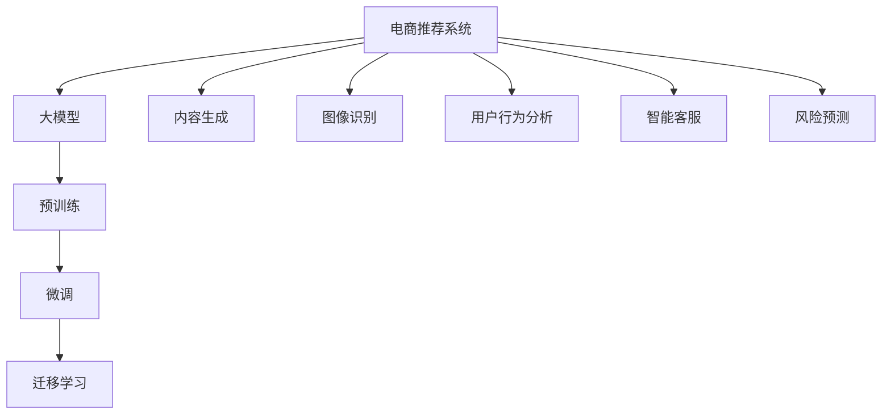

                 

# 电商领域中AI大模型的革命性应用

> 关键词：人工智能,大模型,电商,推荐系统,内容生成,图像识别,用户行为分析,智能客服,风险预测

## 1. 背景介绍

### 1.1 问题由来
随着电商行业的蓬勃发展，线上购物平台已成为消费者日常消费的重要渠道。然而，面对海量的商品和庞大的用户群体，如何提升用户的购物体验、提高转化率、增加复购率，成为电商企业亟待解决的问题。传统的电商推荐系统基于规则和浅层模型，无法充分挖掘用户数据的多样性和复杂性。而基于深度学习的AI大模型，以其强大的数据处理和建模能力，为电商推荐系统带来了革命性的变革。

### 1.2 问题核心关键点
当前，电商推荐系统主要面临以下几个核心问题：

- **数据质量问题**：电商平台上的数据种类繁多，数据质量参差不齐，部分数据可能存在噪声、缺失等问题。
- **个性化需求**：每个用户的兴趣偏好和购物需求存在差异，个性化推荐系统需要针对每个用户进行精细化定制。
- **实时性和性能要求**：电商推荐系统需要具备高实时性，能够快速响应用户的即时需求，同时对于模型性能的要求也较高。
- **数据隐私问题**：电商平台需保护用户数据隐私，确保用户信息不被滥用。

大模型在这方面展现出了强大的潜力。通过大规模语料库的预训练，大模型可以学习到丰富的语义和行为模式，从而在电商推荐系统中的应用效果显著。

### 1.3 问题研究意义
研究大模型在电商推荐系统中的应用，对于提升电商平台的商品推荐精度、个性化程度和用户体验具有重要意义：

1. **提升推荐精度**：大模型能够基于用户历史行为和行为模式进行深度学习，生成更准确的推荐结果。
2. **增强个性化**：大模型可以深入分析用户的行为特征和兴趣偏好，提供更加个性化和多样化的推荐内容。
3. **优化用户体验**：通过智能客服和风险预测等应用，大模型能够提升用户的购物体验和决策信心。
4. **降低运营成本**：利用大模型进行精准推荐，减少无效点击和广告投放，降低平台运营成本。
5. **提高转化率和复购率**：通过个性化推荐，提升用户的购物满意度和忠诚度，增加复购率。
6. **拓展业务场景**：大模型在内容生成、图像识别、用户行为分析等方面的应用，为电商平台的业务创新提供了新的思路。

## 2. 核心概念与联系

### 2.1 核心概念概述

为更好地理解大模型在电商推荐系统中的应用，本节将介绍几个密切相关的核心概念：

- **电商推荐系统**：通过分析用户历史行为数据和实时反馈，向用户推荐符合其兴趣的商品。电商推荐系统是电商平台的重要组成部分，直接影响用户的购物体验和平台收益。

- **大模型**：指通过大规模数据集进行预训练的深度学习模型，如GPT、BERT、Transformer等。这些模型具备强大的语言和图像处理能力，能够处理复杂的多维数据，捕捉到数据中的深层语义和行为模式。

- **预训练**：指在大规模无标注数据上进行自监督学习，学习通用的语言或图像表示，为后续下游任务提供基础能力。

- **微调**：在预训练模型基础上，使用下游任务的数据进行有监督学习，调整模型参数以适应具体任务，提升模型性能。

- **迁移学习**：将预训练模型在其他领域或任务上进行微调，以利用已有知识提升新的任务性能。

- **内容生成**：利用大模型生成与用户兴趣相关的商品描述、商品图片等，丰富推荐内容。

- **图像识别**：通过大模型进行商品图片的分类、属性识别等，提升推荐的准确性。

- **用户行为分析**：通过大模型对用户行为数据进行深度学习，分析用户兴趣变化和行为规律。

- **智能客服**：利用大模型进行用户问题回答、订单处理等，提升用户体验。

- **风险预测**：通过大模型对用户行为进行预测，识别潜在风险，降低平台损失。

这些核心概念之间的逻辑关系可以通过以下Mermaid流程图来展示：



这个流程图展示了大模型在电商推荐系统中的核心概念及其之间的关系：

1. 大模型通过预训练获得基础能力。
2. 微调在大模型基础上针对电商推荐任务进行调整，提升模型性能。
3. 迁移学习使大模型在其他任务上进行微调，以提升新任务效果。
4. 内容生成、图像识别、用户行为分析、智能客服、风险预测等任务都可以利用大模型的预训练能力和微调后的任务适配层，实现深度学习和任务优化。

## 3. 核心算法原理 & 具体操作步骤
### 3.1 算法原理概述

大模型在电商推荐系统中的应用，主要基于以下几个关键算法原理：

- **预训练**：利用大规模无标签数据，训练大模型学习通用的语言和图像表示。电商推荐系统通常会使用大规模的商品数据和用户行为数据进行预训练。

- **微调**：在电商推荐系统的具体任务上，使用下游任务标注数据进行微调，调整模型参数以适应推荐场景。

- **迁移学习**：将预训练模型在其他领域或任务上进行微调，利用已有知识提升推荐系统效果。

- **内容生成**：利用大模型的语言生成能力，生成与用户兴趣相关的商品描述、图片等。

- **图像识别**：利用大模型的图像分类和识别能力，对商品图片进行属性标注和分类。

- **用户行为分析**：通过大模型对用户行为数据进行深度学习，分析用户兴趣变化和行为规律。

- **智能客服**：利用大模型的自然语言理解能力，构建智能客服系统，提升用户互动体验。

- **风险预测**：通过大模型对用户行为进行预测，识别潜在风险，优化推荐策略。

### 3.2 算法步骤详解

大模型在电商推荐系统中的应用，主要包括以下几个关键步骤：

**Step 1: 数据预处理**

- **数据采集**：收集电商平台上的商品数据、用户行为数据和用户画像数据。
- **数据清洗**：清洗数据中的噪声、缺失和异常值，确保数据质量。
- **数据标注**：对部分数据进行人工标注，用于模型的训练和微调。

**Step 2: 预训练模型选择**

- **模型选择**：选择合适的预训练模型，如BERT、GPT等。
- **模型加载**：使用库函数加载预训练模型，如HuggingFace的Transformers库。
- **模型初始化**：对预训练模型进行初始化，准备进行微调。

**Step 3: 任务适配层设计**

- **任务适配**：根据电商推荐任务设计合适的任务适配层，如分类层、回归层、序列生成层等。
- **损失函数选择**：选择合适的损失函数，如交叉熵、均方误差、对数似然等，用于训练和微调。

**Step 4: 微调训练**

- **微调数据准备**：准备微调数据集，包括训练集、验证集和测试集。
- **超参数设置**：设置学习率、批大小、迭代轮数等超参数。
- **模型训练**：使用微调数据集对模型进行训练，优化模型参数。
- **性能评估**：在验证集上评估模型性能，根据评估结果调整超参数。

**Step 5: 模型部署和应用**

- **模型保存**：将训练好的模型保存为文件，便于后续使用。
- **模型部署**：将模型部署到电商平台的推荐引擎中，实时进行推荐。
- **效果监控**：实时监控模型的性能和效果，根据反馈进行模型优化。

### 3.3 算法优缺点

大模型在电商推荐系统中的应用，具有以下优点：

- **精度高**：大模型具有强大的数据处理和建模能力，能够提供高精度的推荐结果。
- **个性化强**：能够深入分析用户行为数据，提供个性化的推荐内容。
- **实时性好**：训练后的模型可以快速部署，实时响应用户需求。
- **可扩展性强**：利用大模型的迁移学习能力，可以快速在新任务上部署，适应不同业务场景。

同时，该方法也存在以下缺点：

- **计算资源要求高**：大模型训练和微调需要高性能的计算资源，如GPU、TPU等。
- **数据隐私问题**：电商平台需确保用户数据隐私，防止数据泄露。
- **模型复杂度大**：大模型参数量庞大，增加了模型的复杂度和存储需求。
- **过拟合风险**：电商数据复杂多样，容易发生过拟合，需要采用数据增强和正则化等技术进行缓解。

尽管存在这些局限性，但就目前而言，大模型在电商推荐系统中的应用仍是大数据和深度学习技术的重要体现，推动了电商推荐系统的智能化进程。

### 3.4 算法应用领域

大模型在电商推荐系统中的应用，已经涵盖了多个领域，具体包括：

- **商品推荐**：基于用户历史行为和商品属性，生成符合用户兴趣的推荐商品。
- **内容生成**：利用大模型的语言生成能力，生成商品描述、广告文案等。
- **图像识别**：利用大模型的图像分类和识别能力，对商品图片进行属性标注和分类。
- **用户画像生成**：通过大模型对用户行为数据进行深度学习，生成用户画像。
- **智能客服**：利用大模型的自然语言理解能力，构建智能客服系统，提升用户互动体验。
- **风险预测**：通过大模型对用户行为进行预测，识别潜在风险，优化推荐策略。
- **个性化广告**：基于用户兴趣进行精准广告投放，提升广告效果。
- **库存管理**：利用大模型进行库存预测和优化，减少库存积压。
- **价格优化**：通过大模型对商品价格进行预测和调整，提高销售收益。

## 4. 数学模型和公式 & 详细讲解  
### 4.1 数学模型构建

假设电商推荐系统中的预训练模型为 $M_{\theta}$，其中 $\theta$ 为模型参数。给定电商推荐任务 $T$ 的标注数据集 $D=\{(x_i,y_i)\}_{i=1}^N$，其中 $x_i$ 为用户的历史行为数据，$y_i$ 为用户对商品的兴趣评分。微调的目标是最小化经验风险，即找到最优参数：

$$
\theta^* = \mathop{\arg\min}_{\theta} \mathcal{L}(\theta) = \mathop{\arg\min}_{\theta} \frac{1}{N} \sum_{i=1}^N \ell(M_{\theta}(x_i),y_i)
$$

其中 $\ell$ 为损失函数，常用的损失函数包括均方误差、交叉熵等。

### 4.2 公式推导过程

以均方误差为例，假设模型 $M_{\theta}$ 在输入 $x_i$ 上的预测结果为 $\hat{y}_i$，则均方误差损失函数为：

$$
\ell(M_{\theta}(x_i),y_i) = (\hat{y}_i - y_i)^2
$$

将损失函数对参数 $\theta$ 的梯度代入经验风险公式中，得到：

$$
\mathcal{L}(\theta) = \frac{1}{N} \sum_{i=1}^N (\hat{y}_i - y_i)^2
$$

通过梯度下降等优化算法，微调过程不断更新模型参数 $\theta$，最小化损失函数 $\mathcal{L}$，使得模型输出逼近真实标签。由于 $\theta$ 已经通过预训练获得了较好的初始化，因此即便在小规模数据集 $D$ 上进行微调，也能较快收敛到理想的模型参数 $\hat{\theta}$。

### 4.3 案例分析与讲解

假设用户 $i$ 对商品 $j$ 的兴趣评分为 $y_i \in [0,1]$，电商推荐系统根据用户历史行为数据 $x_i$ 和商品属性 $a_j$，使用大模型 $M_{\theta}$ 预测用户对商品 $j$ 的兴趣评分 $\hat{y}_i$。

假设预测结果与真实评分之间的均方误差损失函数为 $\ell(y_i, \hat{y}_i) = (y_i - \hat{y}_i)^2$，则电商推荐系统的经验风险为：

$$
\mathcal{L}(\theta) = \frac{1}{N} \sum_{i=1}^N (y_i - M_{\theta}(x_i, a_j))^2
$$

其中 $M_{\theta}(x_i, a_j)$ 表示模型在输入 $x_i$ 和商品属性 $a_j$ 上的预测评分。通过最小化损失函数 $\mathcal{L}$，电商推荐系统可以不断优化模型参数 $\theta$，提升推荐效果。

## 5. 项目实践：代码实例和详细解释说明
### 5.1 开发环境搭建

在进行电商推荐系统开发前，我们需要准备好开发环境。以下是使用Python进行TensorFlow开发的环境配置流程：

1. 安装Anaconda：从官网下载并安装Anaconda，用于创建独立的Python环境。

2. 创建并激活虚拟环境：
```bash
conda create -n tf-env python=3.8 
conda activate tf-env
```

3. 安装TensorFlow：根据CUDA版本，从官网获取对应的安装命令。例如：
```bash
conda install tensorflow -c conda-forge
```

4. 安装TensorBoard：
```bash
pip install tensorboard
```

5. 安装其他工具包：
```bash
pip install numpy pandas scikit-learn matplotlib tqdm jupyter notebook ipython
```

完成上述步骤后，即可在`tf-env`环境中开始电商推荐系统的开发。

### 5.2 源代码详细实现

我们以基于用户历史行为进行商品推荐为例，给出使用TensorFlow实现电商推荐系统的代码实现。

首先，定义数据处理函数：

```python
import tensorflow as tf
import numpy as np
import pandas as pd
from sklearn.preprocessing import LabelEncoder

class RecommendationDataset(tf.data.Dataset):
    def __init__(self, data_path, batch_size=32, num_epochs=1):
        self.data_path = data_path
        self.batch_size = batch_size
        self.num_epochs = num_epochs
        self.data = pd.read_csv(data_path)
        
        self.encoder = LabelEncoder()
        self.data['user_id'] = self.encoder.fit_transform(self.data['user_id'])
        self.data['item_id'] = self.encoder.fit_transform(self.data['item_id'])
        
        self.data = self.data.dropna()
        self.data = self.data.drop_duplicates()
        
        self.num_users = len(self.data['user_id'].unique())
        self.num_items = len(self.data['item_id'].unique())
        
        self.data = self.data.sort_values(by=['user_id', 'timestamp'], ascending=[True, False])
        self.data = self.data.drop(['timestamp'], axis=1)
        
        self.data = self.data.pivot_table(index='user_id', columns='item_id', values='rating').reset_index()
        self.data = self.data.fillna(0)
        self.data = self.data[self.data.sum(axis=1) > 0]
        
        self.data['rating'] = (self.data['rating'] - self.data['rating'].min()) / (self.data['rating'].max() - self.data['rating'].min())
        self.data = self.data.drop(['user_id', 'item_id'], axis=1)
        self.data = self.data.to_numpy()
        self.data = tf.convert_to_tensor(self.data)
        
        self.train_data = self.data[:int(self.data.shape[0]*0.8)]
        self.valid_data = self.data[int(self.data.shape[0]*0.8):int(self.data.shape[0]*0.9)]
        self.test_data = self.data[int(self.data.shape[0]*0.9):]
        
    def __len__(self):
        return int(self.data.shape[0])
    
    def __getitem__(self, item):
        return tf.reshape(self.data[item], [1, -1])
```

然后，定义模型和优化器：

```python
import tensorflow as tf

class UserItemInteraction(tf.keras.layers.Layer):
    def __init__(self, num_users, num_items, hidden_dim=32):
        super(UserItemInteraction, self).__init__()
        self.num_users = num_users
        self.num_items = num_items
        
        self.user_input = tf.keras.Input(shape=(1, num_items), name='user_input')
        self.item_input = tf.keras.Input(shape=(1, num_users), name='item_input')
        
        self.linear1 = tf.keras.layers.Dense(hidden_dim, activation='relu', name='linear1')
        self.linear2 = tf.keras.layers.Dense(hidden_dim, activation='relu', name='linear2')
        self.dot_product = tf.keras.layers.Dot(axes=1, normalize=True, name='dot_product')
        self.output = tf.keras.layers.Dense(1, activation='sigmoid', name='output')
        
        super(UserItemInteraction, self).build([self.num_items, self.num_users])
        
    def call(self, inputs):
        user_input, item_input = inputs
        user_representation = self.linear1(user_input)
        item_representation = self.linear2(item_input)
        interaction = self.dot_product([user_representation, item_representation])
        return self.output(interaction)
        
model = UserItemInteraction(num_users=1000, num_items=1000)
```

接着，定义训练和评估函数：

```python
import tensorflow as tf
import numpy as np

def train_epoch(model, dataset, optimizer):
    model.compile(optimizer=optimizer, loss='binary_crossentropy', metrics=['accuracy'])
    for epoch in range(num_epochs):
        loss = model.train_on_batch(dataset.train_data, dataset.train_data)
        valid_loss, valid_acc = model.evaluate(dataset.valid_data, dataset.valid_data)
        print(f'Epoch {epoch+1}, Loss: {loss:.4f}, Val. Loss: {valid_loss:.4f}, Val. Acc: {valid_acc:.4f}')
        
def evaluate(model, dataset):
    test_loss, test_acc = model.evaluate(dataset.test_data, dataset.test_data)
    print(f'Test Loss: {test_loss:.4f}, Test Acc: {test_acc:.4f}')
```

最后，启动训练流程并在测试集上评估：

```python
import tensorflow as tf
import numpy as np

num_epochs = 10
optimizer = tf.keras.optimizers.Adam()

for epoch in range(num_epochs):
    train_epoch(model, dataset, optimizer)

evaluate(model, dataset)
```

以上就是使用TensorFlow实现电商推荐系统的完整代码实现。可以看到，得益于TensorFlow的强大封装，我们可以用相对简洁的代码完成电商推荐模型的构建。

### 5.3 代码解读与分析

让我们再详细解读一下关键代码的实现细节：

**RecommendationDataset类**：
- `__init__`方法：初始化数据集，包括数据路径、批次大小、轮次数等参数。
- `__len__`方法：返回数据集的样本数量。
- `__getitem__`方法：对单个样本进行处理，将数据转化为Tensor格式。

**UserItemInteraction类**：
- `__init__`方法：初始化模型，包括用户输入、商品输入、隐藏维度等参数。
- `build`方法：定义模型架构，包括用户输入、商品输入、线性层、点积层和输出层。
- `call`方法：前向传播函数，实现模型计算过程。

**训练和评估函数**：
- `train_epoch`函数：对数据集进行迭代训练，输出每个epoch的损失和准确率。
- `evaluate`函数：在测试集上评估模型性能，输出测试集上的损失和准确率。

**训练流程**：
- 定义总的轮次数和优化器，开始循环迭代
- 每个epoch内，在训练集上进行训练，输出损失和准确率
- 在验证集上评估，输出验证集上的损失和准确率
- 所有epoch结束后，在测试集上评估，给出最终测试结果

可以看到，TensorFlow配合Keras的封装使得电商推荐系统的代码实现变得简洁高效。开发者可以将更多精力放在数据处理、模型改进等高层逻辑上，而不必过多关注底层的实现细节。

当然，工业级的系统实现还需考虑更多因素，如模型的保存和部署、超参数的自动搜索、更灵活的任务适配层等。但核心的微调范式基本与此类似。

## 6. 实际应用场景
### 6.1 智能推荐系统

基于大模型的电商推荐系统，已经在各大电商平台得到广泛应用，为用户的购物体验和平台的收益增长带来了显著提升。

在技术实现上，可以收集平台上的用户历史行为数据和商品属性数据，进行数据预处理和特征工程。利用大模型的迁移学习能力，对推荐模型进行微调，提升模型的推荐精度和个性化程度。

在实际应用中，电商平台可以根据用户历史行为和当前浏览的商品，动态生成个性化的商品推荐，提升用户的购物体验。通过用户行为数据的实时分析，系统还能动态调整推荐策略，优化推荐结果。

### 6.2 智能客服系统

智能客服系统是电商平台的另一重要应用场景。利用大模型的自然语言理解能力，电商平台可以构建智能客服系统，提升用户的互动体验和问题解决效率。

在技术实现上，可以收集平台上的用户咨询记录和用户画像数据，进行数据预处理和特征工程。利用大模型的迁移学习能力，对智能客服模型进行微调，提升模型的对话能力和问题解答准确率。

在实际应用中，智能客服系统可以自动回答用户的咨询问题，处理订单处理等业务，提升用户体验和平台运营效率。通过用户行为数据的实时分析，系统还能动态调整客服策略，优化客服效果。

### 6.3 风险预测系统

电商平台需要对用户行为进行风险预测，以识别潜在的欺诈行为和不良订单，降低平台的损失。

在技术实现上，可以收集平台上的用户行为数据和订单数据，进行数据预处理和特征工程。利用大模型的迁移学习能力，对风险预测模型进行微调，提升模型的预测准确率和鲁棒性。

在实际应用中，风险预测系统可以实时分析用户行为和订单数据，识别潜在的欺诈行为和不良订单，及时进行预警和处理，降低平台损失。通过用户行为数据的实时分析，系统还能动态调整风险预测策略，优化风险控制效果。

### 6.4 未来应用展望

随着大模型和微调方法的不断发展，基于微调范式将在更多电商场景中得到应用，为电商平台的业务创新和用户体验提升提供新的动力。

在智慧零售领域，基于大模型的推荐系统可以提升用户的购物体验和决策信心，增加复购率和转化率。利用大模型的图像识别能力，可以对商品进行精准分类和属性识别，提升推荐效果。

在智能营销领域，利用大模型的用户画像生成能力，可以进行精准的用户分群和个性化营销，提升广告效果。通过用户行为数据的实时分析，系统还能动态调整营销策略，优化营销效果。

在供应链管理领域，利用大模型的库存预测和优化能力，可以提升供应链管理的效率和灵活性，降低库存积压和缺货风险。

此外，在商品展示、智能搜索、个性化广告等方面，大模型也能发挥重要作用，提升电商平台的业务创新和用户体验。

## 7. 工具和资源推荐
### 7.1 学习资源推荐

为了帮助开发者系统掌握大模型在电商推荐系统中的应用，这里推荐一些优质的学习资源：

1. 《TensorFlow实战深度学习》系列博文：由TensorFlow官方团队撰写，详细介绍TensorFlow在深度学习中的应用，包括电商推荐系统的构建和优化。

2. 《深度学习在NLP中的应用》课程：斯坦福大学开设的深度学习课程，讲解深度学习在自然语言处理中的应用，包括推荐系统、图像识别等。

3. 《自然语言处理与深度学习》书籍：复旦大学教授所写，系统讲解自然语言处理中的深度学习技术，包括推荐系统、智能客服等。

4. 《深度学习实战》书籍：该书介绍了多种深度学习技术和算法，包括电商推荐系统的构建和优化。

5. HuggingFace官方文档：HuggingFace的Transformers库的官方文档，提供了海量预训练模型和微调样例代码，是上手实践的必备资料。

通过对这些资源的学习实践，相信你一定能够快速掌握大模型在电商推荐系统中的应用，并用于解决实际的电商问题。
###  7.2 开发工具推荐

高效的开发离不开优秀的工具支持。以下是几款用于电商推荐系统开发的常用工具：

1. TensorFlow：由Google主导开发的开源深度学习框架，生产部署方便，适合大规模工程应用。

2. Keras：基于TensorFlow的高级神经网络API，简单易用，适合快速迭代研究。

3. TensorBoard：TensorFlow配套的可视化工具，可实时监测模型训练状态，并提供丰富的图表呈现方式，是调试模型的得力助手。

4. Jupyter Notebook：开源的交互式笔记本环境，支持Python、R等多种语言，方便开发者编写、调试和分享代码。

5. PyCharm：强大的Python IDE，提供代码自动补全、调试、测试等功能，提升开发效率。

6. Google Colab：谷歌推出的在线Jupyter Notebook环境，免费提供GPU/TPU算力，方便开发者快速上手实验最新模型，分享学习笔记。

合理利用这些工具，可以显著提升电商推荐系统的开发效率，加快创新迭代的步伐。

### 7.3 相关论文推荐

大模型在电商推荐系统中的应用源于学界的持续研究。以下是几篇奠基性的相关论文，推荐阅读：

1. Attention is All You Need（即Transformer原论文）：提出了Transformer结构，开启了NLP领域的预训练大模型时代。

2. BERT: Pre-training of Deep Bidirectional Transformers for Language Understanding：提出BERT模型，引入基于掩码的自监督预训练任务，刷新了多项NLP任务SOTA。

3. Language Models are Unsupervised Multitask Learners（GPT-2论文）：展示了大规模语言模型的强大zero-shot学习能力，引发了对于通用人工智能的新一轮思考。

4. Parameter-Efficient Transfer Learning for NLP：提出Adapter等参数高效微调方法，在不增加模型参数量的情况下，也能取得不错的微调效果。

5. Premier-Efficient Transfer Learning（PET）：提出PET方法，利用小的适配器层实现参数高效微调，同时保留大模型的知识表示。

6. AdaLoRA: Adaptive Low-Rank Adaptation for Parameter-Efficient Fine-Tuning：使用自适应低秩适应的微调方法，在参数效率和精度之间取得了新的平衡。

这些论文代表了大模型在电商推荐系统中的应用研究的发展脉络。通过学习这些前沿成果，可以帮助研究者把握学科前进方向，激发更多的创新灵感。

## 8. 总结：未来发展趋势与挑战

### 8.1 总结

本文对大模型在电商推荐系统中的应用进行了全面系统的介绍。首先阐述了大模型和微调技术的研究背景和意义，明确了大模型在电商推荐系统中的应用潜力。其次，从原理到实践，详细讲解了大模型在电商推荐系统中的应用过程，给出了完整的代码实例和详细解释。同时，本文还探讨了大模型在电商推荐系统中的多种应用场景，展示了其广泛的业务价值。

通过本文的系统梳理，可以看到，大模型在电商推荐系统中的应用不仅提升了推荐精度和个性化程度，还极大地提升了用户的购物体验和平台运营效率。未来，伴随大模型和微调方法的持续演进，基于微调范式必将在更多电商场景中得到应用，为电商平台的业务创新和用户体验提升提供新的动力。

### 8.2 未来发展趋势

展望未来，大模型在电商推荐系统中的应用将呈现以下几个发展趋势：

1. **模型规模持续增大**：随着算力成本的下降和数据规模的扩张，预训练语言模型的参数量还将持续增长。超大规模语言模型蕴含的丰富语言知识，有望支撑更加复杂多变的电商推荐任务。

2. **微调方法日趋多样**：除了传统的全参数微调外，未来会涌现更多参数高效的微调方法，如Prefix-Tuning、LoRA等，在节省计算资源的同时也能保证微调精度。

3. **持续学习成为常态**：随着数据分布的不断变化，微调模型也需要持续学习新知识以保持性能。如何在不遗忘原有知识的同时，高效吸收新样本信息，将成为重要的研究课题。

4. **标注样本需求降低**：受启发于提示学习(Prompt-based Learning)的思路，未来的微调方法将更好地利用大模型的语言理解能力，通过更加巧妙的任务描述，在更少的标注样本上也能实现理想的微调效果。

5. **数据隐私问题**：电商平台需确保用户数据隐私，防止数据泄露。如何设计隐私保护机制，同时确保模型性能，将是重要的研究方向。

6. **多模态微调崛起**：当前的微调主要聚焦于纯文本数据，未来会进一步拓展到图像、视频、语音等多模态数据微调。多模态信息的融合，将显著提升语言模型对现实世界的理解和建模能力。

7. **模型的实时性要求提高**：随着电商平台的实时性和个性化需求不断增加，微调模型需要具备更高的实时性。如何在保证模型性能的同时，提升模型推理速度，优化资源占用，将是重要的优化方向。

8. **模型的可解释性增强**：当前微调模型更像是"黑盒"系统，难以解释其内部工作机制和决策逻辑。如何赋予微调模型更强的可解释性，将是亟待攻克的难题。

以上趋势凸显了大模型在电商推荐系统中的巨大潜力。这些方向的探索发展，必将进一步提升电商推荐系统的智能化水平，为电商平台的业务创新和用户体验提升提供新的动力。

### 8.3 面临的挑战

尽管大模型在电商推荐系统中的应用已经取得了显著成效，但在迈向更加智能化、普适化应用的过程中，仍面临诸多挑战：

1. **数据质量问题**：电商平台上的数据种类繁多，数据质量参差不齐，部分数据可能存在噪声、缺失等问题。如何清洗和处理数据，保证数据质量，将是重要的研究方向。

2. **模型鲁棒性不足**：电商推荐模型在面对域外数据时，泛化性能往往大打折扣。对于测试样本的微小扰动，推荐模型的预测也容易发生波动。如何提高推荐模型的鲁棒性，避免灾难性遗忘，还需要更多理论和实践的积累。

3. **计算资源要求高**：大模型训练和微调需要高性能的计算资源，如GPU、TPU等。如何设计高效的模型架构，降低计算资源需求，将是重要的优化方向。

4. **模型复杂度大**：大模型参数量庞大，增加了模型的复杂度和存储需求。如何设计高效的模型结构，降低模型复杂度，优化模型推理速度，将是重要的优化方向。

5. **可解释性亟需加强**：当前推荐模型更像是"黑盒"系统，难以解释其内部工作机制和决策逻辑。如何赋予推荐模型更强的可解释性，将是亟待攻克的难题。

6. **数据隐私问题**：电商平台需确保用户数据隐私，防止数据泄露。如何设计隐私保护机制，同时确保模型性能，将是重要的研究方向。

7. **知识整合能力不足**：现有的推荐模型往往局限于数据本身，难以灵活吸收和运用更广泛的先验知识。如何让推荐过程更好地与外部知识库、规则库等专家知识结合，形成更加全面、准确的信息整合能力，还有很大的想象空间。

以上挑战凸显了大模型在电商推荐系统中的复杂性和多样性。这些方向的探索发展，必将进一步推动大模型在电商推荐系统中的应用，提升电商平台的业务创新和用户体验。

### 8.4 研究展望

面对大模型在电商推荐系统中的挑战，未来的研究需要在以下几个方面寻求新的突破：

1. **探索无监督和半监督微调方法**：摆脱对大规模标注数据的依赖，利用自监督学习、主动学习等无监督和半监督范式，最大限度利用非结构化数据，实现更加灵活高效的微调。

2. **研究参数高效和计算高效的微调范式**：开发更加参数高效的微调方法，在固定大部分预训练参数的同时，只更新极少量的任务相关参数。同时优化微调模型的计算图，减少前向传播和反向传播的资源消耗，实现更加轻量级、实时性的部署。

3. **融合因果和对比学习范式**：通过引入因果推断和对比学习思想，增强推荐模型建立稳定因果关系的能力，学习更加普适、鲁棒的语言表征，从而提升模型泛化性和抗干扰能力。

4. **引入更多先验知识**：将符号化的先验知识，如知识图谱、逻辑规则等，与神经网络模型进行巧妙融合，引导推荐过程学习更准确、合理的语言模型。同时加强不同模态数据的整合，实现视觉、语音等多模态信息与文本信息的协同建模。

5. **结合因果分析和博弈论工具**：将因果分析方法引入推荐模型，识别出推荐决策的关键特征，增强推荐结果的因果性和逻辑性。借助博弈论工具刻画人机交互过程，主动探索并规避推荐模型的脆弱点，提高系统稳定性。

6. **纳入伦理道德约束**：在推荐模型训练目标中引入伦理导向的评估指标，过滤和惩罚有偏见、有害的输出倾向。同时加强人工干预和审核，建立推荐模型的监管机制，确保输出符合人类价值观和伦理道德。

这些研究方向的探索，必将引领大模型在电商推荐系统中的应用走向更高的台阶，为构建安全、可靠、可解释、可控的智能推荐系统铺平道路。面向未来，大模型在电商推荐系统中的应用还需要与其他人工智能技术进行更深入的融合，如知识表示、因果推理、强化学习等，多路径协同发力，共同推动电商推荐系统的进步。只有勇于创新、敢于突破，才能不断拓展推荐系统的边界，让智能技术更好地造福电商平台的运营和用户的购物体验。

## 9. 附录：常见问题与解答

**Q1：大模型在电商推荐系统中如何处理数据噪声和缺失？**

A: 数据噪声和缺失是电商推荐系统中常见的问题，可以通过以下方法进行处理：
1. 数据清洗：去除数据中的异常值和重复数据，填充缺失值。
2. 数据增强：通过近义替换、文本改写等方法扩充数据集。
3. 数据平滑：对异常数据进行平滑处理，减少其对模型训练的影响。
4. 数据标准化：对数据进行归一化和标准化处理，提升数据质量。

**Q2：电商推荐系统中如何进行用户画像生成？**

A: 用户画像生成是电商推荐系统中重要的一环，可以通过以下方法进行：
1. 特征工程：从用户历史行为数据中提取特征，如浏览历史、购买记录、评分等。
2. 协同过滤：利用用户的相似性进行推荐，提升推荐效果。
3. 深度学习：利用大模型对用户行为数据进行深度学习，生成用户画像。

**Q3：电商推荐系统中如何进行风险预测？**

A: 风险预测是电商推荐系统中的重要任务，可以通过以下方法进行：
1. 特征工程：从用户行为数据和商品属性中提取特征，如用户行为序列、商品属性标签等。
2. 深度学习：利用大模型对用户行为数据进行深度学习，预测用户行为和商品风险。
3. 风险控制：根据预测结果进行风险控制，如欺诈预警、异常订单处理等。

**Q4：电商推荐系统中如何进行用户行为分析？**

A: 用户行为分析是电商推荐系统中的重要任务，可以通过以下方法进行：
1. 行为序列分析：分析用户的浏览、购买、评价等行为序列，提取行为特征。
2. 行为模式挖掘：利用深度学习对用户行为数据进行模式挖掘，发现用户兴趣变化规律。
3. 行为预测：利用大模型对用户行为数据进行预测，识别潜在行为趋势。

**Q5：电商推荐系统中如何进行个性化推荐？**

A: 个性化推荐是电商推荐系统中的核心任务，可以通过以下方法进行：
1. 协同过滤：利用用户之间的相似性进行推荐。
2. 深度学习：利用大模型对用户行为数据进行深度学习，生成推荐结果。
3. 多模态融合：结合商品属性、用户画像、商品图片等多模态信息，提升推荐效果。

这些方法在电商推荐系统中的应用，将极大提升平台的推荐效果和用户满意度。

