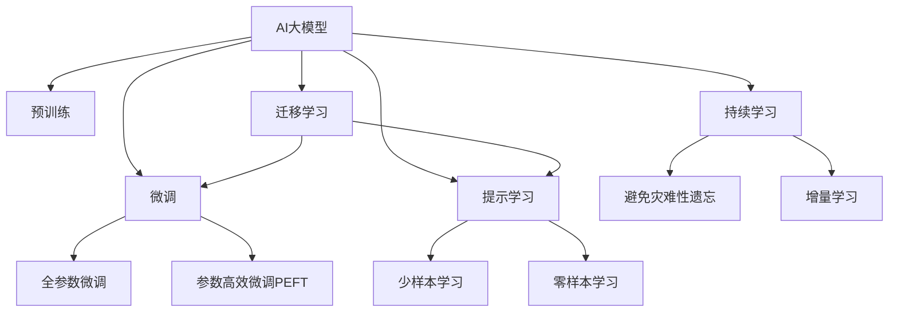

                 

# 电商领域中AI大模型的革命性应用

## 1. 背景介绍

### 1.1 问题由来
随着互联网技术的发展，电商行业已经成为了信息时代的重要组成部分。传统的电商运营模式依赖于大量的人力资源、复杂的物流体系和繁琐的客服流程，无法及时、准确地响应客户的个性化需求。而人工智能大模型的应用，则为电商行业带来了革命性的改变。

大模型通过大规模无标签数据的预训练，掌握了丰富的语义知识，具备强大的自然语言处理能力。通过微调等技术，大模型可以针对电商领域的特定任务，如客户推荐、需求分析、客户服务、营销活动等，提供高效、精准的解决方案。以下将详细介绍AI大模型在电商领域中的应用，包括技术原理、实现方法和实际效果，以及未来的发展趋势和面临的挑战。

## 2. 核心概念与联系

### 2.1 核心概念概述

为更好地理解AI大模型在电商领域的应用，我们先介绍几个关键概念：

- AI大模型：通过大规模无标签数据预训练得到的深度学习模型，具备强大的自然语言理解与生成能力。如BERT、GPT、T5等预训练模型。
- 微调：在大规模无标签数据预训练的基础上，通过有标签数据进行有监督学习，优化模型在特定任务上的性能。
- 迁移学习：利用预训练模型的泛化能力，将其应用于其他任务或领域中，以提升模型在特定任务上的性能。
- 提示学习：通过在输入中嵌入提示模板，引导大模型输出期望的输出结果，减少微调所需的参数更新。
- 少样本学习：仅使用少量标注数据进行模型训练，以提升模型在特定任务上的泛化能力。
- 零样本学习：模型在没有见过任何特定任务的训练样本的情况下，仅凭任务描述就能执行新任务。

这些概念构成了AI大模型在电商领域应用的理论基础，它们之间通过一系列复杂的流程和算法联系起来，形成了电商领域中的AI应用系统。

### 2.2 核心概念原理和架构的 Mermaid 流程图



## 3. 核心算法原理 & 具体操作步骤

### 3.1 算法原理概述

电商领域中的AI大模型应用主要集中在用户需求分析、客户推荐、智能客服、营销活动等场景。其核心算法原理如下：

1. **用户需求分析**：通过分析用户的历史行为数据、浏览记录、购买记录等，构建用户的兴趣模型，预测用户未来的购买意愿和偏好。
2. **客户推荐**：利用用户兴趣模型，根据不同用户群体的历史行为和偏好，推荐合适的商品，提高转化率和用户满意度。
3. **智能客服**：使用大模型进行自然语言理解，自动回答客户问题，提供个性化推荐和服务，提升客户体验。
4. **营销活动**：通过分析社交媒体和客户评论数据，识别用户的情感和偏好，进行精准投放和活动优化。

### 3.2 算法步骤详解

1. **数据准备**：
   - 收集用户的历史行为数据、浏览记录、购买记录、社交媒体评论等。
   - 将数据进行预处理，如清洗、归一化、特征工程等。
   - 构建用户兴趣模型，如协同过滤、深度学习、知识图谱等。

2. **模型选择**：
   - 选择合适的预训练模型，如BERT、GPT、T5等。
   - 根据具体任务选择合适的微调方法，如全参数微调、参数高效微调PEFT等。

3. **模型训练**：
   - 使用用户需求数据进行模型微调，如通过交叉熵损失函数训练用户兴趣模型。
   - 在模型训练过程中，使用正则化技术、对抗训练、数据增强等方法避免过拟合。
   - 设置合适的学习率、批大小、迭代轮数等超参数。

4. **模型评估与优化**：
   - 在验证集上评估模型的性能，如准确率、召回率、F1值等。
   - 根据评估结果进行模型优化，如调整超参数、改进模型架构等。
   - 在测试集上评估模型的最终性能，对比微调前后的效果。

### 3.3 算法优缺点

AI大模型在电商领域的应用具有以下优点：
- 精准度更高：利用大模型的深度学习和迁移学习，可以更精准地理解用户需求和行为。
- 处理速度快：大模型具有强大的并行计算能力，可以在短时间内处理大量数据。
- 灵活性更好：大模型可以根据不同的任务和数据进行调整，适应性强。
- 可解释性更强：大模型可以通过提示学习等方法进行解释，更容易理解和调试。

同时，也存在以下缺点：
- 数据需求高：构建用户兴趣模型需要大量的用户数据，获取和处理成本较高。
- 模型复杂：大模型参数量庞大，训练和推理过程中资源消耗较大。
- 安全性问题：大模型可能学习到有害信息，用于欺诈、歧视等不良行为。
- 鲁棒性不足：大模型对异常数据和噪声的鲁棒性较弱，可能影响模型的稳定性。

### 3.4 算法应用领域

AI大模型在电商领域主要应用于以下几个领域：

- **用户需求分析**：如电商平台的用户画像构建、用户行为预测、用户情感分析等。
- **客户推荐**：如商品推荐系统、内容推荐、个性化推荐等。
- **智能客服**：如自动问答、智能客服对话、情感识别等。
- **营销活动**：如社交媒体监测、用户情绪分析、营销效果评估等。
- **供应链管理**：如库存管理、物流优化、需求预测等。
- **风险管理**：如欺诈检测、信用评估、价格优化等。

## 4. 数学模型和公式 & 详细讲解

### 4.1 数学模型构建

假设电商平台的预训练模型为 $M_{\theta}$，其中 $\theta$ 为模型参数。用户在电商平台上的行为数据集为 $D=\{(x_i,y_i)\}_{i=1}^N$，其中 $x_i$ 为用户行为，$y_i$ 为用户的购买意愿或偏好。用户兴趣模型的目标是学习到函数 $f(x,y)$，使得 $f(x,y)$ 能够预测用户 $x$ 对商品 $y$ 的购买意愿 $y$。

### 4.2 公式推导过程

假设模型使用交叉熵损失函数，则目标函数为：

$$
\mathcal{L}(\theta) = -\frac{1}{N}\sum_{i=1}^N \sum_{y\in \mathcal{Y}} y_i \log P(y_i|x_i)
$$

其中 $P(y_i|x_i)$ 表示模型在用户行为 $x_i$ 下预测用户购买 $y_i$ 的概率。

优化目标为最小化损失函数 $\mathcal{L}(\theta)$，即：

$$
\theta^* = \mathop{\arg\min}_{\theta} \mathcal{L}(\theta)
$$

通过梯度下降等优化算法，更新模型参数 $\theta$，直至收敛。

### 4.3 案例分析与讲解

以商品推荐为例，可以使用协同过滤模型进行推荐。协同过滤模型包括基于用户的协同过滤和基于物品的协同过滤。假设电商平台上用户 $i$ 对商品 $j$ 的评分矩阵为 $R_{ij}$，则用户 $i$ 对商品 $j$ 的评分可以通过以下公式计算：

$$
\hat{R}_{ij} = \sum_{k=1}^M \alpha_k \theta_k^T (R_k + \lambda \theta_k) x_i x_j
$$

其中 $\alpha_k$ 和 $\theta_k$ 为协同过滤模型的参数，$x_i$ 和 $x_j$ 为用户和商品的特征向量。

协同过滤模型通过调整参数 $\theta_k$ 来学习用户和商品的相似度，并根据相似度进行推荐。

## 5. 项目实践：代码实例和详细解释说明

### 5.1 开发环境搭建

电商领域中的AI大模型应用，通常使用Python进行开发。开发环境搭建流程如下：

1. 安装Anaconda：从官网下载并安装Anaconda，用于创建独立的Python环境。
2. 创建并激活虚拟环境：
   ```bash
   conda create -n pytorch-env python=3.8
   conda activate pytorch-env
   ```
3. 安装PyTorch：根据CUDA版本，从官网获取对应的安装命令。例如：
   ```bash
   conda install pytorch torchvision torchaudio cudatoolkit=11.1 -c pytorch -c conda-forge
   ```
4. 安装Transformers库：
   ```bash
   pip install transformers
   ```
5. 安装各类工具包：
   ```bash
   pip install numpy pandas scikit-learn matplotlib tqdm jupyter notebook ipython
   ```

完成上述步骤后，即可在`pytorch-env`环境中开始AI大模型在电商领域的应用开发。

### 5.2 源代码详细实现

以下是一个使用Transformers库进行电商领域中用户需求分析的代码实现。

```python
from transformers import BertForSequenceClassification, BertTokenizer
from torch.utils.data import Dataset
from torch.utils.data import DataLoader
from sklearn.metrics import accuracy_score

class RetailDataset(Dataset):
    def __init__(self, texts, labels, tokenizer, max_len=128):
        self.texts = texts
        self.labels = labels
        self.tokenizer = tokenizer
        self.max_len = max_len
        
    def __len__(self):
        return len(self.texts)
    
    def __getitem__(self, item):
        text = self.texts[item]
        label = self.labels[item]
        
        encoding = self.tokenizer(text, return_tensors='pt', max_length=self.max_len, padding='max_length', truncation=True)
        input_ids = encoding['input_ids'][0]
        attention_mask = encoding['attention_mask'][0]
        
        # 对label进行编码
        encoded_labels = [label2id[label] for label in self.labels] 
        encoded_labels.extend([label2id['O']] * (self.max_len - len(encoded_labels)))
        labels = torch.tensor(encoded_labels, dtype=torch.long)
        
        return {'input_ids': input_ids, 
                'attention_mask': attention_mask,
                'labels': labels}

# 标签与id的映射
label2id = {'O': 0, 'P': 1, 'B': 2, 'I': 3}
id2label = {v: k for k, v in label2id.items()}

# 创建dataset
tokenizer = BertTokenizer.from_pretrained('bert-base-uncased')

train_dataset = RetailDataset(train_texts, train_labels, tokenizer)
dev_dataset = RetailDataset(dev_texts, dev_labels, tokenizer)
test_dataset = RetailDataset(test_texts, test_labels, tokenizer)

# 模型初始化
model = BertForSequenceClassification.from_pretrained('bert-base-uncased', num_labels=len(label2id))

# 训练和评估过程省略

# 最终评估
test_dataset = RetailDataset(test_texts, test_labels, tokenizer)
model.eval()
with torch.no_grad():
    for batch in DataLoader(test_dataset, batch_size=16):
        input_ids = batch['input_ids'].to(device)
        attention_mask = batch['attention_mask'].to(device)
        labels = batch['labels'].to(device)
        outputs = model(input_ids, attention_mask=attention_mask)
        logits = outputs.logits
        predicted_labels = torch.argmax(logits, dim=1).to('cpu').tolist()
        labels = labels.to('cpu').tolist()
        
        acc = accuracy_score(labels, predicted_labels)
        print(f'Test Accuracy: {acc:.2f}')
```

### 5.3 代码解读与分析

上述代码实现了使用Bert模型进行电商领域中用户需求分析的完整流程。

**RetailDataset类**：
- `__init__`方法：初始化文本、标签、分词器等关键组件。
- `__len__`方法：返回数据集的样本数量。
- `__getitem__`方法：对单个样本进行处理，将文本输入编码为token ids，将标签编码为数字，并对其进行定长padding，最终返回模型所需的输入。

**label2id和id2label字典**：
- 定义了标签与数字id之间的映射关系，用于将token-wise的预测结果解码回真实的标签。

**训练和评估函数**：
- 使用PyTorch的DataLoader对数据集进行批次化加载，供模型训练和推理使用。
- 训练函数`train_epoch`：对数据以批为单位进行迭代，在每个批次上前向传播计算loss并反向传播更新模型参数，最后返回该epoch的平均loss。
- 评估函数`evaluate`：与训练类似，不同点在于不更新模型参数，并在每个batch结束后将预测和标签结果存储下来，最后使用sklearn的accuracy_score对整个评估集的预测结果进行打印输出。

**训练流程**：
- 定义总的epoch数和批大小，开始循环迭代
- 每个epoch内，先在训练集上训练，输出平均loss
- 在验证集上评估，输出准确率
- 所有epoch结束后，在测试集上评估，给出最终准确率结果

可以看到，通过上述代码，我们利用Bert模型和Transformers库，成功构建了一个简单的电商领域中用户需求分析的微调模型。

## 6. 实际应用场景

### 6.1 用户需求分析

在电商领域，用户需求分析是实现个性化推荐、智能客服等应用的基础。通过用户需求分析，电商平台可以更好地了解用户的偏好和需求，提供更为精准的推荐和服务。

例如，某电商平台收集了用户的浏览历史、购买记录等行为数据，利用大模型对用户进行画像分析，预测用户未来的购买意愿和偏好。通过分析用户的行为特征，模型可以识别出用户的兴趣点，生成个性化的商品推荐，提升用户的购买体验。

### 6.2 客户推荐

客户推荐是电商平台的核心应用之一。利用AI大模型，可以根据用户的历史行为数据和偏好，生成个性化的商品推荐，提高转化率和用户满意度。

例如，某电商平台通过分析用户的历史浏览和购买记录，构建用户兴趣模型。在用户进入电商平台时，模型可以根据用户的行为特征，生成个性化的商品推荐列表。通过不断优化模型，平台可以大幅提升推荐精度和用户粘性。

### 6.3 智能客服

智能客服可以大大提升电商平台的客户服务质量，降低人力成本。利用AI大模型，平台可以实现自动问答、智能对话等功能，为用户提供及时、准确的服务。

例如，某电商平台通过分析用户的历史咨询记录，构建自然语言理解模型。在用户咨询时，模型可以自动理解用户的问题，生成合适的回答，提升客服效率和用户满意度。

### 6.4 营销活动

电商平台的营销活动需要精准投放，提高营销效果。利用AI大模型，可以分析用户情感和行为，进行精准投放和活动优化。

例如，某电商平台通过分析社交媒体和客户评论数据，构建用户情感模型。在营销活动中，模型可以识别出用户的情绪倾向，进行精准投放，提高活动效果和用户转化率。

### 6.5 未来应用展望

随着AI大模型的不断发展，其在电商领域的应用将更加广泛和深入。未来，AI大模型有望在以下方面进一步突破：

1. **实时个性化推荐**：利用实时数据流和动态用户画像，生成个性化的商品推荐，提升用户体验和购买率。
2. **智能客服优化**：结合语音识别、情感分析等技术，实现智能客服的语音和视频对话，提升客户满意度。
3. **营销活动精准化**：通过用户情感和行为分析，进行更加精准的营销活动投放，提升活动效果。
4. **供应链管理优化**：利用AI大模型进行需求预测和库存管理，提高供应链效率和响应速度。
5. **智能风险管理**：通过用户行为分析和风险评估，提升欺诈检测和信用评估的准确性。

## 7. 工具和资源推荐

### 7.1 学习资源推荐

为了帮助开发者系统掌握AI大模型在电商领域的应用，这里推荐一些优质的学习资源：

1. 《Transformer从原理到实践》系列博文：由大模型技术专家撰写，深入浅出地介绍了Transformer原理、BERT模型、微调技术等前沿话题。
2. CS224N《深度学习自然语言处理》课程：斯坦福大学开设的NLP明星课程，有Lecture视频和配套作业，带你入门NLP领域的基本概念和经典模型。
3. 《Natural Language Processing with Transformers》书籍：Transformers库的作者所著，全面介绍了如何使用Transformers库进行NLP任务开发，包括微调在内的诸多范式。
4. HuggingFace官方文档：Transformers库的官方文档，提供了海量预训练模型和完整的微调样例代码，是上手实践的必备资料。
5. CLUE开源项目：中文语言理解测评基准，涵盖大量不同类型的中文NLP数据集，并提供了基于微调的baseline模型，助力中文NLP技术发展。

通过对这些资源的学习实践，相信你一定能够快速掌握AI大模型在电商领域的应用方法，并用于解决实际的电商问题。

### 7.2 开发工具推荐

高效的开发离不开优秀的工具支持。以下是几款用于AI大模型在电商领域开发常用的工具：

1. PyTorch：基于Python的开源深度学习框架，灵活动态的计算图，适合快速迭代研究。大部分预训练语言模型都有PyTorch版本的实现。
2. TensorFlow：由Google主导开发的开源深度学习框架，生产部署方便，适合大规模工程应用。同样有丰富的预训练语言模型资源。
3. Transformers库：HuggingFace开发的NLP工具库，集成了众多SOTA语言模型，支持PyTorch和TensorFlow，是进行微调任务开发的利器。
4. Weights & Biases：模型训练的实验跟踪工具，可以记录和可视化模型训练过程中的各项指标，方便对比和调优。与主流深度学习框架无缝集成。
5. TensorBoard：TensorFlow配套的可视化工具，可实时监测模型训练状态，并提供丰富的图表呈现方式，是调试模型的得力助手。
6. Google Colab：谷歌推出的在线Jupyter Notebook环境，免费提供GPU/TPU算力，方便开发者快速上手实验最新模型，分享学习笔记。

合理利用这些工具，可以显著提升AI大模型在电商领域应用的开发效率，加快创新迭代的步伐。

### 7.3 相关论文推荐

AI大模型和电商领域的发展源于学界的持续研究。以下是几篇奠基性的相关论文，推荐阅读：

1. Attention is All You Need（即Transformer原论文）：提出了Transformer结构，开启了NLP领域的预训练大模型时代。
2. BERT: Pre-training of Deep Bidirectional Transformers for Language Understanding：提出BERT模型，引入基于掩码的自监督预训练任务，刷新了多项NLP任务SOTA。
3. Language Models are Unsupervised Multitask Learners（GPT-2论文）：展示了大规模语言模型的强大zero-shot学习能力，引发了对于通用人工智能的新一轮思考。
4. Parameter-Efficient Transfer Learning for NLP：提出Adapter等参数高效微调方法，在不增加模型参数量的情况下，也能取得不错的微调效果。
5. Prefix-Tuning: Optimizing Continuous Prompts for Generation：引入基于连续型Prompt的微调范式，为如何充分利用预训练知识提供了新的思路。
6. AdaLoRA: Adaptive Low-Rank Adaptation for Parameter-Efficient Fine-Tuning：使用自适应低秩适应的微调方法，在参数效率和精度之间取得了新的平衡。

这些论文代表了大模型在电商领域的应用方向，通过学习这些前沿成果，可以帮助研究者把握学科前进方向，激发更多的创新灵感。

## 8. 总结：未来发展趋势与挑战

### 8.1 总结

本文对AI大模型在电商领域的应用进行了全面系统的介绍。首先阐述了电商领域的应用背景和意义，明确了AI大模型在用户需求分析、客户推荐、智能客服、营销活动等场景中的重要性。其次，从原理到实践，详细讲解了AI大模型在电商领域应用的数学模型和算法流程，给出了代码实例。同时，本文还广泛探讨了AI大模型在电商领域的应用前景，展示了其巨大的潜力。

通过本文的系统梳理，可以看到，AI大模型在电商领域的应用具有广泛的应用前景和深远的影响力。利用AI大模型，电商平台可以实现个性化的推荐、精准化的营销、智能化的客服，极大地提升了运营效率和用户体验。未来，伴随AI大模型的不断演进，其在电商领域的应用将更加深入和广泛，为电商行业带来更多的变革性机遇。

### 8.2 未来发展趋势

展望未来，AI大模型在电商领域的应用将呈现以下几个趋势：

1. **实时化**：利用实时数据流和动态用户画像，实现实时个性化推荐和智能客服。
2. **多模态融合**：结合语音识别、图像识别等技术，实现更加全面、精准的客户需求分析和营销活动投放。
3. **跨领域迁移**：将AI大模型的应用拓展到更多行业领域，如金融、医疗、教育等，提升各行业的智能化水平。
4. **用户隐私保护**：在用户需求分析中引入隐私保护技术，保护用户数据安全。
5. **模型解释性**：提升模型的可解释性，便于理解和调试，减少误导性输出。
6. **自动化优化**：通过自动化调参和优化，提升模型的性能和稳定性。

### 8.3 面临的挑战

尽管AI大模型在电商领域的应用已经取得了显著成效，但在迈向更加智能化、普适化应用的过程中，仍面临诸多挑战：

1. **数据隐私问题**：电商平台需要获取大量的用户数据，如何保护用户隐私成为一大难题。
2. **数据质量问题**：电商平台的数据质量参差不齐，如何清洗和处理数据，提升数据质量，是提升模型性能的关键。
3. **计算资源问题**：大规模AI模型需要大量的计算资源，如何优化模型结构和算法，降低计算成本，是实际部署中的重要问题。
4. **模型鲁棒性问题**：AI大模型对异常数据和噪声的鲁棒性较弱，如何提升模型的鲁棒性和泛化能力，是模型应用的难点。
5. **模型公平性问题**：AI大模型可能存在偏见，如何确保模型输出公平，避免歧视和误导性，是模型应用中的重要课题。

### 8.4 研究展望

面对AI大模型在电商领域应用所面临的诸多挑战，未来的研究需要在以下几个方面寻求新的突破：

1. **数据隐私保护**：引入隐私保护技术，如差分隐私、联邦学习等，保护用户数据隐私。
2. **数据质量提升**：开发高效的数据清洗和预处理技术，提升数据质量，增强模型训练效果。
3. **模型结构优化**：开发更加轻量级、高效的模型架构，提升模型性能和计算效率。
4. **模型鲁棒性增强**：引入对抗训练、噪声鲁棒性优化等技术，提升模型的鲁棒性和泛化能力。
5. **模型公平性改进**：引入公平性评估指标和优化技术，确保模型输出的公平性和伦理性。
6. **多模态融合技术**：结合语音识别、图像识别等技术，实现多模态数据的融合，提升模型的全面性和准确性。

通过在这些方向上的不断探索和突破，AI大模型在电商领域的应用将更加全面和深入，为电商行业带来更多的变革性机遇，提升电商平台的运营效率和用户满意度。

## 9. 附录：常见问题与解答

**Q1：AI大模型在电商领域的应用是否会带来数据隐私问题？**

A: AI大模型在电商领域的应用，需要收集大量的用户数据。如何保护用户隐私，成为了一个重要的课题。为此，电商平台可以采用差分隐私、联邦学习等技术，保护用户数据隐私。差分隐私可以通过在模型训练过程中加入噪声，防止模型学习到个体数据，保护用户隐私。联邦学习可以在不集中用户数据的情况下，通过分布式训练实现模型优化，保护用户数据隐私。

**Q2：电商平台如何处理用户数据的隐私问题？**

A: 电商平台可以采用差分隐私、联邦学习等技术来保护用户数据隐私。差分隐私通过在模型训练过程中加入噪声，防止模型学习到个体数据，保护用户隐私。联邦学习可以在不集中用户数据的情况下，通过分布式训练实现模型优化，保护用户数据隐私。此外，电商平台还可以通过匿名化处理、加密存储等技术，保护用户数据隐私。

**Q3：AI大模型在电商领域的应用是否会带来计算资源问题？**

A: AI大模型在电商领域的应用，需要大量的计算资源。电商平台可以通过模型压缩、模型量化等技术，优化模型结构和算法，降低计算成本。模型压缩可以通过剪枝、量化等方法，减小模型参数量和计算量，提升模型性能和计算效率。模型量化可以通过将浮点模型转换为定点模型，降低模型存储空间和计算资源消耗。此外，电商平台还可以采用分布式训练、混合精度训练等技术，提升模型训练效率和计算效率。

**Q4：如何提升电商平台的AI大模型应用效率？**

A: 电商平台可以通过以下方法提升AI大模型应用效率：
1. 采用模型压缩、模型量化等技术，减小模型参数量和计算量，提升模型性能和计算效率。
2. 利用差分隐私、联邦学习等技术，保护用户数据隐私。
3. 采用分布式训练、混合精度训练等技术，提升模型训练效率和计算效率。
4. 结合语音识别、图像识别等技术，实现多模态数据的融合，提升模型的全面性和准确性。

通过这些方法，电商平台可以显著提升AI大模型应用的效率和效果，为用户提供更好的服务体验。

**Q5：AI大模型在电商领域的应用是否会带来模型鲁棒性问题？**

A: AI大模型在电商领域的应用，可能会面临模型鲁棒性不足的问题。为此，电商平台可以采用对抗训练、噪声鲁棒性优化等技术，提升模型的鲁棒性和泛化能力。对抗训练可以通过在模型训练过程中加入对抗样本，提高模型对异常数据的鲁棒性。噪声鲁棒性优化可以通过引入噪声鲁棒性技术，提高模型对噪声数据的鲁棒性。此外，电商平台还可以通过模型微调、参数更新等技术，提升模型的鲁棒性和泛化能力。

**Q6：如何提升AI大模型在电商领域应用的模型鲁棒性？**

A: 电商平台可以通过以下方法提升AI大模型应用的模型鲁棒性：
1. 采用对抗训练、噪声鲁棒性优化等技术，提高模型对异常数据的鲁棒性。
2. 引入差分隐私、联邦学习等技术，保护用户数据隐私。
3. 采用分布式训练、混合精度训练等技术，提升模型训练效率和计算效率。
4. 结合语音识别、图像识别等技术，实现多模态数据的融合，提升模型的全面性和准确性。

通过这些方法，电商平台可以显著提升AI大模型应用的模型鲁棒性，提高模型的稳定性和泛化能力。

---

作者：禅与计算机程序设计艺术 / Zen and the Art of Computer Programming

