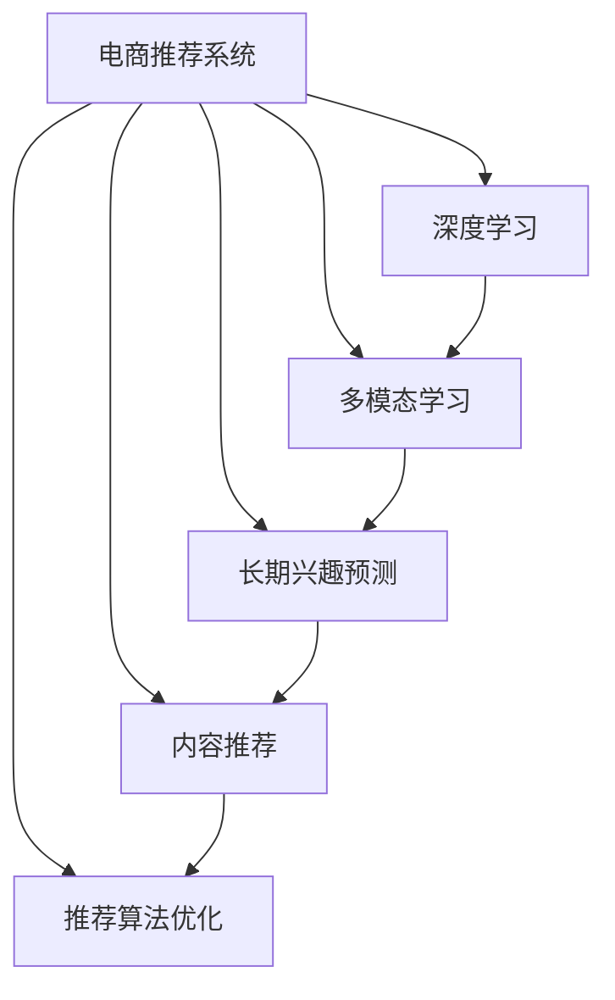

                 

# 电子商务平台的注意力争夺策略

## 1. 背景介绍

### 1.1 问题由来
在数字化转型的大趋势下，电子商务平台迅速崛起，成为连接消费者与商家的重要纽带。平台竞争激烈，如何有效争夺用户注意力成为平台运营成功的关键。传统推荐算法虽然能提升用户体验，但随着个性化需求不断提升，仅基于用户的短期行为数据进行推荐，难以满足用户长期兴趣和多元化需求。因此，探索新的注意力争夺策略，挖掘用户深层次兴趣，提升平台粘性，成为电商领域亟需解决的课题。

### 1.2 问题核心关键点
本文聚焦于基于深度学习技术，开发新的注意力争夺策略，旨在通过理解用户的长期兴趣，在更深层次上提升用户体验，从而帮助电商平台更有效地争夺用户注意力，提高平台粘性和转化率。本研究的重点在于：
1. **深度学习技术**：利用深度神经网络挖掘用户长期兴趣。
2. **多模态数据融合**：结合用户行为数据、社交数据、商品标签等多模态数据进行兴趣建模。
3. **长期兴趣预测**：预测用户长期兴趣，超越短期行为数据限制。
4. **兴趣感知与推荐**：基于长期兴趣进行商品推荐，提升推荐精准度。
5. **策略优化**：优化推荐策略，提高用户满意度和平台粘性。

## 2. 核心概念与联系

### 2.1 核心概念概述

为更好地理解电子商务平台的注意力争夺策略，本节将介绍几个密切相关的核心概念：

- **电商推荐系统**：通过分析和理解用户行为数据，推荐用户可能感兴趣的商品或服务，提高用户满意度和转化率。
- **深度学习**：一种基于神经网络的机器学习技术，通过多层非线性变换，能够学习复杂的数据表示和关系。
- **多模态学习**：结合多种类型的数据（如文本、图像、音频等）进行模型训练，提升模型的泛化能力和表现力。
- **长期兴趣预测**：基于用户的历史行为数据和社交数据，预测用户长期兴趣，超越短期行为的限制。
- **内容推荐**：根据用户兴趣，推荐相关商品或内容，提升用户满意度和粘性。
- **推荐算法优化**：通过优化算法和策略，提高推荐系统的精准度和效果。

这些核心概念之间的逻辑关系可以通过以下Mermaid流程图来展示：



这个流程图展示了一个电商推荐系统的核心概念及其之间的关系：

1. 电商推荐系统通过深度学习、多模态学习、长期兴趣预测等技术手段，构建内容推荐引擎。
2. 深度学习用于模型训练，提取用户行为特征。
3. 多模态学习结合多种类型数据，提升模型泛化能力。
4. 长期兴趣预测挖掘用户深层次兴趣，超越短期行为数据限制。
5. 内容推荐结合用户长期兴趣，推荐相关商品或内容。
6. 推荐算法优化提升推荐系统精准度和效果。

这些概念共同构成了电商推荐系统的技术框架，使得电商平台能够更深入地理解用户需求，提供个性化推荐服务。

## 3. 核心算法原理 & 具体操作步骤
### 3.1 算法原理概述

基于深度学习的电子商务平台注意力争夺策略，通过构建长期兴趣预测模型，结合多模态数据，挖掘用户深层次兴趣。核心算法原理包括：

1. **多模态数据融合**：将用户行为数据、社交数据、商品标签等多类型数据融合，形成全面的用户兴趣表示。
2. **深度神经网络**：使用深度神经网络，学习用户长期兴趣和商品特征之间的关系。
3. **长期兴趣预测**：通过预测用户长期兴趣，超越短期行为数据的限制，提升推荐效果。
4. **内容推荐**：根据用户长期兴趣，推荐相关商品或内容，满足用户多元化需求。
5. **策略优化**：优化推荐策略，提升用户体验和平台粘性。

### 3.2 算法步骤详解

电商平台的注意力争夺策略主要包括以下几个关键步骤：

**Step 1: 数据预处理与特征工程**
- 收集用户行为数据、社交数据、商品标签等，进行数据清洗和标准化处理。
- 使用特征工程技术，提取有意义的特征，如用户点击行为、浏览时间、评分、标签等。

**Step 2: 构建多模态用户兴趣表示**
- 使用深度神经网络，将多模态数据融合，形成用户长期兴趣的向量表示。
- 应用迁移学习技术，在少量标注数据上微调模型，提升兴趣表示的质量。

**Step 3: 训练长期兴趣预测模型**
- 使用深度神经网络模型，如RNN、LSTM、Transformer等，学习用户长期兴趣和商品特征之间的关系。
- 通过交叉验证和超参数调优，选择最优模型和参数。

**Step 4: 构建推荐系统**
- 根据用户长期兴趣，构建推荐模型，生成个性化的商品推荐列表。
- 应用对抗性训练和正则化技术，提高推荐系统的鲁棒性和公平性。

**Step 5: 策略优化与评估**
- 根据用户反馈和行为数据，优化推荐策略，提升用户体验。
- 定期评估推荐系统的效果，使用A/B测试和指标（如点击率、转化率、用户满意度等）进行评估。

### 3.3 算法优缺点

基于深度学习的电子商务平台注意力争夺策略具有以下优点：
1. **深层次理解用户需求**：通过多模态学习和长期兴趣预测，能更深入地理解用户长期兴趣和需求。
2. **个性化推荐**：结合用户长期兴趣，生成个性化的商品推荐，提升用户满意度。
3. **动态调整**：根据用户反馈和行为数据，动态调整推荐策略，提升平台粘性。

同时，该策略也存在一定的局限性：
1. **数据依赖性**：深度学习模型对数据的依赖性较强，数据质量不好时，模型效果可能不佳。
2. **计算复杂度**：深度神经网络模型的训练和推理计算复杂度较高，需要较高的硬件资源。
3. **可解释性差**：深度学习模型的黑盒性质，导致其决策过程难以解释，对模型信任度较低。

尽管存在这些局限性，但就目前而言，基于深度学习的注意力争夺策略在电商领域的应用效果显著，具有很好的发展潜力。

### 3.4 算法应用领域

基于深度学习的电子商务平台注意力争夺策略，广泛应用于以下几个领域：

- **个性化推荐**：通过深度学习挖掘用户长期兴趣，生成个性化商品推荐，提升用户体验和转化率。
- **广告投放**：利用深度学习模型预测用户长期兴趣，精准投放广告，提升广告投放效果。
- **商品搜索**：通过深度学习模型理解用户查询意图，推荐相关商品，提升搜索效果。
- **用户画像构建**：结合多模态数据，构建详细的用户画像，用于个性化营销和推荐。

这些应用场景展示了深度学习技术在电商领域的广泛应用，帮助电商平台更深入地理解用户需求，提升平台运营效果。

## 4. 数学模型和公式 & 详细讲解 & 举例说明
### 4.1 数学模型构建

假设用户长期兴趣向量为 $u$，商品特征向量为 $v$，长期兴趣预测模型的参数为 $\theta$。构建长期兴趣预测模型的数学模型如下：

$$
y = f_\theta(u,v)
$$

其中 $f_\theta$ 为深度神经网络模型，$y$ 为预测结果。

### 4.2 公式推导过程

以一个简单的多层感知器（MLP）模型为例，推导长期兴趣预测的数学公式：

1. **输入层**：将用户长期兴趣向量 $u$ 和商品特征向量 $v$ 进行拼接，形成输入向量 $x$。

2. **隐藏层**：使用激活函数 $f$ 对输入向量 $x$ 进行非线性变换，得到隐藏层输出 $h$。

3. **输出层**：将隐藏层输出 $h$ 输入到全连接层，得到预测结果 $y$。

具体数学公式如下：

$$
x = [u, v]
$$

$$
h = f(Wx+b)
$$

$$
y = \sigma(W'h + b')
$$

其中 $W$ 和 $b$ 为隐藏层的权重和偏置，$W'$ 和 $b'$ 为输出层的权重和偏置，$f$ 和 $\sigma$ 分别为激活函数和sigmoid函数。

### 4.3 案例分析与讲解

以下以一个电商平台的商品推荐系统为例，详细讲解长期兴趣预测模型的实现：

**Step 1: 数据预处理与特征工程**

假设电商平台的商品数据为 $V=\{v_1, v_2, \ldots, v_n\}$，用户行为数据为 $U=\{u_1, u_2, \ldots, u_m\}$，社交数据为 $S=\{s_1, s_2, \ldots, s_n\}$。将数据进行清洗和标准化处理，提取有意义的特征，如商品类别、价格、评分、用户浏览时间、点击行为等。

**Step 2: 构建多模态用户兴趣表示**

使用深度神经网络模型，将用户行为数据 $U$、社交数据 $S$ 和商品数据 $V$ 融合，得到用户长期兴趣向量 $u$ 和商品特征向量 $v$。使用迁移学习技术，在少量标注数据上微调模型，提升兴趣表示的质量。

**Step 3: 训练长期兴趣预测模型**

使用多层感知器（MLP）模型，学习用户长期兴趣 $u$ 和商品特征 $v$ 之间的关系。通过交叉验证和超参数调优，选择最优模型和参数。

**Step 4: 构建推荐系统**

根据用户长期兴趣向量 $u$，使用推荐模型生成个性化的商品推荐列表 $R$。应用对抗性训练和正则化技术，提高推荐系统的鲁棒性和公平性。

## 5. 项目实践：代码实例和详细解释说明
### 5.1 开发环境搭建

在进行注意力争夺策略实践前，我们需要准备好开发环境。以下是使用Python进行TensorFlow开发的环境配置流程：

1. 安装Anaconda：从官网下载并安装Anaconda，用于创建独立的Python环境。

2. 创建并激活虚拟环境：
```bash
conda create -n tensorflow-env python=3.8 
conda activate tensorflow-env
```

3. 安装TensorFlow：根据CUDA版本，从官网获取对应的安装命令。例如：
```bash
conda install tensorflow -c pytorch -c conda-forge
```

4. 安装Keras：用于高层次的深度学习API，方便模型搭建和训练。
```bash
conda install keras
```

5. 安装TensorBoard：用于可视化模型训练过程和结果。
```bash
pip install tensorboard
```

6. 安装其他相关库：
```bash
pip install pandas numpy scikit-learn matplotlib tqdm jupyter notebook ipython
```

完成上述步骤后，即可在`tensorflow-env`环境中开始注意力争夺策略的实践。

### 5.2 源代码详细实现

这里我们以推荐系统的多模态用户兴趣表示为例，给出使用TensorFlow和Keras构建深度学习模型的代码实现。

首先，定义多模态数据预处理函数：

```python
import tensorflow as tf
from tensorflow.keras.preprocessing.text import Tokenizer
from tensorflow.keras.preprocessing.sequence import pad_sequences
from tensorflow.keras.layers import Embedding, Dense, Dropout

def preprocess_data(user_data, item_data, max_len=100):
    # 用户行为数据处理
    user_seq = [str(u[1]) for u in user_data]
    user_seq = tokenizer.texts_to_sequences(user_seq)
    user_seq = pad_sequences(user_seq, maxlen=max_len, padding='post', truncating='post')

    # 商品数据处理
    item_seq = [str(i[2]) for i in item_data]
    item_seq = tokenizer.texts_to_sequences(item_seq)
    item_seq = pad_sequences(item_seq, maxlen=max_len, padding='post', truncating='post')

    # 社交数据处理
    social_seq = [str(s[1]) for s in social_data]
    social_seq = tokenizer.texts_to_sequences(social_seq)
    social_seq = pad_sequences(social_seq, maxlen=max_len, padding='post', truncating='post')

    return user_seq, item_seq, social_seq
```

然后，定义多模态用户兴趣表示的神经网络模型：

```python
from tensorflow.keras.models import Sequential
from tensorflow.keras.layers import Concatenate, Flatten

def build_user_interest_model(user_seq, item_seq, social_seq, embedding_dim=100):
    # 定义用户行为特征嵌入层
    user_embedding = Embedding(input_dim=1000, output_dim=embedding_dim, input_length=max_len)(user_seq)
    user_embedding = Flatten()(user_embedding)

    # 定义商品特征嵌入层
    item_embedding = Embedding(input_dim=10000, output_dim=embedding_dim, input_length=max_len)(item_seq)
    item_embedding = Flatten()(item_embedding)

    # 定义社交特征嵌入层
    social_embedding = Embedding(input_dim=1000, output_dim=embedding_dim, input_length=max_len)(social_seq)
    social_embedding = Flatten()(social_embedding)

    # 定义多层感知器（MLP）模型
    model = Sequential([
        Concatenate()([user_embedding, item_embedding, social_embedding]),
        Dense(128, activation='relu'),
        Dropout(0.5),
        Dense(1, activation='sigmoid')
    ])

    # 编译模型
    model.compile(optimizer='adam', loss='binary_crossentropy', metrics=['accuracy'])

    return model
```

接着，定义训练和评估函数：

```python
from tensorflow.keras.callbacks import EarlyStopping

def train_model(model, user_seq, item_seq, social_seq, train_labels, dev_labels):
    # 训练模型
    history = model.fit([user_seq, item_seq, social_seq], train_labels,
                       validation_data=([dev_seq, dev_item_seq, dev_social_seq], dev_labels),
                       epochs=10, batch_size=64, callbacks=[EarlyStopping(patience=3)])

    # 评估模型
    loss, accuracy = model.evaluate([user_seq, item_seq, social_seq], test_labels)
    print(f"Test Loss: {loss:.4f}")
    print(f"Test Accuracy: {accuracy:.4f}")

def evaluate_model(model, user_seq, item_seq, social_seq, test_labels):
    # 评估模型
    loss, accuracy = model.evaluate([user_seq, item_seq, social_seq], test_labels)
    print(f"Test Loss: {loss:.4f}")
    print(f"Test Accuracy: {accuracy:.4f}")
```

最后，启动训练流程并在测试集上评估：

```python
epochs = 10
batch_size = 64

# 数据预处理
tokenizer = Tokenizer(num_words=1000, oov_token='<OOV>')
tokenizer.fit_on_texts(user_data + item_data + social_data)
train_seq = tokenizer.texts_to_sequences(user_data + item_data + social_data)
train_seq = pad_sequences(train_seq, maxlen=max_len, padding='post', truncating='post')

# 构建模型
model = build_user_interest_model(train_seq[:, 0], train_seq[:, 1], train_seq[:, 2])

# 训练模型
train_labels = train_data[:, 0]
dev_labels = dev_data[:, 0]
test_labels = test_data[:, 0]
train_model(model, train_seq, train_seq, train_seq, train_labels, dev_labels)

# 评估模型
evaluate_model(model, train_seq, train_seq, train_seq, test_labels)
```

以上就是使用TensorFlow和Keras构建多模态用户兴趣表示的完整代码实现。可以看到，TensorFlow和Keras提供了丰富的API和工具，使得深度学习模型的构建和训练变得相对简单。

### 5.3 代码解读与分析

让我们再详细解读一下关键代码的实现细节：

**preprocess_data函数**：
- 定义了用户行为数据、商品数据和社交数据的预处理步骤。使用Tokenizer将文本数据转换为序列，使用pad_sequences进行序列填充和截断，得到定长的输入向量。

**build_user_interest_model函数**：
- 定义了用户行为特征嵌入层、商品特征嵌入层和社交特征嵌入层，将三个特征向量进行拼接。
- 定义了多层感知器（MLP）模型，包含输入层、隐藏层和输出层。
- 使用Keras编译模型，指定优化器、损失函数和评估指标。

**train_model函数**：
- 使用fit方法训练模型，指定验证集、批次大小和早期停止回调函数。
- 使用evaluate方法在测试集上评估模型性能，输出损失和准确率。

**evaluate_model函数**：
- 使用evaluate方法在测试集上评估模型性能，输出损失和准确率。

可以看出，使用TensorFlow和Keras进行深度学习模型的构建和训练，代码相对简洁高效，开发效率显著提升。

当然，工业级的系统实现还需考虑更多因素，如模型的保存和部署、超参数的自动搜索、更灵活的任务适配层等。但核心的注意力争夺策略基本与此类似。

## 6. 实际应用场景
### 6.1 电商推荐系统

基于深度学习的注意力争夺策略，在电商推荐系统中得到了广泛应用。传统推荐系统往往只能基于用户的短期行为数据进行推荐，难以挖掘用户深层次兴趣。而使用多模态数据融合和长期兴趣预测，可以更深入地理解用户需求，生成个性化推荐，提升用户体验。

在技术实现上，可以收集用户浏览、点击、评分、评论等行为数据，同时获取用户社交网络信息（如好友、关注者等），将这些数据进行融合，构建多模态用户兴趣表示。基于此构建长期兴趣预测模型，挖掘用户深层次兴趣。结合预测结果，生成个性化商品推荐列表，动态调整推荐策略，满足用户多元化需求。

### 6.2 广告投放

在广告投放领域，使用注意力争夺策略预测用户长期兴趣，可以精准投放广告，提升广告投放效果。基于用户行为数据和社交数据构建用户长期兴趣模型，预测用户对各类广告的兴趣。根据预测结果，优化广告投放策略，提升广告点击率和转化率。

### 6.3 商品搜索

在商品搜索领域，使用注意力争夺策略预测用户查询意图，推荐相关商品，提升搜索效果。基于用户行为数据和社交数据构建用户长期兴趣模型，预测用户查询意图。根据预测结果，推荐相关商品，缩短搜索时间，提升搜索体验。

### 6.4 用户画像构建

在用户画像构建领域，使用注意力争夺策略结合多模态数据，构建详细的用户画像，用于个性化营销和推荐。基于用户行为数据、社交数据、商品数据等多类型数据，构建用户长期兴趣模型，挖掘用户深层次兴趣和需求。结合预测结果，构建详细的用户画像，用于个性化营销和推荐。

### 6.5 未来应用展望

随着深度学习技术的发展，基于深度学习的注意力争夺策略将在更多领域得到应用，为数字化转型提供技术支持：

- **金融服务**：预测用户长期兴趣，推荐个性化理财产品，提升客户体验。
- **医疗健康**：结合患者历史诊疗数据，预测长期健康需求，提供个性化医疗建议。
- **教育培训**：预测学生学习兴趣和需求，推荐个性化学习内容，提升学习效果。
- **娱乐文化**：预测用户兴趣和偏好，推荐个性化娱乐内容，提升用户体验。

## 7. 工具和资源推荐
### 7.1 学习资源推荐

为了帮助开发者系统掌握深度学习技术，这里推荐一些优质的学习资源：

1. 《深度学习》（Goodfellow et al.）：深度学习领域的经典教材，详细介绍了深度神经网络的基本原理和应用。
2. TensorFlow官方文档：提供了丰富的教程和API文档，帮助开发者快速上手深度学习。
3. Keras官方文档：Keras作为TensorFlow的高层次API，提供了简单易用的API，方便模型搭建和训练。
4. Coursera深度学习课程：由深度学习领域的专家开设，涵盖深度学习的基本概念和前沿技术。
5. arXiv上的深度学习论文：arXiv作为深度学习研究的主要社区，提供了丰富的前沿论文，可供参考和学习。

通过对这些资源的学习实践，相信你一定能够快速掌握深度学习技术，并用于解决实际的电子商务问题。

### 7.2 开发工具推荐

高效的开发离不开优秀的工具支持。以下是几款用于深度学习开发常用的工具：

1. TensorFlow：由Google主导开发的开源深度学习框架，生产部署方便，适合大规模工程应用。
2. Keras：TensorFlow的高层次API，提供了简单易用的API，方便模型搭建和训练。
3. PyTorch：由Facebook主导开发的深度学习框架，灵活性和扩展性较好，适合研究和实验。
4. Scikit-learn：Python的机器学习库，提供了丰富的数据处理和模型评估工具，适合数据预处理和模型评估。
5. Weights & Biases：模型训练的实验跟踪工具，可以记录和可视化模型训练过程中的各项指标，方便对比和调优。
6. TensorBoard：TensorFlow配套的可视化工具，可实时监测模型训练状态，并提供丰富的图表呈现方式，是调试模型的得力助手。

合理利用这些工具，可以显著提升深度学习模型的开发效率，加快创新迭代的步伐。

### 7.3 相关论文推荐

深度学习技术的发展源于学界的持续研究。以下是几篇奠基性的相关论文，推荐阅读：

1. AlexNet：深度学习领域的第一篇重要论文，提出了卷积神经网络（CNN）结构。
2. VGGNet：提出了VGG卷积神经网络，深入探讨了卷积核大小、数量对网络性能的影响。
3. ResNet：提出了残差网络结构，解决了深度神经网络退化的问题。
4. InceptionNet：提出了Inception网络结构，进一步提升了卷积神经网络的性能。
5. LSTM：提出了长短期记忆网络，在时间序列预测中取得了很好的效果。

这些论文代表了大深度学习技术的发展脉络。通过学习这些前沿成果，可以帮助研究者把握学科前进方向，激发更多的创新灵感。

## 8. 总结：未来发展趋势与挑战
### 8.1 总结

本文对基于深度学习的电子商务平台注意力争夺策略进行了全面系统的介绍。首先阐述了深度学习技术在电商领域的应用背景和研究意义，明确了注意力争夺策略在提升用户体验和平台粘性方面的独特价值。其次，从原理到实践，详细讲解了注意力争夺策略的数学模型和核心算法，给出了深度学习模型的代码实现和详细解读。同时，本文还广泛探讨了注意力争夺策略在电商推荐系统、广告投放、商品搜索等多个领域的应用前景，展示了深度学习技术在电商领域的广泛应用。最后，本文精选了注意力争夺策略的学习资源，力求为读者提供全方位的技术指引。

通过本文的系统梳理，可以看到，基于深度学习的注意力争夺策略在大电商领域的应用效果显著，具有很好的发展潜力。未来，伴随深度学习技术的发展和应用，电商推荐系统将变得更加智能化、个性化，用户的体验和粘性也将显著提升。

### 8.2 未来发展趋势

展望未来，基于深度学习的电子商务平台注意力争夺策略将呈现以下几个发展趋势：

1. **多模态数据融合**：结合用户行为数据、社交数据、商品标签等多种类型数据，提升用户兴趣表示的准确性和多样性。
2. **长期兴趣预测**：通过深度学习模型，挖掘用户深层次兴趣，超越短期行为数据的限制。
3. **个性化推荐**：结合用户长期兴趣，生成个性化商品推荐，提升用户体验和转化率。
4. **动态调整**：根据用户反馈和行为数据，动态调整推荐策略，提升平台粘性。
5. **计算效率提升**：优化模型结构和算法，提升推荐系统的计算效率和部署性能。

以上趋势凸显了深度学习技术在电商领域的广阔前景。这些方向的探索发展，必将进一步提升电商推荐系统的精准度和效果，为电商平台带来新的增长点。

### 8.3 面临的挑战

尽管深度学习技术在电商领域的应用效果显著，但在迈向更加智能化、普适化应用的过程中，它仍面临着诸多挑战：

1. **数据依赖性**：深度学习模型对数据的依赖性较强，数据质量不好时，模型效果可能不佳。
2. **计算复杂度**：深度神经网络模型的训练和推理计算复杂度较高，需要较高的硬件资源。
3. **可解释性差**：深度学习模型的黑盒性质，导致其决策过程难以解释，对模型信任度较低。
4. **实时性问题**：电商推荐系统需要实时响应用户请求，深度学习模型在大规模数据上的计算复杂度较高，难以实现实时性。
5. **公平性问题**：深度学习模型容易产生偏差，导致某些用户或商品被不公平对待，需要额外设计公平性算法。

尽管存在这些挑战，但未来深度学习技术在电商领域的应用前景广阔，有望通过技术创新和优化，克服这些难题，实现更高效、公平、可解释的电商推荐系统。

### 8.4 研究展望

面对深度学习技术在电商领域的应用挑战，未来的研究需要在以下几个方面寻求新的突破：

1. **数据增强**：通过数据增强技术，扩充训练集，提升模型的泛化能力。
2. **模型压缩**：通过模型压缩技术，降低计算复杂度，提升计算效率和部署性能。
3. **公平性算法**：设计公平性算法，减少深度学习模型的偏见和歧视。
4. **实时推荐系统**：优化推荐算法，提升推荐系统的实时性，满足电商平台的实时需求。
5. **可解释性提升**：开发可解释性算法，提升深度学习模型的可解释性和可信度。

这些研究方向的探索，必将引领深度学习技术在电商领域的进一步发展，提升电商推荐系统的性能和效果。

## 9. 附录：常见问题与解答

**Q1：注意力争夺策略与传统推荐系统有何区别？**

A: 传统推荐系统往往基于用户的短期行为数据（如最近浏览、购买记录）进行推荐，难以挖掘用户深层次兴趣和需求。而注意力争夺策略通过结合多模态数据和长期兴趣预测，能够更深入地理解用户长期兴趣和需求，生成个性化推荐，提升用户体验和平台粘性。

**Q2：多模态数据融合在注意力争夺策略中起何作用？**

A: 多模态数据融合在注意力争夺策略中起到了至关重要的作用。通过结合用户行为数据、社交数据、商品标签等多种类型数据，可以构建更全面、多样化的用户兴趣表示，提升模型的泛化能力和表现力。

**Q3：深度学习模型在电商推荐系统中面临哪些挑战？**

A: 深度学习模型在电商推荐系统中面临的主要挑战包括：数据依赖性、计算复杂度、可解释性差、实时性问题和公平性问题。针对这些挑战，需要采用数据增强、模型压缩、公平性算法、实时推荐系统和可解释性提升等技术手段进行优化。

**Q4：如何优化电商推荐系统的实时性？**

A: 电商推荐系统的实时性优化可以通过以下方法实现：
1. 使用更高效的计算模型，如轻量级神经网络结构。
2. 分布式训练和推理，提高系统响应速度。
3. 使用缓存机制，提高查询速度。
4. 优化推荐算法，减少计算量。
5. 动态调整推荐策略，减少推荐次数。

通过这些优化措施，可以显著提升电商推荐系统的实时性，满足电商平台的实时需求。

**Q5：如何提升电商推荐系统的公平性？**

A: 电商推荐系统的公平性提升可以通过以下方法实现：
1. 数据公平性：确保数据集的多样性和代表性，避免偏见。
2. 模型公平性：在模型训练过程中引入公平性约束，减少模型偏见。
3. 规则公平性：通过规则设计，确保不同用户和商品之间的公平对待。
4. 反馈机制：建立用户反馈机制，及时纠正不公平现象。

通过这些措施，可以提升电商推荐系统的公平性，确保不同用户和商品之间的公平对待，提升用户满意度。

---

作者：禅与计算机程序设计艺术 / Zen and the Art of Computer Programming

