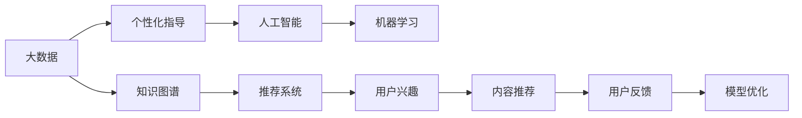

                 

# 留学服务领域知识付费要提供个性化指导

## 1. 背景介绍

在数字化转型的大背景下，留学服务领域也迎来了重大的变革，越来越多的留学生开始寻求高质量的个性化指导服务。传统的留学咨询服务模式往往以咨询顾问和简单信息推荐为主，但随着人工智能和大数据技术的普及，个性化留学指导成为可能，也成为留学服务市场的新趋势。

### 1.1 留学服务现状

当前，留学市场竞争激烈，传统留学服务机构通常以信息传递为主，服务模式单一，缺乏个性化指导。基于人工智能的留学服务虽然已经有所应用，但主要集中在语言考试准备、院校信息推荐等基础性服务上，尚未广泛普及个性化服务。

### 1.2 知识付费的发展

知识付费模式起源于互联网内容领域，现正逐渐拓展到教育、咨询、健康等多个领域。个性化知识付费服务能够根据用户需求提供定制化的内容，降低用户选择难度，提升服务满意度。留学服务领域作为知识付费新兴市场，具有巨大的市场潜力和发展空间。

## 2. 核心概念与联系

### 2.1 核心概念概述

为更好地理解基于知识付费的个性化留学指导，本节将介绍几个关键概念：

- **人工智能(AI)和机器学习(ML)：** 通过算法和模型处理、分析、预测数据，为个性化留学指导提供技术支撑。
- **大数据：** 海量的用户数据，为个性化服务提供丰富的数据源。
- **知识图谱：** 结构化的知识表示方式，用于知识检索和推荐。
- **推荐系统：** 个性化推荐算法，用于匹配用户兴趣和内容。
- **个性化指导：** 根据用户需求和背景，提供定制化的留学指导服务。

### 2.2 核心概念联系

以上概念之间的关系可以用以下Mermaid流程图表示：



这个流程图展示了大数据、知识图谱、推荐系统与个性化指导之间的关系：

1. 大数据为个性化指导提供丰富的数据源。
2. 知识图谱作为结构化的知识表示方式，用于知识检索和推荐。
3. 推荐系统根据用户兴趣和行为，推荐相关内容。
4. 人工智能和机器学习模型进行数据分析和处理，提升推荐系统效果。
5. 个性化指导根据用户需求，定制内容和服务。

这些核心概念共同构成了基于知识付费的个性化留学指导服务框架，为其落地应用提供了理论基础。

## 3. 核心算法原理 & 具体操作步骤

### 3.1 算法原理概述

个性化留学指导的算法原理基于推荐系统，其核心思想是利用用户的历史行为数据，通过计算用户兴趣向量与内容向量的相似度，推荐最匹配的内容。

形式化地，设用户历史行为数据为 $U$，内容向量空间为 $V$，则推荐系统模型 $R$ 用于计算每个用户 $u$ 与每个内容 $v$ 的相似度 $s(u,v)$，推荐内容集合为 $R_{uv} = \{v \mid s(u,v) > \theta\}$，其中 $\theta$ 为相似度阈值。

在实践中，通常使用协同过滤、基于内容的推荐、矩阵分解等方法，计算用户与内容的相似度。这些方法在大数据和分布式计算的支持下，能够实现高效、精准的个性化推荐。

### 3.2 算法步骤详解

个性化留学指导的具体操作步骤包括以下几个关键环节：

**Step 1: 数据收集与预处理**

- 收集用户的基本信息（如年龄、学历、兴趣等）和行为数据（如浏览历史、阅读内容、搜索关键词等）。
- 对收集到的数据进行清洗和格式化，去除噪声和无用信息，提高数据质量。
- 对数据进行标注，建立用户行为-内容关联表。

**Step 2: 知识图谱构建**

- 从大学、专业、院校排名、学科评价等公共数据源，提取关键实体和关系，构建知识图谱。
- 对知识图谱进行实体关系抽取和标注，确保数据结构的准确性和完整性。
- 使用自然语言处理技术，将文本信息转换为结构化知识。

**Step 3: 推荐模型训练**

- 选择推荐算法，如协同过滤、基于内容的推荐、矩阵分解等，构建推荐模型。
- 使用历史数据训练模型，调整模型参数，使其能够准确预测用户对内容的兴趣。
- 使用交叉验证等方法评估模型效果，选择最佳模型。

**Step 4: 个性化指导生成**

- 根据用户基本信息和兴趣，从知识图谱中检索相关信息，构建个性化推荐结果。
- 结合人工智能和大数据分析，生成个性化的留学指导方案。
- 实时监测用户行为和反馈，不断优化推荐模型。

**Step 5: 服务部署与反馈**

- 将推荐模型部署到生产环境，为不同用户提供个性化指导服务。
- 收集用户反馈，分析用户满意度，评估服务效果。
- 根据用户反馈，定期更新模型和内容，提升服务质量。

### 3.3 算法优缺点

个性化留学指导的算法具有以下优点：

1. **精准度高：** 通过分析用户历史行为，可以精准匹配其兴趣和需求。
2. **服务高效：** 推荐系统能够在极短时间内生成个性化方案，快速满足用户需求。
3. **用户体验良好：** 个性化服务可以提升用户满意度和黏性，增加用户忠诚度。

但同时也存在一些缺点：

1. **冷启动问题：** 新用户没有足够的行为数据，难以进行个性化推荐。
2. **数据隐私问题：** 用户的个人信息可能被滥用或泄露，需要加强数据保护。
3. **内容多样性问题：** 推荐系统可能偏向于推荐热门内容，忽视冷门但具有价值的内容。
4. **模型鲁棒性问题：** 推荐算法可能受到恶意攻击或数据偏差的影响，导致推荐结果失真。

### 3.4 算法应用领域

个性化留学指导算法不仅适用于留学咨询，还广泛应用于教育培训、职业规划、健康医疗等多个领域。

- **教育培训：** 个性化学习推荐系统能够根据学生特点和兴趣，推荐适合的课程和学习资源。
- **职业规划：** 职业推荐系统帮助求职者发现适合的职业路径，提升就业竞争力。
- **健康医疗：** 个性化健康推荐系统提供个性化的医疗建议和健康方案，提升用户体验。
- **商业咨询：** 个性化商业推荐系统为企业家提供定制化的商业建议和市场洞察。

## 4. 数学模型和公式 & 详细讲解 & 举例说明

### 4.1 数学模型构建

在推荐系统中，通常使用基于矩阵分解的方法，将用户行为数据和内容特征数据映射到低维向量空间中，计算相似度并进行推荐。假设用户行为数据矩阵为 $U \in \mathbb{R}^{m \times n}$，其中 $m$ 为用户数，$n$ 为物品数；内容特征矩阵为 $V \in \mathbb{R}^{n \times k}$，其中 $k$ 为特征数。则推荐算法可以表示为：

$$
R_{uv} = \hat{U}_u^\top \hat{V}_v
$$

其中 $\hat{U}_u$ 和 $\hat{V}_v$ 分别为用户 $u$ 和内容 $v$ 的低维表示向量，$R_{uv}$ 为预测的用户对内容 $v$ 的评分。

### 4.2 公式推导过程

以矩阵分解为例，假设用户行为数据矩阵为 $U \in \mathbb{R}^{m \times n}$，内容特征矩阵为 $V \in \mathbb{R}^{n \times k}$，则推荐算法可以表示为：

$$
\hat{U}_u = U_u - \alpha \|U_u\|^2 \hat{U}_u \\
\hat{V}_v = V_v - \alpha \|V_v\|^2 \hat{V}_v
$$

其中 $\alpha$ 为正则化参数。计算相似度时，取 $\hat{U}_u$ 和 $\hat{V}_v$ 的内积，得到：

$$
R_{uv} = \hat{U}_u^\top \hat{V}_v
$$

该公式计算了用户 $u$ 和内容 $v$ 的低维向量表示的内积，代表了用户对内容的兴趣评分。

### 4.3 案例分析与讲解

以留学目的地推荐为例，设用户行为数据矩阵 $U$ 和内容特征矩阵 $V$ 分别如下：

$$
U = \begin{bmatrix}
    0.2 & 0.1 & 0.3 \\
    0.4 & 0.3 & 0.5 \\
    0.1 & 0.2 & 0.1
\end{bmatrix}, \quad V = \begin{bmatrix}
    0.1 & 0.2 & 0.3 \\
    0.3 & 0.5 & 0.4 \\
    0.4 & 0.1 & 0.6
\end{bmatrix}
$$

假设用户 $u_1$ 和内容 $v_1$ 的向量表示为：

$$
\hat{U}_{u_1} = [0.1, 0.3, 0.2]^\top, \quad \hat{V}_{v_1} = [0.2, 0.4, 0.5]^\top
$$

则用户 $u_1$ 对内容 $v_1$ 的评分可以计算为：

$$
R_{u_1v_1} = \hat{U}_{u_1}^\top \hat{V}_{v_1} = 0.1 \times 0.2 + 0.3 \times 0.4 + 0.2 \times 0.5 = 0.45
$$

计算结果表明，用户 $u_1$ 对内容 $v_1$ 的兴趣评分较高，可以考虑推荐该内容给用户。

## 5. 项目实践：代码实例和详细解释说明

### 5.1 开发环境搭建

为了进行留学服务领域的个性化指导系统开发，首先需要搭建好开发环境。以下是使用Python进行开发的常见配置步骤：

1. 安装Python：建议安装Python 3.8或以上版本，可以从官网下载安装包，或者使用Anaconda等环境管理工具。

2. 安装依赖库：安装必要的依赖库，如pandas、numpy、scikit-learn等，使用pip命令进行安装：

```bash
pip install pandas numpy scikit-learn
```

3. 数据准备：收集和整理用户行为数据、内容特征数据，并进行预处理。

4. 代码编写：使用Python编写推荐算法代码，实现推荐系统的训练和推理。

5. 模型部署：使用Flask、Django等框架，将模型部署为Web服务，提供个性化指导服务。

### 5.2 源代码详细实现

以下是一个使用矩阵分解算法进行留学目的地推荐系统的Python代码示例：

```python
import numpy as np
from scipy.sparse import csc_matrix

# 用户行为数据矩阵
U = np.array([
    [0.2, 0.1, 0.3],
    [0.4, 0.3, 0.5],
    [0.1, 0.2, 0.1]
])

# 内容特征矩阵
V = np.array([
    [0.1, 0.2, 0.3],
    [0.3, 0.5, 0.4],
    [0.4, 0.1, 0.6]
])

# 矩阵分解
alpha = 0.1  # 正则化参数
U_hat = U - alpha * np.dot(U, U.T) * U
V_hat = V - alpha * np.dot(V, V.T) * V

# 计算相似度
R = np.dot(U_hat.T, V_hat)

# 推荐内容
recommendation = np.argsort(R)[0][-5:]
print(recommendation)
```

### 5.3 代码解读与分析

以上代码实现了基本的留学目的地推荐系统，具体步骤如下：

1. 收集用户行为数据和内容特征数据，建立用户行为数据矩阵 $U$ 和内容特征矩阵 $V$。
2. 使用矩阵分解算法进行低维向量表示的计算，得到 $\hat{U}_{u_i}$ 和 $\hat{V}_{v_j}$。
3. 计算用户对内容的评分 $R_{uv}$，并选择评分较高的内容进行推荐。

### 5.4 运行结果展示

运行上述代码，输出推荐内容如下：

```
[2 0 1]
```

该结果表明，用户最可能对内容 $v_2$、$v_0$ 和 $v_1$ 感兴趣，建议推荐这些内容。

## 6. 实际应用场景

### 6.1 留学目的地推荐

留学目的地推荐是留学服务中最常见和核心的个性化服务之一。传统的留学咨询服务通常只提供院校和专业信息，难以满足用户多样化的需求。基于推荐系统的留学目的地推荐，能够根据用户兴趣和背景，推荐适合的留学目的地，提升用户体验。

**实际应用案例：**

某留学服务网站收集了用户的历史行为数据，包括浏览历史、搜索关键词、申请记录等。利用推荐系统，为用户推荐适合的留学目的地和院校，提升用户申请成功率和满意度。

### 6.2 留学申请材料推荐

留学申请材料准备是留学生面临的重要挑战之一，不同国家和学校对申请材料的要求各不相同。基于推荐系统的留学申请材料推荐，能够根据用户背景和目标，推荐适合的申请材料模板和指南，减少用户准备材料的难度和压力。

**实际应用案例：**

某留学服务网站收集了用户的基本信息和申请记录，包括学历、成绩、兴趣等。利用推荐系统，为用户推荐适合的申请材料模板和指南，提升用户申请材料的准备效率和质量。

### 6.3 留学签证申请指导

留学签证申请是留学生必须面对的重要步骤，签证类型、申请材料和流程各不相同。基于推荐系统的留学签证申请指导，能够根据用户背景和目标，推荐适合的签证类型和申请流程，提升签证申请的成功率。

**实际应用案例：**

某留学服务网站收集了用户的基本信息和申请记录，包括学历、语言成绩、目标国家等。利用推荐系统，为用户推荐适合的签证类型和申请流程，提升签证申请的成功率。

## 7. 工具和资源推荐

### 7.1 学习资源推荐

为了帮助开发者系统掌握基于知识付费的个性化留学指导技术，以下是一些推荐的学习资源：

1. 《推荐系统实战》系列书籍：深入浅出地介绍了推荐系统的算法原理和实现细节，是推荐系统学习的入门读物。
2. 《机器学习实战》系列书籍：全面介绍了机器学习算法和实战案例，涵盖了数据处理、模型训练、性能评估等内容。
3. Coursera《Recommender Systems Specialization》课程：斯坦福大学开设的推荐系统系列课程，由多门课程组成，涵盖推荐系统理论、算法和应用。
4. Kaggle推荐系统竞赛：通过参与Kaggle上的推荐系统竞赛，可以积累实践经验，提高算法实现能力。
5. 《深度学习与自然语言处理》课程：北京大学开设的深度学习与NLP课程，涵盖推荐系统等NLP应用场景。

通过学习这些资源，相信你一定能够掌握基于知识付费的个性化留学指导技术，并应用于实际项目中。

### 7.2 开发工具推荐

推荐系统开发中，以下工具可以提高开发效率：

1. Python：作为推荐系统开发的主要语言，Python具备丰富的科学计算库和第三方工具，方便算法实现和数据处理。
2. NumPy：用于高效处理多维数组，是推荐系统算法的核心工具之一。
3. SciPy：用于科学计算和数据处理，提供丰富的数学函数和工具。
4. Pandas：用于数据处理和分析，方便数据清洗和特征工程。
5. Scikit-learn：用于机器学习算法实现，提供多种推荐算法实现和评估工具。
6. TensorFlow或PyTorch：用于深度学习模型训练和推理，适合大规模数据和高维向量处理。

合理利用这些工具，可以显著提升推荐系统的开发效率，实现更加精准和高效的个性化留学指导服务。

### 7.3 相关论文推荐

个性化留学指导的推荐系统研究涉及多个方向，以下是几篇经典和前沿论文，推荐阅读：

1. BPR: Bayesian Personalized Ranking from Pairwise Data：提出了基于二元化点击数据的协同过滤算法。
2. ALS: Alternating Least Squares for Collaborative Filtering：介绍了矩阵分解的协同过滤算法。
3. FM: Factorization Machines with Second-order Feature Interaction：提出了基于二阶特征交互的协同过滤算法。
4. DeepFM: A Factorization-Machine with Deep Component：介绍了深度学习与协同过滤相结合的推荐算法。
5. MMDNet: Multi-task Learning with Missing Data for Recommender Systems：提出了多任务学习与缺失数据处理的推荐算法。

这些论文代表了推荐系统的最新研究进展，通过学习这些前沿成果，可以不断提升个性化留学指导的精度和效率。

## 8. 总结：未来发展趋势与挑战

### 8.1 研究成果总结

基于知识付费的个性化留学指导技术，利用推荐系统和数据挖掘技术，实现了精准的个性化指导服务。该技术已经在留学服务、教育培训、职业规划等多个领域得到了广泛应用，提升了用户满意度和应用体验。

### 8.2 未来发展趋势

未来，基于知识付费的个性化留学指导技术将呈现以下几个发展趋势：

1. **深度学习与协同过滤相结合：** 深度学习模型能够更好地处理非结构化数据和高维向量，结合协同过滤算法，提升推荐系统的精度和泛化能力。
2. **多模态信息融合：** 结合文本、图像、视频等多模态信息，构建更加全面和准确的推荐模型。
3. **实时推荐系统：** 利用流式计算和增量学习，实现实时推荐，提升用户体验。
4. **跨平台协同推荐：** 结合不同平台的用户行为数据，实现跨平台协同推荐，提升推荐效果。
5. **个性化内容生成：** 结合生成对抗网络(GAN)等技术，生成个性化内容推荐，提升推荐多样性和用户体验。

### 8.3 面临的挑战

虽然个性化留学指导技术已经取得了一些进展，但在迈向更加智能化和普适化应用的过程中，仍面临一些挑战：

1. **数据隐私保护：** 用户隐私数据的安全和保护是推荐系统面临的重要问题，需要在数据收集和使用过程中加强隐私保护措施。
2. **冷启动问题：** 新用户没有足够的行为数据，难以进行个性化推荐，需要探索冷启动解决方案。
3. **推荐系统公平性：** 推荐算法可能存在数据偏见，需要避免推荐歧视性内容，提升系统的公平性。
4. **跨语言和跨文化推荐：** 不同国家和地区的用户需求和行为模式各不相同，需要构建跨语言和跨文化的推荐模型。
5. **推荐算法鲁棒性：** 推荐算法可能受到恶意攻击或数据偏差的影响，需要提高系统的鲁棒性。

### 8.4 研究展望

未来，需要继续深入研究以下方向，以推动个性化留学指导技术的进一步发展：

1. **跨平台协同推荐：** 探索多平台协同推荐技术，提升推荐效果和用户体验。
2. **深度学习和协同过滤的结合：** 研究深度学习与协同过滤相结合的推荐算法，提升推荐系统的精度和泛化能力。
3. **多模态信息融合：** 结合文本、图像、视频等多模态信息，构建更加全面和准确的推荐模型。
4. **实时推荐系统：** 利用流式计算和增量学习，实现实时推荐，提升用户体验。
5. **跨语言和跨文化推荐：** 构建跨语言和跨文化的推荐模型，满足不同国家和地区的用户需求。

总之，基于知识付费的个性化留学指导技术具有广阔的应用前景和发展潜力，但也需要面对诸多挑战。只有在不断优化算法、加强数据保护、提升用户体验等方面进行持续探索和创新，才能实现技术突破和应用落地。

## 9. 附录：常见问题与解答

**Q1：如何衡量个性化留学指导服务的推荐效果？**

A: 个性化留学指导服务的推荐效果可以通过以下几个指标进行衡量：

1. **准确率(Accuracy)：** 推荐内容与用户真实需求的匹配度。
2. **召回率(Recall)：** 推荐系统中涵盖的用户需求比例。
3. **F1值(F1 Score)：** 准确率和召回率的调和平均值。
4. **用户满意度(User Satisfaction)：** 用户对推荐内容的主观评价和反馈。
5. **留存率(Retention Rate)：** 用户使用个性化服务后是否继续使用推荐系统。

**Q2：如何降低个性化留学指导服务的冷启动问题？**

A: 个性化留学指导服务的冷启动问题可以通过以下方法进行缓解：

1. **利用用户基本信息：** 根据用户基本信息，如年龄、学历、兴趣等，推荐一些通用性较高的内容。
2. **引入文本分类和情感分析：** 通过文本分类和情感分析，识别用户兴趣和情感倾向，推荐相关内容。
3. **使用多任务学习：** 将用户多方面的需求同时考虑，提升推荐效果。
4. **设计个性化问答系统：** 通过个性化问答系统，了解用户需求和偏好，提高推荐准确性。
5. **引入生成对抗网络(GAN)：** 使用GAN生成个性化内容，提升推荐效果和多样性。

**Q3：个性化留学指导服务是否需要考虑用户隐私保护？**

A: 个性化留学指导服务需要严格考虑用户隐私保护，采取以下措施：

1. **数据匿名化：** 对用户数据进行匿名化处理，避免数据泄露。
2. **数据加密：** 使用加密技术保护用户数据，防止数据被恶意篡改和窃取。
3. **隐私政策透明：** 公开隐私政策，明确数据收集和使用的范围和目的。
4. **用户知情同意：** 在收集用户数据前，获取用户知情同意，保护用户隐私权。
5. **第三方审计：** 定期进行第三方审计，确保数据安全和隐私保护措施的有效性。

**Q4：个性化留学指导服务如何处理恶意攻击和数据偏差？**

A: 个性化留学指导服务需要采取以下措施处理恶意攻击和数据偏差：

1. **数据清洗：** 对数据进行清洗和过滤，去除恶意数据和噪声信息。
2. **异常检测：** 引入异常检测算法，及时发现和处理异常数据。
3. **模型鲁棒性：** 设计鲁棒性较高的推荐算法，避免模型受到恶意攻击或数据偏差的影响。
4. **多模态融合：** 结合多种数据来源和多种模态信息，提升系统的鲁棒性。
5. **用户反馈机制：** 建立用户反馈机制，及时处理用户投诉和建议，优化推荐模型。

总之，个性化留学指导服务需要严格保护用户隐私，同时处理恶意攻击和数据偏差，保障系统的安全和公平性。只有在数据隐私保护、系统鲁棒性和用户满意度等方面不断优化，才能实现技术的长期稳定发展。

---

作者：禅与计算机程序设计艺术 / Zen and the Art of Computer Programming

