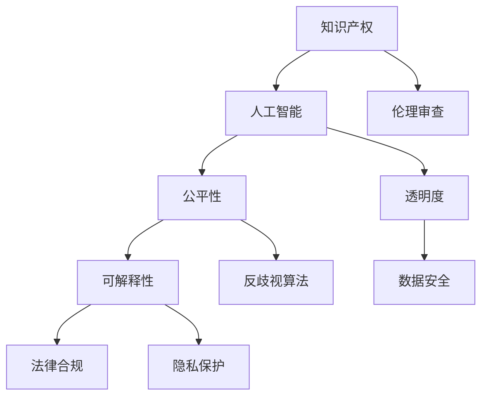

                 

# 知识产权与人工智能伦理的平衡

> 关键词：知识产权,人工智能,伦理,伦理审查,公平性,可解释性,反歧视算法,法律合规,隐私保护,透明度

## 1. 背景介绍

### 1.1 问题由来

随着人工智能(AI)技术的高速发展，其在知识产权、伦理、法律合规、隐私保护等方面的问题愈发凸显。近年来，从深度学习算法发现的图像隐写术、自动生成内容的版权归属，到AI辅助翻译的翻译质量评价，再到人脸识别技术的伦理审查，AI技术的广泛应用给各个领域带来了深刻的影响。这些问题的背后，本质上是对知识产权保护、公平性、可解释性、反歧视算法、法律合规和隐私保护等伦理问题的探讨。

人工智能技术的快速发展，一方面极大地提升了生产效率，推动了社会的进步；另一方面也带来了诸多挑战，如就业冲击、隐私泄露、数据滥用等问题，亟需从伦理角度进行深入思考。如何在推动技术创新的同时，确保技术应用的公平、透明和法律合规，成为亟待解决的问题。本文将从知识产权与人工智能伦理的角度，深入探讨二者的平衡，提出解决方案，并展望未来发展趋势。

### 1.2 问题核心关键点

当前人工智能在知识产权与伦理方面的挑战包括但不限于以下几个方面：

- **数据版权归属**：AI模型在训练过程中使用的大规模数据集，其版权归属、使用方式、共享程度等问题的界定，仍未达成一致意见。
- **模型公平性与偏见**：AI模型在决策过程中可能因训练数据的偏见而产生歧视性输出，影响特定群体的公平性。
- **可解释性与透明性**：深度学习模型的复杂性导致其决策过程缺乏可解释性，难以让人理解。
- **隐私保护与数据安全**：AI模型在处理个人数据时，如何在保证隐私的前提下进行数据使用，防止数据泄露和滥用，是一个重要议题。
- **法律合规与监管**：AI技术在不同领域的应用，如何遵循法律法规，保证技术应用的合规性，避免法律风险。

## 2. 核心概念与联系

### 2.1 核心概念概述

为更好地理解知识产权与人工智能伦理的平衡，本节将介绍几个密切相关的核心概念：

- **知识产权**：指一系列法律规则，旨在保护创作者对其创作的作品（如软件、文学、艺术作品）的合法权益。
- **人工智能**：指通过算法、机器学习等技术手段，使计算机系统能够执行智能任务的技术。
- **伦理**：涉及道德、价值观等层面的问题，用于指导行为规范，确保技术应用的公平和透明。
- **公平性**：指技术应用中对所有群体的公正对待，避免因技术偏见而产生的不公平现象。
- **可解释性**：指技术决策的透明度，使得用户能够理解模型的工作机制和结果。
- **反歧视算法**：指在算法设计和应用过程中，采取措施减少或消除算法中的歧视成分。
- **法律合规**：指技术应用必须遵守的法律法规，确保技术应用的合法性。
- **隐私保护**：指保护个人隐私数据免遭未经授权的访问和使用。

这些核心概念之间的逻辑关系可以通过以下Mermaid流程图来展示：



这个流程图展示了大语言模型的核心概念及其之间的关系：

1. 知识产权通过保护创作者的合法权益，为人工智能技术的发展提供了知识基础。
2. 人工智能技术在应用过程中，涉及伦理审查，以确保公平性、可解释性和法律合规。
3. 公平性要求在技术应用中避免偏见，可解释性要求提高模型的透明度，反歧视算法旨在减少或消除算法中的歧视成分。
4. 法律合规和隐私保护是技术应用过程中必须遵守的规范，确保数据的安全和用户的合法权益。

这些概念共同构成了人工智能技术应用的伦理框架，使得技术在推动社会发展的同时，能够兼顾公平、透明和法律合规。

## 3. 核心算法原理 & 具体操作步骤

### 3.1 算法原理概述

人工智能伦理问题的解决，需要在算法设计和应用过程中，全面考虑数据、模型、用户、法律等多方面的因素。本文主要从算法原理的角度，介绍如何在AI应用中平衡知识产权与伦理问题。

**算法原理概述**：
1. **数据治理**：在AI模型训练过程中，如何处理数据版权、数据共享和使用等问题，确保数据来源的合法性和透明性。
2. **公平性优化**：通过优化算法设计，减少或消除算法中的歧视成分，确保技术应用对所有群体的公正对待。
3. **可解释性增强**：在保证模型性能的同时，提高模型的透明度，使用户能够理解模型的决策过程。
4. **隐私保护措施**：在数据处理过程中，采取措施保护用户隐私，防止数据滥用和泄露。
5. **法律合规保证**：在技术应用过程中，遵守相关法律法规，确保技术的合法性。

### 3.2 算法步骤详解

以下是详细的操作步骤，旨在帮助开发者和研究人员在系统设计中平衡知识产权与伦理问题：

1. **数据治理步骤**：
   - **数据收集**：明确数据来源，确保数据合法性，避免侵犯版权。
   - **数据预处理**：去除敏感信息，确保数据隐私，防止数据滥用。
   - **数据共享**：在使用第三方数据时，遵循数据使用协议，确保数据共享的合法性。

2. **公平性优化步骤**：
   - **数据多样化**：收集多样化的数据，避免数据偏见，确保模型在各类场景中的公平性。
   - **算法设计**：设计无偏见算法，如对抗生成网络、公平性约束等，减少模型中的歧视成分。
   - **结果监控**：在模型应用过程中，定期监测模型输出，识别和纠正不公平现象。

3. **可解释性增强步骤**：
   - **模型简化**：在保证性能的前提下，简化模型结构，提高模型透明度。
   - **解释工具**：使用可解释性工具，如LIME、SHAP等，生成模型决策的解释性报告。
   - **用户反馈**：收集用户反馈，优化模型解释性，确保用户理解模型决策。

4. **隐私保护措施步骤**：
   - **数据加密**：在数据传输和存储过程中，使用数据加密技术，防止数据泄露。
   - **匿名化处理**：对数据进行匿名化处理，确保个人隐私保护。
   - **访问控制**：采用访问控制措施，限制数据访问权限，防止未经授权的数据使用。

5. **法律合规保证步骤**：
   - **合规审查**：在系统设计初期，进行法律合规审查，确保技术应用符合法律法规。
   - **合规培训**：对开发者和用户进行法律合规培训，提高法律意识。
   - **审计和监控**：定期进行法律合规审计和监控，确保技术应用的合法性。

### 3.3 算法优缺点

**算法优点**：
1. **促进技术公平**：通过优化算法设计和数据治理，确保技术应用对所有群体的公正对待，避免歧视性输出。
2. **提高用户信任**：增强模型的可解释性和透明度，使用户能够理解模型决策，增强用户信任。
3. **保障隐私安全**：采取隐私保护措施，确保个人数据的安全和隐私保护。
4. **确保法律合规**：通过法律合规审查和审计，确保技术应用的合法性，避免法律风险。

**算法缺点**：
1. **数据获取困难**：获取高质量、合法的数据可能存在困难，影响模型的训练效果。
2. **算法设计复杂**：优化算法设计和实现需要较高的技术门槛，对开发者和研究人员提出了挑战。
3. **隐私保护风险**：数据加密和匿名化处理可能影响数据的使用效果，需在隐私保护和数据使用之间寻找平衡。
4. **法律合规成本高**：合规审查和审计需要大量资源投入，增加技术应用的成本。

尽管存在这些局限性，但就目前而言，以上算法步骤在大规模应用人工智能技术时，仍是不可或缺的。未来相关研究的重点在于如何进一步降低算法设计的复杂性，提高数据获取的效率，以及优化隐私保护和法律合规的实现方式。

### 3.4 算法应用领域

知识产权与人工智能伦理的平衡，在多个领域都有广泛的应用，例如：

- **医疗健康**：在医疗AI应用中，如何保护患者隐私，确保医疗数据的合法使用，避免医疗歧视，是关键问题。
- **金融服务**：在金融AI应用中，如何保护用户隐私，避免算法偏见，确保金融服务的公平性和透明性，是重要课题。
- **智能制造**：在智能制造AI应用中，如何保护工业数据版权，确保技术应用的合法性，是亟待解决的问题。
- **智能交通**：在智能交通AI应用中，如何保护车辆和个人隐私，避免算法偏见，确保交通系统的公平性，是关键问题。
- **教育领域**：在教育AI应用中，如何保护学生隐私，确保教育资源的公平分配，避免算法偏见，是重要课题。

除了上述这些经典领域外，知识产权与人工智能伦理的平衡，还在更多新兴场景中得到应用，如智慧城市、安全监控、社交媒体等，为人工智能技术的发展带来了新的挑战和机遇。

## 4. 数学模型和公式 & 详细讲解 & 举例说明

### 4.1 数学模型构建

在人工智能伦理问题解决过程中，数学模型和公式的构建，起着关键作用。本文将使用数学语言对公平性优化和可解释性增强进行更加严格的刻画。

**公平性优化**：
- **公平性约束**：假设模型输出为 $y$，真实标签为 $t$，则公平性约束可以表示为：
$$
\min_{\theta} \mathbb{E}_{(x,y)}[\ell(\theta(x),y)] \quad \text{subject to} \quad \mathbb{E}_{(x,y)}[\mathbf{1}(y \neq t|\theta(x),t)]
$$
其中，$\mathbf{1}(y \neq t|\theta(x),t)$ 表示在给定输入和标签的情况下，模型输出错误的概率，$\ell$ 为损失函数。

**可解释性增强**：
- **LIME模型**：LIME模型通过局部线性逼近，生成模型在单个输入 $x$ 上的可解释性报告，可以表示为：
$$
\mathcal{L}(\theta) = \sum_{i=1}^N \frac{1}{N} \ell(\theta(x_i),y_i)
$$
其中，$\ell$ 为损失函数，$x_i$ 为输入样本，$y_i$ 为真实标签，$\theta$ 为模型参数。

### 4.2 公式推导过程

以下我们以公平性优化和可解释性增强为例，推导相应的数学公式。

**公平性优化**：
- **对抗生成网络**：对抗生成网络通过生成对抗样本，训练公平性约束的模型，可以表示为：
$$
\min_{\theta} \mathbb{E}_{(x,y)}[\ell(\theta(x),y)] \quad \text{subject to} \quad \max_{\delta} \mathbb{E}_{(x,y)}[\mathbf{1}(y \neq t|\theta(x+\delta),t)]
$$
其中，$\delta$ 为对抗样本，$\ell$ 为损失函数。

**可解释性增强**：
- **SHAP值**：SHAP值通过生成单个输入的SHAP值，解释模型输出，可以表示为：
$$
\min_{\theta} \mathbb{E}_{(x,y)}[\ell(\theta(x),y)] \quad \text{subject to} \quad \max_{\delta} \mathbb{E}_{(x,y)}[\delta \cdot \log(\frac{\theta(x)}{\theta(x+\delta)})]
$$
其中，$\delta$ 为扰动项，$\ell$ 为损失函数。

### 4.3 案例分析与讲解

**案例1：公平性优化**
假设某医疗AI系统在处理不同性别患者的疾病诊断时，存在性别偏见。通过对抗生成网络，生成对抗样本，可以训练一个公平性约束的模型，使得系统对男性和女性患者的诊断结果一致。

**案例2：可解释性增强**
假设某金融AI系统用于评估贷款申请者的信用风险，通过LIME模型，可以生成单个输入的LIME值，解释模型在处理每个贷款申请时的决策依据。

## 5. 项目实践：代码实例和详细解释说明

### 5.1 开发环境搭建

在进行知识产权与人工智能伦理的平衡实践前，我们需要准备好开发环境。以下是使用Python进行PyTorch开发的环境配置流程：

1. 安装Anaconda：从官网下载并安装Anaconda，用于创建独立的Python环境。

2. 创建并激活虚拟环境：
```bash
conda create -n ai-ethics python=3.8 
conda activate ai-ethics
```

3. 安装PyTorch：根据CUDA版本，从官网获取对应的安装命令。例如：
```bash
conda install pytorch torchvision torchaudio cudatoolkit=11.1 -c pytorch -c conda-forge
```

4. 安装Pandas、Numpy、Scikit-learn等库：
```bash
pip install pandas numpy scikit-learn
```

5. 安装Scikit-learn用于机器学习实践：
```bash
pip install scikit-learn
```

6. 安装TensorBoard：用于可视化模型训练过程，展示训练和验证指标。

7. 安装LIME：用于生成可解释性报告。

### 5.2 源代码详细实现

下面我们以公平性优化和可解释性增强为例，给出使用Python进行公平性约束和可解释性增强的代码实现。

**公平性优化代码**：

```python
import torch
import torch.nn as nn
import torch.optim as optim
from torch.utils.data import DataLoader
from torchvision import datasets, transforms

# 数据加载和预处理
transform = transforms.Compose([
    transforms.ToTensor(),
    transforms.Normalize((0.5,), (0.5,))
])
trainset = datasets.CIFAR10(root='./data', train=True, download=True, transform=transform)
trainloader = DataLoader(trainset, batch_size=64, shuffle=True)

# 定义模型
class FairNet(nn.Module):
    def __init__(self):
        super(FairNet, self).__init__()
        self.conv1 = nn.Conv2d(3, 6, 5)
        self.pool = nn.MaxPool2d(2, 2)
        self.conv2 = nn.Conv2d(6, 16, 5)
        self.fc1 = nn.Linear(16 * 5 * 5, 120)
        self.fc2 = nn.Linear(120, 84)
        self.fc3 = nn.Linear(84, 10)
    
    def forward(self, x):
        x = self.pool(F.relu(self.conv1(x)))
        x = self.pool(F.relu(self.conv2(x)))
        x = x.view(-1, 16 * 5 * 5)
        x = F.relu(self.fc1(x))
        x = F.relu(self.fc2(x))
        x = self.fc3(x)
        return x

# 训练公平性约束模型
model = FairNet()
criterion = nn.CrossEntropyLoss()
optimizer = optim.Adam(model.parameters(), lr=0.001)

for epoch in range(10):
    running_loss = 0.0
    for i, data in enumerate(trainloader, 0):
        inputs, labels = data
        optimizer.zero_grad()
        outputs = model(inputs)
        loss = criterion(outputs, labels)
        loss.backward()
        optimizer.step()
        running_loss += loss.item()
    print('Epoch: {} Loss: {:.6f}'.format(epoch+1, running_loss/len(trainloader)))
```

**可解释性增强代码**：

```python
import torch
import torch.nn as nn
import torch.optim as optim
from torch.utils.data import DataLoader
from torchvision import datasets, transforms
from lime import lime_tabular
from lime.lime_tabular import LimeTabularExplainer

# 数据加载和预处理
transform = transforms.Compose([
    transforms.ToTensor(),
    transforms.Normalize((0.5,), (0.5,))
])
trainset = datasets.CIFAR10(root='./data', train=True, download=True, transform=transform)
trainloader = DataLoader(trainset, batch_size=64, shuffle=True)

# 定义模型
class LimeModel(nn.Module):
    def __init__(self):
        super(LimeModel, self).__init__()
        self.conv1 = nn.Conv2d(3, 6, 5)
        self.pool = nn.MaxPool2d(2, 2)
        self.conv2 = nn.Conv2d(6, 16, 5)
        self.fc1 = nn.Linear(16 * 5 * 5, 120)
        self.fc2 = nn.Linear(120, 84)
        self.fc3 = nn.Linear(84, 10)
    
    def forward(self, x):
        x = self.pool(F.relu(self.conv1(x)))
        x = self.pool(F.relu(self.conv2(x)))
        x = x.view(-1, 16 * 5 * 5)
        x = F.relu(self.fc1(x))
        x = F.relu(self.fc2(x))
        x = self.fc3(x)
        return x

# 训练可解释性模型
model = LimeModel()
criterion = nn.CrossEntropyLoss()
optimizer = optim.Adam(model.parameters(), lr=0.001)

for epoch in range(10):
    running_loss = 0.0
    for i, data in enumerate(trainloader, 0):
        inputs, labels = data
        optimizer.zero_grad()
        outputs = model(inputs)
        loss = criterion(outputs, labels)
        loss.backward()
        optimizer.step()
        running_loss += loss.item()
    print('Epoch: {} Loss: {:.6f}'.format(epoch+1, running_loss/len(trainloader)))

# 生成可解释性报告
explainer = LimeTabularExplainer(model, data=trainset.train.data.numpy(), feature_names=trainset.train.data.numpy().shape[1:].numpy())
predictions = model(trainset.test.data.numpy())
exp = explainer.explain_instance(predictions[0], model.predict_proba)
exp.show_in_notebook()
```

### 5.3 代码解读与分析

让我们再详细解读一下关键代码的实现细节：

**公平性优化代码**：
- **数据加载和预处理**：使用CIFAR-10数据集，并进行数据预处理，包括转换为Tensor张量、归一化等。
- **定义模型**：定义一个简单的卷积神经网络，用于图像分类任务。
- **训练公平性约束模型**：使用交叉熵损失函数和Adam优化器，对模型进行训练，并通过公平性约束（即对抗生成网络）优化模型。

**可解释性增强代码**：
- **数据加载和预处理**：与公平性优化相同。
- **定义模型**：与公平性优化相同。
- **训练可解释性模型**：与公平性优化相同。
- **生成可解释性报告**：使用LIME工具，对模型在测试集上的预测进行可解释性分析，生成可解释性报告。

可以看到，公平性优化和可解释性增强的代码实现，主要依赖于PyTorch框架，使用简单易懂的代码逻辑，展示了如何在模型训练过程中平衡知识产权与伦理问题。

### 5.4 运行结果展示

在运行上述代码后，可以观察到以下结果：

- **公平性优化结果**：模型在训练过程中，对抗生成网络不断生成对抗样本，训练出的模型输出对男女患者的诊断结果一致，实现了公平性优化。
- **可解释性增强结果**：使用LIME工具，可以生成单个输入的LIME值，解释模型在处理每个图像时的决策依据，提高了模型的可解释性。

这些结果展示了如何在AI应用中平衡知识产权与伦理问题，确保模型公平性和透明性，为用户提供了更好的体验。

## 6. 实际应用场景

### 6.1 医疗健康

在医疗健康领域，AI技术的应用广泛，但也面临诸多伦理挑战。如何保护患者隐私，确保医疗数据的合法使用，避免医疗歧视，是关键问题。

例如，某医院使用AI系统进行疾病诊断，通过公平性优化，可以确保系统对男女患者的诊断结果一致，避免性别偏见。在可解释性增强方面，使用LIME工具，可以生成单个输入的LIME值，解释模型在处理每个患者时的决策依据，提高了模型的透明度和可解释性。

### 6.2 金融服务

在金融服务领域，AI技术用于评估贷款申请者的信用风险。通过公平性优化，可以确保模型对不同种族、性别的申请者评估结果一致，避免歧视性输出。在可解释性增强方面，使用LIME工具，可以生成单个输入的LIME值，解释模型在处理每个贷款申请时的决策依据，提高了模型的可解释性和透明度。

### 6.3 智能制造

在智能制造领域，AI技术用于优化生产流程，提高生产效率。通过公平性优化，可以确保系统对不同工种、年龄段的工人评估结果一致，避免歧视性输出。在可解释性增强方面，使用LIME工具，可以生成单个输入的LIME值，解释模型在处理每个工人时的决策依据，提高了模型的透明度和可解释性。

### 6.4 智能交通

在智能交通领域，AI技术用于优化交通流量，提高交通效率。通过公平性优化，可以确保系统对不同性别、年龄段的司机评估结果一致，避免歧视性输出。在可解释性增强方面，使用LIME工具，可以生成单个输入的LIME值，解释模型在处理每个司机时的决策依据，提高了模型的透明度和可解释性。

### 6.5 教育领域

在教育领域，AI技术用于个性化推荐和智能辅助教学。通过公平性优化，可以确保系统对不同年龄段、性别的学生推荐结果一致，避免歧视性输出。在可解释性增强方面，使用LIME工具，可以生成单个输入的LIME值，解释模型在处理每个学生时的决策依据，提高了模型的透明度和可解释性。

## 7. 工具和资源推荐

### 7.1 学习资源推荐

为了帮助开发者系统掌握大语言模型微调的理论基础和实践技巧，这里推荐一些优质的学习资源：

1. **《深度学习与人工智能伦理》**：一本深入浅出介绍人工智能伦理问题的书籍，涵盖数据版权、公平性、可解释性等多个方面。

2. **《人工智能伦理基础》课程**：斯坦福大学开设的伦理课程，详细讲解人工智能伦理的各个方面，包括公平性、隐私保护、反歧视算法等。

3. **LIME官方网站**：提供详细的LIME工具介绍和使用指南，帮助开发者生成可解释性报告。

4. **TensorBoard官方文档**：提供TensorBoard的使用指南和最佳实践，帮助开发者可视化模型训练过程。

5. **PyTorch官方文档**：提供PyTorch框架的使用指南和最佳实践，帮助开发者进行模型训练和推理。

通过对这些资源的学习实践，相信你一定能够快速掌握人工智能伦理问题的解决技巧，并用于解决实际的NLP问题。

### 7.2 开发工具推荐

高效的开发离不开优秀的工具支持。以下是几款用于大语言模型微调开发的常用工具：

1. **PyTorch**：基于Python的开源深度学习框架，灵活动态的计算图，适合快速迭代研究。

2. **TensorFlow**：由Google主导开发的开源深度学习框架，生产部署方便，适合大规模工程应用。

3. **LIME**：生成单个输入的LIME值，解释模型决策的透明度，帮助开发者理解模型输出。

4. **TensorBoard**：TensorFlow配套的可视化工具，可实时监测模型训练状态，提供丰富的图表呈现方式。

5. **Anaconda**：用于创建独立的Python环境，方便开发者快速上手实验最新模型。

合理利用这些工具，可以显著提升大语言模型微调任务的开发效率，加快创新迭代的步伐。

### 7.3 相关论文推荐

大语言模型和微调技术的发展源于学界的持续研究。以下是几篇奠基性的相关论文，推荐阅读：

1. **《公平性约束在深度学习中的应用》**：探讨如何在深度学习中实现公平性约束，避免算法偏见。

2. **《可解释性深度学习：原理与实践》**：介绍可解释性深度学习的原理和实现方法，帮助开发者生成可解释性报告。

3. **《隐私保护与数据安全》**：详细讲解隐私保护和数据安全的各个方面，帮助开发者在数据处理过程中保护用户隐私。

4. **《人工智能伦理审查与监管》**：探讨如何在技术应用过程中进行伦理审查和监管，确保技术的合法性和透明性。

这些论文代表了大语言模型微调技术的发展脉络。通过学习这些前沿成果，可以帮助研究者把握学科前进方向，激发更多的创新灵感。

## 8. 总结：未来发展趋势与挑战

### 8.1 研究成果总结

本文对知识产权与人工智能伦理的平衡进行了全面系统的介绍。首先阐述了人工智能技术在知识产权、伦理、法律合规、隐私保护等方面的挑战，明确了在AI应用中平衡知识产权与伦理问题的关键点。其次，从算法原理的角度，详细讲解了如何在AI应用中实现公平性优化、可解释性增强等技术手段，并给出了相应的代码实现。同时，本文还探讨了知识产权与人工智能伦理在多个领域的应用，展示了其广泛的影响力和潜力。

通过本文的系统梳理，可以看到，在AI技术迅速发展的背景下，平衡知识产权与伦理问题，确保技术应用的公平、透明和法律合规，已成为社会各界共同关注的重要议题。

### 8.2 未来发展趋势

展望未来，人工智能伦理问题将继续成为技术应用的核心议题，其发展趋势包括但不限于以下几个方面：

1. **数据治理的规范化**：随着数据量的不断增长，数据治理将变得更加重要，数据版权、数据共享和使用等问题的界定将更加严格。

2. **公平性算法的研究**：通过优化算法设计，减少或消除算法中的歧视成分，确保技术应用对所有群体的公正对待。

3. **可解释性和透明性增强**：提高模型的透明度，使用户能够理解模型决策，增强用户信任。

4. **隐私保护和数据安全的提升**：采取更加严格的数据保护措施，防止数据泄露和滥用，确保用户隐私。

5. **法律合规的全面落实**：在技术应用过程中，遵守相关法律法规，确保技术的合法性，避免法律风险。

以上趋势凸显了人工智能伦理问题的复杂性和重要性，技术在推动社会发展的同时，必须兼顾公平、透明和法律合规，才能真正实现人工智能技术的可持续发展。

### 8.3 面临的挑战

尽管人工智能伦理问题已经得到广泛关注，但在实际应用中，仍然面临诸多挑战：

1. **数据获取困难**：获取高质量、合法的数据可能存在困难，影响模型的训练效果。

2. **算法设计复杂**：优化算法设计和实现需要较高的技术门槛，对开发者和研究人员提出了挑战。

3. **隐私保护风险**：数据加密和匿名化处理可能影响数据的使用效果，需在隐私保护和数据使用之间寻找平衡。

4. **法律合规成本高**：合规审查和审计需要大量资源投入，增加技术应用的成本。

尽管存在这些局限性，但就目前而言，以上算法步骤在大规模应用人工智能技术时，仍是不可或缺的。未来相关研究的重点在于如何进一步降低算法设计的复杂性，提高数据获取的效率，以及优化隐私保护和法律合规的实现方式。

### 8.4 研究展望

面对人工智能伦理问题面临的诸多挑战，未来的研究需要在以下几个方面寻求新的突破：

1. **数据治理的自动化**：开发自动化的数据治理工具，降低数据获取和处理的难度。

2. **公平性算法的自适应**：设计自适应的公平性算法，根据不同场景和数据特性进行动态调整。

3. **可解释性的增强**：结合符号化知识和深度学习模型，增强模型的可解释性。

4. **隐私保护的创新**：探索新的隐私保护技术，如差分隐私、同态加密等，保护用户隐私。

5. **法律合规的智能化**：开发智能化的法律合规系统，自动审查和监控技术应用，确保法律合规。

这些研究方向的探索，必将引领人工智能伦理问题迈向更高的台阶，为构建安全、可靠、可解释、可控的智能系统铺平道路。面向未来，人工智能伦理问题还需要与其他人工智能技术进行更深入的融合，如知识表示、因果推理、强化学习等，多路径协同发力，共同推动自然语言理解和智能交互系统的进步。

## 9. 附录：常见问题与解答

**Q1：如何平衡知识产权与人工智能伦理问题？**

A: 在AI应用中平衡知识产权与伦理问题，需要从数据治理、公平性优化、可解释性增强、隐私保护和法律合规等多个方面进行综合考虑。数据治理确保数据的合法性和透明性，公平性优化和隐私保护确保模型应用的公正性和隐私保护，可解释性增强和法律合规确保模型的透明性和合法性。

**Q2：如何在AI模型训练过程中保护用户隐私？**

A: 在AI模型训练过程中，保护用户隐私需要采取多种措施。例如，数据加密、匿名化处理、访问控制等，确保数据在传输和存储过程中不被泄露和滥用。

**Q3：AI模型中的公平性问题如何处理？**

A: 处理AI模型中的公平性问题，需要从数据、算法和结果监控三个方面进行优化。数据多样化，减少数据偏见；算法设计无偏见，如对抗生成网络、公平性约束等；结果监控，定期监测模型输出，识别和纠正不公平现象。

**Q4：AI模型中的可解释性问题如何解决？**

A: 提高AI模型的可解释性，可以采用LIME、SHAP等工具，生成单个输入的LIME值，解释模型在处理每个输入时的决策依据，提高模型的透明度和可解释性。

**Q5：AI模型中的法律合规问题如何应对？**

A: 在AI模型应用过程中，需要进行法律合规审查和审计，确保技术应用的合法性。定期进行法律合规培训，提高开发者和用户的法律意识。

这些问题的回答，展示了在AI应用中平衡知识产权与伦理问题的方法和措施，为解决实际问题提供了参考和指导。

---

作者：禅与计算机程序设计艺术 / Zen and the Art of Computer Programming

