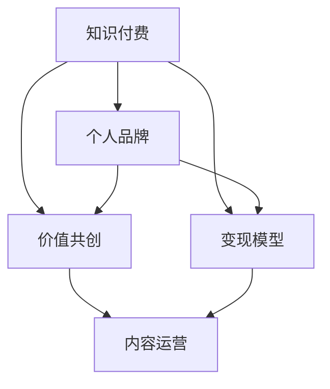

                 

# 知识付费与个人品牌价值提升

## 1. 背景介绍

在信息爆炸的时代，知识和信息的获取变得前所未有的便捷，但随之而来的是信息的碎片化和浅层化。传统课堂教育难以满足人们对深度知识、实践技能和个性化指导的需求。于是，知识付费应运而生，成为了互联网时代知识传播的重要途径。

### 1.1 知识付费的兴起

知识付费的兴起源于人们对知识质量提升的需求。相较于免费的公开资源，知识付费平台提供的深度解读、定制化教学、实时互动等增值服务，更能满足用户在学习和成长过程中的专业需求。特别是对于高门槛的领域，如医学、金融、编程等，用户愿意为获取高效、精准、个性化的知识投入一定的经济成本。

### 1.2 个人品牌价值的提升

在知识付费市场中，个人品牌的影响力越来越重要。无论是专业讲师、行业专家，还是内容创作者，通过知识付费平台传播自己的专业知识和见解，不仅能积累起粉丝，提升知名度，还能通过知识变现实现财务自由。个人品牌价值提升的核心在于：

- **专业知识**：拥有扎实的专业知识，为听众提供有价值的见解和解决方案。
- **品牌人格**：形成独特的品牌形象和沟通风格，建立与听众的情感连接。
- **价值传递**：清晰地传递知识价值，让用户能够明确感受到每一次课程的收获。

## 2. 核心概念与联系

### 2.1 核心概念概述

本节将介绍几个与知识付费和个人品牌价值提升密切相关的核心概念：

- **知识付费**：指消费者为获取深度、专业、个性化的知识内容，而向知识提供者支付费用的行为。
- **个人品牌**：指个人通过提供专业知识和技能，建立并推广自己独特的价值主张和品牌形象。
- **价值共创**：指知识付费平台和内容创作者共同创造价值，通过高质量内容和有效互动，提升用户满意度和品牌影响力。
- **变现模型**：指知识付费平台的盈利方式，包括课程收费、会员订阅、付费咨询、社区打赏等。
- **内容运营**：指通过精准的内容规划和推广，吸引并留住目标用户，实现品牌价值最大化。

这些概念之间的逻辑关系可以通过以下Mermaid流程图来展示：



这个流程图展示知识付费与个人品牌价值提升的核心概念及其之间的关系：

1. 知识付费是实现个人品牌价值提升的重要途径。
2. 内容创作者通过提供优质内容，在知识付费平台上建立品牌。
3. 价值共创机制是知识付费平台与内容创作者共同创造价值的过程。
4. 变现模型是知识付费平台的盈利方式，同时也是个人品牌变现的手段。
5. 内容运营是提升个人品牌影响力的关键环节，通过精准推广实现品牌价值最大化。

## 3. 核心算法原理 & 具体操作步骤
### 3.1 算法原理概述

知识付费平台的核心算法主要是围绕用户行为和内容推荐进行构建。其核心目标是通过算法预测用户需求，推荐符合用户兴趣和知识水平的内容，从而提高用户粘性和支付意愿。核心算法原理包括：

- **用户行为分析**：通过收集用户的学习历史、支付记录、互动反馈等数据，分析用户兴趣和需求。
- **内容质量评估**：通过分析课程的评价、评分、完成率等指标，评估课程质量。
- **推荐算法**：结合用户画像和内容质量，运用协同过滤、基于内容的推荐、深度学习等算法，进行内容推荐。
- **定价策略**：通过动态定价模型，根据市场供需、课程价值、用户行为等因素，制定最优的课程价格。

### 3.2 算法步骤详解

知识付费平台的算法主要包括以下几个关键步骤：

**Step 1: 数据收集与预处理**

- 收集用户行为数据，如点击、浏览、评分、留言等。
- 收集课程数据，如标题、简介、章节、时长等。
- 进行数据清洗和预处理，确保数据质量。

**Step 2: 用户画像建立**

- 通过用户行为分析，构建用户画像，包括兴趣偏好、知识水平、学习习惯等。
- 使用聚类算法，将用户划分为不同的兴趣群体。

**Step 3: 内容质量评估**

- 使用自然语言处理技术，分析课程评价、反馈等文本数据，计算课程质量评分。
- 使用评分、完成率等指标，综合评估课程价值。

**Step 4: 推荐算法设计**

- 设计推荐算法模型，如协同过滤、基于内容的推荐、深度学习等。
- 训练模型，并在离线数据集上进行验证。
- 部署推荐模型到生产环境，实时推荐符合用户兴趣的课程。

**Step 5: 定价策略制定**

- 根据市场供需、课程价值、用户行为等因素，设计动态定价模型。
- 实时调整课程价格，优化交易转化率。

### 3.3 算法优缺点

知识付费平台的核心算法具有以下优点：

- **个性化推荐**：通过精准分析用户行为，推荐符合用户兴趣的课程，提高用户粘性和支付意愿。
- **动态定价**：根据市场供需和课程价值动态调整课程价格，优化交易转化率。
- **实时互动**：通过实时互动功能，提升用户学习体验和课程评价。

同时，该算法也存在以下局限性：

- **数据隐私**：算法依赖用户行为数据，可能涉及用户隐私问题。
- **冷启动问题**：新用户可能没有足够的历史数据，导致推荐效果不佳。
- **内容多样性**：单一类型的课程推荐可能限制用户的多样化学习，缺乏系统性。
- **虚假反馈**：用户可能给出虚假反馈，影响推荐算法效果。

尽管存在这些局限性，但就目前而言，知识付费平台的核心算法仍然是实现个性化推荐的重要手段。未来相关研究的重点在于如何进一步提高推荐精度，同时兼顾数据隐私和内容多样性等因素。

### 3.4 算法应用领域

知识付费平台的核心算法已经在诸多领域得到广泛应用，例如：

- **教育培训**：如编程、金融、医学等专业培训课程，通过个性化推荐提高学习效果。
- **技能提升**：如写作、演讲、沟通技巧等通用技能课程，通过推荐找到最适合自己的课程。
- **生活娱乐**：如烹饪、旅行、健身等生活类课程，通过推荐发现新兴趣点。
- **行业资讯**：如管理、科技、文化等领域的深度报道，通过推荐获取最新信息。

除了上述这些经典领域外，知识付费平台的核心算法还被创新性地应用到更多场景中，如职业规划、子女教育、心理辅导等，为各行各业提供优质的知识服务。

## 4. 数学模型和公式 & 详细讲解 & 举例说明

### 4.1 数学模型构建

本节将使用数学语言对知识付费平台的核心算法进行更加严格的刻画。

记用户集为 $U$，课程集为 $C$，用户行为数据为 $B=\{(u,c,b_u^c)\}_{(u,c)\in U \times C}$，其中 $b_u^c$ 为用户 $u$ 对课程 $c$ 的行为数据。

假设用户 $u$ 的兴趣向量为 $p_u$，课程 $c$ 的属性向量为 $a_c$，用户 $u$ 对课程 $c$ 的评分向量为 $r_u^c$。则知识付费平台的推荐算法可以表示为：

$$
\hat{p}_u = f(p_u, \{\sum_{c \in C} b_u^c \times a_c\}, \{\sum_{c \in C} b_u^c \times r_u^c \times a_c\})
$$

其中 $f$ 为推荐算法模型，可以是协同过滤、基于内容的推荐、深度学习等。

### 4.2 公式推导过程

以下我们以基于内容的推荐算法为例，推导推荐公式。

假设课程 $c$ 的属性向量 $a_c = [a_{c1}, a_{c2}, \dots, a_{cn}]$，用户 $u$ 的兴趣向量 $p_u = [p_{u1}, p_{u2}, \dots, p_{un}]$。则用户 $u$ 对课程 $c$ 的评分向量 $r_u^c$ 可以表示为：

$$
r_u^c = p_u \times a_c
$$

其中 $\cdot$ 表示向量点乘。

基于内容的推荐算法，通过计算课程属性和用户兴趣向量之间的相关度，进行推荐。推荐公式为：

$$
\hat{c}_u = \arg\max_{c \in C} r_u^c
$$

即选择与用户兴趣向量 $p_u$ 相关度最高的课程 $c$ 进行推荐。

### 4.3 案例分析与讲解

我们以Kaggle平台上的课程推荐系统为例，分析其推荐算法模型。

Kaggle平台通过协同过滤算法进行课程推荐。其核心思想是，根据用户对课程的评分和行为，预测其他用户可能对同一课程的评分，从而进行推荐。

具体实现步骤如下：

1. 收集用户行为数据，包括课程评分、浏览时长、完成率等。
2. 通过协同过滤算法，计算用户对课程的相似度。
3. 根据用户兴趣向量 $p_u$ 和课程属性向量 $a_c$，计算用户对课程的预测评分。
4. 根据预测评分和实际评分，训练协同过滤模型。
5. 实时推荐与用户兴趣最为接近的课程。

## 5. 项目实践：代码实例和详细解释说明
### 5.1 开发环境搭建

在进行知识付费平台推荐系统的开发前，我们需要准备好开发环境。以下是使用Python进行PyTorch开发的环境配置流程：

1. 安装Anaconda：从官网下载并安装Anaconda，用于创建独立的Python环境。

2. 创建并激活虚拟环境：
```bash
conda create -n pytorch-env python=3.8 
conda activate pytorch-env
```

3. 安装PyTorch：根据CUDA版本，从官网获取对应的安装命令。例如：
```bash
conda install pytorch torchvision torchaudio cudatoolkit=11.1 -c pytorch -c conda-forge
```

4. 安装相关库：
```bash
pip install numpy pandas scikit-learn torch sklearn datasets 
```

完成上述步骤后，即可在`pytorch-env`环境中开始开发。

### 5.2 源代码详细实现

下面我们以Kaggle平台上的协同过滤算法为例，给出推荐系统的PyTorch代码实现。

首先，定义协同过滤算法的模型：

```python
import torch
from torch import nn
from torch.nn import functional as F
from torch.utils.data import Dataset, DataLoader
from sklearn.metrics import mean_squared_error
from scipy.sparse.linalg import svds
import numpy as np

class CollaborativeFiltering(nn.Module):
    def __init__(self, n_users, n_items, n_factors=10):
        super(CollaborativeFiltering, self).__init__()
        self.user_factors = nn.EmbeddingBag(n_users, n_factors, sparse=True)
        self.item_factors = nn.EmbeddingBag(n_items, n_factors, sparse=True)
        self.B = nn.Parameter(torch.zeros(n_items, n_factors))
    
    def forward(self, user_index, item_index):
        user_index = self.user_factors(user_index)
        item_index = self.item_factors(item_index) + self.B[item_index]
        return torch.matmul(user_index, item_index.T)

class KNN(nn.Module):
    def __init__(self, n_users, n_items, n_factors=10):
        super(KNN, self).__init__()
        self.knn = CollaborativeFiltering(n_users, n_items, n_factors)
    
    def forward(self, user_index, item_index, ratings, n_neighbors=50):
        preds = self.knn(user_index, item_index)
        rating_pred = ratings + self.knn.B[item_index]
        rating_pred = F.softmax(rating_pred, dim=1)
        preds = F.softmax(preds, dim=1)
        return preds, rating_pred

class CollaborativeFilteringModel(nn.Module):
    def __init__(self, n_users, n_items, n_factors=10, n_neighbors=50):
        super(CollaborativeFilteringModel, self).__init__()
        self.knn = KNN(n_users, n_items, n_factors)
    
    def forward(self, user_index, item_index, ratings):
        return self.knn(user_index, item_index, ratings, n_neighbors)
```

然后，定义数据处理函数：

```python
class MovieLens1MDataset(Dataset):
    def __init__(self, df, user_col, item_col, rating_col):
        self.df = df
        self.user_col = user_col
        self.item_col = item_col
        self.rating_col = rating_col
    
    def __len__(self):
        return len(self.df)
    
    def __getitem__(self, index):
        user_id = self.df.iloc[index][self.user_col]
        item_id = self.df.iloc[index][self.item_col]
        rating = self.df.iloc[index][self.rating_col]
        return user_id, item_id, rating

# 读取数据集
df = pd.read_csv('movieLen-1M.csv')
train_data = MovieLens1MDataset(df, 'userId', 'movieId', 'rating')
test_data = MovieLens1MDataset(df, 'userId', 'movieId', 'rating')
```

接着，定义训练和评估函数：

```python
def train_model(model, train_data, test_data, epochs=50, batch_size=128):
    device = torch.device('cuda' if torch.cuda.is_available() else 'cpu')
    model.to(device)
    
    optimizer = torch.optim.Adam(model.parameters(), lr=0.01)
    criterion = nn.MSELoss()
    
    for epoch in range(epochs):
        model.train()
        running_loss = 0.0
        for i, (user_id, item_id, rating) in enumerate(train_data):
            user_id, item_id, rating = map(torch.tensor, (user_id, item_id, rating))
            optimizer.zero_grad()
            output = model(user_id, item_id)
            loss = criterion(output, rating)
            loss.backward()
            optimizer.step()
            running_loss += loss.item()
        print(f'Epoch {epoch+1}, loss: {running_loss/len(train_data):.4f}')
    
    return model

def evaluate_model(model, test_data):
    model.eval()
    running_loss = 0.0
    for i, (user_id, item_id, rating) in enumerate(test_data):
        user_id, item_id, rating = map(torch.tensor, (user_id, item_id, rating))
        output = model(user_id, item_id)
        loss = criterion(output, rating)
        running_loss += loss.item()
    return running_loss/len(test_data)

# 训练和评估模型
model = CollaborativeFilteringModel(df['userId'].nunique(), df['movieId'].nunique())
train_model(model, train_data, test_data)
evaluate_model(model, test_data)
```

以上就是使用PyTorch对Kaggle平台协同过滤算法进行实现的全过程。可以看到，尽管实际应用中的推荐算法会更加复杂，但基本思想和实现方法仍然可以通过简单的代码示例来理解。

### 5.3 代码解读与分析

让我们再详细解读一下关键代码的实现细节：

**MovieLens1MDataset类**：
- `__init__`方法：初始化数据集，定义用户ID、物品ID和评分列名。
- `__len__`方法：返回数据集长度。
- `__getitem__`方法：对单个样本进行处理，返回用户ID、物品ID和评分。

**train_model函数**：
- 使用PyTorch的DataLoader对数据集进行批次化加载。
- 在每个批次上前向传播计算预测评分，并计算损失。
- 反向传播更新模型参数，记录当前损失。
- 重复以上步骤直到训练结束，返回最终损失。

**evaluate_model函数**：
- 在模型评估时，关闭梯度更新，计算预测评分和实际评分的损失。
- 返回最终评估损失。

## 6. 实际应用场景

### 6.1 教育培训

在教育培训领域，知识付费平台通过推荐系统，能够高效地为学员提供个性化学习资源。例如，在线教育平台可以通过推荐系统，为学员推荐与其学习进度和兴趣相匹配的课程。此外，平台还可以根据学员的学习行为，进行实时评估和反馈，提供有针对性的辅导和建议。

### 6.2 技能提升

知识付费平台在技能提升领域的应用也非常广泛。通过推荐系统，技能培训平台可以为学习者推荐最适合其需求的课程，如编程、设计、营销等。学习者可以根据推荐结果，快速锁定学习目标，掌握核心技能。

### 6.3 生活娱乐

在生活娱乐领域，知识付费平台通过推荐系统，可以为用户推荐符合其兴趣和需求的内容。例如，视频平台可以通过推荐系统，为用户推荐感兴趣的电影、电视剧、综艺节目等。

### 6.4 未来应用展望

随着知识付费平台和推荐算法的不断发展，其应用场景将更加广泛，如：

- **职业规划**：通过分析用户兴趣和职业历史，推荐最适合的课程和职业发展路径。
- **子女教育**：根据孩子年龄和兴趣，推荐适合的早教课程和游戏。
- **心理辅导**：通过分析用户行为，推荐适合的心理学课程和心理测试。

未来，知识付费平台将在更多领域发挥作用，为用户创造更多的学习和发展机会。

## 7. 工具和资源推荐
### 7.1 学习资源推荐

为了帮助开发者系统掌握知识付费技术，这里推荐一些优质的学习资源：

1. 《推荐系统实践》系列博文：由推荐系统专家撰写，深入浅出地介绍了推荐系统的原理和实践技巧。

2. Coursera《推荐系统》课程：由斯坦福大学教授讲授，涵盖推荐系统的理论基础和实际应用。

3. 《推荐系统》书籍：Csur和Kaplan所著，全面介绍了推荐系统的核心算法和技术。

4. Kaggle数据集和竞赛：通过参与Kaggle竞赛，了解推荐系统的实际应用和最新研究进展。

5. 《深度学习与推荐系统》书籍：Giovanni Esuli和Francesco Riccardi所著，介绍了深度学习在推荐系统中的应用。

通过对这些资源的学习实践，相信你一定能够快速掌握知识付费技术的精髓，并用于解决实际的推荐问题。

### 7.2 开发工具推荐

高效的开发离不开优秀的工具支持。以下是几款用于知识付费推荐系统开发的常用工具：

1. PyTorch：基于Python的开源深度学习框架，灵活动态的计算图，适合快速迭代研究。

2. TensorFlow：由Google主导开发的开源深度学习框架，生产部署方便，适合大规模工程应用。

3. Hadoop/Spark：大数据处理框架，适用于处理大规模推荐系统的数据计算和存储需求。

4. Elasticsearch：搜索引擎，用于高效检索和查询用户行为数据。

5. Apache Kafka：消息队列，用于实时处理和传输推荐系统数据。

6. Apache Flink：流处理框架，用于实时计算推荐系统的数据流。

合理利用这些工具，可以显著提升知识付费推荐系统的开发效率，加快创新迭代的步伐。

### 7.3 相关论文推荐

知识付费平台推荐系统的发展源于学界的持续研究。以下是几篇奠基性的相关论文，推荐阅读：

1. BPR: Bayesian Personalized Ranking from Pairwise Preferences：提出了BPR算法，在协同过滤推荐系统中取得了很好的效果。

2. Netflix Prize：Netflix公司发起的全球性竞赛，推动了协同过滤推荐算法的普及和改进。

3. Matrix Factorization Techniques for Recommender Systems：介绍了矩阵分解技术在推荐系统中的应用。

4. Deep Collaborative Filtering with Contextual Embeddings：提出了基于深度学习的推荐算法，在电影推荐、电商推荐等场景中取得了很好的效果。

5. Attention-based Recommender Systems：引入了注意力机制，提高了推荐系统的精度和可解释性。

这些论文代表了大规模推荐系统的研究方向，通过学习这些前沿成果，可以帮助研究者把握学科前进方向，激发更多的创新灵感。

## 8. 总结：未来发展趋势与挑战

### 8.1 总结

本文对知识付费平台推荐系统进行了全面系统的介绍。首先阐述了知识付费的兴起和个人品牌价值提升的核心概念，明确了推荐系统在知识付费中的重要地位。其次，从原理到实践，详细讲解了推荐系统的数学模型和具体实现，给出了推荐系统开发的完整代码实例。同时，本文还探讨了推荐系统在教育培训、技能提升、生活娱乐等实际应用场景中的重要应用。此外，本文精选了推荐系统的各类学习资源，力求为读者提供全方位的技术指引。

通过本文的系统梳理，可以看到，知识付费平台推荐系统在提供个性化推荐方面具有巨大优势，能够显著提升用户的满意度和平台收益。未来，随着推荐算法的不断发展，知识付费平台将在更多领域得到应用，为各行各业提供优质的知识服务。

### 8.2 未来发展趋势

展望未来，知识付费平台推荐系统将呈现以下几个发展趋势：

1. **深度学习技术的应用**：深度学习在推荐系统中展现出越来越大的潜力，未来将有更多基于深度学习的推荐模型被广泛应用。

2. **多模态数据的融合**：推荐系统将融合图像、视频、文本等多种模态数据，提高推荐系统的多模态能力。

3. **实时推荐系统的构建**：随着流计算和大数据技术的发展，实时推荐系统将成为推荐系统的标准配置，实时响应用户需求。

4. **动态定价策略**：根据用户行为和市场供需，实时调整课程价格，优化交易转化率。

5. **协同过滤与深度学习的结合**：深度学习将与协同过滤等传统方法结合，提高推荐系统的精度和可解释性。

6. **个性化推荐与跨领域应用的结合**：推荐系统将结合个性化推荐和跨领域应用，为用户提供更加丰富和多样化的推荐服务。

以上趋势凸显了知识付费平台推荐系统的广阔前景。这些方向的探索发展，将进一步提升推荐系统的精度和用户体验，为知识付费平台带来更大的市场竞争力。

### 8.3 面临的挑战

尽管知识付费平台推荐系统已经取得了显著成效，但在迈向更加智能化、个性化应用的过程中，仍面临诸多挑战：

1. **数据隐私保护**：推荐系统依赖用户行为数据，数据隐私保护成为重要课题。如何保证用户数据的安全性和隐私性，是推荐系统发展中的关键问题。

2. **冷启动问题**：新用户可能没有足够的历史数据，导致推荐效果不佳。如何克服冷启动问题，提高新用户的推荐效果，将是一大难题。

3. **动态需求预测**：用户需求和市场变化快速，推荐系统需要能够实时更新模型，预测动态需求。这对推荐系统的实时性和稳定性提出了更高的要求。

4. **推荐效果评估**：推荐系统的评价指标单一，难以全面衡量推荐系统的实际效果。如何设计更科学的评估指标，优化推荐模型，将是未来研究的重点。

5. **推荐系统的可解释性**：推荐系统的推荐结果缺乏可解释性，难以让用户理解推荐逻辑和原因。如何提高推荐系统的可解释性，增强用户信任度，将是重要的优化方向。

6. **系统稳定性**：推荐系统可能受到网络攻击、数据损坏等异常情况的影响，导致系统不稳定。如何增强系统的鲁棒性，提高系统稳定性，将是重要的研究方向。

以上挑战凸显了知识付费平台推荐系统发展的复杂性和紧迫性。解决这些挑战需要综合运用技术、算法、管理和法律手段，共同推动推荐系统的进步。

### 8.4 研究展望

面对知识付费平台推荐系统面临的种种挑战，未来的研究需要在以下几个方面寻求新的突破：

1. **跨领域推荐系统的研究**：探索推荐系统在跨领域应用中的特点和应用场景，提高推荐系统的通用性和适应性。

2. **基于深度学习的推荐系统研究**：进一步探索深度学习在推荐系统中的应用，优化推荐模型的结构和方法。

3. **多模态数据融合的研究**：结合图像、视频、文本等数据，提高推荐系统的多模态能力，拓展推荐系统的应用领域。

4. **实时推荐系统的研究**：探索实时推荐系统的构建方法，提高推荐系统的响应速度和效率。

5. **推荐系统公平性的研究**：研究推荐系统的公平性问题，避免算法偏见和歧视，提高推荐系统的社会效益。

6. **推荐系统可解释性的研究**：引入可解释性技术，提高推荐系统的透明度和可信度。

这些研究方向的探索，将推动知识付费平台推荐系统迈向更高的台阶，为用户提供更加智能、个性化、可信的知识服务。面向未来，知识付费平台推荐系统需要不断优化算法、提升模型效果、保障数据安全、提高用户体验，方能持续发挥其价值。

## 9. 附录：常见问题与解答

**Q1：知识付费平台如何提高推荐系统的精度？**

A: 提高推荐系统的精度，需要从多个方面进行优化：

1. **数据质量**：保证数据来源的多样性和可靠性，消除数据噪音，提高数据质量。

2. **特征工程**：设计有效的特征提取方法，提取用户和课程的关键特征。

3. **模型优化**：选择合适的推荐算法模型，优化模型参数，避免过拟合和欠拟合。

4. **实时更新**：根据用户行为和市场变化，实时更新推荐模型，提高推荐系统的动态适应能力。

5. **推荐效果评估**：设计科学的评价指标，如准确率、召回率、覆盖率等，评估推荐系统的效果。

**Q2：如何设计合适的推荐算法模型？**

A: 选择合适的推荐算法模型，需要根据具体的推荐场景和数据特点进行权衡。以下是几种常见的推荐算法模型：

1. **协同过滤**：适用于用户和物品较少的情况，能够快速推荐相似用户和物品。

2. **基于内容的推荐**：适用于物品描述较丰富的情况，能够根据物品的属性进行推荐。

3. **深度学习推荐**：适用于用户和物品较多的情况，能够通过复杂模型捕捉用户和物品之间的关系。

4. **混合推荐系统**：结合多种推荐算法，综合不同算法模型的优点，提高推荐系统的精度和鲁棒性。

**Q3：知识付费平台如何提高用户满意度？**

A: 提高用户满意度，需要从多个方面进行优化：

1. **个性化推荐**：根据用户兴趣和行为，提供个性化推荐，提高用户粘性。

2. **实时互动**：通过在线聊天、讨论区等功能，增强用户互动，提升用户参与度。

3. **用户反馈**：收集用户反馈，根据用户意见调整推荐策略，提高用户满意度。

4. **用户激励**：通过积分、优惠券、成就系统等方式，激励用户完成课程和任务，增强用户忠诚度。

5. **学习评估**：通过学习效果评估，及时反馈学习成果，增强用户成就感。

通过以上措施，知识付费平台可以有效提升用户满意度，增加平台用户粘性和续费率。

**Q4：知识付费平台的推荐系统如何平衡用户隐私和推荐效果？**

A: 平衡用户隐私和推荐效果，需要综合考虑以下几个方面：

1. **数据匿名化**：在数据收集和处理过程中，对用户数据进行匿名化处理，保护用户隐私。

2. **隐私保护技术**：使用差分隐私、联邦学习等隐私保护技术，保护用户隐私。

3. **用户授权**：明确告知用户数据使用情况，获取用户授权，保护用户隐私。

4. **推荐系统透明化**：提高推荐系统的透明度，让用户了解推荐逻辑和原因，增强用户信任。

5. **多方计算**：使用多方计算等技术，在不共享用户数据的前提下，实现推荐系统的协同过滤。

通过以上措施，知识付费平台可以在保护用户隐私的同时，提供高质量的推荐服务。

**Q5：知识付费平台的推荐系统如何实现个性化推荐？**

A: 实现个性化推荐，需要从以下几个方面进行优化：

1. **用户画像构建**：根据用户行为数据，构建用户画像，包括兴趣偏好、知识水平、学习习惯等。

2. **内容质量评估**：通过自然语言处理技术，分析课程评价、反馈等文本数据，评估课程质量。

3. **推荐算法设计**：选择合适的推荐算法模型，如协同过滤、基于内容的推荐、深度学习等。

4. **推荐结果排序**：通过优化推荐结果排序算法，提高推荐效果。

5. **推荐策略优化**：根据用户反馈，调整推荐策略，提高推荐系统的效果。

通过以上措施，知识付费平台可以实现高质量的个性化推荐，提高用户满意度和平台收益。

---

作者：禅与计算机程序设计艺术 / Zen and the Art of Computer Programming

