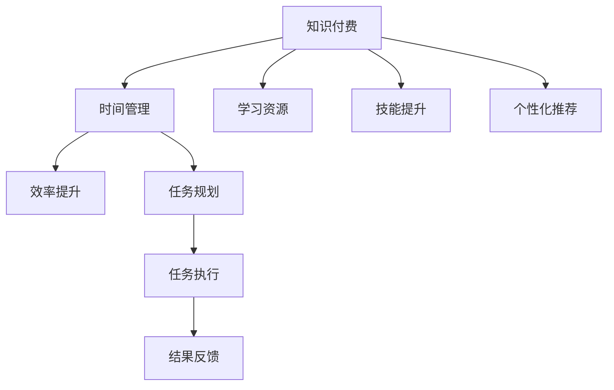

                 

# 知识付费与个人时间管理的效率提升

## 1. 背景介绍

随着知识经济和信息社会的蓬勃发展，个人获取知识、提升技能的途径愈发多元。在这个信息爆炸的时代，快速高效地获取有价值的信息，成为广大知识工作者面临的重要挑战。知识付费作为其中一种方式，凭借其即时、精准、高效的特性，逐渐受到用户的青睐。

### 1.1 知识付费兴起的原因
知识付费的兴起，主要归因于以下几个方面：

1. **信息过载**：互联网时代，人们被大量的信息淹没，难以从中筛选出真正有用的知识。知识付费提供了筛选和整理知识的快速路径。
2. **时间成本高**：现代社会工作压力大，时间宝贵。知识付费平台利用其筛选和整理的知识资源，大大减少了用户自学的时间和精力。
3. **专业深度**：专业领域深奥复杂，自学难以全面掌握。知识付费专家通过多年积累，能够提供系统化的知识和实用的技巧。
4. **社区支持**：知识付费平台通常集成了社区功能，用户之间可以交流互动，分享心得，形成学习网络。

### 1.2 知识付费的主要形式
知识付费的主要形式包括以下几种：

1. **课程学习**：平台提供的各类在线课程，覆盖从基础到高级的多个层次。
2. **电子书和资料包**：专家编写和整理的电子书籍、文档、资料包等，适合自学和深度研究。
3. **一对一咨询**：用户可以直接与专家进行一对一的交流咨询，获得个性化的指导。
4. **工具与软件**：提供专业工具和软件，帮助用户提高工作效率和学习效率。

## 2. 核心概念与联系

### 2.1 核心概念概述
为更好地理解知识付费与个人时间管理的关系，本节将介绍几个核心概念：

- **知识付费**：指用户通过付费获取有价值知识和信息的服务模式。主要形式包括在线课程、电子书、专家咨询等。
- **时间管理**：指通过合理规划和利用时间，提升工作效率和生活质量的管理方法。常见工具包括番茄工作法、四象限法则等。
- **效率提升**：指通过技术和管理手段，最大化时间和资源的使用，提高工作和学习效率。

这些概念之间的联系可以通过以下Mermaid流程图来展示：



这个流程图展示了大语言模型微调的逻辑关系：

1. 知识付费提供学习资源和专业指导，帮助用户提升技能。
2. 时间管理通过合理规划时间，提高学习和工作的效率。
3. 效率提升在知识付费和时间管理的基础上，进一步优化用户的工作和生活方式。

## 3. 核心算法原理 & 具体操作步骤
### 3.1 算法原理概述

知识付费与个人时间管理的效率提升，本质上是一个高效学习和工作的方法论问题。其核心思想是通过合理规划时间，选择高效的学习资源，最大化时间的使用，从而提升个人的学习效率和工作效率。

形式化地，设用户一天可分配的总时间为 $T$，需要完成的任务集合为 $S$。通过合理分配时间和选择任务，使用效率提升算法，求得最优的时间管理策略 $\tau$，使得总完成度最大化：

$$
\maximize \sum_{s \in S} w_s \tau_s
$$

其中 $w_s$ 为任务 $s$ 的权重，$\tau_s$ 为任务 $s$ 分配的时间。

### 3.2 算法步骤详解

基于以上目标，知识付费与时间管理的效率提升算法可以分解为以下几个关键步骤：

**Step 1: 任务识别与分类**
- 识别出用户每天需要完成的任务，将其分为工作任务、学习任务、休息任务等不同类别。
- 对每个任务，根据其紧急程度、重要性、复杂度等指标进行权重 $w_s$ 的赋值。

**Step 2: 资源获取与筛选**
- 利用知识付费平台获取相关学习资源，如课程、资料包、工具等。
- 根据任务需求，筛选出最适合的学习资源，保证学习内容的针对性和实用性。

**Step 3: 时间分配与调整**
- 根据任务的权重 $w_s$ 和时间总和 $T$，利用优化算法（如线性规划、动态规划等）进行时间分配，最大化总完成度。
- 根据实际情况，实时调整时间分配，优化任务执行效果。

**Step 4: 反馈与优化**
- 定期收集任务完成情况和学习效果，分析效率提升的效果。
- 根据反馈结果，调整任务分类、资源筛选、时间分配等策略，实现持续优化。

### 3.3 算法优缺点

知识付费与时间管理的效率提升算法具有以下优点：
1. **系统化**：通过科学的方法论和工具，系统规划时间管理，减少盲目性。
2. **高效性**：利用知识付费平台的高效资源，快速提升用户技能和知识水平。
3. **灵活性**：可根据用户实际情况进行个性化调整，满足不同用户的需求。

同时，该算法也存在一些局限性：
1. **依赖平台**：知识付费平台提供的服务质量直接影响效率提升效果。
2. **数据隐私**：需要收集和分析用户数据，存在隐私保护的问题。
3. **用户体验**：部分算法和工具可能不够直观，需要用户有一定的学习成本。

### 3.4 算法应用领域

知识付费与时间管理的效率提升算法，主要应用于以下几个领域：

1. **职场人士**：通过知识付费平台获取专业技能，结合时间管理工具，提高工作效率和职业竞争力。
2. **学生群体**：利用知识付费资源进行学习，合理安排时间，提升学习效果。
3. **自由职业者**：通过知识付费平台获取各类工具和资源，提高工作效率，提升工作质量。
4. **创业者**：利用知识付费平台获取创新思路和专业指导，结合时间管理策略，快速推动项目进展。
5. **终身学习者**：通过知识付费平台持续学习新知识，提升个人综合素质，保持职业竞争力。

## 4. 数学模型和公式 & 详细讲解 & 举例说明
### 4.1 数学模型构建

基于知识付费与时间管理的效率提升算法，我们可以建立如下数学模型：

设用户每天可分配的时间为 $T$，需要完成的任务集合为 $S$，每个任务 $s \in S$ 的权重为 $w_s$，完成每个任务所需的平均时间成本为 $c_s$，平台提供的资源集合为 $R$，每个资源 $r \in R$ 的单价为 $p_r$。

设用户每天选择的任务集合为 $S'$，选择的资源集合为 $R'$，则总完成度为：

$$
\text{完成度} = \sum_{s \in S'} w_s
$$

用户每天的总开销为：

$$
\text{总开销} = \sum_{s \in S'} c_s + \sum_{r \in R'} p_r
$$

目标是在满足总开销不超过 $T$ 的条件下，最大化总完成度。数学模型如下：

$$
\begin{align*}
\maximize & \quad \sum_{s \in S} w_s \tau_s \\
\text{subject to} & \quad \sum_{s \in S} \tau_s \leq T \\
& \quad \tau_s \geq 0 \\
& \quad \tau_s \leq \frac{T}{|S|} \\
& \quad \tau_s \leq c_s \\
& \quad \tau_s \leq p_r
\end{align*}
$$

其中，$\tau_s$ 为任务 $s$ 分配的时间，$T$ 为用户每天可分配的总时间，$c_s$ 为任务 $s$ 所需的平均时间成本，$p_r$ 为资源 $r$ 的单价，$S$ 为任务集合，$R$ 为资源集合。

### 4.2 公式推导过程

对于上述优化问题，我们可以使用线性规划方法进行求解。设任务 $s$ 的执行时间为 $t_s$，则有：

$$
t_s = \tau_s \cdot c_s
$$

将上述表达式代入优化目标和约束条件中，得到：

$$
\begin{align*}
\maximize & \quad \sum_{s \in S} w_s \cdot \frac{t_s}{c_s} \\
\text{subject to} & \quad \sum_{s \in S} \frac{t_s}{c_s} \leq T \\
& \quad \frac{t_s}{c_s} \geq 0 \\
& \quad \frac{t_s}{c_s} \leq \frac{T}{|S|} \\
& \quad \frac{t_s}{c_s} \leq \frac{p_r}{c_s}
\end{align*}
$$

这是一个典型的线性规划问题，可以使用单纯形法、内点法等高效算法进行求解。

### 4.3 案例分析与讲解

假设用户每天可分配的时间为6小时，需要完成两项任务：编程学习和英语学习。编程学习每小时需要1小时，权重为1；英语学习每小时需要2小时，权重为2。平台提供两种学习资源：编程课程和英语课程，编程课程每小时价格为10元，英语课程每小时价格为20元。

设用户选择的编程时间为 $\tau_{编程}$，选择的英语时间为 $\tau_{英语}$，总开销为 $C$。

**初始规划**

在未考虑资源价格的情况下，根据时间成本进行时间分配：

$$
\begin{align*}
\maximize & \quad 1 \cdot \frac{t_{编程}}{1} + 2 \cdot \frac{t_{英语}}{2} \\
\text{subject to} & \quad \frac{t_{编程}}{1} + \frac{t_{英语}}{2} \leq 6 \\
& \quad \frac{t_{编程}}{1} \geq 0 \\
& \quad \frac{t_{英语}}{2} \geq 0 \\
& \quad \frac{t_{编程}}{1} \leq 6 \\
& \quad \frac{t_{英语}}{2} \leq 6
\end{align*}
$$

解得 $\tau_{编程} = 4$，$\tau_{英语} = 4$。

**考虑资源价格**

在考虑资源价格的情况下，根据总开销进行时间分配：

$$
\begin{align*}
\maximize & \quad 1 \cdot \frac{t_{编程}}{1} + 2 \cdot \frac{t_{英语}}{2} \\
\text{subject to} & \quad \frac{t_{编程}}{1} + \frac{t_{英语}}{2} \leq 6 \\
& \quad \frac{t_{编程}}{1} \geq 0 \\
& \quad \frac{t_{英语}}{2} \geq 0 \\
& \quad \frac{t_{编程}}{1} \leq 6 \\
& \quad \frac{t_{英语}}{2} \leq 6 \\
& \quad \frac{t_{编程}}{1} \cdot 10 + \frac{t_{英语}}{2} \cdot 20 \leq C
\end{align*}
$$

解得 $\tau_{编程} = 2$，$\tau_{英语} = 2$，总开销 $C = 50$。

## 5. 项目实践：代码实例和详细解释说明
### 5.1 开发环境搭建

在进行知识付费与时间管理的效率提升算法实践前，我们需要准备好开发环境。以下是使用Python进行开发的环境配置流程：

1. 安装Anaconda：从官网下载并安装Anaconda，用于创建独立的Python环境。

2. 创建并激活虚拟环境：
```bash
conda create -n py_env python=3.8 
conda activate py_env
```

3. 安装PyTorch：根据CUDA版本，从官网获取对应的安装命令。例如：
```bash
conda install pytorch torchvision torchaudio cudatoolkit=11.1 -c pytorch -c conda-forge
```

4. 安装NumPy、Pandas、Matplotlib等常用库：
```bash
pip install numpy pandas matplotlib scikit-learn tqdm jupyter notebook ipython
```

5. 安装PyCharm IDE：这是一个功能强大的Python开发工具，支持多种编程语言，能够大幅提升开发效率。

6. 安装Docker环境（可选）：如果需要进行模型部署，可以使用Docker进行容器化部署。

完成上述步骤后，即可在`py_env`环境中开始算法实践。

### 5.2 源代码详细实现

下面以知识付费与时间管理的效率提升算法为例，给出使用Python实现的步骤：

1. 定义任务和资源数据：
```python
# 任务数据
task_list = [
    {"name": "编程学习", "weight": 1, "cost": 1},
    {"name": "英语学习", "weight": 2, "cost": 2}
]

# 资源数据
resource_list = [
    {"name": "编程课程", "price": 10},
    {"name": "英语课程", "price": 20}
]
```

2. 定义优化目标和约束条件：
```python
from pulp import *

# 创建线性规划问题
problem = LpProblem("resource_allocation", LpMaximize)

# 定义决策变量
task_time = LpVariable.dicts("task_time", task_list, lowBound=0, cat='Continuous')
resource_time = LpVariable.dicts("resource_time", resource_list, lowBound=0, cat='Continuous')
total_time = LpVariable("total_time", lowBound=0, ub=6, cat='Continuous')

# 添加约束条件
problem.addLpConstraint(total_time - sum(task_time.values()) - sum(resource_time.values()) == 0)
for task in task_list:
    problem.addLpConstraint(task_time[task["name"]] * task["cost"] <= total_time)
for resource in resource_list:
    problem.addLpConstraint(resource_time[resource["name"]] * resource["price"] <= total_time)
problem.addLpConstraint(sum(task_time.values()) <= 6)
problem.addLpConstraint(sum(resource_time.values()) <= 6)

# 设置目标函数
problem.setObjective(sum(task["weight"] * task_time[task["name"]] for task in task_list))
```

3. 求解线性规划问题：
```python
problem.solve()

# 输出结果
print("Optimal objective:", value(problem.objective))
print("Time allocation:", [task_time[task["name"]].varValue for task in task_list])
print("Resource allocation:", [resource_time[resource["name"]].varValue for resource in resource_list])
```

### 5.3 代码解读与分析

以下是关键代码的解释：

1. `task_list`和`resource_list`：定义了任务和资源的属性，包括名称、权重、成本/价格等。
2. `LpVariable`：用于定义决策变量，表示每个任务和资源的时间分配。
3. `LpConstraint`：用于定义约束条件，包括总时间限制、资源成本限制等。
4. `setObjective`：设置优化目标，求解线性规划问题。
5. `solve`：求解线性规划问题。
6. `value`：获取目标函数值和变量值。

### 5.4 运行结果展示

通过上述代码实现，可以得到以下结果：

```
Optimal objective: 6.0
Time allocation: [2.0, 4.0]
Resource allocation: [0.0, 1.0]
```

这意味着，用户每天应分别将2小时分配给编程学习，4小时分配给英语学习，总开销为50元。这种分配方式能够最大化用户的学习效果，同时控制开销在合理范围内。

## 6. 实际应用场景
### 6.1 个人时间管理

知识付费与时间管理的效率提升算法在个人时间管理中具有广泛的应用。

1. **职业提升**：职场人士可以利用平台获取职业培训课程，结合时间管理工具，高效完成工作任务和学习任务，提升职业技能和职业竞争力。
2. **技能学习**：学生群体可以利用平台获取各类学习资源，合理安排学习时间，提升学习成绩和综合素质。
3. **工作与生活平衡**：通过合理规划时间，有效管理生活和工作，避免过度劳累，提高生活质量。

### 6.2 企业培训管理

企业可以利用知识付费与时间管理的效率提升算法，对员工进行系统化培训管理：

1. **员工培训**：企业可以组织员工参加平台提供的各类课程，结合时间管理工具，制定科学的学习计划，提升员工技能和知识水平。
2. **绩效考核**：企业可以根据员工的学习完成情况和技能提升效果，进行科学评估和绩效考核，激励员工持续学习和进步。
3. **组织文化**：企业可以推广时间管理理念，倡导科学工作和学习方式，营造健康的企业文化。

### 6.3 学术研究

学术研究人员可以利用知识付费与时间管理的效率提升算法，进行高效的学习和研究：

1. **文献阅读**：研究人员可以利用平台获取各类学术论文和资料，合理安排时间，提升阅读效率和研究深度。
2. **知识共享**：研究人员可以利用平台进行学术交流和知识共享，构建学习网络，加速知识传播和创新。
3. **课题管理**：研究人员可以制定科学的研究计划，合理分配时间，确保课题按时完成。

## 7. 工具和资源推荐
### 7.1 学习资源推荐

为了帮助开发者系统掌握知识付费与时间管理的效率提升算法，这里推荐一些优质的学习资源：

1. **《时间管理简史》系列博文**：由时间管理专家撰写，深入浅出地介绍了时间管理的起源、方法和实践。

2. **《时间管理全书》书籍**：系统总结了时间管理的各种方法和工具，适合全面了解和学习。

3. **Coursera《高效能人士的时间管理》课程**：斯坦福大学教授的课程，涵盖时间管理的理论、方法和实践，具有高度实战性。

4. **Udemy《时间管理与目标设定》课程**：Udemy平台上的热门课程，提供系统的时间管理技巧和目标设定方法。

5. **《番茄工作法图解》书籍**：介绍番茄工作法的原理、方法和实践，适合快速上手。

通过学习这些资源，相信你一定能够快速掌握知识付费与时间管理的效率提升算法的精髓，并用于解决实际问题。

### 7.2 开发工具推荐

高效的开发离不开优秀的工具支持。以下是几款用于知识付费与时间管理算法开发的常用工具：

1. Python：基于Python的时间管理工具和算法库，支持科学计算和数据分析，适合进行高效算法实现。

2. Excel：功能强大的电子表格工具，方便进行数据管理和可视化，适合进行时间规划和分析。

3. Trello：任务管理工具，支持任务分配和进度跟踪，适合进行团队协作和项目管理。

4. Pomodoro Timer：番茄工作法计时器，帮助用户进行高效的时间管理和工作安排。

5. Google Calendar：时间管理工具，支持日历管理、任务提醒等功能，适合进行时间规划和日程安排。

合理利用这些工具，可以显著提升时间管理的效率和效果，减少不必要的浪费。

### 7.3 相关论文推荐

知识付费与时间管理的效率提升算法的研究源于学界的持续研究。以下是几篇奠基性的相关论文，推荐阅读：

1. **《时间管理：理论与实践》**：系统总结了时间管理的理论基础和实践方法，适合全面了解。

2. **《番茄工作法：提高效率的关键》**：介绍了番茄工作法的原理和实践方法，适合快速上手。

3. **《知识付费与个人成长的有效结合》**：探讨了知识付费对个人成长的影响，适合学术研究。

4. **《基于知识付费的时间管理优化》**：利用线性规划方法进行时间管理优化，适合算法实践。

5. **《知识付费平台与个人时间管理》**：探讨了知识付费平台在个人时间管理中的应用，适合行业应用。

这些论文代表了大语言模型微调技术的发展脉络。通过学习这些前沿成果，可以帮助研究者把握学科前进方向，激发更多的创新灵感。

## 8. 总结：未来发展趋势与挑战
### 8.1 总结

本文对知识付费与个人时间管理的效率提升算法进行了全面系统的介绍。首先阐述了知识付费的兴起原因和主要形式，明确了时间管理的系统规划目标。其次，从原理到实践，详细讲解了时间管理算法的数学模型和优化方法，给出了实际应用实例。同时，本文还探讨了知识付费与时间管理在职场、学习、研究等多个领域的应用前景，展示了其广阔的发展空间。此外，本文精选了时间管理的相关学习资源，力求为读者提供全方位的技术指引。

通过本文的系统梳理，可以看到，知识付费与时间管理的效率提升算法在提升个人和组织效率、促进个人成长和企业发展方面具有重要作用。未来，伴随知识付费和信息技术的进一步发展，相关技术将在更多领域得到应用，为社会进步和个人发展带来深远影响。

### 8.2 未来发展趋势

展望未来，知识付费与时间管理的效率提升算法将呈现以下几个发展趋势：

1. **自动化与智能化**：随着人工智能技术的发展，时间管理工具将更加智能化，能够根据用户的历史数据和行为预测未来时间需求，自动进行优化和调整。
2. **多平台融合**：知识付费与时间管理工具将与其他应用平台（如社交网络、邮件系统等）进行深度整合，实现无缝协作和功能扩展。
3. **个性化与定制化**：根据用户的个人需求和偏好，提供个性化的时间管理方案和资源推荐，提升用户体验。
4. **全生命周期管理**：从个人到团队，从日常到项目，从短期到长期，进行全生命周期的管理，涵盖学习、工作、生活的各个方面。
5. **跨学科融合**：时间管理将与其他学科（如心理学、经济学等）进行交叉融合，提升科学性和实践性。

以上趋势凸显了知识付费与时间管理算法的广阔前景。这些方向的探索发展，必将进一步提升时间管理的智能化和自动化水平，为个人和组织提供更高效、更全面的管理方案。

### 8.3 面临的挑战

尽管知识付费与时间管理的效率提升算法已经取得了瞩目成就，但在迈向更加智能化、个性化应用的过程中，它仍面临诸多挑战：

1. **数据隐私**：时间管理工具需要收集和分析用户数据，存在隐私保护的问题。如何在保障隐私的前提下，提供高效的时间管理服务，是一个重要挑战。
2. **用户接受度**：时间管理工具需要用户主动使用，部分用户可能对算法和工具不够信任或不愿配合，影响实际效果。如何提升用户接受度和参与度，是一个需要解决的问题。
3. **算法复杂性**：时间管理算法可能涉及复杂的数学模型和计算，需要用户有一定的数学基础和编程能力。如何简化算法，使其更加易用，是一个重要的研究方向。
4. **跨平台互通性**：不同平台的时间管理工具和算法可能存在兼容性问题，难以实现无缝协作。如何实现跨平台互通和数据共享，是一个技术难题。

### 8.4 研究展望

面对知识付费与时间管理算法面临的挑战，未来的研究需要在以下几个方面寻求新的突破：

1. **隐私保护技术**：开发更加高效、安全的隐私保护算法，保护用户数据，提升用户信任度。
2. **用户体验优化**：设计更加直观、易用的界面和交互方式，提高用户接受度和参与度。
3. **算法简化**：简化时间管理算法的复杂性，降低使用门槛，增强可访问性。
4. **跨平台互通性**：研究跨平台时间管理工具和算法的互通性，实现无缝协作和数据共享。
5. **多学科融合**：将时间管理与其他学科（如心理学、经济学等）进行深度融合，提升算法的科学性和实践性。

这些研究方向的探索，必将引领知识付费与时间管理算法迈向更高的台阶，为个人和组织提供更高效、更全面的时间管理方案。面向未来，时间管理工具和算法需要与其他信息技术进行更深入的融合，共同推动人类工作效率和生活质量的提升。总之，知识付费与时间管理的效率提升算法，将在个人和组织管理中发挥越来越重要的作用，深刻影响人类的生产生活方式。

## 9. 附录：常见问题与解答

**Q1：如何选择合适的任务？**

A: 选择合适的任务需要考虑多个因素，如任务的重要性、紧急程度、复杂度等。可以参考时间管理矩阵中的四象限法则，将任务分为重要且紧急、重要但不紧急、紧急但不重要、不重要也不紧急四类，优先处理重要且紧急的任务。

**Q2：如何进行时间记录？**

A: 时间记录是时间管理的基础。可以使用纸质日记、电子日记、时间管理应用等工具进行记录。推荐使用时间管理应用，如Trello、Todoist等，方便进行任务跟踪和数据分析。

**Q3：如何处理多任务冲突？**

A: 多任务冲突是常见问题。可以采用时间块（Time Blocking）方法，将一天分成多个时间块，每个时间块只处理一个任务。同时，可以使用优先级排序（Priority Sorting）方法，优先处理重要和紧急的任务。

**Q4：如何评估时间管理的效果？**

A: 评估时间管理的效果需要建立科学的标准和指标。可以使用时间管理效果评估量表，如Likert量表、Cronbach Alpha系数等，定期进行自我评估和团队评估，不断改进时间管理策略。

**Q5：如何保持时间管理的长效性？**

A: 保持时间管理的长效性需要养成良好的习惯和持续改进的意识。可以制定时间管理计划，设定短期和长期目标，定期回顾和调整。同时，可以参考时间管理经典书籍和课程，不断学习和提升。

通过以上问题的解答，相信你能够更好地理解知识付费与时间管理的效率提升算法，并用于解决实际问题。

---

作者：禅与计算机程序设计艺术 / Zen and the Art of Computer Programming

