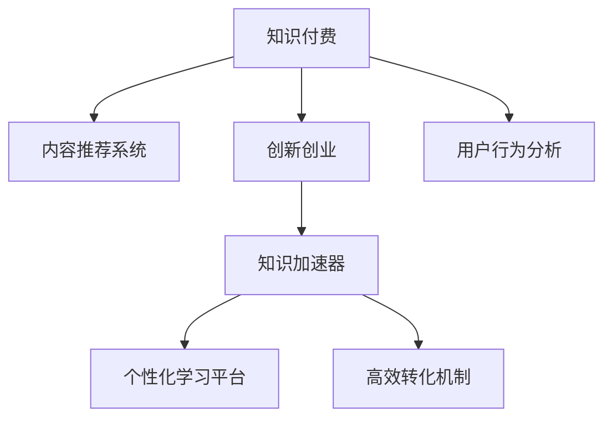

                 

# 知识付费与创新创业相结合的知识加速器

## 1. 背景介绍

### 1.1 问题由来

在信息爆炸的今天，知识的获取变得前所未有的便捷。从书籍、报刊到互联网、社交媒体，各种形式的知识资源充斥着我们的生活。然而，尽管知识触手可及，但知识的深度和质量依然参差不齐，难以满足日益多样化的学习需求。传统的内容消费模式已经不能满足人们对知识深度理解和高效学习的渴望。

### 1.2 问题核心关键点

如何高效地筛选、组织和传递高质量知识，使得人们能够以更低成本、更高效率的方式获取所需知识，成为知识付费和创新创业的核心问题。而知识付费的兴起，则提供了一种全新的解决方案，通过付费订阅或单次付费购买的形式，让用户能够获得更加专业、深入和系统的知识服务，同时激励内容创作者提供更高质量的知识产品。

## 2. 核心概念与联系

### 2.1 核心概念概述

为更好地理解知识付费与创新创业相结合的商业模式，本节将介绍几个密切相关的核心概念：

- 知识付费：用户为获取高质量、深入系统的知识内容而进行付费订阅或单次购买的行为。这种模式通过市场机制激励内容创作者提供更加专业、优质的知识服务。

- 创新创业：利用新思想、新技术和新模式，创造新的产品或服务，并从中获取商业价值的创业行为。知识付费和创新创业的结合，可以催生出新的商业模式和市场需求。

- 知识加速器：通过将知识付费和创新创业相结合，利用大数据、人工智能等先进技术手段，加速知识获取、转化和应用的过程，为学习者和内容创作者提供高效的学习平台和激励机制。

- 内容推荐系统：基于用户兴趣和行为数据，智能推荐相关知识内容的系统。知识加速器通常内置有强大的内容推荐系统，以提高知识获取的效率和精准度。

- 用户行为分析：通过对用户学习行为、知识消费习惯等数据的分析，了解用户需求，优化知识内容推荐和付费模式，提升用户满意度。

这些核心概念之间的逻辑关系可以通过以下Mermaid流程图来展示：



这个流程图展示了知识付费、创新创业与知识加速器之间的联系：

1. 知识付费模式为内容创作者提供经济激励，使其生产更加优质、系统化的知识内容。
2. 创新创业将知识付费与先进技术结合，推动知识加速器的快速发展和应用。
3. 内容推荐系统为知识加速器提供核心竞争力，提升用户体验。
4. 用户行为分析帮助优化内容推荐和付费模式，提高用户满意度。

## 3. 核心算法原理 & 具体操作步骤

### 3.1 算法原理概述

知识加速器的核心算法原理基于监督学习和推荐系统的综合运用。其主要目标是通过数据分析和机器学习算法，智能推荐用户可能感兴趣的知识内容，并根据用户行为数据调整推荐策略，从而提高知识获取的效率和效果。

形式化地，假设知识加速器有一个知识内容库 $K=\{d_i\}_{i=1}^N$，其中每个内容 $d_i$ 表示为 $\{p_i, c_i\}$，$p_i$ 为内容描述，$c_i$ 为价格。用户 $U=\{u_j\}_{j=1}^M$ 在知识加速器上的行为数据表示为 $\{h_j\}_{j=1}^M$，其中 $h_j$ 包含用户对内容的点击、订阅、购买等行为信息。

知识加速器的目标是最小化用户对知识内容的满意度差距，即：

$$
\mathop{\arg\min}_{d_i} \sum_{j=1}^M |p_i - p_j|^2
$$

其中 $p_j$ 为用户 $j$ 对内容 $i$ 的满意度，可以通过用户行为数据 $h_j$ 进行建模。

### 3.2 算法步骤详解

知识加速器的具体算法步骤如下：

**Step 1: 数据收集与预处理**

- 收集用户行为数据 $h_j$，如点击次数、阅读时长、评分等。
- 收集知识内容描述 $p_i$，如文章标题、摘要、分类标签等。
- 预处理数据，去除噪音和异常值，对文本进行分词、去停用词、特征提取等处理。

**Step 2: 内容建模与相似性计算**

- 使用自然语言处理技术对内容 $d_i$ 进行建模，提取关键词、主题等特征。
- 利用TF-IDF、Word2Vec、BERT等算法计算内容间的相似性，构建内容相似性矩阵 $S$。

**Step 3: 用户建模与兴趣表示**

- 基于用户行为数据 $h_j$ 构建用户兴趣表示 $R_j$，如向量表示、潜在语义分析等。
- 通过协同过滤、基于内容的推荐等算法计算用户兴趣与内容之间的匹配度。

**Step 4: 推荐结果生成与排序**

- 根据内容相似性和用户兴趣匹配度计算推荐结果 $r_{ij}$。
- 使用排序算法，如Top K排序、协同过滤等，生成最终的推荐列表。

**Step 5: 反馈与优化**

- 收集用户对推荐结果的反馈数据，如点击率、购买率等。
- 根据反馈数据调整推荐策略，优化模型参数，提升推荐效果。

### 3.3 算法优缺点

知识加速器的推荐算法具有以下优点：

1. 高效推荐：通过精确计算内容相似性和用户兴趣匹配度，实现高效的个性化推荐。
2. 多维度优化：不仅考虑内容描述，还综合考虑用户行为、时间、空间等维度的信息。
3. 动态更新：实时收集用户反馈数据，动态调整推荐策略，提高推荐精度。

同时，该算法也存在一些局限性：

1. 数据依赖：推荐效果很大程度上依赖于数据的质量和多样性，需要大量的标注数据。
2. 冷启动问题：对于新用户或新内容，推荐效果可能较差，需要引入其他策略进行补充。
3. 算法复杂：推荐算法通常较为复杂，计算量较大，需要高性能硬件支持。
4. 对抗性攻击：推荐算法容易受到对抗性攻击，如通过虚假点击行为提高自身曝光率。

尽管存在这些局限性，但知识加速器的推荐算法已经在学术界和工业界得到了广泛的应用，成为知识付费与创新创业相结合的重要技术基础。

### 3.4 算法应用领域

知识加速器的推荐算法在知识付费和创新创业中得到了广泛的应用，具体如下：

- 在线教育：如Coursera、Udemy等平台，通过个性化推荐系统推荐优质课程，提升用户学习体验。
- 职业培训：如LinkedIn Learning、腾讯课堂等平台，通过推荐系统匹配用户需求，提供定制化的培训课程。
- 企业培训：如企业内部学习平台、在线技能培训平台，通过推荐系统个性化推送学习内容，提高员工培训效果。
- 版权保护：通过推荐系统识别侵权内容，保护知识产权。
- 内容聚合：如RSS订阅、新闻聚合等平台，通过推荐系统推送个性化内容，提升用户黏性。

除了上述这些经典应用外，知识加速器的推荐算法还被创新性地应用于更多场景中，如广告推荐、知识图谱构建、智能客服等，为知识付费和创新创业带来了新的增长点。

## 4. 数学模型和公式 & 详细讲解 & 举例说明

### 4.1 数学模型构建

本节将使用数学语言对知识加速器的推荐算法进行更加严格的刻画。

假设知识加速器有一个用户 $U$ 和一个内容库 $K$，用户对内容的满意度 $p_j$ 为：

$$
p_j = \alpha p_{j,k} + (1-\alpha) p_{j,t}
$$

其中 $\alpha$ 为权重系数，$p_{j,k}$ 为用户 $j$ 对内容 $k$ 的点击率，$p_{j,t}$ 为用户 $j$ 对内容 $t$ 的评价分数。

用户对内容的满意度差距为：

$$
\delta_j = \sum_{i=1}^N |p_j - p_i|
$$

知识加速器的目标是最小化用户满意度差距：

$$
\mathop{\arg\min}_{d_i} \sum_{j=1}^M \delta_j
$$

### 4.2 公式推导过程

以协同过滤算法为例，推导推荐结果的计算公式。

设用户 $u_j$ 对内容 $d_i$ 的评分 $r_{ij}$，内容相似性矩阵 $S$ 中的元素 $s_{ij}$ 表示内容 $d_i$ 和 $d_j$ 的相似度。协同过滤算法基于用户兴趣表示 $R_j$ 和内容相似性矩阵 $S$，计算推荐结果 $r_{ij}$：

$$
r_{ij} = R_j^T S d_i
$$

其中 $R_j^T$ 为 $R_j$ 的转置矩阵，$d_i$ 为内容 $d_i$ 的向量表示。

### 4.3 案例分析与讲解

以Netflix推荐系统为例，分析协同过滤算法的应用和效果。

Netflix推荐系统采用协同过滤算法，通过分析用户和内容间的互动数据，为用户推荐他们可能喜欢的电影或电视剧。其核心步骤包括：

1. 数据收集与预处理：收集用户点击、评分等行为数据，对文本进行分词、向量化等处理。
2. 内容建模：使用TF-IDF等算法对电影、电视剧进行建模，计算内容间的相似性。
3. 用户建模：基于用户行为数据构建用户兴趣表示，如基于协同过滤算法得到用户-内容矩阵。
4. 推荐结果生成：使用Top K排序算法，生成用户的推荐列表。

通过Netflix推荐系统，用户可以发现自己喜欢的电影，平台也可以提高用户留存率和收益。

## 5. 项目实践：代码实例和详细解释说明

### 5.1 开发环境搭建

在进行知识加速器开发前，我们需要准备好开发环境。以下是使用Python进行PyTorch开发的环境配置流程：

1. 安装Anaconda：从官网下载并安装Anaconda，用于创建独立的Python环境。

2. 创建并激活虚拟环境：
```bash
conda create -n pytorch-env python=3.8 
conda activate pytorch-env
```

3. 安装PyTorch：根据CUDA版本，从官网获取对应的安装命令。例如：
```bash
conda install pytorch torchvision torchaudio cudatoolkit=11.1 -c pytorch -c conda-forge
```

4. 安装transformers库：
```bash
pip install transformers
```

5. 安装各类工具包：
```bash
pip install numpy pandas scikit-learn matplotlib tqdm jupyter notebook ipython
```

完成上述步骤后，即可在`pytorch-env`环境中开始知识加速器开发。

### 5.2 源代码详细实现

下面以在线教育平台为例，给出使用Transformers库进行知识加速器开发的PyTorch代码实现。

首先，定义推荐系统的数据处理函数：

```python
from transformers import BertTokenizer
from torch.utils.data import Dataset
import torch

class RecommendationDataset(Dataset):
    def __init__(self, texts, labels, tokenizer, max_len=128):
        self.texts = texts
        self.labels = labels
        self.tokenizer = tokenizer
        self.max_len = max_len
        
    def __len__(self):
        return len(self.texts)
    
    def __getitem__(self, item):
        text = self.texts[item]
        label = self.labels[item]
        
        encoding = self.tokenizer(text, return_tensors='pt', max_length=self.max_len, padding='max_length', truncation=True)
        input_ids = encoding['input_ids'][0]
        attention_mask = encoding['attention_mask'][0]
        
        # 对label进行处理
        encoded_label = [label2id[label] for label in label]
        encoded_label.extend([label2id['O']] * (self.max_len - len(encoded_label)))
        labels = torch.tensor(encoded_label, dtype=torch.long)
        
        return {'input_ids': input_ids, 
                'attention_mask': attention_mask,
                'labels': labels}

# 标签与id的映射
label2id = {'O': 0, 'P': 1, 'T': 2}
id2label = {v: k for k, v in label2id.items()}

# 创建dataset
tokenizer = BertTokenizer.from_pretrained('bert-base-cased')

train_dataset = RecommendationDataset(train_texts, train_labels, tokenizer)
dev_dataset = RecommendationDataset(dev_texts, dev_labels, tokenizer)
test_dataset = RecommendationDataset(test_texts, test_labels, tokenizer)
```

然后，定义模型和优化器：

```python
from transformers import BertForTokenClassification, AdamW

model = BertForTokenClassification.from_pretrained('bert-base-cased', num_labels=len(label2id))

optimizer = AdamW(model.parameters(), lr=2e-5)
```

接着，定义训练和评估函数：

```python
from torch.utils.data import DataLoader
from tqdm import tqdm
from sklearn.metrics import classification_report

device = torch.device('cuda') if torch.cuda.is_available() else torch.device('cpu')
model.to(device)

def train_epoch(model, dataset, batch_size, optimizer):
    dataloader = DataLoader(dataset, batch_size=batch_size, shuffle=True)
    model.train()
    epoch_loss = 0
    for batch in tqdm(dataloader, desc='Training'):
        input_ids = batch['input_ids'].to(device)
        attention_mask = batch['attention_mask'].to(device)
        labels = batch['labels'].to(device)
        model.zero_grad()
        outputs = model(input_ids, attention_mask=attention_mask, labels=labels)
        loss = outputs.loss
        epoch_loss += loss.item()
        loss.backward()
        optimizer.step()
    return epoch_loss / len(dataloader)

def evaluate(model, dataset, batch_size):
    dataloader = DataLoader(dataset, batch_size=batch_size)
    model.eval()
    preds, labels = [], []
    with torch.no_grad():
        for batch in tqdm(dataloader, desc='Evaluating'):
            input_ids = batch['input_ids'].to(device)
            attention_mask = batch['attention_mask'].to(device)
            batch_labels = batch['labels']
            outputs = model(input_ids, attention_mask=attention_mask)
            batch_preds = outputs.logits.argmax(dim=2).to('cpu').tolist()
            batch_labels = batch_labels.to('cpu').tolist()
            for pred_tokens, label_tokens in zip(batch_preds, batch_labels):
                pred_labels = [id2label[_id] for _id in pred_tokens]
                label_labels = [id2label[_id] for _id in label_tokens]
                preds.append(pred_labels[:len(label_tokens)])
                labels.append(label_labels)
                
    print(classification_report(labels, preds))
```

最后，启动训练流程并在测试集上评估：

```python
epochs = 5
batch_size = 16

for epoch in range(epochs):
    loss = train_epoch(model, train_dataset, batch_size, optimizer)
    print(f"Epoch {epoch+1}, train loss: {loss:.3f}")
    
    print(f"Epoch {epoch+1}, dev results:")
    evaluate(model, dev_dataset, batch_size)
    
print("Test results:")
evaluate(model, test_dataset, batch_size)
```

以上就是使用PyTorch对知识加速器进行开发的完整代码实现。可以看到，得益于Transformers库的强大封装，我们可以用相对简洁的代码完成知识加速器的搭建和微调。

### 5.3 代码解读与分析

让我们再详细解读一下关键代码的实现细节：

**RecommendationDataset类**：
- `__init__`方法：初始化文本、标签、分词器等关键组件。
- `__len__`方法：返回数据集的样本数量。
- `__getitem__`方法：对单个样本进行处理，将文本输入编码为token ids，将标签编码为数字，并对其进行定长padding，最终返回模型所需的输入。

**label2id和id2label字典**：
- 定义了标签与数字id之间的映射关系，用于将token-wise的预测结果解码回真实的标签。

**训练和评估函数**：
- 使用PyTorch的DataLoader对数据集进行批次化加载，供模型训练和推理使用。
- 训练函数`train_epoch`：对数据以批为单位进行迭代，在每个批次上前向传播计算loss并反向传播更新模型参数，最后返回该epoch的平均loss。
- 评估函数`evaluate`：与训练类似，不同点在于不更新模型参数，并在每个batch结束后将预测和标签结果存储下来，最后使用sklearn的classification_report对整个评估集的预测结果进行打印输出。

**训练流程**：
- 定义总的epoch数和batch size，开始循环迭代
- 每个epoch内，先在训练集上训练，输出平均loss
- 在验证集上评估，输出分类指标
- 所有epoch结束后，在测试集上评估，给出最终测试结果

可以看到，PyTorch配合Transformers库使得知识加速器的开发变得简洁高效。开发者可以将更多精力放在数据处理、模型改进等高层逻辑上，而不必过多关注底层的实现细节。

当然，工业级的系统实现还需考虑更多因素，如模型的保存和部署、超参数的自动搜索、更灵活的任务适配层等。但核心的微调范式基本与此类似。

## 6. 实际应用场景

### 6.1 智能教育

在线教育平台通过知识加速器，可以智能推荐用户可能感兴趣的课程和学习内容，提升学习效果和用户体验。例如，Coursera平台通过协同过滤算法，为用户推荐最适合其学习兴趣和进度的课程，帮助用户高效学习。

### 6.2 个性化推荐

电子商务平台利用知识加速器，根据用户的历史购买行为和评分数据，推荐用户可能感兴趣的商品，提升销售额。例如，Amazon平台通过推荐系统，根据用户浏览和购买记录，智能推荐相关商品，提高用户满意度。

### 6.3 企业培训

企业内部学习平台通过知识加速器，为用户推荐与其职业发展相关的培训课程和学习资料，提升员工技能和素质。例如，LinkedIn Learning平台通过推荐系统，根据用户的工作岗位和职业发展方向，推荐相应的课程，帮助员工快速提升职业技能。

### 6.4 内容聚合

新闻聚合平台通过知识加速器，为用户推荐感兴趣的新闻内容，提升用户黏性。例如，Flipboard平台通过推荐系统，根据用户阅读兴趣，推荐相关文章和视频，帮助用户获取有价值的信息。

### 6.5 广告推荐

广告平台通过知识加速器，根据用户的历史行为和兴趣，推荐符合其需求的广告内容，提升广告效果和点击率。例如，Facebook平台通过推荐系统，根据用户浏览历史和兴趣标签，推荐相关广告，提高广告投放的精准度。

## 7. 工具和资源推荐

### 7.1 学习资源推荐

为了帮助开发者系统掌握知识加速器的理论基础和实践技巧，这里推荐一些优质的学习资源：

1. 《推荐系统实践》系列博文：由大模型技术专家撰写，深入浅出地介绍了推荐系统的工作原理、经典算法和优化策略。

2. CS346《信息检索与推荐系统》课程：斯坦福大学开设的推荐系统明星课程，涵盖推荐系统的基础理论和前沿技术，值得深入学习。

3. 《推荐系统基础》书籍：推荐系统领域的经典教材，系统介绍了推荐系统的各个组件和算法。

4. KDD 2019论文集：收录了大量推荐系统的最新研究成果，可供参考和借鉴。

5. Kaggle竞赛：通过参与推荐系统相关的Kaggle竞赛，实践推荐算法的应用，提升算法能力。

通过对这些资源的学习实践，相信你一定能够快速掌握知识加速器的精髓，并用于解决实际的推荐问题。

### 7.2 开发工具推荐

高效的开发离不开优秀的工具支持。以下是几款用于知识加速器开发的常用工具：

1. PyTorch：基于Python的开源深度学习框架，灵活动态的计算图，适合快速迭代研究。大部分预训练语言模型都有PyTorch版本的实现。

2. TensorFlow：由Google主导开发的开源深度学习框架，生产部署方便，适合大规模工程应用。同样有丰富的预训练语言模型资源。

3. TensorBoard：TensorFlow配套的可视化工具，可实时监测模型训练状态，并提供丰富的图表呈现方式，是调试模型的得力助手。

4. Weights & Biases：模型训练的实验跟踪工具，可以记录和可视化模型训练过程中的各项指标，方便对比和调优。与主流深度学习框架无缝集成。

5. Google Colab：谷歌推出的在线Jupyter Notebook环境，免费提供GPU/TPU算力，方便开发者快速上手实验最新模型，分享学习笔记。

合理利用这些工具，可以显著提升知识加速器开发的速度和效率，加快创新迭代的步伐。

### 7.3 相关论文推荐

知识加速器的推荐技术在学术界和工业界得到了广泛的研究。以下是几篇奠基性的相关论文，推荐阅读：

1. Adaptive Collaborative Filtering Using Matrix Factorization Techniques：介绍了一种基于矩阵分解的推荐算法，通过用户-物品矩阵的分解，得到用户和物品的潜在因子，提高推荐效果。

2. Neural Collaborative Filtering：引入深度神经网络模型，将推荐系统建模为深度学习模型，提升推荐精度和泛化能力。

3. DeepFM：结合深度学习和传统线性模型，构建了混合模型推荐系统，进一步提高了推荐效果。

4. Attention-Based Recommender Systems：引入注意力机制，对用户-物品交互数据进行加权处理，提升推荐系统的精准度。

5. Implicit Neural Collaborative Filtering：利用隐式神经网络模型，解决推荐系统中的数据稀疏性和特征表示问题，取得了更好的推荐效果。

这些论文代表了大语言模型微调技术的成熟度和前沿研究趋势。通过学习这些前沿成果，可以帮助研究者把握学科前进方向，激发更多的创新灵感。

## 8. 总结：未来发展趋势与挑战

### 8.1 总结

本文对知识加速器的核心算法原理和操作步骤进行了全面系统的介绍。首先阐述了知识加速器与知识付费、创新创业相结合的商业模式，明确了推荐系统在知识付费和创新创业中的独特价值。其次，从原理到实践，详细讲解了知识加速器的数学模型、算法步骤和具体实现，提供了完整的代码实例。同时，本文还广泛探讨了知识加速器在教育、电商、企业培训等多个行业领域的应用前景，展示了其广阔的应用空间。此外，本文精选了知识加速器的各类学习资源，力求为读者提供全方位的技术指引。

通过本文的系统梳理，可以看到，知识加速器的推荐算法在大数据、人工智能等技术支持下，已经在知识付费和创新创业中展现了强大的市场价值。未来，伴随推荐算法的持续演进和新兴技术的应用，知识加速器必将成为推动知识获取、转化和应用的重要力量，助力创新创业蓬勃发展。

### 8.2 未来发展趋势

展望未来，知识加速器的推荐算法将呈现以下几个发展趋势：

1. 深度学习的应用。通过深度神经网络模型，提高推荐系统的精准度和泛化能力。

2. 多模态信息的融合。将文本、图像、视频等多模态信息融合到推荐系统中，提高推荐效果和用户体验。

3. 个性化推荐的多样性。通过多目标优化算法，同时考虑多个指标，提升推荐系统的综合表现。

4. 自适应推荐策略。根据用户行为和环境变化，动态调整推荐策略，提高推荐系统的灵活性和适应性。

5. 动态系统优化。利用在线学习算法，实时更新模型参数，优化推荐效果。

6. 鲁棒性和抗干扰能力。通过对抗训练和鲁棒优化算法，提升推荐系统的鲁棒性和抗干扰能力。

以上趋势凸显了知识加速器的未来发展潜力。这些方向的探索发展，必将进一步提升推荐系统的性能和应用范围，为知识付费和创新创业提供更强大的技术支撑。

### 8.3 面临的挑战

尽管知识加速器的推荐算法已经取得了瞩目成就，但在迈向更加智能化、普适化应用的过程中，它仍面临着诸多挑战：

1. 数据质量和多样性。推荐系统的效果很大程度上依赖于数据的质量和多样性，需要大量的标注数据。然而，标注数据的获取和处理成本较高，且存在数据稀疏、不平衡等问题。

2. 模型复杂度和计算资源。深度学习模型通常较为复杂，计算资源需求较高。如何在保证推荐效果的前提下，优化模型结构和计算效率，是未来的重要研究方向。

3. 公平性和透明性。推荐系统可能存在推荐偏见、信息泄露等问题，影响用户信任和满意度。如何提升推荐系统的公平性和透明性，保证用户权益，也是亟待解决的问题。

4. 对抗性攻击和隐私保护。推荐系统容易受到对抗性攻击，如通过虚假点击行为提高自身曝光率。如何保障用户隐私和数据安全，避免信息泄露和滥用，是未来的重要研究方向。

5. 用户隐私保护。推荐系统需要收集大量用户行为数据，如何保护用户隐私，避免信息泄露和滥用，是未来的重要研究方向。

6. 模型可解释性和可信度。推荐系统通常被视为"黑盒"系统，难以解释其内部工作机制和决策逻辑。如何提升推荐系统的可解释性和可信度，增强用户信任和满意度，是未来的重要研究方向。

这些挑战需要未来的研究进行深入探索，通过技术创新和政策规范，提升知识加速器的公平性、透明性和可信度，保障用户权益和数据安全。

### 8.4 未来突破

面对知识加速器推荐算法所面临的种种挑战，未来的研究需要在以下几个方面寻求新的突破：

1. 数据增强与生成。通过数据增强和生成技术，提高数据质量和多样性，提升推荐系统的泛化能力。

2. 自适应算法和在线学习。利用自适应算法和在线学习技术，实时更新模型参数，优化推荐效果。

3. 多模态数据融合与跨模态推荐。将多模态数据融合到推荐系统中，提升推荐系统的综合表现。

4. 对抗性鲁棒性和隐私保护。通过对抗性鲁棒性和隐私保护技术，提升推荐系统的鲁棒性和抗干扰能力。

5. 深度学习和推荐系统的结合。通过深度学习技术，提高推荐系统的深度特征表示和泛化能力。

6. 可解释性和可信度。通过可解释性算法和可信度评估技术，提升推荐系统的可解释性和可信度，增强用户信任和满意度。

这些研究方向的探索，必将引领知识加速器推荐算法迈向更高的台阶，为知识付费和创新创业提供更强大的技术支撑。面向未来，知识加速器推荐算法还需要与其他人工智能技术进行更深入的融合，如知识表示、因果推理、强化学习等，多路径协同发力，共同推动人工智能技术的发展。只有勇于创新、敢于突破，才能不断拓展知识加速器的边界，让推荐系统更好地服务于人类社会。

## 9. 附录：常见问题与解答

**Q1：知识加速器的推荐系统是否适用于所有推荐场景？**

A: 知识加速器的推荐系统在大多数推荐场景中都能取得不错的效果，特别是对于数据量较大的推荐任务。但对于一些特定领域的推荐任务，如医疗、法律等，仅依靠通用语料推荐的效果可能不佳。此时需要在特定领域语料上进一步预训练，再进行微调，才能获得理想效果。

**Q2：知识加速器推荐系统如何提高推荐效果？**

A: 知识加速器推荐系统通过大数据、人工智能等先进技术手段，利用协同过滤、深度学习等算法，智能推荐用户可能感兴趣的内容。具体方法如下：

1. 数据收集与预处理：收集用户行为数据和内容数据，对文本进行分词、向量化等处理。
2. 内容建模与相似性计算：使用自然语言处理技术对内容进行建模，提取关键词、主题等特征，计算内容间的相似性。
3. 用户建模与兴趣表示：基于用户行为数据构建用户兴趣表示，如基于协同过滤算法得到用户-内容矩阵。
4. 推荐结果生成与排序：使用Top K排序算法，生成用户的推荐列表。

通过这些步骤，知识加速器推荐系统可以高效推荐用户感兴趣的内容，提升用户满意度。

**Q3：知识加速器推荐系统如何解决冷启动问题？**

A: 知识加速器推荐系统通常会引入多种技术手段解决冷启动问题，具体方法如下：

1. 数据生成：利用生成对抗网络等技术，生成模拟用户行为数据，提升新用户的推荐效果。
2. 转移学习：通过预训练模型，利用通用领域的知识，提升新用户的推荐效果。
3. 协同过滤：利用已有用户的推荐数据，为新用户提供推荐。
4. 混合推荐：将知识加速器的推荐算法与其他推荐算法（如基于内容的推荐、基于混合兴趣的推荐）结合，提升新用户的推荐效果。

通过这些技术手段，知识加速器推荐系统可以更好地应对冷启动问题，提升新用户的推荐效果。

**Q4：知识加速器推荐系统如何保障用户隐私？**

A: 知识加速器推荐系统在保障用户隐私方面通常会采取以下措施：

1. 数据匿名化：通过数据脱敏、数据掩码等技术，对用户数据进行匿名化处理，保护用户隐私。
2. 数据加密：对用户数据进行加密处理，防止数据泄露和滥用。
3. 用户选择权：赋予用户选择权，让用户自主决定是否分享其数据。
4. 数据共享协议：制定数据共享协议，规范数据使用和共享行为，保障用户权益。

通过这些措施，知识加速器推荐系统可以更好地保障用户隐私，增强用户信任和满意度。

---

作者：禅与计算机程序设计艺术 / Zen and the Art of Computer Programming

