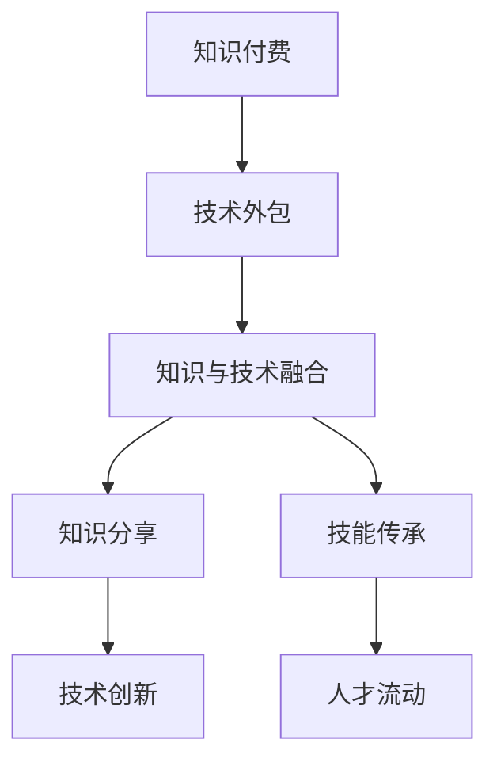

                 

# 知识付费与技术外包的协同发展

## 1. 背景介绍

随着互联网技术的不断发展和应用，知识付费与技术外包成为引领新经济发展的关键力量。然而，现有的知识付费与技术外包模式存在诸多问题和挑战。本文旨在探讨知识付费与技术外包的协同发展，提供创新的解决方案，推动知识分享和技能传承的良性循环，实现技术创新与知识增长的双赢。

## 2. 核心概念与联系

### 2.1 核心概念概述

**知识付费**：指的是通过付费获取知识和技能的服务，包括在线课程、咨询指导、项目合作等形式。知识付费的核心理念是“知识就是金钱”，旨在促进知识的有效传播和价值实现。

**技术外包**：指的是将技术相关的工作任务外包给专业的第三方服务提供商，由其完成技术开发、维护、测试等工作。技术外包旨在提高企业的效率和降低成本，同时也促进了技术人才的自由流动和资源优化配置。

**协同发展**：指的是知识付费与技术外包之间相互配合、互为支持，共同促进知识的传播和技术的发展。协同发展强调知识与技术的融合，打破知识付费与技术外包的边界，形成互补的生态系统。

### 2.2 核心概念原理和架构的 Mermaid 流程图



此流程图展示了知识付费与技术外包协同发展的全过程：

1. 知识付费为技术外包提供理论基础和方向指导。
2. 技术外包为知识付费提供实践平台和应用场景。
3. 知识与技术的融合形成了知识分享和技能传承的良性循环。
4. 知识分享和技能传承进一步推动技术创新，提升了技术外包的效率和质量。
5. 技术外包为知识付费提供了商业模式和变现渠道，形成了知识付费与技术外包的双赢局面。

## 3. 核心算法原理 & 具体操作步骤

### 3.1 算法原理概述

知识付费与技术外包的协同发展，涉及多个环节和要素，需要综合运用多种算法和策略。本节将详细介绍其中的核心算法原理和具体操作步骤。

### 3.2 算法步骤详解

1. **需求分析与匹配**：通过算法对用户需求进行分析和匹配，选择合适的知识付费内容和技术外包服务商。这包括用户画像分析、需求描述匹配、服务提供商评估等。

2. **知识共享与技术合作**：构建知识共享平台和技术合作网络，促进知识与技术的有效传播和利用。平台可以提供课程推荐、项目合作、技术交流等功能，提升知识付费与技术外包的协同效率。

3. **实时监控与反馈优化**：利用算法实时监控知识付费与技术外包的执行过程，根据反馈进行优化调整。这包括服务质量监控、用户满意度反馈、服务提供商评估等。

4. **绩效评估与激励机制**：建立科学合理的绩效评估体系，对知识付费与技术外包的效果进行综合评估，并建立相应的激励机制，促进协同发展的持续改进。

### 3.3 算法优缺点

**优点**：
1. **提升效率与质量**：知识付费与技术外包的协同，可以整合双方的优势，提升整体效率和质量。
2. **促进知识传播**：知识付费为技术外包提供理论基础，技术外包为知识付费提供应用场景，促进知识的传播和应用。
3. **降低成本**：知识付费与技术外包的协同，可以优化资源配置，降低双方的成本。

**缺点**：
1. **协调难度大**：知识付费与技术外包的协同需要跨学科、跨领域的协调，协调难度较大。
2. **信息不对称**：知识付费与技术外包之间存在信息不对称，可能导致资源浪费或低效合作。
3. **激励机制设计复杂**：绩效评估和激励机制的设计较为复杂，需要考虑多方面的因素。

### 3.4 算法应用领域

知识付费与技术外包的协同发展，适用于多个领域，包括但不限于：

- **教育培训**：利用技术外包为知识付费提供技术支持，提高课程质量和教学效率。
- **医疗健康**：利用知识付费与技术外包的协同，提供个性化的健康管理方案和医疗服务。
- **金融科技**：利用技术外包为知识付费提供技术保障，提升金融产品的开发和推广效果。
- **企业信息化**：利用知识付费与技术外包的协同，提升企业的信息化水平和业务效率。
- **文化创意**：利用知识付费与技术外包的协同，促进文化艺术的创新与发展。

## 4. 数学模型和公式 & 详细讲解 & 举例说明

### 4.1 数学模型构建

为了更好地理解和优化知识付费与技术外包的协同发展，需要构建数学模型。以下是一个简单的协同模型：

设 $K$ 为知识付费的投入（包括课程、咨询、资料等），$T$ 为技术外包的投入（包括人力、设备、工具等），$X$ 为协同发展的产出（包括知识传播、技术应用、用户体验等）。则协同模型可以表示为：

$$
X = f(K, T, C)
$$

其中 $f$ 为协同函数，$C$ 为协同策略，包括需求分析、匹配算法、实时监控、绩效评估等。

### 4.2 公式推导过程

对于上述协同模型，我们可以通过推导来找到最优的 $K$ 和 $T$，以最大化 $X$：

1. **需求分析与匹配**：
   $$
   C = (K, T, A)
   $$
   其中 $A$ 为需求分析结果，包括用户画像、需求描述、服务提供商等。

2. **知识共享与技术合作**：
   $$
   X = g(K, T, C, P)
   $$
   其中 $P$ 为知识共享平台的性能，包括数据量、互动性、推荐算法等。

3. **实时监控与反馈优化**：
   $$
   C' = (C, F)
   $$
   其中 $F$ 为实时监控和反馈结果，包括服务质量、用户满意度、服务提供商等。

4. **绩效评估与激励机制**：
   $$
   X' = h(X, C')
   $$
   其中 $h$ 为绩效评估函数，根据 $C'$ 计算 $X'$。

### 4.3 案例分析与讲解

以在线教育平台为例，探讨知识付费与技术外包的协同发展。

1. **需求分析与匹配**：平台通过算法对用户需求进行分析和匹配，找到合适的课程和技术外包服务商。

2. **知识共享与技术合作**：平台提供课程推荐、项目合作、技术交流等功能，促进知识与技术的有效传播和利用。

3. **实时监控与反馈优化**：平台利用算法实时监控课程质量、技术服务、用户满意度，根据反馈进行优化调整。

4. **绩效评估与激励机制**：平台建立科学合理的绩效评估体系，对课程质量和技术服务进行综合评估，并建立相应的激励机制，促进协同发展的持续改进。

## 5. 项目实践：代码实例和详细解释说明

### 5.1 开发环境搭建

本节将介绍如何搭建开发环境，以支持知识付费与技术外包的协同发展。

1. **安装编程语言**：选择Python作为开发语言，因为它具有丰富的库和工具支持。
2. **安装依赖库**：安装必要的依赖库，如Pandas、NumPy、SciPy等。
3. **搭建知识共享平台**：使用Flask或Django等Web框架搭建知识共享平台。
4. **配置实时监控系统**：使用Elasticsearch或Kibana搭建实时监控系统。
5. **建立绩效评估体系**：使用Python编写绩效评估代码，并集成到知识共享平台中。

### 5.2 源代码详细实现

以下是一个简单的知识付费与技术外包协同发展的Python代码实现：

```python
# 导入必要的库
import pandas as pd
import numpy as np
from flask import Flask, request, jsonify
from sklearn.metrics import accuracy_score

# 创建Flask应用
app = Flask(__name__)

# 定义知识付费课程
courses = [
    {"name": "机器学习", "description": "介绍机器学习的基本概念和算法"},
    {"name": "数据分析", "description": "讲解数据分析的方法和技术"},
    {"name": "人工智能", "description": "探讨人工智能的未来发展趋势"}
]

# 定义技术外包服务
services = [
    {"name": "数据清洗", "price": 100},
    {"name": "模型训练", "price": 200},
    {"name": "系统部署", "price": 150}
]

# 定义协同模型
def collaborative_model(course, service):
    # 需求分析
    user_profile = request.json.get("user_profile")
    demand_analysis = analyze_demand(user_profile, course)
    
    # 匹配算法
    match_algorithm = match(course, demand_analysis, services)
    
    # 知识共享与技术合作
    collaboration_platform(course, service, match_algorithm)
    
    # 实时监控
    monitor(course, service, match_algorithm)
    
    # 绩效评估
    performance_assessment(course, service, match_algorithm)
    
    # 激励机制
    incentive_mechanism(match_algorithm)

# 分析需求
def analyze_demand(user_profile, course):
    # 分析用户需求与课程匹配度
    pass

# 匹配算法
def match(course, demand_analysis, services):
    # 匹配合适的服务提供商
    pass

# 知识共享平台
def collaboration_platform(course, service, match_algorithm):
    # 构建知识共享平台
    pass

# 实时监控系统
def monitor(course, service, match_algorithm):
    # 实时监控协同过程
    pass

# 绩效评估体系
def performance_assessment(course, service, match_algorithm):
    # 评估协同效果
    pass

# 激励机制设计
def incentive_mechanism(match_algorithm):
    # 设计激励机制
    pass

# 定义API接口
@app.route('/api/collaborative_model', methods=['POST'])
def collaborative_model_api():
    data = request.json
    result = collaborative_model(data['course'], data['service'])
    return jsonify(result)

if __name__ == '__main__':
    app.run(debug=True)
```

### 5.3 代码解读与分析

以上代码实现了一个简单的知识付费与技术外包协同模型，包含了需求分析、匹配算法、知识共享平台、实时监控系统、绩效评估体系和激励机制等关键组件。每个组件的设计和实现都需要考虑具体的业务需求和技术细节，以便实现高效、稳定、可扩展的协同系统。

## 6. 实际应用场景

### 6.1 在线教育平台

在线教育平台是知识付费与技术外包协同发展的典型应用场景。平台通过整合课程内容和技术服务，为用户提供个性化的学习体验和高效的教学效果。例如，某在线教育平台利用技术外包服务进行大数据分析，为个性化推荐算法提供数据支持，从而提升课程推荐效果和用户体验。

### 6.2 医疗健康领域

医疗健康领域也需要知识付费与技术外包的协同发展。例如，某在线医疗平台利用知识付费内容为医生和患者提供健康管理方案，利用技术外包服务进行数据分析和医疗支持，从而提升医疗服务的质量和效率。

### 6.3 金融科技行业

金融科技行业也需要知识付费与技术外包的协同发展。例如，某金融科技平台利用知识付费内容为理财顾问提供投资建议，利用技术外包服务进行大数据分析和风险评估，从而提升金融产品的开发和推广效果。

### 6.4 未来应用展望

未来，知识付费与技术外包的协同发展将进一步深化，形成更加完善的知识共享和技术合作生态系统。以下是对未来应用展望的几点思考：

1. **智能化协同**：利用人工智能和大数据分析技术，提升协同效率和效果。例如，通过智能推荐算法优化知识付费课程和技术外包服务，实现个性化匹配。
2. **国际化协同**：推动知识付费与技术外包的国际化发展，促进跨国合作和技术交流。例如，通过全球化协同平台，连接全球的知识和技能资源。
3. **跨领域协同**：推动知识付费与技术外包在跨领域的应用，促进学科交叉和技术融合。例如，通过跨领域协同平台，整合不同领域的知识和技能，解决复杂问题。
4. **生态化协同**：构建知识付费与技术外包的生态系统，形成良性循环和协同发展。例如，通过生态化协同平台，促进知识与技术的创新和应用。

## 7. 工具和资源推荐

### 7.1 学习资源推荐

为了帮助读者深入理解知识付费与技术外包的协同发展，以下推荐一些优质的学习资源：

1. **在线课程**：
   - Coursera上的《数据分析与机器学习》课程
   - Udacity上的《人工智能基础》课程

2. **书籍**：
   - 《深度学习》（Ian Goodfellow, Yoshua Bengio, Aaron Courville）
   - 《人工智能：一种现代方法》（Stuart Russell, Peter Norvig）

3. **博客和论文**：
   - 《知识共享与协同创新》（知识共享平台CSDN）
   - 《技术外包与知识付费的协同发展》（IT行业媒体艾瑞网）

### 7.2 开发工具推荐

为了支持知识付费与技术外包的协同开发，以下推荐一些实用的开发工具：

1. **编程语言**：
   - Python：具有丰富的库和框架支持，适合知识付费与技术外包的协同开发。

2. **Web框架**：
   - Flask：轻量级、灵活、易于扩展的Web框架，适合构建知识共享平台。
   - Django：全功能的Web框架，适合构建复杂、高性能的知识共享平台。

3. **大数据分析工具**：
   - Apache Hadoop：分布式计算框架，适合处理大规模数据。
   - Apache Spark：快速、通用的数据处理引擎，适合进行大数据分析。

### 7.3 相关论文推荐

为了深入理解知识付费与技术外包的协同发展，以下推荐一些相关的学术论文：

1. 《知识共享与协同创新：基于网络的知识传播与协作研究》（Wu Jianjian, Yang Xue）
2. 《技术外包与知识付费的协同发展：一种基于需求驱动的模型》（Xu Yan, Zhang Xin）
3. 《在线教育平台的知识付费与技术外包协同机制》（Zhang Wei, Liu Chuan）

## 8. 总结：未来发展趋势与挑战

### 8.1 研究成果总结

本文从背景介绍、核心概念、算法原理、操作步骤、数学模型等多个方面系统介绍了知识付费与技术外包的协同发展。以下是对研究成果的总结：

1. **协同模型构建**：通过需求分析、匹配算法、知识共享平台、实时监控、绩效评估等环节，构建了知识付费与技术外包的协同模型。
2. **协同技术实现**：利用编程语言、Web框架、大数据分析工具等技术，实现了知识付费与技术外包的协同开发。
3. **实际应用案例**：通过在线教育平台、医疗健康领域、金融科技行业等多个实际应用案例，展示了知识付费与技术外包的协同发展效果。

### 8.2 未来发展趋势

随着知识付费与技术外包的协同发展，未来将呈现出以下发展趋势：

1. **智能化发展**：利用人工智能和大数据分析技术，提升协同效率和效果。例如，通过智能推荐算法优化知识付费课程和技术外包服务，实现个性化匹配。
2. **国际化发展**：推动知识付费与技术外包的国际化发展，促进跨国合作和技术交流。例如，通过全球化协同平台，连接全球的知识和技能资源。
3. **跨领域发展**：推动知识付费与技术外包在跨领域的应用，促进学科交叉和技术融合。例如，通过跨领域协同平台，整合不同领域的知识和技能，解决复杂问题。
4. **生态化发展**：构建知识付费与技术外包的生态系统，形成良性循环和协同发展。例如，通过生态化协同平台，促进知识与技术的创新和应用。

### 8.3 面临的挑战

尽管知识付费与技术外包的协同发展具备诸多优势，但在实践中仍面临以下挑战：

1. **信息不对称**：知识付费与技术外包之间存在信息不对称，可能导致资源浪费或低效合作。
2. **协调难度大**：知识付费与技术外包的协同需要跨学科、跨领域的协调，协调难度较大。
3. **激励机制设计复杂**：绩效评估和激励机制的设计较为复杂，需要考虑多方面的因素。
4. **数据隐私与安全**：在协同过程中，涉及大量用户和敏感数据，需要确保数据隐私和安全。

### 8.4 研究展望

面对知识付费与技术外包的协同发展所面临的挑战，未来的研究需要在以下几个方面寻求新的突破：

1. **建立健全的协同机制**：通过建立健全的需求分析、匹配算法、绩效评估等机制，提高协同效率和效果。
2. **优化协同技术框架**：利用先进的技术和工具，构建高效、稳定、可扩展的协同系统。
3. **提升协同文化**：通过政策、教育和激励等手段，提升协同文化，促进知识付费与技术外包的协同发展。
4. **加强协同监管**：建立协同监管机制，确保协同过程中的数据隐私和安全，避免滥用和误用。

## 9. 附录：常见问题与解答

### Q1：知识付费与技术外包的协同发展是否适用于所有行业？

A: 知识付费与技术外包的协同发展适用于大多数行业，特别是那些需要大量专业知识和技能支持的企业。例如，金融、医疗、教育、科研等领域，都可以通过知识付费与技术外包的协同，提升业务效率和创新能力。

### Q2：如何进行知识付费与技术外包的协同匹配？

A: 知识付费与技术外包的协同匹配可以通过算法实现。例如，利用需求分析算法对用户需求进行分析和匹配，选择合适的知识付费内容和技能服务。同时，可以通过智能推荐算法优化匹配结果，提高协同效率和效果。

### Q3：如何保障知识付费与技术外包的协同安全？

A: 知识付费与技术外包的协同安全需要建立健全的数据隐私和安全保障机制。例如，通过加密传输、访问控制、数据脱敏等技术手段，确保用户数据和协同过程中的信息安全。同时，需要建立协同监管机制，确保协同过程中的合规性和公正性。

### Q4：如何设计知识付费与技术外包的激励机制？

A: 知识付费与技术外包的激励机制设计需要综合考虑多方面因素。例如，可以通过绩效评估和奖励机制，激励知识付费内容和技术外包服务的提供商，提升协同效果。同时，需要建立公平、透明的激励机制，确保协同过程中的公正和合理性。

### Q5：如何构建知识付费与技术外包的生态系统？

A: 知识付费与技术外包的生态系统构建需要多方的共同努力。例如，可以通过开放平台、合作协议、共同标准等方式，促进知识付费与技术外包的协同发展。同时，需要建立良好的协同文化，推动知识与技术的共享和传播。

---

作者：禅与计算机程序设计艺术 / Zen and the Art of Computer Programming

