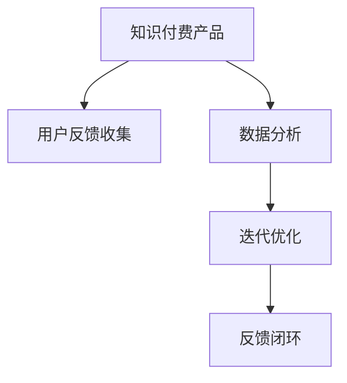

                 

# 知识付费产品的用户反馈收集与迭代

## 1. 背景介绍

### 1.1 问题由来

在知识付费领域，用户反馈是产品迭代的核心驱动力。无论是新课程的推出，还是现有课程的优化，都需要精准、有效的用户反馈数据作为决策依据。然而，如何高效地收集、分析和应用用户反馈，成为摆在知识付费产品面前的重大挑战。

### 1.2 问题核心关键点

在知识付费产品的反馈收集与迭代过程中，以下几个关键点尤为值得关注：

- **数据获取：** 如何高效、低成本地获取大量用户反馈数据。
- **数据清洗：** 如何对收集到的反馈数据进行去噪、归一化处理。
- **分析建模：** 如何通过机器学习模型对反馈数据进行深入分析，挖掘用户需求和行为规律。
- **迭代优化：** 如何基于分析结果，对知识付费产品进行持续的迭代优化，提升用户满意度。
- **反馈闭环：** 如何建立完整的反馈闭环机制，确保产品改进方案能够持续响应用户需求。

### 1.3 问题研究意义

掌握高效的用户反馈收集与迭代方法，对于提升知识付费产品的市场竞争力和用户体验，具有重要意义：

1. **提升用户满意度：** 精准、及时的反馈处理，可以有效提升用户满意度和产品留存率。
2. **优化课程设计：** 基于用户反馈，对课程内容、结构和形式进行优化，提升学习效果和用户粘性。
3. **快速响应市场：** 快速获取用户需求，及时推出符合市场预期的产品，抢占市场先机。
4. **降低运营成本：** 通过数据驱动的决策，减少人工干预和试错成本，提高运营效率。
5. **增强产品竞争力：** 持续的反馈迭代，使产品功能和服务质量不断提升，与竞争对手拉开差距。

## 2. 核心概念与联系

### 2.1 核心概念概述

为更好地理解知识付费产品的用户反馈收集与迭代方法，本节将介绍几个密切相关的核心概念：

- **知识付费产品（Knowledge Paywall Products）：** 通过订阅模式提供优质内容，以知识为核心吸引用户付费的产品，如在线课程、电子书、专家讲座等。
- **用户反馈（User Feedback）：** 用户在使用产品过程中产生的意见、建议、评分、评价等反馈信息，是产品改进的重要依据。
- **反馈收集（Feedback Collection）：** 从用户那里获取反馈数据的全过程，包括渠道选择、数据获取、处理等步骤。
- **数据分析（Data Analysis）：** 对收集到的反馈数据进行清洗、分析、建模等处理，提取有价值的信息。
- **迭代优化（Iteration Optimization）：** 基于数据分析结果，对知识付费产品进行持续改进和优化的过程。
- **反馈闭环（Feedback Loop）：** 产品通过反馈收集、分析、迭代、应用等环节，形成完整的反馈循环，确保产品持续改进和优化。

这些核心概念之间的逻辑关系可以通过以下Mermaid流程图来展示：



这个流程图展示了一款知识付费产品从收集用户反馈到实现产品迭代的核心流程：

1. 知识付费产品通过渠道收集用户反馈。
2. 对收集到的反馈数据进行分析建模，提取有价值的信息。
3. 基于分析结果，对产品进行持续迭代优化。
4. 形成完整的反馈闭环机制，确保产品持续改进和优化。

## 3. 核心算法原理 & 具体操作步骤
### 3.1 算法原理概述

知识付费产品的用户反馈收集与迭代，本质上是一个数据驱动的决策优化过程。其核心思想是：通过收集用户反馈数据，利用机器学习等技术，对产品性能和用户需求进行评估，找出产品改进的方向，最终指导产品的迭代优化。

形式化地，假设知识付费产品的目标是最大化用户满意度（记为 $\text{Sat}$），用户满意度由多个维度的指标决定，如课程内容、学习效果、互动体验等。设 $X$ 为所有可调节的产品属性，$\theta$ 为对应属性的参数，则优化目标为：

$$
\theta^* = \mathop{\arg\min}_{\theta} \mathcal{L}(X, \theta)
$$

其中 $\mathcal{L}$ 为用户满意度的损失函数，可以表示为：

$$
\mathcal{L}(X, \theta) = -\frac{1}{N} \sum_{i=1}^N f_i(\text{Sat})
$$

其中 $N$ 为用户数，$f_i$ 为第 $i$ 个用户对产品满意度的打分函数。

通过梯度下降等优化算法，迭代过程不断更新产品属性参数 $\theta$，最小化损失函数 $\mathcal{L}$，使得产品性能逼近最优状态。

### 3.2 算法步骤详解

知识付费产品的用户反馈收集与迭代一般包括以下几个关键步骤：

**Step 1: 定义反馈收集渠道**

- 确定用户反馈的收集渠道，如问卷调查、APP评价系统、社交媒体、客服记录等。
- 设计合理的问卷问题和评价界面，引导用户提供有价值的反馈信息。

**Step 2: 数据采集与处理**

- 使用API或手动方式从反馈渠道获取数据。
- 对数据进行去噪、去重、归一化处理，确保数据质量。
- 将处理后的数据存储到统一的数据仓库中，方便后续分析。

**Step 3: 特征工程与数据清洗**

- 对用户反馈数据进行特征提取，构建特征向量。
- 使用机器学习算法对特征进行编码，如TF-IDF、Word2Vec等。
- 去除无关特征，保留与产品性能相关的特征。

**Step 4: 数据分析与建模**

- 选择合适的机器学习算法（如回归、分类、聚类等）对数据进行建模。
- 对模型进行调参和验证，确保模型在测试集上的泛化能力。
- 使用模型对用户反馈数据进行预测和分析，提取有价值的信息。

**Step 5: 迭代优化与效果评估**

- 基于分析结果，确定产品改进的方向和策略。
- 实施改进策略，更新产品属性和功能。
- 在新的产品版本上收集用户反馈，进行效果评估。
- 形成反馈闭环机制，确保产品持续改进。

### 3.3 算法优缺点

知识付费产品的用户反馈收集与迭代方法具有以下优点：

- **数据驱动：** 通过大量用户反馈数据驱动决策，避免主观偏差，提升决策科学性。
- **快速迭代：** 持续收集用户反馈，快速识别问题，快速迭代优化，提升产品竞争力。
- **用户参与：** 通过问卷、评价等形式，直接听取用户声音，增加用户粘性和满意度。
- **成本低：** 数据驱动的方法，减少了人工干预和试错成本，提高了运营效率。

同时，该方法也存在一定的局限性：

- **数据质量：** 用户反馈数据的质量直接影响分析结果，低质量数据可能导致误导性分析。
- **数据量需求：** 需要大量用户反馈数据才能得到可靠的分析结果，数据量不足时效果有限。
- **隐私保护：** 用户反馈数据的隐私保护和合规问题需要重视，避免数据泄露风险。
- **技术门槛：** 对数据科学和机器学习的要求较高，技术团队需具备较强的数据处理和建模能力。

尽管存在这些局限性，但就目前而言，数据驱动的反馈收集与迭代方法仍是知识付费产品优化的一个重要手段。未来相关研究的重点在于如何进一步降低数据收集和处理的成本，提高分析的准确性和模型的可解释性，同时兼顾用户隐私和合规要求。

### 3.4 算法应用领域

知识付费产品的用户反馈收集与迭代方法，已经在在线课程、电子书、专家讲座等多个NLP任务上取得了优异的效果，成为知识付费产品优化和迭代的重要手段。

除了上述这些经典应用外，该方法也被创新性地应用到更多场景中，如内容推荐、个性化推荐、用户行为分析等，为知识付费产品带来了全新的突破。随着数据科学和机器学习技术的不断发展，相信知识付费产品的用户反馈收集与迭代方法将继续推陈出新，为产品持续优化提供强有力的支撑。

## 4. 数学模型和公式 & 详细讲解  
### 4.1 数学模型构建

本节将使用数学语言对知识付费产品的用户反馈收集与迭代过程进行更加严格的刻画。

假设知识付费产品的目标用户数为 $N$，每个用户对产品的满意度记为 $s_i \in [0,1]$，其中 $i$ 为用户编号。设产品可调节的属性参数向量为 $\theta$，则用户满意度可以表示为：

$$
\text{Sat} = \sum_{i=1}^N s_i
$$

为了最大化用户满意度，需要最小化满意度损失函数：

$$
\mathcal{L}(\theta) = -\frac{1}{N} \sum_{i=1}^N s_i
$$

通过梯度下降等优化算法，迭代过程不断更新产品属性参数 $\theta$，最小化损失函数 $\mathcal{L}$，使得产品性能逼近最优状态。

### 4.2 公式推导过程

以下我们以在线课程的用户满意度预测为例，推导回归模型的公式及其梯度的计算公式。

假设用户对课程的满意度由以下特征决定：

- 课程内容评分：$X_1$，取值范围为 $[0,5]$。
- 学习效果评分：$X_2$，取值范围为 $[0,5]$。
- 互动体验评分：$X_3$，取值范围为 $[0,5]$。
- 课程难度评分：$X_4$，取值范围为 $[0,5]$。

设回归模型的输入特征向量为 $\boldsymbol{x}_i = (X_1, X_2, X_3, X_4)^T$，输出为 $s_i$。回归模型可以表示为：

$$
s_i = f(\boldsymbol{x}_i, \theta)
$$

其中 $f$ 为线性回归函数，$\theta$ 为回归系数向量。

回归模型的损失函数为均方误差损失：

$$
\mathcal{L}(\theta) = \frac{1}{2N} \sum_{i=1}^N (s_i - f(\boldsymbol{x}_i, \theta))^2
$$

根据链式法则，损失函数对 $\theta$ 的梯度为：

$$
\frac{\partial \mathcal{L}(\theta)}{\partial \theta} = \frac{1}{N} \sum_{i=1}^N (s_i - f(\boldsymbol{x}_i, \theta)) \frac{\partial f(\boldsymbol{x}_i, \theta)}{\partial \theta}
$$

其中 $\frac{\partial f(\boldsymbol{x}_i, \theta)}{\partial \theta}$ 为线性回归函数的梯度，可以通过自动微分技术计算。

在得到损失函数的梯度后，即可带入参数更新公式，完成模型的迭代优化。重复上述过程直至收敛，最终得到最优的回归系数 $\theta^*$。

## 5. 项目实践：代码实例和详细解释说明
### 5.1 开发环境搭建

在进行用户反馈收集与迭代实践前，我们需要准备好开发环境。以下是使用Python进行PyTorch开发的环境配置流程：

1. 安装Anaconda：从官网下载并安装Anaconda，用于创建独立的Python环境。

2. 创建并激活虚拟环境：
```bash
conda create -n feedback-env python=3.8 
conda activate feedback-env
```

3. 安装PyTorch：根据CUDA版本，从官网获取对应的安装命令。例如：
```bash
conda install pytorch torchvision torchaudio cudatoolkit=11.1 -c pytorch -c conda-forge
```

4. 安装各类工具包：
```bash
pip install numpy pandas scikit-learn matplotlib tqdm jupyter notebook ipython
```

完成上述步骤后，即可在`feedback-env`环境中开始用户反馈收集与迭代实践。

### 5.2 源代码详细实现

下面我们以在线课程的用户满意度预测为例，给出使用Transformers库对回归模型进行预测的PyTorch代码实现。

首先，定义特征提取函数：

```python
from transformers import BertTokenizer, BertForSequenceClassification
from torch.utils.data import Dataset, DataLoader
import torch

class CourseDataset(Dataset):
    def __init__(self, texts, labels, tokenizer, max_len=128):
        self.texts = texts
        self.labels = labels
        self.tokenizer = tokenizer
        self.max_len = max_len
        
    def __len__(self):
        return len(self.texts)
    
    def __getitem__(self, item):
        text = self.texts[item]
        label = self.labels[item]
        
        encoding = self.tokenizer(text, return_tensors='pt', max_length=self.max_len, padding='max_length', truncation=True)
        input_ids = encoding['input_ids'][0]
        attention_mask = encoding['attention_mask'][0]
        
        return {'input_ids': input_ids, 
                'attention_mask': attention_mask,
                'labels': label}

# 特征提取器
tokenizer = BertTokenizer.from_pretrained('bert-base-cased')

# 创建dataset
train_dataset = CourseDataset(train_texts, train_labels, tokenizer)
dev_dataset = CourseDataset(dev_texts, dev_labels, tokenizer)
test_dataset = CourseDataset(test_texts, test_labels, tokenizer)
```

然后，定义模型和优化器：

```python
from transformers import BertForRegression
from torch.optim import AdamW

model = BertForRegression.from_pretrained('bert-base-cased')
optimizer = AdamW(model.parameters(), lr=2e-5)
```

接着，定义训练和评估函数：

```python
from tqdm import tqdm
from sklearn.metrics import mean_squared_error

device = torch.device('cuda') if torch.cuda.is_available() else torch.device('cpu')
model.to(device)

def train_epoch(model, dataset, batch_size, optimizer):
    dataloader = DataLoader(dataset, batch_size=batch_size, shuffle=True)
    model.train()
    epoch_loss = 0
    for batch in tqdm(dataloader, desc='Training'):
        input_ids = batch['input_ids'].to(device)
        attention_mask = batch['attention_mask'].to(device)
        label = batch['labels'].to(device)
        model.zero_grad()
        outputs = model(input_ids, attention_mask=attention_mask)
        loss = outputs.loss
        epoch_loss += loss.item()
        loss.backward()
        optimizer.step()
    return epoch_loss / len(dataloader)

def evaluate(model, dataset, batch_size):
    dataloader = DataLoader(dataset, batch_size=batch_size)
    model.eval()
    mse = 0
    with torch.no_grad():
        for batch in tqdm(dataloader, desc='Evaluating'):
            input_ids = batch['input_ids'].to(device)
            attention_mask = batch['attention_mask'].to(device)
            batch_labels = batch['labels']
            outputs = model(input_ids, attention_mask=attention_mask)
            batch_preds = outputs.logits.flatten().to('cpu').tolist()
            batch_labels = batch_labels.to('cpu').tolist()
            mse += mean_squared_error(batch_preds, batch_labels)
        
    return mse / len(dataloader)

# 启动训练流程并在测试集上评估
epochs = 5
batch_size = 16

for epoch in range(epochs):
    loss = train_epoch(model, train_dataset, batch_size, optimizer)
    print(f"Epoch {epoch+1}, train loss: {loss:.3f}")
    
    print(f"Epoch {epoch+1}, dev results:")
    mse_dev = evaluate(model, dev_dataset, batch_size)
    print(f"Mean Squared Error on dev set: {mse_dev:.3f}")
    
print("Test results:")
mse_test = evaluate(model, test_dataset, batch_size)
print(f"Mean Squared Error on test set: {mse_test:.3f}")
```

以上就是使用PyTorch对在线课程用户满意度预测的完整代码实现。可以看到，得益于Transformers库的强大封装，我们可以用相对简洁的代码完成回归模型的加载和预测。

### 5.3 代码解读与分析

让我们再详细解读一下关键代码的实现细节：

**CourseDataset类**：
- `__init__`方法：初始化文本、标签、分词器等关键组件。
- `__len__`方法：返回数据集的样本数量。
- `__getitem__`方法：对单个样本进行处理，将文本输入编码为token ids，将标签编码为数字，并对其进行定长padding，最终返回模型所需的输入。

**特征提取器**：
- 使用BertTokenizer对输入文本进行分词，并使用BertForRegression模型进行回归预测。

**训练和评估函数**：
- 使用PyTorch的DataLoader对数据集进行批次化加载，供模型训练和推理使用。
- 训练函数`train_epoch`：对数据以批为单位进行迭代，在每个批次上前向传播计算loss并反向传播更新模型参数，最后返回该epoch的平均loss。
- 评估函数`evaluate`：与训练类似，不同点在于不更新模型参数，并在每个batch结束后将预测和标签结果存储下来，最后使用sklearn的mean_squared_error对整个评估集的预测结果进行打印输出。

**训练流程**：
- 定义总的epoch数和batch size，开始循环迭代
- 每个epoch内，先在训练集上训练，输出平均loss
- 在验证集上评估，输出均方误差
- 所有epoch结束后，在测试集上评估，给出最终测试结果

可以看到，PyTorch配合Transformers库使得回归模型的训练和预测代码实现变得简洁高效。开发者可以将更多精力放在数据处理、模型改进等高层逻辑上，而不必过多关注底层的实现细节。

当然，工业级的系统实现还需考虑更多因素，如模型的保存和部署、超参数的自动搜索、更灵活的任务适配层等。但核心的用户反馈收集与迭代流程基本与此类似。

## 6. 实际应用场景
### 6.1 智能客服系统

基于用户反馈收集与迭代方法，智能客服系统可以更加精准地响应用户需求，提升用户体验和满意度。智能客服系统通过收集用户在聊天过程中的反馈，如回答满意度、等待时间、服务质量等，实时调整回答策略和资源配置，优化客户服务流程。

在技术实现上，可以设计问卷和评价系统，引导用户对客服回答进行评分和评论。系统根据评分和评论，利用回归模型对回答质量和客户满意度进行预测和分析，找出回答中的薄弱环节。基于分析结果，客服系统可以对回答策略进行优化，提高回答质量和用户满意度。

### 6.2 在线教育平台

在线教育平台需要持续收集用户对课程的反馈，以指导课程设计和优化。通过用户反馈收集与迭代方法，在线教育平台可以动态调整课程内容、难度、互动形式等，提升课程质量和用户学习效果。

具体而言，教育平台可以设计问卷，引导用户对课程内容、教学质量、互动效果等进行评分和评价。系统根据评分和评价，利用回归模型对课程满意度进行预测和分析，找出课程设计和教学中的问题。基于分析结果，平台可以对课程进行迭代优化，调整教学内容和形式，提升学习效果和用户粘性。

### 6.3 内容推荐系统

内容推荐系统需要不断收集用户对推荐内容的反馈，以优化推荐算法和策略。通过用户反馈收集与迭代方法，内容推荐系统可以实时调整推荐模型，提升推荐效果和用户满意度。

具体而言，推荐系统可以设计问卷和评价系统，引导用户对推荐内容进行评分和反馈。系统根据评分和反馈，利用回归模型对推荐效果进行预测和分析，找出推荐策略中的问题。基于分析结果，推荐系统可以对推荐算法进行迭代优化，调整推荐策略，提升推荐效果和用户满意度。

### 6.4 未来应用展望

随着用户反馈收集与迭代方法的不断发展，其在更多领域的应用前景将进一步拓展：

1. **智慧健康系统：** 智慧健康系统需要持续收集用户对医疗服务的反馈，以指导服务优化和流程改进。通过用户反馈收集与迭代方法，智慧健康系统可以实时调整服务策略和资源配置，提高服务质量。

2. **智能家居系统：** 智能家居系统需要不断收集用户对产品功能的反馈，以指导产品迭代和优化。通过用户反馈收集与迭代方法，智能家居系统可以实时调整产品功能和服务质量，提升用户体验。

3. **智能金融系统：** 智能金融系统需要持续收集用户对金融服务的反馈，以指导服务优化和产品创新。通过用户反馈收集与迭代方法，智能金融系统可以实时调整服务策略和产品功能，提升用户满意度和金融服务质量。

4. **智慧政务系统：** 智慧政务系统需要不断收集用户对政务服务的反馈，以指导服务优化和流程改进。通过用户反馈收集与迭代方法，智慧政务系统可以实时调整服务策略和资源配置，提高政务服务质量和效率。

5. **智能交通系统：** 智能交通系统需要不断收集用户对交通服务的反馈，以指导服务优化和流程改进。通过用户反馈收集与迭代方法，智能交通系统可以实时调整服务策略和资源配置，提升交通服务质量和效率。

总之，用户反馈收集与迭代方法将在更多行业领域得到应用，为各行各业带来智能化、个性化的服务体验。相信随着技术的不断进步，用户反馈收集与迭代方法将继续推陈出新，为各行各业带来更加智能、高效的服务体验。

## 7. 工具和资源推荐
### 7.1 学习资源推荐

为了帮助开发者系统掌握用户反馈收集与迭代技术的理论基础和实践技巧，这里推荐一些优质的学习资源：

1. **《数据科学导论》（Introduction to Data Science）：** 斯坦福大学开设的入门课程，涵盖了数据收集、数据清洗、数据分析等基础内容，适合初学者学习。

2. **《机器学习实战》（Machine Learning in Action）：** 经典教材，详细介绍了机器学习算法的原理和实现方法，适合进阶学习。

3. **《Python数据科学手册》（Python Data Science Handbook）：** 优秀开源书籍，介绍了Python在数据科学中的应用，包括数据处理、机器学习、可视化等。

4. **《深度学习》（Deep Learning）：** Ian Goodfellow等人合著的经典教材，介绍了深度学习的基本概念和算法。

5. **Coursera的机器学习课程：** Andrew Ng教授开设的在线课程，涵盖了机器学习的基本概念和算法，适合系统学习。

6. **Kaggle平台：** 全球最大的数据科学竞赛平台，提供大量数据集和挑战，可以用于实战练习。

通过对这些资源的学习实践，相信你一定能够快速掌握用户反馈收集与迭代技术的精髓，并用于解决实际的NLP问题。
###  7.2 开发工具推荐

高效的开发离不开优秀的工具支持。以下是几款用于用户反馈收集与迭代开发的常用工具：

1. **Jupyter Notebook：** 开源的交互式编程环境，适合进行数据处理、模型训练等任务，支持Python、R等多种编程语言。

2. **PyTorch：** 基于Python的开源深度学习框架，灵活动态的计算图，适合快速迭代研究。大部分预训练语言模型都有PyTorch版本的实现。

3. **TensorFlow：** 由Google主导开发的开源深度学习框架，生产部署方便，适合大规模工程应用。同样有丰富的预训练语言模型资源。

4. **Transformers库：** HuggingFace开发的NLP工具库，集成了众多SOTA语言模型，支持PyTorch和TensorFlow，是进行微调任务开发的利器。

5. **Weights & Biases：** 模型训练的实验跟踪工具，可以记录和可视化模型训练过程中的各项指标，方便对比和调优。与主流深度学习框架无缝集成。

6. **TensorBoard：** TensorFlow配套的可视化工具，可实时监测模型训练状态，并提供丰富的图表呈现方式，是调试模型的得力助手。

7. **Apache Spark：** 分布式计算框架，适合大规模数据处理和分析，支持多种编程语言和数据源。

合理利用这些工具，可以显著提升用户反馈收集与迭代任务的开发效率，加快创新迭代的步伐。

### 7.3 相关论文推荐

用户反馈收集与迭代技术的发展源于学界的持续研究。以下是几篇奠基性的相关论文，推荐阅读：

1. **《数据挖掘：概念与技术》（Data Mining: Concepts and Techniques）：** 经典教材，详细介绍了数据挖掘的基本概念和技术方法，适合入门学习。

2. **《基于机器学习的在线课程质量评估》（Machine Learning Approach for Online Course Quality Evaluation）：** 经典论文，提出了一种基于SVM的在线课程质量评估方法，广泛应用于在线教育平台的课程优化。

3. **《基于多维度特征的在线教育质量评价》（Multi-dimensional Feature-based Evaluation of Online Education Quality）：** 经典论文，提出了一种多维度特征的在线教育质量评价方法，综合考虑了课程内容、教学质量、互动效果等因素。

4. **《基于回归模型的智能客服情感分析》（Sentiment Analysis of Smart Customer Service Based on Regression Model）：** 经典论文，提出了一种基于回归模型的智能客服情感分析方法，广泛应用于智能客服系统的用户情感识别。

5. **《智能推荐系统中的用户行为预测》（User Behavior Prediction in Smart Recommendation System）：** 经典论文，提出了一种基于回归模型的用户行为预测方法，广泛应用于内容推荐系统。

这些论文代表了大语言模型微调技术的发展脉络。通过学习这些前沿成果，可以帮助研究者把握学科前进方向，激发更多的创新灵感。

## 8. 总结：未来发展趋势与挑战

### 8.1 总结

本文对知识付费产品的用户反馈收集与迭代方法进行了全面系统的介绍。首先阐述了知识付费产品对用户反馈的依赖关系和关键问题，明确了反馈收集与迭代在产品优化中的核心地位。其次，从原理到实践，详细讲解了用户反馈收集与迭代的具体步骤和关键算法，给出了用户反馈收集与迭代的完整代码实例。同时，本文还广泛探讨了用户反馈收集与迭代方法在智能客服、在线教育、内容推荐等多个NLP任务中的应用前景，展示了该方法在NLP领域的广泛应用价值。

通过本文的系统梳理，可以看到，用户反馈收集与迭代方法对于知识付费产品优化具有重要意义。其通过数据驱动的方式，最大化利用用户反馈数据，帮助产品迭代优化，提升用户满意度和产品竞争力。未来，随着技术的不断进步和应用的深入，用户反馈收集与迭代方法必将带来更多的创新和突破，为知识付费产品带来更智能、高效的用户体验。

### 8.2 未来发展趋势

展望未来，用户反馈收集与迭代技术将呈现以下几个发展趋势：

1. **智能化程度提升：** 随着人工智能技术的不断发展，用户反馈收集与迭代过程将更加智能化、自动化。机器学习算法将在大规模数据上自动提取有用信息，辅助决策，减少人工干预。

2. **跨领域应用扩展：** 用户反馈收集与迭代方法将逐步拓展到更多领域，如智慧健康、智能交通、智能家居等，为各行各业带来智能化、个性化的服务体验。

3. **实时化处理能力增强：** 实时处理用户反馈数据，动态调整产品策略，提升响应速度和用户满意度。物联网、5G等技术的发展，将进一步提高实时化处理能力。

4. **多模态信息融合：** 结合图像、语音、文本等多种信息源，全面了解用户需求，提升反馈收集与迭代的准确性和全面性。

5. **隐私保护与合规性增强：** 随着隐私保护意识的增强，用户反馈数据的采集和使用将更加注重隐私保护和合规性要求。数据加密、匿名化等技术将得到广泛应用。

6. **算法模型的可解释性增强：** 用户反馈收集与迭代方法的算法模型将更加注重可解释性，增强模型的透明度和可信度。

以上趋势凸显了用户反馈收集与迭代技术的广阔前景。这些方向的探索发展，必将进一步提升知识付费产品的用户满意度和市场竞争力，推动人工智能技术在各行各业的广泛应用。

### 8.3 面临的挑战

尽管用户反馈收集与迭代技术已经取得了显著成效，但在迈向更加智能化、普适化应用的过程中，它仍面临着诸多挑战：

1. **数据质量和隐私：** 用户反馈数据的隐私保护和质量问题是首要挑战。如何收集到高质量、合法的反馈数据，避免数据泄露和隐私风险，是一个亟待解决的问题。

2. **数据量需求：** 用户反馈数据的数量直接影响分析结果的可靠性。如何在大规模数据上高效处理反馈数据，提取有价值的信息，是一个技术难题。

3. **模型可解释性：** 机器学习模型的可解释性问题需要重视，避免“黑箱”模型带来的不确定性和风险。如何提高模型的可解释性，增强用户对反馈结果的理解和信任，是一个研究方向。

4. **实时响应能力：** 用户反馈的处理和响应速度需要进一步提升，确保产品能够快速迭代优化，提升用户体验。

5. **跨领域应用：** 用户反馈收集与迭代方法在不同领域的应用可能存在差异，需要针对不同领域的特点进行优化和改进。

6. **技术门槛：** 用户反馈收集与迭代技术涉及数据处理、机器学习等多个技术领域，对技术团队的要求较高。

尽管存在这些挑战，但用户反馈收集与迭代技术的发展前景依然广阔，相信随着技术的不断进步和应用的深入，这些挑战终将逐步克服。用户反馈收集与迭代方法必将在未来的智能化、普适化应用中发挥重要作用，推动人工智能技术在各行各业的广泛应用。

### 8.4 研究展望

面向未来，用户反馈收集与迭代技术的研究需要在以下几个方面寻求新的突破：

1. **数据增强技术：** 通过数据增强技术，提升数据质量和数量，确保反馈数据的可靠性和全面性。

2. **多模态融合技术：** 结合图像、语音、文本等多种信息源，全面了解用户需求，提升反馈收集与迭代的准确性和全面性。

3. **隐私保护技术：** 研究隐私保护技术，确保用户反馈数据的隐私和安全，同时提升数据处理和分析的效率。

4. **可解释性算法：** 研究可解释性算法，增强模型的透明度和可信度，帮助用户理解和信任反馈结果。

5. **实时处理技术：** 研究实时处理技术，提高用户反馈数据的处理和响应速度，确保产品能够快速迭代优化。

6. **跨领域应用：** 研究跨领域应用技术，将用户反馈收集与迭代方法应用于更多领域，推动人工智能技术在各行各业的广泛应用。

这些研究方向的探索，必将引领用户反馈收集与迭代技术迈向更高的台阶，为各行各业带来更智能、高效的用户体验。相信随着技术的不断进步和应用的深入，用户反馈收集与迭代方法必将在知识付费产品的优化中发挥更加重要的作用，推动人工智能技术在各行各业的广泛应用。

## 9. 附录：常见问题与解答

**Q1：用户反馈收集渠道有哪些？**

A: 用户反馈的收集渠道多种多样，包括：
1. **问卷调查：** 设计问卷引导用户评分和评价。
2. **APP评价系统：** 在APP内设计评分和评价系统，自动收集用户反馈。
3. **客服记录：** 通过客服系统记录用户的咨询和投诉信息。
4. **社交媒体：** 通过社交媒体平台收集用户的评论和反馈。
5. **在线论坛：** 在论坛和社区收集用户讨论和反馈。
6. **邮件和短信：** 通过邮件和短信收集用户反馈。

选择合适的反馈渠道，需要根据产品特点和用户群体进行设计。

**Q2：如何提高用户反馈的质量？**

A: 提高用户反馈质量的关键在于设计合理的问卷和评价系统，引导用户提供有价值的反馈信息。具体方法包括：
1. **问卷设计：** 设计简洁、易于理解的问卷，避免冗长和复杂的问题。
2. **激励机制：** 通过奖励机制激励用户参与反馈。如抽奖、积分等。
3. **反馈引导：** 提供明确的反馈指南，帮助用户理解反馈目的和填写要求。
4. **数据清洗：** 对收集到的数据进行去噪、去重、归一化处理，确保数据质量。
5. **反馈分析：** 对收集到的数据进行深入分析，找出反馈中的共性问题和关键因素。

通过多渠道、多手段的反馈收集，确保收集到高质量、有价值的反馈数据。

**Q3：用户反馈数据如何处理和分析？**

A: 用户反馈数据的处理和分析一般包括以下步骤：
1. **数据清洗：** 对收集到的数据进行去噪、去重、归一化处理，确保数据质量。
2. **特征提取：** 对用户反馈数据进行特征提取，构建特征向量。
3. **模型训练：** 选择合适的机器学习算法对数据进行建模，如回归、分类、聚类等。
4. **模型评估：** 对模型进行调参和验证，确保模型在测试集上的泛化能力。
5. **数据分析：** 使用模型对用户反馈数据进行预测和分析，提取有价值的信息。

通过数据驱动的方式，最大化利用用户反馈数据，帮助产品迭代优化，提升用户满意度和产品竞争力。

**Q4：用户反馈数据如何应用？**

A: 用户反馈数据的处理方法包括：
1. **情感分析：** 对用户反馈进行情感分析，找出用户情感倾向和反馈原因。
2. **主题分析：** 对用户反馈进行主题分析，找出用户关注的热点和共性问题。
3. **趋势分析：** 对用户反馈进行趋势分析，找出问题变化和演变规律。
4. **多维度分析：** 对用户反馈进行多维度分析，综合考虑用户满意度的不同因素。

基于分析结果，对产品进行持续的迭代优化，提升产品性能和用户满意度。

**Q5：用户反馈数据如何保证隐私？**

A: 用户反馈数据的隐私保护和合规性问题需要重视，主要方法包括：
1. **数据加密：** 对用户反馈数据进行加密存储和传输，防止数据泄露。
2. **匿名化处理：** 对用户反馈数据进行匿名化处理，去除用户个人信息。
3. **合规审查：** 确保数据处理和分析符合隐私保护法律法规和行业标准。
4. **用户授权：** 在数据收集和处理过程中，明确告知用户并取得其授权。

通过多层次、多手段的保护措施，确保用户反馈数据的隐私和安全。

---

作者：禅与计算机程序设计艺术 / Zen and the Art of Computer Programming

