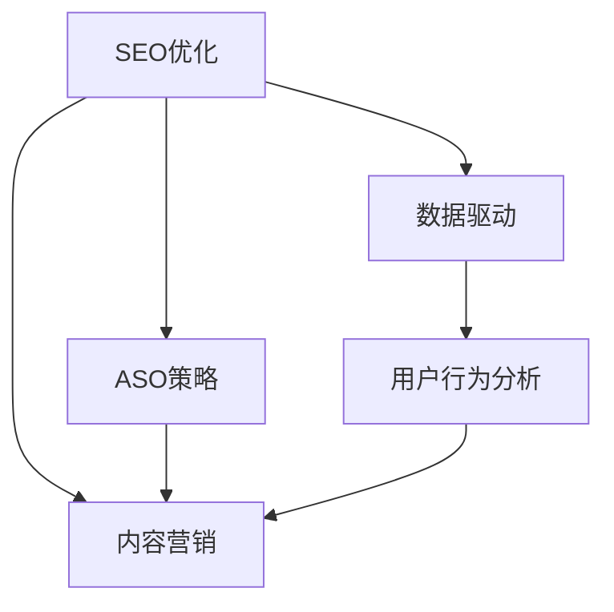

                 

# 知识付费内容的SEO与ASO优化策略

> 关键词：知识付费,SEO优化,ASO策略,内容营销,数据驱动

## 1. 背景介绍

### 1.1 问题由来

随着知识付费行业的发展，越来越多的机构和个人通过在线课程、电子书、播客等方式提供知识服务。这不仅满足了用户对知识获取的需求，也成为了内容创作者的重要收入来源。然而，在互联网信息爆炸的时代，如何在海量内容中脱颖而出，成为知识付费平台面临的重要挑战。搜索引擎优化（SEO）和应用商店优化（ASO）作为提高内容曝光和用户获取的重要手段，被广泛应用于知识付费领域的营销策略中。

### 1.2 问题核心关键点

本文将从SEO和ASO的原理、步骤、实施策略等方面展开，系统地探讨如何通过数据驱动的方式，优化知识付费内容在搜索引擎和应用商店的排名，提升用户的获取率和付费转化率。重点关注以下几个关键点：

1. 如何通过SEO和ASO策略，增加知识付费内容的曝光率。
2. 如何通过数据分析，评估SEO和ASO的效果，进行持续优化。
3. 如何制定合理的SEO和ASO策略，兼顾短期和长期目标。
4. 如何结合用户行为数据，提升内容的付费转化率。

## 2. 核心概念与联系

### 2.1 核心概念概述

为了更好地理解SEO和ASO的优化策略，本节将介绍几个密切相关的核心概念：

- 搜索引擎优化（SEO）：通过优化网站或内容，使其在搜索引擎（如Google、Bing等）中排名更高，从而吸引更多有意向的访问者。
- 应用商店优化（ASO）：通过优化应用商店中的应用程序或内容，使其在应用商店（如App Store、Google Play等）中排名更高，从而提高应用或内容的下载量。
- 内容营销：利用高质量、有价值的内容吸引和留存用户，最终实现品牌曝光、用户转化和销售提升。
- 数据驱动：通过收集和分析用户行为数据，指导内容优化策略，实现精准营销。

这些核心概念之间的逻辑关系可以通过以下Mermaid流程图来展示：



这个流程图展示了这个领域的核心概念及其之间的关系：

1. SEO优化是内容营销的重要组成部分，通过提高搜索引擎中的排名，吸引更多的访问者。
2. ASO策略同样重要，通过应用商店优化，提高应用的可见度和下载量，从而实现内容的广泛传播。
3. 数据驱动是优化过程的指导思想，通过分析用户行为数据，指导SEO和ASO策略的制定和优化。
4. 用户行为分析是数据驱动的核心，通过深入了解用户的搜索行为、下载行为，优化内容和应用，提升用户体验和转化率。

这些概念共同构成了SEO和ASO优化策略的理论基础，帮助内容创作者制定有效的营销方案，提升内容的市场竞争力。

## 3. 核心算法原理 & 具体操作步骤

### 3.1 算法原理概述

SEO和ASO的优化策略基于搜索引擎和应用商店的搜索算法原理。这些算法通常通过分析网页或应用的标题、关键词、描述、内容、用户行为等因素，来评估和排序搜索结果。

- 搜索引擎算法主要关注网页内容的相关性、权威性、用户体验等因素。
- 应用商店算法则更多关注应用的下载量、评价、评分、更新频率等指标。

SEO和ASO的优化目标是使内容在搜索引擎和应用商店中排名更高，从而吸引更多的流量和用户。优化策略通常包括以下几个方面：

1. 关键词优化：选择与内容高度相关的关键词，并合理分布，提高搜索引擎的收录和排名。
2. 内容质量优化：通过提高内容质量，如深度、独特性、可读性等，提升用户满意度和搜索引擎的评分。
3. 用户体验优化：优化网站或应用的用户界面、加载速度、互动性等，提高用户在搜索引擎和应用商店中的评分。
4. 数据分析优化：通过分析用户行为数据，指导优化策略的制定和调整，实现持续改进。

### 3.2 算法步骤详解

以下是SEO和ASO优化策略的具体实施步骤：

#### 3.2.1 SEO优化步骤

1. **关键词研究**：
   - 使用工具如Google Keyword Planner、Ahrefs等，寻找与内容高度相关的关键词。
   - 关注长尾关键词，减少竞争压力，提高转化率。
   - 考虑搜索意图和关键词相关性，选择最合适的关键词组合。

2. **页面优化**：
   - 优化页面标题、描述、URL等元素，确保包含目标关键词，提高搜索引擎收录率。
   - 使用H1、H2、H3等标签，合理分布关键词，提升内容结构的可读性。
   - 优化内容质量，如增加深度、独特性、多媒体元素等，提高用户满意度。

3. **用户体验优化**：
   - 提升网站或应用的加载速度，减少用户体验的等待时间。
   - 优化导航栏、搜索功能，提高用户在页面中的停留时间和互动性。
   - 确保网站或应用在各种设备上的兼容性，提供一致的用户体验。

4. **数据分析与优化**：
   - 使用Google Analytics、百度统计等工具，收集和分析用户行为数据。
   - 关注搜索来源、用户留存率、跳出率等指标，评估SEO效果。
   - 根据数据反馈，持续调整关键词、内容、页面结构等，实现持续改进。

#### 3.2.2 ASO优化步骤

1. **应用排名分析**：
   - 使用App Annie、Sensor Tower等工具，分析应用在应用商店中的排名、下载量、评价等数据。
   - 关注热门关键词和热门应用的排名情况，寻找优化方向。

2. **关键词优化**：
   - 在应用标题、描述、关键词等位置，合理分布目标关键词。
   - 使用动态关键词，根据用户搜索行为的变化，实时调整关键词策略。

3. **应用评分优化**：
   - 优化应用的评价和评分，鼓励用户留下积极反馈。
   - 关注评价的关键词和情感倾向，及时回应用户反馈，改善用户体验。

4. **应用性能优化**：
   - 优化应用的加载速度、稳定性、兼容性等，提升用户体验。
   - 使用A/B测试等方法，不断优化应用的交互设计和功能实现。

5. **数据分析与优化**：
   - 使用应用商店提供的分析工具，如App Store Connect、Google Play Console等，收集和分析应用下载、评分、评价等数据。
   - 根据数据分析结果，调整应用优化策略，提升应用在应用商店中的排名。

### 3.3 算法优缺点

SEO和ASO优化策略的优点包括：

1. **提升曝光率和用户获取率**：通过优化关键词和内容，提高搜索引擎和应用商店中的排名，吸引更多的有意向的用户。
2. **成本相对较低**：相较于付费广告，SEO和ASO策略通过优化内容和技术，降低营销成本。
3. **持续改进**：通过数据分析，不断优化策略，实现持续提升。

缺点包括：

1. **竞争激烈**：随着知识付费市场的发展，越来越多的机构和个人投入SEO和ASO优化，导致竞争加剧。
2. **效果周期长**：优化效果需要时间积累，短期内难以看到显著提升。
3. **数据驱动难度高**：需要具备一定的数据分析和优化技能，才能有效利用数据指导策略。

### 3.4 算法应用领域

SEO和ASO优化策略在知识付费领域有广泛的应用，具体包括：

1. **在线课程平台**：通过优化课程页面、课程描述等元素，提高在搜索引擎中的排名，吸引更多用户访问。
2. **电子书销售平台**：优化电子书标题、描述、关键词等，提升在搜索引擎中的曝光率，促进销售。
3. **播客平台**：优化播客标题、描述、关键词等，提升在搜索引擎中的排名，吸引更多听众。
4. **视频教程平台**：通过优化视频标题、描述、关键词等，提升在搜索引擎中的排名，吸引更多用户访问。
5. **教育机构网站**：通过优化网站内容和结构，提升在搜索引擎中的排名，吸引更多学生访问。

此外，SEO和ASO策略也被应用于多模态内容（如视频、音频、图片）的优化，提升这些内容在搜索引擎和应用商店中的排名，提高整体营销效果。

## 4. 数学模型和公式 & 详细讲解 & 举例说明

### 4.1 数学模型构建

本节将使用数学语言对SEO和ASO优化策略进行更加严格的刻画。

假设搜索引擎的搜索算法是一个基于PageRank和TF-IDF的混合模型，其中：

- PageRank算法通过计算网页的权威性和相关性，评估网页的重要性。
- TF-IDF算法通过计算关键词在网页中的重要性和出现频率，评估网页的相关性。

设网页$P$的PageRank值为$PR(P)$，TF-IDF值为$TF-IDF(P)$，则搜索引擎的排名$R(P)$可以表示为：

$$ R(P) = k \cdot \frac{PR(P) \cdot TF-IDF(P)}{d(P)} $$

其中$k$为平衡因子，$d(P)$为网页的域名权重。

应用商店的排名模型类似，但更多关注应用的评分和下载量等因素。设应用$A$在应用商店的排名为$R(A)$，其评分$S(A)$和下载量$D(A)$可以表示为：

$$ R(A) = \alpha \cdot S(A) + \beta \cdot D(A) + \gamma \cdot \text{其他因素} $$

其中$\alpha, \beta, \gamma$为不同因素的权重。

### 4.2 公式推导过程

以下我们以Google搜索引擎的PageRank算法为例，推导其基本原理。

设网页$P$的PageRank值为$PR(P)$，则PageRank算法通过迭代求解：

$$ PR(P) = \frac{1}{C} \sum_{i=1}^N \frac{P_i(P_j)}{PR(P_j)} $$

其中$C$为所有网页的PageRank值之和，$P_i(P_j)$为网页$P_j$指向网页$P_i$的链接权重。

假设网页$P$的PageRank值为$PR(P)$，则通过TF-IDF算法计算的关键词权重$TF-IDF(P)$可以表示为：

$$ TF-IDF(P) = \frac{TF(P)}{IDF} $$

其中$TF(P)$为关键词在网页$P$中出现的频率，$IDF$为关键词在所有网页中出现的逆文档频率。

### 4.3 案例分析与讲解

假设某知识付费平台在Google搜索引擎中的排名优化案例，其目标网页为$P$，相关关键词为$K$。优化步骤如下：

1. **关键词选择与分布**：
   - 通过工具如Google Keyword Planner，选择与内容高度相关的关键词$K$。
   - 将关键词合理分布在网页标题、描述、H1标签等位置，确保包含关键词。

2. **内容质量优化**：
   - 提高内容深度和独特性，增加多媒体元素，如图片、视频等。
   - 优化页面结构和布局，提高用户体验，减少跳出率。

3. **用户体验优化**：
   - 提升页面加载速度，优化导航栏和搜索功能，提高用户停留时间。
   - 确保页面在不同设备上的兼容性，提供一致的用户体验。

4. **数据分析与优化**：
   - 使用Google Analytics工具，收集用户行为数据，如搜索来源、页面停留时间、跳出率等。
   - 根据数据反馈，不断调整关键词、内容、页面结构等，实现持续改进。

通过这些步骤，网页$P$的PageRank值和TF-IDF值将得到提升，从而在Google搜索结果中排名更高，吸引更多有意向的用户访问。

## 5. 项目实践：代码实例和详细解释说明

### 5.1 开发环境搭建

在进行SEO和ASO优化实践前，我们需要准备好开发环境。以下是使用Python进行SEO和ASO优化实践的环境配置流程：

1. 安装Python：确保Python 3.6或以上版本已经安装。
2. 安装Pip：通过命令行安装Pip，用于安装和管理Python包。
3. 安装SEO和ASO工具：安装如Google Keyword Planner、App Annie、Sensor Tower等工具，用于分析关键词和应用排名。
4. 安装数据分析工具：安装如Google Analytics、App Store Connect等工具，用于收集和分析用户行为数据。

完成上述步骤后，即可在开发环境中开始SEO和ASO优化实践。

### 5.2 源代码详细实现

以下是使用Python进行Google关键词优化的示例代码：

```python
import google.api_core.exceptions
import googleapiclient.discovery

# 创建Google API客户端
service = googleapiclient.discovery.build('adsense', 'v2', cache_discovery=False)

# 设置关键词查询参数
query = 'python programming'

# 执行关键词查询
results = service.reports().list(
    v=2,
    resource=service.projects().reportTypes().query(),
    params={
        'query': query,
        'xsi_type': 'adsense#QuerySummaryData',
    }
).execute()

# 输出查询结果
for result in results['results']:
    print(f'{result["metricName"]} for {result["dateRange"]}: {result["value"]}')
```

通过上述代码，我们可以使用Google Keyword Planner获取关键词的相关数据，如搜索量、竞争度等，指导SEO策略的制定。

### 5.3 代码解读与分析

让我们再详细解读一下关键代码的实现细节：

**Google Keyword Planner使用示例**：
- 首先，通过Google API客户端，设置关键词查询参数，执行查询。
- 查询结果包含关键词的搜索量、竞争度等数据，如`python programming`的搜索量、竞争度等。
- 通过分析查询结果，指导SEO策略的制定，选择与内容高度相关的关键词，并进行合理分布。

**SEO和ASO策略优化**：
- 选择合适的关键词，并合理分布在网页标题、描述、H1标签等位置。
- 优化内容质量，增加深度、独特性、多媒体元素等，提升用户体验。
- 优化页面结构和加载速度，提高搜索引擎评分。

**数据分析与优化**：
- 使用Google Analytics等工具，收集和分析用户行为数据，如搜索来源、页面停留时间、跳出率等。
- 根据数据反馈，调整关键词、内容、页面结构等，实现持续改进。

通过这些代码和策略，我们可以高效地实现SEO和ASO优化，提高知识付费内容在搜索引擎和应用商店中的曝光率和用户获取率。

## 6. 实际应用场景

### 6.1 智能推荐系统

智能推荐系统通过分析和匹配用户的行为数据，为用户推荐个性化的内容。在推荐系统中，SEO和ASO策略可以用于提升推荐的精准度和用户体验。

通过SEO和ASO优化，推荐系统可以根据用户搜索的历史记录和行为数据，推荐最相关的知识付费内容，提高用户的满意度。同时，通过数据分析，实时调整推荐策略，优化用户体验。

### 6.2 内容分发平台

内容分发平台通过分发优质的知识付费内容，提升用户的留存率和付费转化率。SEO和ASO策略可以帮助平台提升内容的曝光率和用户获取率。

通过优化关键词和内容质量，平台可以在搜索引擎和应用商店中排名更高，吸引更多有意向的用户。同时，通过数据分析，优化推荐算法和分发策略，提升用户的付费转化率。

### 6.3 教育机构网站

教育机构网站通过提供优质的教育资源，吸引和留存学生。SEO和ASO策略可以帮助网站提升在搜索引擎和应用商店中的排名，吸引更多学生访问。

通过优化关键词和内容质量，网站可以在搜索引擎和应用商店中排名更高，吸引更多有意向的学生。同时，通过数据分析，优化网站结构和功能，提升用户体验。

## 7. 工具和资源推荐

### 7.1 学习资源推荐

为了帮助开发者系统掌握SEO和ASO的优化策略，这里推荐一些优质的学习资源：

1. 《搜索引擎优化：SEO基础与高级技巧》系列博文：由SEO专家撰写，深入浅出地介绍了SEO的基本概念和高级技巧。
2. 《应用商店优化：ASO策略与实践》书籍：全面介绍了应用商店优化的理论基础和实践方法，是ASO学习的重要参考资料。
3. 《SEO与ASO优化实战》课程：由知名SEO和ASO讲师讲授，结合实际案例，系统讲解SEO和ASO的优化策略。
4. Udemy、Coursera等在线平台上的SEO和ASO相关课程：提供丰富的课程资源，帮助初学者和进阶者掌握SEO和ASO技能。

通过对这些资源的学习实践，相信你一定能够快速掌握SEO和ASO的精髓，并用于解决实际的优化问题。

### 7.2 开发工具推荐

高效的SEO和ASO优化离不开优秀的工具支持。以下是几款常用的SEO和ASO优化工具：

1. Google Keyword Planner：Google提供的关键词分析工具，帮助用户选择和分析关键词。
2. Ahrefs：知名的SEO工具，提供详细的关键词分析、竞争对手分析等功能。
3. App Annie：应用商店优化工具，提供应用排名、评分、下载量等数据分析功能。
4. Sensor Tower：应用商店优化工具，提供应用排名、评分、关键词优化等功能。
5. Google Analytics：网站流量分析工具，帮助用户收集和分析用户行为数据。
6. App Store Connect：苹果应用商店的开发和发布工具，提供应用数据分析和优化功能。

合理利用这些工具，可以显著提升SEO和ASO优化的效率，快速迭代和优化策略。

### 7.3 相关论文推荐

SEO和ASO技术的发展源于学界的持续研究。以下是几篇奠基性的相关论文，推荐阅读：

1. 《PageRank算法：Google搜索引擎的核心》论文：介绍PageRank算法的原理和应用，是SEO优化策略的理论基础。
2. 《TF-IDF算法：搜索引擎中的关键词权重计算》论文：介绍TF-IDF算法的原理和应用，是SEO优化策略的重要组成部分。
3. 《应用商店优化策略与效果评估》论文：研究应用商店优化的策略和方法，提供了ASO优化的理论指导。

这些论文代表了大规模内容优化技术的发展脉络。通过学习这些前沿成果，可以帮助研究者把握学科前进方向，激发更多的创新灵感。

## 8. 总结：未来发展趋势与挑战

### 8.1 总结

本文对SEO和ASO的优化策略进行了全面系统的介绍。首先阐述了SEO和ASO优化的背景和意义，明确了在知识付费领域中的重要作用。其次，从原理到实践，详细讲解了SEO和ASO的数学模型和具体实施步骤，给出了优化任务开发的完整代码实例。同时，本文还广泛探讨了SEO和ASO策略在智能推荐系统、内容分发平台、教育机构网站等不同场景中的应用，展示了SEO和ASO策略的广泛应用价值。此外，本文精选了SEO和ASO技术的各类学习资源，力求为读者提供全方位的技术指引。

通过本文的系统梳理，可以看到，SEO和ASO优化策略在知识付费领域已经得到广泛应用，成为提高内容曝光和用户获取率的重要手段。SEO和ASO优化不仅需要技术手段的支持，还需要结合数据分析和用户体验优化，才能实现最佳效果。

### 8.2 未来发展趋势

展望未来，SEO和ASO技术将呈现以下几个发展趋势：

1. **数据驱动更加深入**：随着大数据技术的发展，更多用户行为数据将被收集和分析，用于指导SEO和ASO策略的制定和优化。
2. **个性化推荐算法**：结合SEO和ASO优化，实现更加精准、个性化的推荐算法，提升用户体验和内容转化率。
3. **多模态内容优化**：除了文本内容，视频、音频等多模态内容的优化将成为新的焦点，提升多媒体内容的曝光率和用户体验。
4. **实时优化和A/B测试**：通过实时优化和A/B测试，持续调整SEO和ASO策略，实现快速迭代和持续改进。
5. **跨平台优化**：实现跨搜索引擎、跨应用商店的优化，提升内容在多平台中的曝光率和用户获取率。

以上趋势凸显了SEO和ASO技术的广阔前景。这些方向的探索发展，必将进一步提升知识付费内容的市场竞争力，带来更广阔的市场机会。

### 8.3 面临的挑战

尽管SEO和ASO技术已经取得了显著成效，但在迈向更加智能化、普适化应用的过程中，仍面临以下挑战：

1. **竞争加剧**：随着知识付费市场的不断发展，越来越多的内容创作者和企业投入SEO和ASO优化，导致竞争加剧。
2. **数据隐私和安全**：在收集和分析用户行为数据时，如何保障数据的隐私和安全，是一个重要的技术挑战。
3. **算法复杂度**：SEO和ASO算法通常较为复杂，需要具备一定的数据分析和优化技能，才能有效利用数据指导策略。
4. **效果评估困难**：SEO和ASO效果评估需要结合多方面数据和指标，难以进行定量分析，需要更多的定性评估方法。

### 8.4 研究展望

面对SEO和ASO面临的挑战，未来的研究需要在以下几个方面寻求新的突破：

1. **数据隐私保护**：探索如何通过技术手段，保障用户数据隐私和安全，同时实现数据的有效利用。
2. **算法优化和自动化**：研究和开发更加智能化的SEO和ASO算法，降低技术门槛，实现自动化的SEO和ASO优化。
3. **多平台优化策略**：研究跨搜索引擎、跨应用商店的优化策略，提升内容在多平台中的曝光率和用户获取率。
4. **效果评估和反馈机制**：建立更加科学的效果评估机制，实时反馈优化结果，指导SEO和ASO策略的调整和优化。
5. **用户行为分析**：深入研究用户行为特征和心理，指导SEO和ASO策略的制定，提升用户体验和转化率。

这些研究方向的探索，必将引领SEO和ASO技术迈向更高的台阶，为知识付费内容的优化带来更多的创新和突破。

## 9. 附录：常见问题与解答

**Q1：SEO和ASO策略是否适用于所有知识付费内容？**

A: SEO和ASO策略适用于大多数知识付费内容，特别是那些以文本形式呈现的课程、文章、视频等。但对于一些特殊形式的知识付费内容，如音频、播客等，也需要结合内容形式进行优化。例如，在播客平台上，可以通过优化音频标题、描述、关键词等，提升在搜索引擎中的排名。

**Q2：如何进行关键词优化？**

A: 关键词优化是SEO优化的核心步骤，可以通过以下步骤进行：
1. 使用工具如Google Keyword Planner、Ahrefs等，选择与内容高度相关的关键词。
2. 关注长尾关键词，减少竞争压力，提高转化率。
3. 在内容标题、描述、H1标签等位置，合理分布关键词，确保包含关键词。
4. 根据数据分析结果，调整关键词策略，优化关键词分布。

**Q3：如何选择最优的ASO关键词？**

A: 选择最优的ASO关键词需要考虑以下因素：
1. 关键词的相关性和匹配度：选择与内容高度相关的关键词，确保用户可以轻松找到应用。
2. 关键词的竞争度：选择竞争度适中的关键词，避免过度竞争。
3. 关键词的搜索量和评分：选择搜索量高、评分好的关键词，提升应用在应用商店中的排名。
4. 动态关键词优化：根据用户搜索行为的变化，实时调整关键词策略，保持应用的竞争力。

**Q4：如何进行数据分析和优化？**

A: 数据分析和优化是SEO和ASO优化的重要步骤，可以通过以下步骤进行：
1. 使用工具如Google Analytics、App Store Connect等，收集和分析用户行为数据。
2. 关注搜索来源、用户留存率、跳出率等指标，评估SEO和ASO效果。
3. 根据数据反馈，调整关键词、内容、页面结构等，实现持续改进。
4. 定期进行A/B测试，比较不同策略的效果，选择最优方案。

通过以上步骤，可以有效地进行数据分析和优化，实现SEO和ASO策略的持续改进和优化。

**Q5：SEO和ASO优化是否需要付费？**

A: 大部分SEO和ASO工具和分析工具都提供免费版本，可以满足大多数需求。但高级功能（如高级关键词分析、详细数据报告等）通常需要付费，具体取决于工具的定价策略。因此，在优化过程中，可以根据实际需求选择合适的工具和功能。

---

作者：禅与计算机程序设计艺术 / Zen and the Art of Computer Programming

