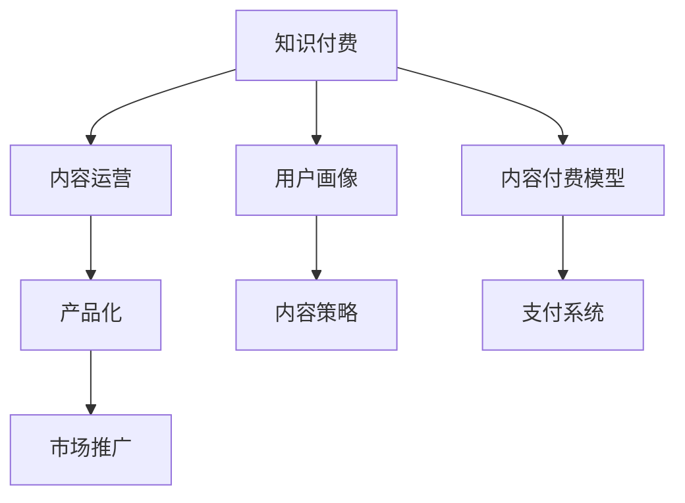

                 

# 知识付费创业中的内容产品化策略

## 1. 背景介绍

在知识付费的时代，内容产品化策略已经成为创业成功的关键。成功的知识付费产品不仅要提供优质的内容，还要能有效地吸引用户并实现商业变现。本文将详细探讨内容产品化的核心概念与联系，通过核心算法原理、具体操作步骤、实际应用场景等深入分析，帮助创业者在知识付费领域取得成功。

## 2. 核心概念与联系

### 2.1 核心概念概述

在知识付费领域，内容产品化策略涉及到多个关键概念，包括但不限于以下：

- **知识付费**：通过付费订阅、单次购买等方式获取知识内容的商业模式。
- **内容运营**：策划、制作、推广、优化知识内容的过程。
- **用户画像**：基于用户行为和需求数据，构建的用户群像，用于指导内容生产与推荐。
- **内容付费模型**：指明用户为获取内容所需支付的方式，如订阅、按需购买、免费加付费模式等。
- **产品化**：将知识内容转变为具有商业价值、易于使用、用户接受的产品。

这些概念相互关联，共同构成了知识付费内容产品化的基础。

### 2.2 核心概念原理和架构的 Mermaid 流程图



## 3. 核心算法原理 & 具体操作步骤

### 3.1 算法原理概述

内容产品化策略的核心在于通过算法和技术手段，提升内容质量和用户体验，实现商业目标。核心算法通常包括用户画像构建、内容推荐、用户行为分析等。

**用户画像构建**：通过对用户行为数据的收集和分析，建立用户兴趣模型。例如，用户常消费的内容类型、阅读时长、付费习惯等。

**内容推荐**：利用协同过滤、基于内容的推荐算法等，向用户推荐相关内容，提升用户粘性。例如，根据用户历史行为数据，推荐类似内容或热门内容。

**用户行为分析**：通过分析用户访问路径、点击率、互动情况等数据，优化内容产品结构，提高用户留存率和转化率。例如，通过A/B测试确定最佳页面布局和交互方式。

### 3.2 算法步骤详解

**Step 1：数据收集与清洗**
- 收集用户行为数据，如访问路径、阅读时间、付费行为等。
- 清洗数据，处理缺失值、异常值等。

**Step 2：用户画像构建**
- 使用聚类、分类等算法，将用户分为不同类型。
- 提取关键特征，如阅读偏好、付费倾向等。

**Step 3：内容推荐系统构建**
- 设计推荐算法，如协同过滤、基于内容的推荐、混合推荐等。
- 确定推荐策略，如个性化推荐、热门推荐等。

**Step 4：优化推荐系统**
- 进行A/B测试，调整推荐算法和策略。
- 收集反馈数据，优化推荐结果。

**Step 5：分析用户行为**
- 使用统计分析、机器学习等手段，分析用户行为数据。
- 确定关键指标，如留存率、转化率等。

**Step 6：产品优化与迭代**
- 根据分析结果，优化产品功能、界面设计等。
- 迭代发布新产品版本，持续改进用户体验。

### 3.3 算法优缺点

**优点**：
- 可以提升内容相关性，提高用户满意度。
- 能够增加用户粘性，提高用户留存率。
- 提高商业转化率，实现商业变现。

**缺点**：
- 需要大量数据支持，数据收集和处理成本高。
- 算法复杂，实现难度大。
- 可能过度依赖推荐算法，降低内容多样性。

### 3.4 算法应用领域

**教育培训**：如在线课程、技能培训、语言学习等。
**职业发展**：如职业技能培训、职业规划指导等。
**健康管理**：如健康饮食、运动指导、心理疏导等。
**生活服务**：如财务管理、居家装修、育儿指导等。

## 4. 数学模型和公式 & 详细讲解 & 举例说明

### 4.1 数学模型构建

我们以内容推荐系统为例，构建数学模型。推荐系统一般包括以下步骤：

1. 数据收集：收集用户行为数据，如点击率、浏览时间、评分等。
2. 用户画像：通过K-means聚类、LDA主题模型等方法，构建用户画像。
3. 内容表示：将内容转换为向量表示，如TF-IDF、Word2Vec等。
4. 推荐算法：设计推荐算法，如协同过滤、基于内容的推荐等。

**协同过滤推荐算法**：
- 用户-物品评分矩阵：$R_{ij}$
- 相似度矩阵：$S_{ij}$
- 预测评分：$\hat{R}_{ij}$
- 推荐评分：$R^+_{ij} = \max\limits_{j \in \mathcal{J}} \hat{R}_{ij}$

**基于内容的推荐算法**：
- 物品特征向量：$X_j$
- 用户特征向量：$Y_i$
- 相似度矩阵：$S_{ij}$
- 预测评分：$\hat{R}_{ij} = \mathbf{X}_j^T \mathbf{W} \mathbf{Y}_i$
- 推荐评分：$R^+_{ij} = \max\limits_{j \in \mathcal{J}} \hat{R}_{ij}$

### 4.2 公式推导过程

以协同过滤推荐算法为例，推导用户对物品$i$的预测评分$\hat{R}_{ij}$：

$$
\hat{R}_{ij} = \frac{1}{\sqrt{K} + 1} \sum\limits_{k=1}^K \frac{R_{ik} \cdot S_{kj}}{\sqrt{N_{ik}} \cdot \sqrt{N_{kj}}}
$$

其中：
- $K$为矩阵维度
- $N_{ik}$为物品$i$的评分总数
- $N_{kj}$为物品$k$的评分总数

### 4.3 案例分析与讲解

假设某知识付费平台收集了用户点击课程、购买课程、评分等数据。平台构建用户画像，将用户分为“高活跃用户”和“低活跃用户”。然后，使用协同过滤算法为用户推荐课程，并分析不同用户画像下的推荐效果。通过A/B测试，确定推荐效果最优的算法和策略。

## 5. 项目实践：代码实例和详细解释说明

### 5.1 开发环境搭建

1. 安装Python环境：Python 3.6及以上版本。
2. 安装相关库：Flask、Pandas、NumPy、Scikit-learn等。
3. 安装MySQL数据库：用于存储用户行为数据和内容信息。

### 5.2 源代码详细实现

**推荐系统代码**：

```python
import pandas as pd
import numpy as np
from sklearn.metrics.pairwise import cosine_similarity

# 数据收集与清洗
# 用户行为数据
user_data = pd.read_csv('user_behavior.csv')
user_data = user_data.dropna()

# 物品评分数据
item_data = pd.read_csv('item_ratings.csv')
item_data = item_data.dropna()

# 合并数据
data = pd.merge(user_data, item_data, on='item_id')

# 用户画像构建
# 使用K-means聚类
from sklearn.cluster import KMeans
kmeans = KMeans(n_clusters=2)
kmeans.fit(data[['user_id', 'item_id', 'rating']])
user_clusters = kmeans.labels_

# 内容表示
# 使用TF-IDF向量表示课程
from sklearn.feature_extraction.text import TfidfVectorizer
tfidf = TfidfVectorizer()
item_vectors = tfidf.fit_transform(item_data['title'])

# 相似度矩阵计算
similarity_matrix = cosine_similarity(item_vectors)

# 推荐系统构建
# 协同过滤推荐
from scipy.sparse import csr_matrix
from scipy.sparse.linalg import svds

def collaborative_filtering(user_id):
    user_vector = item_vectors[:, item_data['item_id'] == user_data.loc[user_id]['item_id']]
    if len(user_vector) == 0:
        return None
    user_vector = np.mean(user_vector, axis=0)
    U, S, V = svds(similarity_matrix, k=50)
    W = np.dot(np.dot(U, S), V.T)
    user_vector = np.dot(W, user_vector)
    return user_vector

# 推荐算法优化
# 计算预测评分
def predict_rating(user_id, item_id):
    user_vector = collaborative_filtering(user_id)
    if user_vector is None:
        return None
    item_vector = item_vectors[item_data['item_id'] == item_id]
    item_vector = np.mean(item_vector, axis=0)
    rating = np.dot(user_vector, item_vector)
    return rating

# 推荐评分
def recommend_items(user_id, n=10):
    user_vector = collaborative_filtering(user_id)
    if user_vector is None:
        return []
    scores = np.dot(similarity_matrix, user_vector)
    items = item_data['item_id'].argsort()[-scores.argsort()][:n]
    return items

# 分析用户行为
# 计算留存率
def retention_rate(user_id):
    user_item = data[data['user_id'] == user_id]
    unique_items = user_item['item_id'].nunique()
    return user_item['item_id'].nunique() / unique_items

# 统计分析
result = pd.DataFrame(columns=['user_id', 'user_cluster', 'retention_rate'])
for user_id in user_data['user_id'].unique():
    user_cluster = user_clusters[user_id]
    retention_rate_val = retention_rate(user_id)
    result.loc[user_id, 'user_id'] = user_id
    result.loc[user_id, 'user_cluster'] = user_cluster
    result.loc[user_id, 'retention_rate'] = retention_rate_val
result.to_csv('result.csv', index=False)
```

### 5.3 代码解读与分析

上述代码展示了如何构建推荐系统。首先，通过收集和清洗用户行为数据，构建用户画像。然后，使用TF-IDF表示课程内容，计算相似度矩阵。接着，利用协同过滤算法为用户推荐课程，并计算推荐评分。最后，通过统计分析，分析不同用户画像下的推荐效果，优化推荐策略。

## 6. 实际应用场景

### 6.1 教育培训

某在线教育平台收集用户学习行为数据，如观看时长、测试成绩、课程评价等。平台使用协同过滤推荐算法，为用户推荐相关课程，并分析不同用户画像下的推荐效果。通过A/B测试，确定推荐效果最优的算法和策略，提高用户粘性和留存率。

### 6.2 职业发展

某职业培训平台收集用户学习行为数据，如课程完成情况、证书获得情况、职场表现等。平台使用基于内容的推荐算法，为用户推荐相关课程和培训项目，并分析不同职业路径下的推荐效果。通过优化推荐策略，提高用户职场竞争力，增加用户转化率。

### 6.3 健康管理

某健康管理平台收集用户健康数据，如运动记录、饮食记录、身体指标等。平台使用协同过滤推荐算法，为用户推荐相关健康建议和营养指导，并分析不同用户画像下的推荐效果。通过优化推荐策略，提高用户健康管理效果，增加平台粘性。

### 6.4 未来应用展望

未来，随着技术的进步和数据的积累，内容产品化策略将更加智能化和个性化。例如，使用深度学习模型进行用户画像构建和内容推荐，引入多模态数据（如视频、语音）进行内容分析，利用强化学习优化推荐算法等。

## 7. 工具和资源推荐

### 7.1 学习资源推荐

1. **《推荐系统》**：讲述推荐系统原理与应用的经典书籍。
2. **Coursera推荐系统课程**：由斯坦福大学提供，涵盖推荐系统基础与高级技术。
3. **Kaggle推荐系统竞赛**：通过实际数据集进行推荐算法竞赛，提升实战经验。
4. **Pinterest推荐系统博客**：分享Pinterest在推荐算法上的实践经验。
5. **Amazon推荐系统论文**：了解亚马逊在推荐算法上的最新研究。

### 7.2 开发工具推荐

1. **Flask**：轻量级Web框架，适合快速搭建推荐系统API。
2. **Pandas**：数据处理与分析工具，方便数据清洗与分析。
3. **NumPy**：数学计算工具，用于数值运算。
4. **Scikit-learn**：机器学习库，包含多种推荐算法。
5. **TensorFlow**：深度学习库，适合构建复杂推荐模型。

### 7.3 相关论文推荐

1. **《推荐系统中的协同过滤》**：详细介绍协同过滤算法的原理与实现。
2. **《基于内容的推荐系统》**：讨论基于内容的推荐算法及其应用。
3. **《深度学习在推荐系统中的应用》**：介绍深度学习模型在推荐系统中的应用。
4. **《用户画像构建方法综述》**：总结用户画像构建的多种方法。
5. **《推荐系统中的强化学习》**：探讨强化学习在推荐系统中的应用。

## 8. 总结：未来发展趋势与挑战

### 8.1 研究成果总结

本文探讨了知识付费中的内容产品化策略，包括用户画像构建、内容推荐、用户行为分析等内容。通过算法原理和操作步骤的讲解，帮助创业者理解内容产品化的核心方法。

### 8.2 未来发展趋势

未来，内容产品化策略将更加智能化和个性化。深度学习、强化学习等技术将广泛应用于用户画像构建和推荐算法优化中。多模态数据融合、实时数据处理等技术也将推动内容推荐系统的进一步发展。

### 8.3 面临的挑战

内容产品化策略面临数据隐私、推荐算法偏见、用户隐私保护等挑战。需要制定严格的隐私保护政策，优化算法模型，确保内容推荐的公正性和透明性。

### 8.4 研究展望

未来，需要在算法公平性、隐私保护、实时数据处理等方面进行深入研究。同时，探索多模态数据融合、自适应推荐等前沿技术，推动内容产品化策略的持续创新。

## 9. 附录：常见问题与解答

**Q1: 内容产品化策略的核心是什么？**

A: 内容产品化策略的核心在于通过算法和技术手段，提升内容质量和用户体验，实现商业目标。包括用户画像构建、内容推荐、用户行为分析等步骤。

**Q2: 推荐算法的优缺点是什么？**

A: 推荐算法的优点在于能够提升内容相关性，提高用户满意度。缺点在于需要大量数据支持，数据收集和处理成本高，算法复杂，实现难度大。

**Q3: 如何在内容推荐系统中防止过拟合？**

A: 防止过拟合的方法包括数据增强、正则化、交叉验证等。数据增强可以扩充训练集，正则化可以限制模型复杂度，交叉验证可以评估模型泛化能力。

**Q4: 如何优化内容推荐系统？**

A: 优化内容推荐系统的方法包括A/B测试、在线学习、反馈机制等。A/B测试可以评估推荐策略效果，在线学习可以实时更新推荐模型，反馈机制可以收集用户反馈数据，优化推荐结果。

---

作者：禅与计算机程序设计艺术 / Zen and the Art of Computer Programming

