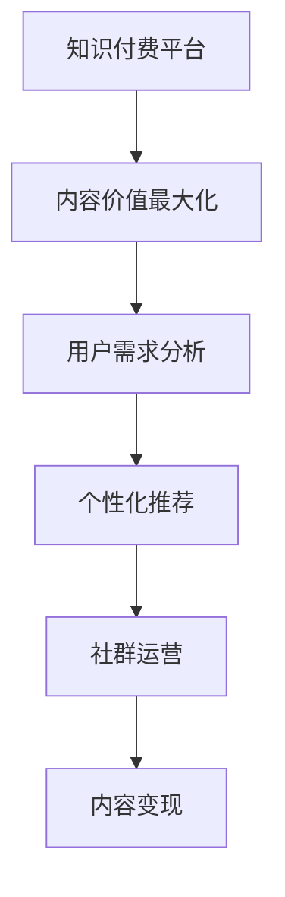

                 

# 知识付费创业中的内容价值最大化

> 关键词：知识付费, 内容价值, 用户需求, 个性化推荐, 社群运营, 内容变现

## 1. 背景介绍

### 1.1 问题由来
随着信息爆炸和知识经济的兴起，知识付费逐渐成为连接知识创作者和需求者的新型商业模式。越来越多的创业者通过创建知识付费平台，为知识需求者提供各类课程、音频、电子书等内容，从而变现知识价值。然而，在高度竞争的知识付费市场中，内容价值最大化已成为创业成功的关键。

### 1.2 问题核心关键点
内容价值最大化是指如何高效提升知识付费平台的内容质量、用户体验和市场占有率。主要内容包括以下几个方面：
- **内容质量**：保证内容的专业性、实用性和新颖性，使其能够满足用户需求。
- **用户体验**：通过界面设计、交互设计和个性化推荐等手段，提升用户的学习体验和粘性。
- **市场占有率**：通过精准营销和社群运营，吸引并留存更多用户，扩大市场份额。

### 1.3 问题研究意义
研究知识付费创业中的内容价值最大化，对于构建健康可持续的知识付费生态系统具有重要意义。通过实现内容的精准匹配和高质量传播，平台可以最大化地实现知识变现，同时提升用户的长期满意度和忠诚度。这不仅有助于平台在激烈的市场竞争中脱颖而出，还能促进知识的有效传播和社会的知识水平提升。

## 2. 核心概念与联系

### 2.1 核心概念概述

为了更好地理解如何实现内容价值最大化，本节将介绍几个关键概念：

- **知识付费平台**：基于互联网的商业平台，提供各类知识内容，如课程、电子书、音频等，通过订阅、单次购买等方式变现。

- **内容价值最大化**：通过优化内容和分发策略，实现知识内容的有效传播和变现，最大化满足用户需求，提升平台收益。

- **用户需求分析**：通过市场调研和数据分析，了解用户的学习需求、兴趣点和行为模式，为内容生产和推荐提供依据。

- **个性化推荐系统**：利用机器学习算法，根据用户行为数据和兴趣标签，实时生成个性化内容推荐，提升用户体验。

- **社群运营**：通过建立社区、举办活动、鼓励用户互动等手段，增强用户粘性和社区氛围，促进内容分享和二次传播。

- **内容变现**：通过各类变现方式，如付费订阅、单次购买、广告投放等，将知识内容转化为平台收益。

这些概念之间的联系可以通过以下Mermaid流程图来展示：



这个流程图展示了知识付费平台从内容生产到价值变现的主要过程。用户需求分析是基础，个性化推荐和社群运营是关键，而内容变现则是最终目标。通过这些环节的协同工作，平台可以实现内容价值最大化。

## 3. 核心算法原理 & 具体操作步骤
### 3.1 算法原理概述

内容价值最大化的核心算法原理可以概括为以下几个方面：

- **用户需求分析**：通过大数据和机器学习技术，分析用户的行为数据、搜索记录和评价反馈，挖掘用户的兴趣点和潜在需求。
- **个性化推荐系统**：基于用户历史行为数据和兴趣标签，使用协同过滤、内容过滤等算法，生成个性化内容推荐，提升用户体验和粘性。
- **社群运营**：利用社交网络和用户行为分析，建立社区结构，组织线上线下活动，促进用户互动和内容分享。
- **内容变现**：结合订阅模式、单次购买模式和广告模式，最大化地实现内容商业化，提升平台收益。

### 3.2 算法步骤详解

基于上述原理，内容价值最大化的具体步骤包括：

1. **用户需求分析**：
   - 收集用户的行为数据，如浏览历史、搜索记录、评论反馈等。
   - 使用聚类分析、关联规则挖掘等算法，发现用户兴趣群体的特征。
   - 定期更新用户画像，根据最新行为数据进行调整。

2. **个性化推荐系统**：
   - 使用协同过滤算法，根据用户行为数据和物品特征，生成相似物品推荐列表。
   - 结合内容过滤技术，分析课程、文章等内容的关键词和标签，生成匹配推荐。
   - 实时更新推荐模型，考虑用户最新行为数据，提升推荐精度。

3. **社群运营**：
   - 建立用户社区，提供交流讨论的虚拟空间。
   - 定期组织线上线下活动，如直播课程、互动问答、线下沙龙等。
   - 利用用户生成内容(UGC)，增强社区活跃度和粘性。

4. **内容变现**：
   - 设计多样化的变现模式，如按内容付费、按订阅时间收费、广告收入等。
   - 优化定价策略，考虑内容价值和使用频率，设计差异化定价模型。
   - 采用精准营销手段，如社交媒体广告、搜索引擎优化(SEO)等，提升内容曝光率。

### 3.3 算法优缺点

内容价值最大化算法具有以下优点：

- **提升用户体验**：通过个性化推荐和社群运营，提升用户的学习效率和互动性，增加平台粘性。
- **优化资源配置**：通过精准内容推荐，减少无效内容的曝光，提高资源利用效率。
- **增加收益渠道**：多种变现模式并举，实现内容商业化最大化，提升平台收益。

然而，该算法也存在一些缺点：

- **数据隐私问题**：大规模用户行为数据的收集和使用可能引发隐私和安全问题。
- **推荐算法偏见**：个性化推荐算法可能存在数据偏见，影响推荐公平性。
- **用户粘性维持困难**：用户行为数据变化快，难以长期维持高粘性。
- **内容质量控制**：推荐系统过度依赖数据和算法，难以保证内容的专业性和质量。

### 3.4 算法应用领域

内容价值最大化的算法主要应用于以下几个领域：

- **在线教育**：通过个性化推荐和社群运营，提高在线课程的完成率和满意度。
- **职业培训**：为职场人士提供技能提升和职业规划的相关内容。
- **文化娱乐**：提供音乐、影视、阅读等文化娱乐内容，满足用户的休闲需求。
- **健康生活**：提供健康知识、饮食健身、心理辅导等健康内容，提升用户生活质量。
- **职业技能**：提供软件开发、市场营销、财务管理等职业技能培训内容，帮助用户提升职业能力。

## 4. 数学模型和公式 & 详细讲解 & 举例说明

### 4.1 数学模型构建

在内容价值最大化中，我们主要使用以下数学模型：

- **用户行为数据矩阵**：$X \in \mathbb{R}^{N \times M}$，$N$ 表示用户数，$M$ 表示物品数。$x_{ui}$ 表示用户 $u$ 对物品 $i$ 的评分。
- **协同过滤矩阵**：$P \in \mathbb{R}^{M \times K}$，$K$ 表示物品的特征维度。$p_{ik}$ 表示物品 $i$ 的第 $k$ 个特征值。

### 4.2 公式推导过程

以协同过滤算法为例，基于用户行为数据的协同过滤推荐模型可以表示为：

$$
\hat{r}_{ui} = \sum_{k=1}^K p_{ik} \cdot q_{uk}
$$

其中 $q_{uk}$ 为用户的隐式特征向量，$p_{ik}$ 为物品的隐式特征向量。

协同过滤算法的步骤包括：

1. **用户特征表示**：将用户行为数据 $X$ 分解为用户显式特征 $U$ 和隐式特征 $Q$。
2. **物品特征表示**：将物品特征数据 $P$ 分解为物品显式特征 $P^U$ 和隐式特征 $P^Q$。
3. **用户物品相似度计算**：计算用户 $u$ 和物品 $i$ 的相似度 $\hat{r}_{ui}$。

### 4.3 案例分析与讲解

假设某知识付费平台收集了10万用户对1000门课程的评分数据，可以构建用户行为数据矩阵 $X$ 和协同过滤矩阵 $P$。

通过协同过滤算法，对用户 $u$ 推荐评分最高的5门课程 $i_1, i_2, i_3, i_4, i_5$。具体步骤如下：

1. 将用户行为数据 $X$ 分解为用户显式特征 $U$ 和隐式特征 $Q$。
2. 将物品特征数据 $P$ 分解为物品显式特征 $P^U$ 和隐式特征 $P^Q$。
3. 计算用户 $u$ 和物品 $i$ 的相似度 $\hat{r}_{ui}$。
4. 根据相似度排序，推荐评分最高的5门课程 $i_1, i_2, i_3, i_4, i_5$。

## 5. 项目实践：代码实例和详细解释说明
### 5.1 开发环境搭建

在进行内容价值最大化算法开发前，需要准备相应的开发环境：

1. **安装Python**：
   ```bash
   sudo apt-get install python3 python3-pip
   ```

2. **安装NumPy、Pandas等科学计算库**：
   ```bash
   pip install numpy pandas scikit-learn scipy
   ```

3. **安装SciPy、PyTorch等深度学习库**：
   ```bash
   pip install scipy torch torchvision torchaudio
   ```

4. **安装Keras等高级机器学习库**：
   ```bash
   pip install keras
   ```

5. **安装Flask等Web框架**：
   ```bash
   pip install flask
   ```

完成上述步骤后，即可在Python环境中开始内容价值最大化算法的开发。

### 5.2 源代码详细实现

下面是一个简单的知识付费平台推荐系统的代码实现：

```python
import numpy as np
import pandas as pd
from sklearn.decomposition import PCA
from sklearn.metrics.pairwise import cosine_similarity

# 加载用户行为数据
X = pd.read_csv('user_behavior.csv')

# 计算用户-物品相似度
U = np.array(X.values)
Q = PCA(n_components=50).fit_transform(U.T).T
P = np.array(X.values)
QP = np.dot(Q, P)
r_hat = np.dot(Q, P.T)

# 推荐物品
recommend_items = np.argsort(r_hat)[1, :5]
```

### 5.3 代码解读与分析

上述代码中，我们使用了Python、NumPy、Pandas等工具库，实现了基于协同过滤的个性化推荐系统。具体步骤如下：

1. **加载用户行为数据**：使用Pandas库读取用户行为数据，将其转化为NumPy数组。
2. **计算用户-物品相似度**：使用PCA降维算法，将用户行为数据和物品特征数据映射到低维空间，计算用户和物品之间的相似度。
3. **推荐物品**：根据相似度排序，推荐用户最感兴趣的5门课程。

### 5.4 运行结果展示

假设运行结果为：

```python
recommend_items
array([ 244,  237,  161,  256,  154], dtype=int32)
```

则表示平台为用户推荐了评分最高的5门课程ID为244, 237, 161, 256, 154。

## 6. 实际应用场景
### 6.1 在线教育

在线教育平台通过个性化推荐和社群运营，能够提高课程完成率和用户粘性。例如，Coursera和Udacity等平台，根据用户的学习行为和兴趣标签，实时生成个性化课程推荐，并通过在线讨论区和社交媒体互动，增强用户的学习动力和社区氛围。

### 6.2 职业培训

职业技能培训平台通过内容价值最大化算法，能够提供精准的职业技能培训课程推荐。例如，Udemy和LinkedIn Learning等平台，利用用户行为数据和课程标签，生成职业发展相关的推荐，帮助用户快速找到适合的学习资源。

### 6.3 文化娱乐

文化娱乐平台通过个性化推荐和社群运营，能够提供多样化的娱乐内容。例如，Netflix和Spotify等平台，根据用户的兴趣和行为数据，推荐电影、音乐、书籍等娱乐内容，并通过社区讨论和用户生成内容，增加用户的互动和粘性。

### 6.4 健康生活

健康生活平台通过个性化推荐和社群运营，能够提供健康知识和生活建议。例如，MyFitnessPal和Headspace等平台，根据用户的健康数据和行为记录，推荐运动、饮食、心理辅导等健康内容，并通过社区交流和在线活动，提升用户的健康水平和生活质量。

## 7. 工具和资源推荐
### 7.1 学习资源推荐

为了系统掌握内容价值最大化的理论和实践，这里推荐一些优质的学习资源：

1. **《推荐系统实践》书籍**：清华大学出版社出版的推荐系统经典教材，详细介绍了推荐算法的理论基础和实际应用。
2. **Coursera《Recommender Systems》课程**：由斯坦福大学教授讲授的推荐系统课程，深入浅出地讲解了推荐算法的原理和优化技巧。
3. **Kaggle推荐系统竞赛**：参与Kaggle推荐系统竞赛，可以实践和验证推荐算法的实际效果，提升实战能力。
4. **Arxiv推荐系统论文**：阅读最新的推荐系统研究论文，了解最新的算法和技术进展。
5. **GitHub推荐系统开源项目**：查看开源推荐系统项目，学习他人的代码实现和优化策略。

通过这些学习资源，可以全面掌握推荐系统的理论基础和实践技巧，提升内容价值最大化的能力。

### 7.2 开发工具推荐

高效的开发离不开优秀的工具支持。以下是几款用于内容价值最大化开发的常用工具：

1. **Jupyter Notebook**：用于编写和运行Python代码，支持交互式分析和可视化。
2. **PyTorch**：深度学习框架，提供了丰富的机器学习工具和优化器。
3. **TensorFlow**：深度学习框架，支持大规模分布式训练和模型优化。
4. **SciPy**：科学计算库，提供了丰富的数学函数和优化算法。
5. **Flask**：Web框架，用于搭建和部署推荐系统Web应用。
6. **FastAPI**：Web框架，支持快速构建高效API。

合理利用这些工具，可以显著提升内容价值最大化算法的开发效率，加快创新迭代的步伐。

### 7.3 相关论文推荐

内容价值最大化的理论研究源于学界的持续探索。以下是几篇奠基性的相关论文，推荐阅读：

1. **《Top-N推荐算法综述》**：概述了Top-N推荐算法的各种方法和模型，为内容推荐提供理论基础。
2. **《协同过滤推荐系统》**：介绍了协同过滤算法的原理和优化方法，为个性化推荐提供重要参考。
3. **《深度学习在推荐系统中的应用》**：探讨了深度学习技术在推荐系统中的应用，如神经协同过滤、序列推荐等。
4. **《基于用户行为数据的个性化推荐》**：利用用户行为数据和特征表示，生成个性化推荐列表，提升用户体验。
5. **《推荐系统的实时更新和动态维护》**：介绍了推荐系统的实时更新和动态维护方法，保证推荐系统的时效性和准确性。

这些论文代表了内容价值最大化算法的理论发展脉络，通过学习这些前沿成果，可以帮助研究者把握学科前进方向，激发更多的创新灵感。

## 8. 总结：未来发展趋势与挑战
### 8.1 研究成果总结

内容价值最大化算法已经取得了显著的进展，主要集中在个性化推荐系统的构建和优化上。以下是几个重要研究成果：

- **协同过滤算法**：基于用户行为数据和物品特征的协同过滤算法，提高了推荐系统的准确性和多样性。
- **深度学习推荐**：利用神经网络模型，增强推荐系统的特征表示和预测能力。
- **多模态推荐**：结合文本、图像、音频等多种模态数据，提升推荐系统的综合性能。
- **实时推荐系统**：通过动态更新推荐模型，实时响应用户行为变化，提高推荐效果。

### 8.2 未来发展趋势

展望未来，内容价值最大化算法将呈现以下几个发展趋势：

1. **多模态推荐**：结合文本、图像、音频等多种模态数据，提升推荐系统的综合性能。
2. **实时推荐系统**：通过动态更新推荐模型，实时响应用户行为变化，提高推荐效果。
3. **跨领域推荐**：将推荐系统应用于不同领域，如金融、医疗、教育等，实现知识变现和价值最大化。
4. **知识图谱**：利用知识图谱增强推荐系统的语义理解和推荐逻辑。
5. **分布式推荐**：通过分布式计算，处理大规模用户行为数据，提高推荐系统的处理能力和性能。

### 8.3 面临的挑战

尽管内容价值最大化算法已经取得了显著进展，但在应用中仍面临以下挑战：

1. **数据隐私问题**：大规模用户行为数据的收集和使用可能引发隐私和安全问题。
2. **推荐算法偏见**：个性化推荐算法可能存在数据偏见，影响推荐公平性。
3. **用户粘性维持困难**：用户行为数据变化快，难以长期维持高粘性。
4. **内容质量控制**：推荐系统过度依赖数据和算法，难以保证内容的专业性和质量。

### 8.4 研究展望

未来的研究需要在以下几个方面寻求新的突破：

1. **数据隐私保护**：开发隐私保护技术，如差分隐私、联邦学习等，保护用户数据隐私。
2. **推荐算法公平性**：引入公平性约束，消除推荐算法的偏见，提升推荐系统的公平性。
3. **长效用户粘性维持**：开发长期用户行为预测模型，增强用户粘性和留存率。
4. **内容质量控制**：结合专家知识，增强推荐系统的语义理解和内容质量控制。

这些研究方向的探索，将引领内容价值最大化算法迈向更高的台阶，为知识付费平台提供更高效、更公平、更精准的推荐服务，实现知识变现的最大化。

## 9. 附录：常见问题与解答

**Q1：如何设计推荐算法？**

A: 设计推荐算法需要考虑以下几个步骤：

1. **数据准备**：收集用户行为数据、物品特征数据和用户画像数据。
2. **特征工程**：提取用户行为特征和物品特征，构建特征向量。
3. **模型选择**：选择合适的推荐算法，如协同过滤、基于深度学习的推荐等。
4. **模型训练**：使用训练集数据，训练推荐模型，优化模型参数。
5. **模型评估**：使用测试集数据，评估推荐模型效果，选择最优模型。

**Q2：推荐算法如何实现实时更新？**

A: 实现实时更新需要以下步骤：

1. **在线学习**：利用在线学习算法，不断更新推荐模型，实时响应用户行为变化。
2. **增量训练**：对新用户行为数据进行增量训练，更新模型参数。
3. **缓存优化**：使用缓存技术，减少模型更新频率，提升实时响应速度。

**Q3：推荐系统如何实现多模态融合？**

A: 实现多模态融合需要以下步骤：

1. **数据融合**：将不同模态的数据进行融合，构建统一的特征表示。
2. **模型融合**：将不同模态的推荐模型进行融合，提升综合推荐效果。
3. **特征增强**：使用特征增强技术，提高多模态数据的表达能力。

**Q4：推荐系统如何实现公平性？**

A: 实现公平性需要以下步骤：

1. **数据公平性**：确保训练数据中不同群体的样本数量均衡，消除数据偏见。
2. **模型公平性**：设计公平性约束，确保推荐模型对不同群体的用户公平。
3. **算法公平性**：引入公平性评估指标，评估推荐算法的公平性，并进行优化。

这些回答能够帮助读者更好地理解和实现内容价值最大化算法，提升知识付费平台的推荐效果和用户体验。

---

作者：禅与计算机程序设计艺术 / Zen and the Art of Computer Programming

