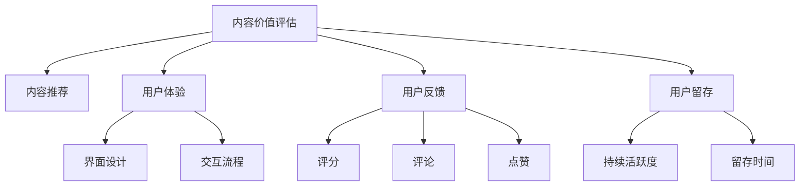

                 

# 知识付费创业中的内容价值评估体系

> 关键词：知识付费,内容价值评估,用户体验,内容推荐,用户留存

## 1. 背景介绍

### 1.1 问题由来
在数字化时代，知识付费逐渐成为消费者获取高质量内容的重要途径。通过订阅、单次付费等方式，用户可以获取专业化的内容服务，包括在线课程、电子书、音频讲座等。然而，面对海量的内容供给，用户如何选择、筛选优质内容成为一大难题。

知识付费平台的内容价值评估体系，决定了哪些内容能够被用户发现、选择和付费，进而影响平台的收入、用户增长和市场竞争力。构建科学的评估体系，不仅能够提升平台的用户体验和留存率，还能更好地引导用户获取有价值的内容，从而实现商业价值最大化。

### 1.2 问题核心关键点
构建内容价值评估体系的核心在于如何量化和衡量内容对用户的实际价值。内容价值通常体现在以下几方面：
- 内容的原创性、深度、逻辑性等专业度。
- 内容的用户反馈，如点赞、评论、评分等。
- 内容的覆盖面、时效性和适用性。
- 内容对用户的长期价值，如知识积累、技能提升、职业发展等。

这些因素的评估不仅需要依赖平台自身的数据，还需引入第三方数据和用户反馈，形成多维度的综合评估模型。

### 1.3 问题研究意义
建立科学的知识付费内容价值评估体系，具有以下几方面的意义：

1. **提高内容筛选效率**：通过量化评估，平台能够更快速、准确地识别优质内容，优化内容推荐算法，提升用户体验。
2. **促进内容创作者的激励**：明确的价值评估标准，能够引导内容创作者提升内容质量，形成良性循环。
3. **增强用户粘性**：高质量的内容推荐，能够增加用户满意度和留存率，提升平台的用户基量。
4. **提升商业价值**：优质内容能够吸引更多的付费用户，提升平台的收入和市场影响力。
5. **数据驱动决策**：科学的评估体系可以量化内容价值，为平台的战略决策提供数据支撑。

## 2. 核心概念与联系

### 2.1 核心概念概述

为更好地理解知识付费内容价值评估体系的构建，本节将介绍几个密切相关的核心概念：

- 内容价值评估（Content Value Assessment）：通过量化方式评估内容对用户的实际价值，包括专业度、用户体验、用户反馈等多方面因素。
- 内容推荐（Content Recommendation）：根据用户行为和内容价值，动态推荐符合用户需求的内容，提升用户满意度和留存率。
- 用户体验（User Experience, UX）：用户在知识付费平台上的整体体验，包括内容质量、界面设计、交互流程等。
- 用户反馈（User Feedback）：用户对内容的直接反馈，如评分、评论、点赞等，用于衡量内容的受欢迎程度。
- 用户留存（User Retention）：用户在平台上的持续活跃度和留存时间，衡量内容推荐和平台运营的效果。

这些核心概念之间的逻辑关系可以通过以下Mermaid流程图来展示：



这个流程图展示了几大核心概念之间的相互影响和作用：

1. 内容价值评估是对内容的综合量化，其结果用于指导内容推荐。
2. 内容推荐优化用户体验，通过匹配用户需求提升用户满意度。
3. 用户反馈直接影响内容价值评估，有助于持续优化内容质量。
4. 用户留存是内容推荐和用户体验的综合体现，反映平台整体运营效果。

这些概念共同构成了知识付费平台的内容价值评估框架，为其长期发展和用户价值提升提供坚实基础。

## 3. 核心算法原理 & 具体操作步骤
### 3.1 算法原理概述

知识付费平台的内容价值评估体系，本质上是一个多目标优化问题。其核心思想是：通过综合量化内容的专业度、用户体验、用户反馈等多方面因素，构建一个多维度的价值评估模型，用于指导内容推荐和创作者激励，最终提升用户留存和平台收入。

具体而言，内容价值评估模型可以分解为以下几个子模型：
- **专业度模型**：评估内容的深度、原创性和逻辑性，通常通过内容摘要、关键词、标签等进行计算。
- **用户体验模型**：衡量内容的可读性、互动性和视觉设计，通过用户点击率、停留时间等指标进行计算。
- **用户反馈模型**：评估内容的受欢迎程度，包括评分、评论、点赞等，通过用户互动数据进行计算。
- **用户留存模型**：衡量用户在平台上的长期价值，通过用户活跃度和留存时间等指标进行计算。

这些子模型通过加权求和等方式，得到最终的内容价值评估分数，用于指导内容推荐和创作者激励。

### 3.2 算法步骤详解

构建知识付费平台的内容价值评估体系，主要包括以下几个关键步骤：

**Step 1: 数据收集与预处理**
- 收集用户行为数据，包括点击率、停留时间、互动数据等。
- 收集内容元数据，如标题、摘要、关键词、标签等。
- 收集用户反馈数据，如评分、评论、点赞等。
- 对数据进行清洗和预处理，去除噪声和异常值。

**Step 2: 设计评估指标**
- 设计多个评估指标，如专业度指标、用户体验指标、用户反馈指标等。
- 对每个指标赋予不同的权重，反映其对内容价值的影响程度。

**Step 3: 构建评估模型**
- 使用机器学习或深度学习模型，构建内容价值评估模型。
- 通过历史数据训练模型，预测内容价值分数。
- 模型训练后，进行验证和调优，确保评估结果的准确性和稳定性。

**Step 4: 内容推荐优化**
- 根据内容价值评估结果，优化内容推荐算法。
- 使用推荐算法，将高价值内容推荐给目标用户。
- 根据用户反馈和行为数据，不断调整推荐策略，提升推荐效果。

**Step 5: 创作者激励机制**
- 根据内容价值评估结果，设计创作者激励机制。
- 对优质内容给予更高曝光率、更多推荐和更高奖励。
- 对低价值内容进行优化和调整，引导创作者提升内容质量。

**Step 6: 用户留存分析**
- 定期收集用户行为数据，分析用户活跃度和留存情况。
- 使用机器学习模型，预测用户流失风险。
- 根据预测结果，采取针对性措施，提升用户留存率。

以上是构建知识付费平台内容价值评估体系的一般流程。在实际应用中，还需要针对具体平台和用户特点，对各个环节进行优化设计，以进一步提升评估效果。

### 3.3 算法优缺点

知识付费平台的内容价值评估体系具有以下优点：
1. 系统量化内容价值：通过多维度指标综合评估，能够客观量化内容价值，指导内容推荐和创作者激励。
2. 提升用户体验：高价值内容的推荐，能够提升用户满意度和留存率，增加平台的用户粘性。
3. 促进创作者激励：明确的评估标准和激励机制，能够引导创作者提升内容质量，形成良性循环。
4. 数据驱动决策：科学的数据模型和评估体系，能够为平台的战略决策提供数据支撑。

同时，该体系也存在一些局限性：
1. 数据依赖性强：构建模型需要大量历史数据，数据质量和多样性直接影响评估效果。
2. 评估指标单一：目前内容价值评估体系主要依赖用户行为数据，其他因素（如社会影响力、学术引用等）的纳入有待研究。
3. 模型复杂度高：构建多维度的评估模型需要复杂的算法和大量计算资源，难以实时更新。
4. 用户行为偏差：用户行为数据可能存在偏差，导致评估结果不够准确。
5. 内容价值动态变化：用户需求和内容价值会随着时间变化，模型需要不断调整和更新。

尽管存在这些局限性，但就目前而言，基于数据驱动的内容价值评估体系仍是大规模知识付费平台的主要选择。未来相关研究的重点在于如何进一步降低数据依赖，提高评估模型的鲁棒性和实时性，同时兼顾内容价值的多维度衡量。

### 3.4 算法应用领域

知识付费平台的内容价值评估体系，在实际应用中已经被广泛采用，涵盖了以下诸多领域：

- 内容筛选与推荐：根据用户行为和内容价值，优化内容推荐算法，提升用户体验。
- 创作者激励与排名：通过内容价值评估，设计激励机制，引导创作者提升内容质量，优化内容多样性。
- 用户留存与流失预测：分析用户行为数据，预测用户流失风险，采取措施提升用户留存率。
- 内容价值评估与优化：基于评估模型，优化内容价值评估体系，提升评估效果。

除了上述这些经典应用外，内容价值评估体系还被创新性地应用于内容市场化、广告投放、品牌合作等环节，为知识付费平台带来了更多的商业模式和增长点。随着评估体系的不断优化和完善，相信其应用范围将进一步拓展，为知识付费行业的健康发展提供有力支撑。

## 4. 数学模型和公式 & 详细讲解  
### 4.1 数学模型构建

本节将使用数学语言对知识付费平台的内容价值评估体系进行更加严格的刻画。

记内容价值评估模型为 $F(\mathcal{X}, \mathcal{Y}, \mathcal{Z}, \omega)$，其中：
- $\mathcal{X}$ 为内容特征集，包括标题、摘要、关键词、标签等。
- $\mathcal{Y}$ 为用户体验特征集，包括点击率、停留时间、互动数据等。
- $\mathcal{Z}$ 为用户反馈特征集，包括评分、评论、点赞等。
- $\omega$ 为各个特征的权重向量。

定义内容价值 $V$ 为各特征加权求和的结果：

$$
V = \omega_1 F_X + \omega_2 F_Y + \omega_3 F_Z
$$

其中 $F_X, F_Y, F_Z$ 分别代表专业度、用户体验、用户反馈的评估分数。

### 4.2 公式推导过程

以内容价值评估中的专业度模型为例，其评估分数 $F_X$ 可以定义为一个线性回归模型：

$$
F_X = \sum_{i=1}^n \alpha_i x_i + \beta
$$

其中 $\alpha_i$ 为特征 $x_i$ 的系数，$x_i$ 为特征值，$\beta$ 为截距。

根据最小二乘法，求解系数 $\alpha_i$ 和截距 $\beta$：

$$
\alpha_i = \frac{\sum_{j=1}^m (x_{ij}y_j - \bar{x}_{i})\bar{y}}{\sum_{j=1}^m (x_{ij}x_{ik} - \bar{x}_i\bar{x}_k)}
$$

$$
\beta = \bar{y} - \sum_{i=1}^n \alpha_i \bar{x}_i
$$

其中 $x_{ij}$ 为特征 $x_i$ 在样本 $j$ 的值，$y_j$ 为样本 $j$ 的标签，$\bar{x}_i$ 和 $\bar{y}$ 分别为特征 $x_i$ 和标签 $y$ 的均值。

通过类似的方法，可以构建用户体验模型和用户反馈模型，并分别求解其评估分数 $F_Y$ 和 $F_Z$。

最终，根据用户行为数据和内容元数据，计算每个内容的价值评估分数 $V$。

### 4.3 案例分析与讲解

以在线课程平台的内容价值评估为例，其专业度模型可以包含以下几个特征：
- 课程难度：课程内容的深度和难度，通常通过课程大纲、知识点难度等进行计算。
- 讲师资历：讲师的学历、职称、行业经验等，通过讲师信息进行计算。
- 用户评价：用户对课程的评分、评论、反馈等，通过用户行为数据进行计算。

假设某门课程的专业度模型为：

$$
F_X = \alpha_1 \text{课程难度} + \alpha_2 \text{讲师资历} + \alpha_3 \text{用户评价} + \beta
$$

其中 $\alpha_1, \alpha_2, \alpha_3$ 为特征的系数，$\beta$ 为截距。通过最小二乘法求解 $\alpha_1, \alpha_2, \alpha_3$ 和 $\beta$，计算课程的专业度评估分数 $F_X$。

用户体验模型可以衡量课程的互动性和可读性，可以通过课程的点击率、用户停留时间、互动数据等进行计算。假设某门课程的用户体验模型为：

$$
F_Y = \alpha_4 \text{课程点击率} + \alpha_5 \text{用户停留时间} + \alpha_6 \text{课程互动} + \beta
$$

其中 $\alpha_4, \alpha_5, \alpha_6$ 为特征的系数，$\beta$ 为截距。通过最小二乘法求解 $\alpha_4, \alpha_5, \alpha_6$ 和 $\beta$，计算课程的用户体验评估分数 $F_Y$。

用户反馈模型可以衡量课程的受欢迎程度，可以通过用户评分、评论、点赞等进行计算。假设某门课程的用户反馈模型为：

$$
F_Z = \alpha_7 \text{课程评分} + \alpha_8 \text{课程评论} + \alpha_9 \text{课程点赞} + \beta
$$

其中 $\alpha_7, \alpha_8, \alpha_9$ 为特征的系数，$\beta$ 为截距。通过最小二乘法求解 $\alpha_7, \alpha_8, \alpha_9$ 和 $\beta$，计算课程的用户反馈评估分数 $F_Z$。

最终，通过加权求和，计算课程的价值评估分数 $V$：

$$
V = \omega_1 F_X + \omega_2 F_Y + \omega_3 F_Z
$$

其中 $\omega_1, \omega_2, \omega_3$ 为不同特征的权重。根据用户行为数据和内容元数据，计算每门课程的价值评估分数 $V$，用于指导内容推荐和创作者激励。

## 5. 项目实践：代码实例和详细解释说明
### 5.1 开发环境搭建

在进行内容价值评估实践前，我们需要准备好开发环境。以下是使用Python进行Scikit-learn开发的环境配置流程：

1. 安装Anaconda：从官网下载并安装Anaconda，用于创建独立的Python环境。

2. 创建并激活虚拟环境：
```bash
conda create -n value-env python=3.8 
conda activate value-env
```

3. 安装Scikit-learn：
```bash
conda install scikit-learn
```

4. 安装其他必要工具包：
```bash
pip install pandas numpy matplotlib seaborn
```

完成上述步骤后，即可在`value-env`环境中开始内容价值评估实践。

### 5.2 源代码详细实现

这里我们以在线课程平台的内容价值评估为例，给出使用Scikit-learn进行内容价值评估的Python代码实现。

首先，定义数据处理函数：

```python
import pandas as pd
from sklearn.model_selection import train_test_split

def load_data(file_path):
    data = pd.read_csv(file_path)
    return data

def preprocess_data(data):
    # 删除缺失值
    data = data.dropna()
    # 将特征和标签分离
    X = data.drop(['value'], axis=1)
    y = data['value']
    # 特征编码
    X = pd.get_dummies(X, drop_first=True)
    return X, y

def split_data(X, y, test_size=0.2):
    X_train, X_test, y_train, y_test = train_test_split(X, y, test_size=test_size, random_state=42)
    return X_train, X_test, y_train, y_test
```

然后，定义内容价值评估模型：

```python
from sklearn.linear_model import LinearRegression

def build_model(X, y):
    model = LinearRegression()
    model.fit(X, y)
    return model

def evaluate_model(model, X_test, y_test):
    score = model.score(X_test, y_test)
    print(f"Model score: {score:.3f}")
```

接着，定义内容推荐优化函数：

```python
from sklearn.metrics import mean_squared_error, mean_absolute_error

def optimize_recommendation(model, X_test, y_test):
    # 计算预测值和实际值之间的误差
    y_pred = model.predict(X_test)
    rmse = np.sqrt(mean_squared_error(y_test, y_pred))
    mae = mean_absolute_error(y_test, y_pred)
    print(f"RMSE: {rmse:.3f}, MAE: {mae:.3f}")
```

最后，启动内容价值评估流程：

```python
# 加载数据
data = load_data('data.csv')
# 数据预处理
X, y = preprocess_data(data)
# 数据划分
X_train, X_test, y_train, y_test = split_data(X, y)
# 模型训练
model = build_model(X_train, y_train)
# 模型评估
evaluate_model(model, X_test, y_test)
# 推荐优化
optimize_recommendation(model, X_test, y_test)
```

以上就是使用Scikit-learn进行在线课程平台内容价值评估的完整代码实现。可以看到，Scikit-learn封装了大量的机器学习算法，使用简便高效。开发者只需将具体问题转化为数学模型，调用相应的API即可快速实现内容价值评估。

### 5.3 代码解读与分析

让我们再详细解读一下关键代码的实现细节：

**load_data函数**：
- 从CSV文件中加载数据，返回Pandas DataFrame格式的数据集。

**preprocess_data函数**：
- 对数据进行缺失值处理，并将特征和标签分离。
- 使用独热编码对特征进行编码，避免多重共线性。

**split_data函数**：
- 将数据集划分为训练集和测试集，用于模型训练和评估。

**build_model函数**：
- 使用线性回归模型进行内容价值评估，返回模型对象。

**evaluate_model函数**：
- 使用测试集数据评估模型的性能，返回均方误差。

**optimize_recommendation函数**：
- 计算模型预测值与实际值之间的误差，输出均方根误差和绝对平均误差。

**start评估流程**：
- 加载数据集
- 对数据进行预处理
- 划分数据集为训练集和测试集
- 训练模型
- 评估模型性能
- 优化推荐系统

可以看到，Scikit-learn使得内容价值评估的实现变得简便高效。开发者只需关注模型选择和参数调优，Scikit-learn的封装算法会帮助快速完成模型训练和评估。

当然，工业级的系统实现还需考虑更多因素，如特征工程、超参数优化、模型部署等。但核心的内容价值评估逻辑基本与此类似。

## 6. 实际应用场景
### 6.1 在线课程平台

在线课程平台的内容价值评估体系，可以用于指导课程的推荐、优化和创作者激励。具体应用包括：

- 课程推荐：根据用户行为和内容价值，动态推荐符合用户需求的高质量课程。
- 课程优化：通过内容价值评估，识别和优化低价值课程，提升整体课程质量。
- 创作者激励：对优质课程给予更高曝光率、更多推荐和更高奖励，引导创作者提升内容质量。

### 6.2 知识付费平台

知识付费平台的内容价值评估体系，可以用于优化内容推荐、创作者激励和用户留存。具体应用包括：

- 内容推荐：根据用户行为和内容价值，推荐用户感兴趣的高价值内容。
- 创作者激励：通过内容价值评估，识别优质创作者，提供更多曝光和奖励。
- 用户留存：分析用户行为数据，预测用户流失风险，采取措施提升用户留存率。

### 6.3 知识社区

知识社区的内容价值评估体系，可以用于内容筛选、创作者激励和社区活跃度提升。具体应用包括：

- 内容筛选：根据内容价值，筛选高质量的讨论和帖子，提升社区整体质量。
- 创作者激励：对优质内容给予更多曝光和奖励，激励创作者持续输出高质量内容。
- 社区活跃度：分析用户行为数据，预测社区活跃度，采取措施提升用户参与度。

### 6.4 未来应用展望

随着知识付费平台的不断发展，内容价值评估体系将在更多领域得到应用，为平台运营带来更多的商业价值和用户体验提升。

在智慧教育领域，基于内容价值评估的教育推荐系统将提升教育资源的分发效率和质量，为学生提供个性化的学习推荐。

在智慧医疗领域，基于内容价值评估的医疗问答系统将提升医疗服务的精准性和及时性，为患者提供优质的医疗咨询服务。

在智慧金融领域，基于内容价值评估的财经推荐系统将提升金融信息的分发效率，为投资者提供有价值的信息支持。

此外，在智慧城市、智慧能源、智慧交通等领域，基于内容价值评估的知识推荐系统也将被创新性地应用于多模态数据的协同建模，为智能决策提供坚实的数据支撑。

## 7. 工具和资源推荐
### 7.1 学习资源推荐

为了帮助开发者系统掌握内容价值评估的理论基础和实践技巧，这里推荐一些优质的学习资源：

1. 《机器学习实战》系列书籍：通过实际案例讲解机器学习的基本概念和算法，适合初学者入门。
2. 《Python数据科学手册》：涵盖数据分析、机器学习、数据可视化等内容的全面指南，适合进阶学习。
3. Coursera《机器学习》课程：由斯坦福大学Andrew Ng教授讲授，涵盖机器学习的基本理论和实践，适合进一步深造。
4 Scikit-learn官方文档：Scikit-learn的官方文档，提供了丰富的API和教程，适合实际开发。
5 Kaggle竞赛平台：通过参与实际数据竞赛，提升数据处理和机器学习技能，适合实战练习。

通过对这些资源的学习实践，相信你一定能够快速掌握内容价值评估的精髓，并用于解决实际的问题。
### 7.2 开发工具推荐

高效的开发离不开优秀的工具支持。以下是几款用于内容价值评估开发的常用工具：

1. Python：由于其强大的数据处理能力和丰富的开源库，Python成为内容价值评估的主要编程语言。

2. Scikit-learn：封装了大量机器学习算法，使用简便高效，适合快速原型开发和实验验证。

3. TensorFlow和PyTorch：两大深度学习框架，支持复杂的模型构建和训练，适合大型的深度学习项目。

4. Jupyter Notebook：基于Web的交互式开发环境，适合快速迭代和可视化实验结果。

5. R语言：虽然不如Python流行，但其在统计分析方面有独特的优势，适合做深入的数据挖掘和统计建模。

6. Matplotlib和Seaborn：数据可视化库，帮助开发者快速绘制图表，分析模型性能。

合理利用这些工具，可以显著提升内容价值评估任务的开发效率，加快创新迭代的步伐。

### 7.3 相关论文推荐

内容价值评估技术的研究源于学界的持续探索。以下是几篇奠基性的相关论文，推荐阅读：

1. 《A Multi-Task Learning Framework for Content Recommendation》：提出多任务学习框架，用于协同优化内容推荐和用户反馈模型。

2. 《An Optimal Multi-Weight Learning Framework for User Modeling in Recommendation Systems》：提出最优权重学习框架，用于动态调整内容推荐权重，提升推荐效果。

3. 《Deep Learning for Recommender Systems》：综述深度学习在推荐系统中的应用，涵盖内容嵌入、协同过滤等多种推荐策略。

4. 《Click-Through Rate Prediction and Recommendation in E-Commerce》：通过CTR预测和推荐模型，优化电商平台的商品推荐系统。

5. 《Attention is All You Need》：提出Transformer结构，提高了推荐系统的效果和实时性。

6. 《A Neural Attention Model for Dynamic Recommendation》：提出神经注意力模型，用于动态推荐系统，提高了推荐效果和用户体验。

这些论文代表了大规模知识付费平台的内容价值评估技术的发展脉络。通过学习这些前沿成果，可以帮助研究者把握学科前进方向，激发更多的创新灵感。

## 8. 总结：未来发展趋势与挑战
### 8.1 总结

本文对知识付费平台的内容价值评估体系进行了全面系统的介绍。首先阐述了内容价值评估体系在平台运营中的重要性，明确了其对内容推荐、创作者激励和用户留存的影响。其次，从原理到实践，详细讲解了内容价值评估的数学模型和操作步骤，给出了内容价值评估任务开发的完整代码实例。同时，本文还广泛探讨了内容价值评估体系在在线课程平台、知识付费平台等多个领域的应用前景，展示了其广阔的应用空间。

通过本文的系统梳理，可以看到，内容价值评估体系不仅对知识付费平台的运营至关重要，还能通过数据驱动的决策，为平台的长期发展提供有力支持。内容价值评估的深入研究，将为知识付费行业的可持续发展注入新的动力。

### 8.2 未来发展趋势

展望未来，内容价值评估体系将呈现以下几个发展趋势：

1. 数据驱动的决策：基于大数据和机器学习技术，内容价值评估体系将更加精准和动态，能够实时调整和优化内容推荐。
2. 多模态数据融合：内容价值评估将引入多模态数据，如图像、视频、音频等，提升推荐系统的综合能力和鲁棒性。
3. 实时化和个性化：内容价值评估将更加注重实时性和个性化，通过动态调整模型参数和推荐策略，提升用户体验。
4. 跨平台协同：不同平台的内容价值评估体系将更加协同和互通，形成统一的内容推荐标准。
5. 用户行为建模：基于用户行为和偏好的建模，将进一步优化内容推荐，提升用户粘性和满意度。
6. 创作者的协同治理：内容价值评估体系将更多地引入创作者和用户参与，实现协同治理和良性循环。

这些趋势凸显了内容价值评估体系的广泛应用和未来潜力。这些方向的探索发展，必将进一步提升内容推荐系统的精准性和用户体验，为知识付费平台带来更多的商业价值和用户粘性。

### 8.3 面临的挑战

尽管内容价值评估体系已经取得了显著成果，但在迈向更加智能化、普适化应用的过程中，仍面临诸多挑战：

1. 数据质量问题：高质量、多样化的数据是内容价值评估的基础，数据质量差或数据量不足会导致评估结果失真。
2. 推荐算法复杂性：内容价值评估的推荐算法复杂度高，需要大量的计算资源和训练时间。
3. 用户行为多样性：不同用户的偏好和需求各异，如何构建统一的内容价值评估模型，兼顾个性化和普适性，是未来的重要研究方向。
4. 内容多样性：不同类型的优质内容（如视频、音频、文章等）需要不同的评估方法，如何统一这些评估标准，是亟需解决的问题。
5. 模型公平性：内容价值评估体系可能存在偏见，需要引入公平性评估，避免对某些群体的不公平推荐。
6. 隐私和伦理问题：内容价值评估涉及到大量用户数据和隐私信息，如何保障用户隐私和数据安全，是应用中需要重点关注的问题。

尽管存在这些挑战，但随着数据科学、机器学习等技术的不断发展，内容价值评估体系将继续优化和完善，为知识付费平台的长期发展提供有力支撑。

### 8.4 研究展望

面对内容价值评估体系所面临的挑战，未来的研究需要在以下几个方面寻求新的突破：

1. 数据采集与预处理：探索高效的数据采集和预处理技术，提升数据质量和多样性。
2. 多模态数据融合：研究多模态数据的特征提取和融合技术，提升推荐系统的综合能力。
3. 实时化和个性化：开发实时化的内容价值评估模型，实现动态推荐和个性化优化。
4. 模型公平性：引入公平性评估指标，构建无偏、公平的内容推荐模型。
5. 隐私和伦理保护：设计隐私保护算法，保障用户数据安全和隐私。
6. 用户参与和协同治理：引入用户参与和协同治理机制，提升内容价值评估体系的透明度和公正性。

这些研究方向的探索，必将引领内容价值评估体系迈向更高的台阶，为知识付费平台的健康发展提供有力支撑。面向未来，内容价值评估体系还需要与其他人工智能技术进行更深入的融合，如知识表示、因果推理、强化学习等，多路径协同发力，共同推动知识付费行业的可持续发展。

## 9. 附录：常见问题与解答

**Q1：内容价值评估是否适用于所有类型的知识付费平台？**

A: 内容价值评估体系对不同类型的知识付费平台均有一定的适用性，但具体应用时需要结合平台的特点进行优化。例如，针对视频平台，需要考虑视频长度、画质、帧率等因素，针对音频平台，需要考虑声音清晰度、时长等指标。此外，不同类型的优质内容可能需要不同的评估方法，如视频内容需要考虑剪辑、配乐等因素。

**Q2：内容价值评估模型是否需要频繁更新？**

A: 内容价值评估模型需要根据用户行为和内容变化进行定期更新，以确保评估结果的准确性和时效性。在数据量较大的情况下，可以考虑使用增量学习技术，减少模型更新的频率和计算资源消耗。

**Q3：如何平衡个性化推荐和普适性推荐？**

A: 个性化推荐和普适性推荐是内容价值评估体系的两大目标，平衡这两者的关键是找到合适的特征组合和算法模型。通过引入用户行为数据、内容元数据等多维度的信息，可以构建更加全面的评估模型，同时利用聚类、协同过滤等算法，兼顾个性化和普适性推荐。

**Q4：如何应对冷启动问题？**

A: 冷启动问题是指新用户或新内容无法在评估体系中获得推荐的问题。针对新用户，可以通过用户兴趣调查等方式获取其偏好信息，结合已有用户的相似特征进行推荐。针对新内容，可以通过内容相似度计算等方法，找到相似的高价值内容进行推荐。

**Q5：如何避免推荐系统的偏见？**

A: 推荐系统的偏见可能来源于数据分布不均、模型训练有偏等问题。解决偏见的关键在于数据的多样性和模型的公平性。可以通过多渠道数据采集、加权处理等方法，提升数据的多样性，同时引入公平性评估指标，构建无偏的推荐模型。

**Q6：如何保障用户隐私和数据安全？**

A: 内容价值评估涉及到大量用户数据和隐私信息，保障用户隐私和数据安全至关重要。可以通过数据匿名化、差分隐私等技术，保护用户数据不被滥用。同时，设计透明的隐私政策和用户控制机制，增强用户对数据使用的信任。

这些问题的解答展示了内容价值评估体系的广泛应用和复杂性，为平台的开发者和运营者提供了实用的指导。通过对这些问题的深入思考和解决，相信内容价值评估体系将不断优化和完善，为知识付费平台的长期发展提供坚实的数据支撑。

