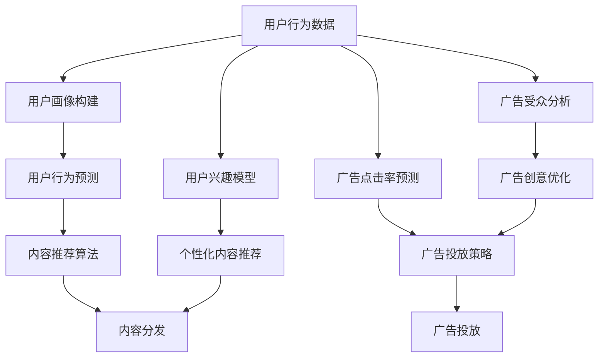

                 

# 知识付费创业中的内容分发渠道优化

> 关键词：知识付费,内容分发渠道,用户体验,转化率,用户粘性

## 1. 背景介绍

随着互联网技术的发展和知识经济的兴起，知识付费已逐渐成为学习、娱乐和信息获取的新模式。自2016年以来，包括得到、知乎live、分答等在内的知识付费平台迅速崛起，内容形式从音频、视频、图文多方面延伸，逐步吸引了大批用户。知识付费市场的蓬勃发展，也激发了更多创业者的热情，产生了大量新的知识付费产品和服务。

与此同时，内容分发渠道的优化成为知识付费创业公司竞争力的重要组成部分。虽然优质的内容是知识付费成功的基石，但如何将这些内容高效、精准地触达用户，提升用户体验和转化率，是许多创业公司面临的挑战。因此，本文将围绕内容分发渠道的优化，探讨如何通过技术手段，提升知识付费产品的用户体验和商业价值。

## 2. 核心概念与联系

### 2.1 核心概念概述

在知识付费创业中，内容分发渠道的优化主要关注如何通过技术手段，将内容有效地传递给目标用户。具体包括用户推荐系统、个性化内容推荐、广告投放等多个方面。

- **用户推荐系统**：通过分析用户的兴趣和行为，自动推荐符合用户需求的内容。
- **个性化内容推荐**：基于用户历史行为和偏好，提供定制化的内容推荐，提升用户粘性。
- **广告投放**：针对特定用户群体，精准投放广告，提升内容的曝光率和转化率。

### 2.2 核心概念原理和架构的 Mermaid 流程图



## 3. 核心算法原理 & 具体操作步骤

### 3.1 算法原理概述

在内容分发渠道优化中，常用的算法原理包括协同过滤、基于内容的推荐、深度学习等。协同过滤和基于内容的推荐是传统的推荐算法，主要基于用户历史行为和物品特征进行推荐。深度学习推荐则采用神经网络模型，可以处理更复杂的特征和关系。

#### 3.2 算法步骤详解

以深度学习推荐算法为例，其具体步骤如下：

**Step 1: 数据准备**
- 收集用户行为数据，包括点击、购买、评价、评论等。
- 清洗和预处理数据，确保数据质量和一致性。

**Step 2: 模型训练**
- 将数据划分为训练集、验证集和测试集。
- 设计推荐模型，如协同过滤、基于内容的推荐或深度学习推荐。
- 使用训练集训练模型，并在验证集上进行调参。

**Step 3: 模型评估**
- 在测试集上评估模型性能，常用的指标包括准确率、召回率、F1分数等。
- 分析模型的优势和局限性，优化模型结构。

**Step 4: 模型部署**
- 将优化后的模型部署到生产环境。
- 实时处理用户请求，返回推荐结果。

### 3.3 算法优缺点

深度学习推荐算法的优点在于能够处理更复杂的数据和特征，理论上可以获得更高的推荐精度。但缺点也较为明显：

- **数据需求高**：需要大量的用户行为数据和物品特征数据。
- **模型复杂**：深度学习模型通常较为复杂，训练和推理速度较慢。
- **易过拟合**：如果数据质量不佳或特征维度过高，容易出现过拟合现象。

### 3.4 算法应用领域

深度学习推荐算法已广泛应用于电商、新闻、音乐等领域的个性化推荐。在知识付费领域，该算法同样适用，可以提升内容推荐的准确性和用户体验。

## 4. 数学模型和公式 & 详细讲解 & 举例说明

### 4.1 数学模型构建

假设用户行为数据为 $D=\{(x_i,y_i)\}_{i=1}^N$，其中 $x_i$ 为用户行为特征，$y_i$ 为行为标签（如点击、购买等）。推荐模型的目标是通过训练得到模型 $f$，使得预测结果与真实标签尽可能接近，即最小化损失函数 $\mathcal{L}(y_i,f(x_i))$。

常用的损失函数包括均方误差损失、交叉熵损失等。对于深度学习推荐算法，一般使用隐式表示进行模型训练。具体而言，将用户行为数据映射为隐向量 $h_i$，物品特征数据映射为隐向量 $g_j$，通过矩阵乘法计算预测结果 $p_{i,j}=f(h_i,g_j)$，其中 $p_{i,j}$ 表示用户 $i$ 对物品 $j$ 的预测点击率。

### 4.2 公式推导过程

假设推荐模型为 $f(x)=W^T\sigma(Wx+b)$，其中 $W$ 为权重矩阵，$b$ 为偏置向量，$\sigma$ 为激活函数。对于用户 $i$ 和物品 $j$，预测点击率的计算公式为：

$$
p_{i,j}=f(h_i,g_j)=\sigma(W^Tg_j)^\top\sigma(W^\top h_i+b)
$$

其中 $g_j$ 和 $h_i$ 分别为物品和用户的隐向量表示。

使用梯度下降等优化算法更新模型参数 $W$ 和 $b$，使得预测结果与真实标签的差异最小化：

$$
W,b \leftarrow W,b - \eta\nabla_{W,b}\mathcal{L}(y_i,p_{i,j})
$$

其中 $\eta$ 为学习率。

### 4.3 案例分析与讲解

以知识付费平台中的文章推荐为例，用户对文章的点击、收藏、评分等行为被记录下来，成为训练数据。使用协同过滤或基于内容的推荐模型，计算用户和文章的隐向量表示，并通过矩阵乘法计算预测点击率。在测试集上评估模型性能，若预测准确率较高，则可以将该模型应用于实际推荐系统中，为不同用户推荐个性化的文章。

## 5. 项目实践：代码实例和详细解释说明

### 5.1 开发环境搭建

在代码实现前，需要搭建开发环境，包括数据准备和模型训练等步骤。

**Step 1: 环境搭建**
- 安装 Python 环境，建议使用虚拟环境。
- 安装相关依赖包，如 TensorFlow、Keras、Pandas 等。

**Step 2: 数据准备**
- 收集用户行为数据，并清洗和预处理数据。
- 将数据划分为训练集、验证集和测试集。

**Step 3: 模型训练**
- 编写推荐模型代码，并进行模型训练。

### 5.2 源代码详细实现

以下是一个简单的推荐模型代码实现示例，基于 TensorFlow 框架：

```python
import tensorflow as tf
import pandas as pd

# 加载数据集
train_data = pd.read_csv('train.csv')
test_data = pd.read_csv('test.csv')

# 数据预处理
train_data['user_id'] = train_data['user_id'].astype(int)
train_data['item_id'] = train_data['item_id'].astype(int)
train_data['label'] = train_data['label'].astype(int)

test_data['user_id'] = test_data['user_id'].astype(int)
test_data['item_id'] = test_data['item_id'].astype(int)

# 数据划分
train_data = train_data.dropna()
test_data = test_data.dropna()

# 创建模型
model = tf.keras.Sequential([
    tf.keras.layers.Dense(64, activation='relu'),
    tf.keras.layers.Dense(32, activation='relu'),
    tf.keras.layers.Dense(1, activation='sigmoid')
])

# 编译模型
model.compile(optimizer='adam', loss='binary_crossentropy', metrics=['accuracy'])

# 训练模型
model.fit(train_data[['user_id', 'item_id']], train_data['label'], epochs=10, batch_size=64, validation_split=0.2)

# 评估模型
loss, accuracy = model.evaluate(test_data[['user_id', 'item_id']], test_data['label'])
print(f'Test loss: {loss:.4f}, Test accuracy: {accuracy:.4f}')
```

### 5.3 代码解读与分析

上述代码中，首先加载并预处理数据集，然后创建并编译推荐模型，最后进行模型训练和评估。其中，模型结构为三层全连接神经网络，输出层采用 sigmoid 激活函数，适用于二分类问题。在训练过程中，采用二元交叉熵损失函数和 Adam 优化器。模型训练结束后，在测试集上评估模型性能，输出损失和准确率。

## 6. 实际应用场景

### 6.1 智能推荐系统

在知识付费平台中，智能推荐系统是提升用户体验和转化率的重要手段。通过用户行为数据，智能推荐系统可以实时生成个性化推荐列表，引导用户发现感兴趣的内容，提升用户粘性。

以得到平台为例，用户通过搜索或浏览发现感兴趣的文章，系统会记录其行为数据，并根据历史行为和兴趣推荐相关文章，引导用户进一步阅读和学习。这种推荐策略可以显著提升用户对平台的粘性，增加用户续费率。

### 6.2 广告投放优化

知识付费平台中的广告投放，不仅能够带来直接收益，还能够提升内容的曝光率，增加用户注册和付费的可能性。通过精准的用户画像和行为分析，平台可以在合适的时机投放合适的广告，提高广告的转化率。

例如，对于刚注册的用户，可以通过兴趣标签投放相关课程广告，引导其进行首次购买；对于付费订阅用户，可以推荐更多高性价比的课程，增加其续费意愿。通过精确的广告投放，平台可以最大化广告投入回报，降低营销成本。

### 6.3 用户画像构建

用户画像构建是推荐系统的重要基础。通过对用户行为数据的分析，平台可以生成详细的用户画像，包括用户兴趣、行为偏好、消费习惯等。这些画像信息可以帮助推荐系统更好地理解用户需求，提升推荐效果。

以知乎平台为例，用户通过浏览、点赞、评论等行为被记录下来，形成用户画像。知乎的知识付费服务，如Live、盐选会员等，可以根据用户画像推荐相关内容，满足用户的特定需求，提升用户体验和满意度。

## 7. 工具和资源推荐

### 7.1 学习资源推荐

为了帮助开发者更好地掌握内容分发渠道优化的技术，推荐以下学习资源：

- 《推荐系统实战》：深入讲解推荐系统的原理和算法，包含协同过滤、基于内容的推荐、深度学习推荐等多种方法。
- 《深度学习推荐系统》课程：由吴恩达教授主讲，系统介绍推荐系统的理论和实践。
- 《Python推荐系统》教程：包含推荐系统的全栈开发流程，从数据处理到模型训练，再到应用部署。

### 7.2 开发工具推荐

在推荐系统开发中，常用的工具包括：

- TensorFlow：开源深度学习框架，支持大规模分布式训练和推理。
- PyTorch：开源深度学习框架，以其动态计算图和易用性著称。
- Keras：高层次神经网络 API，易于上手和调试。
- Apache Spark：大数据处理引擎，支持高效的数据处理和分析。

### 7.3 相关论文推荐

以下是几篇经典推荐系统的论文，推荐阅读：

- 《Factorization Machines: Training Factorization Machines for Click Prediction》
- 《Attention Is All You Need》
- 《Neural Collaborative Filtering》
- 《Deep Matrix Factorization》

这些论文代表了推荐系统的最新研究进展，深入理解这些论文将有助于开发者更好地应用于知识付费创业中的内容分发渠道优化。

## 8. 总结：未来发展趋势与挑战

### 8.1 研究成果总结

本文详细介绍了知识付费创业中的内容分发渠道优化方法，包括用户推荐系统、个性化内容推荐、广告投放等。基于协同过滤、基于内容的推荐和深度学习等技术手段，可以实现高效、精准的内容分发。

### 8.2 未来发展趋势

未来推荐系统的趋势包括：

- **个性化推荐**：利用更多用户行为数据和物品特征，实现更精准的个性化推荐。
- **多模态推荐**：结合文本、图像、视频等多模态数据，提升推荐效果。
- **实时推荐**：通过流式计算和大数据技术，实现实时推荐，满足用户即时需求。
- **自适应推荐**：根据用户反馈和行为变化，动态调整推荐策略，提升用户满意度。

### 8.3 面临的挑战

尽管推荐系统在知识付费中得到了广泛应用，但面临以下挑战：

- **数据隐私**：用户行为数据涉及个人隐私，如何在数据采集和使用中保护用户隐私是一个重要问题。
- **模型复杂性**：深度学习推荐模型复杂，训练和推理时间较长，如何提升模型效率是未来的研究方向。
- **冷启动问题**：对于新用户或新物品，推荐系统难以提供个性化推荐，需要结合推荐算法和人工干预解决。

### 8.4 研究展望

未来的推荐系统研究可以从以下几个方向展开：

- **自适应推荐算法**：结合强化学习、协同过滤等方法，实时调整推荐策略，提高用户满意度。
- **多模态推荐技术**：结合视觉、语音、文本等多种模态数据，提升推荐系统的泛化能力。
- **深度学习融合**：将深度学习与协同过滤、基于内容的推荐等方法结合，形成更加全面的推荐模型。
- **隐私保护技术**：引入隐私保护技术，如差分隐私、联邦学习等，保护用户数据隐私。

通过不断探索和创新，知识付费平台将能够提供更加精准、个性化的推荐服务，提升用户体验和商业价值。

## 9. 附录：常见问题与解答

**Q1: 如何处理数据隐私问题？**

A: 在数据采集和使用中，应严格遵守相关法律法规，如 GDPR、CCPA 等。可以采用数据匿名化、差分隐私等技术，保护用户隐私。同时，合理设计用户画像，仅收集必要数据，减少隐私泄露风险。

**Q2: 如何优化推荐系统的计算效率？**

A: 采用分布式计算和大数据技术，提升推荐系统的计算效率。同时，使用模型压缩、稀疏化存储等技术，减少模型大小和存储需求。优化推荐算法，减少计算量和内存占用，提升推理速度。

**Q3: 如何解决冷启动问题？**

A: 在推荐系统中，对于新用户和新物品，可以采用基于内容的推荐、流行度推荐等方式，提供初步推荐。同时，结合人工干预和用户反馈，逐步完善推荐策略，提高推荐效果。

通过不断探索和创新，推荐系统将在知识付费平台中发挥越来越重要的作用，提升用户满意度和平台商业价值。知识付费创业中的内容分发渠道优化，需要结合技术手段和实际需求，不断优化和迭代，才能在激烈的市场竞争中取得优势。

---

作者：禅与计算机程序设计艺术 / Zen and the Art of Computer Programming

