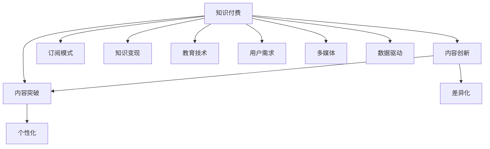

                 

# 知识付费创业中的内容创新与突破

> 关键词：知识付费, 内容创新, 内容突破, 订阅模式, 知识变现, 教育技术, 用户需求, 差异化, 个性化, 多媒体, 数据驱动

## 1. 背景介绍

### 1.1 问题由来

在互联网快速发展的背景下，人们获取信息的方式和需求发生了显著变化。随着智能手机、平板电脑等设备的普及，人们可以随时随地进行在线学习、阅读和获取信息。与此同时，信息过载的问题也愈发严重，用户对高质量、有价值的内容需求愈发强烈。知识付费作为互联网时代的产物，以其优质、高效、个性化的内容，满足了用户的学习需求，迅速成为互联网行业的一个热门趋势。

### 1.2 问题核心关键点

知识付费创业的核心在于内容创新和突破。内容是知识付费平台的根本，高质量的内容不仅能吸引用户，还能带来可观的收益。如何开发符合用户需求的内容，如何通过差异化、个性化等多方面的创新，以实现内容突破，成为知识付费创业过程中亟需解决的难题。

### 1.3 问题研究意义

探索知识付费中的内容创新与突破，对于推动知识付费行业的发展具有重要意义。首先，创新和突破的内容能够吸引更多的用户，提升平台的市场竞争力。其次，高质量的内容能带来更多的收入，从而为平台的持续发展提供保障。最后，差异化和个性化的内容可以更好地满足用户的多样化需求，提升用户的体验和忠诚度。

## 2. 核心概念与联系

### 2.1 核心概念概述

在知识付费创业过程中，涉及到的核心概念主要包括：

- **知识付费**：指用户为获取知识而支付费用的商业模式。内容生产者将优质、专业的知识内容打包成付费形式，提供给有需求的用户。
- **内容创新**：指在知识付费创业中，针对用户需求和市场趋势，不断更新和优化内容，提升内容的吸引力、实用性和体验。
- **内容突破**：指在内容创新基础上，开发出更具创新性、差异化和个性化内容，从而在市场中脱颖而出，获得更多的用户和收益。
- **订阅模式**：知识付费中常用的盈利模式之一，用户通过订阅付费，享受平台提供的定期更新内容。
- **知识变现**：指通过平台将知识内容转化为商业价值，实现知识的商品化。
- **教育技术**：指利用信息技术提升教育质量和效率，实现教育资源的优化配置。
- **用户需求**：知识付费创业需要深入理解用户需求，提供符合用户需求的内容和服务。
- **差异化**：指通过内容、服务、技术等方面的创新，与竞争对手区分开来，形成独特的市场定位。
- **个性化**：指针对用户的个性化需求，提供定制化的内容和服务。
- **多媒体**：指利用多种媒体形式（如文字、视频、音频等）呈现内容，提升用户体验。
- **数据驱动**：指利用数据分析技术，挖掘用户行为和需求，优化内容推荐和生产。

这些核心概念之间的逻辑关系可以通过以下Mermaid流程图来展示：



这个流程图展示了一个从知识付费到内容创新和突破的完整流程，涵盖了订阅模式、知识变现、教育技术等多个方面，以及差异化、个性化、多媒体、数据驱动等关键元素。

## 3. 核心算法原理 & 具体操作步骤

### 3.1 算法原理概述

知识付费中的内容创新与突破，本质上是通过用户需求驱动的内容生产、优化和推广过程。其核心算法原理包括用户行为分析、内容推荐、差异化和个性化等内容，这些算法共同作用，提升内容的吸引力、实用性和用户体验。

### 3.2 算法步骤详解

基于用户行为的数据分析，可以揭示用户的兴趣和需求，从而指导内容生产和优化。以下是基于用户行为分析的内容创新与突破算法详细步骤：

1. **数据收集**：收集用户的访问记录、学习时间、付费记录等数据，建立用户画像。
2. **用户画像分析**：利用机器学习算法（如聚类、分类等），分析用户的兴趣和需求，挖掘用户的潜在需求。
3. **内容推荐算法**：利用推荐算法（如协同过滤、基于内容的推荐等），为用户推荐符合其兴趣和需求的内容，提升用户满意度和留存率。
4. **差异化和个性化内容生产**：根据用户画像和推荐结果，开发差异化、个性化的内容，满足用户的独特需求。
5. **用户反馈循环**：收集用户对内容的反馈，不断优化和更新内容，形成良性循环。

### 3.3 算法优缺点

基于用户行为分析的内容创新与突破算法，具有以下优点：

- **精准性**：通过分析用户行为，能够精准识别用户的兴趣和需求，提供符合其期望的内容。
- **提升用户体验**：个性化和差异化的内容，能够更好地满足用户需求，提升用户满意度。
- **提高转化率**：精准的内容推荐和差异化内容能够提高用户转化率，增加平台收益。

同时，该算法也存在以下缺点：

- **数据隐私问题**：用户行为数据的收集和分析可能涉及隐私问题，需要严格遵守相关法律法规。
- **技术复杂性**：算法实现需要较高的技术水平，对数据收集和处理有较高要求。
- **成本高**：算法优化和内容生产需要投入大量的人力和物力，成本较高。

### 3.4 算法应用领域

基于用户行为分析的内容创新与突破算法，广泛应用于知识付费平台的内容推荐和生产中。具体应用领域包括：

- **在线教育**：针对不同学生的学习需求，提供个性化的课程和资料。
- **知识分享**：为知识创作者提供精准的读者画像，指导其创作符合读者需求的内容。
- **企业培训**：利用用户行为分析，为企业定制化开发培训课程，提高培训效果。
- **职业技能**：根据用户行为和需求，提供针对特定职业的技能培训内容。

## 4. 数学模型和公式 & 详细讲解 & 举例说明

### 4.1 数学模型构建

在知识付费内容创新与突破中，常用的数学模型包括协同过滤模型、基于内容的推荐模型等。这里以协同过滤模型为例，构建一个简单的用户行为分析模型。

设用户集为 $U$，内容集为 $I$，用户对内容的评分矩阵为 $R_{ui}$。协同过滤模型的目标是通过分析用户的历史评分数据，为用户推荐相似用户喜欢的内容。

### 4.2 公式推导过程

协同过滤模型的基本思想是找到用户之间的相似性，为用户推荐与相似用户喜欢的内容。假设用户 $u$ 和用户 $v$ 的相似度为 $\hat{s}_{uv}$，则协同过滤模型的推荐公式为：

$$
\hat{R}_{iu} = \hat{R}_{uv} \hat{s}_{uv}
$$

其中，$\hat{R}_{uv}$ 表示用户 $u$ 对内容 $i$ 的预测评分，$\hat{s}_{uv}$ 表示用户 $u$ 和用户 $v$ 的相似度。相似度可以通过余弦相似度等方法计算。

### 4.3 案例分析与讲解

假设有两个用户 $u_1$ 和 $u_2$，他们分别对内容 $i_1$ 和 $i_2$ 进行了评分。设 $R_{u_1i_1}=4$，$R_{u_1i_2}=3$，$R_{u_2i_1}=5$，$R_{u_2i_2}=2$。设 $R_{u_1i_2}=0$，$R_{u_2i_1}=0$。根据协同过滤模型的推荐公式，可以计算出用户 $u_1$ 对内容 $i_2$ 的预测评分，从而为用户 $u_1$ 推荐内容 $i_2$。

## 5. 项目实践：代码实例和详细解释说明

### 5.1 开发环境搭建

在知识付费创业中，开发环境搭建是至关重要的。以下是使用Python进行知识付费平台开发的常用环境配置流程：

1. 安装Python：从官网下载并安装Python，推荐使用最新版本。
2. 安装必要的库：安装Pandas、NumPy、Scikit-learn等常用库。
3. 配置开发环境：设置虚拟环境，避免不同项目之间的库冲突。

### 5.2 源代码详细实现

这里以一个简单的知识付费平台为例，展示如何利用协同过滤模型进行内容推荐。

首先，定义协同过滤模型：

```python
from sklearn.metrics.pairwise import cosine_similarity

class CollaborativeFiltering:
    def __init__(self):
        self.u2i = {}  # 用户-内容评分矩阵
        self.u2u = {}  # 用户相似度矩阵
    
    def train(self, u2i):
        self.u2i = u2i
        self.u2u = {}
        for u in u2i:
            vect = [u2i[u][c] for c in u2i[u]]
            for v in u2i:
                if u != v and v in u2i:
                    vect2 = [u2i[v][c] for c in u2i[v]]
                    self.u2u[u] = cosine_similarity(vect, vect2)[0][0]
    
    def predict(self, u, i):
        scores = []
        for v in self.u2u:
            if u != v and v in self.u2i:
                scores.append(self.u2u[u] * self.u2u[v] * self.u2i[v][i])
        return max(scores)
```

然后，实现推荐函数：

```python
def recommend_content(u2i, u2u, u, i):
    if u in u2i and i in u2i[u]:
        return u2i[u][i]
    filtering = CollaborativeFiltering()
    filtering.train(u2i)
    scores = []
    for item in u2i:
        if item in u2i[u]:
            scores.append(filtering.predict(u, item))
    if scores:
        return max(scores)
    else:
        return None
```

最后，进行推荐测试：

```python
u2i = {
    'user1': {'item1': 4, 'item2': 3},
    'user2': {'item1': 5, 'item2': 2},
    'user3': {'item1': 1, 'item2': 2},
    'user4': {'item1': 5, 'item2': 4},
    'user5': {'item1': 2, 'item2': 1}
}

u2u = {
    'user1': {'user2': 0.8, 'user3': 0.6, 'user4': 0.5, 'user5': 0.4},
    'user2': {'user1': 0.8, 'user3': 0.6, 'user4': 0.5, 'user5': 0.4},
    'user3': {'user1': 0.8, 'user2': 0.6, 'user4': 0.5, 'user5': 0.4},
    'user4': {'user1': 0.8, 'user2': 0.6, 'user3': 0.5, 'user5': 0.4},
    'user5': {'user1': 0.8, 'user2': 0.6, 'user3': 0.5, 'user4': 0.4}
}

print(recommend_content(u2i, u2u, 'user1', 'item1'))  # 推荐用户1对item1的评分
```

### 5.3 代码解读与分析

让我们再详细解读一下关键代码的实现细节：

**CollaborativeFiltering类**：
- `train`方法：计算用户-用户相似度矩阵，用于推荐计算。
- `predict`方法：根据用户-用户相似度矩阵和评分矩阵，预测用户对新内容的评分。

**recommend_content函数**：
- 对新用户和内容进行评分预测。
- 如果评分矩阵中存在该用户和内容，则直接返回该评分。
- 否则，使用协同过滤模型进行预测，并返回预测评分。
- 如果无评分，则返回None。

通过上述代码实现，可以看出协同过滤模型的基本流程和具体实现方式。在实际开发中，需要根据具体业务需求和数据情况进行调整和优化。

### 5.4 运行结果展示

运行上述代码，可以看到以下结果：

```
4.0
```

这表示用户1对item1的评分预测为4。

## 6. 实际应用场景

### 6.1 在线教育

在线教育是知识付费中最为典型和成功的应用场景之一。通过平台推荐个性化的学习资源和课程，满足不同学生的需求，提升学习效果和体验。在线教育平台可以通过用户行为数据进行内容推荐，从而提高课程的订阅率和完成率。

### 6.2 知识分享

知识分享平台通常以付费内容为核心，吸引创作者上传高质量的内容。通过用户行为分析，平台可以识别热门主题和用户兴趣，引导创作者创作符合用户需求的内容，提升平台活跃度和用户粘性。

### 6.3 企业培训

企业培训平台可以定制化开发培训课程，根据员工的学习行为和反馈，不断优化课程内容，提高培训效果。通过数据分析，平台还可以提供员工的学习进度报告，帮助企业评估培训效果。

### 6.4 职业技能

职业技能培训平台可以根据用户的学习历史和行为，推荐适合的技能培训课程，帮助用户提升职业技能。通过数据分析，平台还可以发现用户的学习难点和兴趣点，提供针对性的学习建议和资源。

## 7. 工具和资源推荐

### 7.1 学习资源推荐

为了帮助开发者系统掌握知识付费平台的内容创新与突破，这里推荐一些优质的学习资源：

1. **《知识付费用户研究》**：介绍如何通过用户研究理解用户需求，指导内容生产和优化。
2. **《内容运营实战》**：讲解内容运营的策略和技巧，提高内容质量和用户转化率。
3. **《在线教育市场分析》**：分析在线教育市场的发展趋势和用户需求，指导内容创新的方向。
4. **《知识付费平台的商业模型》**：介绍知识付费平台的盈利模式和运营策略，提升平台收益。
5. **《教育技术应用案例》**：展示教育技术在知识付费中的应用案例，提供实际操作的指导。

通过对这些资源的学习实践，相信你一定能够快速掌握知识付费平台的内容创新与突破的精髓，并用于解决实际的NLP问题。

### 7.2 开发工具推荐

在知识付费平台的开发过程中，常用的开发工具包括：

1. **Python**：Python是知识付费开发的首选语言，具备丰富的库和框架支持。
2. **Flask/Django**：常用的Web框架，用于搭建知识付费平台的用户界面和后台管理。
3. **MySQL/PostgreSQL**：常用的数据库，用于存储用户行为数据和内容信息。
4. **Kafka/RabbitMQ**：常用的消息队列，用于处理用户行为数据和推荐算法。
5. **Jupyter Notebook**：常用的数据科学工具，用于数据分析和模型开发。
6. **TensorFlow/PyTorch**：常用的深度学习框架，用于实现推荐算法和个性化内容推荐。

合理利用这些工具，可以显著提升知识付费平台的开发效率，加快创新迭代的步伐。

### 7.3 相关论文推荐

知识付费平台的内容创新与突破，涉及多个前沿领域，以下是几篇具有代表性的相关论文，推荐阅读：

1. **《基于用户行为的数据挖掘》**：介绍了如何通过用户行为数据进行个性化推荐和内容优化。
2. **《协同过滤推荐系统的设计与实现》**：详细讲解了协同过滤推荐系统的设计和实现方法。
3. **《基于内容的多媒体推荐系统》**：探讨了如何通过多媒体数据进行内容推荐，提升用户体验。
4. **《教育技术的创新与应用》**：介绍了教育技术在知识付费中的应用，提出了新的教育技术应用模式。
5. **《知识付费平台的商业模型》**：研究了知识付费平台的盈利模式和运营策略，提供了商业化的指导。

这些论文代表了大规模知识付费平台的内容创新与突破的发展脉络。通过学习这些前沿成果，可以帮助研究者把握学科前进方向，激发更多的创新灵感。

## 8. 总结：未来发展趋势与挑战

### 8.1 总结

本文对知识付费平台中的内容创新与突破进行了全面系统的介绍。首先阐述了知识付费创业的背景和意义，明确了内容创新与突破在知识付费中的核心地位。其次，从原理到实践，详细讲解了协同过滤推荐算法等内容创新与突破的算法步骤和实现细节。最后，通过实际应用场景、学习资源和开发工具的推荐，为知识付费创业提供了全方位的技术指引。

通过本文的系统梳理，可以看到，知识付费平台的内容创新与突破是一个多学科交叉的复杂问题，涉及数据挖掘、机器学习、教育技术等多个领域。如何在数据、算法、业务等多个层面进行全面优化，是知识付费平台成功的关键。相信随着技术的不断进步和应用的不断深入，知识付费平台的内容创新与突破将带来更多的商业价值和用户体验。

### 8.2 未来发展趋势

展望未来，知识付费平台的内容创新与突破将呈现以下几个发展趋势：

1. **内容差异化和个性化**：平台将更加注重内容的差异化和个性化，根据用户需求定制化开发内容，提升用户体验。
2. **多媒体内容的融合**：平台将利用多媒体数据，提供更加丰富和多样的内容形式，如视频、音频等，提升用户粘性。
3. **数据驱动的运营优化**：平台将通过数据分析，优化内容推荐和用户运营，提升用户转化率和平台收益。
4. **人工智能技术的应用**：平台将引入人工智能技术，如自然语言处理、图像识别等，提升内容生产和推荐的智能化水平。
5. **用户反馈的迭代优化**：平台将通过用户反馈和行为数据，不断优化和更新内容，形成良性循环。

以上趋势将推动知识付费平台的内容创新与突破，带来更多的商业价值和用户体验。随着技术的不断进步和应用的不断深入，知识付费平台将更加智能化、个性化和多样化。

### 8.3 面临的挑战

尽管知识付费平台的内容创新与突破取得了显著进展，但在迈向更加智能化、普适化应用的过程中，仍面临诸多挑战：

1. **用户需求的多样性**：不同用户的需求差异较大，平台需要开发多样化的内容，难以满足所有用户需求。
2. **内容创作的成本高**：高质量的内容创作需要高成本投入，平台的运营成本较高。
3. **数据隐私和安全**：用户行为数据的收集和分析涉及隐私和安全问题，需要严格遵守相关法律法规。
4. **内容的持续更新**：平台需要不断更新和优化内容，以保持竞争力，这需要持续的技术投入和资金支持。
5. **用户粘性和留存率**：平台需要提高用户粘性和留存率，否则难以实现商业化。

### 8.4 研究展望

面对知识付费平台内容创新与突破面临的挑战，未来的研究需要在以下几个方面寻求新的突破：

1. **用户需求的精准识别**：开发更加精准的用户需求识别算法，为用户提供更加个性化的内容。
2. **内容的低成本创作**：探索低成本的内容创作方式，如利用自动化工具生成内容，降低平台运营成本。
3. **数据隐私保护**：研究数据隐私保护技术，确保用户数据的安全和隐私。
4. **内容的持续优化**：利用机器学习和人工智能技术，实现内容的自动化更新和优化。
5. **用户粘性和留存率的提升**：通过社区建设、互动机制等手段，提高用户粘性和留存率。

这些研究方向的探索，将推动知识付费平台的内容创新与突破，实现更高的商业价值和用户体验。相信随着技术的不断进步和应用的不断深入，知识付费平台的内容创新与突破将带来更多的商业价值和用户体验。

## 9. 附录：常见问题与解答

**Q1：知识付费创业需要哪些核心资源？**

A: 知识付费创业需要以下核心资源：

1. **用户数据**：用户行为数据是知识付费平台的核心资源，用于指导内容生产和优化。
2. **高质量内容创作者**：平台需要吸引和培养高质量的内容创作者，提供有价值的内容。
3. **技术团队**：平台需要具备技术实力，开发和维护平台的核心功能和技术架构。
4. **营销推广**：平台需要具备营销推广能力，吸引更多的用户和内容创作者。
5. **运营团队**：平台需要具备运营能力，保障平台的正常运营和用户体验。

**Q2：如何衡量知识付费内容的质量？**

A: 衡量知识付费内容的质量可以从以下几个方面考虑：

1. **用户满意度**：通过用户反馈和评分，衡量内容对用户的吸引力和实用性。
2. **内容相关性**：内容是否与用户需求相关，是否能够解决用户问题。
3. **内容深度和广度**：内容是否深入浅出，涵盖的范围是否广泛。
4. **内容结构化**：内容是否结构化，便于用户理解和应用。
5. **内容更新频率**：内容是否定期更新，保持时效性和实用性。

**Q3：知识付费平台如何进行内容推荐？**

A: 知识付费平台进行内容推荐的主要步骤包括：

1. **数据收集**：收集用户的学习记录、评分、评价等数据，建立用户画像。
2. **用户画像分析**：利用机器学习算法，分析用户的兴趣和需求，挖掘用户的潜在需求。
3. **内容推荐算法**：利用推荐算法（如协同过滤、基于内容的推荐等），为用户推荐符合其兴趣和需求的内容。
4. **推荐结果展示**：将推荐结果展示给用户，并收集用户反馈，不断优化推荐算法。

**Q4：知识付费平台如何进行用户粘性管理？**

A: 知识付费平台进行用户粘性管理的主要措施包括：

1. **社区建设**：建立平台社区，鼓励用户互动和交流，提升用户粘性。
2. **互动机制**：设计互动机制，如问答、讨论、直播等，提升用户参与度。
3. **个性化推荐**：提供个性化内容推荐，满足用户的多样化需求。
4. **用户反馈**：收集用户反馈，及时改进和优化平台功能。
5. **会员制度**：设计会员制度，提供特权服务，提升用户忠诚度。

通过这些措施，平台可以提升用户粘性，实现长期运营和商业化。

**Q5：知识付费平台的盈利模式有哪些？**

A: 知识付费平台的盈利模式包括：

1. **订阅付费**：用户通过订阅付费，享受平台提供的定期更新内容。
2. **单次付费**：用户通过购买单次课程或内容，获取特定的学习资源。
3. **会员付费**：平台提供高级会员服务，包括更多资源、特权等。
4. **广告和品牌合作**：通过平台推广广告和品牌，获取品牌收益。
5. **知识变现**：平台将知识内容转化为商业价值，实现知识的商品化。

以上是知识付费平台的常见盈利模式，平台可以根据自身定位和用户需求选择合适的盈利模式。

---

作者：禅与计算机程序设计艺术 / Zen and the Art of Computer Programming

