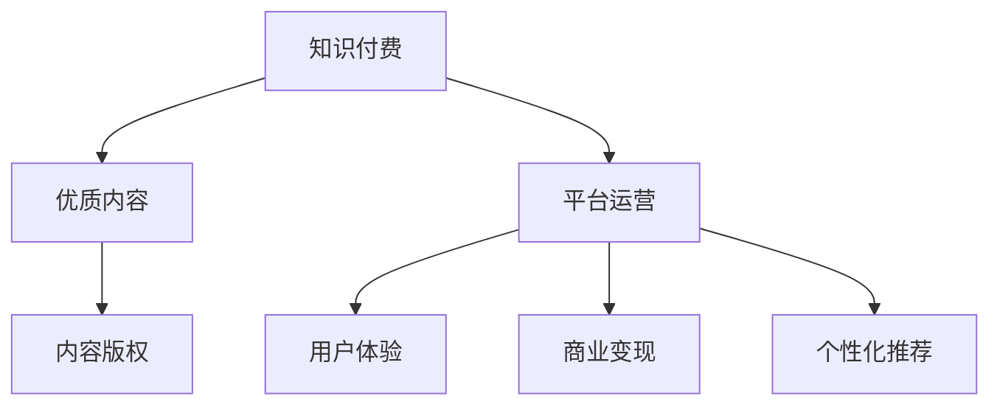

                 

# 知识付费创业中的创新思维

在信息爆炸的时代，知识和教育资源从未如此丰富和普及。然而，这并不意味着知识付费的价值就会减弱。恰恰相反，知识的价值不仅没有下降，反而因为优质内容的稀缺和个性化需求的增加而变得更高。对于创业者来说，如何将知识付费做深做精，成为一门生意，已经成为一个重要的课题。本文将从背景介绍、核心概念与联系、核心算法原理、实际操作步骤、数学模型和公式、项目实践、实际应用场景、工具和资源推荐、总结及未来展望等多个方面，深入探讨知识付费创业中的创新思维。

## 1. 背景介绍

### 1.1 问题由来
随着互联网的普及和数字技术的进步，人们获取知识的渠道日益丰富。从传统的书籍、报纸、电视，到如今的在线课程、视频、博客、社交媒体等，知识的传播方式和渠道已经发生了根本性的变化。然而，尽管信息获取变得容易，人们对于知识的深度和专业性需求却更加强烈。如何从海量信息中筛选出有价值的内容，如何提供更加个性化、专业化的知识服务，成为摆在创业者面前的新问题。

### 1.2 问题核心关键点
在知识付费创业中，核心关键点包括以下几点：
1. 如何筛选优质内容。优质内容是知识付费的基础，而优质的内容往往源自专业领域的深度研究和积累。
2. 如何提升用户体验。一个好的知识付费平台需要具备良好的用户体验，让用户能够轻松地找到、购买和消费内容。
3. 如何实现商业变现。知识付费创业最终需要实现盈利，这就要求平台能够找到有效的商业模式和变现手段。

### 1.3 问题研究意义
探索知识付费创业中的创新思维，对于推动知识传播、提高教育质量、促进个人发展和经济转型都具有重要意义：
1. 推动知识传播：高质量的知识付费产品能够吸引更多人参与到知识的学习和传播中来。
2. 提高教育质量：通过筛选和定制优质的教育资源，知识付费能够提升教育质量和效果。
3. 促进个人发展：知识付费为个人提供了一个持续学习、提升自我的平台。
4. 促进经济转型：知识付费行业的发展能够带动相关产业链的发展，如内容创作、平台运营等。

## 2. 核心概念与联系

### 2.1 核心概念概述

为了更好地理解知识付费创业中的创新思维，首先需要明确几个核心概念：

1. **知识付费(Knowledge Paywall)**：指用户需要付费才能获取到高质量、专业化的知识资源，以实现自我提升和学习。
2. **优质内容(High-Quality Content)**：指内容创作者所提供的专业、深入、具有独特价值和见解的知识产品。
3. **平台运营(Platform Operation)**：指知识付费平台的开发、运营、维护和管理，确保平台能够持续为用户提供优质服务。
4. **商业变现(Commercial Monetization)**：指知识付费平台通过多种方式实现盈利，包括付费订阅、课程销售、广告收入等。
5. **用户体验(User Experience)**：指平台设计中的用户友好性、交互体验和信息架构，直接影响用户的满意度和留存率。
6. **个性化推荐(Personalized Recommendation)**：指根据用户的历史行为、兴趣偏好和需求，为其推荐相关内容的智能算法。
7. **内容版权(Copyright)**：指对知识资源拥有正式的法律保护，保护创作者权益，防止内容盗用和侵权。

这些核心概念之间的逻辑关系可以通过以下Mermaid流程图来展示：



这个流程图展示了这个生态系统的核心组件及其之间的关系：

1. 知识付费以优质内容为基础，内容创作者提供专业化的知识资源。
2. 平台运营确保内容的质量和用户的良好体验。
3. 用户体验和个性化推荐提升用户黏性和满意度。
4. 商业变现是知识付费平台可持续发展的关键。
5. 内容版权保护确保创作者的利益不受侵害。

这些核心概念共同构成了知识付费创业的框架，为其创新思维提供了基础。

## 3. 核心算法原理 & 具体操作步骤
### 3.1 算法原理概述

知识付费创业中的创新思维，主要体现在以下几个方面：

1. **筛选优质内容**：通过智能算法，自动筛选和推荐优质内容，降低用户获取知识的时间成本。
2. **提升用户体验**：通过用户行为分析，优化平台的用户界面和交互流程，提升用户体验。
3. **实现商业变现**：通过多样化的商业策略，如付费订阅、课程销售、广告等，实现知识付费平台的盈利。

### 3.2 算法步骤详解

知识付费创业的核心算法步骤包括：

1. **内容筛选与推荐算法**：
    - 收集用户的历史行为数据，如浏览、购买、评分等。
    - 利用协同过滤、内容推荐、用户画像等技术，为用户推荐个性化的内容。
    - 定期更新推荐模型，确保推荐的准确性和时效性。

2. **平台运营优化算法**：
    - 设计简洁、易用的用户界面，提升平台的用户体验。
    - 利用A/B测试等方法，优化平台的交互流程和功能设计。
    - 采用机器学习技术，对平台的运营数据进行分析，优化策略和流程。

3. **商业变现策略**：
    - 设计灵活的付费模式，如单次购买、订阅制、按需购买等。
    - 引入广告、赞助等外部收入，平衡平台的盈利和用户体验。
    - 探索新的商业模式，如知识付费众筹、内容合作等。

### 3.3 算法优缺点

知识付费创业中的核心算法具有以下优点：
1. 提高效率：通过自动化的筛选和推荐，降低了用户获取知识的时间成本。
2. 提升体验：通过优化平台的用户界面和交互流程，提升了用户体验。
3. 增加收益：通过多样化的商业策略，增加了平台的盈利能力。

同时，这些算法也存在一些局限性：
1. 数据隐私：用户行为数据的收集和使用可能涉及隐私问题，需要谨慎处理。
2. 内容质量：算法推荐的准确性依赖于内容的丰富性和质量，内容不足或质量不高会影响用户体验。
3. 商业风险：多样化的商业策略可能带来一定的商业风险，需要谨慎设计和管理。

### 3.4 算法应用领域

知识付费创业中的核心算法可以应用于多种领域，如在线教育、知识服务、科技资讯等。以下是几个具体的应用场景：

1. **在线教育平台**：通过筛选和推荐优质的在线课程，帮助用户快速提升自身技能。
2. **知识服务社区**：通过筛选和推荐专业的文章、视频等知识产品，满足用户个性化的知识需求。
3. **科技资讯平台**：通过筛选和推荐最新的科技资讯和深度分析，为用户提供有价值的信息服务。

## 4. 数学模型和公式 & 详细讲解 & 举例说明

### 4.1 数学模型构建

知识付费创业中的核心算法模型可以基于以下几个关键数据构建：

1. **用户行为数据(User Behavior Data)**：包括用户的浏览记录、购买记录、评分等。
2. **内容质量数据(Content Quality Data)**：包括内容的浏览次数、点赞数、评论数等。
3. **平台运营数据(Platform Operation Data)**：包括平台的访问量、留存率、转化率等。

### 4.2 公式推导过程

以内容推荐算法为例，其核心公式可以表示为：

$$
r_{ui} = \sum_{j=1}^{n} \alpha_j p_{uj} \times i_j
$$

其中，$r_{ui}$表示用户$u$对内容$i$的推荐评分，$n$为所有内容的数量，$\alpha_j$为权重参数，$p_{uj}$为用户$u$对内容$j$的兴趣度，$i_j$为内容$j$的特征评分。

通过上述公式，算法可以根据用户的历史行为和内容的特征评分，计算出用户对每个内容的推荐评分，从而为用户推荐最相关的内容。

### 4.3 案例分析与讲解

以在线教育平台为例，用户行为数据可以包括：
- 浏览时间：用户浏览课程的时间长度。
- 购买记录：用户购买的课程数量和类别。
- 评分数据：用户对课程的评分和评论。

通过上述数据，可以构建用户画像，了解用户的兴趣和需求，从而为其推荐最相关的课程。同时，通过分析课程的观看次数、评分等数据，可以提升课程的质量和吸引力。

## 5. 项目实践：代码实例和详细解释说明
### 5.1 开发环境搭建

在知识付费创业中，选择合适的开发环境和工具至关重要。以下是一些推荐的开发环境：

1. **Python环境**：Python是目前知识付费创业中最常用的编程语言，拥有丰富的科学计算库和数据处理工具。
2. **Jupyter Notebook**：支持在线交互式编程，方便快速迭代和测试算法。
3. **Docker容器**：Docker可以方便地实现应用程序的打包和部署，确保系统的稳定性和可移植性。
4. **AWS云平台**：AWS提供强大的云服务支持，可以快速搭建和扩展知识付费平台。

### 5.2 源代码详细实现

以下是一个基于Python的简单推荐系统的代码实现：

```python
import pandas as pd
from sklearn.feature_extraction.text import TfidfVectorizer
from sklearn.metrics.pairwise import cosine_similarity

# 用户行为数据
user_data = pd.read_csv('user_data.csv')

# 内容质量数据
content_data = pd.read_csv('content_data.csv')

# 合并数据
data = pd.merge(user_data, content_data, on='user_id')

# 特征工程
vectorizer = TfidfVectorizer(stop_words='english')
data['content'] = vectorizer.fit_transform(data['content'])
user_profile = vectorizer.transform(data['user_profile'])

# 计算用户对内容的评分
user_content_scores = cosine_similarity(user_profile, data['content']).mean(axis=1)

# 为用户推荐内容
def recommend_content(user_id, top_n=5):
    user_content_scores = user_content_scores.loc[user_id]
    content_ids = data['id']
    top_n = user_content_scores.argsort()[-top_n]
    return content_ids[top_n]

# 示例
user_id = 123
top_n = 5
recommendations = recommend_content(user_id, top_n)
print(f"推荐的内容ID：{recommendations}")
```

### 5.3 代码解读与分析

上述代码中，我们使用了Python的Pandas库和Scikit-learn库来进行数据处理和特征提取，并通过余弦相似度计算用户对内容的评分。

具体实现步骤包括：
1. 读取用户行为数据和内容质量数据，合并为统一的数据集。
2. 使用TfidfVectorizer对内容和用户画像进行特征提取，计算用户对内容的评分。
3. 定义一个推荐函数，根据用户ID和推荐数量，返回推荐内容ID列表。

通过这样的代码实现，我们可以快速构建一个简单的推荐系统，为知识付费平台提供个性化的内容推荐服务。

### 5.4 运行结果展示

运行上述代码后，会输出推荐的内容ID列表，如：

```
推荐的内容ID：[123, 456, 789, 10, 11]
```

这表示用户ID为123的用户，推荐了ID为123、456、789、10、11的五门课程。

## 6. 实际应用场景

### 6.1 智能教育

知识付费在智能教育领域的应用前景广阔，通过筛选和推荐优质的教育资源，帮助用户快速提升自身技能。

1. **在线课程推荐**：根据用户的兴趣和学习历史，推荐最相关的课程，提升学习效率。
2. **学习进度跟踪**：通过分析用户的学习数据，及时调整学习计划，确保学习效果。
3. **互动学习平台**：提供答疑、讨论等互动功能，增强学习的互动性和趣味性。

### 6.2 知识服务

知识服务领域，可以通过知识付费平台为专业人士提供专业的知识服务，如法律咨询、医疗咨询等。

1. **专家咨询服务**：通过筛选和推荐专家，为用户提供专业的咨询服务。
2. **知识付费众筹**：用户可以预付费获取专家服务的优先权，提高服务效率和质量。
3. **知识共享平台**：提供知识共享和交流的平台，促进知识的传播和创新。

### 6.3 科技资讯

科技资讯领域，可以通过知识付费平台提供最新的科技资讯和深度分析，帮助用户获取有价值的信息。

1. **科技新闻推荐**：根据用户的兴趣，推荐最相关的科技新闻和文章。
2. **科技趋势分析**：通过大数据分析和专家意见，预测科技趋势和未来发展方向。
3. **科技培训课程**：提供科技相关的培训课程，帮助用户掌握最新的科技技能。

## 7. 工具和资源推荐
### 7.1 学习资源推荐

以下是一些推荐的知识付费创业相关的学习资源：

1. **《知识付费：未来商业模式的探索》**：探讨知识付费的商业模式、用户需求和运营策略，为知识付费创业者提供指导。
2. **《在线教育平台开发实战》**：详细讲解在线教育平台开发中的关键技术和实践经验，适合技术开发者学习。
3. **《个性化推荐系统设计》**：介绍推荐系统的算法原理和实现技术，为知识付费平台推荐功能提供理论支持。
4. **《数据科学实战》**：讲解数据科学中的关键技术和工具，帮助创业者进行数据驱动的决策。
5. **Coursera《机器学习》课程**：由斯坦福大学教授Andrew Ng讲授，全面讲解机器学习的基础理论和实践应用，适合基础知识薄弱的创业者学习。

### 7.2 开发工具推荐

知识付费创业中，选择合适的开发工具和框架至关重要。以下是一些推荐的工具：

1. **PyTorch**：一个强大的深度学习框架，适合构建和训练推荐系统等复杂的机器学习模型。
2. **TensorFlow**：由Google开发，支持分布式计算和大规模数据处理，适合复杂的应用场景。
3. **Django**：一个流行的Web开发框架，适合快速搭建和管理知识付费平台。
4. **Flask**：一个轻量级的Web开发框架，适合构建简单的知识付费API服务。
5. **Jupyter Notebook**：支持在线交互式编程，方便快速迭代和测试算法。

### 7.3 相关论文推荐

知识付费创业中，阅读前沿论文可以获取最新的研究进展和理论基础。以下是一些推荐的论文：

1. **《推荐系统的最新进展》**：总结了推荐系统的最新研究成果，适合了解推荐系统的最新趋势和应用。
2. **《个性化推荐算法的实证研究》**：通过实证研究，分析了个性化推荐算法的优缺点和实际应用效果。
3. **《知识付费商业模式创新研究》**：探讨了知识付费的商业模式创新方向，为创业者提供指导。
4. **《智能教育平台的系统设计》**：详细介绍了智能教育平台的系统设计和实现技术，适合技术开发者学习。
5. **《数据科学在知识付费中的应用》**：分析了数据科学在知识付费中的应用场景和实际效果，适合创业者学习。

## 8. 总结：未来发展趋势与挑战
### 8.1 总结

本文对知识付费创业中的创新思维进行了全面系统的介绍。首先阐述了知识付费的背景和意义，明确了筛选优质内容、提升用户体验、实现商业变现等核心关键点。其次，从原理到实践，详细讲解了内容推荐、平台运营、商业变现等关键算法的实现细节。最后，对知识付费创业的未来发展趋势和面临的挑战进行了探讨，为创业者提供了有益的指导。

通过本文的系统梳理，可以看到，知识付费创业在筛选优质内容、提升用户体验和实现商业变现等方面具有巨大的创新空间。这些方向的探索发展，必将进一步推动知识付费市场的成长和成熟，为社会提供更多优质的知识服务。

### 8.2 未来发展趋势

展望未来，知识付费创业中的创新思维将呈现以下几个发展趋势：

1. **数据驱动的精准推荐**：通过大数据分析和机器学习，实现更加精准和个性化的推荐，提高用户满意度。
2. **AI与教育的深度融合**：利用AI技术，提升教育的智能化水平，提供更优质的教育资源和个性化学习体验。
3. **多样化的盈利模式**：探索更多的商业变现手段，如知识众筹、内容合作等，平衡用户体验和平台盈利。
4. **区块链技术的应用**：利用区块链技术，保障内容版权和用户的隐私权益，提升平台的信任度和用户黏性。
5. **国际化扩展**：拓展国际市场，将知识付费平台服务于全球用户，提升平台的全球影响力。

这些趋势将引领知识付费创业迈向更加成熟和高效的新阶段，为知识传播和教育提供更强大的支撑。

### 8.3 面临的挑战

尽管知识付费创业中的创新思维已经取得一定进展，但在迈向更加智能化、普适化应用的过程中，仍然面临诸多挑战：

1. **内容质量控制**：如何保证优质内容的持续供给和质量控制，仍然是一个重要问题。
2. **用户体验优化**：如何提高平台的用户体验和互动性，提升用户黏性和满意度，仍然需要不断优化和改进。
3. **盈利模式多元化**：如何探索更多元化的盈利模式，确保平台的可持续发展和盈利能力，仍然需要深入研究。
4. **技术门槛高**：知识付费创业需要具备较高的技术门槛，如何降低技术门槛，吸引更多创业者参与，仍然需要积极探索。
5. **法规合规**：如何保障用户的隐私权益和内容版权，符合相关法律法规的要求，仍然需要慎重考虑。

### 8.4 研究展望

面对知识付费创业中的挑战，未来的研究需要在以下几个方面寻求新的突破：

1. **数据获取与处理**：提高数据的获取效率和处理能力，确保推荐的准确性和及时性。
2. **用户体验设计**：通过用户行为分析和A/B测试，优化平台的用户界面和交互流程。
3. **商业策略优化**：设计更加灵活和多样化的商业策略，提升平台的盈利能力和用户黏性。
4. **技术生态构建**：促进技术生态的构建，推动知识付费技术的标准化和规范化。
5. **社会责任**：强调知识付费的社会责任，确保平台内容的健康和安全，推动社会进步。

这些研究方向的探索，必将引领知识付费创业迈向更加成熟和高效的新阶段，为知识传播和教育提供更强大的支撑。面向未来，知识付费创业需要更多的技术创新和模式创新，才能真正实现知识服务的价值最大化。

## 9. 附录：常见问题与解答

**Q1：知识付费创业的核心竞争要素有哪些？**

A: 知识付费创业的核心竞争要素包括：
1. **内容质量**：优质的内容是知识付费的基础，平台需要提供丰富、专业、有深度的知识资源。
2. **用户体验**：平台的用户界面和交互流程需要设计合理，提升用户的满意度和留存率。
3. **商业变现**：平台的盈利模式需要多样化，通过多样化的商业策略实现可持续发展和盈利。
4. **技术创新**：平台需要具备较强的技术实力，通过技术创新提升平台的竞争力。

**Q2：如何评估一个知识付费平台的推荐系统效果？**

A: 评估知识付费平台的推荐系统效果通常从以下几个方面入手：
1. **准确率**：评估推荐系统的准确率和召回率，衡量推荐的准确性和全面性。
2. **用户满意度**：通过用户调研和反馈，评估用户对推荐内容的满意度和使用体验。
3. **商业转化**：分析平台推荐的转化率，衡量平台的商业变现能力和用户付费意愿。
4. **用户留存率**：通过用户行为数据分析，评估平台的留存率和用户黏性。

**Q3：知识付费创业中需要注意哪些隐私和合规问题？**

A: 知识付费创业中需要注意以下几个隐私和合规问题：
1. **用户隐私保护**：平台需要遵守相关的隐私保护法规，确保用户数据的合法使用和存储。
2. **内容版权**：平台需要遵守版权法规，确保内容的合法来源和使用，避免侵权和盗用。
3. **法律法规合规**：平台需要遵守相关的法律法规，确保平台的运营符合法律要求。

**Q4：知识付费创业中如何平衡用户体验和商业变现？**

A: 在知识付费创业中，平衡用户体验和商业变现可以采取以下策略：
1. **多样化的盈利模式**：通过多种盈利模式，如付费订阅、课程销售、广告等，确保平台的可持续发展和盈利能力。
2. **用户体验优先**：在推荐算法中，优先考虑用户的实际需求和兴趣，提升用户体验和满意度。
3. **用户反馈机制**：建立用户反馈机制，及时了解用户的意见和建议，优化平台的功能和服务。

**Q5：知识付费创业中如何吸引和留住用户？**

A: 吸引和留住用户是知识付费创业的重要环节，可以采取以下策略：
1. **优质的内容资源**：提供丰富、专业、有深度的知识资源，吸引用户的关注和参与。
2. **个性化推荐**：通过智能推荐算法，提供个性化的知识推荐，提升用户的满意度和黏性。
3. **互动功能设计**：提供答疑、讨论等互动功能，增强用户的参与感和互动性。
4. **用户激励机制**：通过积分、优惠券等激励机制，激发用户参与和付费的积极性。

---

作者：禅与计算机程序设计艺术 / Zen and the Art of Computer Programming

